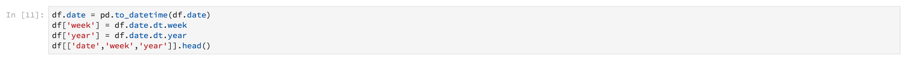
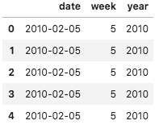
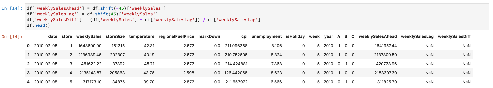
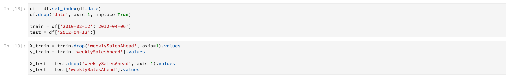

# Présentation de l’espace de travail des sciences de données

Ce fournit une présentation de l’espace de travail Data Science d’Adobe Experience Platform. Plus précisément, nous allons passer en revue le flux de travail général qu&#39;un chercheur de données doit suivre pour résoudre un problème à l&#39;aide de l&#39;apprentissage automatique.

## Conditions préalables

- Un compte Adobe ID enregistré
   - Le compte ID Adobe doit avoir été ajouté à une organisation ayant accès à Adobe Experience Platform et à Data Science Workspace.

## Motivation du chercheur en données

Un détaillant doit faire face à de nombreux défis pour rester compétitif sur le marché actuel. L&#39;une des principales préoccupations du détaillant est de décider du prix optimal de ses produits et de prédire les tendances de vente. Avec un modèle de prévision précis, le détaillant serait en mesure de trouver la relation entre les politiques de demande et de prix et de prendre des décisions de prix optimisées pour maximiser les ventes et les recettes.

## Solution du chercheur en données

La solution d&#39;un chercheur de données consiste à exploiter la richesse des données historiques auxquelles un détaillant a accès, à prédire les tendances futures et à optimiser les décisions de prix. Nous utiliserons les données des ventes passées pour former notre modèle d&#39;apprentissage automatique et nous utiliserons le modèle pour prédire les tendances futures des ventes. Grâce à cela, le détaillant pourra avoir des informations pour les aider à modifier les prix.

Dans cet aperçu, nous allons passer en revue les étapes qu&#39;un chercheur en données ferait pour créer un ensemble de données et un modèle pour prédire les ventes hebdomadaires. Nous passerons en revue les sections suivantes de l’exemple de carnet de ventes au détail sur l’espace de travail Data Science d’Adobe Experience Platform :

- [Configuration](#setup)
- [Exploration des données](#exploring-data)
- [Ingénierie des fonctionnalités](#feature-engineering)
- [Formation et vérification](#training-and-verification)

### Ordinateurs portables dans Data Science Workspace

Tout d&#39;abord, nous voulons créer un bloc-notes JupyterLab pour ouvrir l&#39;exemple de bloc-notes &quot;Ventes au détail&quot;. Suivez les étapes effectuées par le chercheur de données dans le bloc-notes pour mieux comprendre un processus type.

Dans l’interface utilisateur d’Adobe Experience Platform, cliquez sur l’onglet Data Science du menu supérieur pour accéder à Data Science Workspace. A partir de cette page, cliquez sur l&#39;onglet JupyterLab qui ouvrira le lanceur JupyterLab. Vous devriez voir une page similaire à celle-ci.


Dans notre tutoriel, nous utiliserons Python 3 dans le carnet Jupyter pour montrer comment accéder aux données et les explorer. Sur la page Lanceur, vous trouverez des exemples de blocs-notes. Nous utiliserons l&#39;exemple &quot;Ventes au détail&quot; pour Python 3.


### Configuration {#setup}

Avec le bloc-notes Ventes au détail ouvert, la première chose que nous faisons est de charger les bibliothèques requises pour notre flux de travail. Le suivant  une brève description de ce à quoi chacun sert :
- **numpy** - bibliothèque de calcul scientifique qui ajoute la prise en charge de tableaux et de matrices multidimensionnels volumineux
- **pandas** - bibliothèque  les structures et opérations de données  utilisées pour la manipulation de données et les  de 
- **matplotlib.pyplot** - bibliothèque de mappage qui fournit une expérience de type MATLAB lors du mappage
- **seaborn** - bibliothèque de visualisation des données d’interface de haut niveau basée sur matplotlib
- **sklearn** - bibliothèque d’apprentissage automatique qui comprend la classification, la régression, le vecteur de prise en charge et les algorithmes de cluster
- **avertissements** - bibliothèque qui contrôle les messages d’avertissement

### Exploration des données {#exploring-data}

#### Charger des données

Une fois les bibliothèques chargées, nous pouvons en regardant les données. Le code Python suivant utilise la structure de `DataFrame` données des pandas et la fonction [read_csv()](https://pandas.pydata.org/pandas-docs/stable/generated/pandas.read_csv.html#pandas.read_csv) pour lire le fichier CSV hébergé sur Github dans le DataFrame des pandas :


La structure de données DataFrame de Pandas est une structure de données étiquetées en deux dimensions. Pour voir rapidement les dimensions de nos données, nous pouvons utiliser `df.shape`. Cette opération renvoie un tuple qui représente la dimension du DataFrame :


Enfin, nous pouvons jeter un oeil à ce à quoi ressemblent nos données. Nous pouvons utiliser `df.head(n)` pour les premières `n` lignes du DataFrame :


#### Résumé statistique

Nous pouvons exploiter la bibliothèque de pandas de Python pour obtenir le type de données de chaque attribut. La sortie de l’appel suivant nous donnera des informations sur le nombre d’entrées et le type de données pour chacune des colonnes :

```PYTHON
df.info()
```


Ces informations sont utiles car connaître le type de données de chaque colonne nous permettra de savoir comment traiter les données.

Maintenant regardons le résumé statistique. Seuls les types de données numériques s’affichent `date`, `storeType`et `isHoliday` ne sont pas générés :

```PYTHON
df.describe()
```


Avec cela, nous pouvons voir qu&#39;il y a 6435 instances pour chaque caractéristique. De plus, des informations statistiques telles que moyenne, écart type (std), min, max et interquartiles sont fournies. Cela nous donne des informations sur l&#39;écart pour les données. Dans la section suivante, nous allons passer en revue la visualisation qui fonctionne avec ces informations pour nous donner une compréhension complète de nos données.

En examinant les valeurs minimale et maximale pour `store`, nous voyons qu’il existe 45 magasins uniques que les données représentent. Il y a aussi `storeTypes` qui différencient ce qu&#39;est un magasin. Nous pouvons voir la distribution de `storeTypes` en procédant comme suit :


Cela signifie que 22 magasins sont de `storeType A` , 17 `storeType B`, et 6 `storeType C`de.

#### Visualiser les données

Maintenant que nous connaissons les valeurs de nos cadres de données, nous voulons compléter cela par des visualisations pour rendre les choses plus claires et plus faciles à identifier les modèles. Ces graphiques sont également utiles pour transmettre les résultats à un  .

#### Graphiques univariés

Les graphiques univariés sont des tracés d’une variable individuelle. Un graphique univoque courant utilisé pour visualiser vos données est un graphique à boîte et à fouetter.

En utilisant notre jeu de données de vente au détail d&#39;avant, nous pouvons générer le schéma de boîte et de whisky pour chacun des 45 magasins et leurs ventes hebdomadaires. Le graphique est généré à l’aide de la `seaborn.boxplot` fonction.


Un graphique à boîte et à whisky est utilisé pour montrer la distribution des données. Les lignes extérieures du graphique montrent les quartiles supérieur et inférieur tandis que la boîte s&#39;étend sur la plage interquartile. La ligne de la zone indique la médiane. Tout point de données plus de 1,5 fois le quartile supérieur ou inférieur est marqué comme un cercle. Ces points sont considérés comme des valeurs aberrantes.

Ensuite, nous pouvons tracer les ventes hebdomadaires avec le temps. Nous ne montrerons que la sortie du premier magasin. Le code du bloc-notes génère 6 tracés correspondant à 6 des 45 magasins de notre jeu de données.


Ce diagramme permet de comparer les ventes hebdomadaires sur une période de 2 ans. Il est facile de voir les pics de vente et les schémas de creux au fil du temps.

#### Graphiques multivariés

Les tracés multivariés sont utilisés pour visualiser l’interaction entre les variables. Avec la visualisation, les chercheurs de données peuvent voir s’il existe des corrélations ou des modèles entre les variables. Un graphique multivarié courant utilisé est une matrice de corrélation. Avec une matrice de corrélation, les dépendances entre plusieurs variables sont quantifiées avec le coefficient de corrélation.

En utilisant le même jeu de données de vente au détail, nous pouvons générer la matrice de corrélation.


Remarquez la diagonale de ceux qui sont au centre. Cela montre que lorsqu’une variable est comparée à elle-même, elle présente une corrélation positive complète. Une forte corrélation positive aura une magnitude proche de 1, tandis que des corrélations faibles seront plus proches de 0. Une corrélation négative est montrée avec un coefficient négatif montrant une tendance inverse.

### Ingénierie des fonctionnalités {#feature-engineering}

Dans cette section, nous apporterons des modifications à notre jeu de données de vente au détail. Nous effectuerons les opérations suivantes :

- ajouter des colonnes semaine et année
- convertir storeType en variable d’indicateur
- convertir isHoliday en variable numérique
- prévoir les ventes hebdomadaires de la semaine prochaine

#### Colonnes Ajouter semaine et année

Le format actuel de la date (`2010-02-05`) est difficile à différencier selon que les données sont pour chaque semaine. C’est pourquoi nous convertissons la date en semaine et en année.



La semaine et la date sont désormais les suivantes :



#### Convertir le type de magasin en variable indicateur

Ensuite, nous voulons convertir la colonne storeType en colonnes représentant chacune `storeType`. Il existe 3 types de magasins, (`A`, `B`, `C`), à partir desquels nous créons 3 nouvelles colonnes. La valeur définie dans chaque colonne sera une valeur booléenne, où &quot;1&quot; sera défini selon ce que `storeType` &#39;était et `0` pour les 2 autres colonnes.


La `storeType` colonne active sera supprimée.

#### Convertir isHoliday en type numérique

La modification suivante consiste à remplacer la valeur booléenne par une représentation numérique. `isHoliday`


#### Prédire les ventes hebdomadairesLa semaine prochaine

Nous voulons maintenant ajouter les ventes hebdomadaires précédentes et futures à chacun de nos ensembles de données. Nous le faisons en compensant notre `weeklySales`action. De plus, nous calculons la `weeklySales` différence. Pour ce faire, il faut se soustraire `weeklySales` à celle de la semaine précédente `weeklySales`.



Puisque nous compensons les `weeklySales` données 45 et 45 pour créer de nouvelles colonnes, les 45 premiers et les 45 derniers points de données auront des valeurs NaN. Nous pouvons supprimer ces points de notre jeu de données en utilisant la `df.dropna()` fonction qui supprime toutes les lignes qui ont des valeurs NaN.


Vous trouverez ci-dessous un résumé du jeu de données après les modifications apportées :


### Formation et vérification {#training-and-verification}

Il est maintenant temps de créer quelques modèles des données et de sélectionner le modèle qui sera le plus performant pour prédire les ventes futures. Nous évaluerons les 5 algorithmes suivants :

- Régression linéaire
- Arborescence de décision
- Forêt aléatoire
- Augmentation du dégradé
- K Voisins

#### Scinder le jeu de données en sous-ensembles de formation et de test

Nous avons besoin d&#39;un moyen de savoir à quel point notre modèle sera capable de prédire les valeurs. Cette évaluation peut être effectuée en allouant une partie du jeu de données à utiliser comme validation et le reste comme données de formation. Puisque `weeklySalesAhead` sont les valeurs futures réelles de `weeklySales`, nous pouvons les utiliser pour évaluer la précision du modèle dans la prédiction de la valeur. Le fractionnement se fait comme suit :



Nous avons maintenant `X_train` et `y_train` pour préparer les modèles et `X_test` `y_test` et pour l&#39;évaluation ultérieure.

#### Algorithmes de contrôle des tons directs

Dans cette section, nous déclarerons tous les algorithmes dans un tableau appelé `model`. Ensuite, nous itérons à travers ce tableau et pour chaque algorithme, nous saisissons nos données de formation avec `model.fit()` lesquelles crée un modèle `mdl`. En utilisant ce modèle, nous prédirons `weeklySalesAhead` avec nos `X_test` données.


Pour le score, nous prenons la différence moyenne en pourcentage entre les valeurs prédites `weeklySalesAhead` et les valeurs réelles dans les `y_test` données. Puisque nous voulons minimiser la différence entre notre prédiction et la réalité, le régresseur d&#39;amplification du dégradé est le modèle le plus performant.

#### Visualiser les prédictions

Enfin, nous visualiserons notre modèle de prédiction avec les valeurs de ventes hebdomadaires réelles. La ligne bleue représente les chiffres réels, tandis que la ligne verte représente notre prévision à l&#39;aide de l&#39;augmentation du dégradé. Le code suivant génère 6 tracés qui représentent 6 des 45 magasins de notre jeu de données. Seul `Store 1` est illustré ici :


<!--TODO UI Flow> -->

## Conclusion

Avec cet aperçu, nous avons passé en revue le processus qu&#39;un chercheur en données suivrait pour résoudre un problème de vente au détail. Plus précisément, nous avons suivi les étapes suivantes pour parvenir à une solution qui prévoit des ventes hebdomadaires futures.

- [Configuration](#setup)
- [Exploration des données](#exploring-data)
- [Ingénierie des fonctionnalités](#feature-engineering)
- [Formation et vérification](#training-and-verification)