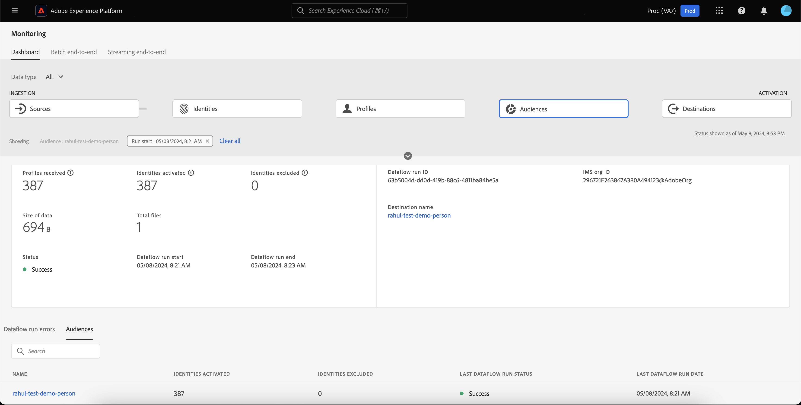

# Surveillance des flux de données pour les audiences dans l’interface utilisateur

Segmentation Service vous permet de créer des audiences par le biais de définitions de segment ou d’autres sources à partir de vos données [!DNL Real-Time Customer Profile]. Experience Platform fournit des flux de données pour suivre de manière transparente ce flux de données des sources vers les destinations.

Utilisez le tableau de bord de surveillance pour afficher une représentation visuelle de l’activité des données dans une audience, y compris le statut de la segmentation de vos données. Lisez le tutoriel pour savoir comment utiliser le tableau de bord de surveillance pour surveiller la segmentation de vos données à l’aide de l’interface utilisateur d’Experience Platform, ce qui vous permet de suivre le statut des tâches d’activation, d’évaluation et d’exportation d’audience.

## Prise en main {#getting-started}

Ce guide nécessite une compréhension professionnelle des composants suivants d’Adobe Experience Platform :

- [Flux de données](../home.md) : les flux de données sont une représentation des tâches de données qui déplacent ces dernières dans Experience Platform. Les flux de données sont configurés sur différents services, ce qui permet de déplacer les données des connecteurs sources vers des jeux de données cibles, vers [!DNL Identity] et [!DNL Profile], et vers [!DNL Destinations].
   - [Exécutions de flux de données](../../sources/notifications.md) : les exécutions de flux de données sont les tâches planifiées récurrentes en fonction de la configuration de la fréquence des flux de données sélectionnés.
- [Segmentation](../../segmentation/home.md) : la segmentation vous permet de créer des audiences à partir de vos données du profil client en temps réel.
   - [Tâches d’activation](../../destinations/ui/activation-overview.md) : une tâche d’activation est utilisée pour activer votre audience vers une destination spécifiée.
   - [Tâches d’évaluation &#x200B;](../../segmentation/tutorials/evaluate-a-segment.md#evaluate-a-segment) : une tâche d’évaluation est un processus asynchrone qui évalue l’audience.
   - [&#x200B; Tâches d’exportation &#x200B;](../../segmentation/api/export-jobs.md) : une tâche d’exportation est un processus asynchrone utilisé pour conserver les membres de l’audience dans des jeux de données.
- [Sandbox](../../sandboxes/home.md) : [!DNL Experience Platform] fournit des sandbox virtuels qui divisent une instance [!DNL Experience Platform] unique en environnements virtuels distincts pour favoriser le développement et l’évolution d’applications d’expérience digitale.

## Tableau de bord de surveillance des audiences {#monitoring-audiences-dashboard}

>[!CONTEXTUALHELP]
>id="platform_monitoring_segments"
>title="Audiences"
>abstract="La vue des audiences contient des informations sur toutes les audiences de votre organisation, ainsi que des informations supplémentaires sur leurs traitements d’activation et d’évaluation."

Pour accéder au tableau de bord **[!UICONTROL Audiences]**, sélectionnez **[!UICONTROL Surveillance]** dans le volet de navigation de gauche. Une fois sur la page **[!UICONTROL Surveillance]**, sélectionnez la vignette **[!UICONTROL Audiences]**.

Dans le tableau de bord principal **[!UICONTROL Audiences]**, la carte **[!UICONTROL Audiences]** affiche le statut et la date du dernier traitement d’évaluation et du dernier traitement d’exportation.

Le tableau de bord lui-même contient des mesures pour les audiences et les tâches de segmentation. Par défaut, le tableau de bord affiche les mesures d’audience des dernières 24 heures. Pour en savoir plus sur la vue des tâches de segmentation, consultez la section [surveillance des tâches de segmentation](#monitoring-segmentation-jobs-dashboard).

>[!IMPORTANT]
>
>Actuellement, seules les audiences activées vers des destinations [par lots (basées sur des fichiers)](../../destinations/destination-types.md#file-based) sont prises en charge pour le tableau de bord de surveillance des audiences.

Les mesures suivantes sont disponibles pour cette vue de tableau de bord :

| Mesure | Description |
| ------ | ----------- |
| **[!UICONTROL Nom de l’audience]** | Nom de l’audience. |
| **[!UICONTROL Type de données]** | Type de données de l’audience. Les valeurs possibles sont les suivantes : **[!UICONTROL Client]**, **[!UICONTROL Compte]** et **[!UICONTROL Prospect]**. Vous pouvez afficher les audiences d’un type de données spécifié à l’aide du filtre [!UICONTROL Type de données] situé au-dessus du ruban de cartes. |
| **[!UICONTROL Date et heure de la dernière évaluation]** | Date et heure de la dernière exécution de la tâche d’évaluation de l’audience. |
| **[!UICONTROL Statut de la dernière évaluation]** | Statut de la dernière tâche d’évaluation de l’audience. Les valeurs possibles sont les suivantes : **[!UICONTROL Succès]**, **[!UICONTROL Aucune exécution]** et **[!UICONTROL Échec]**. |
| **[!UICONTROL Méthode de la dernière évaluation]** | Méthode d’évaluation de l’audience. Étant donné que seule la segmentation par lots est prise en charge, la seule valeur possible est **[!UICONTROL Lot]**. |
| **[!UICONTROL Profils de la dernière évaluation]** | Nombre de profils évalués dans la dernière tâche d’évaluation de l’audience. |
| **[!UICONTROL Date et heure de la dernière activation]** | Date et heure de la dernière exécution de la tâche d’activation de l’audience. |
| **[!UICONTROL Statut de la dernière activation]** | Statut de la dernière tâche d’activation de l’audience. Les valeurs possibles sont les suivantes : **[!UICONTROL Succès]**, **[!UICONTROL Aucune exécution]** et **[!UICONTROL Échec]**. |
| **[!UICONTROL Identités de la dernière activation]** | Nombre d’identités activées dans la dernière tâche d’activation de l’audience. |
| **[!UICONTROL Destination de la dernière activation]** | Nom de la destination vers laquelle la dernière tâche d’activation de l’audience a été activée. |

Vous pouvez filtrer les résultats pour une audience spécifique et afficher ses tâches de segmentation en sélectionnant l’icône de filtre (). Les tâches de segmentation sont triées par ordre chronologique, les tâches de segmentation les plus récentes apparaissant en premier.

Le tableau de bord de l’audience filtrée s’affiche. La carte **[!UICONTROL Audiences]** affiche le statut et la date de la dernière tâche d’évaluation et de la dernière tâche d’activation.

Le tableau de bord lui-même affiche l’heure et le statut des dernières tâches d’évaluation et d’activation, un graphique indiquant le nombre de profils de l’évaluation de l’audience et les mesures des tâches de segmentation exécutées. Par défaut, le tableau de bord affiche les mesures des tâches de segmentation pour les dernières 24 heures.

Les mesures suivantes sont disponibles pour cette vue de tableau de bord :

| Mesure | Description |
| ------ | ----------- |
| **[!UICONTROL Début du traitement]** | Date et heure de début de la tâche de segmentation. |
| **[!UICONTROL Type]** | Indique le type de la tâche de segmentation. Les deux types de traitement pris en charge sont les traitements **activation** et **évaluation**. |
| **[!UICONTROL Traitement terminé]** | Date et heure auxquelles la tâche de segmentation s’est terminée. |
| **[!UICONTROL Temps de traitement]** | Temps nécessaire à la fin de la tâche de segmentation. |
| **[!UICONTROL Statut de la tâche]** | Statut de la tâche de segmentation. Les valeurs prises en charge sont **[!UICONTROL Succès]**, **[!UICONTROL En cours]** et **[!UICONTROL Échec]**. |
| **[!UICONTROL Nombre de profils]** | Nombre de profils que la tâche de segmentation évalue. Chaque utilisateur doit avoir un profil unique. |
| **[!UICONTROL Identité activée]** | Nombre d’identités activées par la tâche de segmentation. Chaque profil peut avoir plusieurs identités. Par exemple, un profil peut avoir comme identités une adresse e-mail, un numéro de téléphone et un numéro de fidélité. |
| **[!UICONTROL Nom de la destination]** | Nom de la destination vers laquelle la tâche de segmentation est activée. |

Vous pouvez filtrer de manière plus détaillée une tâche de segmentation spécifique et consulter ses détails en sélectionnant l’icône de filtre (). Il existe deux types différents de tâches de segmentation qui peuvent être filtrées : les tâches d’activation et les tâches d’évaluation.

### Détails du traitement d’activation {#activation-job-details}

La page Détails de l’exécution du flux de données de la tâche d’activation affiche des informations sur les mesures de l’exécution, les erreurs d’exécution du flux de données et les audiences associées à la tâche de segmentation. Une tâche d’activation permet d’activer votre audience pour une destination spécifiée.

Les mesures suivantes sont disponibles pour cette vue de tableau de bord :

| Mesure | Description |
| ------ | ----------- |
| **[!UICONTROL Profils reçus]** | Nombre total de profils reçus dans le flux d’activation. |
| **[!UICONTROL Identités activées]** | Nombre total d’identités activées avec succès vers la destination, en fonction des profils reçus. |
| **[!UICONTROL Identités exclues]** | Nombre total d’identités qui ont été exclues de l’activation vers la destination, en fonction des profils reçus. Ces identités peuvent être exclues en raison d’attributs manquants ou de violations du consentement. |
| **[!UICONTROL Taille des données]** | Taille du flux de données en cours d’activation. |
| **[!UICONTROL Nombre total de fichiers]** | Nombre total de fichiers activés dans le flux de données. |
| **[!UICONTROL Statut]** | Statut actuel de la tâche d’activation. |
| **[!UICONTROL Démarrage de l’exécution du flux de données]** | Date et heure de début de la tâche d’activation. |
| **[!UICONTROL Fin de l’exécution du flux de données]** | Date et heure auxquelles la tâche d’activation s’est terminée. |
| **[!UICONTROL ID d’exécution du flux de données]** | Identifiant de la tâche d’activation actuelle. |
| **[!UICONTROL ID d’organisation IMS]** | Identifiant de l’organisation à laquelle appartient la tâche d’activation. |
| **[!UICONTROL Nom de la destination]** | Nom de la destination vers laquelle les données sont activées. |

Sous la section Audiences , vous pouvez voir une liste des audiences qui ont été activées dans le cadre de la tâche d’activation.

Pour la section Audiences , les mesures suivantes sont disponibles :

| Mesure | Description |
| ------ | ----------- |
| **[!UICONTROL Nom]** | Nom de l’audience qui a été activée. |
| **[!UICONTROL Identités activées]** | Nombre total d’identités activées avec succès vers la destination, en fonction des profils reçus. |
| **[!UICONTROL Identités exclues]** | Nombre total d’identités qui ont été exclues de l’activation vers la destination, en fonction des profils reçus. Ces identités peuvent être exclues en raison d’attributs manquants ou d’une violation du consentement. |
| **[!UICONTROL Statut de la dernière exécution du flux de données]** | Statut de la dernière tâche d’activation exécutée pour cette audience. |
| **[!UICONTROL Date de la dernière exécution du flux de données]** | Date et heure de la dernière tâche d’activation exécutée pour cette audience. |

Vous pouvez également afficher des détails sur les erreurs d’exécution du flux de données. Sous la section Erreurs d’exécution du flux de données , vous pouvez afficher à la fois les identités ayant échoué et celles qui ont été exclues. La section Erreurs comprend des détails sur le code d’erreur et le nombre d’identités ayant échoué ou exclues.

### Détails de la tâche d’évaluation {#evaluation-job-details}

La page Détails de l’exécution du flux de données de la tâche d’évaluation affiche des informations sur les mesures et les audiences de l’exécution liées à la tâche de segmentation.

Les mesures suivantes sont disponibles pour cette vue de tableau de bord :

| Mesure | Description |
| ------ | ----------- |
| **[!UICONTROL Nombre total de profils]** | Nombre total de profils en cours d’évaluation. |
| **[!UICONTROL Statut]** | Statut de la tâche d’évaluation. Les statuts possibles de la tâche d’évaluation sont **[!UICONTROL Succès]** et **[!UICONTROL Échec]**. |
| **[!UICONTROL Début du traitement]** | Date et heure de début de la tâche d’évaluation. |
| **[!UICONTROL Fin de la tâche]** | Date et heure de fin de la tâche d’évaluation. |
| **[!UICONTROL Type de traitement]** | Type de tâche de segmentation. Dans ce cas, il s’agira toujours d’une tâche d’**[!UICONTROL évaluation de segment]**. |
| **[!UICONTROL Type d’évaluation]** | Le type d&#39;évaluation qui est en cours. Il peut s’agir de **[!UICONTROL Lot]** ou **[!UICONTROL Diffusion en continu]**. |
| **[!UICONTROL Identifiant de tâche]** | Identifiant de la tâche d’évaluation. |
| **[!UICONTROL ID d’organisation IMS]** | Identifiant de l’organisation à laquelle appartient la tâche d’évaluation. |
| **[!UICONTROL Nom de l’audience]** | Nom de l’audience en cours d’évaluation. |
| **[!UICONTROL ID de l’audience]** | Identifiant de l’audience en cours d’évaluation. |

Sous la section [!UICONTROL Audiences], vous pouvez voir une liste des audiences qui sont évaluées dans le cadre de la tâche d’évaluation. Vous pouvez filtrer la liste des audiences par nom à l’aide de la barre de recherche.

>[!IMPORTANT]
>
>Cette vue de tableau de bord prend actuellement en charge jusqu’à 800 mesures d’audience.

Pour la section [!UICONTROL Audiences], les mesures suivantes sont disponibles :

| Mesure | Description |
| ------ | ----------- |
| **[!UICONTROL Nom]** | Nom de l’audience en cours d’évaluation. |
| **[!UICONTROL Nombre de profils]** | Nombre de profils en cours d’évaluation. |

## Tableau de bord de surveillance des traitements de segmentation {#monitoring-segmentation-jobs-dashboard}

>[!CONTEXTUALHELP]
>id="platform_monitoring_segment_jobs"
>title="Traitements de segmentation"
>abstract="La vue des traitements de segmentation contient des informations sur les traitements d’évaluation et d’export pour toutes vos audiences."

Pour accéder au tableau de bord **[!UICONTROL Tâches de segmentation]**, sélectionnez **[!UICONTROL Tâches de segmentation]** dans le tableau de bord [!UICONTROL Audiences]. Le tableau de bord [!UICONTROL Surveillance] contient des mesures et des informations sur les tâches d’évaluation et d’exportation.

>[!NOTE]
>
>Seuls les **traitements d’évaluation de segmentation** sont pris en charge pour la surveillance par audience. Les traitements d’exportation de segmentation ne prennent en charge que la surveillance au niveau de l’organisation.

Utilisez le tableau de bord [!UICONTROL Tâches de segmentation] pour comprendre si l’évaluation et l’exportation des profils se produisent à temps et sans exception, de sorte que les services en aval pour l’activation de destination puissent disposer des données de profil évaluées les plus récentes.

Les mesures suivantes sont disponibles pour les tâches de segmentation :

| Mesure | Description |
| ------ | ----------- |
| **[!UICONTROL Traitement de segmentation]** | Indique le nom de la tâche de segmentation. |
| **[!UICONTROL Type]** | Indique le type de tâche de segmentation : exportation ou évaluation. Notez que dans les deux cas, la tâche de segmentation évalue ou exporte **toutes** les audiences appartenant à une organisation. Pour en savoir plus sur les tâches d’exportation, consultez le guide sur le point d’entrée [tâches d’exportation](../../segmentation/api/export-jobs.md). Pour en savoir plus sur les tâches d’évaluation, consultez le tutoriel sur [l’évaluation d’une définition de segment](../../segmentation/tutorials/evaluate-a-segment.md#evaluate-a-segment). |
| **[!UICONTROL Début du traitement]** | Date et heure de début de la tâche de segmentation. |
| **[!UICONTROL Fin de la tâche]** | Date et heure auxquelles la tâche de segmentation s’est terminée. |
| **[!UICONTROL Statut]** | Statut de la tâche terminée. Les statuts possibles de la tâche de segmentation sont Succès ou Échec. |
