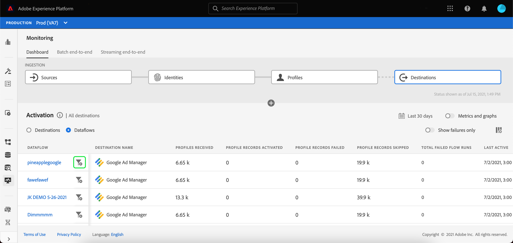

# Surveillance des flux de données pour les destinations dans l’interface utilisateur

Les destinations vous permettent d’activer vos données de Adobe Experience Platform vers d’innombrables partenaires externes. Platform facilite le processus de suivi du flux de données vers vos destinations en fournissant de la transparence avec les flux de données.

Le tableau de bord de surveillance fournit une représentation visuelle du parcours d’un flux de données, y compris la destination vers laquelle les données sont activées. Ce tutoriel explique comment surveiller les flux de données directement dans l’espace de travail des destinations ou utiliser le tableau de bord de surveillance pour surveiller les flux de données pour vos destinations à l’aide de l’interface utilisateur Experience Platform.

## Prise en main

Ce guide nécessite une compréhension professionnelle des composants suivants d’Adobe Experience Platform :

- [Flux de données](../home.md) : les flux de données sont une représentation des tâches de données qui déplacent ces dernières dans Platform. Les flux de données sont configurés sur différents services, ce qui permet de déplacer les données des connecteurs sources vers des jeux de données cibles, vers [!DNL Identity] et [!DNL Profile], et vers [!DNL Destinations].
   - [Exécutions de flux de données](../../sources/notifications.md): Les exécutions de flux de données sont les tâches planifiées récurrentes en fonction de la configuration de fréquence des flux de données sélectionnés.
- [Destinations](../../destinations/home.md): Les destinations sont des intégrations préconfigurées aux applications courantes qui permettent l’activation transparente des données de Platform pour les campagnes marketing cross-canal, les campagnes par e-mail, la publicité ciblée et de nombreux autres cas d’utilisation.
- [Environnements de test](../../sandboxes/home.md) : [!DNL Experience Platform] fournit des environnements de test virtuels qui divisent une instance [!DNL Platform] unique en environnements virtuels distincts pour favoriser le développement et l’évolution d’applications d’expérience numérique.

## Surveillance des flux de données dans l’espace de travail des destinations

Dans le **[!UICONTROL Destinations]** dans l’interface utilisateur de Platform, accédez à la **[!UICONTROL Parcourir]** et sélectionnez le nom d’une destination que vous souhaitez afficher.

Une liste des flux de données existants s’affiche. Sur cette page se trouve une liste de flux de données affichables, y compris des informations sur leur destination, leur nom d’utilisateur, le nombre de flux de données et leur état.

Pour plus d’informations sur les statuts, voir le tableau suivant :

| État | Description |
| ------ | ----------- |
| Activé | Le `Enabled` Le statut indique qu’un flux de données est principal et qu’il exporte des données en fonction du planning selon lequel il a été fourni. |
| Désactivé | Le `Disabled` L’état indique qu’un flux de données est inactif et n’exporte aucune donnée. |
| En cours de traitement | Le `Processing` Le statut indique qu’un flux de données n’est pas encore principal. Cet état est souvent rencontré immédiatement après la création d’un nouveau flux de données. |
| Erreur | Le `Error` Le statut indique que le processus d’activation d’un flux de données a été interrompu. |

### Exécutions de flux de données pour les destinations de diffusion en continu

>[!CONTEXTUALHELP]
>id="platform_destinations_dataflow_identitiesactivated"
>title="Identités activées"
>abstract="Nombre d’identités de profil individuelles activées avec succès vers la destination sélectionnée."
>additional-url="https://adobe.com/go/destinations-monitor-dataflows-batch-en" text="En savoir plus dans la documentation"

>[!CONTEXTUALHELP]
>id="platform_destinations_dataflow_identitiesexcluded"
>title="Identités exclues"
>abstract="Le nombre d’enregistrements de profil individuels exclus de l’activation pour la destination sélectionnée en fonction des attributs manquants et de la violation du consentement."
>additional-url="https://adobe.com/go/destinations-monitor-dataflows-batch-en" text="En savoir plus dans la documentation"

Pour les destinations de diffusion en continu, la variable [!UICONTROL Exécutions de flux de données] Cet onglet fournit une mise à jour horaire des données de mesure lors de l’exécution de votre flux de données. Les statistiques les plus en vue sont celles portant sur les identités.

Les identités représentent les différentes facettes d’un profil. Par exemple, si un profil contient à la fois un numéro de téléphone et une adresse électronique, il aura deux identités.

Une liste des exécutions individuelles et de leurs mesures spécifiques s’affiche, ainsi que les totaux suivants pour les identités :

- **[!UICONTROL Identités activées]**: Nombre total d’identités de profil qui ont été créées ou mises à jour pour l’activation.
- **[!UICONTROL Identités exclues]**: Nombre total d’identités de profil qui sont ignorées pour activation en fonction des attributs manquants et de la violation du consentement.
- **[!UICONTROL Identités en échec]**: Nombre total d’identités de profil qui ne sont pas activées vers la destination en raison d’erreurs.

Chaque exécution de flux de données individuelle affiche les détails suivants :

- **[!UICONTROL Démarrage de l’exécution du flux de données]**: Heure à laquelle le flux de données a commencé.
- **[!UICONTROL Temps de traitement]**: Le temps nécessaire au traitement du flux de données.
- **[!UICONTROL Profils reçus]**: Nombre total de profils reçus dans le flux de données.
- **[!UICONTROL Identités activées]**: Nombre total d’identités de profil qui ont été activées avec succès vers la destination sélectionnée.
- **[!UICONTROL Identités exclues]**: Le nombre total d’identités de profil qui sont exclues pour l’activation en fonction des attributs manquants et de la violation du consentement.
- **[!UICONTROL Identités en échec]** Nombre total d’identités de profil qui ne sont pas activées vers la destination en raison d’erreurs.
- **[!UICONTROL Taux d&#39;activation]**: Pourcentage d’identités reçues qui ont été activées ou ignorées avec succès. La formule suivante illustre le mode de calcul de cette valeur :
   
- **[!UICONTROL État]**: Représente l’état dans lequel se trouve le flux de données : both [!UICONTROL Terminé] ou [!UICONTROL Traitement]. [!UICONTROL Terminé] signifie que toutes les identités de l’exécution de flux de données correspondante ont été exportées au cours de la période d’une heure. [!UICONTROL Traitement] signifie que l’exécution du flux de données n’est pas encore terminée.

Pour afficher les détails d’une exécution de flux de données spécifique, sélectionnez l’heure de début de l’exécution dans la liste.

La page des détails d’une exécution de flux de données contient des informations supplémentaires telles que le nombre de profils reçus, le nombre d’identités activées, le nombre d’identités ayant échoué et le nombre d’identités exclues.

La page Détails affiche également une liste des identités qui ont échoué et des identités qui ont été exclues. Les informations relatives aux identités ayant échoué et exclues s’affichent, notamment le code d’erreur, le nombre d’identités et la description. Par défaut, la liste affiche les identités ayant échoué. Pour afficher les identités ignorées, sélectionnez la variable **[!UICONTROL Identités exclues]** bascule.

### Les flux de données s’exécutent pour les destinations par lots.

Pour les destinations par lot, la variable [!UICONTROL Exécutions de flux de données] fournit des données de mesure sur vos exécutions de flux de données. Une liste des exécutions individuelles et de leurs mesures spécifiques s’affiche, ainsi que les totaux suivants pour les identités :

- **[!UICONTROL Identités activées]**: Nombre d’identités de profil individuelles activées avec succès vers la destination sélectionnée.
- **[!UICONTROL Identités exclues]**: Le nombre d’identités de profil individuelles exclues pour l’activation pour la destination sélectionnée, en fonction des attributs manquants et de la violation du consentement.

Chaque exécution de flux de données individuelle affiche les détails suivants :

- **[!UICONTROL Démarrage de l’exécution du flux de données]**: Heure à laquelle le flux de données a commencé.
- **[!UICONTROL Temps de traitement]**: Le temps nécessaire au traitement du flux de données.
- **[!UICONTROL Profils reçus]**: Nombre total de profils reçus dans le flux de données. Cette valeur est mise à jour toutes les 60 minutes.
- **[!UICONTROL Identités activées]**: Nombre total d’identités de profil qui ont été activées avec succès vers la destination sélectionnée.
- **[!UICONTROL Identités exclues]**: Le nombre total d’identités de profil qui sont exclues pour l’activation en fonction des attributs manquants et de la violation du consentement.
- **[!UICONTROL État]**: Représente l’état dans lequel se trouve le flux de données. Il peut s’agir de l’un des trois états suivants : [!UICONTROL Succès], [!UICONTROL En échec], et [!UICONTROL Traitement]. [!UICONTROL Succès] signifie que le flux de données est principal et qu’il exporte des données selon le planning indiqué. [!UICONTROL En échec] signifie que l’activation des données a été suspendue en raison d’erreurs. [!UICONTROL Traitement] signifie que le flux de données n’est pas encore principal et qu’il est généralement rencontré lors de la création d’un nouveau flux de données.

Pour afficher les détails d’une exécution de flux de données spécifique, sélectionnez l’heure de début de l’exécution dans la liste.

>[!NOTE]
>
>Les exécutions de flux de données sont générées en fonction de la fréquence de planification du flux de données de destination. Une exécution de flux de données distincte est effectuée pour chaque stratégie de fusion appliquée à un segment.

La page de détails d’un flux de données, en plus des détails affichés dans la liste des flux de données, affiche des informations plus spécifiques sur le flux de données :

- **[!UICONTROL Taille des données]**: Taille du flux de données en cours d’exportation.
- **[!UICONTROL Fichiers totaux]**: Nombre total de fichiers exportés dans le flux de données.
- **[!UICONTROL Dernière mise à jour]**: Heure de la dernière mise à jour du flux de données.

La page Détails affiche également une liste des identités qui ont échoué et des identités qui ont été exclues. Les informations relatives aux identités ayant échoué et exclues s’affichent, y compris le code d’erreur et la description. Par défaut, la liste affiche les identités ayant échoué. Pour afficher les identités exclues, sélectionnez la variable **[!UICONTROL Identités exclues]** bascule.

## Tableau de bord de surveillance des destinations {#monitoring-destinations-dashboard}

Pour accéder au [!UICONTROL Surveillance] tableau de bord, sélectionnez **[!UICONTROL Surveillance]** () dans le volet de navigation de gauche. Une fois sur le [!UICONTROL Surveillance] page, sélectionnez [!UICONTROL Destinations]. Le [!UICONTROL Surveillance] Le tableau de bord contient des mesures et des informations sur les tâches d’exécution de destination.

Le panneau Activation se trouve au centre du tableau de bord. Il contient des mesures et des graphiques qui affichent les données sur le taux d’activation des données exportées vers les destinations.

Par défaut, les données affichées contiennent les taux d&#39;activation des dernières 24 heures. Sélectionner **[!UICONTROL 24 dernières heures]** pour ajuster la période des enregistrements affichés. Les options disponibles incluent : **[!UICONTROL 24 dernières heures]**, **[!UICONTROL 7 derniers jours]**, et **[!UICONTROL 30 derniers jours]**. Vous pouvez également sélectionner les dates dans la fenêtre contextuelle du calendrier qui s’affiche. Une fois que vous avez sélectionné des dates, sélectionnez **[!UICONTROL Appliquer]** pour ajuster la période des informations affichées.

>[!NOTE]
>
>La capture d’écran suivante montre le taux d’activation des 30 derniers jours au lieu des 24 dernières heures. Vous pouvez ajuster la période en sélectionnant **[!UICONTROL 30 derniers jours]**.

Le graphique s’affiche par défaut et vous pouvez le désactiver pour développer la liste des destinations ci-dessous. Sélectionnez la **[!UICONTROL Mesures et graphiques]** pour désactiver les graphiques.

Le **[!UICONTROL Activation]** affiche une liste des destinations qui contiennent au moins un compte existant. Cette liste comprend également des informations sur les profils reçus, les enregistrements de profil activés, les enregistrements de profil en échec, les enregistrements de profil ignorés, le nombre total de flux de données en échec et la dernière date mise à jour pour ces destinations.

Vous pouvez également filtrer votre liste de destinations pour n’afficher que la catégorie sélectionnée de destinations. Sélectionnez la **[!UICONTROL Mes destinations]** et sélectionnez le type de destination vers lequel vous souhaitez filtrer.

De plus, vous pouvez saisir une destination dans la barre de recherche pour l’isoler vers une seule destination. Si vous souhaitez afficher les flux de données de la destination, vous pouvez sélectionner le filtre  en regard de pour afficher la liste de ses principaux flux de données.

Si vous souhaitez afficher tous les flux de données existants sur toutes les destinations, sélectionnez **[!UICONTROL Flux de données]**.

Une liste de flux de données s’affiche, regroupée selon la destination. Vous pouvez afficher des détails supplémentaires pour un flux de données spécifique en recherchant la destination à surveiller, en sélectionnant le filtre  en regard de l’élément, puis en sélectionnant le filtre  en regard du flux de données dont vous souhaitez obtenir plus d’informations.

La page des exécutions du flux de données affiche des informations sur vos exécutions de flux de données, notamment l’heure de début de l’exécution du flux de données, l’heure de traitement, les profils reçus, les identités activées, les identités exclues, les identités ayant échoué, le taux d’activation et l’état. Pour afficher plus d’informations sur une exécution de flux de données spécifique, sélectionnez le filtre .  à côté de l’heure de début d’exécution du flux de données.

La page Détails du flux de données, en plus des détails affichés dans la liste des flux de données, affiche des informations plus spécifiques sur le flux de données :

- **[!UICONTROL Identifiant d’exécution du flux de données]**: L’identifiant du flux de données.
- **[!UICONTROL Identifiant de l’organisation IMS]**: L’organisation IMS à laquelle le flux de données appartient.
- **[!UICONTROL Dernière mise à jour]**: Heure de la dernière mise à jour du flux de données.

La page Détails affiche également une liste des identités qui ont échoué et des identités qui ont été exclues. Les informations relatives aux identités ayant échoué et exclues s’affichent, notamment le code d’erreur, le nombre d’identités et la description. Par défaut, la liste affiche les identités ayant échoué. Pour afficher les identités ignorées, sélectionnez la variable **[!UICONTROL Identités exclues]** bascule.

## Étapes suivantes

En suivant ce guide, vous savez maintenant comment surveiller les flux de données pour les destinations par lots et en flux continu, y compris toutes les informations pertinentes telles que le temps de traitement, le taux d’activation et l’état. Pour en savoir plus sur les flux de données dans Platform, veuillez lire le [présentation des flux de données](../home.md). Pour en savoir plus sur les destinations, veuillez lire le [présentation des destinations](../../destinations/home.md).