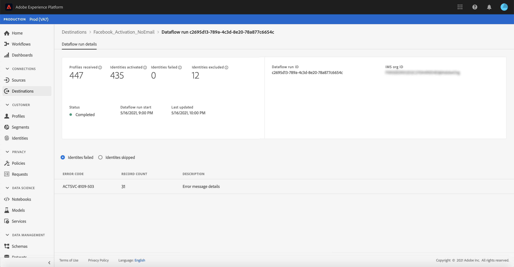

# Surveillance des flux de données pour les destinations dans l’interface utilisateur

Les destinations vous permettent d’activer vos données de Adobe Experience Platform vers d’innombrables partenaires externes. Ce tutoriel explique comment surveiller les flux de données pour vos destinations à l’aide de l’interface utilisateur de l’Experience Platform.

## Prise en main

Ce guide nécessite une compréhension professionnelle des composants suivants d’Adobe Experience Platform :

- [Destinations](../../destinations/home.md) : Les destinations sont des intégrations préconfigurées aux applications courantes qui permettent l’activation transparente des données de Platform pour les campagnes marketing cross-canal, les campagnes par e-mail, la publicité ciblée et de nombreux autres cas d’utilisation.
- [Environnements de test](../../sandboxes/home.md) : [!DNL Experience Platform] fournit des environnements de test virtuels qui divisent une instance [!DNL Platform] unique en environnements virtuels distincts pour favoriser le développement et l’évolution d’applications d’expérience numérique.

## Surveillance des flux de données

Dans l’espace de travail **[!UICONTROL Destinations]** de l’interface utilisateur de Platform, accédez à l’onglet **[!UICONTROL Parcourir]** et sélectionnez le nom d’une destination que vous souhaitez afficher.

Une liste des flux de données existants s’affiche. Sur cette page se trouve une liste de flux de données affichables, y compris des informations sur leur destination, leur nom d’utilisateur, le nombre de flux de données et leur état.

Pour plus d’informations sur les statuts, voir le tableau suivant :

| État | Description |
| ------ | ----------- |
| Activé | L’état `Enabled` indique qu’un flux de données est principal et ingère des données selon le planning qu’il a été fourni. |
| Désactivé | L’état `Disabled` indique qu’un flux de données est inactif et n’ingère aucune donnée. |
| En cours de traitement | L’état `Processing` indique qu’un flux de données n’est pas encore principal. Cet état est souvent rencontré immédiatement après la création d’un nouveau flux de données. |
| Erreur | L’état `Error` indique que le processus d’activation d’un flux de données a été interrompu. |

## Exécutions de flux de données pour les destinations de diffusion en continu

Pour les destinations de diffusion en continu, l’onglet [!UICONTROL Flux de données s’exécute] fournit une mise à jour horaire des données de mesure sur vos exécutions de flux de données. Les statistiques les plus en vue sont celles portant sur les identités.

Les identités représentent les différentes facettes d’un profil. Par exemple, si un profil contient à la fois un numéro de téléphone et une adresse électronique, il aura deux identités.

Une liste des exécutions individuelles et de leurs mesures spécifiques s’affiche, ainsi que les totaux suivants pour les identités :

- **[!UICONTROL Identités activées]** : Nombre total d’identités de profil qui ont été créées ou mises à jour pour l’activation.
- **[!UICONTROL Identités exclues]** : Nombre total d’identités de profil qui sont ignorées pour activation en fonction des attributs manquants et de la violation du consentement.
- **[!UICONTROL Les identités ont échoué]** : Nombre total d’identités de profil qui ne sont pas activées vers la destination en raison d’erreurs.

Chaque exécution de flux de données individuelle affiche les détails suivants :

- **[!UICONTROL Démarrage]** de l’exécution du flux de données : Heure à laquelle le flux de données a commencé.
- **[!UICONTROL Temps]** de traitement : Le temps nécessaire au traitement du flux de données.
- **[!UICONTROL Profils reçus]** : Nombre total de profils reçus dans le flux de données.
- **[!UICONTROL Identités activées]** : Nombre total d’identités de profil qui ont été activées avec succès vers la destination sélectionnée.
- **[!UICONTROL Identités exclues]** : Le nombre total d’identités de profil qui sont exclues pour l’activation en fonction des attributs manquants et de la violation du consentement.
- **[!UICONTROL Identités]** ayant échouéNombre total d’identités de profil qui ne sont pas activées vers la destination en raison d’erreurs.
- **[!UICONTROL Taux]** d&#39;activation : Pourcentage d’identités reçues qui ont été activées ou ignorées avec succès. La formule suivante illustre le mode de calcul de cette valeur :
   
- **[!UICONTROL État]** : Représente l’état dans lequel se trouve le flux de données :   Terminé ou  [!UICONTROL Traitement].  Terminé signifie que toutes les identités pour l’exécution de flux de données correspondante ont été ingérées pendant la période d’une heure.  Le traitement signifie que l’exécution du flux de données n’est pas encore terminée.

Pour afficher les détails d’une exécution de flux de données spécifique, sélectionnez l’heure de début de l’exécution dans la liste.

La page des détails d’une exécution de flux de données contient des informations supplémentaires telles que le nombre de profils reçus, le nombre d’identités activées, le nombre d’identités ayant échoué et le nombre d’identités exclues.

La page Détails affiche également une liste des identités qui ont échoué et des identités qui ont été exclues. Les informations relatives aux identités ayant échoué et exclues s’affichent, notamment le code d’erreur, le nombre d’identités et la description. Par défaut, la liste affiche les identités ayant échoué. Pour afficher les identités ignorées, sélectionnez la bascule **[!UICONTROL Identités exclues]** .

## Les flux de données s’exécutent pour les destinations par lots.

Pour les destinations par lot, l’onglet [!UICONTROL Flux de données s’exécute] fournit des données de mesure sur vos exécutions de flux de données. Une liste des exécutions individuelles et de leurs mesures spécifiques s’affiche, ainsi que les totaux suivants pour les identités :

- **[!UICONTROL Identités activées]** : Nombre d’identités de profil individuelles activées avec succès vers la destination sélectionnée.
- **[!UICONTROL Identités exclues]** : Le nombre d’identités de profil individuelles exclues pour l’activation pour la destination sélectionnée, en fonction des attributs manquants et de la violation du consentement.

Chaque exécution de flux de données individuelle affiche les détails suivants :

- **[!UICONTROL Démarrage]** de l’exécution du flux de données : Heure à laquelle le flux de données a commencé.
- **[!UICONTROL Temps]** de traitement : Le temps nécessaire au traitement du flux de données.
- **[!UICONTROL Profils reçus]** : Nombre total de profils reçus dans le flux de données. Cette valeur est mise à jour toutes les 60 minutes.
- **[!UICONTROL Identités activées]** : Nombre total d’identités de profil qui ont été activées avec succès vers la destination sélectionnée.
- **[!UICONTROL Identités exclues]** : Le nombre total d’identités de profil qui sont exclues pour l’activation en fonction des attributs manquants et de la violation du consentement.
- **[!UICONTROL État]** : Représente l’état dans lequel se trouve le flux de données. Il peut s’agir de l’un des trois états suivants : [!UICONTROL Succès], [!UICONTROL Échec] et [!UICONTROL Traitement].  Une réussite signifie que le flux de données est principal et ingère des données selon le planning fourni.  Échec signifie que l’activation des données a été suspendue en raison d’erreurs.  Le traitement signifie que le flux de données n’est pas encore principal et qu’il est généralement rencontré lors de la création d’un nouveau flux de données.

Pour afficher les détails d’une exécution de flux de données spécifique, sélectionnez l’heure de début de l’exécution dans la liste.

>[!NOTE]
>
>Les exécutions de flux de données sont générées en fonction de la fréquence de planification du flux de données de destination. Une exécution de flux de données distincte est effectuée pour chaque stratégie de fusion appliquée à un segment.

La page de détails d’un flux de données, en plus des détails affichés dans la liste des flux de données, affiche des informations plus spécifiques sur le flux de données :

- **[!UICONTROL Taille des données]** : Taille du flux de données ingéré.
- **[!UICONTROL Total des fichiers]** : Nombre total de fichiers ingérés dans le flux de données.
- **[!UICONTROL Dernière mise à jour]** : Heure de la dernière mise à jour du flux de données.

La page Détails affiche également une liste des identités qui ont échoué et des identités qui ont été exclues. Les informations relatives aux identités ayant échoué et exclues s’affichent, y compris le code d’erreur et la description. Par défaut, la liste affiche les identités ayant échoué. Pour afficher les identités exclues, sélectionnez la bascule **[!UICONTROL Identités exclues]** .

## Étapes suivantes

En suivant ce guide, vous savez maintenant comment surveiller les flux de données pour les destinations par lots et en flux continu, y compris toutes les informations pertinentes telles que le temps de traitement, le taux d’activation et l’état. Pour en savoir plus sur les flux de données dans Platform, consultez la [présentation des flux de données](../home.md). Pour en savoir plus sur les destinations, consultez la [présentation des destinations](../../destinations/home.md).