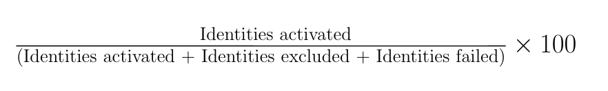

# Surveillance des flux de données pour les destinations dans l’interface utilisateur

Utilisez les différentes destinations du catalogue des Experience Platform pour activer vos données de Platform vers d’innombrables partenaires externes. Platform facilite le processus de suivi du flux de données vers vos destinations en fournissant de la transparence avec les flux de données.

Le tableau de bord de surveillance vous fournit une représentation visuelle du parcours d’un flux de données, y compris la destination vers laquelle les données sont activées, le type de données que vous affichez, les données exportées par exécution de flux de données, et bien plus encore.

Ce tutoriel explique comment surveiller les flux de données directement dans l’espace de travail des destinations ou utiliser le tableau de bord de surveillance pour surveiller les flux de données pour vos destinations à l’aide de l’interface utilisateur Experience Platform.

## Prise en main {#getting-started}

Ce guide nécessite une compréhension professionnelle des composants suivants d’Adobe Experience Platform :

- [Flux de données](../home.md) : les flux de données sont une représentation des tâches de données qui déplacent ces dernières dans Platform. Les flux de données sont configurés sur différents services, ce qui permet de déplacer les données des connecteurs sources vers des jeux de données cibles, vers [!DNL Identity] et [!DNL Profile], et vers [!DNL Destinations].
   - [Exécutions de flux de données](../../sources/notifications.md) : les exécutions de flux de données sont les tâches planifiées récurrentes en fonction de la configuration de fréquence des flux de données sélectionnés.
- [Destinations](../../destinations/home.md) : les destinations sont des intégrations préconfigurées des applications courantes qui permettent l’activation transparente des données de Platform pour les campagnes marketing cross-canal, les campagnes par e-mail, la publicité ciblée et de nombreux autres cas d’utilisation.
- [Sandbox](../../sandboxes/home.md) : [!DNL Experience Platform] fournit des sandbox virtuels qui divisent une instance [!DNL Platform] unique en environnements virtuels distincts pour favoriser le développement et l’évolution d’applications d’expérience digitale.

## Surveillance des flux de données dans l’espace de travail des destinations {#monitor-dataflows-in-the-destinations-workspace}

Dans l’espace de travail **[!UICONTROL Destinations]** de l’interface utilisateur de Platform, accédez à l’onglet **[!UICONTROL Parcourir]** et sélectionnez le nom d’une destination que vous souhaitez afficher.

Une liste des flux de données existants s’affiche. Sur cette page se trouve une liste de flux de données affichables, y compris des informations sur leur destination, leur nom d’utilisateur, le nombre de flux de données et leur état.

Pour plus d’informations sur les états, reportez-vous au tableau suivant :

| État | Description |
| ------ | ----------- |
| Activé | L’état `Enabled` indique qu’un flux de données est actif et qu’il exporte des données selon le planning selon lequel il a été fourni. |
| Désactivé | L’état `Disabled` indique qu’un flux de données est inactif et n’exporte aucune donnée. |
| En cours de traitement | L’état `Processing` indique qu’un flux de données n’est pas encore actif. Cet état est souvent rencontré immédiatement après la création d’un nouveau flux de données. |
| Erreur | L’état `Error` indique que le processus d’activation d’un flux de données a été interrompu. |

### Exécutions de flux de données pour les destinations de diffusion en flux continu {#dataflow-runs-for-streaming-destinations}

>[!CONTEXTUALHELP]
>id="platform_monitoring_dataflow_run_details_activation_streaming"
>title="Détails de l’exécution du flux de données"
>abstract="Les détails de l’exécution du flux de données de destination contiennent des informations sur le statut d’activation d’une audience et et des mesures obtenues à partir du profil client en temps réel pour générer des identités uniques. Pour en savoir plus, consultez le guide des définitions des mesures."

>[!CONTEXTUALHELP]
>id="platform_monitoring_profiles_received_streaming"
>title="Profils reçus"
>abstract="Nombre total de profils reçus dans le flux de données. Cette valeur est mise à jour toutes les 60 minutes."

>[!CONTEXTUALHELP]
>id="platform_destinations_dataflow_identitiesactivated_streaming"
>title="Identités activées"
>abstract="Le nombre d&#39;identités de profil individuel activées avec succès vers la destination sélectionnée. Cette mesure inclut les identités qui sont créées, mises à jour et supprimées dans les audiences exportées."

>[!CONTEXTUALHELP]
>id="platform_destinations_dataflow_identitiesexcluded_streaming"
>title="Identités exclues"
>abstract="Le nombre d&#39;enregistrements de profil individuel exclus de l&#39;activation pour la destination sélectionnée en fonction des attributs manquants et de la violation du consentement."

>[!CONTEXTUALHELP]
>id="platform_destinations_dataflow_identitiesfailed_streaming"
>title="Identités ayant échoué"
>abstract="Le nombre d&#39;identités de profil individuel qui ont échoué pour la destination sélectionnée. Pour plus d&#39;informations, consultez les diagnostics d&#39;erreur."

Pour les destinations de diffusion en continu, l’onglet [!UICONTROL Flux de données en cours] fournit une mise à jour horaire des données de mesure sur vos exécutions de flux de données. Les statistiques les plus en vue sont celles portant sur les identités.

Les identités représentent les différentes facettes d’un profil. Par exemple, si un profil contient à la fois un numéro de téléphone et une adresse électronique, il possède deux identités.

Une liste des exécutions individuelles et de leurs mesures spécifiques s’affiche, ainsi que les totaux suivants pour les identités :

- **[!UICONTROL Identités activées]** : nombre total d’identités de profil activées vers la destination sélectionnée. Cette mesure inclut les identités qui sont créées, mises à jour et supprimées dans les audiences exportées.
- **[!UICONTROL Identités exclues]** : nombre total d’identités de profil qui sont ignorées pour activation en fonction des attributs manquants et de la violation du consentement.
- **[!UICONTROL Échec des identités]** : nombre total d’identités de profil qui ne sont pas activées vers la destination en raison d’erreurs.

Chaque exécution de flux de données individuelle affiche les détails suivants :

- **[!UICONTROL Démarrage de l’exécution du flux de données]** : l’heure à laquelle le flux de données a commencé. Pour les exécutions de flux de données en continu, Experience Platform capture les mesures en fonction du début de l’exécution du flux de données, sous la forme de mesures horaires. Cela signifie que pour les exécutions de flux de données en continu, si une exécution de flux de données a commencé, par exemple à 22 h 30, la mesure affiche l’heure de début sur 22 h dans l’interface utilisateur.
- **[!UICONTROL Temps de traitement]** : temps nécessaire au traitement du flux de données.
   - Pour les exécutions **[!UICONTROL terminées]**, la mesure de temps de traitement affiche toujours une heure.
   - Pour les exécutions de flux de données qui se trouvent toujours à l’état **[!UICONTROL processing]**, la fenêtre permettant de capturer toutes les mesures reste ouverte pendant plus d’une heure, afin de traiter toutes les mesures qui correspondent à l’exécution de flux de données. Par exemple, une exécution de flux de données démarrée à 9h30 peut rester en état de traitement pendant une heure et demie pour capturer et traiter toutes les mesures. Ensuite, une fois que la fenêtre de traitement se ferme et que l’état de l’exécution du flux de données est mis à jour vers **completed**, le temps de traitement affiché est remplacé par une heure.
- **[!UICONTROL Profils reçus]** : nombre total de profils reçus dans le flux de données.
- **[!UICONTROL Identités activées]** : nombre total d’identités de profil qui ont été activées avec succès vers la destination sélectionnée dans le cadre de l’exécution du flux de données. Cette mesure inclut les identités qui sont créées, mises à jour et supprimées dans les audiences exportées.
- **[!UICONTROL Identités exclues]** : nombre total d’identités de profil qui sont exclues de l’activation en raison d’attributs manquants et de la violation du consentement.
- **[!UICONTROL Échec des identités]** : nombre total d’identités de profil qui ne sont pas activées vers la destination en raison d’erreurs.
- **[!UICONTROL Taux d’activation]** : pourcentage d’identités reçues qui ont été activées avec succès ou ignorées. La formule suivante illustre le mode de calcul de cette valeur :
  
- **[!UICONTROL Status]** : représente l’état du flux de données : [!UICONTROL Completed] ou [!UICONTROL Processing]. [!UICONTROL Completed] signifie que toutes les identités de l’exécution de flux de données correspondante ont été exportées au cours de la période d’une heure. [!UICONTROL Traitement] signifie que l’exécution du flux de données n’est pas encore terminée.

Pour afficher les détails d’une exécution de flux de données spécifique, sélectionnez l’heure de début de l’exécution dans la liste.

La page des détails d’une exécution de flux de données contient des informations supplémentaires telles que le nombre de profils reçus, le nombre d’identités activées, le nombre d’identités ayant échoué et le nombre d’identités exclues.

La page Détails affiche également une liste des identités qui ont échoué et des identités qui ont été exclues. Les informations relatives aux identités ayant échoué et exclues s’affichent, notamment le code d’erreur, le nombre d’identités et la description. Par défaut, la liste affiche les identités ayant échoué. Pour afficher les identités ignorées, sélectionnez la bascule **[!UICONTROL Identités exclues]** .

#### (Beta) Surveillance de l’exécution du flux de données au niveau de l’audience pour les destinations de diffusion en continu {#audience-level-dataflow-runs-for-streaming-destinations}

Vous pouvez afficher des informations sur les identités activées, exclues ou ayant échoué, ventilées au niveau de l’audience, pour chaque audience faisant partie du flux de données. Cela peut vous aider à comprendre que la surveillance au niveau de l’audience pour les destinations de diffusion en continu est actuellement disponible uniquement pour la [[!DNL Google Customer Match + Display & Video 360] destination](/help/destinations/catalog/advertising/google-customer-match-dv360.md).

>[!NOTE]
>
>Le nombre de **[!UICONTROL profils reçus]** dans l’onglet Audiences peut ne pas toujours correspondre au nombre de profils reçus pour l’exécution du flux de données. Cela est dû au fait qu’un profil donné peut faire partie de plusieurs audiences activées dans le flux de données.

### Exécutions de flux de données pour les destinations par lots {#dataflow-runs-for-batch-destinations}

>[!CONTEXTUALHELP]
>id="platform_monitoring_dataflow_run_details_activation"
>title="Détails de l’exécution du flux de données"
>abstract="Les détails de l’exécution du flux de données de destination contiennent des informations sur le statut d’activation d’une audience et et des mesures obtenues à partir du profil client en temps réel pour générer des identités uniques. Pour en savoir plus, consultez le guide des définitions des mesures."
>additional-url="https://experienceleague.adobe.com/docs/experience-platform/dataflows/ui/monitor-destinations.html?lang=fr#dataflow-runs-for-streaming-destinations" text="Exécutions de flux de données pour les destinations de diffusion en continu"

>[!CONTEXTUALHELP]
>id="platform_monitoring_profiles_received_batch"
>title="Profils reçus"
>abstract="Nombre total de profils reçus dans le flux de données. Cette valeur est mise à jour toutes les 60 minutes."

>[!CONTEXTUALHELP]
>id="platform_destinations_dataflow_identitiesactivated_batch"
>title="Identités activées"
>abstract="Le nombre d&#39;identités de profil individuel activées avec succès vers la destination sélectionnée. Cette mesure inclut les identités qui sont créées, mises à jour et supprimées dans les audiences exportées."

>[!CONTEXTUALHELP]
>id="platform_destinations_dataflow_identitiesexcluded_batch"
>title="Identités exclues"
>abstract="Le nombre d&#39;enregistrements de profil individuel exclus de l&#39;activation pour la destination sélectionnée en fonction des attributs manquants et de la violation du consentement."

Pour les destinations par lot, l’onglet [!UICONTROL  Exécution de flux de données] fournit des données de mesure sur les exécutions de votre flux de données. Une liste des exécutions individuelles et de leurs mesures spécifiques s’affiche, ainsi que les totaux suivants pour les identités :

- **[!UICONTROL Identités activées]** : nombre total d’identités de profil activées vers la destination sélectionnée. Cette mesure inclut les identités qui sont créées, mises à jour et supprimées dans les audiences exportées.
- **[!UICONTROL Identités exclues]** : nombre d’identités de profil individuelles exclues de l’activation pour la destination sélectionnée, en fonction des attributs manquants et de la violation du consentement.

Chaque exécution de flux de données individuelle affiche les détails suivants :

- **[!UICONTROL Démarrage de l’exécution du flux de données]** : l’heure à laquelle le flux de données a commencé.
- **[!UICONTROL Audience]** : nom de l’audience associée à chaque exécution de flux de données.
- **[!UICONTROL Temps de traitement]** : temps nécessaire au traitement du flux de données.
- **[!UICONTROL Profils reçus]** : nombre total de profils reçus dans le flux de données. Cette valeur est mise à jour toutes les 60 minutes.
- **[!UICONTROL Identités activées]** : nombre total d’identités de profil qui ont été activées avec succès vers la destination sélectionnée dans le cadre de l’exécution du flux de données. Cette mesure inclut les identités qui sont créées, mises à jour et supprimées dans les audiences exportées.
- **[!UICONTROL Identités exclues]** : nombre total d’identités de profil qui sont exclues de l’activation en raison d’attributs manquants et de la violation du consentement.
- **[!UICONTROL Status]** : représente l’état du flux de données. Il peut s’agir de l’un des trois états suivants : [!UICONTROL Succès], [!UICONTROL Échec] et [!UICONTROL Traitement]. [!UICONTROL Success] signifie que le flux de données est actif et exporte des données selon le planning fourni. [!UICONTROL Failed] signifie que l’activation des données a été suspendue en raison d’erreurs. [!UICONTROL Traitement] signifie que le flux de données n’est pas encore actif et est généralement rencontré lors de la création d’un nouveau flux de données.

Pour afficher les détails d’une exécution de flux de données spécifique, sélectionnez l’heure de début de l’exécution dans la liste.

>[!NOTE]
>
>Les exécutions de flux de données sont générées en fonction de la fréquence de planification du flux de données de destination. Une exécution de flux de données distincte est effectuée pour chaque [stratégie de fusion](../../profile/merge-policies/overview.md) appliquée à une audience.

La page de détails d’un flux de données, en plus des détails affichés dans la liste des flux de données, affiche des informations plus spécifiques sur le flux de données :

- **[!UICONTROL Taille des données]** : taille du flux de données en cours d’exportation.
- **[!UICONTROL Total des fichiers]** : nombre total de fichiers exportés dans le flux de données.
- **[!UICONTROL Dernière mise à jour]** : heure de la dernière mise à jour du flux de données.

La page Détails affiche également une liste des identités qui ont échoué et des identités qui ont été exclues. Les informations relatives aux identités ayant échoué et exclues s’affichent, y compris le code d’erreur et la description. Par défaut, la liste affiche les identités ayant échoué. Pour afficher les identités exclues, sélectionnez la bascule **[!UICONTROL Identités exclues]** .

### Afficher dans la surveillance {#view-in-monitoring}

Vous pouvez également choisir d’afficher des informations riches sur un certain flux de données et son flux de données s’exécute dans le tableau de bord de surveillance. Pour afficher des informations sur un flux de données dans le tableau de bord de surveillance :

1. Accédez à l’onglet **[!UICONTROL Connexions]** > **[!UICONTROL Destinations]** > **[!UICONTROL Parcourir]** .
2. Accédez au flux de données que vous souhaitez inspecter.
3. Sélectionnez le symbole représentant des points de suspension et  **[!UICONTROL Afficher dans la surveillance]**.

>[!SUCCESS]
>
>Vous pouvez désormais afficher des informations sur le flux de données et ses exécutions de flux de données associées dans le tableau de bord de surveillance. Pour plus d’informations, consultez la section ci-dessous.

## Tableau de bord de surveillance des destinations {#monitoring-destinations-dashboard}

>[!NOTE]
>
>La fonctionnalité de surveillance des destinations est actuellement prise en charge pour toutes les destinations dans les destinations Experience Platform *à l’exception* des destinations [Adobe Target](/help/destinations/catalog/personalization/adobe-target-connection.md) et [Personnalisation personnalisée](/help/destinations/catalog/personalization/custom-personalization.md).

>[!CONTEXTUALHELP]
>id="platform_monitoring_activation"
>title="Activation"
>abstract="La vue d’activation de destination contient des informations sur le statut d’activation d’une audience et des mesures obtenues à partir du profil client en temps réel pour générer des identités uniques."

Pour accéder au tableau de bord [!UICONTROL Surveillance], sélectionnez **[!UICONTROL Surveillance]** () dans le volet de navigation de gauche. Une fois sur la page [!UICONTROL Surveillance], sélectionnez [!UICONTROL Destinations]. Le tableau de bord [!UICONTROL Surveillance] contient des mesures et des informations sur les tâches d’exécution de destination.

Utilisez le tableau de bord [!UICONTROL Destinations] pour avoir une idée générale de l’état de vos flux d’activation. Commencez par obtenir des informations sur un niveau agrégé pour toutes les destinations de lot et de diffusion en continu, puis explorez les vues détaillées des flux de données, des exécutions de flux de données et des audiences activées afin d’obtenir un aperçu détaillé de vos données d’activation. Les écrans du tableau de bord [!UICONTROL Surveillance] fournissent des informations exploitables au moyen de mesures et de descriptions d’erreur pour vous aider à résoudre les problèmes qui peuvent survenir dans vos scénarios d’activation.

Vous pouvez filtrer les informations affichées par type de données : clients, comptes (pour l’édition Adobe Real-Time CDP B2B uniquement), prospects et enrichissement de compte. Pour en savoir plus sur ces options, consultez le [guide de surveillance du tableau de bord](/help/dataflows/ui/monitor.md#monitoring-dashboard-overview).

Au centre du tableau de bord se trouve le panneau [!UICONTROL Activation], qui contient des mesures et des graphiques qui affichent des données sur le taux d’activation des données exportées vers des destinations de diffusion en continu, ainsi que sur les exécutions de flux de données par lots ayant échoué vers des destinations de lot.

Par défaut, les données affichées contiennent les informations d&#39;activation des dernières 24 heures. Sélectionnez **[!UICONTROL Dernières 24 heures]** pour ajuster la période des enregistrements affichés. Les options disponibles sont les suivantes : **[!UICONTROL Dernières 24 heures]**, **[!UICONTROL 7 derniers jours]** et **[!UICONTROL 30 derniers jours]**. Vous pouvez également sélectionner les dates dans la fenêtre contextuelle du calendrier qui s’affiche. Une fois que vous avez sélectionné des dates, sélectionnez **[!UICONTROL Appliquer]** pour ajuster la période des informations affichées.

>[!NOTE]
>
>La capture d’écran suivante montre le taux d’activation et le flux de données par lots s’exécutent pendant les 30 derniers jours au lieu des 24 dernières heures. Vous pouvez ajuster la période en sélectionnant **[!UICONTROL 30 derniers jours]**.

Utilisez l’icône de flèche () pour développer ou ignorer les cartes en haut de l’écran, qui affichent des informations en un coup d’oeil sur les détails de l’activation, en fonction du type de destination (diffusion en continu ou lot) :

- **[!UICONTROL Taux d’activation par flux]** : représente le pourcentage d’identités reçues qui ont été activées avec succès ou ignorées. La formule utilisée pour calculer ce pourcentage est décrite plus haut sur cette page, dans la section [Le flux de données s’exécute pour les destinations de diffusion en continu](#dataflow-runs-for-streaming-destinations) .
- **[!UICONTROL Le flux de données par lot a échoué]** : représente le nombre d’exécutions de flux de données ayant échoué dans l’intervalle de temps sélectionné.

Le graphique **[!UICONTROL Activation]** s’affiche par défaut et vous pouvez le désactiver pour développer la liste des destinations ci-dessous. Sélectionnez le bouton d’activation/désactivation **[!UICONTROL Mesures et graphiques]** pour désactiver les graphiques.

Le panneau **[!UICONTROL Activation]** affiche une liste des destinations qui contiennent au moins un compte existant. Cette liste contient également des informations sur les profils reçus, les identités activées, les identités ayant échoué, les identités exclues, le taux d’activation, le nombre total de flux de données ayant échoué et la date de dernière mise à jour pour ces destinations. Toutes les mesures ne sont pas disponibles pour tous les types de destinations. Le tableau ci-dessous décrit les mesures et les informations disponibles par type de destination.

| Mesure | Type de destination |
|--------------------------------------|-----------------------|
| **[!UICONTROL Enregistrements reçus]** | Diffusion en continu et par lots |
| **[!UICONTROL Enregistrements activés]** | Diffusion en continu et par lots |
| **[!UICONTROL Échec des enregistrements]** | Diffusion en continu |
| **[!UICONTROL Enregistrements ignorés]** | Diffusion en continu et par lots |
| **[!UICONTROL Type de données]** | Diffusion en continu et par lots |
| **[!UICONTROL Taux d’activation]** | Diffusion en continu |
| **[!UICONTROL Total des flux de données ayant échoué]** | Lot |
| **[!UICONTROL Dernière mise à jour]** | Diffusion en continu et par lots |

{style="table-layout:auto"}

Vous pouvez également filtrer votre liste de destinations pour n’afficher que la catégorie sélectionnée de destinations. Sélectionnez la liste déroulante **[!UICONTROL Mes destinations]** et sélectionnez la [catégorie de destination](/help/destinations/destination-types.md#categories) vers laquelle vous souhaitez appliquer le filtre.

De plus, vous pouvez saisir une destination dans la barre de recherche pour l’isoler vers une seule destination. Si vous souhaitez afficher les flux de données de la destination, vous pouvez sélectionner le filtre  à côté de celui-ci pour afficher la liste de ses flux de données actifs.

Si vous souhaitez afficher tous les flux de données existants sur toutes les destinations, sélectionnez **[!UICONTROL Flux de données]**.

Une liste de flux de données s’affiche, triée par la dernière exécution de flux de données. Vous pouvez afficher des détails supplémentaires pour un flux de données spécifique en recherchant la destination que vous souhaitez surveiller, en sélectionnant le filtre  à côté, puis en sélectionnant par la suite le filtre  à côté du flux de données dont vous souhaitez obtenir plus d’informations.

Une fois que vous avez sélectionné un flux de données à des fins d’inspection, la page des détails du flux de données contient un bouton d’activation qui vous permet de voir les données activées dans le flux de données, ventilées par exécutions de flux de données ou audiences.

### Vue des exécutions du flux de données {#dataflow-runs-view}

Lorsque l’option **[!UICONTROL Exécution du flux de données]** est sélectionnée, vous pouvez voir une liste des exécutions du flux de données pour le flux de données sélectionné et des informations supplémentaires sur chaque exécution.

>[!INFO]
>
>Pour les flux de données vers des destinations de diffusion en continu, une exécution de flux de données est ventilée en fenêtres horaires. Chaque fenêtre horaire génère un identifiant d’exécution de flux de données correspondant.
>
>Pour les flux de données vers les destinations par lots, chaque audience a une exécution de flux de données correspondante générée, en fonction de la fréquence planifiée de l’activation de l’audience. Par exemple, si vous configurez une activation planifiée quotidienne pour cinq audiences dans le même flux de données de destination, cinq exécutions de flux de données distinctes seront générées chaque jour.

Utilisez le bouton d’activation/désactivation **[!UICONTROL Afficher les échecs uniquement]** pour afficher uniquement les exécutions ayant échoué pour un flux de données.

### Vue au niveau de l’audience {#segment-level-view}

Lorsque l’option **[!UICONTROL Audiences]** est sélectionnée, la liste des audiences qui ont été activées dans le flux de données sélectionné s’affiche dans la période sélectionnée. Cet écran comprend des informations au niveau de l’audience sur les enregistrements activés, les enregistrements exclus, ainsi que sur l’état et l’heure de la dernière exécution du flux de données. En examinant les mesures des enregistrements exclus et activés, vous pouvez vérifier si une audience a été activée ou non.

Par exemple, vous activez une audience appelée &quot;Loyalty Members in California&quot; vers une destination Amazon S3 &quot;Loyalty Members California December&quot;. Supposons qu’il existe 100 profils dans l’audience sélectionnée, mais que seulement 80 enregistrements sur 100 contiennent des attributs Loyalty ID et que vous ayez défini les règles de mappage d’exportation comme `loyalty.id` est requis. Dans ce cas, au niveau de l’audience, 80 enregistrements sont activés et 20 enregistrements exclus.

>[!IMPORTANT]
>
>Notez les limites actuelles liées aux mesures au niveau de l’audience :
>- La vue au niveau de l’audience est actuellement disponible pour les destinations par lot (basées sur des fichiers) et la destination de diffusion en continu [Google Customer Match DV 360](/help/destinations/catalog/advertising/google-customer-match-dv360.md) uniquement. Le déploiement est prévu pour d’autres destinations de diffusion en continu.
>- Pour les destinations par lot, les mesures au niveau de l’audience sont actuellement enregistrées uniquement pour les exécutions de flux de données réussies. Ils ne sont pas enregistrés pour les exécutions de flux de données ayant échoué et les enregistrements exclus. Pour les exécutions de flux de données vers des destinations de diffusion en continu, les mesures sont capturées et affichées pour les enregistrements activés et exclus.

Dans la vue au niveau de l’audience, les mesures sont agrégées sur plusieurs exécutions de flux de données au cours de la période sélectionnée. S’il existe plusieurs exécutions de flux de données, vous pouvez descendre au niveau de l’audience pour afficher la ventilation pour chaque exécution de flux de données, filtrée par l’audience sélectionnée.
Utilisez le bouton de filtrage  pour parcourir la vue d’exécution du flux de données pour chaque audience du flux de données.

### Page Exécution du flux de données {#dataflow-runs-page}

La page des exécutions du flux de données affiche des informations sur vos exécutions de flux de données, notamment l’heure de début de l’exécution du flux de données, le temps de traitement, les enregistrements reçus, les enregistrements activés, les enregistrements exclus, les enregistrements en échec, le taux d’activation et l’état.

Lorsque vous explorez la page des exécutions du flux de données à partir de la [vue au niveau de l’audience](#segment-level-view), vous avez la possibilité de filtrer les exécutions du flux de données selon les options suivantes :

- **[!UICONTROL Le flux de données s’exécute avec des enregistrements ayant échoué]** : pour l’audience sélectionnée, cette option répertorie toutes les exécutions de flux de données qui ont échoué pour l’activation. Pour déterminer pourquoi les enregistrements d’une certaine exécution de flux de données ont échoué, consultez la [page des détails d’exécution de flux de données](#dataflow-run-details-page) pour cette exécution de flux de données.
- **[!UICONTROL Le flux de données s’exécute avec des enregistrements exclus]** : pour l’audience sélectionnée, cette option répertorie toutes les exécutions de flux de données où certains enregistrements n’ont pas été entièrement activés et certains profils ont été ignorés. Pour déterminer pourquoi les enregistrements d’une certaine exécution de flux de données ont été ignorés, consultez la [page des détails d’exécution de flux de données](#dataflow-run-details-page) pour cette exécution de flux de données.
- **[!UICONTROL Le flux de données s’exécute avec les enregistrements activés]** : pour l’audience sélectionnée, cette option répertorie toutes les exécutions de flux de données qui comportent des enregistrements qui ont été activés avec succès.

Pour plus d’informations sur une exécution de flux de données spécifique, sélectionnez le filtre  en regard de l’heure de début de l’exécution du flux de données pour afficher la page des détails de l’exécution du flux de données.

### Page Détails de l’exécution du flux de données {#dataflow-run-details-page}

La page des détails de l’exécution du flux de données, en plus des détails affichés sur la liste des exécutions du flux de données, affiche des informations plus spécifiques sur le flux de données :

- **[!UICONTROL ID d’exécution de flux de données]** : identifiant du flux de données.
- **[!UICONTROL ID d’organisation IMS]** : organisation à laquelle appartient le flux de données.
- **[!UICONTROL Dernière mise à jour]** : heure de la dernière mise à jour du flux de données.

La page Détails comporte également un bouton d’activation/désactivation pour basculer entre les erreurs d’exécution de flux de données et les audiences. Cette option est disponible uniquement pour les exécutions de flux de données dans les destinations par lots et pour la destination de diffusion en continu [Google Customer Match DV 360](/help/destinations/catalog/advertising/google-customer-match-dv360.md).

La vue des erreurs d’exécution du flux de données affiche la liste des enregistrements ayant échoué et des enregistrements ayant été ignorés. Les informations relatives aux enregistrements ayant échoué et ignorés s’affichent, notamment le code d’erreur, le nombre d’identités et la description. Par défaut, la liste affiche les enregistrements ayant échoué. Pour afficher les enregistrements ignorés, sélectionnez la bascule **[!UICONTROL Enregistrements ignorés]** .

Lorsque **[!UICONTROL Audiences]** est sélectionné, la liste des audiences qui ont été activées dans l’exécution de flux de données sélectionnée s’affiche. Cet écran comprend des informations au niveau de l’audience sur les enregistrements activés, les enregistrements exclus, ainsi que sur l’état et l’heure de la dernière exécution du flux de données.

## Étapes suivantes {#next-steps}

En suivant ce guide, vous savez maintenant comment surveiller les flux de données pour les destinations par lots et en flux continu, y compris toutes les informations pertinentes telles que le temps de traitement, le taux d’activation et l’état. Pour en savoir plus sur les flux de données dans Platform, consultez la [présentation des flux de données](../home.md). Pour en savoir plus sur les destinations, consultez la [présentation des destinations](../../destinations/home.md).