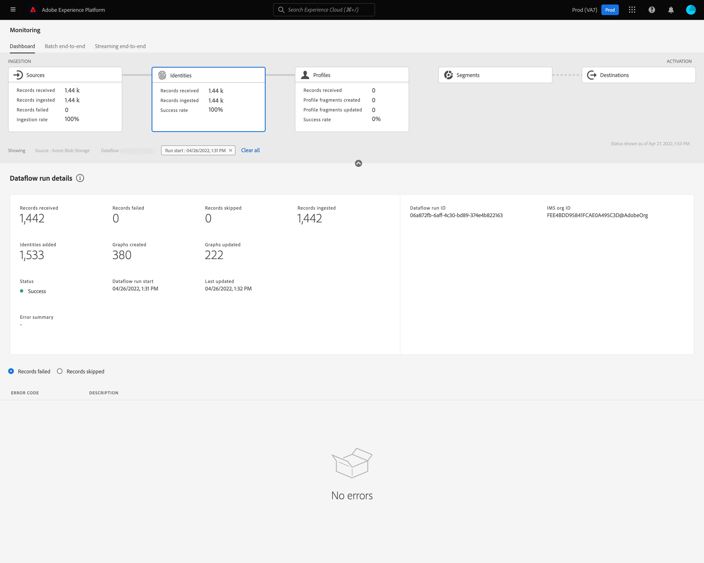

# Surveillance des flux de données pour les identités dans l’interface utilisateur

Le service d’identités d’Adobe Experience Platform vous offre la possibilité de mieux connaître vos clients et leur comportement en établissant un lien entre les identités des différents appareils et systèmes, ce qui vous permet de proposer des expériences digitales personnelles et percutantes en temps réel.

Le tableau de bord de surveillance vous fournit une représentation visuelle de l’activité des données au sein des identités, y compris le statut des identités de vos données. Ce tutoriel explique comment utiliser le tableau de bord de surveillance pour surveiller les identités de vos données à l’aide de l’interface utilisateur d’Experience Platform, ce qui vous permet de suivre l’état du traitement des identités.

## Commencer {#getting-started}

- [Flux de données](../home.md) : les flux de données sont une représentation des tâches de données qui déplacent ces dernières dans Experience Platform. Les flux de données sont configurés sur différents services, ce qui permet de déplacer les données des connecteurs sources vers des jeux de données cibles, vers [!DNL Identity] et [!DNL Profile], et vers [!DNL Destinations].
   - [Exécutions de flux de données](../../sources/notifications.md) : les exécutions de flux de données sont les tâches planifiées récurrentes en fonction de la configuration de la fréquence des flux de données sélectionnés.
- [Service d’identités](../../identity-service/home.md) : obtenez une meilleure compréhension des clients individuels et de leurs comportements en reliant les identités entre les appareils et les systèmes.
- [Sandbox](../../sandboxes/home.md) : [!DNL Experience Platform] fournit des sandbox virtuels qui divisent une instance [!DNL Experience Platform] unique en environnements virtuels distincts pour favoriser le développement et l’évolution d’applications d’expérience digitale.

## Tableau de bord de surveillance des identités {#identity-metrics}

>[!CONTEXTUALHELP]
>id="platform_monitoring_identity_processing"
>title="Traitement des identités"
>abstract="La vue de traitement des identités contient des informations sur les enregistrements ingérés dans le service d&#39;identités, notamment le nombre d&#39;identités ajoutées, de graphiques créés et de graphiques mis à jour. Consultez le guide de définition des mesures pour en savoir plus sur les mesures et les graphiques."
>text="Learn more in documentation"

>[!CONTEXTUALHELP]
>id="platform_monitoring_dataflow_run_details_identity"
>title="Détails de l’exécution du flux de données"
>abstract="La page Détails de l&#39;exécution du flux de données affiche plus d&#39;informations sur votre exécution du flux de données d&#39;identité, y compris son identifiant d&#39;organisation et son identifiant d&#39;exécution du flux de données."

Pour accéder au tableau de bord **[!UICONTROL Identities]**, sélectionnez **[!UICONTROL Monitoring]** dans le volet de navigation de gauche. Une fois sur la page **[!UICONTROL Monitoring]**, sélectionnez la carte **[!UICONTROL Identities]** .

Dans le tableau de bord de **[!UICONTROL Identities]** principal, la carte **[!UICONTROL Identities]** affiche des informations sur le nombre total d’enregistrements reçus, le nombre d’enregistrements ingérés, ainsi que le taux de succès de l’ingestion des enregistrements.

Le tableau de bord lui-même contient des mesures sur le traitement des identités. Par défaut, le tableau de bord affiche les détails du traitement des identités pour les sources de votre organisation au cours des dernières 24 heures.

La page [!UICONTROL Identity processing] contient des informations sur les enregistrements ingérés dans [!DNL Identity Service], notamment le nombre d&#39;identités ajoutées, de graphiques créés et de graphiques mis à jour.

Les mesures suivantes sont disponibles pour cette vue de tableau de bord :

| Mesures d’identité | Description |
| ---------------- | ----------- |
| **[!UICONTROL Records received]** | Nombre d’enregistrements reçus du lac de données. |
| **[!UICONTROL Records failed]** | Nombre d’enregistrements qui n’ont pas été ingérés dans Experience Platform en raison d’erreurs dans les données. |
| **[!UICONTROL Records skipped]** | Nombre d’enregistrements ingérés, mais pas dans [!DNL Identity Service], car la ligne d’enregistrement ne contenait qu’un seul identifiant. |
| **[!UICONTROL Records ingested]** | Nombre d’enregistrements ingérés dans [!DNL Identity Service]. |
| **[!UICONTROL Identities added]** | Nombre de nouveaux identifiants réseau ajoutés à [!DNL Identity Service]. |
| **[!UICONTROL Graphs created]** | Nombre de nouveaux graphiques d’identités nets créés dans [!DNL Identity Service]. |
| **[!UICONTROL Graphs updated]** | Nombre de graphiques d’identités existants mis à jour avec de nouvelles périphéries. |
| **[!UICONTROL Total failed dataflows]** | Nombre d’exécutions de flux de données ayant échoué. |

Vous pouvez sélectionner l’icône de filtre  à côté du nom de la source pour afficher les informations de traitement des identités pour les flux de données de cette source sélectionnée.

Vous pouvez également sélectionner **[!UICONTROL Dataflows]** sur le bouton (bascule) pour afficher les détails du traitement des identités pour les flux de données de votre organisation au cours des dernières 24 heures.

Les mesures suivantes sont disponibles pour cette vue de tableau de bord :

| Mesure | Description |
| -------| ----------- |
| **[!UICONTROL Dataflow]** | Nom du flux de données. |
| **[!UICONTROL Dataset]** | Nom du jeu de données vers lequel le flux de données est inséré. |
| **[!UICONTROL Source name]** | Nom de la source à laquelle appartient le flux de données. |
| **[!UICONTROL Records received]** | Nombre d’enregistrements reçus du lac de données. |
| **[!UICONTROL Records failed]** | Nombre d’enregistrements qui n’ont pas été ingérés dans Experience Platform en raison d’erreurs dans les données. |
| **[!UICONTROL Records skipped]** | Nombre d’enregistrements ingérés, mais pas dans [!DNL Identity Service], car la ligne d’enregistrement ne contenait qu’un seul identifiant. |
| **[!UICONTROL Records ingested]** | Nombre d’enregistrements ingérés dans [!DNL Identity Service]. |
| **[!UICONTROL Total records]** | Le nombre total de tous les enregistrements, y compris les enregistrements ayant échoué, les enregistrements ignorés, les identités ajoutées et les enregistrements dupliqués. |
| **[!UICONTROL Identities added]** | Nombre de nouveaux identifiants réseau ajoutés à [!DNL Identity Service]. |
| **[!UICONTROL Graphs created]** | Nombre de nouveaux graphiques d’identités nets créés dans [!DNL Identity Service]. |
| **[!UICONTROL Graphs updated]** | Nombre de graphiques d’identités existants mis à jour avec de nouvelles périphéries. |
| **[!UICONTROL Total failed dataflows]** | Nombre d’exécutions de flux de données ayant échoué. |

Sélectionnez l’icône de filtre  à côté de l’heure de début de l’exécution du flux de données pour afficher plus d’informations sur votre exécution de flux de données [!DNL Identity].

La page [!UICONTROL Dataflow run details] affiche plus d’informations sur votre exécution de flux de données [!DNL Identity], y compris son identifiant d’organisation et son identifiant d’exécution de flux de données. Cette page affiche également le code d’erreur et le message d’erreur correspondants fournis par [!DNL Identity Service] en cas d’erreur dans le processus d’ingestion.

Les mesures suivantes sont disponibles pour cette vue de tableau de bord :

| Mesure | Description |
| -------| ----------- |
| **[!UICONTROL Records received]** | Nombre d’enregistrements reçus du lac de données. |
| **[!UICONTROL Records failed]** | Nombre d’enregistrements qui n’ont pas été ingérés dans Experience Platform en raison d’erreurs dans les données. |
| **[!UICONTROL Records skipped]** | Nombre d’enregistrements ingérés, mais pas dans [!DNL Identity Service], car la ligne d’enregistrement ne contenait qu’un seul identifiant. |
| **[!UICONTROL Records ingested]** | Nombre d’enregistrements ingérés dans [!DNL Identity Service]. |
| **[!UICONTROL Identities added]** | Nombre de nouveaux identifiants réseau ajoutés à [!DNL Identity Service]. |
| **[!UICONTROL Graphs created]** | Nombre de nouveaux graphiques d’identités nets créés dans [!DNL Identity Service]. |
| **[!UICONTROL Graphs updated]** | Nombre de graphiques d’identités existants mis à jour avec de nouvelles périphéries. |
| **[!UICONTROL Status]** | Définit le statut global d’un flux de données. Les valeurs de statut possibles sont les suivantes : <ul><li>`Success` : indique qu’un flux de données est actif et ingère des données en fonction du planning qui lui a été fourni.</li><li>`Failed` : indique que le processus d’activation d’un flux de données a été interrompu en raison d’erreurs. </li><li>`Processing` : indique que le flux de données n’est pas encore actif. Ce statut se rencontre souvent immédiatement après la création d’un nouveau flux de données.</li></ul> |
| **[!UICONTROL Dataflow run start]** | Date et heure auxquelles le flux de données a commencé à s’exécuter. |
| **[!UICONTROL Last updated]** | Date et heure de la dernière mise à jour du flux de données. |
| **[!UICONTROL Error summary]** | Si l’exécution du flux de données a échoué, un code d’erreur et un résumé des raisons de l’échec de l’exécution du flux de données s’affichent. |
| **[!UICONTROL Dataflow run ID]** | Identifiant de l’exécution du flux de données. |
| **[!UICONTROL IMS org ID]** | Identifiant d’organisation auquel appartient l’exécution du flux de données. |

De plus, vous pouvez sélectionner le bouton (bascule) pour afficher les enregistrements ayant échoué ou les enregistrements ayant été ignorés. La section Erreurs comprend des détails sur le code d’erreur et le nombre d’enregistrements ayant échoué ou exclus.
