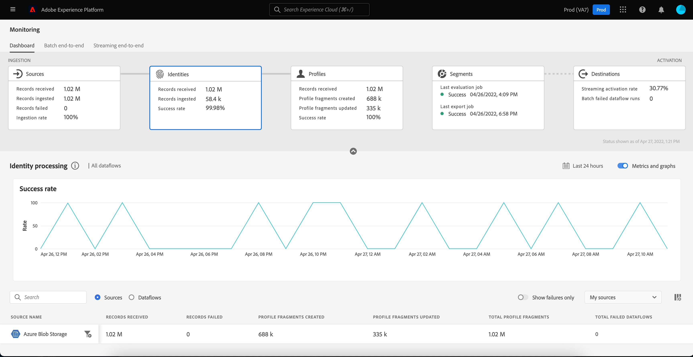
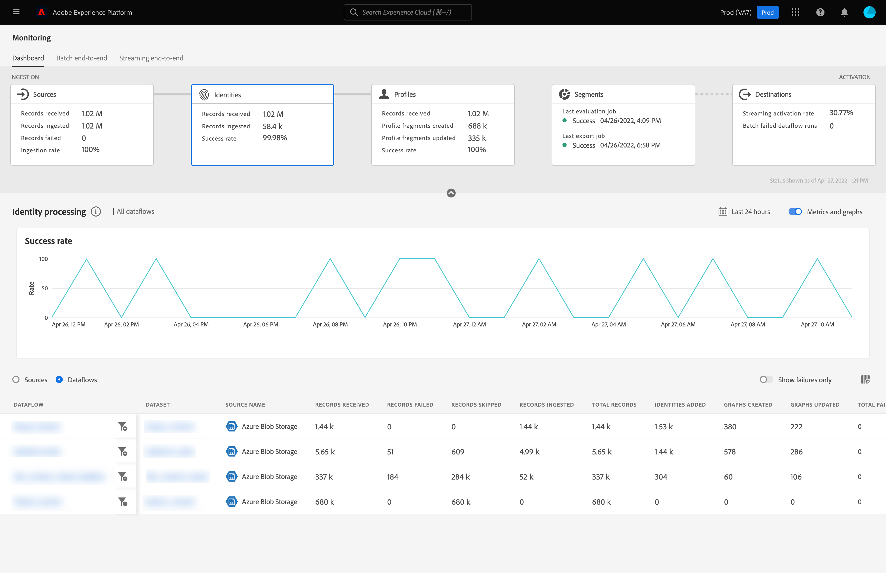

# Surveillance des flux de données pour les identités dans l’interface utilisateur

Le service d’identités d’Adobe Experience Platform vous offre la possibilité de mieux connaître vos clients et leur comportement en établissant un lien entre les identités des différents appareils et systèmes, ce qui vous permet de proposer des expériences digitales personnelles et percutantes en temps réel.

Le tableau de bord de surveillance vous fournit une représentation visuelle de l’activité des données dans les identités, y compris l’état des identités de vos données. Ce tutoriel explique comment utiliser le tableau de bord de surveillance pour surveiller les identités de vos données à l’aide de l’interface utilisateur de l’Experience Platform, ce qui vous permet de suivre l’état du traitement des identités.

## Commencer {#getting-started}

- [Flux de données](../home.md) : les flux de données sont une représentation des tâches de données qui déplacent ces dernières dans Platform. Les flux de données sont configurés sur différents services, ce qui permet de déplacer les données des connecteurs sources vers des jeux de données cibles, vers [!DNL Identity] et [!DNL Profile], et vers [!DNL Destinations].
   - [Exécutions de flux de données](../../sources/notifications.md) : les exécutions de flux de données sont les tâches planifiées récurrentes en fonction de la configuration de fréquence des flux de données sélectionnés.
- [Service d’identités](../../identity-service/home.md) : obtenez une meilleure compréhension des clients individuels et de leurs comportements en reliant les identités entre les appareils et les systèmes.
- [Sandbox](../../sandboxes/home.md) : [!DNL Experience Platform] fournit des sandbox virtuels qui divisent une instance [!DNL Platform] unique en environnements virtuels distincts pour favoriser le développement et l’évolution d’applications d’expérience digitale.

## Tableau de bord de surveillance des identités {#identity-metrics}

>[!CONTEXTUALHELP]
>id="platform_monitoring_identity_processing"
>title="Traitement des identités"
>abstract="La vue de traitement des identités contient des informations sur les enregistrements ingérés dans le service d&#39;identités, notamment le nombre d&#39;identités ajoutées, de graphiques créés et de graphiques mis à jour. Consultez le guide de définition des mesures pour en savoir plus sur les mesures et les graphiques."
>text="Learn more in documentation"

>[!CONTEXTUALHELP]
>id="platform_monitoring_dataflow_run_details_identity"
>title="Détails de l’exécution du flux de données"
>abstract="La page Détails de l&#39;exécution du flux de données affiche plus d&#39;informations sur votre exécution du flux de données d&#39;identité, y compris son identifiant d&#39;organisation et son identifiant d&#39;exécution du flux de données."

Pour accéder au tableau de bord **[!UICONTROL Identités]**, sélectionnez **[!UICONTROL Surveillance]** dans le volet de navigation de gauche. Une fois sur la page **[!UICONTROL Surveillance]** , sélectionnez la carte **[!UICONTROL Identités]** .

Sur le tableau de bord principal **[!UICONTROL Identités]**, la carte **[!UICONTROL Identités]** affiche des informations sur le nombre total d’enregistrements reçus, le nombre d’enregistrements ingérés, ainsi que le taux de réussite de l’ingestion des enregistrements.

Le tableau de bord lui-même contient des mesures relatives au traitement des identités. Par défaut, le tableau de bord affiche les détails du traitement des identités pour les sources de votre entreprise au cours des dernières 24 heures.

La page [!UICONTROL Traitement des identités] contient des informations sur les enregistrements ingérés vers [!DNL Identity Service], y compris le nombre d’identités ajoutées, de graphiques créés et de graphiques mis à jour.

Les mesures suivantes sont disponibles pour cette vue de tableau de bord :

| Mesures d’identité | Description |
| ---------------- | ----------- |
| **[!UICONTROL Enregistrements reçus]** | Nombre d’enregistrements reçus du lac de données. |
| **[!UICONTROL Échec des enregistrements]** | Nombre d’enregistrements qui n’ont pas été ingérés dans Platform en raison d’erreurs dans les données. |
| **[!UICONTROL Enregistrements ignorés]** | Nombre d’enregistrements ingérés, mais pas dans [!DNL Identity Service], car il n’y avait qu’un seul identifiant dans la ligne d’enregistrement. |
| **[!UICONTROL Enregistrements ingérés]** | Nombre d’enregistrements ingérés dans [!DNL Identity Service]. |
| **[!UICONTROL Identités ajoutées]** | Nombre de nouveaux identifiants nets ajoutés à [!DNL Identity Service]. |
| **[!UICONTROL Graphiques créés]** | Nombre de nouveaux graphiques d’identités nets créés dans [!DNL Identity Service]. |
| **[!UICONTROL Graphiques mis à jour]** | Nombre de graphiques d’identités existants mis à jour avec de nouvelles périphéries. |
| **[!UICONTROL Total des flux de données ayant échoué]** | Nombre d’exécutions de flux de données ayant échoué. |

Vous pouvez sélectionner l’icône de filtre  en regard du nom de la source pour afficher les informations de traitement des identités pour les flux de données de cette source sélectionnée.

Vous pouvez également sélectionner **[!UICONTROL Flux de données]** sur le bouton d’activation/désactivation afin d’afficher les détails de traitement des identités pour les flux de données de votre organisation pendant les dernières 24 heures.

Les mesures suivantes sont disponibles pour cette vue de tableau de bord :

| Mesure | Description |
| -------| ----------- |
| **[!UICONTROL Flux de données]** | Nom du flux de données. |
| **[!UICONTROL Jeu de données]** | Nom du jeu de données auquel le flux de données est en cours d’insertion. |
| **[!UICONTROL Nom du Source]** | Nom de la source à laquelle le flux de données appartient. |
| **[!UICONTROL Enregistrements reçus]** | Nombre d’enregistrements reçus du lac de données. |
| **[!UICONTROL Échec des enregistrements]** | Nombre d’enregistrements qui n’ont pas été ingérés dans Platform en raison d’erreurs dans les données. |
| **[!UICONTROL Enregistrements ignorés]** | Nombre d’enregistrements ingérés, mais pas dans [!DNL Identity Service], car il n’y avait qu’un seul identifiant dans la ligne d’enregistrement. |
| **[!UICONTROL Enregistrements ingérés]** | Nombre d’enregistrements ingérés dans [!DNL Identity Service]. |
| **[!UICONTROL Total des enregistrements]** | Comptage total de tous les enregistrements, y compris les enregistrements en échec, les enregistrements ignorés, les identités ajoutées et les enregistrements dupliqués. |
| **[!UICONTROL Identités ajoutées]** | Nombre de nouveaux identifiants nets ajoutés à [!DNL Identity Service]. |
| **[!UICONTROL Graphiques créés]** | Nombre de nouveaux graphiques d’identités nets créés dans [!DNL Identity Service]. |
| **[!UICONTROL Graphiques mis à jour]** | Nombre de graphiques d’identités existants mis à jour avec de nouvelles périphéries. |
| **[!UICONTROL Total des flux de données ayant échoué]** | Nombre d’exécutions de flux de données ayant échoué. |

Sélectionnez l’icône de filtre  en regard de l’heure de début de l’exécution du flux de données pour afficher plus d’informations sur votre exécution du flux de données [!DNL Identity].

La page [!UICONTROL Détails de l’exécution du flux de données] affiche plus d’informations sur votre exécution du flux de données [!DNL Identity], y compris son identifiant d’organisation et son identifiant d’exécution du flux de données. Cette page affiche également le code d’erreur et le message d’erreur correspondants fournis par [!DNL Identity Service], en cas d’erreur lors du processus d’ingestion.

Les mesures suivantes sont disponibles pour cette vue de tableau de bord :

| Mesure | Description |
| -------| ----------- |
| **[!UICONTROL Enregistrements reçus]** | Nombre d’enregistrements reçus du lac de données. |
| **[!UICONTROL Échec des enregistrements]** | Nombre d’enregistrements qui n’ont pas été ingérés dans Platform en raison d’erreurs dans les données. |
| **[!UICONTROL Enregistrements ignorés]** | Nombre d’enregistrements ingérés, mais pas dans [!DNL Identity Service], car il n’y avait qu’un seul identifiant dans la ligne d’enregistrement. |
| **[!UICONTROL Enregistrements ingérés]** | Nombre d’enregistrements ingérés dans [!DNL Identity Service]. |
| **[!UICONTROL Identités ajoutées]** | Nombre de nouveaux identifiants nets ajoutés à [!DNL Identity Service]. |
| **[!UICONTROL Graphiques créés]** | Nombre de nouveaux graphiques d’identités nets créés dans [!DNL Identity Service]. |
| **[!UICONTROL Graphiques mis à jour]** | Nombre de graphiques d’identités existants mis à jour avec de nouvelles périphéries. |
| **[!UICONTROL Statut]** | Définit l’état global d’un flux de données. Les valeurs d’état possibles sont les suivantes : <ul><li>`Success` : indique qu’un flux de données est actif et ingère des données selon le planning selon lequel il a été fourni.</li><li>`Failed` : indique que le processus d’activation d’un flux de données a été interrompu en raison d’erreurs. </li><li>`Processing` : indique que le flux de données n’est pas encore actif. Cet état est souvent rencontré immédiatement après la création d’un nouveau flux de données.</li></ul> |
| **[!UICONTROL Démarrage de l’exécution du flux de données]** | Date et heure auxquelles le flux de données a commencé à s’exécuter. |
| **[!UICONTROL Dernière mise à jour]** | Date et heure de la dernière mise à jour du flux de données. |
| **[!UICONTROL Synthèse de l’erreur]** | Si l’exécution du flux de données a échoué, un code d’erreur s’affiche et un résumé des raisons de l’échec de l’exécution du flux de données. |
| **[!UICONTROL ID d’exécution de flux de données]** | L’identifiant de l’exécution du flux de données. |
| **[!UICONTROL Identifiant de l’organisation IMS]** | ID d’organisation auquel appartient le flux de données. |

De plus, vous pouvez sélectionner le bouton bascule pour afficher les enregistrements en échec ou ignorés. La section Erreurs comprend des détails sur le code d’erreur et le nombre d’enregistrements ayant échoué ou exclus.
