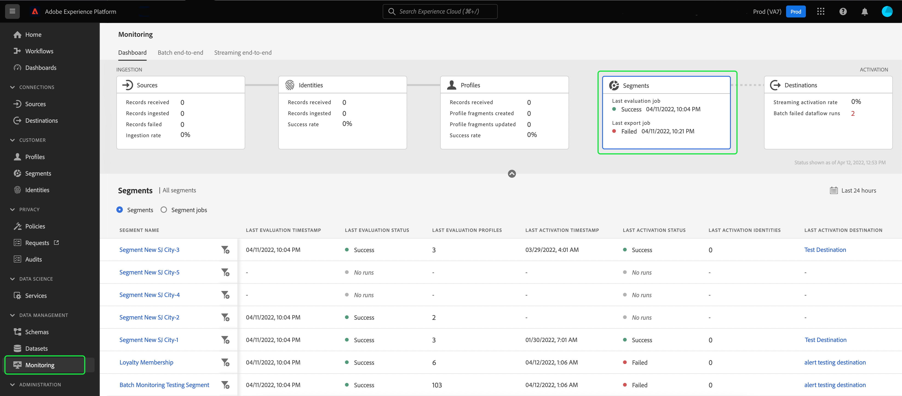

# Surveillance des flux de données pour les segments dans l’interface utilisateur

Segmentation Service vous permet de créer des segments et des audiences à partir de vos données de profil client en temps réel dans Adobe Experience Platform. Platform fournit des flux de données pour suivre de manière transparente ce flux de données de sources vers des destinations.

Le tableau de bord de surveillance fournit une représentation visuelle de l’activité des données dans un segment, y compris l’état de la segmentation de vos données. Ce tutoriel explique comment utiliser le tableau de bord de surveillance pour surveiller la segmentation de vos données à l’aide de l’interface utilisateur de l’Experience Platform, ce qui vous permet de suivre l’état des tâches d’activation, d’évaluation et d’exportation des segments.

## Prise en main {#getting-started}

Ce guide nécessite une compréhension professionnelle des composants suivants d’Adobe Experience Platform :

- [Flux de données](../home.md) : les flux de données sont une représentation des tâches de données qui déplacent ces dernières dans Platform. Les flux de données sont configurés sur différents services, ce qui permet de déplacer les données des connecteurs sources vers des jeux de données cibles, vers [!DNL Identity] et [!DNL Profile], et vers [!DNL Destinations].
   - [Exécutions de flux de données](../../sources/notifications.md): Les exécutions de flux de données sont les tâches planifiées récurrentes en fonction de la configuration de fréquence des flux de données sélectionnés.
- [Segmentation](../../segmentation/home.md): La segmentation vous permet de créer des segments et des audiences à partir de vos données Real-time Customer Profile.
   - [Tâches d’activation](../../destinations/ui/activation-overview.md): Une tâche d’activation est utilisée pour activer votre segment vers une destination spécifiée.
   - [Tâches d’évaluation](../../segmentation/tutorials/evaluate-a-segment.md#evaluate-a-segment): Une tâche d’évaluation est un processus asynchrone qui s’exécute pour créer un segment d’audience basé sur le segment spécifié.
   - [Tâches d’exportation](../../segmentation/api/export-jobs.md): Une tâche d’exportation est un processus asynchrone utilisé pour conserver les membres du segment d’audience dans les jeux de données.
- [Sandbox](../../sandboxes/home.md) : [!DNL Experience Platform] fournit des sandbox virtuelles qui divisent une instance [!DNL Platform] unique en environnements virtuels distincts pour favoriser le développement et l’évolution d’applications d’expérience digitale.

## Tableau de bord des segments de surveillance {#monitoring-segments-dashboard}

>[!CONTEXTUALHELP]
>id="platform_monitoring_segments"
>title="Segments"
>abstract="La vue Segments contient des informations sur tous les segments de votre organisation IMS, ainsi que des informations supplémentaires sur leurs tâches d’activation et d’évaluation."

Pour accéder au **[!UICONTROL Segments]** tableau de bord, sélectionnez **[!UICONTROL Surveillance]** dans le volet de navigation de gauche. Une fois sur le **[!UICONTROL Surveillance]** , sélectionnez **[!UICONTROL Segments]** carte.

Sur la page principale **[!UICONTROL Segments]** tableau de bord, le **[!UICONTROL Segments]** affiche l’état et la date de la dernière tâche d’évaluation et de la dernière tâche d’exportation.

Le tableau de bord lui-même contient des mesures pour les tâches de segments et de segments. Par défaut, le tableau de bord affiche les mesures de segmentation pour les 24 dernières heures. Pour en savoir plus sur l’affichage des tâches de segmentation, veuillez lire le [surveillance des tâches de segmentation](#monitoring-segment-jobs-dashboard) .

>[!IMPORTANT]
>
>Actuellement, seuls les segments activés pour [destinations par lot (basées sur des fichiers)](../../destinations/destination-types.md#file-based) sont pris en charge pour le tableau de bord des segments de surveillance.

Les mesures suivantes sont disponibles pour cette vue de tableau de bord :

| Mesure | Description |
| ------ | ----------- |
| **[!UICONTROL Nom du segment]** | Nom du segment. |
| **[!UICONTROL Dernier horodatage d’évaluation]** | Date et heure d’exécution de la dernière tâche d’évaluation du segment. |
| **[!UICONTROL Dernier état d’évaluation]** | État de la dernière tâche d’évaluation du segment. Les valeurs possibles sont les suivantes : **[!UICONTROL Succès]**, **[!UICONTROL Aucune exécution]**, et **[!UICONTROL En échec]**. |
| **[!UICONTROL Derniers profils d’évaluation]** | Nombre de profils qui ont été évalués dans la dernière tâche d’évaluation du segment. |
| **[!UICONTROL Horodatage de la dernière activation]** | Date et heure de la dernière tâche d’activation du segment. |
| **[!UICONTROL Dernier état d’activation]** | État de la dernière tâche d’activation du segment. Les valeurs possibles sont les suivantes : **[!UICONTROL Succès]**, **[!UICONTROL Aucune exécution]**, et **[!UICONTROL En échec]**. |
| **[!UICONTROL Dernières identités d’activation]** | Nombre d’identités qui ont été activées dans la dernière tâche d’activation du segment. |
| **[!UICONTROL Destination de la dernière activation]** | Nom de la destination à laquelle la dernière tâche d’activation du segment a été activée. |

Vous pouvez filtrer les résultats sur un segment spécifique et afficher ses tâches de segmentation en sélectionnant l’icône de filtre (). Les tâches de segmentation sont triées par ordre chronologique, les tâches de segmentation les plus récentes apparaissant en premier.

Le tableau de bord des segments filtrés s’affiche. Le **[!UICONTROL Segments]** affiche l’état et la date de la dernière tâche d’évaluation et de la dernière tâche d’activation.

Le tableau de bord lui-même affiche l’heure et l’état des dernières tâches d’évaluation et d’activation, un graphique indiquant le nombre de profils de l’évaluation du segment et les mesures des tâches de segmentation qui ont été exécutées. Par défaut, le tableau de bord affiche les mesures des tâches de segmentation pour les 24 dernières heures.

Les mesures suivantes sont disponibles pour cette vue de tableau de bord :

| Mesure | Description |
| ------ | ----------- |
| **[!UICONTROL Démarrage de tâche]** | Date et heure de début de la tâche de segmentation. |
| **[!UICONTROL Type]** | Indique le type de la tâche de segmentation. Les deux types de tâche pris en charge sont les suivants : **activation** et **évaluation** tâches. |
| **[!UICONTROL Fin de tâche]** | Date et heure auxquelles la tâche de segmentation s’est terminée. |
| **[!UICONTROL Durée du traitement]** | Le temps nécessaire à la réalisation de la tâche de segmentation. |
| **[!UICONTROL État des tâches]** | État de la tâche de segmentation. Les valeurs prises en charge incluent : **[!UICONTROL Succès]**, **[!UICONTROL En cours]**, et **[!UICONTROL En échec]**. |
| **[!UICONTROL Nombre de profils]** | Nombre de profils que la tâche de segmentation évalue. Chaque utilisateur doit disposer d’un profil unique. |
| **[!UICONTROL Nombre d’identités]** | Nombre d’identités activées par la tâche de segmentation. Chaque profil peut avoir plusieurs identités. Par exemple, un profil peut avoir un email, un numéro de téléphone et un numéro de fidélité comme identités. |
| **[!UICONTROL Nom de la destination]** | Nom de la destination vers laquelle la tâche de segmentation est activée. |

Vous pouvez filtrer davantage une tâche de segmentation spécifique et afficher ses détails en sélectionnant l’icône de filtre (). Il existe deux types différents de tâches de segmentation qui peuvent être filtrées : tâches d’activation et d’évaluation.

### Détails de la tâche d’activation {#activation-job-details}

La page des détails de l’exécution du flux de données de la tâche d’activation affiche des informations sur les mesures de l’exécution, les erreurs d’exécution du flux de données et les segments liés à la tâche de segmentation. Une tâche d’activation est utilisée pour activer votre segment pour une destination spécifiée. Par défaut, la page de détails affiche les erreurs d’exécution du flux de données.

Les mesures suivantes sont disponibles pour cette vue de tableau de bord :

| Mesure | Description |
| ------ | ----------- |
| **[!UICONTROL Profils reçus]** | Nombre total de profils reçus dans le flux d’activation. |
| **[!UICONTROL Identités activées]** | Nombre total d’identités qui ont été activées vers la destination, en fonction des profils reçus. |
| **[!UICONTROL Identités exclues]** | Nombre total d’identités qui ont été exclues de l’activation vers la destination, en fonction des profils reçus. Ces identités peuvent être exclues en raison d’attributs manquants ou de violations de consentement. |
| **[!UICONTROL Taille des données]** | Taille du flux de données en cours d’activation. |
| **[!UICONTROL Fichiers totaux]** | Nombre total de fichiers activés dans le flux de données. |
| **[!UICONTROL Statut]** | État actuel de la tâche d’activation. |
| **[!UICONTROL Démarrage de l’exécution du flux de données]** | Date et heure de début de la tâche d’activation. |
| **[!UICONTROL Fin de l’exécution du flux de données]** | Date et heure auxquelles la tâche d’activation s’est terminée. |
| **[!UICONTROL Identifiant d’exécution du flux de données]** | Identifiant de la tâche d’activation actuelle. |
| **[!UICONTROL Identifiant de l’organisation IMS]** | L’identifiant de l’organisation IMS à laquelle appartient la tâche d’activation. |
| **[!UICONTROL Nom de la destination]** | Nom de la destination vers laquelle les données sont activées. |

Sous les mesures, une bascule permettant de sélectionner entre les erreurs d’exécution du flux de données et les segments s’affiche.

Dans la section erreurs d’exécution du flux de données , sélectionnez la bascule pour afficher les identités ayant échoué ou les champs exclus des identités. La section Erreurs comprend des détails sur le code d’erreur et le nombre d’identités ayant échoué ou exclues.

Dans la section segments , vous pouvez voir la liste des segments qui ont été activés dans le cadre de la tâche d’activation. Utilisez la barre de recherche pour filtrer la liste des segments par nom.

Pour la section des segments, les mesures suivantes sont disponibles :

| Mesure | Description |
| ------ | ----------- |
| **[!UICONTROL Nom]** | Nom du segment qui a été activé. |
| **[!UICONTROL Identités activées]** | Nombre total d’identités qui ont été activées vers la destination, en fonction des profils reçus. |
| **[!UICONTROL Identités exclues]** | Nombre total d’identités qui ont été exclues de l’activation vers la destination, en fonction des profils reçus. Ces identités peuvent être exclues en raison d’attributs manquants ou d’une violation du consentement. |
| **[!UICONTROL État d’exécution du dernier flux de données]** | État de la dernière tâche d’activation qui s’est exécutée pour ce segment. |
| **[!UICONTROL Date d’exécution du dernier flux de données]** | Date et heure de la dernière tâche d’activation exécutée pour ce segment. |

### Détails de la tâche d’évaluation {#evaluation-job-details}

La page des détails de l’exécution du flux de données d’évaluation affiche des informations sur les mesures et les segments de l’exécution liés à la tâche de segmentation. Une tâche d’évaluation est un processus asynchrone qui crée un segment d’audience en fonction du segment spécifié. Pour en savoir plus sur les tâches d’évaluation, consultez le tutoriel sur [évaluation d’un segment](../../segmentation/tutorials/evaluate-a-segment.md#evaluate-a-segment).

Les mesures suivantes sont disponibles pour cette vue de tableau de bord :

| Mesure | Description |
| ------ | ----------- |
| **[!UICONTROL Profils totaux]** | Nombre total de profils en cours d’évaluation. |
| **[!UICONTROL Statut]** | État de la tâche d’évaluation. Les états possibles de la tâche d’évaluation sont les suivants : **[!UICONTROL Succès]** et **[!UICONTROL En échec]**. |
| **[!UICONTROL Démarrage de tâche]** | Date et heure de début de la tâche d’évaluation. |
| **[!UICONTROL Fin de tâche]** | Date et heure auxquelles la tâche d’évaluation s’est terminée. |
| **[!UICONTROL Type de tâche]** | Type de tâche de segmentation. Dans ce cas, il s’agira toujours d’une tâche d’évaluation de segment. |
| **[!UICONTROL Type d’évaluation]** | Type d’évaluation en cours. Cela peut être : **[!UICONTROL Lot]** ou **[!UICONTROL Diffusion en continu]**. |
| **[!UICONTROL ID de tâche]** | Identifiant de la tâche d’évaluation. |
| **[!UICONTROL Identifiant de l’organisation IMS]** | Identifiant de l’organisation IMS à laquelle appartient la tâche d’évaluation. |
| **[!UICONTROL Nom du segment]** | Nom du segment en cours d’évaluation. |
| **[!UICONTROL Identifiant de segment]** | Identifiant du segment en cours d’évaluation. |

Dans la section segments , vous pouvez voir la liste des segments qui sont évalués dans le cadre de la tâche d’évaluation. Vous pouvez filtrer la liste de segments par nom à l’aide de la barre de recherche.

>[!IMPORTANT]
>
>Cette vue de tableau de bord prend actuellement en charge jusqu’à 800 mesures de segments.

Pour la section des segments, les mesures suivantes sont disponibles :

| Mesure | Description |
| ------ | ----------- |
| **[!UICONTROL Nom]** | Nom du segment en cours d’évaluation. |
| **[!UICONTROL Nombre de profils]** | Le nombre de profils en cours d’évaluation. |

## Surveillance du tableau de bord des tâches de segmentation {#monitoring-segment-jobs-dashboard}

>[!CONTEXTUALHELP]
>id="platform_monitoring_segment_jobs"
>title="Tâches de segmentation"
>abstract="La vue des tâches de segmentation contient des informations sur les tâches d’évaluation et d’exportation pour tous vos segments."

Pour accéder au **[!UICONTROL Tâches de segmentation]** tableau de bord, sélectionnez **[!UICONTROL Surveillance]** () dans le volet de navigation de gauche. Une fois sur le [!UICONTROL Surveillance] page, sélectionnez **[!UICONTROL Tâches de segmentation]**. Le [!UICONTROL Surveillance] Le tableau de bord contient des mesures et des informations sur les tâches d’évaluation et d’exportation de segments.

>[!NOTE]
>
>Uniquement **tâches d’évaluation des segments** sont pris en charge pour la surveillance par segment. Les tâches d’exportation de segments ne prennent en charge que la surveillance au niveau de l’organisation.

Utilisez la variable [!UICONTROL Tâches de segmentation] tableau de bord pour comprendre si l’évaluation et l’exportation des profils ont lieu à temps et sans aucune exception, de sorte que les services en aval pour l’activation de la destination peuvent avoir les dernières données de profil évaluées.

Les mesures suivantes sont disponibles pour les tâches de segmentation :

| Mesure | Description |
---------|----------|
| **[!UICONTROL Tâche de segment]** | Indique le nom de la tâche de segmentation. |
| **[!UICONTROL Type]** | Indique le type de tâche de segmentation : export ou évaluation. Notez que dans les deux cas, la tâche de segmentation évalue ou exporte **all** segments appartenant à une organisation. Pour en savoir plus sur les traitements d&#39;export, consultez le guide sur la [point d’entrée des traitements d’exportation](../../segmentation/api/export-jobs.md). Pour en savoir plus sur les tâches d’évaluation, consultez le tutoriel sur [évaluation d’un segment](../../segmentation/tutorials/evaluate-a-segment.md#evaluate-a-segment). |
| **[!UICONTROL Démarrage de tâche]** | Date et heure de début de la tâche de segmentation. |
| **[!UICONTROL Fin de tâche]** | Date et heure auxquelles la tâche de segmentation s’est terminée. |
| **[!UICONTROL Statut]** | État de la tâche terminée. Les états possibles de la tâche de segmentation incluent la réussite ou l’échec. |
