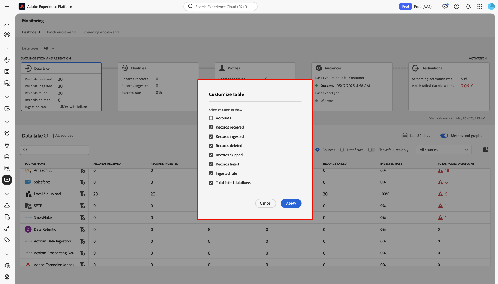

# Surveillance de l’ingestion du lac de données

>[!IMPORTANT]
>
>Les sources en flux continu, telles que la source [API HTTP](../../sources/connectors/streaming/http.md) ne sont actuellement pas prises en charge par le tableau de bord de surveillance. Actuellement, vous ne pouvez utiliser le tableau de bord que pour surveiller les sources de lots.

Vous pouvez utiliser le tableau de bord de surveillance dans l’interface utilisateur de Adobe Experience Platform pour récupérer des mesures relatives à vos processus d’ingestion et de conservation des données dans le lac de données. Utilisez les graphiques de l’interface pour surveiller les tendances d’ingestion et de rétention au fil du temps et résumer les performances de tous vos flux de données sources.

Lisez ce document pour savoir comment utiliser le tableau de bord de surveillance pour surveiller tous les traitements de données dans le lac de données, y compris l’ingestion et la rétention.

## Commencer {#get-started}

Ce tutoriel nécessite une compréhension du fonctionnement des composants suivants d’Adobe Experience Platform :

* [Flux de données](../home.md) : les flux de données sont une représentation des tâches de données qui déplacent ces dernières dans Experience Platform. Les flux de données sont configurés sur différents services, ce qui permet de déplacer les données des connecteurs sources vers des jeux de données cibles, vers [!DNL Identity] et [!DNL Profile], et vers [!DNL Destinations].
   * [Exécutions de flux de données](../../sources/notifications.md) : les exécutions de flux de données sont les tâches planifiées récurrentes en fonction de la configuration de la fréquence des flux de données sélectionnés.
* [Sources](../../sources/home.md) : Experience Platform permet d’ingérer des données provenant de diverses sources tout en vous offrant la possibilité de structurer, d’étiqueter et d’améliorer les données entrantes à l’aide des services d’Experience Platform.
* [Service d’identités](../../identity-service/home.md) : obtenez une meilleure compréhension des clients individuels et de leurs comportements en reliant les identités entre les appareils et les systèmes.
* [Profil client en temps réel](../../profile/home.md) : fournit un profil client en temps réel unifié basé sur des données agrégées issues de plusieurs sources.
* [Sandbox](../../sandboxes/home.md) : Experience Platform fournit des sandbox virtuels qui divisent une instance Experience Platform unique en environnements virtuels distincts pour favoriser le développement et l’évolution d’applications d’expérience digitale.

## Utiliser le tableau de bord de surveillance pour l’ingestion du lac de données

>[!CONTEXTUALHELP]
>id="platform_monitoring_source_ingestion"
>title="Ingestion source"
>abstract="La vue Ingestion source contient des informations sur l&#39;état et les mesures de l&#39;activité des données dans le service de lac de données, y compris les enregistrements ingérés et les enregistrements ayant échoué. Consultez le guide de définition des mesures pour en savoir plus sur les mesures et les graphiques."
>text="Learn more in documentation"

>[!CONTEXTUALHELP]
>id="platform_monitoring_dataflow_run_details_ingestion"
>title="Détails de l’exécution du flux de données"
>abstract="Le traitement des sources contient des informations sur l&#39;état de l&#39;activité des données et des mesures dans le service de lac de données, y compris les enregistrements ingérés et les enregistrements ayant échoué. Consultez le guide de définition des mesures pour en savoir plus sur les mesures et les graphiques."
>text="Learn more in documentation"

Sélectionnez **[!UICONTROL Data lake]** dans l’en-tête principal du tableau de bord de surveillance pour afficher le taux d’ingestion du lac de données.

Le graphique [!UICONTROL Ingestion rate] affiche votre taux d’ingestion de données en fonction de la période configurée. Par défaut, le tableau de bord de surveillance affiche les taux d’ingestion des dernières 24 heures. Pour savoir comment configurer votre période, consultez le guide sur la [configuration de la période de surveillance](monitor.md#configure-monitoring-time-frame).

Le graphique peut s’afficher par défaut. Pour masquer le graphique, sélectionnez **[!UICONTROL Metrics and graphs]** pour désactiver le bouton (bascule) et masquer le graphique.

La partie inférieure du tableau de bord affiche un tableau qui décrit le rapport des mesures actuelles pour tous les flux de données sources existants.

| Mesures | Description |
| --- | --- |
| Enregistrements reçus | Nombre total d’enregistrements reçus d’une source donnée. |
| Enregistrements ingérés | Nombre total d’enregistrements ingérés dans le lac de données. |
| Enregistrements supprimés | Nombre total d’enregistrements supprimés en raison des paramètres de conservation du lac de données ou des opérations de modification de la capture de données. |
| Enregistrements ignorés | Nombre total d’enregistrements ignorés. Un enregistrement ignoré fait référence à des champs qui ont été ignorés car ils n’étaient pas nécessaires à l’ingestion. Par exemple, si vous créez un flux de données de sources avec l’ingestion partielle activée, vous pouvez configurer un seuil de taux d’erreur acceptable. Pendant le processus d’ingestion, les enregistrements des champs qui ne sont pas obligatoires, tels que les champs d’identité, seront ignorés pendant l’ingestion, tant qu’ils se trouvent dans le seuil d’erreur. |
| Enregistrements ayant échoué | Nombre total d’enregistrements qui n’ont pas pu être ingérés en raison d’erreurs. |
| Taux d&#39;ingestion | Pourcentage d&#39;enregistrements ingérés par rapport au nombre total d&#39;enregistrements reçus. |
| Nombre total de flux de données ayant échoué | Nombre total de flux de données ayant échoué. |

{style="table-layout:auto"}

Vous pouvez filtrer davantage vos données à l’aide des options fournies au-dessus du tableau des mesures :

| Options de filtrage | Description |
| --- | --- |
| Rechercher | Utilisez la barre de recherche pour filtrer votre vue en un seul type de source. |
| Sources | Sélectionnez **[!UICONTROL Sources]** pour filtrer votre vue et afficher les données de mesure par type de source. Il s’agit de l’affichage par défaut utilisé par le tableau de bord de surveillance. |
| Flux de données | Sélectionnez **[!UICONTROL Dataflows]** pour filtrer votre vue et afficher les données de mesure par flux de données. |
| Afficher uniquement les échecs | Sélectionnez **[!UICONTROL Show failures only]** pour filtrer l’affichage et afficher uniquement les flux de données qui ont signalé des échecs d’ingestion. |
| Mes sources | Vous pouvez filtrer davantage votre vue à l’aide du menu déroulant [!UICONTROL My sources] . Utilisez le menu déroulant pour filtrer votre vue par catégorie. Vous pouvez également sélectionner **[!UICONTROL All sources]** pour afficher les mesures sur toutes les sources ou ou **[!UICONTROL My sources]** pour afficher uniquement les sources avec lesquelles vous disposez d’un compte correspondant. |

{style="table-layout:auto"}

Pour personnaliser l’affichage des colonnes, sélectionnez l’icône des paramètres de colonne .

Utilisez ensuite la fenêtre *[!UICONTROL Customize table]* pour sélectionner les colonnes à afficher dans le tableau de bord. Lorsque vous avez terminé, sélectionnez **[!UICONTROL Apply]**.

Pour surveiller les données ingérées dans un flux de données spécifique, sélectionnez l’icône de filtre  en regard d’une source.

>[!TIP]
>
>Vous pouvez utiliser le tableau de bord de surveillance pour surveiller les mesures de suppression des données des enregistrements supprimés à l’aide de politiques de conservation des données. Pour plus d’informations sur la conservation des données, consultez le guide sur la [définition de politiques de conservation des données](../../catalog/datasets/user-guide.md#data-retention-policy).

Le tableau des mesures est mis à jour vers un tableau des flux de données actifs correspondant à la source que vous avez sélectionnée. Au cours de cette étape, vous pouvez afficher des informations supplémentaires sur vos flux de données, y compris leur jeu de données et leur type de données correspondants, ainsi qu’un horodatage indiquant la date de leur dernière activation.

Pour inspecter davantage un flux de données, sélectionnez l’icône de filtre  en regard d’un flux de données.

Vous accédez ensuite à une interface qui répertorie toutes les itérations d’exécution du flux de données que vous avez sélectionné.

Les exécutions de flux de données représentent une instance d’exécution de flux de données. Par exemple, si un flux de données est planifié pour s’exécuter toutes les heures à 9 heures:00, 10 :00 et 11 :00 du matin, vous auriez trois instances d’exécution de flux. Les exécutions de flux sont spécifiques à votre organisation.

Pour examiner les mesures d’une itération d’exécution de flux de données spécifique, sélectionnez l’icône de filtre  en regard de votre flux de données.

Utilisez la page Détails de l’exécution du flux de données pour afficher les mesures et les informations relatives à l’itération d’exécution sélectionnée.

| Détails de l’exécution du flux de données | Description |
| --- | --- |
| Enregistrements ingérés | Nombre total d’enregistrements ingérés à partir de l’exécution du flux de données. |
| Enregistrements ayant échoué | Nombre total d’enregistrements qui n’ont pas été ingérés en raison d’erreurs dans l’exécution du flux de données. |
| Nombre total de fichiers | Nombre total de fichiers dans l’exécution du flux de données. |
| Taille des données | Taille totale des données contenues dans l’exécution du flux de données. |
| ID d’exécution du flux de données | Identifiant de l’itération d’exécution du flux de données. |
| ID d’organisation | Identifiant de l’organisation dans laquelle l’exécution du flux de données a été créée. |
| Statut | Statut de l’exécution du flux de données. |
| Début de l’exécution du flux de données | Horodatage indiquant le moment auquel l’exécution du flux de données a démarré. |
| Fin de l’exécution du flux de données | Date et heure indiquant la fin de l’exécution du flux de données. |
| Jeu de données | Jeu de données utilisé pour créer le flux de données. |
| Type de données | Type des données qui se trouvaient dans le flux de données. |
| Ingestion partielle | L’ingestion par lots partielle est la possibilité d’ingérer des données contenant des erreurs, jusqu’à un certain seuil configurable. Cette fonctionnalité vous permet d’ingérer toutes vos données exactes dans Experience Platform, tandis que toutes vos données incorrectes sont traitées par lots séparément avec des informations sur les raisons de leur non-validité. Vous pouvez activer l’ingestion partielle pendant le processus de création du flux de données. |
| Diagnostics d’erreur | Les diagnostics d’erreur demandent à la source de générer des diagnostics d’erreur que vous pouvez référencer ultérieurement lors de la surveillance de l’activité du jeu de données et du statut du flux de données. Vous pouvez activer les diagnostics d’erreur pendant le processus de création du flux de données. |
| Résumé des erreurs | Étant donné l’échec de l’exécution d’un flux de données, le résumé des erreurs affiche un code d’erreur et une description pour résumer les raisons de l’échec de l’itération d’exécution. |

{style="table-layout:auto"}

Si l’exécution de votre flux de données signale des erreurs, vous pouvez faire défiler la page vers le bas à l’aide de l’interface [!UICONTROL Dataflow run errors].

Utilisez la section [!UICONTROL Records failed] pour afficher les mesures relatives aux enregistrements qui n’ont pas été ingérés en raison d’erreurs. Pour afficher un rapport d’erreur complet, sélectionnez **[!UICONTROL Preview error diagnostics]**. Pour télécharger une copie de vos diagnostics d’erreur et du manifeste du fichier, sélectionnez **[!UICONTROL Download]**, puis copiez l’exemple d’appel API à utiliser avec l’API [!DNL Data Access].

>[!NOTE]
>
>Vous ne pouvez utiliser les diagnostics d’erreur que si la fonction a été activée pendant le processus de création de la connexion source.

## Étapes suivantes {#next-steps}

En suivant ce tutoriel, vous avez appris à surveiller le taux d’ingestion du lac de données à l’aide du tableau de bord **[!UICONTROL Monitoring]**. Vous avez également appris à identifier les erreurs qui provoquent des échecs de flux de données lors de l’ingestion. Consultez les documents suivants pour plus d’informations :

* [Surveillance des données d’identité](./monitor-identities.md).
* [Surveillance des données de profil](./monitor-profiles.md).
