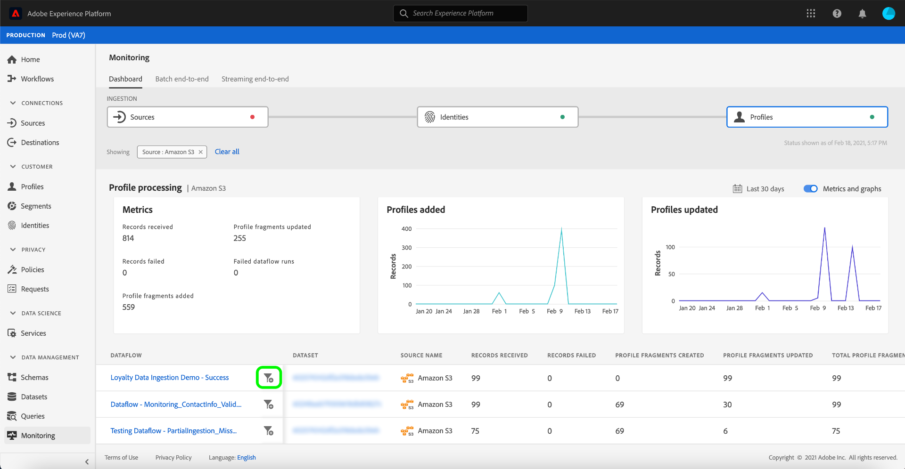

# Surveillance des flux de données pour les sources dans l’interface utilisateur

>[!IMPORTANT]
>
>Sources de diffusion en continu, telles que [Source de l’API HTTP](../../sources/connectors/streaming/http.md) ne sont actuellement pas pris en charge par le tableau de bord de surveillance. Actuellement, vous ne pouvez utiliser que le tableau de bord pour surveiller les sources de lots.

Dans Adobe Experience Platform, les données sont ingérées à partir d’une grande variété de sources, analysées dans Experience Platform et activées vers un grand nombre de destinations. En offrant de la transparence au niveau des flux de données, Platform facilite le processus de suivi de ce flux de données potentiellement non linéaire.

Le tableau de bord de surveillance vous fournit une représentation visuelle du parcours d’un flux de données. Vous pouvez utiliser une vue de surveillance agrégée et naviguer verticalement du niveau source à un flux de données et à une exécution de flux de données, ce qui vous permet d’afficher les mesures correspondantes qui contribuent au succès ou à l’échec d’un flux de données. Vous pouvez également utiliser la capacité de surveillance inter-services du tableau de bord de surveillance pour surveiller le parcours d’un flux de données à partir d’une source, à [!DNL Identity Service]et à [!DNL Profile].

Ce tutoriel décrit les étapes à suivre pour surveiller votre flux de données à l’aide de la vue de surveillance agrégée et de la surveillance inter-services.

## Prise en main {#getting-started}

Ce tutoriel nécessite une compréhension du fonctionnement des composants suivants d’Adobe Experience Platform :

* [Flux de données](../home.md) : les flux de données sont une représentation des tâches de données qui déplacent ces dernières dans Platform. Les flux de données sont configurés sur différents services, ce qui permet de déplacer les données des connecteurs sources vers des jeux de données cibles, vers [!DNL Identity] et [!DNL Profile], et vers [!DNL Destinations].
   * [Exécutions de flux de données](../../sources/notifications.md): Les exécutions de flux de données sont les tâches planifiées récurrentes en fonction de la configuration de fréquence des flux de données sélectionnés.
* [Sources](../../sources/home.md): Experience Platform permet d’ingérer des données à partir de diverses sources tout en vous permettant de structurer, d’étiqueter et d’améliorer les données entrantes à l’aide des services Platform.
* [Identity Service](../../identity-service/home.md) : profitez d’une meilleure compréhension de vos clients et de leurs comportements en rapprochant des identités entre appareils et systèmes.
* [Real-time Customer Profile](../../profile/home.md) : fournit un profil client en temps réel unifié basé sur des données agrégées issues de plusieurs sources.
* [Environnements de test](../../sandboxes/home.md) : Experience Platform fournit des environnements de test virtuels qui divisent une instance de plateforme unique en environnements virtuels distincts pour favoriser le développement et l’évolution d’applications d’expérience numérique.

## Vue de surveillance agrégée {#aggregated-monitoring-view}

>[!CONTEXTUALHELP]
>id="platform_monitoring_source_ingestion"
>title="Ingestion source"
>abstract="Le traitement des sources contient des informations sur l’état de l’activité de données et des mesures dans le service de lac de données, y compris les enregistrements ingérés et les enregistrements ayant échoué.   Consultez le guide de définition des mesures pour en savoir plus sur les mesures et les graphiques."
>text="Learn more in documentation"

>[!CONTEXTUALHELP]
>id="platform_monitoring_dataflow_run_details_ingestion"
>title="Détails de l’exécution du flux de données"
>abstract="Le traitement des sources contient des informations sur l’état de l’activité de données et des mesures dans le service de lac de données, y compris les enregistrements ingérés et les enregistrements ayant échoué.   Consultez le guide de définition des mesures pour en savoir plus sur les mesures et les graphiques."
>text="Learn more in documentation"

Dans le [Interface utilisateur de Platform](https://platform.adobe.com), sélectionnez **[!UICONTROL Surveillance]** dans le volet de navigation de gauche pour accéder à la fonction [!UICONTROL Surveillance] tableau de bord. Le [!UICONTROL Surveillance] Le tableau de bord contient des mesures et des informations sur tous les flux de données de sources, y compris des informations sur l’intégrité du trafic de données d’une source à [!DNL Identity Service]et à [!DNL Profile].

Au centre du tableau de bord se trouve l’objet [!UICONTROL Ingestion source] qui contient des mesures et des graphiques qui affichent des données sur les enregistrements ingérés et en échec.

Par défaut, les données affichées contiennent les taux d’ingestion des dernières 24 heures. Sélectionner **[!UICONTROL 24 dernières heures]** pour ajuster la période des enregistrements affichés.

Une fenêtre contextuelle de calendrier s’affiche, vous permettant d’accéder à d’autres options de périodes d’ingestion. Sélectionner **[!UICONTROL 30 derniers jours]** puis sélectionnez **[!UICONTROL Appliquer]**

Les graphiques sont activés par défaut et vous pouvez les désactiver pour développer la liste des sources ci-dessous. Sélectionnez la **[!UICONTROL Mesures et graphiques]** pour désactiver les graphiques.

| Ingestion source | Description |
| ---------------- | ----------- |
| [!UICONTROL Enregistrements ingérés ] | Nombre total d’enregistrements ingérés. |
| [!UICONTROL Enregistrements échoués] | Nombre total d’enregistrements qui n’ont pas été ingérés en raison d’erreurs dans les données. |
| [!UICONTROL Total des flux de données ayant échoué] | Le nombre total de flux de données avec un `failed` statut. |

La liste d’ingestion source affiche toutes les sources qui contiennent au moins un compte existant. La liste inclut également des informations sur le taux d’ingestion de chaque source, le nombre d’enregistrements ayant échoué et le nombre total de flux de données ayant échoué en fonction de la période que vous avez appliquée.

Pour trier la liste des sources, sélectionnez **[!UICONTROL Mes sources]** puis sélectionnez votre catégorie de choix dans le menu déroulant. Par exemple, pour vous concentrer sur le stockage dans le cloud, sélectionnez  **[!UICONTROL Stockage dans le cloud]**

Pour afficher tous les flux de données existants dans toutes les sources, sélectionnez **[!UICONTROL Flux de données]**.

Vous pouvez également entrer une source dans la barre de recherche pour isoler une source unique. Une fois votre source identifiée, sélectionnez l’icône de filtre  en regard de pour afficher la liste de ses principaux flux de données.

Une liste de flux de données s’affiche. Pour réduire la liste et vous concentrer sur les flux de données contenant des erreurs, sélectionnez **[!UICONTROL Afficher uniquement les échecs]**.

Localisez le flux de données à surveiller, puis sélectionnez l’icône de filtre.  à côté de lui, pour afficher plus d’informations sur son état d’exécution.

La page d’exécution du flux de données affiche des informations sur la date de début de l’exécution de votre flux de données, la taille des données, l’état, ainsi que sa durée de traitement. Icône Sélectionner le filtre  en regard de l’heure de début d’exécution du flux de données pour afficher les détails d’exécution du flux de données.

Le [!UICONTROL Détails de l’exécution du flux de données] affiche des informations sur les métadonnées du flux de données, l’état d’ingestion partiel et le résumé de l’erreur. Le résumé de l’erreur contient l’erreur de niveau supérieur spécifique qui indique à quelle étape le processus d’ingestion a rencontré une erreur.

Faites défiler l’écran vers le bas pour afficher des informations plus spécifiques sur l’erreur qui s’est produite.

Le [!UICONTROL Erreurs d’exécution du flux de données] panneau affiche le code d’erreur et d’erreur spécifique qui a entraîné l’échec de l’ingestion du flux de données. Dans ce scénario, une erreur de transformation du mappeur s’est produite, entraînant l’échec de 24 enregistrements.

Sélectionner **[!UICONTROL Fichiers]** pour plus d’informations.

Le [!UICONTROL Fichiers] contient des informations sur le nom et le chemin du fichier.

Pour une représentation plus granulaire de l’erreur, sélectionnez **[!UICONTROL Prévisualiser les diagnostics d’erreur]**.

Le [!UICONTROL Aperçu des diagnostics d’erreur] s’affiche, affichant un aperçu des erreurs jusqu’à 100 dans le flux de données. Vous pouvez sélectionner **[!UICONTROL Télécharger]** pour récupérer une commande curl, qui permet ensuite de télécharger les diagnostics d’erreur.

Lorsque vous avez terminé, sélectionnez **[!UICONTROL Fermer]**

Vous pouvez utiliser le système de chemin de navigation dans l’en-tête supérieur pour revenir au [!UICONTROL Surveillance] tableau de bord. Sélectionner **[!UICONTROL Exécutez le démarrage : 2/14/2021, 21 h 47]** pour revenir à la page précédente, puis sélectionnez **[!UICONTROL Flux de données : Démonstration de l’ingestion des données de fidélité - Échec]** pour revenir à la page des flux de données.

## Surveillance inter-services {#cross-service-monitoring}

La partie supérieure du tableau de bord contient une représentation du flux d’ingestion du niveau source au [!DNL Identity Service]et à [!DNL Profile]. Chaque cellule comprend un marqueur de point qui indique la présence d’erreurs qui se sont produites à ce stade de l’ingestion. Un point vert signifie une ingestion sans erreur, tandis qu’un point rouge signifie qu’une erreur s’est produite à ce stade particulier de l’ingestion.

Dans la page des flux de données, recherchez un flux de données réussi et sélectionnez l’icône de filtre.  à côté de celle-ci, pour afficher les informations d’exécution de son flux de données.

Le [!UICONTROL Ingestion source] contient des informations qui confirment la réussite de l’ingestion de votre flux de données. À partir de là, vous pouvez commencer à surveiller le parcours de votre flux de données du niveau source, jusqu’à [!DNL Identity Service], puis à [!DNL Profile].

Sélectionner **[!UICONTROL Identités]** pour afficher l’ingestion dans la variable [!UICONTROL Identités] scène.

### [!DNL Identity] mesures {#identity-metrics}

>[!CONTEXTUALHELP]
>id="platform_monitoring_identity_processing"
>title="Traitement des identités"
>abstract="Le traitement des identités contient des informations sur les enregistrements ingérés dans le service Identity, notamment le nombre d’identités ajoutées, les graphiques créés et les graphiques mis à jour.   Consultez le guide de définition des mesures pour en savoir plus sur les mesures et les graphiques."
>text="Learn more in documentation"

Le [!UICONTROL Traitement des identités] contient des informations sur les enregistrements ingérés dans [!DNL Identity Service], notamment le nombre d’identités ajoutées, les graphiques créés et les graphiques mis à jour.

Icône Sélectionner le filtre  en regard de l’heure de début d’exécution du flux de données pour afficher plus d’informations sur votre [!DNL Identity] dataflow s’exécute.

| Mesures d’identité | Description |
| ---------------- | ----------- |
| [!UICONTROL Enregistrements reçus] | Le nombre d&#39;enregistrements reçus de [!DNL Data Lake]. |
| [!UICONTROL Enregistrements échoués] | Nombre d’enregistrements qui n’ont pas été ingérés dans Platform en raison d’erreurs dans les données. |
| [!UICONTROL Enregistrements ignorés] | Nombre d’enregistrements ingérés, mais pas dans [!DNL Identity Service] car il n’y avait qu’un seul identifiant dans la ligne d’enregistrement. |
| [!UICONTROL Enregistrements ingérés] | Nombre d’enregistrements ingérés dans [!DNL Identity Service]. |
| [!UICONTROL Total enregistrements] | Comptage total de tous les enregistrements, y compris les enregistrements en échec, les enregistrements ignorés, [!DNL Identities] ajout et duplication d’enregistrements. |
| [!UICONTROL Identités ajoutées] | Nombre de nouveaux identifiants nets ajoutés à [!DNL Identity Service]. |
| [!UICONTROL Graphiques créés] | Nombre de nouveaux graphiques d’identités nets créés dans [!DNL Identity Service]. |
| [!UICONTROL Graphiques mis à jour] | Nombre de graphiques d’identités existants mis à jour avec de nouvelles périphéries. |
| [!UICONTROL Exécutions de flux de données en échec] | Nombre d’exécutions de flux de données ayant échoué. |
| [!UICONTROL Durée du traitement] | Horodatage du début de l’ingestion jusqu’à la fin. |
| [!UICONTROL État] | Définit l’état global d’un flux de données. Les valeurs d’état possibles sont les suivantes : <ul><li>`Success`: Indique qu’un flux de données est principal et ingère des données selon le planning selon lequel il a été fourni.</li><li>`Failed`: Indique que le processus d’activation d’un flux de données a été interrompu en raison d’erreurs. </li><li>`Processing`: Indique que le flux de données n’est pas encore principal. Cet état est souvent rencontré immédiatement après la création d’un nouveau flux de données.</li></ul> |

Le [!UICONTROL Détails de l’exécution du flux de données] affiche plus d’informations sur votre [!DNL Identity] l’exécution du flux de données, y compris son identifiant d’organisation IMS et son identifiant d’exécution du flux de données. Cette page affiche également le code d’erreur et le message d’erreur correspondants fournis par [!DNL Identity Service], en cas d’erreur dans le processus d’ingestion.

Sélectionner **[!UICONTROL Exécutez le démarrage : 2/14/2021, 21 h 47]** pour revenir à la page précédente.

Dans la [!UICONTROL Traitement des identités] page, sélectionnez **[!UICONTROL Profils]** pour afficher l’état de l’ingestion des enregistrements dans la variable [!UICONTROL Profils] scène.

### [!DNL Profile] mesures {#profile-metrics}

>[!CONTEXTUALHELP]
>id="platform_monitoring_profile_processing"
>title="Traitement des profils"
>abstract="Le traitement des profils contient des informations sur les enregistrements ingérés dans le service Profile, notamment le nombre de fragments de profil créés, de fragments de profil mis à jour et le nombre total de fragments de profil."
>text="Learn more in documentation"

Le [!UICONTROL Traitement des profils] contient des informations sur les enregistrements ingérés dans [!DNL Profile], notamment le nombre de fragments de profil créés, de fragments de profil mis à jour et le nombre total de fragments de profil.

Icône Sélectionner le filtre  en regard de l’heure de début d’exécution du flux de données pour afficher plus d’informations sur votre [!DNL Profile] dataflow s’exécute.

| Mesures de profil | Description |
| --------------- | ----------- |
| [!UICONTROL Enregistrements reçus] | Le nombre d&#39;enregistrements reçus de [!DNL Data Lake]. |
| [!UICONTROL Enregistrements échoués ] | Nombre d’enregistrements ingérés, mais pas dans [!DNL Profile] en raison d’erreurs. |
| [!UICONTROL Fragments de profil ajoutés] | Nombre de nouvelles nettes [!DNL Profile] fragments ajoutés. |
| [!UICONTROL Fragments de profil mis à jour] | Le nombre de [!DNL Profile] fragments mis à jour |
| [!UICONTROL Fragments de profil totaux] | Le nombre total d&#39;enregistrements écrits dans [!DNL Profile], y compris toutes les [!DNL Profile] fragments mis à jour et nouveaux [!DNL Profile] fragments créés. |
| [!UICONTROL Exécutions de flux de données en échec] | Nombre d’exécutions de flux de données ayant échoué. |
| [!UICONTROL Durée du traitement] | Horodatage du début de l’ingestion jusqu’à la fin. |
| [!UICONTROL État] | Définit l’état global d’un flux de données. Les valeurs d’état possibles sont les suivantes : <ul><li>`Success`: Indique qu’un flux de données est principal et ingère des données selon le planning selon lequel il a été fourni.</li><li>`Failed`: Indique que le processus d’activation d’un flux de données a été interrompu en raison d’erreurs. </li><li>`Processing`: Indique que le flux de données n’est pas encore principal. Cet état est souvent rencontré immédiatement après la création d’un nouveau flux de données.</li></ul> |

Le [!UICONTROL Détails de l’exécution du flux de données] affiche plus d’informations sur votre [!DNL Profile] l’exécution du flux de données, y compris son identifiant d’organisation IMS et son identifiant d’exécution du flux de données. Cette page affiche également le code d’erreur et le message d’erreur correspondants fournis par [!DNL Profile], en cas d’erreur dans le processus d’ingestion.

## Étapes suivantes {#next-steps}

En suivant ce tutoriel, vous avez suivi avec succès le flux de données d’ingestion du niveau source à [!DNL Identity Service]et à [!DNL Profile], à l’aide de la fonction **[!UICONTROL Surveillance]** tableau de bord. Vous avez également identifié des erreurs qui ont contribué à l’échec des flux de données pendant le processus d’ingestion. Pour plus d’informations, consultez les documents suivants :

* [Présentation de Real-time Customer Profile](../../profile/home.md)
* [Présentation de Data Science Workspace](../../data-science-workspace/home.md)
