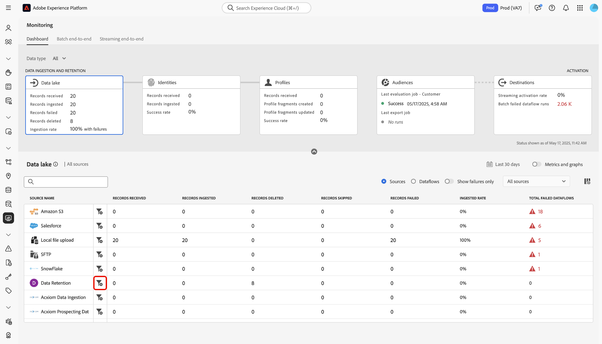
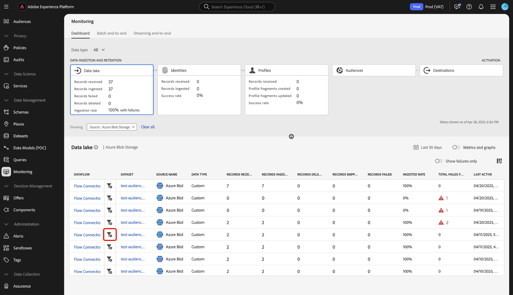

# Surveiller les flux de données pour les sources dans l’interface utilisateur

>[!IMPORTANT]
>
>Les sources en flux continu, telles que la [source d’API HTTP](../../sources/connectors/streaming/http.md), ne sont actuellement pas prises en charge par le tableau de bord de surveillance. Actuellement, vous ne pouvez utiliser que le tableau de bord pour surveiller les sources de lots.

Lisez ce document pour savoir comment utiliser le tableau de bord de surveillance pour surveiller les flux de données de sources dans l’interface utilisateur de l’Experience Platform.

## Commencer {#get-started}

Ce tutoriel nécessite une compréhension du fonctionnement des composants suivants d’Adobe Experience Platform :

* [Flux de données](../home.md) : les flux de données sont une représentation des tâches de données qui déplacent ces dernières dans Platform. Les flux de données sont configurés sur différents services, ce qui permet de déplacer les données des connecteurs sources vers des jeux de données cibles, vers [!DNL Identity] et [!DNL Profile], et vers [!DNL Destinations].
   * [Exécutions de flux de données](../../sources/notifications.md) : les exécutions de flux de données sont les tâches planifiées récurrentes en fonction de la configuration de fréquence des flux de données sélectionnés.
* [Sources](../../sources/home.md) : Experience Platform permet d’ingérer des données provenant de diverses sources tout en vous offrant la possibilité de structurer, de libeller et d’améliorer les données entrantes à l’aide des services de Platform.
* [Service d’identités](../../identity-service/home.md) : obtenez une meilleure compréhension des clients individuels et de leurs comportements en reliant les identités entre les appareils et les systèmes.
* [Profil client en temps réel](../../profile/home.md) : fournit un profil client en temps réel unifié basé sur des données agrégées issues de plusieurs sources.
* [Sandbox](../../sandboxes/home.md) : Experience Platform fournit des sandbox virtuels qui divisent une instance de plateforme unique en environnements virtuels distincts pour favoriser le développement et l’évolution d’applications d’expérience digitale.

## Surveillez les données de vos sources à l’aide du tableau de bord de surveillance.

>[!CONTEXTUALHELP]
>id="platform_monitoring_source_ingestion"
>title="Ingestion source"
>abstract="La vue Ingestion source contient des informations sur l&#39;état et les mesures de l&#39;activité des données dans le service de lac de données, y compris les enregistrements ingérés et les enregistrements ayant échoué. Consultez le guide de définition des mesures pour en savoir plus sur les mesures et les graphiques."
>text="Learn more in documentation"

>[!CONTEXTUALHELP]
>id="platform_monitoring_dataflow_run_details_ingestion"
>title="Détails de l’exécution du flux de données"
>abstract="Le traitement des sources contient des informations sur l&#39;état de l&#39;activité des données et des mesures dans le service de lac de données, y compris les enregistrements ingérés et les enregistrements ayant échoué. Consultez le guide de définition des mesures pour en savoir plus sur les mesures et les graphiques."
>text="Learn more in documentation"

<!-- In the [Platform UI](https://platform.adobe.com), select **[!UICONTROL Monitoring]** from the left navigation to access the [!UICONTROL Monitoring] dashboard. The [!UICONTROL Monitoring] dashboard contains metrics and information on all sources dataflows, including insights into the health of data traffic from a source to [!DNL Identity Service], and to [!DNL Profile].

At the center of the dashboard is the [!UICONTROL Source ingestion] panel, which contains metrics and graphs that display data on records ingested and records failed. -->

Dans le tableau de bord de surveillance, sélectionnez [!UICONTROL Sources] dans l’en-tête principal pour mettre à jour votre tableau de bord avec un affichage du taux d’ingestion du flux de données de vos sources.

Le graphique [!UICONTROL Taux d’ingestion] affiche le taux d’ingestion des données en fonction de la période que vous avez configurée. Par défaut, le tableau de bord de surveillance affiche le taux d’ingestion des dernières 24 heures. Pour savoir comment configurer votre période, lisez le guide sur la [configuration de la période de surveillance](monitor.md#configure-monitoring-time-frame).

Le graphique est activé par défaut. Pour masquer le graphique, sélectionnez **[!UICONTROL Mesures et graphiques]** pour désactiver le bouton d’activation/désactivation et masquer le graphique.

La partie inférieure du tableau de bord affiche un tableau qui décrit le rapport des mesures actives pour tous les flux de données de sources existants.

| Mesures | Description |
| --- | --- |
| Enregistrements reçus | Nombre total d’enregistrements reçus d’une source donnée. |
| Enregistrements ingérés | Nombre total d’enregistrements ingérés dans le lac de données. |
| Enregistrements ignorés | Nombre total d’enregistrements ignorés. Un enregistrement ignoré fait référence à des champs qui ont été ignorés car ils n’étaient pas nécessaires à l’ingestion. Par exemple, si vous créez un flux de données de sources avec l’ingestion partielle activée, vous pouvez configurer un seuil de taux d’erreur acceptable. Pendant le processus d’ingestion, l’ingestion ignore les enregistrements des champs qui ne sont pas obligatoires, tels que les champs d’identité, tant qu’ils se trouvent dans le seuil d’erreur. |
| Échec des enregistrements | Nombre total d’enregistrements qui n’ont pas pu être ingérés en raison d’erreurs. |
| Taux d&#39;ingestion | Pourcentage d’enregistrements ingérés en fonction du nombre total d’enregistrements reçus. |
| Nombre total de flux de données ayant échoué | Nombre total de flux de données ayant échoué. |

{style="table-layout:auto"}

Vous pouvez filtrer davantage vos données à l’aide des options fournies au-dessus du tableau de mesures :

| Options de filtrage | Description |
| --- | --- |
| Rechercher | Utilisez la barre de recherche pour filtrer votre vue selon un type de source unique. |
| Sources | Sélectionnez **[!UICONTROL Sources]** pour filtrer votre vue et afficher les données de mesure par type de source. Il s’agit de l’affichage par défaut utilisé par le tableau de bord de surveillance. |
| Flux de données | Sélectionnez **[!UICONTROL Flux de données]** pour filtrer votre vue et afficher les données de mesure par flux de données. |
| Afficher uniquement les échecs | Sélectionnez **[!UICONTROL Afficher uniquement les échecs]** pour filtrer votre vue et afficher uniquement les flux de données qui ont signalé des échecs d’ingestion. |
| Mes sources | Vous pouvez filtrer davantage votre vue à l’aide du menu déroulant [!UICONTROL Mes sources] . Utilisez le menu déroulant pour filtrer votre vue par catégorie. Vous pouvez également sélectionner **[!UICONTROL Toutes les sources]** pour afficher les mesures sur l’ensemble des sources ou **[!UICONTROL Mes sources]** pour afficher uniquement les sources avec lesquelles vous disposez d’un compte correspondant. |

{style="table-layout:auto"}

Pour surveiller les données ingérées dans un flux de données spécifique, sélectionnez l’icône de filtre  en regard d’une source.

Le tableau des mesures est mis à jour vers un tableau de flux de données actifs qui correspondent à la source que vous avez sélectionnée. Au cours de cette étape, vous pouvez afficher des informations supplémentaires sur vos flux de données, y compris leur jeu de données et type de données correspondants, ainsi qu’un horodatage pour indiquer le moment où ils ont été activés pour la dernière fois.

Pour examiner un flux de données plus en détail, sélectionnez l’icône de filtre  en regard d’un flux de données.

Ensuite, vous accédez à une interface qui répertorie toutes les itérations d’exécution de flux de données du flux que vous avez sélectionné.

Les exécutions de flux de données représentent une instance d’exécution de flux de données. Par exemple, si un flux de données est planifié pour s’exécuter toutes les heures à 9h00, 10h00 et 11h00, vous aurez trois instances d’une exécution de flux. Les exécutions de flux sont spécifiques à votre organisation.

Pour examiner les mesures d’une itération d’exécution de flux de données spécifique, sélectionnez l’icône de filtre  en regard de votre flux de données.

Utilisez la page des détails d’exécution du flux de données pour afficher les mesures et les informations de l’itération d’exécution sélectionnée.

| Détails de l’exécution du flux de données | Description |
| --- | --- |
| Enregistrements ingérés | Le nombre total d’enregistrements ingérés à partir de l’exécution du flux de données. |
| Échec des enregistrements | Nombre total d’enregistrements qui n’ont pas été ingérés en raison d’erreurs dans l’exécution du flux de données. |
| Nombre total de fichiers | Le nombre total de fichiers dans le flux de données s’exécute. |
| Taille des données | Taille totale des données contenues dans le flux de données. |
| ID d’exécution du flux de données | L’identifiant de l’itération de l’exécution du flux de données. |
| ID d’organisation | Identifiant de l’organisation dans laquelle le flux de données a été créé. |
| Statut | État de l’exécution du flux de données. |
| Début de l’exécution du flux de données | Horodatage indiquant le début de l’exécution du flux de données. |
| Fin de l’exécution du flux de données | Horodatage indiquant la fin de l’exécution du flux de données. |
| Jeu de données | Jeu de données utilisé pour créer le flux de données. |
| Type de données | Type des données qui se trouvaient dans le flux de données. |
| Ingestion partielle | L’ingestion par lots partielle permet d’ingérer des données contenant des erreurs, jusqu’à un certain seuil configurable. Cette fonctionnalité vous permet d’ingérer toutes vos données précises dans Experience Platform, tandis que toutes vos données incorrectes sont traitées par lots séparément avec des informations sur les raisons de leur non-validité. Vous pouvez activer l’ingestion partielle pendant le processus de création du flux de données. |
| Diagnostics d’erreur | Les diagnostics d’erreur demandent à la source de produire des diagnostics d’erreur que vous pourrez ensuite référencer lors de la surveillance de l’activité et de l’état de votre jeu de données. Vous pouvez activer les diagnostics d’erreur pendant le processus de création du flux de données. |
| Résumé des erreurs | Dans le cas d’une exécution de flux de données ayant échoué, le résumé de l’erreur affiche un code d’erreur et une description pour résumer les raisons de l’échec de l’itération d’exécution. |

{style="table-layout:auto"}

Si votre flux de données génère des erreurs de rapports, vous pouvez faire défiler la page jusqu’au bas de la page et utiliser l’interface [!UICONTROL Erreurs d’exécution de flux de données] .

Utilisez la section [!UICONTROL Échec des enregistrements] pour afficher les mesures sur les enregistrements qui n’ont pas été ingérés en raison d’erreurs. Pour afficher un rapport d’erreur complet, sélectionnez **[!UICONTROL Prévisualiser les diagnostics d’erreur]**. Pour télécharger une copie de vos diagnostics d’erreur et de votre manifeste de fichier, sélectionnez **[!UICONTROL Télécharger]**, puis copiez l’exemple d’appel API à utiliser avec l’API [!DNL Data Access].

>[!NOTE]
>
>Vous ne pouvez utiliser les diagnostics d’erreur que si la fonctionnalité a été activée pendant le processus de création de la connexion source.

## Étapes suivantes {#next-steps}

En suivant ce tutoriel, vous avez suivi avec succès le flux de données d’ingestion au niveau de la source à l’aide du tableau de bord **[!UICONTROL Surveillance]** . Vous avez également identifié des erreurs qui ont contribué à l’échec des flux de données pendant le processus d’ingestion. Consultez les documents suivants pour plus d’informations :

* [Surveillance des données d’identité](./monitor-identities.md).
* [Surveillance des données de profil](./monitor-profiles.md).
