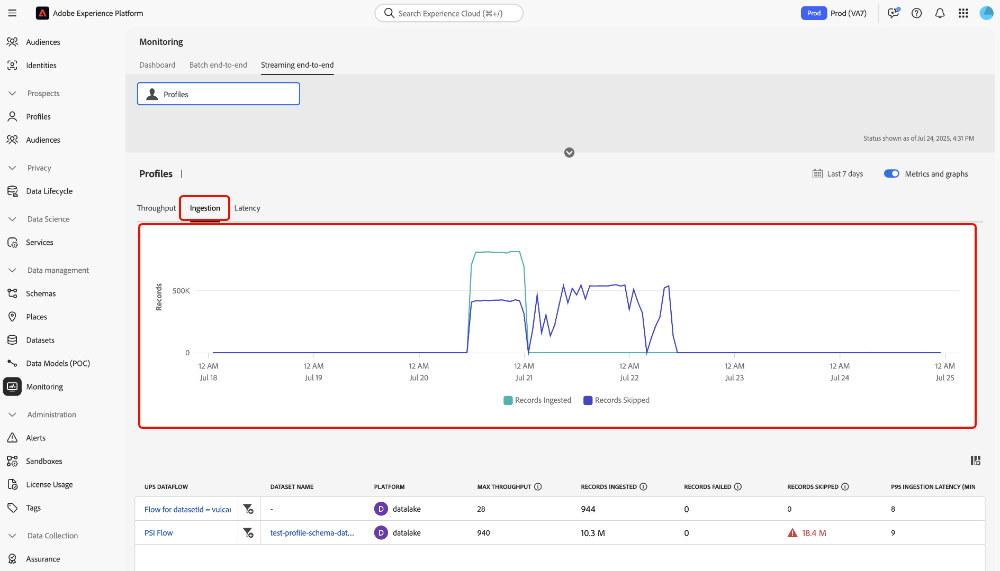
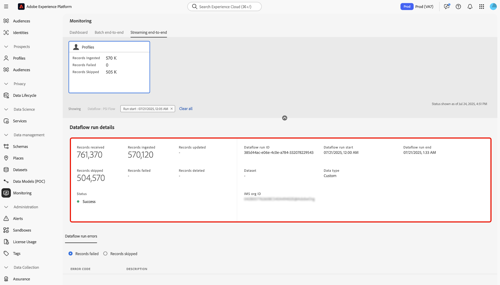

# Surveiller l’ingestion des profils de streaming

Vous pouvez utiliser le tableau de bord de surveillance dans l’interface utilisateur de Adobe Experience Platform pour effectuer la surveillance en temps réel de l’ingestion de profils par flux au sein de votre organisation. Utilisez cette fonctionnalité pour accéder à une plus grande transparence des mesures de débit, de latence et de qualité des données liées à vos données de diffusion en continu. De plus, utilisez cette fonctionnalité pour obtenir des alertes proactives et récupérer des informations exploitables afin d’identifier les violations de capacité potentielles et les problèmes d’ingestion de données.

Lisez le guide suivant pour savoir comment utiliser le tableau de bord de surveillance afin de suivre les taux et les mesures des tâches d’ingestion de profil en flux continu dans votre organisation.

## Commencer

Ce guide nécessite une compréhension professionnelle des composants suivants d’Experience Platform :

* [Flux de données](../home.md) : les flux de données représentent des tâches de données qui transfèrent des informations dans Experience Platform. Ils sont configurés sur différents services pour faciliter le déplacement des données des connecteurs sources vers les jeux de données cibles, ainsi que vers le service d’identités, le profil client en temps réel et les destinations.
* [Real-Time Customer Profile](../../profile/home.md) : le profil client en temps réel combine des données provenant de plusieurs sources (en ligne, hors ligne, CRM et tierces) en une vue unique et exploitable de chaque client, offrant des expériences cohérentes et personnalisées sur tous les points de contact.
* [Ingestion par flux](../../ingestion/streaming-ingestion/overview.md) : l’ingestion par flux pour Experience Platform fournit aux utilisateurs une méthode pour envoyer en temps réel des données d’appareils côté client et côté serveur à Experience Platform. Experience Platform vous permet de générer des expériences coordonnées, cohérentes et pertinentes en générant un profil client en temps réel pour chacun de vos clients. &#x200B;L’ingestion par flux joue un rôle essentiel dans la création de ces profils avec le moins de latence possible.
* [Capacités](../../landing/license-usage-and-guardrails/capacity.md) : dans Experience Platform, les capacités vous permettent de savoir si votre organisation a dépassé l’un de vos mécanismes de sécurisation et vous donnent des informations sur la manière de résoudre ces problèmes.

>[!NOTE]
>
>La capacité de débit en flux continu prend en charge jusqu’à 1 500 événements entrants par seconde. Vous pouvez acheter une segmentation en flux continu supplémentaire pour prendre en charge jusqu’à 13 500 événements entrants supplémentaires par seconde&#x200B;. Pour plus d’informations, reportez-vous aux descriptions de produits des packages Real-Time CDP B2C Edition - Prime et Ultimate [&#128279;](https://helpx.adobe.com/fr/legal/product-descriptions/real-time-customer-data-platform-b2c-edition-prime-and-ultimate-packages.html).

## Surveillance des mesures pour l’ingestion de profils de streaming {#streaming-profile-metrics}

>[!CONTEXTUALHELP]
>id="platform_monitoring_streaming_profile"
>title="Surveiller l’ingestion des profils de streaming"
>abstract="Le tableau de bord de surveillance des profils de streaming affiche des informations sur le débit, les taux d’ingestion et la latence. Utilisez ce tableau de bord pour afficher, comprendre et analyser les mesures de traitement des données. de vos profils de streaming dans Experience Platform."
>text="Learn more in documentation"

>[!CONTEXTUALHELP]
>id="platform_monitoring_streaming_profile_request_throughput"
>title="Débit de demande"
>abstract="Cette mesure représente le nombre d’événements entrant dans le système d’ingestion par seconde."
>text="Learn more in documentation"

>[!CONTEXTUALHELP]
>id="platform_monitoring_streaming_profile_processing_throughput"
>title="Débit de traitement"
>abstract="Cette mesure représente le nombre d’événements ingérés avec succès par le système chaque seconde."
>text="Learn more in documentation"

>[!CONTEXTUALHELP]
>id="platform_monitoring_streaming_profile_p95_ingestion_latency"
>title="Latence d’ingestion P95"
>abstract="Cette mesure mesure la latence du 95e centile entre le moment où un événement arrive dans Experience Platform et celui où il est ingéré avec succès dans la banque de profils."
>text="Learn more in documentation"

>[!CONTEXTUALHELP]
>id="platform_monitoring_streaming_profile_max_throughput"
>title="Débit maximal"
>abstract="Cette mesure représente le nombre maximal de demandes entrantes par seconde entrant dans l’ingestion de profil de streaming."
>text="Learn more in documentation"

>[!CONTEXTUALHELP]
>id="platform_monitoring_streaming_profile_records_ingested"
>title="Enregistrements ingérés"
>abstract="Cette mesure représente le nombre total d’enregistrements ingérés dans la banque de profils au cours d’une période configurée."
>text="Learn more in documentation"

>[!CONTEXTUALHELP]
>id="platform_monitoring_streaming_profile_records_failed"
>title="Enregistrements ayant échoué"
>abstract="Cette mesure représente le nombre total d’enregistrements qui ont échoué lors de l’ingestion dans la banque de profils au cours d’une période configurée en raison d’erreurs."
>text="Learn more in documentation"

>[!CONTEXTUALHELP]
>id="platform_monitoring_streaming_profile_records_skipped"
>title="Enregistrements ignorés"
>abstract="Cette mesure représente le nombre total d’enregistrements supprimés pendant une période configurée, en raison de violations de la configuration ou de la capacité."
>text="Learn more in documentation"

>[!CONTEXTUALHELP]
>id="platform_monitoring_streaming_profile_error_details"
>title="Détails des erreurs"
>abstract="Cette mesure représente le nombre d’événements ayant échoué en raison d’erreurs."
>text="Learn more in documentation"

Utilisez le tableau des mesures pour obtenir des informations spécifiques à vos flux de données. Reportez-vous au tableau suivant pour plus d’informations sur chaque colonne.

| Mesure | Description | Dimensions | Fréquence de mesure |
| --- | --- | --- | --- |
| Débit de demande | Cette mesure représente le nombre d’événements entrant dans le système d’ingestion par seconde. | Sandbox/flux de données | Surveillance en temps réel avec une actualisation des données toutes les 60 secondes. |
| Débit de traitement | Cette mesure représente le nombre d’événements ingérés avec succès par le système chaque seconde. | Sandbox/flux de données | Surveillance en temps réel avec une actualisation des données toutes les 60 secondes. |
| Latence d’ingestion P95 | Cette mesure mesure la latence du 95e centile entre le moment où un événement arrive dans Experience Platform et celui où il est ingéré avec succès dans la banque de profils. | Sandbox/flux de données | Surveillance en temps réel avec une actualisation des données toutes les 60 secondes. |
| Débit maximal | Cette mesure représente le nombre maximal de requêtes entrantes par seconde entrant dans l’ingestion de profil en flux continu | <ul><li>Sandbox/flux de données</li><li>Exécution du flux de données</li></ul> |
| Enregistrements ingérés | Cette mesure représente le nombre total d’enregistrements ingérés dans la banque de profils au cours d’une période configurée. | <ul><li>Sandbox/flux de données</li><li>Exécution du flux de données</li></ul> | <ul><li>Sandbox/flux de données : surveillance en temps réel avec une actualisation des données toutes les 60 secondes.</li><li>Exécution du flux de données : regroupée en 15 minutes.</li></ul> |
| Enregistrements ayant échoué | Cette mesure représente le nombre total d’enregistrements qui ont échoué lors de l’ingestion dans la banque de profils au cours d’une période configurée en raison d’erreurs. | <ul><li>Sandbox/flux de données</li><li>Exécution du flux de données</li></ul> | <ul><li>Sandbox/flux de données : surveillance en temps réel avec une actualisation des données toutes les 60 secondes.</li><li>Exécution du flux de données : regroupée en 15 minutes.</li></ul> |
| Enregistrements ignorés | Cette mesure représente le nombre total d’enregistrements supprimés pendant une période configurée, en raison de violations de la configuration ou de la capacité. | <ul><li>Sandbox/flux de données</li><li>Exécution du flux de données</li></ul> | <ul><li>Sandbox/flux de données : surveillance en temps réel avec une actualisation des données toutes les 60 secondes.</li><li>Exécution du flux de données : regroupée en 15 minutes.</li></ul> |
| Détails des erreurs | Cette mesure représente le nombre d’événements ayant échoué en raison d’erreurs. | Exécution du flux de données | Regroupé dans une fenêtre horaire. |

{style="table-layout:auto"}

## Utiliser le tableau de bord de surveillance pour l’ingestion de profils en flux continu

Pour accéder au tableau de bord de surveillance de l’ingestion de profils en flux continu, accédez à l’interface utilisateur d’Experience Platform, sélectionnez **[!UICONTROL Surveillance]** dans le volet de navigation de gauche, puis sélectionnez **[!UICONTROL Diffusion en flux continu de bout en bout]**.

Reportez-vous à l’en-tête supérieur du tableau de bord pour la carte de mesures *[!UICONTROL Profil]*. Utilisez cet affichage pour afficher des informations sur les enregistrements ingérés, ayant échoué et ignorés, ainsi que sur le statut actuel du débit et de la latence des demandes.

Ensuite, utilisez l’interface pour afficher des informations détaillées sur les mesures d’ingestion de votre profil de diffusion en continu. Utilisez la fonction de calendrier pour basculer entre différentes périodes. Vous pouvez effectuer un choix parmi les fenêtres temporelles préconfigurées suivantes :

* [!UICONTROL 6 dernières heures]
* [!UICONTROL 12 dernières heures]
* [!UICONTROL Dernières 24 heures]
* [!UICONTROL 7 derniers jours]
* [!UICONTROL 30 derniers jours]

Vous pouvez également configurer manuellement votre propre période à l’aide du calendrier.

Vous pouvez utiliser trois catégories de mesures différentes dans le tableau de bord de surveillance pour l’ingestion de profils en flux continu : [!UICONTROL Débit], [!UICONTROL Ingestion] et [!UICONTROL Latence].

>[!BEGINTABS]

>[!TAB Débit]

Sélectionnez **[!UICONTROL Débit]** pour afficher des informations sur la quantité de données qu’Experience Platform traite selon une période configurée. Consultez cette mesure pour évaluer l’efficacité et la capacité de votre système.

* **[Capacité](../../landing/license-usage-and-guardrails/capacity.md)** : quantité maximale de données que votre sandbox peut traiter dans des conditions définies.
* **Débit des requêtes** : taux auquel les événements sont reçus par le système d’ingestion, mesuré en événements par seconde.
* **Débit de traitement** : taux auquel le système ingère et traite avec succès les payloads d’événement entrant, mesuré en événements par seconde.

>[!TAB  Ingestion ]

**Ingestion** : sélectionnez **[!UICONTROL Ingestion]** pour afficher des informations sur les tâches d’ingestion dans votre sandbox. Ces traitements d’ingestion sont mesurés dans trois mesures différentes.

* **Enregistrements ingérés** : quantité totale d&#39;enregistrements créés au cours d&#39;une période donnée. Cette mesure représente les processus d’ingestion de données réussis dans votre sandbox.
* **Enregistrements ignorés** : nombre total d’enregistrements qui n’ont pas été ingérés en raison d’erreurs.
* **Enregistrements ignorés** : nombre total d’enregistrements qui ont été ignorés en raison d’un dépassement des limites de capacité.

>[!TAB  Latence ]

Sélectionnez **[!UICONTROL Latence]** pour afficher des informations sur le temps nécessaire à Experience Platform pour répondre à une demande ou effectuer une opération au cours d’une période donnée.

>[!ENDTABS]

### Utiliser le tableau des mesures de flux de données

Le tableau des flux de données répertorie toutes les activités d’ingestion en flux continu avec l’ensemble de mesures correspondant pour le profil client en temps réel. Chaque flux de données est répertorié avec son jeu de données correspondant.

Si vous approchez des limites de votre capacité au niveau du sandbox, vous pouvez vous reporter à la colonne [!UICONTROL Débit maximal] pour identifier tous les flux de données existants qui contribuent à vos taux de consommation. Lisez la [section des bonnes pratiques](#best-practices) pour plus d’informations sur les bonnes pratiques de gestion des flux de données.

Pour surveiller les données ingérées dans un flux de données spécifique, sélectionnez l’icône de filtre  à côté du nom du flux de données.

Ensuite, utilisez l’interface des mesures de flux de données pour sélectionner l’exécution de flux spécifique à inspecter. Sélectionnez l’icône de filtre  à côté d’une itération d’exécution de flux pour afficher les mesures spécifiques à l’exécution de flux sélectionnée.

Les exécutions de flux de données représentent une instance d’exécution de flux de données. Par exemple, si un flux de données est planifié pour s’exécuter toutes les heures à 9 heures:00, 10 :00 et 11 :00 du matin, vous auriez trois instances d’exécution de flux. Les exécutions de flux sont spécifiques à votre organisation.

Utilisez la page Détails de l’exécution du flux de données pour afficher les mesures et les informations relatives à l’itération d’exécution sélectionnée.

## Bonnes pratiques relatives à la gestion des flux de données {#best-practices}

Lisez la section suivante pour plus d’informations sur la meilleure façon de gérer vos flux de données et d’optimiser votre consommation de données sur Experience Platform.

### Évaluation et optimisation des flux de données d’ingestion en flux continu

Pour garantir une ingestion en flux continu efficace, passez en revue et ajustez vos flux de données et votre stratégie de traitement :

* **Évaluation de l’utilisation actuelle** : identifier les flux de données et les jeux de données qui contribuent le plus au débit.
* **Hiérarchiser les données importantes** : certaines données peuvent ne pas être nécessaires. Excluez les données qui ne prennent pas en charge vos cas d’utilisation pour réduire le stockage et améliorer l’efficacité.
* **Optimiser le mode de traitement** : déterminez si certaines données peuvent être déplacées de la diffusion en continu vers l’ingestion par lots. Réservez la diffusion en continu aux cas d’utilisation qui nécessitent une faible latence, comme la segmentation en temps réel.

### Planifier la capacité et le trafic saisonnier

Si votre limite actuelle de 1 500 événements **par seconde** est insuffisante, envisagez d’optimiser votre stratégie de données ou d’augmenter la capacité de votre licence :

* **Analyser l’utilisation des jeux de données et des sandbox** : examiner les données actuelles et historiques pour comprendre comment le trafic et l’engagement affectent le débit de segmentation en flux continu.
* **Tenir compte du caractère saisonnier** : identifier les périodes de pic de trafic générées par des campagnes marketing récurrentes ou des cycles spécifiques au secteur.
* **Prévoir la demande future** : estimer les volumes de trafic et d’engagement à venir en fonction des tendances saisonnières passées, des campagnes prévues ou des événements majeurs.

| Facteur contributif | Ce que c&#39;est | Impact sur les cas d’utilisation | Bonnes pratiques |
| --- | --- | --- | --- |
| Conversion par lots en flux continu | Les charges de travail par lots converties en flux continu peuvent augmenter considérablement le débit et affecter les performances et l’allocation des ressources. Par exemple, l’exécution d’une mise à jour de profil en bloc après un événement sans limites de débit. | Les stratégies de diffusion en continu sont inutiles pour les cas d’utilisation par lots lorsqu’un traitement à faible latence n’est pas nécessaire. | Évaluez les exigences du cas d’utilisation. Pour le marketing sortant par lots, pensez à utiliser l’[ingestion par lots](../../ingestion/batch-ingestion/overview.md) plutôt que la diffusion en continu pour gérer plus efficacement l’ingestion des données. |
| Ingestion de données inutile | L’ingestion de données non requises pour la personnalisation augmente le débit sans valeur ajoutée, ce qui entraîne une perte de ressources. Par exemple, l’ingestion de tout le trafic d’analyse dans des profils quelle que soit la pertinence. | L’excès de données non pertinentes crée du bruit, ce qui rend plus difficile l’identification des points de données pertinents. Cela peut également entraîner des frictions lors de la définition et de la gestion des audiences et des profils. | Ingérez uniquement les données requises pour vos cas d’utilisation. Veillez à filtrer les données inutiles.<ul><li>**Adobe Analytics** : utilisez le [filtrage au niveau des lignes](../../sources/tutorials/ui/create/adobe-applications/analytics.md#filtering-for-real-time-customer-profile) pour optimiser la saisie des données.</li><li>**Sources** : utilisez l’API [[!DNL Flow Service] API pour filtrer les données au niveau des lignes](../../sources/tutorials/api/filter.md) pour les sources prises en charge telles que [!DNL Snowflake] et [!DNL Google BigQuery].</li></li>**Flux de données Edge** : configurez [flux de données dynamiques](../../datastreams/configure-dynamic-datastream.md) pour effectuer un filtrage au niveau des lignes du trafic provenant du SDK Web.</li></ul> |

{style="table-layout:auto"}

## Étapes suivantes {#next-steps}

En suivant ce tutoriel, vous avez appris à surveiller les traitements d’ingestion de profils en flux continu dans votre entreprise. Lisez les documents suivants pour obtenir des informations supplémentaires sur la surveillance des données pour le profil client en temps réel.

* [Utiliser le tableau de bord de surveillance](./monitor.md).
* [Surveiller les données de profil](./monitor-profiles.md).
