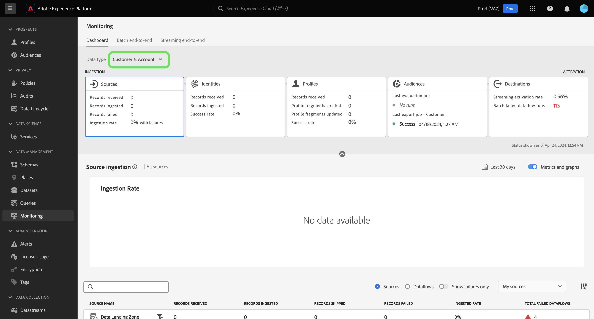

# Présentation du tableau de bord de surveillance

Utilisez le tableau de bord de surveillance dans l’interface utilisateur de Adobe Experience Platform pour afficher le parcours de vos données, de l’ingestion à l’activation. Avec le tableau de bord de surveillance, vous pouvez :

* Surveillez le parcours de vos données à partir des sources, du service d’identités, du profil client en temps réel, des audiences, et enfin dans les destinations.
* Affichez différentes mesures et différents statuts en fonction de l’étape à laquelle se trouvent vos données.
* Filtrez votre vue de surveillance des données par type de données.

Le tableau de bord de surveillance prend en charge la vue de plusieurs types de données différents :

* **Client et compte** : les données client font référence aux données utilisées dans [Real-Time Customer Data Platform](../../rtcdp/home.md), tandis que les données de compte font référence aux données [profils de compte](../../rtcdp/accounts/account-profile-overview.md) accessibles lors de l’abonnement à [Real-Time CDP, B2B edition](../../rtcdp/b2b-overview.md). Si votre licence Real-Time CDP n’inclut pas Real-Time CDP, B2B edition, vous pouvez uniquement utiliser le tableau de bord de surveillance pour surveiller les données client.
* **Prospect** : les [profils de prospects](../../profile/ui/prospect-profile.md) sont utilisés pour représenter des personnes qui n’ont pas encore interagi avec votre entreprise, mais avec lesquelles vous souhaitez établir un contact. Avec les profils de prospect, vous pouvez compléter vos profils client avec des attributs provenant de partenaires tiers de confiance. Vous devez disposer d’une licence Real-Time CDP (App Service), Adobe Experience Platform Activation, Real-Time CDP, Real-Time CDP Prime, Real-Time CDP Ultimate pour afficher le type de données du prospect.
* **Enrichissement du profil de compte** : les profils de compte vous permettent d’unifier les informations de compte provenant de plusieurs sources. Vous devez disposer d’une licence Real-Time CDP, B2B edition pour surveiller les données d’enrichissement du profil de compte.

Lisez ce document pour savoir comment utiliser le tableau de bord de surveillance pour surveiller le parcours de vos données sur différents services Experience Platform.

## Commencer

Ce document nécessite une compréhension du fonctionnement des composants suivants d’Experience Platform :

* [Flux de données](../home.md) : les flux de données sont des représentations des tâches de données qui déplacent ces dernières dans Experience Platform. Vous pouvez utiliser l’espace de travail des sources pour créer des flux de données qui ingèrent des données d’une source donnée vers Experience Platform.
* [Sources](../../sources/home.md) : utilisez des sources dans Experience Platform pour ingérer des données à partir d’une application Adobe ou d’une source de données tierce.
* [Service d’identités](../../identity-service/home.md) : obtenez une meilleure compréhension des clients individuels et de leurs comportements en reliant les identités entre les appareils et les systèmes.
* [Profil client en temps réel](../../profile/home.md) : fournit un profil client en temps réel unifié basé sur des données agrégées issues de plusieurs sources.
* [Segmentation](../../segmentation/home.md) : utilisez le service de segmentation pour créer des segments et des audiences à partir de vos données du profil client en temps réel.
* [Destinations](../../destinations/home.md) : les destinations sont des intégrations préconfigurées aux applications couramment utilisées. Elles permettent l’activation transparente des données d’Experience Platform pour les campagnes marketing cross-canal, les campagnes par e-mail, la publicité ciblée et de nombreux autres cas d’utilisation.

## Guide du tableau de bord de surveillance

Dans l’interface utilisateur d’Experience Platform, sélectionnez **[!UICONTROL Surveillance]** sous [!UICONTROL Gestion des données] dans le volet de navigation de gauche.

Sélectionnez **[!UICONTROL Type de données]** puis utilisez le menu déroulant pour sélectionner le type de données à afficher. Les types de données sont définis par les classes de schéma du modèle de données d’expérience (XDM) afin de s’assurer que leurs données suivent un format standard lors de leur ingestion dans Experience Platform. Pour plus d’informations, consultez la documentation suivante :

* [Type de données de compte B2B](../../rtcdp/b2b-tutorial.md)
* [Type de données du prospect](../../rtcdp/partner-data/prospecting.md)

Vous pouvez filtrer votre vue en fonction des types de données suivants :

>[!BEGINTABS]

>[!TAB Tous]

Sélectionnez **[!UICONTROL Tout]** pour mettre à jour votre tableau de bord et afficher les mesures sur toutes les données ingérées dans Experience Platform au cours d’une période donnée.

>[!TAB Client et compte]

Sélectionnez **[!UICONTROL Client et compte]** pour mettre à jour votre tableau de bord et afficher les mesures sur les données de client et de compte qui ont été ingérées dans Experience Platform au cours d’une période donnée.

>[!TAB Prospect]

Sélectionnez **[!UICONTROL Prospect]** pour mettre à jour votre tableau de bord et afficher les mesures sur les données de prospection qui ont été ingérées dans Experience Platform au cours d’une période donnée. **Remarque** : vous ne pouvez afficher les activités de type données de prospect que si vous êtes [ autorisé à consulter les données du prospect](../../rtcdp/partner-data/prospecting.md).

>[!TAB Enrichissement du profil de compte]

Sélectionnez **[!UICONTROL Enrichissement du profil du compte]** pour mettre à jour votre tableau de bord et afficher les mesures sur les données d’enrichissement du profil. **Remarque** : vous ne pouvez afficher les mesures d’enrichissement du profil de compte que si vous êtes autorisé à [ des données B2B](../../rtcdp/b2b-tutorial.md).

>[!ENDTABS]

Utilisez l’en-tête supérieur du tableau de bord pour une expérience de surveillance inter-services. Vous pouvez filtrer la vue de vos mesures et de vos graphiques en sélectionnant la carte de fonctionnalité de votre choix dans l’en-tête de catégorie de données.

>[!BEGINTABS]

>[!TAB Sources]

Sélectionnez **[!UICONTROL Sources]** pour afficher les mesures sur votre taux d’ingestion des sources. Lisez le guide sur la [surveillance des données des sources](monitor-sources.md) pour plus d’informations.

>[!TAB  Identités ]

Sélectionnez **[!UICONTROL Identités]** pour afficher le taux de réussite du traitement de vos données d’identité. Lisez le guide sur la [surveillance des données d’identité](monitor-identities.md) pour plus d’informations.

>[!TAB Profils]

Sélectionnez **[!UICONTROL Profils]** pour afficher le taux de réussite du traitement des données de votre profil. Lisez le guide sur la [surveillance des données de profil](monitor-profiles.md) pour plus d’informations.

>[!TAB Audiences]

Sélectionnez **[!UICONTROL Audiences]** pour afficher les mesures sur vos audiences et vos tâches de segmentation. Lisez le guide sur la [surveillance des données d’audience](monitor-audiences.md) pour plus d’informations.

>[!TAB Destinations]

Sélectionnez **[!UICONTROL Destinations]** pour afficher les mesures sur vos [!UICONTROL Taux d’activation de diffusion en continu] et [!UICONTROL Échecs d’exécution de flux de données par lots]. Lisez le guide sur la [surveillance des données de destination](monitor-destinations.md) pour plus d’informations.

>[!ENDTABS]

### Configuration de la période de surveillance {#configure-monitoring-time-frame}

Par défaut, le tableau de bord de surveillance affiche les mesures relatives aux données ingérées au cours des dernières 24 heures. Pour mettre à jour la période, sélectionnez **[!UICONTROL Dernières 24 heures]**.

Vous pouvez configurer une nouvelle période pour votre vue de surveillance des données dans la boîte de dialogue qui s’affiche. Vous avez la possibilité de créer une période personnalisée ou de sélectionner l’une des options préconfigurées suivantes :

* [!UICONTROL Dernières 24 heures]
* [!UICONTROL 7 derniers jours]
* [!UICONTROL 30 derniers jours]

Lorsque vous avez terminé, sélectionnez **[!UICONTROL Appliquer]**.

## Étapes suivantes

En lisant ce document, vous pouvez désormais naviguer dans le tableau de bord de surveillance dans l’interface utilisateur. Pour plus d’informations sur la surveillance des données pour un service Experience Platform spécifique, consultez la documentation ci-dessous :

* [Surveiller les données des sources](monitor-sources.md).
* [Surveiller les données d’identité](monitor-identities.md).
* [Surveiller les données de profil](monitor-profiles.md).
* [Surveiller les données d’audience](monitor-audiences.md).
* [Surveiller les données des destinations](monitor-destinations.md).
