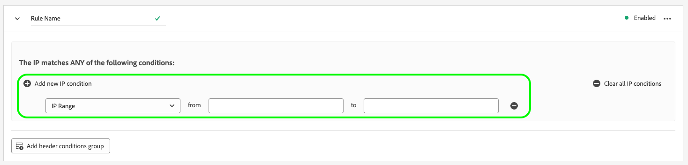

# Configuration de la détection des robots pour les flux de données

Le trafic non humain provenant de programmes automatisés, de web scrapers, d’araignées et de scanners scriptés peut rendre difficile l’identification d’événements provenant de visiteurs humains. Ce type de trafic peut avoir un impact négatif sur des mesures commerciales importantes, ce qui entraîne des rapports de trafic incorrects.

La détection des robots vous permet d’identifier les événements générés par les [Web SDK](/help/collection/js/js-overview.md), [Mobile SDK](https://developer.adobe.com/client-sdks/home/) et [[!DNL Edge Network API]](https://developer.adobe.com/data-collection-apis/docs/api/) comme étant générés par des araignées et des robots connus.

En configurant la détection des robots pour vos flux de données, vous pouvez identifier des adresses IP spécifiques, des plages d’adresses IP et des en-têtes de requête à classer en tant qu’événements de robots. Vous obtiendrez ainsi une mesure plus précise de l’activité des utilisateurs sur votre site ou application mobile.

Lorsqu’une requête envoyée à Edge Network correspond à l’une des règles de détection des robots, le schéma XDM est mis à jour avec un score de robot (toujours défini sur 1), comme illustré ci-dessous :

```json
{
  "botDetection": {
    "score": 1
  }
}
```

Ce score de robots aide les solutions recevant la demande à identifier correctement le trafic de robots.

>[!IMPORTANT]
>
>La détection des robots ne supprime aucune requête de robot. Il met uniquement à jour le schéma XDM avec le score des robots et transfère l’événement au service [datastream](configure.md) que vous avez configuré.
>
>Les solutions Adobe peuvent gérer la notation des robots de différentes manières. Par exemple, Adobe Analytics utilise son propre service [de filtrage des robots](https://experienceleague.adobe.com/docs/analytics/admin/admin-tools/manage-report-suites/edit-report-suite/report-suite-general/bot-removal/bot-rules.html?lang=fr) et n’utilise pas le score défini par Edge Network. Les deux services utilisent la même [liste de robots IAB](https://www.iab.com/guidelines/iab-abc-international-spiders-bots-list/), de sorte que la notation des robots est identique.

## Considérations techniques {#technical-considerations}

Avant d’activer la détection de robots sur vos flux de données, gardez à l’esprit les points suivants pour garantir des résultats précis et une implémentation fluide :

* La détection des robots s’applique uniquement aux requêtes non authentifiées envoyées à `edge.adobedc.net`.
* Les requêtes authentifiées envoyées à `server.adobedc.net` ne sont pas évaluées pour le trafic de robots, car le trafic authentifié est considéré comme digne de confiance.
* Les règles de détection de robots peuvent prendre jusqu’à 15 minutes pour se propager dans Edge Network après leur création.

## Conditions préalables {#prerequisites}

Pour que la détection des robots fonctionne sur votre flux de données, vous devez ajouter le groupe de champs **[!UICONTROL Bot Detection Information]** à votre schéma. Consultez la documentation [Schéma XDM](../xdm/ui/resources/schemas.md#add-field-groups) pour savoir comment ajouter des groupes de champs à un schéma.

## Configuration de la détection des robots pour les flux de données {#configure}

Vous pouvez configurer la détection des robots après avoir créé une configuration de train de données. Consultez la documentation sur la [création et configuration d’un flux de données](configure.md), puis suivez les instructions ci-dessous pour ajouter des fonctionnalités de détection de robots à votre flux de données.

Accédez à la liste des flux de données et sélectionnez le flux de données auquel vous souhaitez ajouter la détection des robots.


Dans la page des détails du flux de données, sélectionnez l’option **[!UICONTROL Bot Detection]** sur le rail de droite.


La page **[!UICONTROL Bot Detection Rules]** s’affiche.


Sur la page Règles de détection des robots , vous pouvez configurer la détection des robots à l’aide des fonctionnalités suivantes :

* Utilisation de l’[[!DNL [IAB/ABC International Spiders and Bots List]]](https://www.iab.com/guidelines/iab-abc-international-spiders-bots-list/) .
* Création de vos propres règles de détection des robots.

### Utiliser la liste internationale d&#39;araignées et de robots IAB/ABC {#iab-list}

La [IAB/ABC International Spiders and Bots List](https://www.iab.com/guidelines/iab-abc-international-spiders-bots-list/) est une liste d’araignées et de robots Internet tierce et standard. Cette liste vous permet d’identifier le trafic automatisé, tel que les robots d’exploration des moteurs de recherche, les outils de surveillance et tout autre trafic non humain que vous ne souhaitez pas inclure dans vos comptes d’analyse.

Pour configurer votre flux de données afin d’utiliser la liste internationale d’araignées et de robots IAB/ABC :

1. Activez/désactivez l’option **[!UICONTROL Use IAB/ABC International Spiders and Bots List for bot detection on this datastream]** .
2. Sélectionnez **[!UICONTROL Save]** pour appliquer les paramètres de détection des robots à votre flux de données.


### Création de règles de détection des robots {#rules}

Outre l’utilisation de la [Liste internationale d’araignées et de robots IAB/ABC](https://www.iab.com/guidelines/iab-abc-international-spiders-bots-list/), vous pouvez définir vos propres règles de détection des robots pour chaque flux de données.

Vous pouvez créer des règles de détection de robots basées sur **adresses IP** et **plages d’adresses IP**.

Si vous avez besoin de règles de détection de robots plus granulaires, vous pouvez combiner les conditions IP avec les conditions d’en-tête de requête. Les règles de détection de robots peuvent utiliser les en-têtes suivants :

| En-tête HTTP | Description |
| --- | --- |
| `user-agent` | En-tête qui permet aux serveurs et aux homologues réseau d’identifier l’application, le système d’exploitation, le fournisseur et/ou la version de l’agent utilisateur à l’origine de la demande. |
| `content-type` | Indique le type de média d’origine de la ressource (avant tout codage de contenu appliqué pour l’envoi). |
| `referer` | Identifie l’adresse de la page web à partir de laquelle la ressource a été demandée. |
| `sec-ch-ua` | Fournit la marque et la version significative de chaque marque associée au navigateur dans une liste séparée par des virgules. |
| `sec-ch-ua-mobile` | Indique si le navigateur se trouve sur un appareil mobile. Il peut également être utilisé par un navigateur de bureau pour indiquer une préférence pour une expérience utilisateur mobile. |
| `sec-ch-ua-platform` | Fournit la plateforme ou le système d’exploitation sur lequel l’agent utilisateur s’exécute. Par exemple : « Windows » ou « Android ». |
| `sec-ch-ua-platform-version` | Fournit la version du système d’exploitation sur lequel l’agent utilisateur s’exécute. |
| `sec-ch-ua-arch` | Fournit l’architecture CPU sous-jacente de l’agent-utilisateur, telle qu’ARM ou x86. |
| `sec-ch-ua-model` | Indique le modèle d’appareil sur lequel le navigateur s’exécute. |
| `sec-ch-ua-bitness` | Fournit le « débit » de l’architecture CPU sous-jacente de user-agent. Il s&#39;agit de la taille en bits d&#39;un nombre entier ou d&#39;une adresse mémoire, typiquement 64 ou 32 bits. |
| `sec-ch-ua-wow64` | Indique si un fichier binaire de l’agent utilisateur s’exécute en mode 32 bits sous Windows 64 bits. |

Pour créer une règle de détection des robots, procédez comme suit :

1. Sélectionnez **[!UICONTROL Add New Rule]**.

   

2. Saisissez le nom de la règle dans le champ **[!UICONTROL Rule Name]** .

   

3. Sélectionnez **[!UICONTROL Add new IP condition]** pour ajouter une nouvelle règle basée sur les adresses IP. Vous pouvez définir la règle par adresse IP ou par plage d’adresses IP.

   

   

   >[!TIP]
   >
   >Les conditions IP sont basées sur une opération `OR` logique. Une requête est marquée comme provenant d’un robot si elle correspond à l’une des conditions IP que vous avez définies.

4. Si vous souhaitez ajouter des conditions d’en-tête à votre règle, sélectionnez **[!UICONTROL Add header conditions group]**, puis sélectionnez les en-têtes que la règle doit utiliser.

   

   Ajoutez ensuite les conditions à utiliser pour l’en-tête sélectionné.

   

5. Après avoir configuré les règles de détection de robots souhaitées, sélectionnez **[!UICONTROL Save]** pour appliquer les règles à votre flux de données.

   


## Exemples de règles de détection de robots {#examples}

Pour vous familiariser avec la détection de robots, vous pouvez utiliser les exemples présentés ci-dessous pour créer des règles de détection de robots.

### Détection de robots basée sur une adresse IP {#one-ip}

Pour marquer toutes les requêtes provenant d’une adresse IP spécifique comme du trafic de robots, créez une règle de détection de robots qui évalue une seule adresse IP, comme illustré dans l’image ci-dessous.


### Détection de robots basée sur deux adresses IP {#two-ip}

Pour marquer toutes les requêtes provenant de l’une des deux adresses IP spécifiques comme du trafic de robots, créez une règle de détection de robots qui évalue deux adresses IP, comme illustré dans l’image ci-dessous.


### Détection de robots basée sur une plage d&#39;adresses IP {#range}

Pour marquer toutes les requêtes provenant de n’importe quelle adresse IP dans une plage spécifique comme du trafic de robots, créez une règle de détection de robots qui évalue une plage entière d’adresses IP, comme illustré dans l’image ci-dessous.


### Détection de robots basée sur une adresse IP et un en-tête de requête {#ip-header}

Pour marquer toutes les requêtes provenant d’une adresse IP spécifique et contenant un en-tête de requête spécifique comme du trafic de robots, créez une règle de détection de robots comme illustré dans l’image ci-dessous.

Cette règle vérifie si la requête provient d’une adresse IP spécifique et si l’en-tête de la requête `referer` commence par `www.adobe.com`.


### Détection de robots basée sur plusieurs conditions {#multiple-conditions}

Vous pouvez créer des règles de détection de robots basées sur :

* **Plusieurs conditions différentes** : différentes conditions sont évaluées comme une opération de `AND` logique, ce qui signifie que les conditions doivent être remplies simultanément pour que la requête soit identifiée comme provenant d’un robot.
* **Conditions multiples du même type** : les conditions du même type sont évaluées comme une opération de `OR` logique, ce qui signifie que si l’une des conditions est remplie, la requête est identifiée comme provenant d’un robot.

La règle affichée dans l’image ci-dessous identifie une requête provenant de robots si les conditions suivantes sont remplies :

La requête provient de l’une des deux adresses IP, l’en-tête `referer` commence par `www.adobe.com` et l’en-tête `sec-ch-ua-mobile` identifie la requête comme provenant d’un navigateur de bureau.


