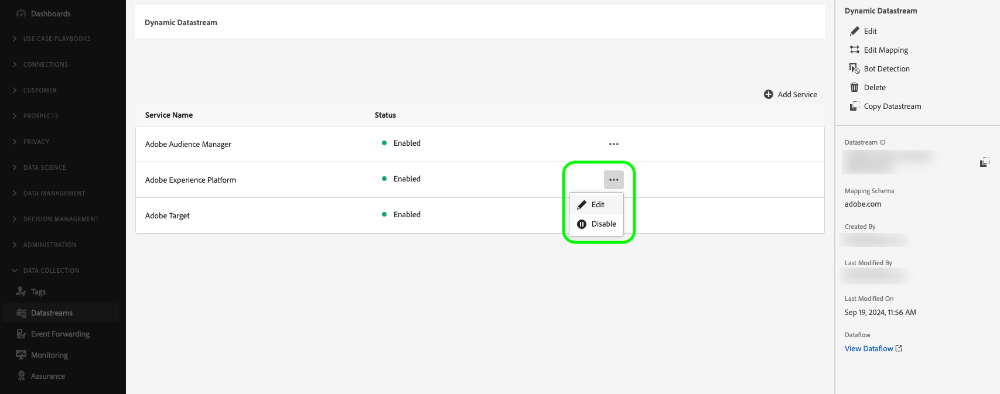
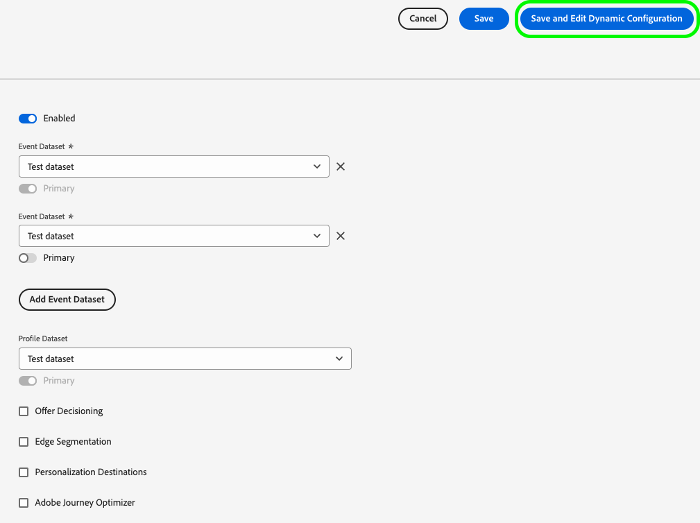

# Création de configurations de flux de données dynamiques

>[!AVAILABILITY]
>
>* L’option permettant de définir des configurations de flux de données dynamiques se trouve actuellement dans Beta et est disponible pour un nombre limité de clients. Pour accéder à cette fonctionnalité, contactez votre représentant Adobe. La documentation et les fonctionnalités peuvent changer.

Par défaut, l’Edge Network Experience Platform envoie tous les événements qui atteignent un flux de données à tous les [services](configure.md#add-services) Experience Cloud que vous avez activés pour vos flux de données. Selon vos cas d’utilisation, il peut ne pas toujours s’agir du workflow idéal.

Les configurations de flux de données dynamiques répondent à ce problème par le biais d’ensembles de règles configurables par l’utilisateur que vous définissez pour chaque service activé pour votre flux de données, qui dictent quelle solution Experience Cloud doit recevoir chaque type de données.

## Conditions préalables {#prerequisites}

Pour créer une configuration dynamique pour votre flux de données, vous devez respecter deux conditions :

* Vous devez avoir créé *au moins* un flux de données avec lequel travailler. Pour plus d’informations, consultez la documentation sur la [création d’une banque de données](configure.md) .
* *au moins* un service Experience Cloud doit être ajouté à votre flux de données. Pour plus d’informations, consultez la documentation sur l’ [ajout d’un service](configure.md#add-services) à un flux de données.

Après avoir créé un flux de données et ajouté un service Experience Cloud à celui-ci, vous pouvez [créer une configuration dynamique](#create-dynamic-configuration).

## Création d’une configuration de flux de données dynamique {#create-dynamic-configuration}

Après avoir [créé un flux de données](configure.md) et [ajouté un service](configure.md#add-services) à celui-ci, suivez les étapes ci-dessous pour ajouter une configuration dynamique au service.

1. Accédez à la page **[!UICONTROL Collecte de données]** > **[!UICONTROL Datastreams]** et sélectionnez le flux de données que vous avez créé.

   

1. Sélectionnez l’option **[!UICONTROL Edit]** sur le service pour lequel vous souhaitez définir une configuration dynamique.

   

1. Sur la page **[!UICONTROL Configurer]**, sélectionnez **[!UICONTROL Enregistrer et modifier la configuration dynamique]**.

   

1. Sélectionnez **[!UICONTROL Ajouter une configuration dynamique]**.

   

1. Dans le panneau **[!UICONTROL Ressources]**, faites glisser les éléments avec lesquels vous souhaitez créer votre règle vers le côté droit de la fenêtre. Vous pouvez combiner plusieurs ressources pour créer des règles complexes.

   Utilisez les options de chaque ressource, telles que **[!UICONTROL equals]**, **[!UICONTROL not equal]**, **[!UICONTROL exists]**, etc., pour affiner vos règles.

   

1. Dans la section **[!UICONTROL Configuration]** , faites basculer les services que vous souhaitez activer ou désactiver pour chaque règle, selon que vous souhaitez que les données soient envoyées à chaque service. Si vous désactivez ce bouton, le routage du service est désactivé et *aucune donnée* ne sera envoyée au service en amont.

   

1. Lorsque vous avez terminé de configurer vos règles, sélectionnez **[!UICONTROL Enregistrer]**.

## Considérations relatives à la priorité des règles {#considerations}

Vous pouvez définir plusieurs règles pour chaque configuration de flux de données dynamique. Cependant, si vos données correspondent aux conditions de plusieurs règles, seule la première règle correspondante de la liste est prise en compte et toutes les autres règles correspondantes sont ignorées.

Pour obtenir le comportement de routage des données souhaité, prêtez attention à l’ordre dans lequel vous organisez les règles.

Pour configurer l’ordre des règles, vous pouvez faire glisser les fenêtres des règles dans l’ordre de votre choix.

