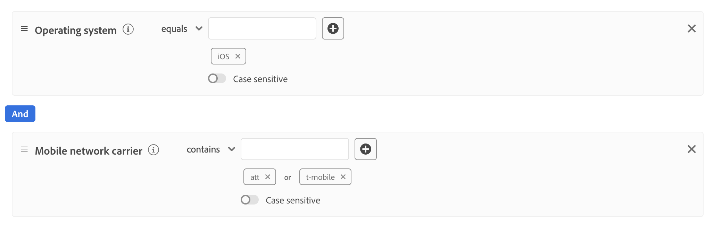

# Créer des configurations de flux de données dynamiques

>[!AVAILABILITY]
>
>* L’option permettant de définir des configurations de train de données dynamiques est actuellement dans Beta et disponible pour un nombre limité de clients. Pour accéder à cette fonctionnalité, contactez votre représentant Adobe. La documentation et les fonctionnalités peuvent changer.

Par défaut, Experience Platform Edge Network envoie tous les événements qui atteignent un flux de données à tous les [services](configure.md#add-services) Experience Cloud que vous avez activés pour vos flux de données. Selon vos cas d’utilisation, ce workflow peut ne pas toujours être idéal pour vous.

Les configurations dynamiques de train de données répondent à ce problème par le biais d’ensembles de règles configurables par l’utilisateur que vous définissez pour chaque service activé pour votre train de données, qui déterminent quelle solution Experience Cloud doit recevoir chaque type de données.

## Conditions préalables {#prerequisites}

Pour créer une configuration dynamique pour votre flux de données, vous devez remplir deux conditions :

* Vous devez avoir créé *au moins* un flux de données à utiliser. Pour plus d’informations, consultez la documentation sur la [création d’un flux de données](configure.md).
* Vous devez avoir *au moins* un service Experience Cloud ajouté à votre flux de données. Pour plus d’informations, consultez la documentation sur la [ajout d’un service](configure.md#add-services) à un flux de données .

Après avoir créé un flux de données et y avoir ajouté un service Experience Cloud, vous pouvez [créer une configuration dynamique](#create-dynamic-configuration).

## Mécanismes de sécurisation {#guardrails}

Les configurations de flux de données dynamiques comportent des limites et des contraintes de performances spécifiques pour garantir des performances système optimales et une efficacité de traitement des données optimale. Les mécanismes de sécurisation suivants s’appliquent lors de la configuration des règles de flux de données dynamiques :

| Mécanisme de sécurisation | Limite | Type de limite |
|---------|------------|------|
| Nombre maximal de configurations de trains de données dynamiques par train de données pour les services Experience Platform | 5 | Mécanisme de sécurisation des performances |
| Nombre maximal de configurations de trains de données dynamiques par train de données pour le transfert d’événement | 5 | Mécanisme de sécurisation des performances |
| Nombre maximal de configurations de trains de données dynamiques par train de données pour Adobe Analytics | 5 | Mécanisme de sécurisation des performances |
| Nombre maximal de configurations de trains de données dynamiques par train de données pour Adobe Target | 5 | Mécanisme de sécurisation des performances |
| Nombre maximal de configurations de trains de données dynamiques par train de données pour Adobe Audience Manager | 5 | Mécanisme de sécurisation des performances |
| Nombre maximal de conditions (prédicats) que vous pouvez combiner dans une seule règle | 100 | Mécanisme de sécurisation des performances |
| Durée maximale autorisée pour évaluer toutes les configurations de trains de données dynamiques par train de données avant expiration | 25 ms | Mécanisme de sécurisation mis en œuvre par le système |

## Configurations de train de données dynamiques et remplacements de la configuration de train de données {#dynamic-versus-overrides}

Les configurations dynamiques de train de données et [&#x200B; remplacements de configuration de train de données](overrides.md) sont des fonctionnalités qui s’excluent mutuellement.

Cela signifie que vous ne pouvez pas utiliser de configurations de train de données dynamiques avec des remplacements de configurations de train de données. Il faut choisir l&#39;un ou l&#39;autre.

Si vous activez à la fois les configurations de train de données dynamique et les remplacements de configuration de train de données, les remplacements de configuration sont prioritaires et les règles de configuration de train de données dynamique sont ignorées.

## Création d’une configuration de train de données dynamique {#create-dynamic-configuration}

Après avoir [créé un flux de données](configure.md) et [ajouté un service](configure.md#add-services), suivez les étapes ci-dessous pour ajouter une configuration dynamique au service.

1. Accédez à la page **[!UICONTROL Collecte de données]** > **[!UICONTROL Flux de données]** et sélectionnez le flux de données que vous avez créé.

   

1. Sélectionnez l&#39;option **[!UICONTROL Modifier]** sur le service pour lequel vous souhaitez définir une configuration dynamique.

   

1. Sur la page **[!UICONTROL Configurer]**, sélectionnez **[!UICONTROL Enregistrer et modifier la configuration dynamique]**.

   

1. Sélectionnez **[!UICONTROL Ajouter une configuration dynamique]**.

   .

1. Dans le panneau **[!UICONTROL Ressources]**, faites glisser et déposez les éléments avec lesquels vous souhaitez créer votre règle sur le côté droit de la fenêtre. Vous pouvez combiner plusieurs ressources pour créer des règles complexes.

   Utilisez les options de chaque ressource, telles que **[!UICONTROL égal à]**, **[!UICONTROL n’est pas égal à]**, **[!UICONTROL existe]**, etc. pour affiner vos règles.

   

1. Dans la section **[!UICONTROL Configuration]**, activez/désactivez les services que vous souhaitez activer ou désactiver pour chaque règle, selon que vous souhaitez ou non envoyer les données à chaque service. Si vous désactivez ce bouton, le routage des services est désactivé et *aucune donnée* n’est envoyée au service en amont.

   

1. Une fois la configuration des règles terminée, sélectionnez **[!UICONTROL Enregistrer]**.

## Considérations sur la priorité des règles {#considerations}

Vous pouvez définir plusieurs règles pour chaque configuration de train de données dynamique. Cependant, si vos données correspondent aux conditions de plusieurs règles, seule la première règle correspondante de la liste est prise en compte, et toutes les autres règles correspondantes sont ignorées.

Pour obtenir le comportement de routage des données souhaité, prêtez attention à l’ordre dans lequel vous organisez les règles.

Pour configurer l’ordre des règles, faites glisser et déposez les fenêtres des règles dans l’ordre de votre choix.

## Critères d’éligibilité des règles {#eligibility-criteria}

Les configurations de train de données dynamiques doivent répondre à des critères d’éligibilité spécifiques pour garantir des performances élevées, une maintenabilité et une clarté optimale. Vous trouverez ci-dessous les principales exigences et les bonnes pratiques pour définir des règles.

### Types de données pris en charge {#supported-data-types}

Les règles de configuration des trains de données dynamiques fonctionnent avec des types de données spécifiques pour garantir des performances optimales et un routage des données fiable. Comprendre quels types de données sont pris en charge vous permet de créer des règles efficaces pour traiter vos données efficacement.

| Type de données | Statut | Notes |
|-----------|--------|-------|
| Chaîne | Autorisé | - |
| Nombre (Entier, Long, Court, Octet) | Autorisé | - |
| Énumération | Autorisé | - |
| Booléen | Autorisé | - |
| Date | Autorisé | - |
| Tableau | Non autorisé | Les règles basées sur des tableaux ne sont pas prises en charge, car elles peuvent dégrader les performances. |
| Carte | Non autorisé | Les règles basées sur des mappages ne sont pas prises en charge, car elles peuvent dégrader les performances. |

### Opérateurs pris en charge {#supported-operators}

Les règles peuvent utiliser les opérateurs suivants, selon le type de données :

| Type de données | Opérateurs pris en charge |
|-----------|-------------------|
| **Chaîne** | `equals`, `starts with`, `ends with`, `contains`, `exists`, `does not equal`, `does not start with`, `does not end with`, `does not contain`, `does not exist` |
| **Nombre (Long, Entier, Court, Octet)** | `equals`, `does not equal`, `greater than`, `less than`, `greater than or equal to`, `less than or equal to`, `exists`, `does not exist` |
| **booléen** | `equals true/false`, `does not equal true/false` |
| **Enum** | `equals`, `does not equal`, `exists`, `does not exist` |
| **Date** | `today`, `yesterday`, `this month`, `this year`, `custom date`, `in last`, `from`, `during`, `within`, `before`, `after`, `rolling range`, `in next`, `exists` `does not exist` |
| **Logique** | `INCLUDE`, `ANY/ALL` (équivalent à AND/OR) |

>[!NOTE]
>
>L’opérateur **[!UICONTROL EXCLUDE]** n’est pas directement pris en charge, mais vous pouvez appliquer une logique équivalente en utilisant **[!UICONTROL INCLUDE]** avec des opérateurs de comparaison annulés (par exemple, « n’est pas égal à »).

### Structure de règle {#rule-structure}

Lors de la création de règles pour les configurations dynamiques de train de données, il est important de comprendre les exigences structurelles qui assurent des performances optimales et la compatibilité du système. La structure des règles a une incidence directe sur l’efficacité du traitement et du routage de vos données dans le système.

**Utilisez uniquement des expressions aplaties**. Vous devez définir des règles sous la forme d’expressions logiques aplaties. Les expressions logiques imbriquées (utilisant des conteneurs ou plusieurs niveaux de ET/OU) ne sont pas prises en charge. Si vous avez besoin d’une logique complexe, divisez-la en plusieurs règles aplaties.

Prenons l’exemple de la règle complexe illustrée dans l’image ci-dessous.

Vous pouvez décomposer cette règle en plusieurs règles plus simples :

**Évitez les règles complexes**. Des règles plus simples garantissent une évaluation plus rapide et une meilleure maintenabilité.

### Bonnes pratiques {#best-practices}

Le respect des bonnes pratiques lors de la création de règles de configuration de flux de données dynamiques garantit des performances optimales, la fiabilité du système et des configurations gérables. Ces instructions vous aident à éviter les pièges courants et à créer des règles efficaces qui fonctionnent en toute transparence avec l’architecture de la plateforme.

* **Gardez les règles simples et plates.** Si vous devez exprimer une logique complexe, utilisez plusieurs règles au lieu de l’imbrication.
* **Utiliser uniquement [types de données pris en charge](#supported-data-types) et [opérateurs](#supported-operators).**
* **Testez les performances de vos règles.** Des règles trop complexes ou non prises en charge peuvent entraîner leur rejet par le système ou nuire aux performances du système.

