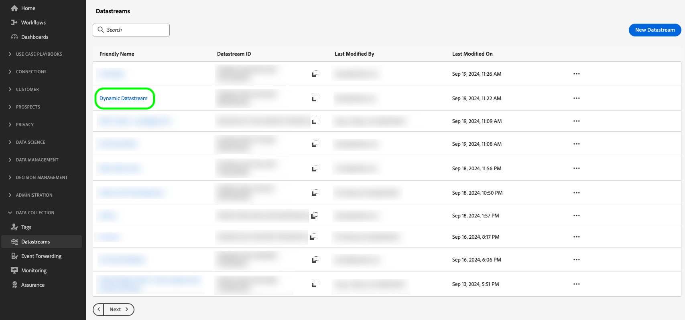

# Créer des configurations de flux de données dynamiques

>[!AVAILABILITY]
>
>* L’option permettant de définir des configurations de train de données dynamiques est actuellement dans Beta et disponible pour un nombre limité de clients. Pour accéder à cette fonctionnalité, contactez votre représentant d’Adobe. La documentation et les fonctionnalités peuvent changer.

Par défaut, l’Edge Network Experience Platform envoie tous les événements qui atteignent un flux de données à tous les [services](configure.md#add-services) Experience Cloud que vous avez activés pour vos flux de données. Selon vos cas d’utilisation, ce workflow peut ne pas toujours être idéal pour vous.

Les configurations dynamiques de train de données répondent à ce problème par le biais d’ensembles de règles configurables par l’utilisateur que vous définissez pour chaque service activé pour votre train de données, qui déterminent quelle solution Experience Cloud doit recevoir chaque type de données.

## Conditions préalables {#prerequisites}

Pour créer une configuration dynamique pour votre flux de données, vous devez remplir deux conditions :

* Vous devez avoir créé *au moins* un flux de données à utiliser. Pour plus d’informations, consultez la documentation sur la [création d’un flux de données](configure.md).
* Vous devez avoir *au moins* un service Experience Cloud ajouté à votre flux de données. Pour plus d’informations, consultez la documentation sur la [ajout d’un service](configure.md#add-services) à un flux de données .

Après avoir créé un flux de données et ajouté un service Experience Cloud, vous pouvez [créer une configuration dynamique](#create-dynamic-configuration).

## Configurations de train de données dynamiques et remplacements de la configuration de train de données {#dynamic-versus-overrides}

Les configurations dynamiques de train de données et [ remplacements de configuration de train de données](overrides.md) sont des fonctionnalités qui s’excluent mutuellement.

Cela signifie que vous ne pouvez pas utiliser de configurations de train de données dynamiques avec des remplacements de configurations de train de données. Il faut choisir l&#39;un ou l&#39;autre.

Si vous activez à la fois les configurations de train de données dynamique et les remplacements de configuration de train de données, les remplacements de configuration sont prioritaires et les règles de configuration de train de données dynamique sont ignorées.

## Création d’une configuration de train de données dynamique {#create-dynamic-configuration}

Après avoir [créé un flux de données](configure.md) et [ajouté un service](configure.md#add-services), suivez les étapes ci-dessous pour ajouter une configuration dynamique au service.

1. Accédez à la page **[!UICONTROL Collecte de données]** > **[!UICONTROL Flux de données]** et sélectionnez le flux de données que vous avez créé.

   

1. Sélectionnez l&#39;option **[!UICONTROL Modifier]** sur le service pour lequel vous souhaitez définir une configuration dynamique.

   

1. Sur la page **[!UICONTROL Configurer]**, sélectionnez **[!UICONTROL Enregistrer et modifier la configuration dynamique]**.

   

1. Sélectionnez **[!UICONTROL Ajouter une configuration dynamique]**.

   .

1. Dans le panneau **[!UICONTROL Ressources]**, faites glisser et déposez les éléments avec lesquels vous souhaitez créer votre règle sur le côté droit de la fenêtre. Vous pouvez combiner plusieurs ressources pour créer des règles complexes.

   Utilisez les options de chaque ressource, telles que **[!UICONTROL égal à]**, **[!UICONTROL n’est pas égal à]**, **[!UICONTROL existe]**, etc. pour affiner vos règles.

   

1. Dans la section **[!UICONTROL Configuration]**, activez/désactivez les services que vous souhaitez activer ou désactiver pour chaque règle, selon que vous souhaitez ou non envoyer les données à chaque service. Si vous désactivez ce bouton, le routage des services est désactivé et *aucune donnée* n’est envoyée au service en amont.

   

1. Une fois la configuration des règles terminée, sélectionnez **[!UICONTROL Enregistrer]**.

## Considérations sur la priorité des règles {#considerations}

Vous pouvez définir plusieurs règles pour chaque configuration de train de données dynamique. Cependant, si vos données correspondent aux conditions de plusieurs règles, seule la première règle correspondante de la liste est prise en compte, et toutes les autres règles correspondantes sont ignorées.

Pour obtenir le comportement de routage des données souhaité, prêtez attention à l’ordre dans lequel vous organisez les règles.

Pour configurer l’ordre des règles, faites glisser et déposez les fenêtres des règles dans l’ordre de votre choix.

