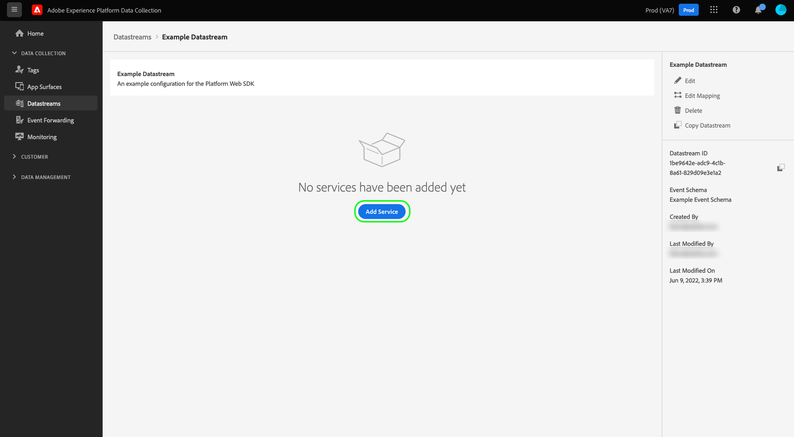
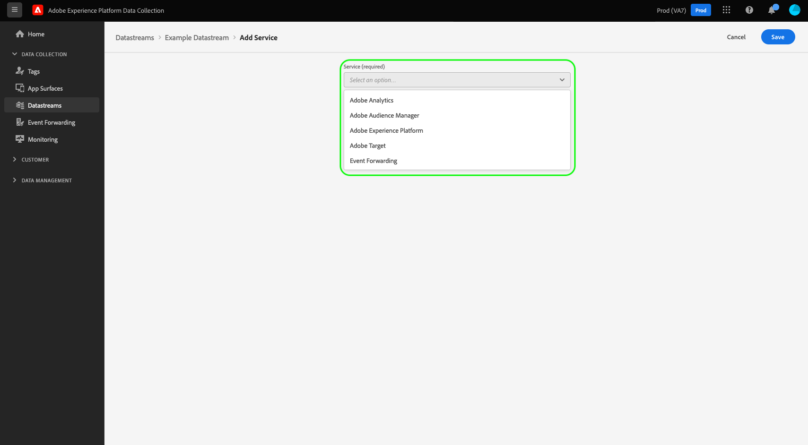
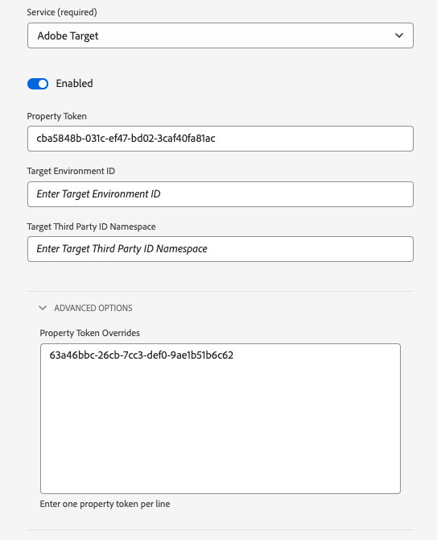

# Créer et configurer des flux de données

Ce document décrit les étapes de configuration d’un [flux de données](./overview.md) dans l’interface utilisateur.

## Accès à l’espace de travail [!UICONTROL Datastreams]

Vous pouvez créer et gérer des flux de données dans l’interface utilisateur de collecte de données ou d’Experience Platform en sélectionnant **[!UICONTROL Datastreams]** dans le volet de navigation de gauche.

L’onglet **[!UICONTROL Datastreams]** affiche une liste des flux de données existants, y compris leur nom convivial, leur identifiant et leur date de dernière modification. Pour [afficher les détails et configurer des services](#view-details), sélectionnez le nom d’un flux de données.

Pour afficher plus d’options pour un flux de données spécifique, sélectionnez l’icône « plus » (**...**). Pour mettre à jour la [configuration de base](#configure) du flux de données, sélectionnez **[!UICONTROL Edit]**. Pour supprimer le flux de données, sélectionnez **[!UICONTROL Delete]**.

## Création dʼun flux de données {#create}

Pour créer un flux de données, commencez par sélectionner **[!UICONTROL New Datastream]**.

Le processus de création du flux de données s’affiche, en commençant à l’étape de configuration. Ensuite, vous devez fournir un nom et une description facultative pour le flux de données.

Si vous configurez un flux de données à utiliser dans Experience Platform et que vous utilisez également le SDK web, vous devez également sélectionner un schéma [modèle de données d’expérience (XDM)basé sur un événement](../xdm/classes/experienceevent.md) pour représenter les données que vous prévoyez d’ingérer.

### Configuration de la géolocalisation et de la recherche réseau {#geolocation-network-lookup}

Les paramètres de géolocalisation et de recherche réseau vous permettent de définir le niveau de granularité des données géographiques et au niveau du réseau que vous souhaitez collecter.

Développez la section **[!UICONTROL Geolocation and network lookup]** pour configurer les paramètres décrits ci-dessous.

| Paramètre | Description |
| --- | --- |
| [!UICONTROL Geo Lookup] | Active les recherches de géolocalisation pour les options sélectionnées en fonction de l’adresse IP du visiteur. Les options disponibles sont les suivantes : <ul><li>**Country** : Renseigne `xdm.placeContext.geo.countryCode`</li><li>**Code Postal** : Renseigne Le `xdm.placeContext.geo.postalCode`</li><li>**État/Province** : Remplit `xdm.placeContext.geo.stateProvince`</li><li>**DMA** : renseigne `xdm.placeContext.geo.dmaID`</li><li>**Ville** : Renseigne `xdm.placeContext.geo.city`</li><li>**Latitude** : Remplit `xdm.placeContext.geo._schema.latitude`</li><li>**Longitude** : Renseigne `xdm.placeContext.geo._schema.longitude`</li></ul>La sélection de **[!UICONTROL City]**, **[!UICONTROL Latitude]** ou **[!UICONTROL Longitude]** fournit des coordonnées jusqu’à deux décimales, quelles que soient les autres options sélectionnées. Il s’agit d’une granularité au niveau de la ville.   Ne sélectionner aucune option désactive les recherches de géolocalisation. La géolocalisation se produit avant [!UICONTROL IP Obfuscation], ce qui signifie qu’elle n’est pas affectée par le paramètre [!UICONTROL IP Obfuscation]. |
| [!UICONTROL Network Lookup] | Active les recherches réseau pour les options sélectionnées en fonction de l’adresse IP du visiteur. Les options disponibles sont les suivantes : <ul><li>**Opérateur de téléphonie mobile** : renseigne `xdm.environment.carrier`</li><li>**Domain** : renseigne le `xdm.environment.domain`</li><li>**FAI** : renseigne `xdm.environment.ISP`</li><li>**Type De Connexion** : Renseigne `xdm.environment.connectionType`</li></ul> |

Si vous activez l’un des champs ci-dessus pour la collecte de données, assurez-vous de définir correctement la propriété de tableau [`context`](/help/collection/js/commands/configure/context.md) lors de la configuration de Web SDK.

Les champs de recherche de géolocalisation utilisent le `context` de chaîne de tableau `"placeContext"`, tandis que les champs de recherche réseau utilisent le `context` de chaîne de tableau `"environment"`.

Assurez-vous également que chaque champ XDM souhaité existe dans votre schéma. Dans le cas contraire, vous pouvez ajouter le groupe de champs `Environment Details` fourni par Adobe à votre schéma.

### Configuration de la recherche d’appareils {#geolocation-device-lookup}

Les paramètres **[!UICONTROL Device Lookup]** vous permettent de sélectionner les informations spécifiques à l’appareil que vous souhaitez collecter.

Développez la section **[!UICONTROL Device Lookup]** pour configurer les paramètres décrits ci-dessous.

>[!IMPORTANT]
>
>Les paramètres présentés dans le tableau ci-dessous s’excluent mutuellement. Vous ne pouvez pas sélectionner simultanément les informations sur l’agent utilisateur *et* les données de recherche de périphérique.

| Paramètre | Description |
| --- | --- |
| **[!UICONTROL Keep user agent and client hints headers]** | Sélectionnez cette option pour collecter uniquement les informations stockées dans la chaîne de l’agent utilisateur. Ce paramètre est sélectionné par défaut. Remplit le `xdm.environment.browserDetails.userAgent` |
| **[!UICONTROL Use device lookup to collect the following information]** | Sélectionnez cette option si vous souhaitez collecter une ou plusieurs des informations spécifiques à l’appareil suivantes : <ul><li>**[!UICONTROL Device]** d’informations :<ul><li>**Fabricant de l’appareil** : renseigne `xdm.device.manufacturer`</li><li>**Modèle d’appareil** : renseigne le `xdm.device.modelNumber`</li><li>**Nom marketing** : renseigne le `xdm.device.model`</li></ul></li><li>**[!UICONTROL Hardware]** d’informations : <ul><li>**Type de matériel** : renseigne `xdm.device.type`</li><li>**Hauteur d’affichage** : renseigne le `xdm.device.screenHeight`</li><li>**Largeur d’affichage** : renseigne le `xdm.device.screenWidth`</li><li>**Profondeur de la couleur d’affichage** : renseigne le `xdm.device.colorDepth`</li></ul></li><li>**[!UICONTROL Browser]** d’informations : <ul><li>**Fournisseur du navigateur** : renseigne le `xdm.environment.browserDetails.vendor`</li><li>**Nom du navigateur** : renseigne `xdm.environment.browserDetails.name`</li><li>**Version du navigateur** : renseigne `xdm.environment.browserDetails.version`</li></ul></li><li>**[!UICONTROL Operating system]** d’informations : <ul><li>**Fournisseur du système d’exploitation** : renseigne `xdm.environment.operatingSystemVendor`</li><li>**Nom du système d’exploitation** : renseigne `xdm.environment.operatingSystem`</li><li>**Version du système d’exploitation** : renseigne `xdm.environment.operatingSystemVersion`</li></ul></li></ul>Les informations de recherche d’appareil ne peuvent pas être collectées avec l’agent utilisateur et les indications du client. Choisir de collecter des informations sur l’appareil désactive la collecte de l’agent utilisateur et des indications du client, et vice versa. |
| **[!UICONTROL Do not collect any device information]** | Sélectionnez cette option si vous ne souhaitez pas collecter d’informations de recherche d’appareil. Aucune donnée d’appareil, de matériel, de navigateur, de système d’exploitation, d’agent utilisateur ou d’indicateur client n’est collectée. |

Si vous activez l’un des champs ci-dessus pour la collecte de données, assurez-vous de définir correctement la propriété de tableau [`context`](/help/collection/js/commands/configure/context.md) lors de la configuration de Web SDK.

Les informations sur l’appareil et le matériel utilisent le `context` de chaîne de tableau `"device"`, tandis que les informations sur le navigateur et le système d’exploitation utilisent le `context` de chaîne de tableau `"environment"`.

Assurez-vous également que chaque champ XDM souhaité existe dans votre schéma. Dans le cas contraire, vous pouvez ajouter le groupe de champs `Environment Details` fourni par Adobe à votre schéma.

### Configurer les options avancées {#advanced-options}

Pour afficher les options de configuration avancées, sélectionnez **[!UICONTROL Advanced Options]**. Ici, vous pouvez configurer des paramètres de train de données supplémentaires, tels que l’obscurcissement des adresses IP, les cookies d’identifiants internes, etc.

>[!IMPORTANT]
>
> Il vous incombe de vous assurer que vous avez obtenu toutes les autorisations, consentements, autorisations et autorisations nécessaires en vertu des lois et réglementations applicables pour collecter, traiter et transmettre des données personnelles, y compris des informations de géolocalisation précises.
> 
> Votre sélection de l’obscurcissement des adresses IP n’affecte pas le niveau des informations de géolocalisation qui sont dérivées de l’adresse IP et envoyées à vos solutions Adobe configurées. Les recherches de géolocalisation doivent être limitées ou désactivées séparément.

| Paramètre | Description |
| --- | --- |
| [!UICONTROL IP Obfuscation] | Indique le type d’obscurcissement d’adresses IP à appliquer au train de données. Tout traitement basé sur l’adresse IP du client est affecté par le paramètre d’obscurcissement de l’adresse IP. Cela inclut tous les services Experience Cloud qui reçoivent des données de votre flux de données. L’obscurcissement des adresses IP a lieu avant l’envoi des événements à un service en aval, tel que la préparation des données. 
Options disponibles :
 <ul><li>**[!UICONTROL None]** : désactive l’obscurcissement des adresses IP. L’adresse IP complète de l’utilisateur est envoyée via le flux de données.</li><li>**[!UICONTROL Partial]** : pour les adresses IPv4, obscurcit le dernier octet de l’adresse IP de l’utilisateur. Pour les adresses IPv6, l’obscurcissement masque les 80 derniers bits de l’adresse IP. 
Exemples :
 <ul><li>IPv4 : `1.2.3.4` -> `1.2.3.0`</li><li>IPv6 : `2001:0db8:1345:fd27:0000:ff00:0042:8329` -> `2001:0db8:1345:0000:0000:0000:0000:0000`</li></ul></li><li>**[!UICONTROL Full]** : obscurcit l’adresse IP complète. 
Exemples :
 <ul><li>IPv4 : `1.2.3.4` -> `0.0.0.0`</li><li>IPv6 : `2001:0db8:1345:fd27:0000:ff00:0042:8329` -> `0:0:0:0:0:0:0:0`</li></ul></li></ul> Impact de l’obscurcissement des adresses IP sur d’autres produits Adobe : <ul><li>**Adobe Target** : la [!UICONTROL IP obfuscation] au niveau du train de données est appliquée avant l’[!UICONTROL IP obfuscation] effectuée dans Adobe Target, à toutes les adresses IP présentes sur la requête. Par exemple, si l’option [!UICONTROL IP obfuscation] au niveau du train de données est définie sur **[!UICONTROL Full]** et que l’option Obscurcissement d’adresses IP d’Adobe Target est définie sur **[!UICONTROL Last octet obfuscation]**, Adobe Target reçoit une adresse IP entièrement obscurcie. Si l’option de [!UICONTROL IP obfuscation] au niveau du train de données est définie sur **[!UICONTROL Partial]** et que l’option d’obscurcissement d’IP Adobe Target est définie sur **[!UICONTROL Full]**, Adobe Target reçoit une IP partiellement obscurcie, puis applique l’obscurcissement complet sur celle-ci. L’obscurcissement des adresses IP d’Adobe Target est géré indépendamment du flux de données. Pour plus d’informations, consultez la documentation d’Adobe Target sur l’[Obscurcissement d’adresses IP](https://experienceleague.adobe.com/docs/target-dev/developer/implementation/privacy/privacy.html) et sur la [géolocalisation](https://experienceleague.adobe.com/docs/target/using/audiences/create-audiences/categories-audiences/geo.html).</li><li>**Audience Manager** : le paramètre [!UICONTROL IP obfuscation] au niveau du train de données est appliqué avant l’[!UICONTROL IP obfuscation] effectuée dans Audience Manager à toutes les adresses IP présentes dans la requête. Toute recherche de géolocalisation effectuée par Audience Manager est affectée par l’option de [!UICONTROL IP obfuscation] au niveau du train de données. Une recherche de géolocalisation dans Audience Manager, basée sur une adresse IP entièrement obscurcie, aboutit à une région inconnue et tous les segments basés sur les données de géolocalisation obtenues ne sont pas réalisés. Pour plus d’informations, consultez la documentation d’Audience Manager sur l’[Obscurcissement d’adresses IP](https://experienceleague.adobe.com/docs/audience-manager/user-guide/features/administration/ip-obfuscation.html).</li><li>**Adobe Analytics** : si le paramètre d’obscurcissement d’adresse IP au niveau du train de données est défini sur **[!UICONTROL Full]**, Adobe Analytics traite l’adresse IP comme une adresse vide. Cela affecte tous les traitements Analytics qui dépendent des adresses IP, comme les recherches de géolocalisation et le filtrage IP. Pour qu’Analytics reçoive les adresses IP entièrement ou partiellement obscurcies, définissez le paramètre d’obscurcissement d’IP sur **[!UICONTROL Partial]** ou **[!UICONTROL None]**. Les adresses IP partiellement obscurcies et non obscurcies peuvent être en outre obscurcies dans Analytics. Consultez la [documentation](https://experienceleague.adobe.com/docs/analytics/admin/admin-tools/manage-report-suites/edit-report-suite/report-suite-general/general-acct-settings-admin.html?lang=fr) d’Adobe Analytics pour plus d’informations sur la manière d’activer l’obscurcissement des adresses IP dans Analytics. Si l’adresse IP est entièrement obscurcie et que l’accès à la page ne comporte ni [!DNL ECID] ni [!DNL VisitorID], Analytics abandonne l’accès plutôt que de générer un [identifiant de secours](https://experienceleague.adobe.com/docs/id-service/using/reference/analytics-reference/analytics-ids.html?lang=en), qui est partiellement basé sur l’adresse IP.</li><li>**Adobe Advertising** : lorsque l’obscurcissement de l’adresse IP au niveau du train de données est défini sur [!UICONTROL Partial] ou [!UICONTROL Full], les rapports géographiques et les fonctionnalités (y compris la mesure et le reciblage) sont désactivés dans Advertising DSP, à l’exception des publicités TV connectées.</li></ul> |
| [!UICONTROL First Party ID Cookie] | Lorsqu’il est activé, ce paramètre indique à Edge Network de se référer à un cookie spécifié lors de la recherche d’un [identifiant d’appareil interne](/help/collection/use-cases/identity/first-party-device-ids.md), plutôt que de rechercher cette valeur dans le mappage d’identité.  Lors de l’activation de ce paramètre, vous devez indiquer le nom du cookie qui doit stocker l’identifiant. |
| [!UICONTROL Third Party ID Sync] | Les synchronisations des identifiants peuvent être regroupées en conteneurs afin de permettre l’exécution de différentes synchronisations d’identifiant à différents moments. Lorsqu’il est activé, ce paramètre vous permet de spécifier le conteneur des synchronisations d’identifiant à exécuter pour ce flux de données. |
| [!UICONTROL Third Party ID Sync Container ID] | L’identifiant numérique du conteneur à utiliser pour la synchronisation des identifiants tiers.  **Remarque :** le flux de données fait référence à l’ID de conteneur Audience Manager par défaut, qui est 0. Si vous disposez de plusieurs identifiants de conteneur de synchronisation d’Audience Manager ID, contactez votre consultant Audience Manager pour identifier et résoudre correctement la configuration de synchronisation des identifiants. |
| [!UICONTROL Container ID Overrides] | Dans cette section, vous pouvez définir d’autres identifiants de conteneur de synchronisation d’identifiants tiers que vous pouvez utiliser pour remplacer l’identifiant par défaut. |
| [!UICONTROL Access Type] | Définit le type d’authentification qu’Edge Network accepte pour le train de données. <ul><li>**[!UICONTROL Mixed Authentication]** : lorsque cette option est sélectionnée, Edge Network accepte les demandes authentifiées et non authentifiées. Sélectionnez cette option lorsque vous prévoyez d’utiliser Web SDK ou [Mobile SDK](https://developer.adobe.com/client-sdks/home/), ainsi que l’[API Edge Network](https://developer.adobe.com/data-collection-apis/docs/api/). </li><li>**[!UICONTROL Authenticated Only]** : lorsque cette option est sélectionnée, Edge Network accepte uniquement les demandes authentifiées. Sélectionnez cette option lorsque vous prévoyez d’utiliser uniquement l’API Edge Network et que vous souhaitez empêcher le traitement des demandes non authentifiées par Edge Network.</li></ul> |
| [!UICONTROL Media Analytics] | Permet le traitement des données de tracking en flux continu pour l’intégration d’Edge Network via les SDK Experience Platform ou l’[API Media Edge](https://developer.adobe.com/cja-apis/docs/endpoints/media-edge/getting-started/). Découvrez Media Analytics dans la [documentation](https://experienceleague.adobe.com/docs/media-analytics/using/media-overview.html?lang=fr). |

Ensuite, si vous configurez le flux de données d’Experience Platform, suivez le tutoriel sur la [Préparation des données pour la collecte de données](./data-prep.md) pour mapper les données à un schéma d’événement d’Experience Platform avant de revenir à ce guide. Sinon, sélectionnez **[!UICONTROL Save]** et passez à la section suivante.

>[!NOTE]
>
>Après avoir enregistré les modifications apportées à une configuration de train de données, attendez jusqu’à 35 minutes pour que les modifications se propagent à travers Edge Network. Pendant cette période de propagation, les demandes peuvent toujours être traitées avec la configuration précédente.

## Afficher les détails d’un flux de données {#view-details}

Après avoir configuré un nouveau flux de données ou sélectionné un flux de données existant à afficher, sa page de détails s’affiche. Vous y trouverez des informations supplémentaires sur le flux de données, y compris son identifiant.

À partir de l’écran de détails du flux de données, vous pouvez [ajouter des services](#add-services) pour activer les fonctionnalités des produits Adobe Experience Cloud auxquels vous avez accès. Vous pouvez également modifier la [configuration de base](#create) du flux de données, mettre à jour ses [règles de mappage](./data-prep.md), [copier le flux de données](#copy) ou le supprimer entièrement.

## Ajouter des services à un flux de données {#add-services}

Sur la page de détails d’un flux de données, sélectionnez **[!UICONTROL Add Service]** pour commencer à ajouter les services disponibles à ce flux de données.

Sur l’écran suivant, utilisez le menu déroulant pour sélectionner un service à configurer pour ce flux de données. Seuls les services auxquels vous avez accès sont répertoriés dans cette liste.

Sélectionnez le service souhaité, renseignez les options de configuration qui s’affichent, puis sélectionnez **[!UICONTROL Save]** pour ajouter le service au flux de données. Tous les services ajoutés s’affichent dans la vue des détails du flux de données.

Les sous-sections ci-dessous décrivent les options de configuration de chaque service.

>[!NOTE]
>
>Chaque configuration de service contient un bouton (bascule) **[!UICONTROL Enabled]** qui est automatiquement activé lorsque le service est sélectionné. Pour désactiver le service sélectionné de ce flux de données, sélectionnez à nouveau le bouton **[!UICONTROL Enabled]**.

### Paramètres d’Adobe Advertising {#advertising}

Ce service est requis pour l’intégration d’Adobe Advertising à Customer Journey Analytics.

### Paramètres d’Adobe Analytics {#analytics}

Ce service contrôle si et comment les données sont envoyées à Adobe Analytics.

| Paramètre | Description |
| --- | --- |
| [!UICONTROL Report Suite ID] | **(Obligatoire)** L’identifiant de la suite de rapports Analytics à laquelle vous souhaitez envoyer des données. Cet identifiant se trouve dans l’interface utilisateur d’Adobe Analytics sous [!UICONTROL Admin] > [!UICONTROL ReportSuites]. Si plusieurs suites de rapports sont spécifiées, les données sont copiées dans chaque suite de rapports. |
| [!UICONTROL Visitor ID namespace] | (Facultatif) Espace de noms à utiliser pour l’Adobe Analytics [visitorID](https://experienceleague.adobe.com/docs/analytics/implementation/vars/config-vars/visitorid.html?lang=fr). Lorsque vous envoyez un événement avec une valeur spécifiée pour cet espace de noms, il est automatiquement utilisé comme `visitorID` dans Analytics.   Lorsque le champ est renseigné, le flux de données envoie la valeur `visitorID` à Adobe Analytics. Que l’identifiant visiteur soit inclus ou non dans le `identityMap`, le `ECID` est toujours généré et inclus avec les requêtes sortantes. Analytics prend en charge l’inclusion de plusieurs identifiants. Les identifiants sont évalués dans l’ordre décrit sur cette page : [ordre des opérations d’identification d’Adobe Analytics](https://experienceleague.adobe.com/en/docs/analytics/implementation/id/overview#adobe-analytics-identification-order-of-operations). |
| [!UICONTROL Report Suite Overrides] | Dans cette section, vous pouvez ajouter d’autres identifiants de suites de rapports que vous pouvez utiliser pour remplacer celui par défaut. |

Voir [&#x200B; Implémentation d’Adobe Analytics avec Edge Network &#x200B;](https://experienceleague.adobe.com/en/docs/analytics/implementation/aep-edge/overview) dans le guide de mise en œuvre d’Analytics pour plus d’informations.

### Paramètres d’Adobe Audience Manager {#audience-manager}

Ce service contrôle si et comment les données sont envoyées à Adobe Audience Manager. Il suffit d’activer cette section pour envoyer des données à Audience Manager. Les autres paramètres sont facultatifs, mais recommandés.

| Paramètre | Description |
| --- | --- |
| [!UICONTROL Cookie Destinations Enabled] | Permet au SDK de partager des informations sur les segments via les [destinations de cookie](https://experienceleague.adobe.com/docs/audience-manager/user-guide/features/destinations/custom-destinations/create-cookie-destination.html?lang=fr) d’[!DNL Audience Manager]. |
| [!UICONTROL URL Destinations Enabled] | Permet au SDK de partager des informations sur les segments via les [destinations d’URL](https://experienceleague.adobe.com/docs/audience-manager/user-guide/features/destinations/custom-destinations/create-url-destination.html?lang=fr) d’[!DNL Audience Manager]. |

### Paramètres d’Adobe Experience Platform {#aep}

>[!IMPORTANT]
>
>Lors de l’activation d’un flux de données pour Experience Platform, notez le sandbox Experience Platform que vous utilisez actuellement, tel qu’affiché dans le ruban supérieur de l’interface utilisateur.
>
>
>
>Les sandbox sont des partitions virtuelles dans Adobe Experience Platform qui vous permettent d’isoler les données et mises en œuvre des autres membres de l’organisation. Une fois un flux de données créé, le sandbox ne peut plus être modifié. Pour plus d’informations sur le rôle des sandbox dans Experience Platform, consultez la [documentation sur les sandbox](../sandboxes/home.md).

Ce service contrôle si et comment les données sont envoyées à Adobe Experience Platform.

| Paramètre | Description |
|---| --- |
| [!UICONTROL Event Dataset] | **(Obligatoire)** Sélectionnez le jeu de données Experience Platform vers lequel les données d’événement client seront diffusées. Ce schéma doit utiliser la [classe XDM ExperienceEvent](../xdm/classes/experienceevent.md). Pour ajouter des jeux de données supplémentaires, sélectionnez **[!UICONTROL Add Event Dataset]**. |
| [!UICONTROL Profile Dataset] | Sélectionnez le jeu de données Experience Platform qui sera utilisé pour envoyer des attributs de client **consentement**, **jetons push** et **région d’activité de l’utilisateur**. Ce schéma doit utiliser la [classe XDM Individual Profile](../xdm/classes/individual-profile.md). |
| [!UICONTROL Offer Decisioning] | Active [Offer Decisioning](https://experienceleague.adobe.com/docs/journey-optimizer/using/offer-decisioning/get-started-decision/starting-offer-decisioning.html?lang=fr) pour les implémentations de Web SDK. |
| [!UICONTROL Edge Segmentation] | Active la [segmentation Edge](../segmentation/methods/edge-segmentation.md) pour ce flux de données. Lorsque Web SDK ou l’API [Edge Network](https://developer.adobe.com/data-collection-apis/docs/api/) envoie des données par le biais d’un flux de données avec la segmentation Edge activée, toutes les appartenances à une audience mises à jour pour le profil en question sont renvoyées dans la réponse.  Vous pouvez utiliser cette option en combinaison avec **Destinations Personalization** pour les cas d’utilisation de la personnalisation de la même page et de la page suivante via [destinations Edge](../destinations/ui/activate-edge-personalization-destinations.md), [Offer Decisioning](https://experienceleague.adobe.com/fr/docs/journey-optimizer/using/decisioning/offer-decisioning/get-started-decision/starting-offer-decisioning), [Adobe Target](https://experienceleague.adobe.com/en/docs/target) ou [Adobe Journey Optimizer](https://experienceleague.adobe.com/fr/docs/journey-optimizer/using/ajo-home) |
| [!UICONTROL Personalization Destinations] | Active [Custom Personalization](../destinations/catalog/personalization/custom-personalization.md) pour ce flux de données. Lorsque Web SDK ou l’API [Edge Network](https://developer.adobe.com/data-collection-apis/docs/api/) envoie des données par le biais d’un flux de données avec les destinations de personnalisation activées, les appartenances à l’audience et les attributs de profil mappés (uniquement pour les requêtes [API Edge Network](https://developer.adobe.com/data-collection-apis/docs/api/) authentifiées) pour le profil en question sont renvoyés dans la réponse. |
| [!UICONTROL Adobe Journey Optimizer] | Active [Adobe Journey Optimizer](https://experienceleague.adobe.com/fr/docs/journey-optimizer/using/ajo-home) pour ce flux de données.  L’activation de cette option permet au flux de données de renvoyer du contenu personnalisé à partir de campagnes entrantes web et basées sur des applications dans Adobe Journey Optimizer.  Cette option nécessite que le jeu de données sélectionné utilise un schéma qui inclut le **[!UICONTROL Experience Event - Proposition Interactions]** [groupe de champs](../xdm/ui/resources/schemas.md#add-field-groups). Ce groupe de champs est utilisé pour enregistrer toutes les interactions utilisateur avec les campagnes et expériences Adobe Journey Optimizer. |

### Paramètres d’Adobe Target {#target}

Ce service contrôle si et comment les données sont envoyées à Adobe Target.

| Paramètre | Description |
| --- | --- |
| [!UICONTROL Property Token] | [!DNL Target] permet aux clients de contrôler les autorisations à l’aide des propriétés. Pour plus d’informations sur les propriétés, consultez le guide sur la [configuration des autorisations d’entreprise](https://experienceleague.adobe.com/docs/target/using/administer/manage-users/enterprise/properties-overview.html?lang=fr) dans la documentation de [!DNL Target].  Le jeton de propriété se trouve dans l’interface utilisateur d’Adobe Target sous [!UICONTROL Setup] > [!UICONTROL Properties]. |
| [!UICONTROL Target Environment ID] | Les [environnements dans Adobe Target](https://experienceleague.adobe.com/docs/target/using/administer/hosts.html?lang=fr) vous permettent de gérer la mise en œuvre à toutes les étapes de développement. Ce paramètre spécifie l’environnement que vous allez utiliser avec ce flux de données.  Une bonne pratique consiste à définir ce paramètre différemment pour chacun des environnements de flux de données `dev`, `stage` et `prod` afin de simplifier le processus. Cependant, si des environnements Adobe Target sont déjà définis, vous pouvez les utiliser. |
| [!UICONTROL Target Third Party ID namespace] | L’espace de noms d’identité du `mbox3rdPartyId` que vous souhaitez utiliser pour ce flux de données. Si vous utilisez une intégration [!DNL Customer Attributes] avec Adobe Target ou `thirdPartyId` pour mettre à jour ou créer des profils via l’API [Profils Adobe Target](https://experienceleague.adobe.com/en/docs/target-dev/developer/api/profile-apis/profiles-api), vous devez fournir une valeur d’espace de noms de votre choix. Vous devez utiliser cet espace de noms dans la section `IdentityMap` de votre schéma XDM pour envoyer les `customerID` ou `thirdPartyId` utilisés dans vos chargements de fichiers d’attributs du client ou dans vos appels API de mise à jour de profil. |
| [!UICONTROL Property Token Overrides] | Dans cette section, vous pouvez définir des jetons de propriété supplémentaires que vous pouvez utiliser pour remplacer le jeton par défaut. |

### Paramètres [!UICONTROL Event Forwarding]

Ce service contrôle si et comment les données sont envoyées au [transfert d’événement](../tags/ui/event-forwarding/overview.md).

| Paramètre | Description |
| --- | --- |
| [!UICONTROL Launch Property] | **(Obligatoire)** La propriété de transfert d’événement à laquelle vous souhaitez envoyer des données. |
| [!UICONTROL Launch Environment] | **(Obligatoire)** L’environnement au sein de la propriété sélectionnée auquel vous souhaitez envoyer des données. |

>[!NOTE]
>
>Vous pouvez sélectionner **[!UICONTROL Manually enter IDs]** pour saisir les noms des propriétés et des environnements au lieu d’utiliser les menus déroulants.

## Copier un flux de données {#copy}

Vous pouvez créer une copie d’un flux de données existant et en modifier les détails si nécessaire.

>[!NOTE]
>
>Les flux de données peuvent uniquement être copiés dans le même [sandbox](../sandboxes/home.md). En d’autres termes, vous ne pouvez pas copier un flux de données d’un sandbox vers un autre.

Sélectionnez les points de suspension ([!UICONTROL Datastreams].... dans la page principale de l’espace de travail **.**) pour le flux de données en question, puis sélectionnez **[!UICONTROL Copy]**.

Vous pouvez également sélectionner **[!UICONTROL Copy Datastream]** dans la vue des détails d’un flux de données donné.

Une boîte de dialogue de confirmation s’affiche, vous invitant à fournir un nom unique pour la création du flux de données, ainsi que des détails sur les options de configuration qui seront copiées. Une fois prêt, sélectionnez **[!UICONTROL Copy]**.

La page principale de l’espace de travail [!UICONTROL Datastreams] réapparaît avec le nouveau flux de données répertorié.

## Étapes suivantes

Ce guide explique comment gérer les flux de données dans l’interface utilisateur de collecte de données. Pour plus d’informations sur l’installation et la configuration de Web SDK après la configuration d’un flux de données, voir [Prise en main de l’extension de balise Web SDK](../tags/extensions/client/web-sdk/getting-started.md).
