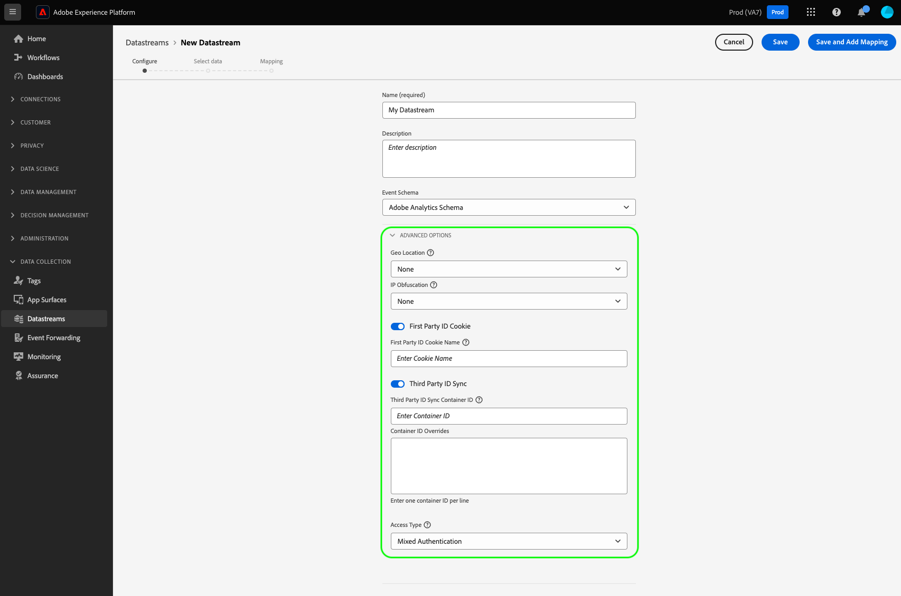

# Configurer un flux de données

Ce document décrit les étapes de configuration d’un [flux de données](./overview.md) dans l’interface utilisateur.

## Accéder à l’espace de travail [!UICONTROL Flux de données]

Vous pouvez créer et gérer des flux de données dans l’interface utilisateur de collecte de données ou d’Experience Platform en sélectionnant **[!UICONTROL Flux de données]** dans le volet de navigation de gauche.

L’onglet **[!UICONTROL Flux de données]** affiche une liste des flux de données existants, y compris leur nom convivial, leur identifiant et leur date de dernière modification. Sélectionnez le nom d’un flux de données pour [afficher les détails et configurer des services](#view-details).

Sélectionnez l’icône « plus » (**…**) d’un flux de données spécifique afin d’afficher plus d’options. Sélectionnez **[!UICONTROL Modifier]** pour mettre à jour la [configuration de base](#configure) du flux de données ou sélectionnez **[!UICONTROL Supprimer]** pour supprimer le flux de données.

## Créer un flux de données {#create}

Pour créer un flux de données, commencez par sélectionner **[!UICONTROL Nouveau flux de données]**.

Le processus de création du flux de données s’affiche, en commençant à l’étape de configuration. Ensuite, vous devez fournir un nom et une description facultative pour le flux de données.

Si vous configurez ce flux de données pour l’utiliser dans Experience Platform et que vous utilisez le SDK web de Platform, vous devez également sélectionner un [schéma de modèle de données d’expérience (XDM) basé sur un événement](../xdm/classes/experienceevent.md) pour représenter les données que vous prévoyez d’ingérer.

Sélectionnez **[!UICONTROL Options avancées]** pour afficher des commandes supplémentaires permettant de configurer le flux de données.

 {#advanced-options}

>[!IMPORTANT]
>
> Il est de votre responsabilité de vous assurer que vous avez obtenu tous les consentements et autorisations nécessaires en vertu des lois et réglementations applicables pour collecter, traiter et transmettre des données personnelles, y compris des informations de géolocalisation précises.
> 
> Votre choix d’obscurcissement de l’adresse IP n’a aucune incidence sur le niveau des informations de géolocalisation obtenues à partir de l’adresse IP et envoyées à vos solutions Adobe configurées. Les recherches de géolocalisation doivent être limitées ou désactivées séparément.

| Paramètre | Description |
| --- | --- |
| [!UICONTROL Recherche géographique] | Active les recherches de géolocalisation pour les options sélectionnées, sur la base de l’adresse IP du visiteur ou de la visiteuse. Pour effectuer des recherches de géolocalisation, vous devez inclure le groupe de champs [`placeContext`](../edge/data-collection/automatic-information.md#place-context) dans la configuration du SDK Web.   Options disponibles : <ul><li>Pays</li><li>Code postal</li><li>État/Province</li><li>DMA</li><li>Ville</li><li>Latitude </li><li>Longitude</li></ul>Les options **[!UICONTROL Ville]**, **[!UICONTROL Latitude]** ou **[!UICONTROL Longitude]** fournissent des coordonnées jusqu’à deux décimales, indépendamment des autres options sélectionnées. Il s’agit d’une granularité au niveau de la ville.    Si vous ne sélectionnez aucune option, les recherches de géolocalisation sont désactivées. La géolocalisation intervient avant l’[!UICONTROL Obscurcissement de l’adresse IP]. Elle n’est donc pas affectée par le paramètre [!UICONTROL Obscurcissement d’adresses IP]. |
| [!UICONTROL Recherche réseau] | Active les recherches réseau pour les options sélectionnées, sur la base de l’adresse IP du visiteur ou de la visiteuse. Pour effectuer des recherches réseau, vous devez inclure le groupe de champs [`Environment`](../edge/data-collection/automatic-information.md#environment) dans la configuration du SDK Web.  Options disponibles : <ul><li>Opérateur téléphonique</li><li>Domaine</li><li>Fournisseur de services Internet</li></ul>Ces options peuvent être utilisées pour fournir à d’autres services davantage d’informations sur le réseau spécifique d’où proviennent les requêtes. |
| [!UICONTROL Obscurcissement d’IP] | Indique le type d’obscurcissement d’adresses IP à appliquer au train de données. Tout traitement basé sur l’adresse IP du client ou de la cliente est affecté par le paramètre d’obscurcissement des adresses IP. Cela inclut tous les services Experience Cloud qui reçoivent des données de votre train de données. 
Options disponibles :
 <ul><li>**[!UICONTROL Aucun]** : désactive l’obscurcissement des adresses IP. L’adresse IP complète de la personne sera envoyée via le train de données.</li><li>**[!UICONTROL Partiel]** : obscurcit le dernier octet de l’adresse IP pour les adresses IPv4. Pour les adresses IPv6, l’obscurcissement masque les 80 derniers bits de l’adresse IP. 
Exemples :
 <ul><li>IPv4 : `1.2.3.4` -> `1.2.3.0`</li><li>IPv6 : `2001:0db8:1345:fd27:0000:ff00:0042:8329` -> `2001:0db8:1345:0000:0000:0000:0000:0000`</li></ul></li><li>**[!UICONTROL Complet]** : obscurcit l’intégralité de l’adresse IP. 
Exemples :
 <ul><li>IPv4 : `1.2.3.4` -> `0.0.0.0`</li><li>IPv6 : `2001:0db8:1345:fd27:0000:ff00:0042:8329` -> `0:0:0:0:0:0:0:0`</li></ul></li></ul> Impact de l’obscurcissement des adresses IP sur d’autres produits Adobe : <ul><li>**Adobe Target** : le paramètre [!UICONTROL Obscurcissement d’adresses IP] au niveau du train de données est prioritaire sur toute option d’obscurcissement d’adresses IP définie dans Adobe Target. Par exemple, si l’option [!UICONTROL Obscurcissement d’adresses IP] est définie sur **[!UICONTROL Complet]** au niveau du train de données et sur **[!UICONTROL Obscurcissement du dernier octet]** dans Adobe Target, Adobe Target recevra une adresse IP entièrement obscurcie. Pour plus d’informations, consultez la documentation d’Adobe Target sur l’[Obscurcissement d’adresses IP](https://developer.adobe.com/target/before-implement/privacy/privacy/) et sur la [géolocalisation](https://experienceleague.adobe.com/docs/target/using/audiences/create-audiences/categories-audiences/geo.html?lang=fr).</li><li>**Audience Manager** : le paramètre d’obscurcissement des adresses IP au niveau du train de données est prioritaire sur toute option d’obscurcissement d’adresses IP définie dans Audience Manager. De plus, il s’applique à toutes les adresses IP. Les recherches de géolocalisation effectuées dans Audience Manager sont affectées par l’option [!UICONTROL Obscurcissement d’adresses IP] définie au niveau du train de données. Une recherche de géolocalisation effectuée dans Audience Manager, basée sur une adresse IP entièrement obscurcie, donnera une région inconnue et tout segment basé sur les données de géolocalisation obtenues ne sera pas réalisé. Pour plus d’informations, consultez la documentation d’Audience Manager sur l’[Obscurcissement d’adresses IP](https://experienceleague.adobe.com/docs/audience-manager/user-guide/features/administration/ip-obfuscation.html?lang=fr).</li><li>**Adobe Analytics** : Adobe Analytics ne reçoit actuellement les adresses IP partiellement obscurcies que si une option d’obscurcissement d’adresses IP autre que « AUCUN » est sélectionnée. Pour qu’Analytics reçoive des adresses IP entièrement obscurcies, vous devez configurer l’obscurcissement des adresses IP séparément, dans Adobe Analytics. Ce comportement sera mis à jour dans les prochaines versions. Consultez la [documentation](https://experienceleague.adobe.com/docs/analytics/admin/admin-tools/manage-report-suites/edit-report-suite/report-suite-general/general-acct-settings-admin.html?lang=fr) d’Adobe Analytics pour obtenir plus d’informations sur l’activation de l’obscurcissement des adresses IP dans Analytics.</li></ul> |
| [!UICONTROL Cookie interne d’identifiant] | Lorsqu’il est activé, ce paramètre indique à Edge Network de se référer à un cookie spécifié lors de la recherche d’un [identifiant d’appareil interne](../edge/identity/first-party-device-ids.md), plutôt que de rechercher cette valeur dans le mappage d’identité.  Lors de l’activation de ce paramètre, vous devez indiquer le nom du cookie dans lequel l’identifiant doit être stocké. |
| [!UICONTROL Synchronisation des identifiants tiers] | Les synchronisations des identifiants peuvent être regroupées en conteneurs afin de permettre l’exécution de différentes synchronisations d’identifiant à différents moments. Lorsqu’il est activé, ce paramètre vous permet de spécifier le conteneur des synchronisations d’identifiant à exécuter pour ce flux de données. |
| [!UICONTROL ID de conteneur de synchronisation d’identifiants tiers] | L’identifiant numérique du conteneur à utiliser pour la synchronisation des identifiants tiers. |
| [!UICONTROL Remplacements d’identifiants de conteneur] | Dans cette section, vous pouvez définir des identifiants de conteneur de synchronisation d’identifiants tiers supplémentaires, que vous pouvez utiliser pour remplacer celui par défaut. |
| [!UICONTROL Type d’accès] | Définit le type d’authentification qu’Edge Network accepte pour le train de données. <ul><li>**[!UICONTROL Authentification mixte]** : lorsque cette option est activée, Edge Network accepte les demandes authentifiées et non authentifiées. Sélectionnez cette option lorsque vous prévoyez d’utiliser le SDK web ou le [SDK mobile](https://developer.adobe.com/client-sdks/documentation/), ainsi que l’[API Server](../server-api/overview.md). </li><li>**[!UICONTROL Authentifié uniquement]** : lorsque cette option est activée, Edge Network accepte uniquement les demandes authentifiées. électionnez cette option lorsque vous prévoyez d’utiliser uniquement l’API Server et que vous souhaitez empêcher le traitement des demandes non authentifiées par Edge Network.</li></ul> |

Ensuite, si vous configurez le flux de données d’Experience Platform, suivez le tutoriel sur la [Préparation des données pour la collecte de données](./data-prep.md) afin de mapper les données à un schéma d’événement de Platform avant de revenir à ce guide. Sinon, sélectionnez **[!UICONTROL Enregistrer]** et passez à la section suivante.

## Afficher les détails d’un flux de données {#view-details}

Après avoir configuré un nouveau flux de données ou sélectionné un flux de données existant à afficher, sa page de détails s’affiche. Vous y trouverez des informations supplémentaires sur le flux de données, y compris son identifiant.

À partir de l’écran de détails du flux de données, vous pouvez [ajouter des services](#add-services) pour activer les fonctionnalités des produits Adobe Experience Cloud auxquels vous avez accès. Vous pouvez également modifier la [configuration de base](#create) du flux de données, mettre à jour ses [règles de mappage](./data-prep.md), [copier le flux de données](#copy) ou le supprimer entièrement.

## Ajouter des services à un flux de données {#add-services}

Sur la page de détails d’un flux de données, sélectionnez **[!UICONTROL Ajouter un service]** pour commencer à ajouter les services disponibles à ce flux de données.

Sur l’écran suivant, utilisez le menu déroulant pour sélectionner un service à configurer pour ce flux de données. Seuls les services auxquels vous avez accès apparaissent dans cette liste.

Sélectionnez le service souhaité, renseignez les options de configuration qui s’affichent, puis sélectionnez **[!UICONTROL Enregistrer]** pour ajouter le service au flux de données. Tous les services ajoutés s’affichent dans la vue des détails du flux de données.

Les sous-sections ci-dessous décrivent les options de configuration de chaque service.

>[!NOTE]
>
>Chaque configuration de service contient un bouton **[!UICONTROL Activer]** qui est automatiquement activé lorsque le service est sélectionné. Pour désactiver le service sélectionné de ce flux de données, sélectionnez à nouveau le bouton **[!UICONTROL Activer]**.

### Paramètres d’Adobe Analytics {#analytics}

Ce service contrôle si et comment les données sont envoyées à Adobe Analytics. Vous trouverez des informations supplémentaires dans le guide sur l’[envoi de données à Analytics](../edge/data-collection/adobe-analytics/analytics-overview.md).

| Paramètre | Description |
| --- | --- |
| [!UICONTROL Identifiant de suite de rapports] | **(Obligatoire)** L’identifiant de la suite de rapports Analytics à laquelle vous souhaitez envoyer des données. Cet identifiant se trouve dans l’interface utilisateur d’Adobe Analytics sous [!UICONTROL Administration] > [!UICONTROL Suites de rapports]. Si plusieurs suites de rapports sont spécifiées, les données sont copiées dans chaque suite de rapports. |
| [!UICONTROL Remplacements de suites de rapports] | Dans cette section, vous pouvez ajouter d’autres identifiants de suites de rapports que vous pouvez utiliser pour remplacer celui par défaut. |

### Paramètres d’Adobe Audience Manager {#audience-manager}

Ce service contrôle si et comment les données sont envoyées à Adobe Audience Manager. Il suffit d’activer cette section pour envoyer des données à Audience Manager. Les autres paramètres sont facultatifs, mais recommandés.

| Paramètre | Description |
| --- | --- |
| [!UICONTROL Destinations de cookie activées] | Permet au SDK de partager des informations sur les segments via les [destinations de cookie](https://experienceleague.adobe.com/docs/audience-manager/user-guide/features/destinations/custom-destinations/create-cookie-destination.html?lang=fr) d’[!DNL Audience Manager]. |
| [!UICONTROL Destinations d’URL activées] | Permet au SDK de partager des informations sur les segments via les [destinations d’URL](https://experienceleague.adobe.com/docs/audience-manager/user-guide/features/destinations/custom-destinations/create-url-destination.html?lang=fr) d’[!DNL Audience Manager]. |

### Paramètres d’Adobe Experience Platform {#aep}

>[!IMPORTANT]
>
>Lors de l’activation d’un flux de données pour Platform, notez le sandbox Platform que vous utilisez actuellement, tel qu’affiché dans le ruban supérieur de l’interface utilisateur.
>
>
>
>Les sandbox sont des partitions virtuelles dans Adobe Experience Platform qui vous permettent d’isoler les données et mises en œuvre des autres membres de l’organisation. Une fois un flux de données créé, le sandbox ne peut plus être modifié. Pour plus d’informations sur le rôle des sandbox dans Experience Platform, consultez la [documentation sur les sandbox](../sandboxes/home.md).

Ce service contrôle si et comment les données sont envoyées à Adobe Experience Platform.

| Paramètre | Description |
|---| --- |
| [!UICONTROL Jeu de données d’événement] | **(Obligatoire)** Sélectionnez le jeu de données de Platform vers lequel les données d’événement client seront diffusées. Ce schéma doit utiliser la [classe XDM ExperienceEvent](../xdm/classes/experienceevent.md). Pour ajouter d’autres jeux de données, sélectionnez **[!UICONTROL Ajouter un jeu de données d’événement]**. |
| [!UICONTROL Jeu de données de profil] | Sélectionnez le jeu de données de Platform auquel les données d’attribut du client seront envoyées. Ce schéma doit utiliser la [classe XDM Individual Profile](../xdm/classes/individual-profile.md). |
| [!UICONTROL Offer Decisioning] | Cochez cette case pour activer Offer Decisioning pour une mise en œuvre du SDK web de Platform. Consultez le guide sur l’[utilisation d’Offer Decisioning avec le SDK web de Platform](../edge/personalization/offer-decisioning/offer-decisioning-overview.md) pour plus d’informations sur la mise en œuvre.  Pour plus d’informations sur les fonctionnalités d’Offer Decisioning, consultez la [Documentation d’Adobe Journey Optimizer](https://experienceleague.adobe.com/docs/journey-optimizer/using/offer-decisioniong/get-started/starting-offer-decisioning.html?lang=fr). |
| [!UICONTROL Segmentation Edge] | Cochez cette case pour activer la [segmentation Edge](../segmentation/ui/edge-segmentation.md) de ce flux de données. Lorsque le SDK envoie des données par le biais d’un flux de données compatible avec la segmentation Edge, toutes les adhésions au segment mises à jour pour le profil en question sont renvoyées dans la réponse.  Cette option peut être utilisée conjointement avec [!UICONTROL Destinations de personnalisation] pour les [cas d’utilisation de la personnalisation de page suivante](../destinations/ui/activate-edge-personalization-destinations.md). |
| [!UICONTROL Destinations de personnalisation] | Lorsque vous activez cette fonction après avoir activé la case à cocher [!UICONTROL Segmentation Edge], cette option permet au flux de données de se connecter aux destinations de personnalisation, telles que [Personnalisation personnalisée](../destinations/catalog/personalization/custom-personalization.md).  Consultez la documentation des destinations pour obtenir des instructions spécifiques sur la [configuration des destinations de personnalisation](../destinations/ui/activate-edge-personalization-destinations.md). |
| [!UICONTROL Adobe Journey Optimizer] | Cochez cette case pour activer [Adobe Journey Optimizer](https://experienceleague.adobe.com/docs/journey-optimizer/using/ajo-home.html?lang=fr) pour ce flux de données.    L’activation de cette option permet au flux de données de renvoyer du contenu personnalisé à partir de campagnes entrantes web et basées sur des applications dans [!DNL Adobe Journey Optimizer]. Cette option nécessite [!UICONTROL Segmentation Edge] pour être active. Si [!UICONTROL Segmentation Edge] n’est pas cochée, cette option est grisée. |

### Paramètres d’Adobe Target {#target}

Ce service contrôle si et comment les données sont envoyées à Adobe Target.

| Paramètre | Description |
| --- | --- |
| [!UICONTROL Jeton de propriété] | [!DNL Target] permet aux clients de contrôler les autorisations par l’utilisation des propriétés. Pour plus d’informations sur les propriétés, consultez le guide sur la [configuration des autorisations d’entreprise](https://experienceleague.adobe.com/docs/target/using/administer/manage-users/enterprise/properties-overview.html?lang=fr) dans la documentation de [!DNL Target].  Le jeton de propriété se trouve dans l’interface utilisateur d’Adobe Target sous [!UICONTROL Configuration] > [!UICONTROL Propriétés]. |
| [!UICONTROL Identifiant d’environnement Target] | Les [environnements dans Adobe Target](https://experienceleague.adobe.com/docs/target/using/administer/hosts.html?lang=fr) vous permettent de gérer la mise en œuvre à toutes les étapes de développement. Ce paramètre spécifie l’environnement que vous allez utiliser avec ce flux de données.  Une bonne pratique consiste à définir ce paramètre différemment pour chacun des environnements de flux de données `dev`, `stage` et `prod` afin de simplifier le processus. Cependant, si des environnements Adobe Target sont déjà définis, vous pouvez les utiliser. |
| [!UICONTROL Espace de noms d’identifiant tiers de Target] | L’espace de noms d’identité du `mbox3rdPartyId` que vous souhaitez utiliser pour ce flux de données. Pour plus d’informations, consultez le guide sur la [mise en œuvre de `mbox3rdPartyId` avec le SDK web](../edge/personalization/adobe-target/using-mbox-3rdpartyid.md). |
| [!UICONTROL Remplacements de jetons de propriété] | Dans cette section, vous pouvez définir des jetons de propriété supplémentaires que vous pouvez utiliser pour remplacer celui par défaut. |

### Paramètres [!UICONTROL Transfert d’événement]

Ce service contrôle si et comment les données sont envoyées au [transfert d’événement](../tags/ui/event-forwarding/overview.md).

| Paramètre | Description |
| --- | --- |
| [!UICONTROL Propriété de Launch] | **(Obligatoire)** La propriété de transfert d’événement à laquelle vous souhaitez envoyer des données. |
| [!UICONTROL Environnement Launch] | **(Obligatoire)** L’environnement au sein de la propriété sélectionnée auquel vous souhaitez envoyer des données. |

>[!NOTE]
>
>Vous pouvez sélectionner **[!UICONTROL Saisie manuelle des identifiants]** pour saisir les noms des propriétés et des environnements au lieu d’utiliser les menus déroulants.

## Copier un flux de données {#copy}

Vous pouvez créer une copie d’un flux de données existant et en modifier les détails si nécessaire.

>[!NOTE]
>
>Les flux de données peuvent uniquement être copiés dans le même [sandbox](../sandboxes/home.md). En d’autres termes, vous ne pouvez pas copier un flux de données d’un sandbox vers un autre.

À partir de la page principale de l’espace de travail [!UICONTROL Flux de données], sélectionnez les points de suspension (**....**) pour le flux de données en question, puis sélectionnez **[!UICONTROL Copier]**.

![Image illustrant l’option [!UICONTROL Copier] sélectionnée dans la vue Liste du flux de données](assets/configure/copy-datastream-list.png).

Vous pouvez également sélectionner **[!UICONTROL Copier le flux de données]** dans la vue des détails d’un flux de données particulier.

![Image illustrant l’option [!UICONTROL Copier] sélectionnée dans la vue des détails du flux de données](assets/configure/copy-datastream-details.png).

Une boîte de dialogue de confirmation s’affiche, vous invitant à fournir un nom unique pour la création du flux de données, ainsi que des détails sur les options de configuration qui seront copiées. Une fois prêt, sélectionnez **[!UICONTROL Copier]**.

La page principale de l’espace de travail [!UICONTROL Flux de données] réapparaît avec le nouveau flux de données répertorié.

## Étapes suivantes

Ce guide explique comment gérer les flux de données dans l’interface utilisateur de collecte de données. Pour plus d’informations sur l’installation et la configuration du SDK web après la configuration d’un flux de données, consultez le [Guide E2E de collecte de données](../collection/e2e.md#install).
