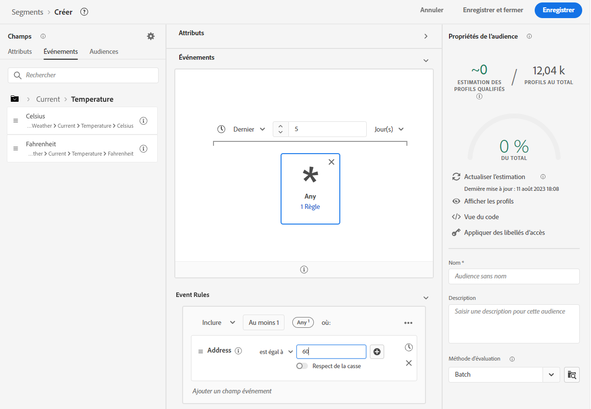
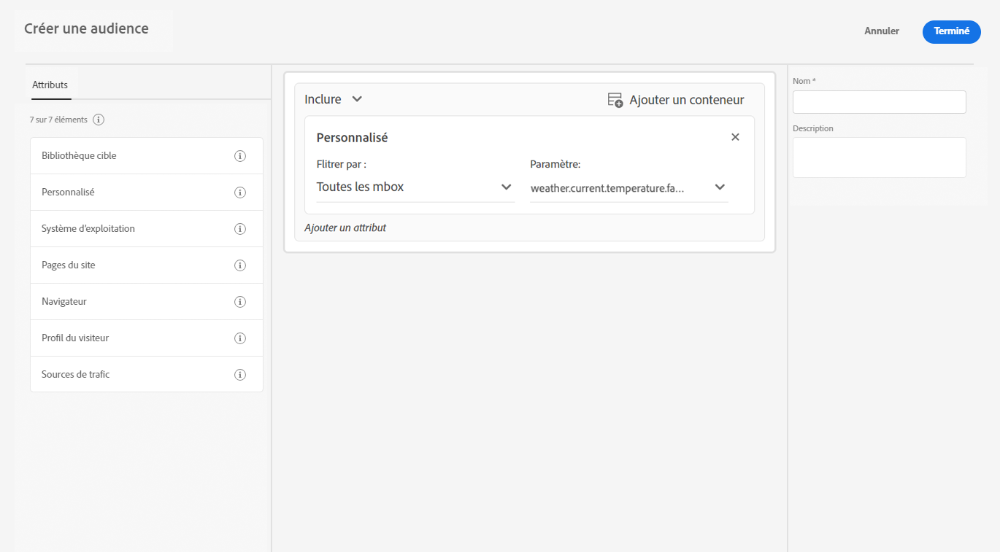

# Améliorez la collecte de données avec les données météorologiques de [!DNL The Weather Channel]

Adobe s’est associé à [[!DNL [The Weather Company]]](https://www.ibm.com/weather) afin d’apporter le contexte supplémentaire de la météo des États-Unis aux données collectées par le biais des trains de données. Vous pouvez utiliser ces données pour l’analyse, le ciblage et la création d’audiences dans Experience Platform.

Il existe trois types de données disponibles à partir de [!DNL The Weather Channel] :

* **[!UICONTROL Météo actuelle]** : conditions météorologiques actuelles pour l’utilisateur ou l’utilisatrice, en fonction de sa position. Cela inclut la température actuelle, les précipitations, la couverture nuageuse, etc.
* **[!UICONTROL Météo prévue]** : la prévision inclut les prévisions à 1, 2, 3, 5, 7 et 10 jours pour l’emplacement de l’utilisateur.
* **[!UICONTROL Déclencheurs]** : combinaisons spécifiques qui correspondent à différentes conditions météorologiques sémantiques. Il existe trois types de déclencheurs météorologiques :

   * **[!UICONTROL Déclencheurs météo]** : conditions sémantiquement significatives, telles qu’un temps froid ou pluvieux. Leurs définitions peuvent varier selon les climats.
   * **[!UICONTROL Déclencheurs de produits]** : conditions qui conduiraient à l’achat de différents types de produits. Par exemple : les prévisions de temps froid pourraient signifier que les achats de imperméables sont plus probables.
   * **[!UICONTROL Déclencheurs de conditions météorologiques extrêmes]** : alertes de conditions météorologiques extrêmes, comme les alertes de tempête hivernale ou d’ouragan.

## Conditions préalables {#prerequisites}

Avant d’utiliser les données météorologiques, assurez-vous de respecter les conditions préalables suivantes :

* Vous devez obtenir une licence pour les données météorologiques que vous utiliserez à partir de [!DNL The Weather Channel]. Elle sera ensuite activé sur votre compte.
* Les données météorologiques ne sont disponibles que par le biais de trains de données. Pour utiliser les données météorologiques, vous devez utiliser [!DNL Web SDK], [!DNL Mobile Edge Extension] ou l’API [Edge Network](https://developer.adobe.com/data-collection-apis/docs/api/) pour inclure ces données.
* La [[!UICONTROL géolocalisation]](../configure.md#advanced-options) doit être activée dans votre train de données.
* Ajoutez le [groupe de champs météo](#schema-configuration) au schéma que vous utilisez.

## Approvisionnement {#provisioning}

Une fois que vous avez obtenu votre licence pour les données auprès de [!DNL The Weather Channel], votre compte pourra alors accéder aux données. Ensuite, vous devez contacter l’assistance clientèle d’Adobe pour activer les données dans votre train de données. Une fois activées, les données sont automatiquement ajoutées.

Vous pouvez vérifier qu’elles sont ajoutées en exécutant une trace Edge avec le débogueur ou en utilisant Assurance pour suivre un accès via l’[!DNL Edge Network].

### Configuration du schéma {#schema-configuration}

Vous devez ajouter les groupes de champs météorologiques à votre schéma Experience Platform correspondant au jeu de données d’événement que vous utilisez dans votre train de données. Cinq groupes de champs sont disponibles :

* [!UICONTROL Prévisions météo]
* [!UICONTROL Météo actuelle]
* [!UICONTROL Déclencheurs de produits]
* [!UICONTROL Déclencheurs relatifs]
* [!UICONTROL Déclencheurs de conditions météorologiques extrêmes]

## Accéder aux données météorologiques {#access-weather-data}

Une fois que vos données sont sous licence et disponibles, vous pouvez y accéder de différentes manières dans l’ensemble des services Adobe.

### Adobe Analytics {#analytics}

Dans [!DNL Adobe Analytics], les données météorologiques peuvent être mappées par le biais de règles de traitement, avec le reste de votre schéma [!DNL XDM].

Vous trouverez la liste des champs que vous pouvez mapper dans la page [référence météo](weather-reference.md). Comme pour tous les schémas [!DNL XDM], les clés sont précédées du préfixe `a.x`. Par exemple, un champ nommé `weather.current.temperature.farenheit` s’afficherait dans [!DNL Analytics] comme `a.x.weather.current.temperature.farenheit`.

### Adobe Customer Journey Analytics {#cja}

Dans [!DNL Adobe Customer Journey Analytics], les données météorologiques sont disponibles dans le jeu de données spécifié dans le train de données. Tant que les attributs de météo sont [ajoutés à votre schéma](#prerequisites-prerequisites), ils peuvent être [ajoutés à une vue de données](https://experienceleague.adobe.com/docs/analytics-platform/using/cja-dataviews/create-dataview.html?lang=fr) en [!DNL Customer Journey Analytics].

### Real-Time Customer Data Platform {#rtcdp}

Les données météorologiques sont disponibles dans [Real-Time Customer Data Platform](../../rtcdp/overview.md), pour une utilisation dans les audiences. Les données météorologiques sont associées aux événements.

Les conditions météorologiques changeant fréquemment, Adobe vous recommande de définir des contraintes de temps sur les audiences, comme illustré dans l&#39;exemple ci-dessus. Une journée froide la veille ou l’avant-veille est beaucoup plus important qu’une journée froide il y a 6 mois.

Voir [référence météo](weather-reference.md) pour les champs disponibles.

### Adobe Target {#target}

Dans [!DNL Adobe Target], vous pouvez utiliser les données météorologiques pour générer de la personnalisation en temps réel. Les données météorologiques sont transmises à [!DNL Target] en tant que [!UICONTROL mBox] et vous pouvez y accéder via un paramètre [!UICONTROL mBox] personnalisé.

Le paramètre est le chemin d’accès [!DNL XDM] à un champ spécifique. Voir [référence météo](weather-reference.md) pour les champs disponibles et leurs chemins d’accès correspondants.

## Étapes suivantes {#next-steps}

Après avoir lu ce document, vous comprenez mieux comment utiliser les données météorologiques dans différentes solutions Adobe. Pour en savoir plus sur le mappage des champs de données météorologiques, voir [référence de mappage de champs](weather-reference.md).
