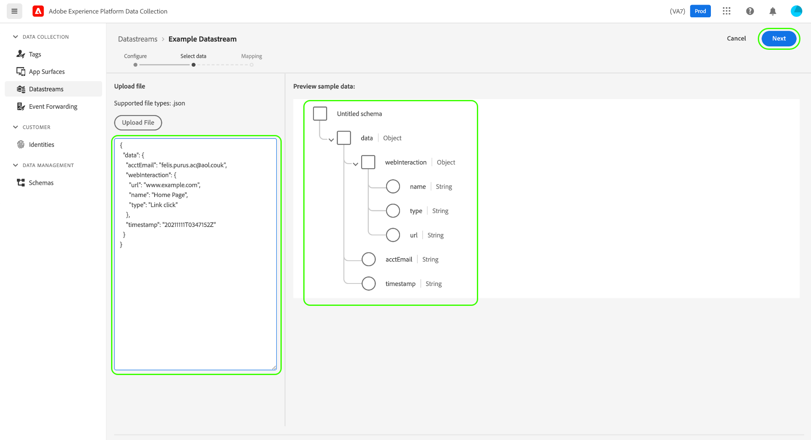
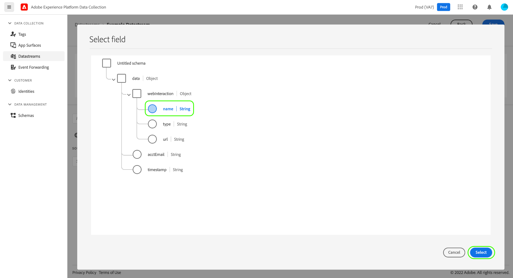
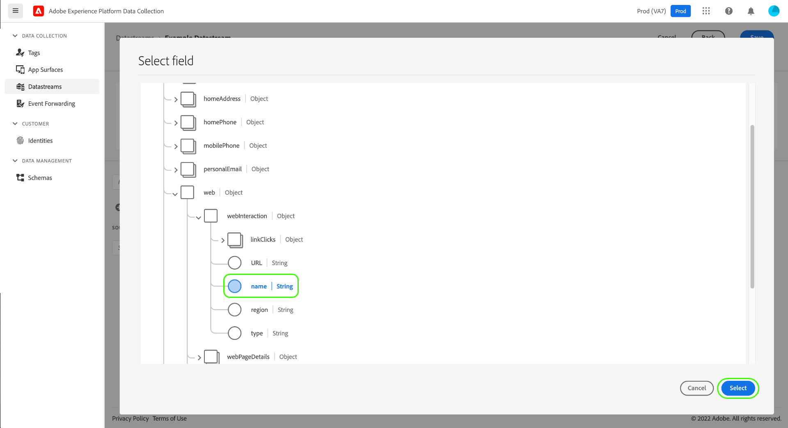
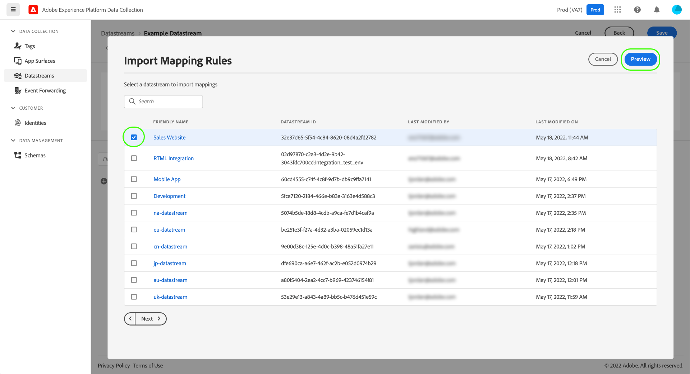

# Préparation des données pour la collecte de données

Utilisez [!DNL Data Prep], un service [!DNL Adobe Experience Platform], pour mapper, transformer et valider des données vers et depuis [Modèle de données d’expérience (XDM)](/help/xdm/home.md). Lors de la configuration d’un [flux de données](/help/datastreams/overview.md) compatible avec Experience Platform, vous pouvez utiliser [!DNL Data Prep] fonctionnalités pour mapper vos données source à XDM lors de leur envoi à [!DNL Adobe Experience Platform Edge Network].

Toutes les données envoyées à partir d’une page web doivent atterrir dans Experience Platform en tant que XDM. Vous disposez de trois méthodes pour traduire les données d’une couche de données sur la page dans le fichier XDM accepté par Experience Platform :

1. Reformater la couche de données en XDM sur la page web elle-même.
2. Utilisez la fonctionnalité d’éléments de données intégrée [!DNL Tags] pour reformater en XDM le format de couche de données existant d’une page web.
3. Reformater le format de couche de données existant d’une page web dans XDM via l’[!DNL Edge Network], à l’aide de la préparation des données pour la collecte de données.

Ce guide couvre la troisième option.

## Quand utiliser la préparation des données pour la collecte de données {#when-to-use-data-prep}

La préparation des données pour la collecte de données est utile dans deux cas :

1. Le site web dispose d’une couche de données bien formée, gouvernée et conservée. Vous préférez donc l’envoyer directement au [!DNL Edge Network] au lieu d’utiliser la manipulation JavaScript pour la convertir en XDM sur la page (via des éléments de données [!DNL Tags] ou une manipulation manuelle de JavaScript).
2. Un système de balisage autre que [!DNL Tags] est déployé sur le site.

## Envoyer une couche de données existante à Edge Network via Web SDK {#send-datalayer-via-websdk}

La couche de données existante doit être envoyée à l’aide de l’objet [`data`](/help/collection/js/commands/sendevent/data.md) dans la commande `sendEvent`.

Si vous utilisez [!DNL Tags], vous devez utiliser le champ **[!UICONTROL Data]** de type d&#39;action [**[!UICONTROL Envoyer l&#39;événement]**](/help/tags/extensions/client/web-sdk/actions/send-event.md).

Le reste de ce guide explique comment mapper la couche de données aux normes XDM après son envoi par le SDK Web.

>[!NOTE]
>
>Pour obtenir des instructions complètes sur toutes les fonctionnalités de [!DNL Data Prep], y compris les fonctions de transformation des champs calculés, consultez la documentation suivante :
>
>* [Présentation de la préparation des données](/help/data-prep/home.md)
>* [Fonctions de mappage de la préparation des données](/help/data-prep/functions.md)
>* [Gestion des formats de données avec la préparation des données](/help/data-prep/data-handling.md)

Ce guide explique comment mapper vos données dans l’interface utilisateur. Pour terminer les étapes, commencez le processus de création d’un flux de données jusqu’à (et y compris) l’étape [configuration de base](/help/datastreams/configure.md#create).

Pour une démonstration rapide du processus de préparation des données pour la collecte de données, regardez la vidéo suivante :

>[!VIDEO](https://video.tv.adobe.com/v/345564?captions=fre_fr&quality=12&enable10seconds=on&speedcontrol=on)

## Fournir des exemples de données {#select-data}

Sélectionnez **[!UICONTROL Enregistrer et ajouter un mappage]** après avoir terminé la configuration de base d’un flux de données, et l’étape **[!UICONTROL Sélectionner des données]** s’affiche. Ensuite, vous devez fournir un exemple d’objet JSON qui représente la structure des données que vous prévoyez d’envoyer à Experience Platform.

Pour capturer les propriétés directement à partir de la couche de données, l’objet JSON doit comporter une seule propriété racine `data`. Les sous-propriétés de l’objet `data` doivent ensuite être structurées de manière à correspondre aux propriétés de la couche de données que vous souhaitez capturer. Sélectionnez la section ci-dessous pour afficher un exemple d’objet JSON correctement formaté avec une racine `data`.

+++Exemple de fichier JSON avec racine `data`

```json
{
  "data": {
    "eventMergeId": "cce1b53c-571f-4f36-b3c1-153d85be6602",
    "eventType": "view:load",
    "timestamp": "2021-09-30T14:50:09.604Z",
    "web": {
      "webPageDetails": {
        "siteSection": "Product section",
        "server": "example.com",
        "name": "product home",
        "URL": "https://www.example.com"
      },
      "webReferrer": {
        "URL": "https://www.adobe.com/index2.html",
        "type": "external"
      }
    },
    "commerce": {
      "purchase": 1,
      "order": {
        "orderID": "1234"
      }
    },
    "product": [
      {
        "productInfo": {
          "productID": "123"
        }
      },
      {
        "productInfo": {
          "productID": "1234"
        }
      }
    ],
    "reservation": {
      "id": "anc45123xlm",
      "name": "Embassy Suits",
      "SKU": "12345-L",
      "skuVariant": "12345-LG-R",
      "priceTotal": "112.99",
      "currencyCode": "USD",
      "adults": 2,
      "children": 3,
      "productAddMethod": "PDP",
      "_namespace": {
        "test": 1,
        "priceTotal": "112.99",
        "category": "Overnight Stay"
      },
      "freeCancellation": false,
      "cancellationFee": 20,
      "refundable": true
    }
  }
}
```

+++

Les mêmes règles s’appliquent à l’objet JSON pour capturer les propriétés d’un élément de données d’objet XDM, mais la propriété racine doit plutôt être saisie en tant que `xdm`. Sélectionnez la section ci-dessous pour afficher un exemple d’objet JSON correctement formaté avec une racine `xdm`.

+++Exemple de fichier JSON avec racine `xdm`

```json
{
  "xdm": {
    "environment": {
      "type": "browser",
      "browserDetails": {
        "userAgent": "Mozilla/5.0 (Macintosh; Intel Mac OS X 10_7_5) AppleWebkit/537.36 (KHTML, like Gecko) Chrome/49.0.2623.112 Safari/537.36",
        "javaScriptEnabled": true,
        "javaScriptVersion": "1.8.5",
        "cookiesEnabled": true,
        "viewportHeight": 900,
        "viewportWidth": 1680,
        "javaEnabled": true
      },
      "domain": "adobe.com",
      "colorDepth": 24,
      "viewportHeight": 1050,
      "viewportWidth": 1680
    },
    "device": {
      "screenHeight": 1050,
      "screenWidth": 1680
    }
  }
}
```

+++

Vous pouvez sélectionner l’option pour charger l’objet sous forme de fichier ou coller l’objet brut dans la zone de texte fournie. Si le fichier JSON est valide, un schéma d’aperçu s’affiche dans le panneau de droite. Sélectionnez **[!UICONTROL Suivant]** pour continuer.



>[!NOTE]
>
>Utilisez un exemple d’objet JSON qui représente chaque élément de couche de données pouvant être utilisé sur n’importe quelle page. Par exemple, toutes les pages n’utilisent pas les éléments de couche de données de panier. Toutefois, incluez les éléments de couche de données du panier dans cet exemple d’objet JSON.

## Mappage des données {#mapping}

L’étape **[!UICONTROL Mappage]** s’affiche et vous permet de mapper les champs de vos données source à ceux du schéma d’événement cible dans Experience Platform. Ensuite, vous pouvez configurer le mappage de deux manières :

* [Créer des règles de mappage](#create-mapping) pour ce flux de données via un processus manuel.
* [Importer des règles de mappage](#import-mapping) d’un flux de données existant.

>[!IMPORTANT]
>
>Le mappage [!DNL Data Prep] remplace `identityMap` payloads XDM, ce qui peut avoir un impact supplémentaire sur la correspondance de profils par rapport aux audiences [!DNL Real-Time CDP].

### Créer des règles de mappage {#create-mapping}

Pour créer une règle de mappage, sélectionnez **[!UICONTROL Ajouter un nouveau mappage]**.


Sélectionnez l’icône de source (), puis, dans la boîte de dialogue qui s’affiche, sélectionnez le champ source à mapper dans la zone de travail fournie. Une fois que vous avez choisi un champ, utilisez le bouton **[!UICONTROL Sélectionner]** pour continuer.



Sélectionnez ensuite l’icône de schéma () pour ouvrir une boîte de dialogue similaire pour le schéma d’événement cible. Sélectionnez le champ vers lequel vous souhaitez mapper les données avant de confirmer à l’aide de l’option **[!UICONTROL Sélectionner]**.



La page de mappage réapparaît et affiche le mappage des champs terminé. La section **[!UICONTROL Progression du mappage]** est mise à jour pour refléter le nombre total de champs qui ont été mappés.


>[!TIP]
>
>Si vous souhaitez mapper un tableau d’objets (dans le champ source) à un tableau d’objets différents (dans le champ cible), ajoutez `[*]` après le nom du tableau dans les chemins d’accès aux champs source et de destination, comme illustré ci-dessous.
>
>

### Importer les règles de mappage existantes {#import-mapping}

Si vous avez précédemment créé un flux de données, vous pouvez réutiliser ses règles de mappage configurées pour un nouveau flux de données.

>[!WARNING]
>
>L’importation de règles de mappage à partir d’un autre flux de données remplace tous les mappages de champs que vous avez ajoutés avant l’importation.

Pour commencer, sélectionnez **[!UICONTROL Importer le mappage]**.


Dans la boîte de dialogue qui s’affiche, sélectionnez le flux de données dont vous souhaitez importer les règles de mappage. Une fois le flux de données choisi, sélectionnez **[!UICONTROL Aperçu]**.



>[!NOTE]
>
>Les flux de données peuvent uniquement être importés dans le même [sandbox](/help/sandboxes/home.md). Vous ne pouvez pas importer un flux de données d’un sandbox à un autre.

L’écran suivant affiche un aperçu des règles de mappage enregistrées pour le flux de données sélectionné. Assurez-vous que les mappages affichés vous conviennent, puis sélectionnez **[!UICONTROL Importer]** pour confirmer et ajouter les mappages au nouveau flux de données.


>[!NOTE]
>
>Si des champs source dans les règles de mappage importées ne sont pas inclus dans les exemples de données JSON que vous avez [fournis précédemment](#select-data), ces mappages de champs ne seront pas inclus dans l’importation.

### Terminer le mappage {#complete-mapping}

Poursuivez le mappage des champs restants au schéma cible. Bien que vous ne deviez pas mapper tous les champs source disponibles, tous les champs du schéma cible qui sont définis comme obligatoires doivent être mappés pour terminer cette étape. Le compteur **[!UICONTROL Champs obligatoires]** indique le nombre de champs obligatoires qui ne sont pas encore mappés dans la configuration actuelle.

Lorsque le nombre de champs requis atteint zéro et que le mappage vous convient, sélectionnez **[!UICONTROL Enregistrer]** pour finaliser les modifications.


## Étapes suivantes {#next-steps}

Ce guide explique comment mapper les données à XDM lors de la configuration d’un flux de données dans l’interface utilisateur. Si vous avez suivi le tutoriel général sur les flux de données, vous pouvez maintenant revenir à l’étape [affichage des détails des flux de données](/help/datastreams/overview.md).
