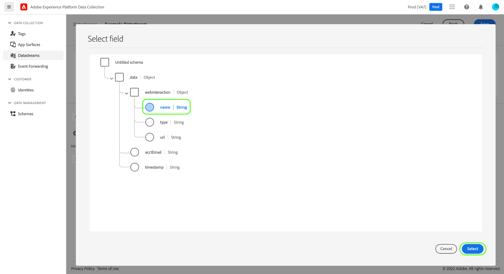

# Préparation des données pour la collecte de données

La préparation des données est un service Adobe Experience Platform qui vous permet de mapper, transformer et valider des données depuis et vers le [modèle de données d’expérience (XDM)](../xdm/home.md). Lors de la configuration d’un [flux de données](./overview.md) compatible avec Experience Platform, vous pouvez utiliser les fonctionnalités de préparation des données pour mapper vos données source à XDM lors de leur envoi à Experience Platform Edge Network.

Toutes les données envoyées à partir d’une page web doivent atterrir dans Experience Platform en tant que XDM. Il existe trois façons de traduire les données d’une couche de données sur la page vers le fichier XDM accepté par Experience Platform :

1. Reformater la couche de données en XDM sur la page web elle-même.
2. Utilisez la fonctionnalité Balises des éléments de données natifs pour reformater en XDM le format de couche de données existant d’une page web.
3. Reformater le format de couche de données d’une page web dans XDM via Edge Network, à l’aide de la préparation des données pour la collecte de données.

Ce guide se concentre sur la troisième option.

## Quand utiliser la préparation des données pour la collecte de données {#when-to-use-data-prep}

La préparation des données pour la collecte de données est utile dans deux cas d’utilisation :

1. Le site web dispose d’une couche de données bien formée, gouvernée et gérée. Il est préférable de l’envoyer directement à Edge Network plutôt que d’utiliser la manipulation JavaScript pour la convertir en XDM sur la page (via les éléments de données Balises ou une manipulation manuelle de JavaScript).
2. Un système de balisage autre que les balises est déployé sur le site.

## Envoyer une couche de données existante à Edge Network via WebSDK {#send-datalayer-via-websdk}

La couche de données existante doit être envoyée à l’aide de l’objet [`data`](/help/collection/js/commands/sendevent/data.md) dans la commande `sendEvent`.

Si vous utilisez des balises, vous devez utiliser le champ **[!UICONTROL Data]** du type d’action [**[!UICONTROL Send Event]**](/help/tags/extensions/client/web-sdk/actions/send-event.md).

Le reste de ce guide se concentre sur la manière de mapper la couche de données aux normes XDM après son envoi par le SDK Web.

>[!NOTE]
>
>Pour obtenir des instructions complètes sur toutes les fonctionnalités de préparation des données, y compris les fonctions de transformation des champs calculés, consultez la documentation suivante :
>
>* [Présentation de la préparation des données](../data-prep/home.md)
>* [Fonctions de mappage de la préparation des données](../data-prep/functions.md)
>* [Gestion des formats de données avec la préparation des données](../data-prep/data-handling.md)

Ce guide explique comment mapper vos données dans l’interface utilisateur. Pour respecter les étapes, commencez le processus de création d’un flux de données jusqu’à (et y compris) l’[étape de configuration de base](./overview.md#create).

Pour une démonstration rapide du processus de préparation des données pour la collecte de données, reportez-vous à la vidéo suivante :

>[!VIDEO](https://video.tv.adobe.com/v/345564?captions=fre_fr&quality=12&enable10seconds=on&speedcontrol=on)

## [!UICONTROL Select data] {#select-data}

Sélectionnez **[!UICONTROL Save and Add Mapping]** après avoir terminé la configuration de base d’un flux de données et l’étape **[!UICONTROL Select data]** s’affiche. Ensuite, vous devez fournir un exemple d’objet JSON qui représente la structure des données que vous prévoyez d’envoyer à Experience Platform.

Pour capturer les propriétés directement à partir de la couche de données, l’objet JSON doit comporter une seule propriété racine `data`. Les sous-propriétés de l’objet `data` doivent ensuite être structurées de manière à correspondre aux propriétés de la couche de données que vous souhaitez capturer. Sélectionnez la section ci-dessous pour afficher un exemple d’objet JSON correctement formaté avec une racine `data`.

+++Exemple de fichier JSON avec racine `data`

```json
{
  "data": {
    "eventMergeId": "cce1b53c-571f-4f36-b3c1-153d85be6602",
    "eventType": "view:load",
    "timestamp": "2021-09-30T14:50:09.604Z",
    "web": {
      "webPageDetails": {
        "siteSection": "Product section",
        "server": "example.com",
        "name": "product home",
        "URL": "https://www.example.com"
      },
      "webReferrer": {
        "URL": "https://www.adobe.com/index2.html",
        "type": "external"
      }
    },
    "commerce": {
      "purchase": 1,
      "order": {
        "orderID": "1234"
      }
    },
    "product": [
      {
        "productInfo": {
          "productID": "123"
        }
      },
      {
        "productInfo": {
          "productID": "1234"
        }
      }
    ],
    "reservation": {
      "id": "anc45123xlm",
      "name": "Embassy Suits",
      "SKU": "12345-L",
      "skuVariant": "12345-LG-R",
      "priceTotal": "112.99",
      "currencyCode": "USD",
      "adults": 2,
      "children": 3,
      "productAddMethod": "PDP",
      "_namespace": {
        "test": 1,
        "priceTotal": "112.99",
        "category": "Overnight Stay"
      },
      "freeCancellation": false,
      "cancellationFee": 20,
      "refundable": true
    }
  }
}
```

+++

Les mêmes règles s’appliquent à l’objet JSON pour capturer les propriétés d’un élément de données d’objet XDM, mais la propriété racine doit plutôt être saisie en tant que `xdm`. Sélectionnez la section ci-dessous pour afficher un exemple d’objet JSON correctement formaté avec une racine `xdm`.

+++Exemple de fichier JSON avec racine `xdm`

```json
{
  "xdm": {
    "environment": {
      "type": "browser",
      "browserDetails": {
        "userAgent": "Mozilla/5.0 (Macintosh; Intel Mac OS X 10_7_5) AppleWebkit/537.36 (KHTML, like Gecko) Chrome/49.0.2623.112 Safari/537.36",
        "javaScriptEnabled": true,
        "javaScriptVersion": "1.8.5",
        "cookiesEnabled": true,
        "viewportHeight": 900,
        "viewportWidth": 1680,
        "javaEnabled": true
      },
      "domain": "adobe.com",
      "colorDepth": 24,
      "viewportHeight": 1050,
      "viewportWidth": 1680
    },
    "device": {
      "screenHeight": 1050,
      "screenWidth": 1680
    }
  }
}
```

+++

Vous pouvez sélectionner l’option pour charger l’objet sous forme de fichier ou coller l’objet brut dans la zone de texte fournie. Si le fichier JSON est valide, un schéma d’aperçu s’affiche dans le panneau de droite. Sélectionnez **[!UICONTROL Next]** pour continuer.


>[!NOTE]
>
> Utilisez un exemple d’objet JSON qui représente chaque élément de couche de données pouvant être utilisé sur n’importe quelle page. Par exemple, toutes les pages n’utilisent pas les éléments de couche de données de panier. Toutefois, les éléments de couche de données du panier doivent être inclus dans cet exemple d’objet JSON.

## [!UICONTROL Mapping]

L’étape **[!UICONTROL Mapping]** s’affiche et vous permet de mapper les champs de vos données source à ceux du schéma d’événement cible dans Experience Platform. Ensuite, vous pouvez configurer le mappage de deux manières :

* [Créer des règles de mappage](#create-mapping) pour ce flux de données via un processus manuel.
* [Importer des règles de mappage](#import-mapping) d’un flux de données existant.

>[!IMPORTANT]
>
>Le mappage de la préparation des données remplace `identityMap` payloads XDM, ce qui peut avoir un impact supplémentaire sur la correspondance de profils par rapport aux audiences Real-Time CDP.

### Créer des règles de mappage {#create-mapping}

Pour créer une règle de mappage, sélectionnez **[!UICONTROL Add new mapping]**.


Sélectionnez l’icône de source () et, dans la boîte de dialogue qui s’affiche, sélectionnez le champ source que vous souhaitez mapper dans la zone de travail fournie. Une fois que vous avez choisi un champ, utilisez le bouton **[!UICONTROL Select]** pour continuer.



Ensuite, sélectionnez l’icône de schéma () pour ouvrir une boîte de dialogue similaire pour le schéma d’événement cible. Sélectionnez le champ vers lequel vous souhaitez mapper les données avant de confirmer avec **[!UICONTROL Select]**.


La page de mappage réapparaît et affiche le mappage des champs terminé. La section **[!UICONTROL Mapping progress]** est mise à jour pour refléter le nombre total de champs qui ont été mappés.


>[!TIP]
>
>Si vous souhaitez mapper un tableau d’objets (dans le champ source) à un tableau d’objets différents (dans le champ cible), ajoutez `[*]` après le nom du tableau dans les chemins d’accès aux champs source et de destination, comme illustré ci-dessous.
>
>

### Importer les règles de mappage existantes {#import-mapping}

Si vous avez précédemment créé un flux de données, vous pouvez réutiliser ses règles de mappage configurées pour un nouveau flux de données.

>[!WARNING]
>
>L’importation de règles de mappage à partir d’un autre flux de données remplace tous les mappages de champs que vous avez ajoutés avant l’importation.

Pour commencer, sélectionnez **[!UICONTROL Import Mapping]**.


Dans la boîte de dialogue qui s’affiche, sélectionnez le flux de données dont vous souhaitez importer les règles de mappage. Une fois le flux de données choisi, sélectionnez **[!UICONTROL Preview]**.


>[!NOTE]
>
>Les flux de données peuvent uniquement être importés dans le même [sandbox](../sandboxes/home.md). En d’autres termes, vous ne pouvez pas importer un flux de données d’un sandbox à un autre.

L’écran suivant affiche un aperçu des règles de mappage enregistrées pour le flux de données sélectionné. Assurez-vous que les mappages affichés vous conviennent, puis sélectionnez **[!UICONTROL Import]** pour confirmer et ajouter les mappages au nouveau flux de données.


>[!NOTE]
>
>Si des champs source dans les règles de mappage importées ne sont pas inclus dans les exemples de données JSON que vous avez [fournis précédemment](#select-data), ces mappages de champs ne seront pas inclus dans l’importation.

### Terminer le mappage

Continuez à suivre les étapes ci-dessus pour mapper le reste des champs au schéma cible. Bien que vous ne deviez pas mapper tous les champs source disponibles, tous les champs du schéma cible qui sont définis comme obligatoires doivent être mappés pour terminer cette étape. Le compteur **[!UICONTROL Required fields]** indique le nombre de champs obligatoires qui ne sont pas encore mappés dans la configuration actuelle.

Une fois que le nombre de champs requis atteint zéro et que le mappage vous convient, sélectionnez **[!UICONTROL Save]** pour finaliser les modifications.


## Étapes suivantes

Ce guide explique comment mapper les données à XDM lors de la configuration d’un flux de données dans l’interface utilisateur. Si vous avez suivi le tutoriel général sur les flux de données, vous pouvez maintenant revenir à l’étape sur l’[affichage des détails des flux de données](./overview.md).
