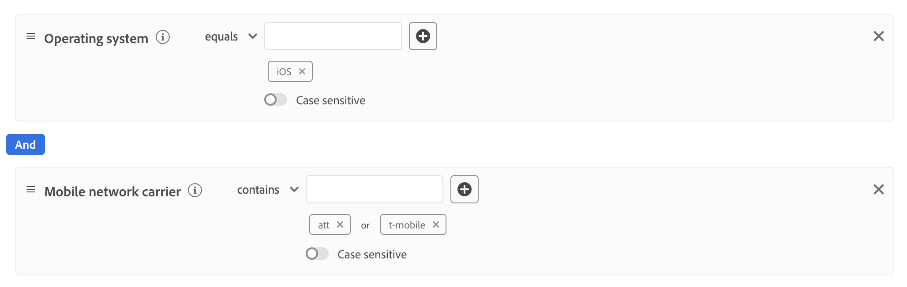
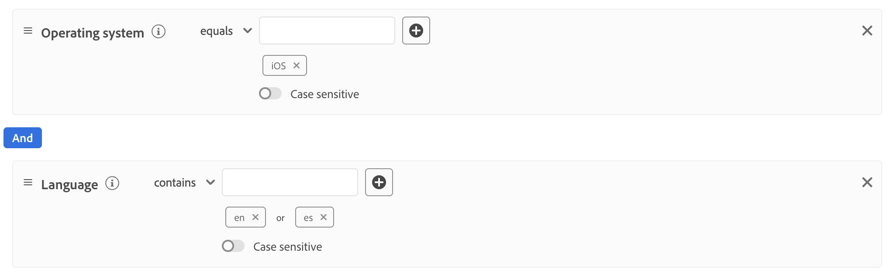

# Créer [!DNL Dynamic Datastream Configurations]

Par défaut, le [!DNL Adobe Experience Platform Edge Network] envoie tous les événements qui atteignent un flux de données à tous les [!DNL Experience Cloud] [services](/help/datastreams/configure.md#add-services) que vous avez activés pour vos flux de données. Selon vos cas d’utilisation, il peut ne pas toujours s’agir du workflow idéal.

Les configurations dynamiques de train de données corrigent ce problème par le biais d’ensembles de règles que vous définissez pour chaque service activé pour votre train de données, qui contrôlent [!DNL Experience Cloud] solution reçoit chaque type de données.

## Conditions préalables {#prerequisites}

Pour créer une configuration dynamique pour votre flux de données, vous devez remplir deux conditions :

* Vous devez avoir créé *au moins* un flux de données à utiliser. Pour plus d’informations, consultez la documentation sur la [création d’un flux de données](/help/datastreams/configure.md).
* Vous devez avoir *au moins* un service [!DNL Experience Cloud] ajouté à votre flux de données. Pour plus d’informations, consultez la documentation sur la [ajout d’un service](/help/datastreams/configure.md#add-services) à un flux de données .

Après avoir créé un flux de données et ajouté un service Experience Cloud, vous pouvez [créer une configuration dynamique](#create-dynamic-configuration).

## Mécanismes de sécurisation {#guardrails}

Les configurations de flux de données dynamiques comportent des limites et des contraintes de performances spécifiques pour garantir des performances système optimales et une efficacité de traitement des données optimale. Les mécanismes de sécurisation suivants s’appliquent lors de la configuration des règles de flux de données dynamiques :

| Mécanisme de sécurisation | Limite | Type de limite |
|---------|------------|------|
| Nombre maximal de [!DNL Dynamic Datastream Configurations] par flux de données pour les services Experience Platform | 5 | Mécanisme de sécurisation des performances |
| Nombre maximal de [!DNL Dynamic Datastream Configurations] par flux de données pour le transfert d’événement | 5 | Mécanisme de sécurisation des performances |
| Nombre maximal de [!DNL Dynamic Datastream Configurations] par flux de données pour [!DNL Adobe Analytics] | 5 | Mécanisme de sécurisation des performances |
| Nombre maximal de [!DNL Dynamic Datastream Configurations] par flux de données pour [!DNL Adobe Target] | 5 | Mécanisme de sécurisation des performances |
| Nombre maximal de [!DNL Dynamic Datastream Configurations] par flux de données pour [!DNL Adobe Audience Manager] | 5 | Mécanisme de sécurisation des performances |
| Nombre maximal de conditions (prédicats) que vous pouvez combiner dans une seule règle | 100 | Mécanisme de sécurisation des performances |
| Durée maximale autorisée pour évaluer toutes les [!DNL Dynamic Datastream Configurations] par flux de données avant expiration | 25 ms | Mécanisme de sécurisation mis en œuvre par le système |

## Configurations de train de données dynamiques et remplacements de la configuration de train de données {#dynamic-versus-overrides}

Les configurations dynamiques de train de données et [ remplacements de configuration de train de données](/help/datastreams/overrides.md) sont des fonctionnalités qui s’excluent mutuellement.

Vous ne pouvez pas utiliser [!DNL Dynamic Datastream Configurations] avec des remplacements de configuration de train de données. Il faut choisir l&#39;un ou l&#39;autre.

Si vous activez les deux, les remplacements de configuration sont prioritaires et le système ignore les règles de [!DNL Dynamic Datastream Configuration].

## Création d’un [!DNL Dynamic Datastream Configuration] {#create-dynamic-configuration}

Après avoir [créé un flux de données](configure.md) et [ajouté un service](configure.md#add-services), procédez comme suit pour ajouter une configuration dynamique au service.

1. Accédez à la page **[!UICONTROL Collecte de données]** > **[!UICONTROL Flux de données]** et sélectionnez le flux de données que vous avez créé.

   

1. Sélectionnez l&#39;option **[!UICONTROL Modifier]** sur le service pour lequel vous souhaitez définir une configuration dynamique.

   

1. Sur la page **[!UICONTROL Configurer]**, sélectionnez **[!UICONTROL Enregistrer et modifier la configuration dynamique]**.

   

1. Sélectionnez **[!UICONTROL Ajouter une configuration dynamique]**.

   

1. Dans le panneau **[!UICONTROL Ressources]**, faites glisser et déposez les éléments avec lesquels vous souhaitez créer votre règle sur le côté droit de la fenêtre. Vous pouvez combiner plusieurs ressources pour créer des règles complexes.

   Utilisez les options de chaque ressource, telles que **[!UICONTROL égal à]**, **[!UICONTROL n’est pas égal à]**, **[!UICONTROL existe]**, etc. pour affiner vos règles.

   

1. Dans la section **[!UICONTROL Configuration]**, activez ou désactivez les services pour chaque règle, selon que vous souhaitez ou non que les données soient envoyées à chaque service. Si vous désactivez un service, le routage est désactivé et *aucune donnée* n’est envoyée au service en aval.

   

1. Une fois la configuration des règles terminée, sélectionnez **[!UICONTROL Enregistrer]**.

## Considérations sur la priorité des règles {#rule-priority}

Vous pouvez définir plusieurs règles pour chaque [!DNL Dynamic Datastream Configuration]. Cependant, si vos données correspondent aux conditions de plusieurs règles, seule la première règle correspondante de la liste est prise en compte, et toutes les autres règles correspondantes sont ignorées.

Pour obtenir le comportement de routage des données souhaité, prêtez attention à l’ordre dans lequel vous organisez les règles.

Pour configurer l’ordre des règles, faites glisser et déposez les fenêtres des règles dans l’ordre de votre choix.

## Critères d’éligibilité des règles {#eligibility-criteria}

Les configurations de train de données dynamiques doivent répondre à des critères d’éligibilité spécifiques pour garantir des performances élevées et un routage fiable.

### Types de données pris en charge {#supported-data-types}

Les règles de configuration des trains de données dynamiques fonctionnent avec des types de données spécifiques pour garantir des performances optimales et un routage des données fiable. Comprendre quels types de données sont pris en charge vous permet de créer des règles efficaces pour traiter vos données efficacement.

| Type de données | Statut | Remarques |
|-----------|--------|-------|
| Chaîne | Autorisé | - |
| Nombre (Entier, Long, Court, Octet) | Autorisé | - |
| Énumération | Autorisé | - |
| Booléen | Autorisé | - |
| Date | Autorisé | - |
| Tableau | Non autorisé | Les règles basées sur des tableaux ne sont pas prises en charge, car elles peuvent dégrader les performances. |
| Carte | Non autorisé | Les règles basées sur des mappages ne sont pas prises en charge, car elles peuvent dégrader les performances. |

### Opérateurs pris en charge {#supported-operators}

Les règles peuvent utiliser les opérateurs suivants, selon le type de données :

| Type de données | Opérateurs pris en charge |
|-----------|-------------------|
| **Chaîne** | `equals`, `starts with`, `ends with`, `contains`, `exists`, `does not equal`, `does not start with`, `does not end with`, `does not contain`, `does not exist` |
| **Nombre (Long, Entier, Court, Octet)** | `equals`, `does not equal`, `greater than`, `less than`, `greater than or equal to`, `less than or equal to`, `exists`, `does not exist` |
| **booléen** | `equals true/false`, `does not equal true/false` |
| **Enum** | `equals`, `does not equal`, `exists`, `does not exist` |
| **Date** | `today`, `yesterday`, `this month`, `this year`, `custom date`, `in last`, `from`, `during`, `within`, `before`, `after`, `rolling range`, `in next`, `exists`, `does not exist` |
| **Logique** | `INCLUDE`, `ANY/ALL` (équivalent à [!DNL AND]/[!DNL OR]) |

>[!NOTE]
>
>L’opérateur **[!UICONTROL EXCLUDE]** n’est pas directement pris en charge, mais vous pouvez appliquer une logique équivalente en utilisant **[!UICONTROL INCLUDE]** avec des opérateurs de comparaison annulés (par exemple, « n’est pas égal à »).

### Structure de règle {#rule-structure}

Les règles doivent être des expressions logiques plates. Les expressions logiques imbriquées (utilisant des conteneurs ou plusieurs niveaux de [!DNL AND]/[!DNL OR]) ne sont pas prises en charge. Si vous avez besoin d’une logique complexe, divisez-la en plusieurs règles aplaties.

Prenons l’exemple de la règle complexe suivante.

Vous pouvez décomposer cette règle en plusieurs règles plus simples :

## Étapes suivantes

* Examinez les [bonnes pratiques pour [!DNL Dynamic Datastream Configurations]](/help/datastreams/dynamic-configurations/best-practices.md) pour la conception de règles, la stratégie de jeux de données et les conseils opérationnels.
* Voir [Cas d’utilisation de configuration de train de données dynamique](/help/datastreams/dynamic-configurations/use-cases.md) pour des configurations de règle complètes.
* Suivez [Tester et valider [!DNL Dynamic Datastream Configurations]](/help/datastreams/dynamic-configurations/testing.md) pour vérifier que vos règles s’appliquent correctement au routage.

