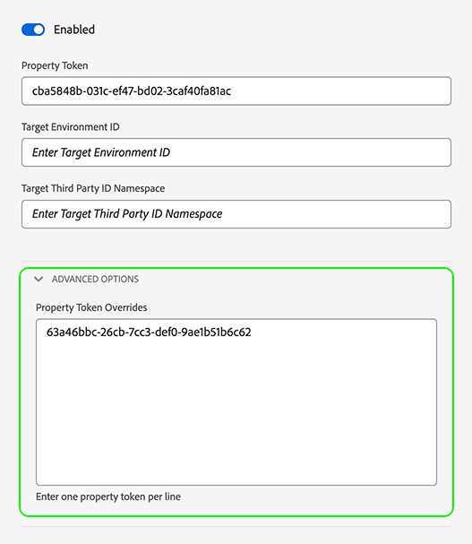

# Configurer les remplacements de trains de données

Utilisez les remplacements de train de données pour définir des configurations supplémentaires pour vos trains de données, qui sont transmises au [!DNL Edge Network] via le Web SDK ou le Mobile SDK.

Déclenchez différents comportements de flux de données sans créer de flux de données ni modifier vos paramètres existants.

Le remplacement de la configuration des trains de données est un processus en deux étapes :

1. Tout d’abord, vous devez définir le remplacement de votre configuration de train de données sur la page [configuration du train de données](/help/datastreams/configure.md).
2. Ensuite, vous devez envoyer les remplacements au [!DNL Edge Network] de l’une des manières suivantes :
   * Via les commandes `sendEvent` ou `configure` [Web SDK](#send-overrides).
   * Via le SDK Web [extension de balise](/help/tags/extensions/client/web-sdk/configure/configuration-overrides.md).
   * Via l’API Mobile SDK [sendEvent](#send-overrides) ou à l’aide de [Rules](#send-overrides).

Cet article décrit le processus de remplacement de configuration des trains de données de bout en bout pour chaque type de remplacement pris en charge.

>[!IMPORTANT]
>
>Les intégrations d’API [!DNL Edge Network] ne prennent actuellement pas en charge les remplacements de trains de données.
>
>Utilisez les remplacements de trains de données pour envoyer différentes données à différents trains de données. N’utilisez pas de remplacements de flux de données pour les cas d’utilisation de personnalisation ou les données de consentement.

## Cas d’utilisation {#use-cases}

Les cas d’utilisation suivants montrent comment et quand utiliser les remplacements de train de données.

### Collecte de données multi-région {#multi-region}

Une entreprise possède des sites web ou des sous-domaines distincts pour chaque pays dans lequel elle opère. Ils ont [configuré](/help/datastreams/configure.md) des flux de données distincts avec les suites de rapports spécifiques aux analyses correspondantes, les jetons de propriété de [!DNL Adobe Target] spécifiques au pays, les schémas spécifiques au pays, les jeux de données, les configurations de [!DNL Journey Optimizer], etc. L’entreprise dispose également d’un jeu global de configurations où toutes les données spécifiques à un pays sont agrégées.

Grâce aux remplacements de trains de données, l’entreprise peut acheminer dynamiquement le flux de données vers différents trains de données, au lieu du comportement par défaut consistant à envoyer des données à un train de données unique.

Un cas d’utilisation courant consiste à envoyer des données à un flux de données spécifique à un pays ainsi qu’à un flux de données global lorsque les clients effectuent une action importante, telle que passer une commande ou mettre à jour leur profil utilisateur.

### Différenciation des profils et des identités pour différentes unités opérationnelles {#multiple-business-units}

Une entreprise avec plusieurs unités opérationnelles souhaite utiliser plusieurs sandbox Experience Platform pour stocker des données spécifiques à chaque unité opérationnelle.

Au lieu d’envoyer les données à un train de données par défaut, l’entreprise peut utiliser les remplacements de trains de données pour s’assurer que chaque unité commerciale dispose de son propre train de données pour recevoir les données.

## Configurer les remplacements de trains de données dans l’interface utilisateur des trains de données {#configure-overrides}

Les remplacements de configuration de train de données vous permettent de modifier les configurations de train de données suivantes :

* Jeux de données d’événement Experience Platform
* Jetons de propriété [!DNL Adobe Target]
* Conteneurs de synchronisation d’identifiants Audience Manager
* [!DNL Adobe Analytics] des suites de rapports

### Remplacements de trains de données pour Adobe Target {#target-overrides}

Pour configurer les remplacements de train de données pour un train de données [!DNL Adobe Target], vous devez d’abord créer un train de données [!DNL Adobe Target]. Suivez la procédure pour [configurer un train de données](/help/datastreams/configure.md) avec le service [Adobe Target](/help/datastreams/configure.md#target).

Après avoir créé le flux de données, modifiez le service [](/help/datastreams/configure.md#target) que vous avez ajouté et utilisez la section **[!UICONTROL Property Token Overrides]** pour ajouter les remplacements de flux de données souhaités. Ajoutez un jeton de propriété par ligne.



Après avoir ajouté les remplacements souhaités, enregistrez les paramètres de votre flux de données.

Les remplacements de train de données [!DNL Adobe Target] sont maintenant configurés. Vous pouvez désormais [envoyer les remplacements au [!DNL Edge Network] via le SDK web ou le SDK mobile](#send-overrides).

### Remplacements de trains de données pour Adobe Analytics {#analytics-overrides}

Pour configurer les remplacements de train de données pour un train de données [!DNL Adobe Analytics], vous devez d’abord créer un train de données [Adobe Analytics](/help/datastreams/configure.md#analytics). Suivez la procédure pour [configurer un train de données](/help/datastreams/configure.md) avec le service [Adobe Analytics](/help/datastreams/configure.md#analytics).

Après avoir créé le flux de données, modifiez le service [](/help/datastreams/configure.md#analytics) que vous avez ajouté et utilisez la section **[!UICONTROL Report Suite Overrides]** pour ajouter les remplacements de flux de données souhaités.

Sélectionnez **[!UICONTROL Show Batch Mode]** pour activer la modification par lots des remplacements de suites de rapports. Vous pouvez copier et coller une liste de remplacements de suites de rapports. Saisissez une suite de rapports par ligne.


Après avoir ajouté les remplacements souhaités, enregistrez les paramètres de votre flux de données.

Les remplacements de train de données [!DNL Adobe Analytics] sont maintenant configurés. Vous pouvez désormais [envoyer les remplacements au [!DNL Edge Network] via le SDK web ou le SDK mobile](#send-overrides).

### Remplacements de trains de données pour les jeux de données d’événements Experience Platform {#event-dataset-overrides}

Pour configurer les remplacements de trains de données pour les jeux de données d’événements Experience Platform, vous devez d’abord créer un train de données [Adobe Experience Platform](/help/datastreams/configure.md#aep). Suivez la procédure pour [configurer un train de données](/help/datastreams/configure.md) avec le service [Adobe Experience Platform](/help/datastreams/configure.md#aep).

Après avoir créé le flux de données, modifiez le service [](/help/datastreams/configure.md#aep) que vous avez ajouté et sélectionnez l’option **[!UICONTROL Add Event Dataset]** pour ajouter un ou plusieurs jeux de données d’événement de remplacement.


Après avoir ajouté les remplacements souhaités, enregistrez les paramètres de votre flux de données.

Les remplacements de train de données [!DNL Adobe Experience Platform] sont maintenant configurés. Vous pouvez désormais [envoyer les remplacements au [!DNL Edge Network] via le SDK web ou le SDK mobile](#send-overrides).

### Remplacements de trains de données pour les conteneurs de synchronisation d’identifiants tiers {#container-overrides}

Avant de configurer les remplacements de trains de données pour les conteneurs de synchronisation d’identifiants tiers, vous devez créer un train de données. Pour ce faire, consultez la section [Configurer un train de données](/help/datastreams/configure.md).

Après avoir créé le flux de données, accédez à **[!UICONTROL Advanced Options]** et activez l’option **[!UICONTROL Third Party ID Sync]** .

Ensuite, utilisez la section **[!UICONTROL Container ID Overrides]** pour ajouter les identifiants de conteneur dont vous souhaitez remplacer le paramètre par défaut.

>[!IMPORTANT]
>
>Les identifiants de conteneur doivent contenir des valeurs numériques, comme `1234567`, et non des chaînes, telles que `"1234567"`. Si vous envoyez une valeur de chaîne via le SDK Web en tant que remplacement d’identifiant de conteneur, vous recevrez une erreur.


Après avoir ajouté les remplacements souhaités, enregistrez les paramètres de votre flux de données.

Les remplacements du conteneur de synchronisation des identifiants sont maintenant configurés. Vous pouvez désormais [envoyer les remplacements au [!DNL Edge Network] via le SDK web ou le SDK mobile](#send-overrides).

## Envoyer les remplacements à Edge Network {#send-overrides}

Après avoir configuré les remplacements de train de données dans l’interface utilisateur de collecte de données, vous pouvez envoyer les remplacements au [!DNL Edge Network] via le Web SDK ou Mobile SDK.

* **Web SDK** : voir [remplacements de configuration des trains de données](/help/collection/js/commands/configure/edgeconfigoverrides.md) pour obtenir des exemples de code de bibliothèque JavaScript.
* **Mobile SDK** : vous pouvez envoyer des remplacements d’ID de train de données à l’aide de l’API [sendEvent](https://developer.adobe.com/client-sdks/edge/edge-network/tutorials/send-overrides-sendevent/) ou à l’aide de [Rules](https://developer.adobe.com/client-sdks/edge/edge-network/tutorials/send-overrides-rules/).

## Exemple de payload {#payload-example}

Les exemples précédents génèrent une payload [!DNL Edge Network] similaire à celle ci-dessous.

```json
{
  "meta": {
    "configOverrides": {
      "com_adobe_experience_platform": {
        "datasets": {
          "event": {
            "datasetId": "SampleProfileDatasetIdOverride"
          }
        }
      },
      "com_adobe_analytics": {
        "reportSuites": [
        "MyFirstOverrideReportSuite",
        "MySecondOverrideReportSuite",
        "MyThirdOverrideReportSuite"
        ]
      },
      "com_adobe_identity": {
        "idSyncContainerId": "1234567"
      },
      "com_adobe_target": {
        "propertyToken": "63a46bbc-26cb-7cc3-def0-9ae1b51b6c62"
      }
    },
    "state": {  }
  },
  "events": [  ]
}
```
