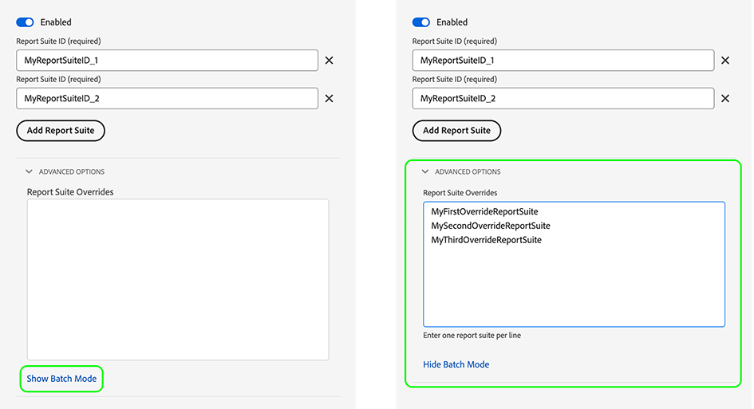

# Configurer les remplacements de train de données

Les remplacements de flux de données vous permettent de définir des configurations supplémentaires pour vos flux de données, qui sont transmises au réseau Edge via le SDK Web.

Vous pouvez ainsi déclencher différents comportements de flux de données par rapport aux comportements par défaut, sans créer de flux de données ni modifier vos paramètres existants.

Le remplacement de la configuration du flux de données est un processus en deux étapes :

1. Tout d’abord, vous devez définir vos remplacements de configuration de trains de données sur la page de [configuration des trains de données](configure.md).
2. Ensuite, vous devez envoyer les remplacements au réseau Edge par le biais d’une commande de SDK Web ou à l’aide de l’[extension de balise](../tags/extensions/client/web-sdk/web-sdk-extension-configuration.md) du SDK Web.

Cet article explique le processus de remplacement de la configuration de flux de données de bout en bout pour chaque type de remplacement pris en charge.

## Configuration des remplacements de flux de données dans l’interface utilisateur des flux de données {#configure-overrides}

Les remplacements de configuration des flux de données vous permettent de modifier les configurations de flux de données suivantes :

* Jeux de données d’événement Experience Platform
* Jetons de propriété Adobe Target
* Conteneurs de synchronisation des identifiants d’Audience Manager
* Suites de rapports Adobe Analytics

### Remplacements de flux de données pour Adobe Target {#target-overrides}

Pour configurer les remplacements de flux de données pour un flux de données Adobe Target, vous devez d’abord créer un flux de données Adobe Target. Suivez les instructions de la section [configuration d’un flux de données](configure.md) avec le [Adobe Target](configure.md#target) service.

Une fois que vous avez créé le flux de données, modifiez la variable [Adobe Target](configure.md#target) que vous avez ajouté et que vous utilisez **[!UICONTROL Remplacements de jetons de propriété]** pour ajouter les remplacements de la banque de données souhaitée, comme illustré dans l’image ci-dessous. Ajoutez un jeton de propriété par ligne.


Après avoir ajouté les remplacements souhaités, enregistrez vos paramètres de flux de données.

Vous devez maintenant configurer les remplacements de la banque de données Adobe Target. Maintenant, vous pouvez [envoyer les remplacements au réseau Edge via le SDK Web ;](#send-overrides).

### Remplacements de flux de données pour Adobe Analytics {#analytics-overrides}

Pour configurer les remplacements de flux de données pour un flux de données Adobe Analytics, vous devez d’abord disposer d’un [Adobe Analytics](configure.md#analytics) datastream créé. Suivez les instructions de la section [configuration d’un flux de données](configure.md) avec le [Adobe Analytics](configure.md#analytics) service.

Une fois que vous avez créé le flux de données, modifiez la variable [Adobe Analytics](configure.md#target) que vous avez ajouté et que vous utilisez **[!UICONTROL Remplacements de suites de rapports]** pour ajouter les remplacements de la banque de données souhaitée, comme illustré dans l’image ci-dessous.

Sélectionner **[!UICONTROL Afficher le mode batch]** pour activer la modification par lots des remplacements de suites de rapports. Vous pouvez copier et coller une liste de remplacements de suites de rapports, en entrant une suite de rapports par ligne.



Après avoir ajouté les remplacements souhaités, enregistrez vos paramètres de flux de données.

Vous devez maintenant configurer les remplacements de la banque de données Adobe Analytics. Maintenant, vous pouvez [envoyer les remplacements au réseau Edge via le SDK Web ;](#send-overrides).

### Remplacements de la chaîne de données pour les jeux de données d’événements Experience Platform {#event-dataset-overrides}

Pour configurer les remplacements de flux de données pour les jeux de données d’événements Experience Platform, vous devez d’abord disposer d’un [Adobe Experience Platform](configure.md#aep) datastream créé. Suivez les instructions de la section [configuration d’un flux de données](configure.md) avec le [Adobe Experience Platform](configure.md#aep) service.

Une fois que vous avez créé le flux de données, modifiez la variable [Adobe Experience Platform](configure.md#aep) service que vous avez ajouté et sélectionnez **[!UICONTROL Ajouter un jeu de données d’événement]** pour ajouter un ou plusieurs jeux de données d’événement de remplacement, comme illustré dans l’image ci-dessous.


Après avoir ajouté les remplacements souhaités, enregistrez vos paramètres de flux de données.

Vous devez maintenant configurer les remplacements de la banque de données Adobe Experience Platform. Maintenant, vous pouvez [envoyer les remplacements au réseau Edge via le SDK Web ;](#send-overrides).

### Remplacements de la chaîne de données pour les conteneurs de synchronisation d’identifiants tiers {#container-overrides}

Pour configurer les remplacements de flux de données pour les conteneurs de synchronisation d’identifiants tiers, vous devez d’abord créer un flux de données. Suivez les instructions de la section [configuration d’un flux de données](configure.md) pour en créer un.

Une fois que vous avez créé le flux de données, accédez à **[!UICONTROL Options avancées]** et activez la variable **[!UICONTROL Synchronisation des identifiants tiers]** .

Ensuite, utilisez le **[!UICONTROL Remplacements d’ID de conteneur]** pour ajouter les ID de conteneur que vous souhaitez remplacer par le paramètre par défaut, comme illustré dans l’image ci-dessous.

>[!IMPORTANT]
>
>Les identifiants de conteneur doivent être des valeurs numériques, comme `1234567`, et non des chaînes, telles que `"1234567"`. Si vous envoyez une valeur string via le SDK Web en tant que remplacement d’identifiant de conteneur, vous recevrez une erreur.


Après avoir ajouté les remplacements souhaités, enregistrez vos paramètres de flux de données.

Les remplacements du conteneur de synchronisation des identifiants doivent maintenant être configurés. Maintenant, vous pouvez [envoyer les remplacements au réseau Edge via le SDK Web ;](#send-overrides).

## Envoyer les remplacements au réseau Edge via le SDK Web {#send-overrides}

>[!NOTE]
>
>Au lieu d’envoyer les remplacements de configuration via les commandes du SDK Web, vous pouvez ajouter les remplacements de configuration au SDK Web. [extension de balise](../tags/extensions/client/web-sdk/web-sdk-extension-configuration.md).

Après [configuration des remplacements de la banque de données](#configure-overrides) Dans l’interface utilisateur de la collecte de données, vous pouvez désormais envoyer les remplacements au réseau Edge, via le SDK Web.

L’envoi des remplacements au réseau Edge via le SDK Web constitue la deuxième et dernière étape de l’activation des remplacements de configuration de la banque de données.

Les remplacements de configuration de la chaîne de données sont envoyés au réseau Edge par l’intermédiaire de la variable `edgeConfigOverrides` SDK Web, commande. Cette commande crée des remplacements de flux de données qui sont transmis au [!DNL Edge Network] dans la commande suivante, ou, dans le cas de la fonction `configure` pour chaque requête.

Le `edgeConfigOverrides` crée des remplacements de flux de données qui sont transmis au [!DNL Edge Network] sur la commande suivante, ou, dans le cas de `configure`, pour chaque requête.

Lorsqu’un remplacement de configuration est envoyé avec la variable `configure` , elle est incluse dans les commandes suivantes du SDK Web.

* [sendEvent](../edge/fundamentals/tracking-events.md)
* [setConsent](../edge/consent/iab-tcf/overview.md)
* [getIdentity](../edge/identity/overview.md)
* [appendIdentityToUrl](../edge/identity/id-sharing.md#cross-domain-sharing)
* [configure](../edge/fundamentals/configuring-the-sdk.md)

Les options spécifiées globalement peuvent être remplacées par l’option de configuration sur des commandes individuelles.

### L&#39;envoi de configurations remplace via le `sendEvent` command {#send-event}

L’exemple ci-dessous montre à quoi pourrait ressembler un remplacement de configuration sur une `sendEvent` .

```js {line-numbers="true" highlight="5-25"}
alloy("sendEvent", {
  xdm: {
    /* ... */
  },
  edgeConfigOverrides: {
    datastreamId: "{DATASTREAM_ID}"
    com_adobe_experience_platform: {
      datasets: {
        event: {
          datasetId: "MyOverrideDataset"
        },
        profile: {
          datasetId: "www"
        }
      }
    },
    com_adobe_analytics: {
      reportSuites: [
        "MyFirstOverrideReportSuite",
        "MySecondOverrideReportSuite",
        "MyThirdOverrideReportSuite"
        ]
    },
    com_adobe_identity: {
      idSyncContainerId: "1234567"
    },
    com_adobe_target: {
      propertyToken: "63a46bbc-26cb-7cc3-def0-9ae1b51b6c62"
    }
  }
});
```

| Paramètre | Description |
|---|---|
| `edgeConfigOverrides.datastreamId` | Utilisez ce paramètre pour permettre à une seule requête d’accéder à un flux de données différent de celui défini par la variable `configure` . |

### L&#39;envoi de configurations remplace via le `configure` command {#send-configure}

L’exemple ci-dessous montre à quoi pourrait ressembler un remplacement de configuration sur une `configure` .

```js {line-numbers="true" highlight="8-30"}
alloy("configure", {
  defaultConsent: "in",
  edgeDomain: "etc",
  edgeBasePath: "ee",
  datastreamId: "{DATASTREAM_ID}",
  orgId: "org",
  debugEnabled: true,
  edgeConfigOverrides: {
    "com_adobe_experience_platform": {
      "datasets": {
        "event": { 
          datasetId: "MyOverrideDataset"
        },
        "profile": { 
          datasetId: "www"
        }
      }
    },
    "com_adobe_analytics": {
      "reportSuites": [
        "MyFirstOverrideReportSuite",
        "MySecondOverrideReportSuite",
        "MyThirdOverrideReportSuite"
      ]
    },
    "com_adobe_identity": {
      "idSyncContainerId": "1234567"
    },
    "com_adobe_target": {
      "propertyToken": "63a46bbc-26cb-7cc3-def0-9ae1b51b6c62"
    }
  },
  onBeforeEventSend: function() { /* … */ });
};
```

### Exemple de payload {#payload-example}

Les exemples ci-dessus génèrent une [!DNL Edge Network] payload qui ressemble à ceci :

```json
{
  "meta": {
    "configOverrides": {
      "com_adobe_experience_platform": {
        "datasets": {
          "event": {
            "datasetId": "MyOverrideDataset"
          },
          "profile": {
            "datasetId": "www"
          }
        }
      },
      "com_adobe_analytics": {
        "reportSuites": [
        "MyFirstOverrideReportSuite",
        "MySecondOverrideReportSuite",
        "MyThirdOverrideReportSuite"
        ]
      },
      "com_adobe_identity": {
        "idSyncContainerId": "1234567"
      },
      "com_adobe_target": {
        "propertyToken": "63a46bbc-26cb-7cc3-def0-9ae1b51b6c62"
      }
    },
    "state": {  }
  },
  "events": [  ],
  "query": {
    "identity": {
      "fetch": [
        "ECID"
      ]
    }
  }
}
```
