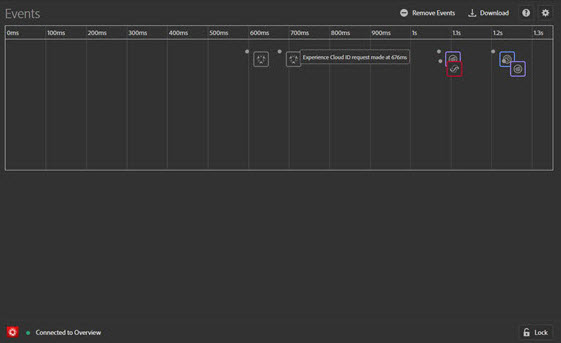
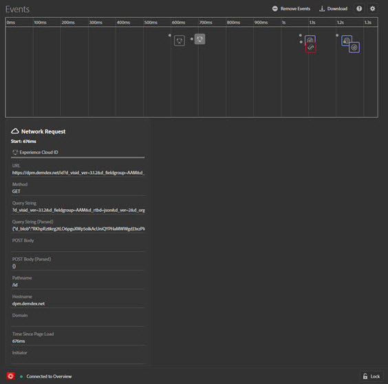
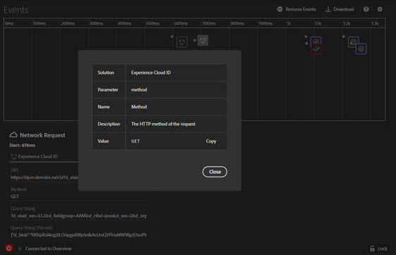
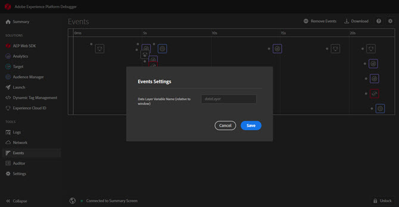

# Onglet Événements

L’onglet **Événements** fournit une vue graphique des événements qui se produisent, affichés sur un journal.

Pour chaque événement, l’icône correspondant à la solution concernée apparaît sur la chronologie. Les icônes montrent également les modifications apportées à la couche de données (si l’option est activée). Passez la souris sur une icône pour obtenir un résumé de l’événement. Sélectionnez sur l’événement pour plus d’informations. Pour afficher plusieurs événements, utilisez la combinaison de touches Maj+Sélection ou Ctrl+Sélection.

Sélectionnez sur un détail pour plus d’informations.

## Suivi des modifications apportées à la couche de données

Pour activer le suivi des modifications apportées à la couche de données dans la chronologie :

1. Sélectionnez l’icône Engrenage en haut à droite.
1. Entrez le nom de la couche de données.

   

1. Sélectionnez **[!UICONTROL Save]**.

Les détails des modifications apportées à la couche de données indiquent tout élément qui a été supprimé ou ajouté. Vous pouvez sélectionner **{}** pour approfondir l’examen de la couche de données.

## Téléchargement des informations sur l’événement

Sélectionnez **[!UICONTROL Download]** pour télécharger un fichier Excel affichant des informations sur vos appels de page.
