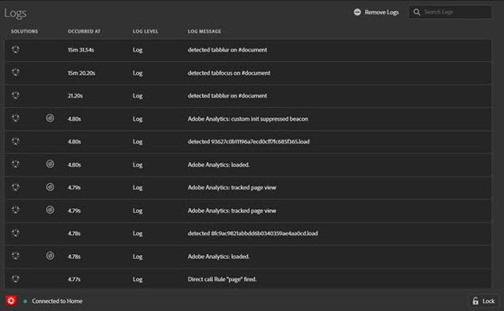

# Onglet Journaux

L’onglet **Logs** fournit des informations spécifiques aux balises et aux implémentations de Adobe Experience Platform Web SDK. Vous pouvez filtrer par solutions mises en œuvre via leurs outils associés.

L’onglet Journaux affiche des informations dans quatre colonnes :

**[!UICONTROL Solutions] :** affiche les icônes de la solution Experience Cloud affectée par l’élément journalisé. Placez le pointeur sur l’icône pour obtenir une description textuelle.

**[!UICONTROL Occurred at] :** indique le moment où le problème journalisé s’est produit pendant la session.

**[!UICONTROL Log level] :** affiche la gravité du problème. La gravité est l’un des niveaux suivants :

* Journal
* Infos
* Avertissements
* Erreurs

**[!UICONTROL Log message] :** décrit le problème.

Certains messages du journal disposent d’une option Afficher le code. Sélectionnez **[!UICONTROL Show Code]** pour afficher le code conditionnel qui détermine si une règle doit se déclencher.

Pour effacer le journal, sélectionnez **[!UICONTROL Remove Logs]**.
