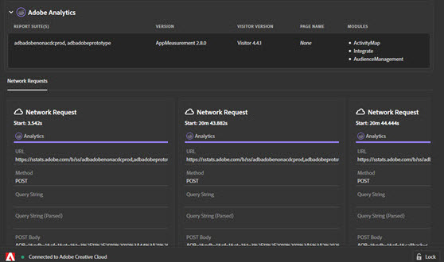

# Onglet Réseau

L’onglet **Réseau** agrège tous les appels de solution Adobe Experience Cloud effectués sur la page et les affiche dans l’ordre de gauche à droite. Les paramètres standard sont automatiquement étiquetés avec des noms conviviaux et organisés pour regrouper des paramètres communs sur le même rôle.

Cet écran est utile pour comparer des paires clé-valeur entre les accès. Vous pouvez confirmer que les paramètres utilisés pour les intégrations, tels que l’identifiant visiteur Experience Cloud ou l’ID de données supplémentaires, sont cohérents entre les intégrations.

>[!NOTE]
>
>Actuellement, tous les paramètres transmis dans les appels de solution (par exemple, les variables contextuelles Analytics, les paramètres personnalisés Target ou les ID de client du service Experience Cloud ID) ne sont pas visibles dans l’écran Réseau.

Pour modifier les informations par solution, sélectionnez la solution que vous souhaitez afficher depuis la liste dans le volet de navigation de gauche. L’exemple suivant est filtré pour n’afficher qu’Analytics :

Pour revenir à l’affichage de toutes les solutions, sélectionnez **[!UICONTROL Réseau]**

Sélectionnez un élément dans la vue Réseau pour afficher une vue développée. Vous pouvez copier les informations affichées dans le Presse-papiers à partir de la fenêtre d’affichage agrandie.

<!--
Use the icon at the top of each column to copy the server call URL to your clipboard, where you can paste it into another document for reference or debugging purposes.

-->

Pour effacer la liste, sélectionnez **[!UICONTROL Supprimer les événements]**.

Pour télécharger un fichier Excel contenant les informations affichées sur cet écran, sélectionnez **[!UICONTROL Télécharger]**.
