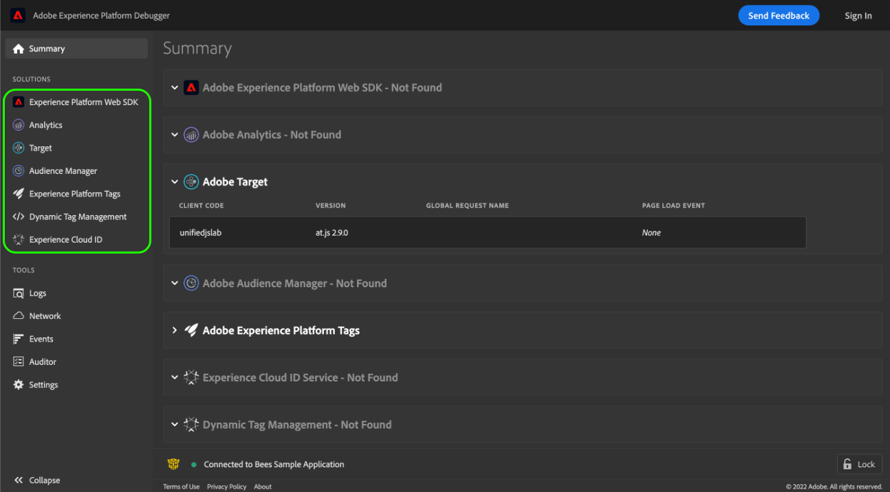

# Solutions

Adobe Experience Platform Debugger fournit une liste de **Solutions** dans le volet de navigation de gauche. Sélectionnez une solution pour afficher les résultats pour les technologies spécifiques Adobe Experience Cloud.

## SDK web Adobe Experience Platform {#aep}

L’écran SDK Web Adobe Experience Platform contient des informations sur le SDK Web Adobe Experience Platform. Sélectionnez **[!UICONTROL Configure]** pour activer ou désactiver la connexion à la console.

## [!UICONTROL Analytics] {#section-f71dfcc22bb44c86bec328491606a482}

L’onglet [!UICONTROL Analytics] fournit des informations sur votre [implémentation d’Adobe Analytics](https://experienceleague.adobe.com/docs/analytics/implementation/home.html?lang=fr).

## [!UICONTROL Target] {#section-988873ba5ede4317953193bd7ac5474c}

Utilisez l’écran [!UICONTROL Target] pour afficher les requêtes [Adobe Target](https://experienceleague.adobe.com/docs/target/using/target-home.html?lang=fr) ou les détails de réponse [mboxTrace](https://experienceleague.adobe.com/docs/target/using/activities/troubleshoot-activities/content-trouble.html?lang=fr#section_256FCF7C14BB435BA2C68049EF0BA99E).

Pour plus d’informations, consultez le guide [Utilisation de Debugger pour les implémentations de Target](./target.md).

## [!UICONTROL Audience Manager] {#section-1d4484f8b46f457f859ba88039a9a585}

Utilisez l’onglet [[!UICONTROL Audience Manager]](https://experienceleague.adobe.com/docs/audience-manager/user-guide/aam-home.html?lang=fr) pour afficher les détails des [événements](https://experienceleague.adobe.com/docs/audience-manager/user-guide/api-and-sdk-code/dcs/dcs-event-calls/dcs-event-calls.html?lang=fr) dans Adobe Audience Manager. Sélectionnez l’organisation pour l’élargir et afficher les informations.

## [!UICONTROL Adobe Experience Platform Tags] {#section-ee80a9c509f2462c89c1e5bd8d05d7c8}

Utilisez la section [!UICONTROL Adobe Experience Platform Tags] pour afficher les requêtes de balises. Vous pouvez également sélectionner **[!UICONTROL Configuration]** pour configurer les [codes incorporés](../../tags/ui/publishing/environments.md#embed-code). Vous pouvez modifier, remplacer ou ajouter d’autres codes intégrés depuis Experience Platform Debugger. Si vous vous connectez, vous pouvez sélectionner une propriété alternative à l’aide des listes déroulantes.

## [!UICONTROL Experience Cloud ID] {#section-a96c32f8e63a4991abb296f6e8ea01cf}

Utilisez l’onglet [!UICONTROL Experience Cloud ID] pour afficher les demandes du service [Experience Cloud ID](https://experienceleague.adobe.com/docs/id-service/using/home.html?lang=fr).

## [!UICONTROL Dynamic Tag Management]

Si vous avez précédemment implémenté l’ancienne version des balises dans Experience Platform (appelée [!DNL Dynamic Tag Management (DTM)]), vous pouvez utiliser cet onglet pour configurer vos codes intégrés et afficher les détails des requêtes sur le réseau.
