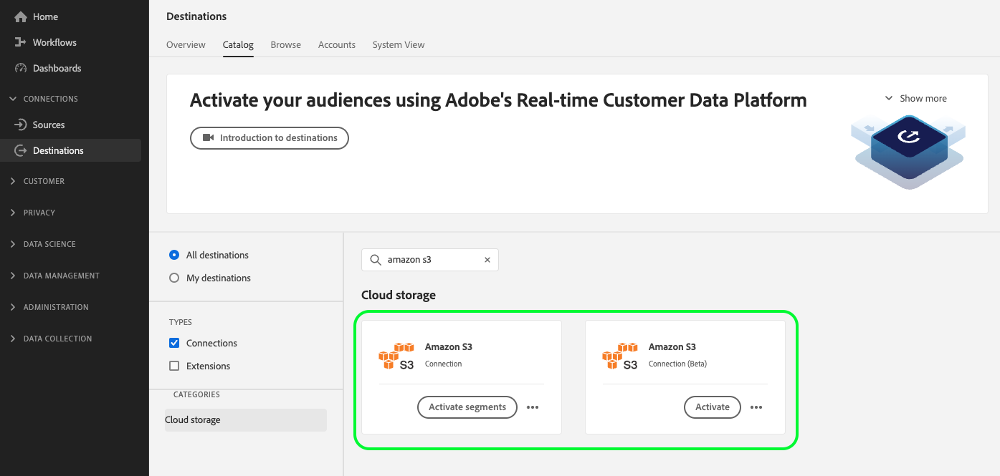

# Guide de migration des API pour les destinations de stockage dans le cloud

>[!IMPORTANT]
>
>* La fonctionnalité décrite sur cette page est disponible pour les clients qui ont acheté les packages Real-Time CDP Prime et Ultimate. Contactez votre représentant ou représentante Adobe pour plus d’informations.

## Contexte de migration {#migration-context}

À compter d’[octobre 2022](/help/release-notes/2022/october-2022.md#new-or-updated-destinations), vous pouvez utiliser les nouvelles fonctionnalités d’exportation de fichiers pour accéder à une fonctionnalité de personnalisation améliorée lors de l’exportation de fichiers en dehors d’Experience Platform :

* [Options de dénomination de fichier](/help/destinations/ui/activate-batch-profile-destinations.md#file-names) supplémentaires.
* Possibilité de définir des en-têtes de fichier personnalisés dans vos fichiers exportés via la [nouvelle étape de mappage](/help/destinations/ui/activate-batch-profile-destinations.md#mapping).
* Possibilité de sélectionner le [&#x200B; type de fichier &#x200B;](/help/destinations/ui/connect-destination.md#file-formatting-and-compression-options) fichier exporté.
* Possibilité de [personnaliser le formatage des fichiers de données CSV exportés](/help/destinations/ui/batch-destinations-file-formatting-options.md).

Cette fonctionnalité est prise en charge par les cartes de stockage cloud Beta répertoriées ci-dessous :

* [[!DNL (Beta) Amazon S3]](../../destinations/catalog/cloud-storage/amazon-s3.md#changelog)
* [[!DNL (Beta) Azure Blob]](../../destinations/catalog/cloud-storage/azure-blob.md#changelog)
* [[!DNL (Beta) SFTP]](../../destinations/catalog/cloud-storage/sftp.md#changelog)

<!--

Commenting out the three net new cloud storage destinations

* [[!DNL (Beta) Azure Data Lake Storage Gen2]](../../destinations/catalog/cloud-storage/adls-gen2.md)
* [[!DNL (Beta) Data Landing Zone]](../../destinations/catalog/cloud-storage/data-landing-zone.md)
* [[!DNL (Beta) Google Cloud Storage]](../../destinations/catalog/cloud-storage/google-cloud-storage.md)

-->

Notez que l’interface utilisateur d’Experience Platform affiche actuellement deux cartes de destination côte à côte pour les trois destinations. Vous trouverez ci-dessous les [!DNL Amazon S3] destinations héritées et nouvelles. Dans tous les cas, les cartes marquées de **Beta** sont les nouvelles cartes de destination.



Alors que ces destinations avec des fonctionnalités améliorées étaient initialement proposées en version bêta, *Adobe déplace désormais tous les clients Real-Time CDP vers les nouvelles destinations d’espace de stockage*. Pour les clients qui utilisaient déjà [!DNL Amazon S3], [!DNL Azure Blob] ou SFTP, cela signifie que les flux de données existants seront migrés vers les nouvelles cartes. Lisez la suite pour plus d’informations sur les modifications spécifiques dans le cadre de la migration.

## À qui s’applique cette page {#who-this-applies-to}

Si vous utilisez déjà l’[API Flow Service](https://developer.adobe.com/experience-platform-apis/references/destinations/) pour exporter des profils vers les destinations d’espace de stockage dans le cloud Amazon S3, Azure Blob ou SFTP, ce guide de migration de l’API s’applique à vous.

Si des scripts sont en cours d’exécution à vos emplacements d’espace de stockage cloud [!DNL Amazon S3], [!DNL Azure Blob] ou SFTP au-dessus des fichiers exportés depuis Experience Platform, sachez que certains paramètres changent en ce qui concerne les spécifications de connexion et de flux des nouvelles cartes, ainsi qu’en ce qui concerne l’étape de mappage.

Par exemple, si vous utilisiez un script pour filtrer les flux de données de destination vers la destination [!DNL Amazon S3], en fonction de la spécification de connexion de la destination [!DNL Amazon S3], sachez que la spécification de connexion changera. Vous devrez donc mettre à jour vos filtres.

## Liens vers la documentation pertinente {#relevant-documentation-links}

Cette section comprend le tutoriel d’API approprié et la documentation de référence pour la fonctionnalité améliorée d’exportation de données vers des destinations d’espace de stockage.

<!--

TBD if we keep this link but will likely remove it

[Legacy API tutorial to export data to cloud storage destinations](/help/destinations/api/connect-activate-batch-destinations.md) (outdated, do not use anymore)

-->
* [Tutoriel sur l’API pour exporter des audiences vers des destinations d’espace de stockage](/help/destinations/api/activate-segments-file-based-destinations.md)
* [Documentation de référence de l’API de service de flux Destinations](https://developer.adobe.com/experience-platform-apis/references/destinations/)

## Résumé des modifications non rétrocompatibles {#summary-backwards-incompatible-changes}

Avec la migration vers les nouvelles destinations, tous vos flux de données existants vers les destinations [!DNL Amazon S3], [!DNL Azure Blob] et SFTP se verront désormais attribuer de nouvelles connexions cibles et des connexions de base. L’étape de mappage des profils change également. Les modifications non rétrocompatibles sont résumées dans les sections ci-dessous pour chaque destination. Consultez également le [glossaire des destinations](https://developer.adobe.com/experience-platform-apis/references/destinations/#tag/Glossary) pour plus d’informations sur les termes du diagramme ci-dessous.


### Modifications non rétrocompatibles apportées à la destination [!DNL Amazon S3] {#changes-amazon-s3-destination}

Les modifications non rétrocompatibles pour les utilisateurs de l’API sont une `connection spec ID` et une `flow spec ID` mises à jour, comme illustré dans le tableau ci-dessous :

| [!DNL Amazon S3] | Hérité | Nouveau |
|---------|----------|---------|
| Spécification de flux | 71471eba-b620-49e4-90fd-23f1fa0174d8 | 1a0514a6-33d4-4c7f-aff8-594799c47549 |
| Spécification de connexion | 4890fc95-5a1f-4983-94bb-e060c08e3f81 | 4fce964d-3f37-408f-9778-e597338a21ee |

Affichez l’ensemble des exemples de connexion de base et de connexion cible hérités et nouveaux pour [!DNL Amazon S3] dans les onglets ci-dessous. Les paramètres requis pour créer des connexions de base pour des destinations [!DNL Amazon S3] ne changent pas.

De même, il n’existe aucune modification non rétrocompatible dans les paramètres requis pour créer des connexions cibles.

>[!BEGINTABS]

>[!TAB Connexion de base héritée et connexion cible]

+++Afficher les [!DNL base connection] hérités pour [!DNL Amazon S3]

```json {line-numbers="true" start-line="1" highlight="5"}
{
  ...
  "name": "amazon-s3",
  "connectionSpec": {
    "id": "4890fc95-5a1f-4983-94bb-e060c08e3f81",
    "version": "1.0"
  },
  "state": "enabled",
  "auth": {
    "specName": "Access Key",
    "params": {
      "authorizedDate": "2022-10-26",
      "s3SecretKey": "<your-secret-key>",
      "s3AccessKey": "<your-access-key>"
    }
  },
  "encryption": {
    "specName": "File Encryption",
    "params": {
      "encryptionAlgo": "PGP/GPG",
      "publicKey": "<publicKey>"
    }
  },
  "version": "\"640418e2-0000-0200-0000-6359b9ef0000\"",
  "etag": "\"640418e2-0000-0200-0000-6359b9ef0000\""
}
```

+++

+++Afficher les [!DNL target connection] hérités pour [!DNL Amazon S3]

```json {line-numbers="true" start-line="1" highlight="12"}
{
  ...
  "name": "test 121",
  "baseConnectionId": "ee86d122-10d3-434b-81c7-7252e4d747a7",
  "state": "enabled",
  "data": {
    "format": "CSV",
    "schema": null,
    "properties": null
  },
  "connectionSpec": {
    "id": "4890fc95-5a1f-4983-94bb-e060c08e3f81",
    "version": "1.0"
  },
  "params": {
    "mode": "S3",
    "path": "testpath",
    "bucketName": "test"
  },
  "version": "\"1609cd86-0000-0200-0000-63892cbb0000\"",
  "etag": "\"1609cd86-0000-0200-0000-63892cbb0000\"",
  "inheritedAttributes": {
    "baseConnection": {
      "id": "ee86d122-10d3-434b-81c7-7252e4d747a7",
      "connectionSpec": {
        "id": "4890fc95-5a1f-4983-94bb-e060c08e3f81",
        "version": "1.0"
      }
    }
  }
}
```

+++

>[!TAB Nouvelle connexion de base et connexion cible]

+++Afficher les nouvelles [!DNL base connection] pour [!DNL Amazon S3]

```json {line-numbers="true" start-line="1" highlight="5"}
{
  ...
  "name": "Amazon S3",
  "connectionSpec": {
    "id": "4fce964d-3f37-408f-9778-e597338a21ee",
    "version": "1.0"
  },
  "state": "enabled",
  "auth": {
    "specName": "Access Key",
    "params": {
      "authorizedDate": "2022-10-26",
      "s3SecretKey": "<your-secret-key>",
      "s3AccessKey": "<your-access-key>"
    }
  },
  "encryption": {
    "specName": "File Encryption",
    "params": {
      "encryptionAlgo": "PGP/GPG",
      "publicKey": "<publicKey>"
    }
  },
  "version": "\"3708da21-0000-0200-0000-638940b10000\"",
  "etag": "\"3708da21-0000-0200-0000-638940b10000\""
}
```

+++

+++Afficher les nouvelles [!DNL target connection] pour [!DNL Amazon S3]

```json {line-numbers="true" start-line="1" highlight="12, 16-27"}
{
  ...
  "name": "test 121",
  "baseConnectionId": "d114c86f-fd47-4bb6-846c-cb1d15a00fe9",
  "state": "enabled",
  "data": {
    "format": "CSV",
    "schema": null,
    "properties": null
  },
  "connectionSpec": {
    "id": "4fce964d-3f37-408f-9778-e597338a21ee",
    "version": "1.0"
  },
  "params": {
    "csvOptions": {
      "nullValue": "null",
      "emptyValue": "",
      "escape": "\\",
      "quote": "",
      "delimiter": ","
    },
    "compression": "NONE",
    "fileType": "CSV",
    "mode": "Server-to-server",
    "path": "testpath",
    "bucketName": "test"
  },
  "version": "\"1b0985c6-0000-0200-0000-638940b10000\"",
  "etag": "\"1b0985c6-0000-0200-0000-638940b10000\"",
  "inheritedAttributes": {
    "baseConnection": {
      "id": "d114c86f-fd47-4bb6-846c-cb1d15a00fe9",
      "connectionSpec": {
        "id": "4fce964d-3f37-408f-9778-e597338a21ee",
        "version": "1.0"
      }
    }
  }
}
```

+++

>[!ENDTABS]

### Modifications non rétrocompatibles apportées à [!DNL Azure Blob] destination {#changes-azure-blob-destination}

Les modifications non rétrocompatibles pour les utilisateurs de l’API sont une `connection spec ID` et une `flow spec ID` mises à jour, comme illustré dans le tableau ci-dessous :

| [!DNL Azure Blob] | Hérité | Nouveau |
|---------|----------|---------|
| Spécification de flux | 71471eba-b620-49e4-90fd-23f1fa0174d8 | 752d422f-b16f-4f0d-b1c6-26e448e3b388 |
| Spécification de connexion | e258278b-a4cf-43ac-b158-4fa0ca0d948b | 6d6b59bf-fb58-4107-9064-4d246c0e5bb2 |

Affichez l’ensemble des exemples de connexion de base et de connexion cible hérités et nouveaux pour [!DNL Azure Blob] dans les onglets ci-dessous. Les paramètres requis pour créer des connexions de base pour les destinations Azure Blob ne changent pas.

De même, il n’existe aucune modification non rétrocompatible dans les paramètres requis pour créer des connexions cibles.

>[!BEGINTABS]

>[!TAB Connexion de base héritée et connexion cible]

+++Afficher les [!DNL base connection] hérités pour [!DNL Azure Blob]

```json {line-numbers="true" start-line="1" highlight="5"}
{
  ...
  "name": "azure-blob",
  "connectionSpec": {
    "id": "e258278b-a4cf-43ac-b158-4fa0ca0d948b",
    "version": "1.0"
  },
  "state": "enabled",
  "auth": {
    "specName": "ConnectionString",
    "params": {
      "authorizedDate": "2022-06-02",
      "connectionString": "<your-connection-string>"
    }
  },
  "encryption": {
    "specName": "File Encryption",
    "params": {
      "encryptionAlgo": "PGP/GPG",
      "publicKey": "<publicKey>"
    }
  }, 
  "version": "\"d000d23c-0000-0200-0000-6299051c0000\"",
  "etag": "\"d000d23c-0000-0200-0000-6299051c0000\""
}
```

+++

+++Afficher les [!DNL target connection] hérités pour [!DNL Azure Blob]

```json {line-numbers="true" start-line="1" highlight="13"}
{
  ...
  "name": "v1",
  "description": "v2",
  "baseConnectionId": "d10fcecf-9963-4062-820c-0f878be98805",
  "state": "enabled",
  "data": {
    "format": "CSV",
    "schema": null,
    "properties": null
  },
  "connectionSpec": {
    "id": "e258278b-a4cf-43ac-b158-4fa0ca0d948b",
    "version": "1.0"
  },
  "params": {
    "mode": "AZURE_BLOB",
    "container": "usdasda",
    "path": "v3"
  },
  "version": "\"cb0468ba-0000-0200-0000-631ab0790000\"",
  "etag": "\"cb0468ba-0000-0200-0000-631ab0790000\"",
  "inheritedAttributes": {
    "baseConnection": {
      "id": "d10fcecf-9963-4062-820c-0f878be98805",
      "connectionSpec": {
        "id": "e258278b-a4cf-43ac-b158-4fa0ca0d948b",
        "version": "1.0"
      }
    }
  }
}
```

+++

>[!TAB Nouvelle connexion de base et connexion cible]

+++Afficher les nouvelles [!DNL base connection] pour [!DNL Azure Blob]

```json {line-numbers="true" start-line="1" highlight="5"}
{
  ...
  "name": "Azure Blob Storage",
  "connectionSpec": {
    "id": "6d6b59bf-fb58-4107-9064-4d246c0e5bb2",
    "version": "1.0"
  },
  "state": "enabled",
  "auth": {
    "specName": "ConnectionString",
    "params": {
      "authorizedDate": "2022-06-02",      
      "connectionString": "<your-connection-string>"
    }
  },
  "encryption": {
    "specName": "File Encryption",
    "params": {
      "encryptionAlgo": "PGP/GPG",
      "publicKey": "<publicKey>"
    }
  },
  "version": "\"4008a892-0000-0200-0000-6389890d0000\"",
  "etag": "\"4008a892-0000-0200-0000-6389890d0000\""
}
```

+++

+++Afficher les nouvelles [!DNL target connection] pour [!DNL Azure Blob]

```json {line-numbers="true" start-line="1" highlight="13, 17-25"}
{
  ...
  "name": "v1",
  "description": "v2",
  "baseConnectionId": "1329d183-a3ee-4454-ab3f-e2388082bf29",
  "state": "enabled",
  "data": {
    "format": "CSV",
    "schema": null,
    "properties": null
  },
  "connectionSpec": {
    "id": "6d6b59bf-fb58-4107-9064-4d246c0e5bb2",
    "version": "1.0"
  },
  "params": {
    "csvOptions": {
      "nullValue": "null",
      "emptyValue": "",
      "escape": "\\",
      "quote": "",
      "delimiter": ","
    },
    "compression": "NONE",
    "fileType": "CSV",
    "mode": "Server-to-server",
    "container": "usdasda",
    "path": "v3"
  },
  "version": "\"5509fe3f-0000-0200-0000-638a28880000\"",
  "etag": "\"5509fe3f-0000-0200-0000-638a28880000\"",
  "inheritedAttributes": {
    "baseConnection": {
      "id": "1329d183-a3ee-4454-ab3f-e2388082bf29",
      "connectionSpec": {
        "id": "6d6b59bf-fb58-4107-9064-4d246c0e5bb2",
        "version": "1.0"
      }
    }
  }
}
```

+++

>[!ENDTABS]

### Modifications non rétrocompatibles apportées à la destination SFTP {#changes-sftp-destination}

Les modifications non rétrocompatibles pour les utilisateurs de l’API sont une `connection spec ID` et une `flow spec ID` mises à jour, comme illustré dans le tableau ci-dessous :

| SFTP | Hérité | Nouveau |
|---------|----------|---------|
| Spécification de flux | 71471eba-b620-49e4-90fd-23f1fa0174d8 | fd36aaa4-bf2b-43fb-9387-43785eeeb799 |
| Spécification de connexion | 64ef4b8b-a6e0-41b5-9677-3805d1ee5dd0 | 36965a81-b1c6-401b-99f8-22508f1e6a26 |

Outre la mise à jour de la spécification de flux et de connexion ci-dessus, les paramètres requis lors de la création de connexions de base SFTP ont été modifiés.

* Auparavant, la connexion de base pour les destinations SFTP nécessitait un paramètre `host`. Ce paramètre a été renommé `domain`.

Affichez l’ensemble des exemples de connexion de base et de connexion cible et hérités et nouveaux pour SFTP dans les onglets ci-dessous, avec les lignes qui changent en surbrillance. Les paramètres requis pour créer des connexions cibles pour les destinations SFTP ne changent pas.

>[!BEGINTABS]

>[!TAB Connexion de base héritée et connexion cible]

+++Affichage des [!DNL base connection] hérités pour SFTP : authentification par mot de passe

```json {line-numbers="true" start-line="1" highlight="5,15"}
{
  ...
  "name": "sftp",
  "connectionSpec": {
    "id": "64ef4b8b-a6e0-41b5-9677-3805d1ee5dd0",
    "version": "1.0"
  },
  "state": "enabled",
  "auth": {
    "specName": "Basic Authentication for sftp",
    "params": {
      "authorizedDate": "2022-06-02",
      "password": "<your-password>",
      "userName": "DPID12345",
      "host": "ftp-out.demdex.com"
    }
  },
  "encryption": {
    "specName": "File Encryption",
    "params": {
      "encryptionAlgo": "PGP/GPG",
      "publicKey": "<publicKey>"
    }
  },
  "version": "\"d000013c-0000-0200-0000-629903bd0000\"",
  "etag": "\"d000013c-0000-0200-0000-629903bd0000\""
}
```

+++

+++Afficher les [!DNL base connection] hérités pour l’authentification [!DNL SFTP - SSH key]

```json {line-numbers="true" start-line="1" highlight="5,15"}
{
  ...
  "name": "sftp",
  "connectionSpec": {
    "id": "64ef4b8b-a6e0-41b5-9677-3805d1ee5dd0",
    "version": "1.0"
  },
  "state": "enabled",
  "auth": {
    "specName": "Basic Authentication for sftp",
    "params": {
      "authorizedDate": "2022-06-02",
      "sshKey": "<your-ssh-key>",
      "userName": "DPID12345",
      "port": 22
      "domain": "ftp-out.demdex.com"
    }
  },
  "encryption": {
    "specName": "File Encryption",
    "params": {
      "encryptionAlgo": "PGP/GPG",
      "publicKey": "<publicKey>"
    }
  },
  "version": "\"d000013c-0000-0200-0000-629903bd0000\"",
  "etag": "\"d000013c-0000-0200-0000-629903bd0000\""
}
```

+++

+++Affichage des [!DNL target connection] hérités pour le protocole SFTP

```json {line-numbers="true" start-line="1" highlight="13"}
{
  ...
  "name": "test sftp 6/2",
  "description": "",
  "baseConnectionId": "e6f3a300-0bf7-4755-b7f8-308dc2a99133",
  "state": "enabled",
  "data": {
    "format": "CSV",
    "schema": null,
    "properties": null
  },
  "connectionSpec": {
    "id": "64ef4b8b-a6e0-41b5-9677-3805d1ee5dd0",
    "version": "1.0"
  },
  "params": {
    "mode": "FTP",
    "remotePath": "test"
  },
  "version": "\"8503ab91-0000-0200-0000-629903ce0000\"",
  "etag": "\"8503ab91-0000-0200-0000-629903ce0000\"",
  "inheritedAttributes": {
    "baseConnection": {
      "id": "e6f3a300-0bf7-4755-b7f8-308dc2a99133",
      "connectionSpec": {
        "id": "64ef4b8b-a6e0-41b5-9677-3805d1ee5dd0",
        "version": "1.0"
      }
    }
  }
}
```

+++

>[!TAB Nouvelle connexion de base et connexion cible]

+++Afficher les nouvelles [!DNL base connection] pour [!DNL SFTP - password authentication]

```json {line-numbers="true" start-line="1" highlight="5"}
{
  ...
  "name": "SFTP",
  "connectionSpec": {
    "id": "36965a81-b1c6-401b-99f8-22508f1e6a26",
    "version": "1.0"
  },
  "state": "enabled",
  "auth": {
    "specName": "SFTP with Password",
    "params": {
      "authorizedDate": "2022-06-02",
      "domain": "ftp-out.demdex.com",
      "username": "DPID12345",
      "password": "<your-password>",
      "port": 22      
    }
  },
  "encryption": {
    "specName": "File Encryption",
    "params": {
      "encryptionAlgo": "PGP/GPG",
      "publicKey": "<publicKey>"
    }
  },
  "version": "\"420826cc-0000-0200-0000-638999a60000\"",
  "etag": "\"420826cc-0000-0200-0000-638999a60000\""
}
```

+++

+++Afficher de nouvelles [!DNL base connection] pour l’authentification [!DNL SFTP - SSH key]

```json {line-numbers="true" start-line="1" highlight="5,12"}
{
  ...
  "name": "SFTP",
  "connectionSpec": {
    "id": "36965a81-b1c6-401b-99f8-22508f1e6a26",
    "version": "1.0"
  },
  "state": "enabled",
  "auth": {
    "specName": "Basic Authentication for sftp",
    "params": {
      "authorizedDate": "2022-06-02",
      "domain": "ftp-out.demdex.com",
      "username": "DPID12345",
      "sshKey": "<your-ssh-key>",
    }
  },
  "encryption": {
    "specName": "File Encryption",
    "params": {
      "encryptionAlgo": "PGP/GPG",
      "publicKey": "<publicKey>"
    }
  },
  "version": "\"420826cc-0000-0200-0000-638999a60000\"",
  "etag": "\"420826cc-0000-0200-0000-638999a60000\""
}
```

+++

+++Affichage des nouvelles [!DNL target connection] pour le protocole SFTP

```json {line-numbers="true" start-line="1" highlight="13, 17-25"}
{
  ...
  "name": "test sftp 6/2",
  "description": "",
  "baseConnectionId": "af63fbe1-45ff-4722-a9de-fbbe789dc7b0",
  "state": "enabled",
  "data": {
    "format": "CSV",
    "schema": null,
    "properties": null
  },
  "connectionSpec": {
    "id": "36965a81-b1c6-401b-99f8-22508f1e6a26",
    "version": "1.0"
  },
  "params": {
    "csvOptions": {
      "nullValue": "null",
      "emptyValue": "",
      "escape": "\\",
      "quote": "",
      "delimiter": ","
    },
    "compression": "NONE",
    "fileType": "CSV",
    "mode": "FTP",
    "remotePath": "test"
  },
  "version": "\"5509b5cf-0000-0200-0000-638a2ab60000\"",
  "etag": "\"5509b5cf-0000-0200-0000-638a2ab60000\"",
  "inheritedAttributes": {
    "baseConnection": {
      "id": "af63fbe1-45ff-4722-a9de-fbbe789dc7b0",
      "connectionSpec": {
        "id": "36965a81-b1c6-401b-99f8-22508f1e6a26",
        "version": "1.0"
      }
    }
  }
}
```

+++

>[!ENDTABS]

### Modifications non rétrocompatibles communes aux destinations [!DNL Amazon S3], [!DNL Azure Blob] et SFTP {#changes-all-destinations}

L’étape du sélecteur de profil dans les trois destinations est remplacée par une étape de mappage qui vous permet de renommer les en-têtes de colonne dans vos fichiers exportés, si vous le souhaitez. Consultez l’image côte à côte ci-dessous avec l’ancienne étape de sélecteur d’attributs sur la gauche et la nouvelle étape de mappage sur la droite.


Notez comment l’objet `profileSelectors` dans les exemples hérités est remplacé par le nouvel objet `profileMapping`.

Obtenez des informations complètes sur la configuration de l’objet `profileMapping` dans le tutoriel [API pour exporter des données vers des destinations d’espace de stockage](/help/destinations/api/activate-segments-file-based-destinations.md#attribute-and-identity-mapping).

>[!BEGINTABS]

>[!TAB Anciens paramètres de transformation]

+++Exemple d’anciens paramètres de transformation

```json{line-numbers="true" start-line="1" highlight="4-40, 45-53"}
{
  "segmentSelectors": { // shortened for brevity since nothing changes in the audience selectors
  },  
  "profileSelectors": {
    "selectors": [
      {
        "type": "JSON_PATH",
        "value": {
          "path": "CORE",
          "operator": "EXISTS",
          "mapping": {
            "sourceType": "text/x.schema-path",
            "source": "CORE",
            "destination": "CORE",
            "identity": false,
            "primaryIdentity": false,
            "functionVersion": 0,
            "sourceAttribute": "CORE",
            "destinationXdmPath": "CORE"
          },
          "identity": {
            "namespace": "CORE"
          }
        }
      },
      ...
      {
        "type": "JSON_PATH",
        "value": {
          "path": "segmentMembership.status",
          "operator": "EXISTS",
          "mapping": {
            "sourceType": "text/x.schema-path",
            "source": "segmentMembership.status",
            "destination": "segmentMembership.status",
            "identity": false,
            "primaryIdentity": false,
            "functionVersion": 0,
            "sourceAttribute": "segmentMembership.status",
            "destinationXdmPath": "segmentMembership.status"
          }
        }
      }
    ],
    "mandatoryFields": [
      "CORE",
      "person.name.lastName",
      "personalEmail.address"
    ],
    "primaryFields": [
      {
        "identityNamespace": "CORE",
        "fieldType": "IDENTITY"
      }
    ]
  }
}
```

+++

>[!TAB Nouveaux paramètres de transformation]

+++Exemple de paramètres de transformation après la migration

Notez dans l’exemple de configuration ci-dessous comment `profileSelectors` champs ont été remplacés par un objet `profileMapping`.

```json {line-numbers="true" start-line="1" highlight="4-12, 18-20"}
{
  "segmentSelectors": { // shortened for brevity since nothing changes in the audience selectors
  },  
  "mandatoryFields": [
    "CORE",
    "person_name_lastName",
    "personalEmail_address"
  ],
  "primaryFields": [
    {
      "identityNamespace": "CORE",
      "fieldType": "IDENTITY"
    }
  ],
  "identityMapping": {
    "mappings": []
  },
  "profileMapping": {
    "mappingId": "40dfd952fe09498ba65145c7a5de3e07",
    "mappingVersion": 0
  },
  "attributeMapping": {}
}
```

+++

>[!ENDTABS]

## Calendrier de migration et éléments d’action {#timeline-and-action-items}

La migration des flux de données hérités vers les nouvelles cartes de destination pour les destinations [!DNL Amazon S3], [!DNL Azure Blob] et SFTP aura lieu dès que votre organisation sera prête à migrer et au plus tard le **26 juillet 2023**.

Vous recevrez des e-mails de rappel d’Adobe à l’approche de la date de migration. En préparation, lisez la section Éléments d’action ci-dessous pour vous préparer à la migration.

### Éléments action {#action-items}

En vue de la migration des destinations d’espace de stockage [!DNL Amazon S3], [!DNL Azure Blob] et SFTP vers les nouvelles cartes, préparez la mise à jour de vos scripts et de vos appels API automatisés comme suggéré ci-dessous.

1. Mettez à jour les scripts ou les appels d’API automatisés pour toute destination de stockage dans le cloud [!DNL Amazon S3], [!DNL Azure Blob] ou SFTP existante d’ici le 26 juillet 2023. Tous les appels d’API automatisés ou scripts qui exploitent les spécifications de connexion héritées ou les spécifications de flux doivent être mis à jour vers les nouvelles spécifications de connexion ou de flux.
2. Contactez votre représentant de compte Adobe lorsque vos scripts ont été mis à jour avant le 26 juillet.
3. Par exemple, le `targetConnectionSpecId` peut être utilisé comme indicateur pour déterminer si le flux de données a été migré vers la nouvelle carte de destination. Vous pouvez mettre à jour vos scripts avec une condition de `if` pour examiner les spécifications de connexion cible héritées et mises à jour dans `flow.inheritedAttributes.targetConnections[0].connectionSpec.id` et déterminer si votre flux de données a été migré. Vous pouvez voir les identifiants de spécification de connexion anciens et nouveaux dans les sections spécifiques de cette page pour chaque destination.
4. Votre équipe de compte Adobe vous contactera avec des informations supplémentaires sur la date de migration de vos flux de données.
5. Après le 26 juillet, tous les flux de données seront migrés. Tous vos flux de données existants disposeront désormais de nouvelles entités de flux (spécifications de connexion, spécifications de flux, connexions de base et connexions cibles). Tous les scripts ou appels d’API de votre côté qui utilisent les entités de flux héritées cesseront de fonctionner.

## Autres considérations relatives à la migration {#other-considerations}

Notez qu’il n’y a aucun impact sur votre planning existant pour les exportations pendant ou après la migration.

## Étapes suivantes {#next-steps}

En lisant cette page, vous savez maintenant si vous devez effectuer une action en vue de la migration des destinations de stockage dans le cloud. Vous savez également quelles pages de documentation référencer lorsque vous configurez des workflows basés sur des API pour exporter des fichiers en dehors d’Experience Platform vers vos destinations d’espace de stockage préférées. Vous pouvez ensuite consulter le tutoriel de l’API pour [exporter des données vers des destinations d’espace de stockage](/help/destinations/api/activate-segments-file-based-destinations.md).
