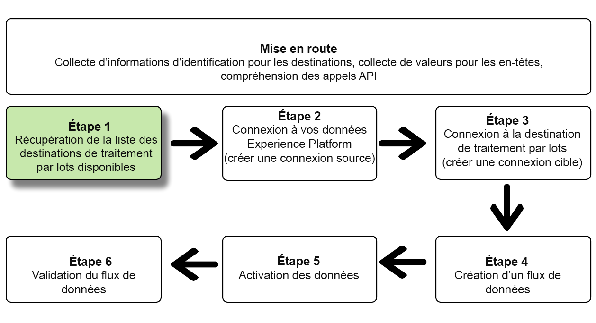
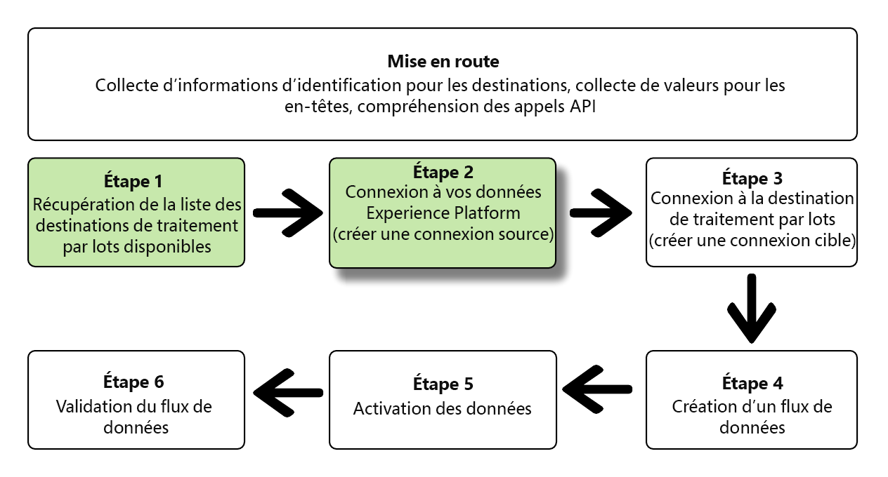
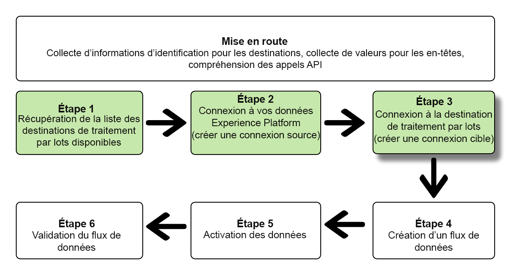
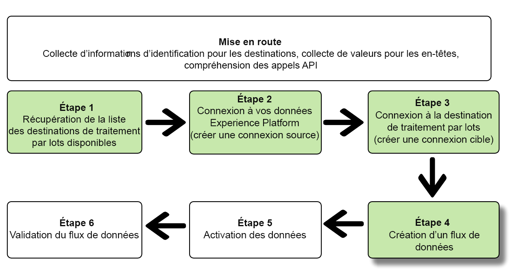
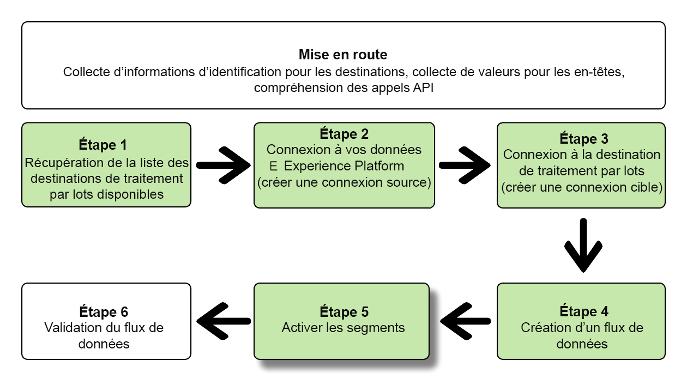
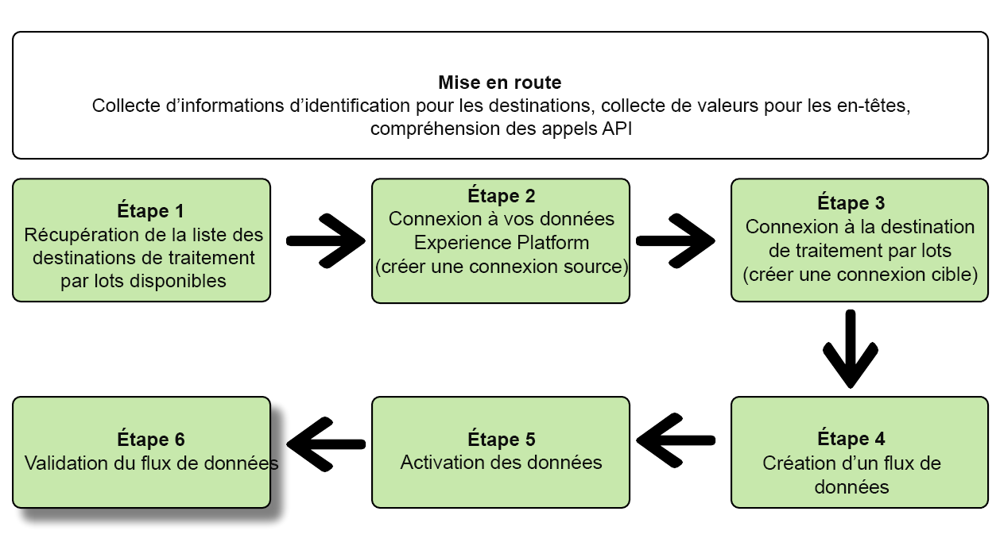

# Connectez-vous à des destinations de marketing par e-mail basées sur des fichiers et activez les données à l’aide de l’API Flow Service

>[!IMPORTANT]
> 
>* Pour vous connecter à une destination, vous avez besoin des autorisations de contrôle d’accès **[!UICONTROL Afficher les destinations]** et **[!UICONTROL Gérer les destinations]** [](/help/access-control/home.md#permissions).
>
>* Pour activer les données, vous avez besoin des autorisations de contrôle d’accès **[!UICONTROL Afficher les destinations]**, **[!UICONTROL Activer les destinations]**, **[!UICONTROL Afficher les profils]** et **[!UICONTROL Afficher les segments]** [](/help/access-control/home.md#permissions).
>
>* Pour exporter des *identités*, vous devez disposer de l’autorisation de contrôle d’accès **[!UICONTROL Afficher le graphique d’identités]** [](/help/access-control/home.md#permissions). <br> {width="100" zoomable="yes"}
>
>Lisez la [présentation du contrôle d’accès](/help/access-control/ui/overview.md) ou contactez votre administrateur ou administratrice du produit pour obtenir les autorisations requises.

Ce tutoriel explique comment utiliser l’API Flow Service pour créer une [destination de marketing par e-mail](../catalog/email-marketing/overview.md) basée sur des fichiers, créer un flux de données vers la destination que vous venez de créer et exporter les données vers cette dernière au moyen de fichiers CSV.

>[!TIP]
> 
>Pour savoir comment activer des données vers des destinations d’espace de stockage à l’aide de l’API Flow Service, consultez le tutoriel [API dédiée](/help/destinations/api/activate-segments-file-based-destinations.md).

Ce tutoriel utilise la destination [!DNL Adobe Campaign] dans tous ses exemples, mais les étapes sont identiques pour les destinations de marketing par e-mail basées sur des fichiers.


Si vous préférez utiliser l’interface utilisateur d’Experience Platform pour vous connecter à une destination et activer des données, reportez-vous aux tutoriels [Se connecter à une destination](../ui/connect-destination.md) et [Activer des données d’audience vers des destinations d’exportation de profils par lots](../ui/activate-batch-profile-destinations.md).

## Prise en main {#get-started}

Ce guide nécessite une compréhension professionnelle des composants suivants d’Adobe Experience Platform :

* [[!DNL Experience Data Model (XDM) System]](../../xdm/home.md) : cadre normalisé selon lequel [!DNL Experience Platform] organise les données de l’expérience client.
* [[!DNL Segmentation Service]](../../segmentation/api/overview.md) : [!DNL Adobe Experience Platform Segmentation Service] permet de créer des audiences dans [!DNL Adobe Experience Platform] à partir de vos données [!DNL Real-Time Customer Profile].
* [[!DNL Sandboxes]](../../sandboxes/home.md) : [!DNL Experience Platform] fournit des sandbox virtuels qui divisent une instance [!DNL Experience Platform] unique en environnements virtuels distincts pour favoriser le développement et l’évolution d’applications d’expérience digitale.

Les sections suivantes apportent des informations supplémentaires dont vous aurez besoin afin d’activer des données vers des destinations par lots dans Experience Platform.

### Collecter les informations d’identification requises {#gather-required-credentials}

Pour suivre les étapes de ce tutoriel, vous devez disposer des informations d’identification suivantes, selon le type de destination auquel vous vous connectez et vers lequel vous activez des audiences.

* Pour les connexions [!DNL Amazon S3] : `accessId`, `secretKey`
* Pour les connexions [!DNL Amazon S3] à [!DNL Adobe Campaign] : `accessId`, `secretKey`
* Pour les connexions SFTP : `domain`, `port`, `username`, `password` ou `sshKey` (selon la méthode de connexion à l’emplacement FTP)
* Pour les connexions [!DNL Azure Blob] : `connectionString`

>[!NOTE]
>
>Les informations d’identification `accessId`, `secretKey` pour les connexions [!DNL Amazon S3] et `accessId`, `secretKey` pour les connexions [!DNL Amazon S3] à [!DNL Adobe Campaign] sont identiques.

### Lecture d’exemples d’appels API {#reading-sample-api-calls}

Ce tutoriel fournit des exemples d’appels API pour démontrer comment formater vos requêtes. Il s’agit notamment de chemins d’accès, d’en-têtes requis et de payloads de requêtes correctement formatés. L’exemple JSON renvoyé dans les réponses de l’API est également fourni. Pour plus d’informations sur les conventions utilisées dans la documentation pour les exemples d’appels d’API, voir la section concernant la [lecture d’exemples d’appels d’API](../../landing/troubleshooting.md#how-do-i-format-an-api-request) dans le guide de dépannage [!DNL Experience Platform].

### Collecter des valeurs pour les en-têtes obligatoires et facultatifs {#gather-values-headers}

Pour lancer des appels aux API [!DNL Experience Platform], vous devez d’abord suivre le [tutoriel d’authentification](https://experienceleague.adobe.com/docs/experience-platform/landing/platform-apis/api-authentication.html?lang=fr). Le tutoriel d’authentification fournit les valeurs de chacun des en-têtes requis dans tous les appels d’API [!DNL Experience Platform], comme indiqué ci-dessous :

* Authorization: Bearer `{ACCESS_TOKEN}`
* x-api-key : `{API_KEY}`
* x-gw-ims-org-id : `{ORG_ID}`

Les ressources dans [!DNL Experience Platform] peuvent être isolées dans des sandbox spécifiques. Dans les requêtes aux API [!DNL Experience Platform], vous pouvez spécifier le nom et l’identifiant du sandbox dans lequel l’opération aura lieu. Il s’agit de paramètres facultatifs.

* x-sandbox-name : `{SANDBOX_NAME}`

>[!NOTE]
>
>Pour plus d’informations sur les sandbox dans [!DNL Experience Platform], consultez la [documentation de présentation des sandbox](../../sandboxes/home.md).

Toutes les requêtes qui contiennent un payload (POST, PUT, PATCH) nécessitent un en-tête de type de média supplémentaire :

* Content-Type: `application/json`

### Documentation de référence sur les API {#api-reference-documentation}

Ce tutoriel vous permet de trouver la documentation de référence relative à toutes les opérations API. Reportez-vous à la section [Documentation de l’API Flow Service sur Adobe I/O](https://www.adobe.io/experience-platform-apis/references/flow-service/). Nous vous recommandons de consulter ce tutoriel et la documentation de référence sur les API en parallèle.

## Obtenir la liste des destinations disponibles {#get-the-list-of-available-destinations}



Dans un premier temps, vous devez décider vers quelle destination activer les données. Pour commencer, effectuez un appel pour demander une liste des destinations disponibles auxquelles vous pouvez vous connecter et activer des audiences. Effectuez la requête GET suivante auprès du point d’entrée `connectionSpecs` pour obtenir une liste des destinations disponibles :

**Format d’API**

```http
GET /connectionSpecs
```

**Requête**

```shell
curl --location --request GET 'https://platform.adobe.io/data/foundation/flowservice/connectionSpecs' \
--header 'accept: application/json' \
--header 'x-gw-ims-org-id: {ORG_ID}' \
--header 'x-api-key: {API_KEY}' \
--header 'x-sandbox-name: {SANDBOX_NAME}' \
--header 'Authorization: Bearer {ACCESS_TOKEN}'
```


**Réponse**

Une réponse réussie contient une liste des destinations disponibles et leurs identifiants uniques (`id`). Conservez la valeur de la destination que vous prévoyez d’utiliser, car elle sera requise dans les étapes suivantes. Par exemple, si vous souhaitez vous connecter et diffuser des audiences à [!DNL Adobe Campaign], recherchez l’extrait suivant dans la réponse :

```json
{
    "id": "0b23e41a-cb4a-4321-a78f-3b654f5d7d97",
  "name": "Adobe Campaign",
  ...
  ...
}
```

À titre de référence, le tableau ci-dessous contient les identifiants de spécification de connexion pour les destinations par lots couramment utilisées :

| Destination | Identifiant de spécification de connexion |
---------|----------|
| [!DNL Adobe Campaign] | `0b23e41a-cb4a-4321-a78f-3b654f5d7d97` |
| [!DNL Oracle Eloqua] | `c1e44b6b-e7c8-404b-9031-58f0ef760604` |
| [!DNL Oracle Responsys] | `a5e28ddf-e265-426e-83a1-9d03a3a6822b` |
| [!DNL Salesforce Marketing Cloud] | `f599a5b3-60a7-4951-950a-cc4115c7ea27` |

{style="table-layout:auto"}

## Connexion à vos données [!DNL Experience Platform] {#connect-to-your-experience-platform-data}



Ensuite, vous devez vous connecter à vos données [!DNL Experience Platform] afin de pouvoir exporter des données de profil et les activer dans votre destination préférée. Il s’agit de deux sous-étapes présentées ci-dessous.

1. Tout d’abord, vous devez effectuer un appel pour autoriser l’accès à vos données dans [!DNL Experience Platform], en établissant une connexion de base.
2. Ensuite, à l’aide de l’identifiant de connexion de base, vous passerez un autre appel au cours duquel vous créerez une *connexion source* qui établira la connexion avec vos données [!DNL Experience Platform].

### Autoriser l’accès à vos données dans [!DNL Experience Platform]

**Format d’API**

```http
POST /connections
```

**Requête**

```shell
curl --location --request POST 'https://platform.adobe.io/data/foundation/flowservice/connections' \
--header 'Authorization: Bearer {ACCESS_TOKEN}' \
--header 'x-api-key: {API_KEY}' \
--header 'x-gw-ims-org-id: {ORG_ID}' \
--header 'x-sandbox-name: {SANDBOX_NAME}' \
--header 'Content-Type: application/json' \
--data-raw '{
            "name": "Base connection to Experience Platform",
            "description": "This call establishes the connection to Experience Platform data",
            "connectionSpec": {
                "id": "{CONNECTION_SPEC_ID}",
                "version": "1.0"
            }
}'
```

| Propriété | Description |
| --------- | ----------- |
| `name` | Attribuer un nom à la connexion de base à Experience Platform [!DNL Profile store]. |
| `description` | Vous pouvez éventuellement fournir une description de la connexion de base. |
| `connectionSpec.id` | Utilisez l’identifiant de spécification de connexion pour [Experience Platform Profile store](/help/profile/home.md#profile-data-store) - `8a9c3494-9708-43d7-ae3f-cda01e5030e1`. |

{style="table-layout:auto"}

**Réponse**

Une réponse réussie contient l’identifiant unique de la connexion de base (`id`). Conservez cette valeur car elle est nécessaire à l’étape suivante pour créer la connexion source.

```json
{
    "id": "1ed86558-59b5-42f7-9865-5859b552f7f4"
}
```

### Se connecter à vos données [!DNL Experience Platform] {#connect-to-platform-data}

**Format d’API**

```http
POST /sourceConnections
```

**Requête**

```shell
curl --location --request POST 'https://platform.adobe.io/data/foundation/flowservice/sourceConnections' \
--header 'Authorization: Bearer {ACCESS_TOKEN}' \
--header 'x-api-key: {API_KEY}' \
--header 'x-gw-ims-org-id: {ORG_ID}' \
--header 'x-sandbox-name: {SANDBOX_NAME}' \
--header 'Content-Type: application/json' \
--data-raw '{
            "name": "Connecting to Profile store",
            "description": "Optional",
            "connectionSpec": {
                "id": "{CONNECTION_SPEC_ID}",
                "version": "1.0"
            },
            "baseConnectionId": "{BASE_CONNECTION_ID}",
            "data": {
                "format": "CSV",
                "schema": null
            },
            "params" : {}
}'
```

| Propriété | Description |
| --------- | ----------- |
| `name` | Attribuer un nom à la connexion source à Experience Platform [!DNL Profile store]. |
| `description` | Vous pouvez éventuellement fournir une description de la connexion source. |
| `connectionSpec.id` | Utilisez l’identifiant de spécification de connexion pour [Experience Platform Profile store](/help/profile/home.md#profile-data-store) - `8a9c3494-9708-43d7-ae3f-cda01e5030e1`. |
| `baseConnectionId` | Utilisez l’identifiant de connexion de base que vous avez obtenu à l’étape précédente. |
| `data.format` | `CSV` est actuellement le seul format d’exportation de fichier pris en charge. |

{style="table-layout:auto"}

**Réponse**

Une réponse réussie renvoie l’identifiant unique (`id`) de la nouvelle connexion source à [!DNL Profile store]. Cela confirme que vous avez réussi à vous connecter à vos données [!DNL Experience Platform]. Conservez cette valeur car elle sera nécessaire lors d’une prochaine étape.

```json
{
    "id": "ed48ae9b-c774-4b6e-88ae-9bc7748b6e97"
}
```

## Se connecter à une destination par lots {#connect-to-batch-destination}



Au cours de cette étape, vous établissez une connexion au stockage par lots dans le cloud ou à la destination de marketing par e-mail de votre choix. Il s’agit de deux sous-étapes présentées ci-dessous.

1. Tout d’abord, vous devez effectuer un appel pour autoriser l’accès à la plateforme de destination en établissant une connexion de base.
2. Ensuite, à l’aide de l’identifiant de connexion de base, vous passerez un autre appel au cours duquel vous créerez une *connexion cible*, qui spécifie l’emplacement de votre compte de stockage où les fichiers de données exportés seront transmis, ainsi que le format des données qui seront exportées.

### Autoriser l’accès à une destination par lots {#authorize-access-to-batch-destination}

**Format d’API**

```http
POST /connections
```

**Requête**

La requête ci-dessous établit une connexion de base aux destinations [!DNL Adobe Campaign]. Selon l’emplacement de stockage vers lequel vous souhaitez exporter des fichiers ([!DNL Amazon S3], SFTP, [!DNL Azure Blob]), conservez la spécification `auth` appropriée et supprimez les autres.

```shell
curl --location --request POST 'https://platform.adobe.io/data/foundation/flowservice/connections' \
--header 'Authorization: Bearer {ACCESS_TOKEN}' \
--header 'x-api-key: {API_KEY}' \
--header 'x-gw-ims-org-id: {ORG_ID}' \
--header 'x-sandbox-name: {SANDBOX_NAME}' \
--header 'Content-Type: application/json' \
--data-raw '{
    "name": "S3 Connection for Adobe Campaign",
    "description": "summer advertising campaign",
    "connectionSpec": {
        "id": "0b23e41a-cb4a-4321-a78f-3b654f5d7d97",
        "version": "1.0"
    },
    "auth": {
        "specName": "S3",
        "params": {
            "accessId": "{ACCESS_ID}",
            "secretKey": "{SECRET_KEY}"
        }
    }
    "auth": {
        "specName": "SFTP with Password",
        "params": {
            "domain": "{DOMAIN}",
            "host": "{HOST}",
            "username": "{USERNAME}",
            "password": "{PASSWORD}"
        }
    }
    "auth": {
        "specName": "SFTP with SSH Key",
        "params": {
            "domain": "{DOMAIN}",
            "host": "{HOST}",
            "username": "{USERNAME}",
            "sshKey": "{SSH_KEY}"
        }
    }        
    "auth": {
        "specName": "Azure Blob",
        "params": {
            "connectionString": "{AZURE_BLOB_CONNECTION_STRING}"
        }
    }    
}'
```

Reportez-vous aux exemples de requêtes ci-dessous pour vous connecter à d’autres destinations de stockage par lots dans le cloud et de marketing par e-mail prises en charge.

+++ Exemple de requête de connexion à des destinations [!DNL Amazon S3]

La requête ci-dessous établit une connexion de base aux destinations [!DNL Amazon S3].

```shell
curl --location --request POST 'https://platform.adobe.io/data/foundation/flowservice/connections' \
--header 'Authorization: Bearer {ACCESS_TOKEN}' \
--header 'x-api-key: {API_KEY}' \
--header 'x-gw-ims-org-id: {ORG_ID}' \
--header 'x-sandbox-name: {SANDBOX_NAME}' \
--header 'Content-Type: application/json' \
--data-raw '{
    "name": "Connect to Amazon S3",
    "description": "summer advertising campaign",
    "connectionSpec": {
        "id": "4890fc95-5a1f-4983-94bb-e060c08e3f81",
        "version": "1.0"
    },
    "auth": {
        "specName": "Access Key",
        "params": {
            "s3AccessKey": "{AMAZON_S3_ACCESS_KEY}",
            "s3SecretKey": "{AMAZON_S3_SECRET_KEY}"
        }
    }
}'
```

+++

+++ Exemple de requête de connexion à des destinations [!DNL Azure Blob]

La requête ci-dessous établit une connexion de base aux destinations [!DNL Azure Blob].

```shell
curl --location --request POST 'https://platform.adobe.io/data/foundation/flowservice/connections' \
--header 'Authorization: Bearer {ACCESS_TOKEN}' \
--header 'x-api-key: {API_KEY}' \
--header 'x-gw-ims-org-id: {ORG_ID}' \
--header 'x-sandbox-name: {SANDBOX_NAME}' \
--header 'Content-Type: application/json' \
--data-raw '{
    "name": "Connect to Azure Blob",
    "description": "Summer advertising campaign",
    "connectionSpec": {
        "id": "e258278b-a4cf-43ac-b158-4fa0ca0d948b",
        "version": "1.0"
    },
    "auth": {
        "specName": "ConnectionString",
        "params": {
            "connectionString": "{AZURE_BLOB_CONNECTION_STRING}"
        }
    }
}'
```

+++

+++ Exemple de requête de connexion à des destinations [!DNL Oracle Eloqua]

La requête ci-dessous établit une connexion de base à des destinations [!DNL Oracle Eloqua]. En fonction de l’emplacement de stockage dans lequel vous souhaitez exporter des fichiers, conservez la spécification `auth` appropriée et supprimez les autres.

```shell
curl --location --request POST 'https://platform.adobe.io/data/foundation/flowservice/connections' \
--header 'Authorization: Bearer {ACCESS_TOKEN}' \
--header 'x-api-key: {API_KEY}' \
--header 'x-gw-ims-org-id: {ORG_ID}' \
--header 'x-sandbox-name: {SANDBOX_NAME}' \
--header 'Content-Type: application/json' \
--data-raw '{
    "name": "Connect to Eloqua destination",
    "description": "summer advertising campaign",
    "connectionSpec": {
        "id": "c1e44b6b-e7c8-404b-9031-58f0ef760604",
        "version": "1.0"
    },
    "auth": {
        "specName": "SFTP with Password",
        "params": {
            "domain": "{DOMAIN}",
            "host": "{HOST}",
            "username": "{USERNAME}",
            "password": "{PASSWORD}"
        }
    }
    "auth": {
        "specName": "SFTP with SSH Key",
        "params": {
            "domain": "{DOMAIN}",
            "host": "{HOST}",
            "username": "{USERNAME}",
            "sshKey": "{SSH_KEY}"
        }
    }    
}'
```

+++

+++ Exemple de requête de connexion à des destinations [!DNL Oracle Responsys]

La requête ci-dessous établit une connexion de base à des destinations [!DNL Oracle Responsys]. En fonction de l’emplacement de stockage dans lequel vous souhaitez exporter des fichiers, conservez la spécification `auth` appropriée et supprimez les autres.

```shell
curl --location --request POST 'https://platform.adobe.io/data/foundation/flowservice/connections' \
--header 'Authorization: Bearer {ACCESS_TOKEN}' \
--header 'x-api-key: {API_KEY}' \
--header 'x-gw-ims-org-id: {ORG_ID}' \
--header 'x-sandbox-name: {SANDBOX_NAME}' \
--header 'Content-Type: application/json' \
--data-raw '{
    "name": "Connect to Responsys destination",
    "description": "summer advertising campaign",
    "connectionSpec": {
        "id": "a5e28ddf-e265-426e-83a1-9d03a3a6822b",
        "version": "1.0"
    },
    "auth": {
        "specName": "SFTP with Password",
        "params": {
            "domain": "{DOMAIN}",
            "host": "{HOST}",
            "username": "{USERNAME}",
            "password": "{PASSWORD}"
        }
    }
    "auth": {
        "specName": "SFTP with SSH Key",
        "params": {
            "domain": "{DOMAIN}",
            "host": "{HOST}",
            "username": "{USERNAME}",
            "sshKey": "{SSH_KEY}"
        }
    }    
}'
```

+++

+++ Exemple de requête de connexion à des destinations [!DNL Salesforce Marketing Cloud]

La requête ci-dessous établit une connexion de base à des destinations [!DNL Salesforce Marketing Cloud]. En fonction de l’emplacement de stockage dans lequel vous souhaitez exporter des fichiers, conservez la spécification `auth` appropriée et supprimez les autres.

```shell
curl --location --request POST 'https://platform.adobe.io/data/foundation/flowservice/connections' \
--header 'Authorization: Bearer {ACCESS_TOKEN}' \
--header 'x-api-key: {API_KEY}' \
--header 'x-gw-ims-org-id: {ORG_ID}' \
--header 'x-sandbox-name: {SANDBOX_NAME}' \
--header 'Content-Type: application/json' \
--data-raw '{
    "name": "Connect to Salesforce Marketing Cloud",
    "description": "summer advertising campaign",
    "connectionSpec": {
        "id": "f599a5b3-60a7-4951-950a-cc4115c7ea27",
        "version": "1.0"
    },
    "auth": {
        "specName": "SFTP with Password",
        "params": {
            "domain": "{DOMAIN}",
            "host": "{HOST}",
            "username": "{USERNAME}",
            "password": "{PASSWORD}"
        }
    }
    "auth": {
        "specName": "SFTP with SSH Key",
        "params": {
            "domain": "{DOMAIN}",
            "host": "{HOST}",
            "username": "{USERNAME}",
            "sshKey": "{SSH_KEY}"
        }
    }    
}'
```

+++

+++ Exemple de demande de connexion à SFTP avec des destinations à mots de passe

La requête ci-dessous établit une connexion de base aux destinations SFTP.

```shell
curl --location --request POST 'https://platform.adobe.io/data/foundation/flowservice/connections' \
--header 'Authorization: Bearer {ACCESS_TOKEN}' \
--header 'x-api-key: {API_KEY}' \
--header 'x-gw-ims-org-id: {ORG_ID}' \
--header 'x-sandbox-name: {SANDBOX_NAME}' \
--header 'Content-Type: application/json' \
--data-raw '{
    "name": "Connect to SFTP with password",
    "description": "summer advertising campaign",
    "connectionSpec": {
        "id": "64ef4b8b-a6e0-41b5-9677-3805d1ee5dd0",
        "version": "1.0"
    },
    "auth": {
        "specName": "Basic Authentication for sftp",
        "params": {
            "host": "{HOST}",
            "username": "{USERNAME}",
            "password": "{PASSWORD}"
        }
    }
}'
```

+++

| Propriété | Description |
| --------- | ----------- |
| `name` | Attribuez un nom à la connexion de base à la destination par lots. |
| `description` | Vous pouvez éventuellement fournir une description de la connexion de base. |
| `connectionSpec.id` | Utilisez l’identifiant de spécification de connexion pour la destination par lots de votre choix. Vous avez obtenu cet identifiant à l’étape [Obtenir la liste des destinations disponibles](#get-the-list-of-available-destinations). |
| `auth.specname` | Indique le format d’authentification de la destination. Pour connaître le specName de votre destination, effectuez un [appel GET au point d’entrée des spécifications de connexion](https://developer.adobe.com/experience-platform-apis/references/flow-service/#operation/retrieveConnectionSpec), en précisant la spécification de connexion de la destination souhaitée. Recherchez le paramètre `authSpec.name` dans la réponse. <br> Par exemple, pour les destinations Adobe Campaign, vous pouvez utiliser un des formats d’authentification suivants : `S3`, `SFTP with Password` ou `SFTP with SSH Key`. |
| `params` | Selon la destination à laquelle vous vous connectez, vous devez fournir différents paramètres d’authentification requis. Pour les connexions Amazon S3, vous devez fournir votre identifiant d’accès et votre clé secrète à votre emplacement de stockage Amazon S3. <br> Pour connaître les paramètres requis pour votre destination, effectuez un [appel GET au point d’entrée des spécifications de connexion](https://developer.adobe.com/experience-platform-apis/references/flow-service/#operation/retrieveConnectionSpec), en précisant la spécification de connexion de la destination souhaitée. Recherchez le paramètre `authSpec.spec.required` dans la réponse. |

{style="table-layout:auto"}

**Réponse**

Une réponse réussie contient l’identifiant unique de la connexion de base (`id`). Conservez cette valeur car elle est nécessaire à l’étape suivante pour créer une connexion cible.

```json
{
    "id": "1ed86558-59b5-42f7-9865-5859b552f7f4"
}
```

### Indication de l’emplacement de stockage et du format des données {#specify-storage-location-data-format}

[!DNL Adobe Experience Platform] exporte des données pour les destinations de marketing par e-mail et de stockage dans le cloud sous la forme de fichiers [!DNL CSV]. Au cours de cette étape, vous pouvez déterminer le chemin d’accès à l’emplacement de stockage où les fichiers seront exportés.

>[!IMPORTANT]
> 
>[!DNL Adobe Experience Platform] divise automatiquement les fichiers d’exportation à 5 millions d’enregistrements (lignes) par fichier. Chaque ligne représente un profil.
>
>Les noms de fichiers fractionnés sont ajoutés avec un nombre indiquant que le fichier fait partie d’une exportation plus importante, comme : `filename.csv`, `filename_2.csv`, `filename_3.csv`.

**Format d’API**

```http
POST /targetConnections
```

**Requête**

La requête ci-dessous établit une connexion cible à des destinations [!DNL Adobe Campaign] pour déterminer où se trouvent les fichiers exportés dans l’emplacement de stockage. En fonction de l’emplacement de stockage dans lequel vous souhaitez exporter des fichiers, conservez la spécification `params` appropriée et supprimez les autres.

```shell
curl --location --request POST 'https://platform.adobe.io/data/foundation/flowservice/targetConnections' \
--header 'Authorization: Bearer {ACCESS_TOKEN}' \
--header 'x-api-key: {API_KEY}' \
--header 'x-gw-ims-org-id: {ORG_ID}' \
--header 'Content-Type: application/json' \
--data-raw '{
    "name": "TargetConnection for Adobe Campaign",
    "description": "Connection to Adobe Campaign",
    "baseConnectionId": "{BASE_CONNECTION_ID}",
    "connectionSpec": {
        "id": "0b23e41a-cb4a-4321-a78f-3b654f5d7d97",
        "version": "1.0"
    },
    "data": {
        "format": "json",
        "schema": {
            "id": "1.0",
            "version": "1.0"
        }
    },
    "params": {
        "mode": "S3",
        "bucketName": "{BUCKET_NAME}",
        "path": "{FILEPATH}",
        "format": "CSV",
        "includeFileManifest": true // Include this parameter if you want to enable manifest file generation for your destination
    }
    "params": {
        "mode": "AZURE_BLOB",
        "container": "{CONTAINER}",
        "path": "{FILEPATH}",
        "format": "CSV",
        "includeFileManifest": true // Include this parameter if you want to enable manifest file generation for your destination
    }
    "params": {
        "mode": "FTP",
        "remotePath": "{REMOTE_PATH}",
        "format": "CSV",
        "includeFileManifest": true // Include this parameter if you want to enable manifest file generation for your destination
    }        
}'
```

Voir les exemples de requêtes ci-dessous pour configurer un emplacement de stockage pour d’autres destinations de stockage par lots dans le cloud et de marketing par e-mail prises en charge.

+++ Exemple de requête pour configurer un emplacement de stockage pour des destinations [!DNL Amazon S3]

La requête ci-dessous établit une connexion cible à des destinations [!DNL Amazon S3] pour déterminer où se trouvent les fichiers exportés dans l’emplacement de stockage.

```shell
curl --location --request POST 'https://platform.adobe.io/data/foundation/flowservice/targetConnections' \
--header 'Authorization: Bearer {ACCESS_TOKEN}' \
--header 'x-api-key: {API_KEY}' \
--header 'x-gw-ims-org-id: {ORG_ID}' \
--header 'Content-Type: application/json' \
--data-raw '{
    "name": "TargetConnection for Amazon S3",
    "description": "Connection to Amazon S3",
    "baseConnectionId": "{BASE_CONNECTION_ID}",
    "connectionSpec": {
        "id": "4890fc95-5a1f-4983-94bb-e060c08e3f81",
        "version": "1.0"
    },
    "data": {
        "format": "json",
        "schema": {
            "id": "1.0",
            "version": "1.0"
        }
    },
    "params": {
        "mode": "S3",
        "bucketName": "{BUCKET_NAME}",
        "path": "{FILEPATH}",
        "format": "CSV",
        "includeFileManifest": true // Include this parameter if you want to enable manifest file generation for your destination
    }
}'
```

+++

+++ Exemple de requête pour configurer un emplacement de stockage pour des destinations [!DNL Azure Blob]

La requête ci-dessous établit une connexion cible à des destinations [!DNL Azure Blob] pour déterminer où se trouvent les fichiers exportés dans l’emplacement de stockage.

```shell
curl --location --request POST 'https://platform.adobe.io/data/foundation/flowservice/targetConnections' \
--header 'Authorization: Bearer {ACCESS_TOKEN}' \
--header 'x-api-key: {API_KEY}' \
--header 'x-gw-ims-org-id: {ORG_ID}' \
--header 'Content-Type: application/json' \
--data-raw '{
    "name": "TargetConnection for Azure Blob",
    "description": "Connection to Azure Blob",
    "baseConnectionId": "{BASE_CONNECTION_ID}",
    "connectionSpec": {
        "id": "e258278b-a4cf-43ac-b158-4fa0ca0d948b",
        "version": "1.0"
    },
    "data": {
        "format": "json",
        "schema": {
            "id": "1.0",
            "version": "1.0"
        }
    },
    "params": {
        "mode": "AZURE_BLOB",
        "container": "{CONTAINER}",
        "path": "{FILEPATH}",
        "format": "CSV",
        "includeFileManifest": true // Include this parameter if you want to enable manifest file generation for your destination
    }
}'
```

+++

+++ Exemple de requête pour configurer un emplacement de stockage pour des destinations [!DNL Oracle Eloqua]

La requête ci-dessous établit une connexion cible à des destinations [!DNL Oracle Eloqua] pour déterminer où se trouvent les fichiers exportés dans l’emplacement de stockage. En fonction de l’emplacement de stockage dans lequel vous souhaitez exporter des fichiers, conservez la spécification `params` appropriée et supprimez les autres.

```shell
curl --location --request POST 'https://platform.adobe.io/data/foundation/flowservice/targetConnections' \
--header 'Authorization: Bearer {ACCESS_TOKEN}' \
--header 'x-api-key: {API_KEY}' \
--header 'x-gw-ims-org-id: {ORG_ID}' \
--header 'Content-Type: application/json' \
--data-raw '{
    "name": "TargetConnection for Oracle Eloqua",
    "description": "Connection to Oracle Eloqua",
    "baseConnectionId": "{BASE_CONNECTION_ID}",
    "connectionSpec": {
        "id": "c1e44b6b-e7c8-404b-9031-58f0ef760604",
        "version": "1.0"
    },
    "data": {
        "format": "json",
        "schema": {
            "id": "1.0",
            "version": "1.0"
        }
    },
    "params": {
        "mode": "S3",
        "bucketName": "{BUCKET_NAME}",
        "path": "{FILEPATH}",
        "format": "CSV",
        "includeFileManifest": true // Include this parameter if you want to enable manifest file generation for your destination
    }
    "params": {
        "mode": "FTP",
        "remotePath": "{REMOTE_PATH}",
        "format": "CSV",
        "includeFileManifest": true // Include this parameter if you want to enable manifest file generation for your destination
    }        
}'
```

+++

+++ Exemple de requête pour configurer un emplacement de stockage pour des destinations [!DNL Oracle Responsys]

La requête ci-dessous établit une connexion cible à des destinations [!DNL Oracle Responsys] pour déterminer où se trouvent les fichiers exportés dans l’emplacement de stockage. En fonction de l’emplacement de stockage dans lequel vous souhaitez exporter des fichiers, conservez la spécification `params` appropriée et supprimez les autres.

```shell
curl --location --request POST 'https://platform.adobe.io/data/foundation/flowservice/targetConnections' \
--header 'Authorization: Bearer {ACCESS_TOKEN}' \
--header 'x-api-key: {API_KEY}' \
--header 'x-gw-ims-org-id: {ORG_ID}' \
--header 'Content-Type: application/json' \
--data-raw '{
    "name": "TargetConnection for Oracle Responsys",
    "description": "Connection to Oracle Responsys",
    "baseConnectionId": "{BASE_CONNECTION_ID}",
    "connectionSpec": {
        "id": "a5e28ddf-e265-426e-83a1-9d03a3a6822b",
        "version": "1.0"
    },
    "data": {
        "format": "json",
        "schema": {
            "id": "1.0",
            "version": "1.0"
        }
    },
    "params": {
        "mode": "S3",
        "bucketName": "{BUCKET_NAME}",
        "path": "{FILEPATH}",
        "format": "CSV",
        "includeFileManifest": true // Include this parameter if you want to enable manifest file generation for your destination
    }
    "params": {
        "mode": "FTP",
        "remotePath": "{REMOTE_PATH}",
        "format": "CSV",
        "includeFileManifest": true // Include this parameter if you want to enable manifest file generation for your destination
    }        
}'
```

+++

+++ Exemple de requête pour configurer un emplacement de stockage pour des destinations [!DNL Salesforce Marketing Cloud]

La requête ci-dessous établit une connexion cible à des destinations [!DNL Salesforce Marketing Cloud] pour déterminer où se trouvent les fichiers exportés dans l’emplacement de stockage. En fonction de l’emplacement de stockage dans lequel vous souhaitez exporter des fichiers, conservez la spécification `params` appropriée et supprimez les autres.

```shell
curl --location --request POST 'https://platform.adobe.io/data/foundation/flowservice/targetConnections' \
--header 'Authorization: Bearer {ACCESS_TOKEN}' \
--header 'x-api-key: {API_KEY}' \
--header 'x-gw-ims-org-id: {ORG_ID}' \
--header 'Content-Type: application/json' \
--data-raw '{
    "name": "TargetConnection for Salesforce Marketing Cloud",
    "description": "Connection to Salesforce Marketing Cloud",
    "baseConnectionId": "{BASE_CONNECTION_ID}",
    "connectionSpec": {
        "id": "f599a5b3-60a7-4951-950a-cc4115c7ea27",
        "version": "1.0"
    },
    "data": {
        "format": "json",
        "schema": {
            "id": "1.0",
            "version": "1.0"
        }
    },
    "params": {
        "mode": "S3",
        "bucketName": "{BUCKET_NAME}",
        "path": "{FILEPATH}",
        "format": "CSV",
        "includeFileManifest": true // Include this parameter if you want to enable manifest file generation for your destination
    }
    "params": {
        "mode": "FTP",
        "remotePath": "{REMOTE_PATH}",
        "format": "CSV",
        "includeFileManifest": true // Include this parameter if you want to enable manifest file generation for your destination
    }        
}'
```

+++

+++ Exemple de requête pour configurer un emplacement de stockage pour les destinations SFTP

La requête ci-dessous établit une connexion cible aux destinations SFTP afin de déterminer où se trouvent les fichiers exportés dans l’emplacement de stockage.

```shell
curl --location --request POST 'https://platform.adobe.io/data/foundation/flowservice/targetConnections' \
--header 'Authorization: Bearer {ACCESS_TOKEN}' \
--header 'x-api-key: {API_KEY}' \
--header 'x-gw-ims-org-id: {ORG_ID}' \
--header 'Content-Type: application/json' \
--data-raw '{
    "name": "TargetConnection for SFTP",
    "description": "Connection to SFTP",
    "baseConnectionId": "{BASE_CONNECTION_ID}",
    "connectionSpec": {
        "id": "64ef4b8b-a6e0-41b5-9677-3805d1ee5dd0",
        "version": "1.0"
    },
    "data": {
        "format": "json",
        "schema": {
            "id": "1.0",
            "version": "1.0"
        }
    },
    "params": {
        "mode": "FTP",
        "remotePath": "{REMOTE_PATH}",
        "includeFileManifest": true // Include this parameter if you want to enable manifest file generation for your destination
    }
}'
```

+++


| Propriété | Description |
| --------- | ----------- |
| `name` | Attribuez un nom pour la connexion cible à la destination par lots. |
| `description` | Vous pouvez éventuellement fournir une description de la connexion cible. |
| `baseConnectionId` | Utilisez l’identifiant de la connexion de base que vous avez créée à l’étape ci-dessus. |
| `connectionSpec.id` | Utilisez l’identifiant de spécification de connexion pour la destination par lots de votre choix. Vous avez obtenu cet identifiant à l’étape [Obtenir la liste des destinations disponibles](#get-the-list-of-available-destinations). |
| `params` | Selon la destination à laquelle vous vous connectez, vous devez fournir différents paramètres requis à votre emplacement de stockage. Pour les connexions Amazon S3, vous devez fournir votre identifiant d’accès et votre clé secrète à votre emplacement de stockage Amazon S3. <br> Pour connaître les paramètres requis pour votre destination, effectuez un [appel GET au point d’entrée des spécifications de connexion](https://developer.adobe.com/experience-platform-apis/references/flow-service/#operation/retrieveConnectionSpec), en précisant la spécification de connexion de la destination souhaitée. Recherchez le paramètre `targetSpec.spec.required` dans la réponse. |
| `params.mode` | En fonction du mode pris en charge pour votre destination, vous devez fournir une valeur différente. Pour connaître les paramètres requis pour votre destination, effectuez un [appel GET au point d’entrée des spécifications de connexion](https://developer.adobe.com/experience-platform-apis/references/flow-service/#operation/retrieveConnectionSpec) en fournissant la spécification de connexion de la destination souhaitée. Recherchez le paramètre `targetSpec.spec.properties.mode.enum` dans la réponse et sélectionnez le mode souhaité. |
| `params.bucketName` | Pour les connexions S3, indiquez le nom de l’intervalle où les fichiers seront exportés. |
| `params.path` | Pour les connexions S3, indiquez le chemin d’accès au fichier dans l’emplacement de stockage où les fichiers seront exportés. |
| `params.format` | `CSV` est actuellement le seul type d’exportation de fichier pris en charge. |
| `params.includeFileManifest` | *Facultatif*. Définissez sur `true` pour activer la génération du fichier manifeste pour la destination. Lorsque cette option est activée, un fichier manifeste est créé avec vos fichiers de données exportés, fournissant des métadonnées sur les fichiers exportés. Affichez un [exemple de fichier de manifeste](/help/destinations/assets/common/manifest-d0420d72-756c-4159-9e7f-7d3e2f8b501e-0ac8f3c0-29bd-40aa-82c1-f1b7e0657b19.json). |

{style="table-layout:auto"}

**Réponse**

Une réponse réussie renvoie l’identifiant unique (`id`) de la nouvelle connexion cible créée à votre destination par lots. Conservez cette valeur car elle sera nécessaire lors de prochaines étapes.

```json
{
    "id": "12ab90c7-519c-4291-bd20-d64186b62da8"
}
```

## Créer un flux de données {#create-dataflow}



En utilisant la spécification de flux, la connexion source et les identifiants de connexion cible que vous avez obtenus aux étapes précédentes, vous pouvez maintenant créer un flux de données entre vos données [!DNL Experience Platform] et la destination vers laquelle vous allez exporter les fichiers de données. Considérez cette étape comme la création du pipeline par lequel les données seront ensuite acheminées entre [!DNL Experience Platform] et la destination souhaitée.

Pour créer un flux de données, effectuez une requête POST, tel qu’indiqué ci-après, tout en fournissant les valeurs mentionnées ci-dessous dans la payload.

**Format d’API**

```http
POST /flows
```

**Requête**

```shell
curl -X POST \
'https://platform.adobe.io/data/foundation/flowservice/flows' \
-H 'Authorization: Bearer {ACCESS_TOKEN}' \
-H 'x-api-key: {API_KEY}' \
-H 'x-gw-ims-org-id: {ORG_ID}' \
-H 'x-sandbox-name: {SANDBOX_NAME}' \
-H 'Content-Type: application/json' \
-d  '{
   
        "name": "activate audiences to Adobe Campaign",
        "description": "This operation creates a dataflow which we will later use to activate audiences to Adobe Campaign",
        "flowSpec": {
            "id": "{FLOW_SPEC_ID}",
            "version": "1.0"
        },
        "sourceConnectionIds": [
            "{SOURCE_CONNECTION_ID}"
        ],
        "targetConnectionIds": [
            "{TARGET_CONNECTION_ID}"
        ],
        "transformations": [
            {
                "name": "GeneralTransform",
                "params": {
                    "segmentSelectors": {
                        "selectors": []
                    },
                    "profileSelectors": {
                        "selectors": []
                    }
                }
            }
        ]
    }
```

| Propriété | Description |
| --------- | ----------- |
| `name` | Attribuez un nom au flux de données que vous êtes en train de créer. |
| `description` | Vous pouvez éventuellement fournir une description du flux de données. |
| `flowSpec.Id` | Utilisez l’identifiant de spécification de flux pour la destination par lots à laquelle vous souhaitez vous connecter. Pour récupérer l’identifiant de spécification du flux, effectuez une opération GET sur le point d’entrée `flowspecs`, tel qu’indiqué dans la section [Documentation de référence de l’API des spécifications de flux](https://www.adobe.io/experience-platform-apis/references/flow-service/#operation/retrieveFlowSpec). Dans la réponse, recherchez `upsTo` et copiez l’identifiant correspondant à la destination par lots à laquelle vous souhaitez vous connecter. Par exemple, pour Adobe Campaign, recherchez `upsToCampaign` et copiez le paramètre `id`. |
| `sourceConnectionIds` | Utilisez l’identifiant de connexion source obtenu à l’étape [Se connecter aux données Experience Platform](#connect-to-your-experience-platform-data). |
| `targetConnectionIds` | Utilisez l’identifiant de connexion cible obtenu à l’étape [Seconnecter à une destination par lots](#connect-to-batch-destination). |
| `transformations` | À l’étape suivante, vous allez remplir cette section avec les audiences et les attributs de profil à activer. |

À titre de référence, le tableau ci-dessous contient les identifiants de spécification de flux pour les destinations par lots couramment utilisées :

| Destination | Identifiant de spécification de flux |
---------|----------|
| Toutes les destinations de stockage dans le cloud ([!DNL Amazon S3], SFTP, [!DNL Azure Blob]) et [!DNL Oracle Eloqua] | `71471eba-b620-49e4-90fd-23f1fa0174d8` |
| [!DNL Oracle Responsys] | `51d675ce-e270-408d-91fc-22717bdf2148` |
| [!DNL Salesforce Marketing Cloud] | `493b2bd6-26e4-4167-ab3b-5e910bba44f0` |

**Réponse**

Une réponse réussie renvoie l’identifiant (`id`) du nouveau flux de données et un `etag`. Notez bien les deux valeurs, car vous en aurez besoin à l’étape suivante pour activer les audiences et exporter les fichiers de données.

```json
{
    "id": "8256cfb4-17e6-432c-a469-6aedafb16cd5",
    "etag": "8256cfb4-17e6-432c-a469-6aedafb16cd5"
}
```


## Activation des données vers votre nouvelle destination {#activate-data}



Après avoir créé toutes les connexions et le flux de données, vous pouvez maintenant activer vos données de profil sur la plateforme de destination. Au cours de cette étape, vous sélectionnez les audiences et les attributs de profil à exporter vers la destination.

Vous pouvez également déterminer le format de dénomination des fichiers exportés et les attributs à utiliser comme [clés de déduplication](../ui/activate-batch-profile-destinations.md#mandatory-keys) ou [attributs obligatoires](../ui/activate-batch-profile-destinations.md#mandatory-attributes). Au cours de cette étape, vous pouvez également déterminer le planning d’envoi des données vers la destination.

Pour activer des audiences vers votre nouvelle destination, vous devez effectuer une opération JSON PATCH, similaire à l’exemple ci-dessous. Vous pouvez activer plusieurs audiences et attributs de profil en un seul appel. Pour en savoir plus sur le JSON PATCH, consultez la [spécification RFC](https://tools.ietf.org/html/rfc6902).

**Format d’API**

```http
PATCH /flows
```

**Requête**

```shell
curl --location --request PATCH 'https://platform.adobe.io/data/foundation/flowservice/flows/{DATAFLOW_ID}' \
--header 'Authorization: Bearer {ACCESS_TOKEN}' \
--header 'x-api-key: {API_KEY}' \
--header 'x-gw-ims-org-id: {ORG_ID}' \
--header 'Content-Type: application/json' \
--header 'x-sandbox-name: {SANDBOX_NAME}' \
--header 'If-Match: "{ETAG}"' \
--data-raw '[
    {
        "op": "add",
        "path": "/transformations/0/params/segmentSelectors/selectors/-",
        "value": {
            "type": "PLATFORM_SEGMENT",
            "value": {
                "name": "Name of the audience that you are activating",
                "description": "Description of the audience that you are activating",
                "id": "{SEGMENT_ID}",
                "filenameTemplate": "%DESTINATION_NAME%_%SEGMENT_ID%_%DATETIME(YYYYMMdd_HHmmss)%",
                "exportMode": "DAILY_FULL_EXPORT",
                "schedule": {
                    "frequency": "ONCE",
                    "startDate": "2021-12-20",
                    "startTime": "17:00"
                } 
            }
        }
    },
{
        "op": "add",
        "path": "/transformations/0/params/segmentSelectors/selectors/-",
        "value": {
            "type": "PLATFORM_SEGMENT",
            "value": {
                "name": "Name of the audience that you are activating",
                "description": "Description of the audience that you are activating",
                "id": "{SEGMENT_ID}",
                "filenameTemplate": "%DESTINATION_NAME%_%SEGMENT_ID%_%DATETIME(YYYYMMdd_HHmmss)%",
                "exportMode": "DAILY_FULL_EXPORT",
                "schedule": {
                    "frequency": "ONCE",
                    "triggerType": "SCHEDULED",
                    "startDate": "2021-12-20",
                    "startTime": "17:00"
                },   
            }
        }
    },
{
        "op": "add",
        "path": "/transformations/0/params/profileSelectors/selectors/-",
        "value": {
            "type": "JSON_PATH",
            "value": {
                "path": "{PROFILE_ATTRIBUTE}"
            }
        }
    }
]
```

| Propriété | Description |
| --------- | ----------- |
| `{DATAFLOW_ID}` | Dans l’URL, utilisez l’identifiant du flux de données que vous avez créé à l’étape précédente. |
| `{ETAG}` | Récupérez le `{ETAG}` à partir de la réponse de l’étape précédente, [Créer un flux de données](#create-dataflow). Le format de réponse de l’étape précédente contient des guillemets d’échappement. Vous devez utiliser les valeurs sans échappement dans l’en-tête de la requête. Voir l’exemple ci-dessous : <br> <ul><li>Exemple de réponse : `"etag":""7400453a-0000-1a00-0000-62b1c7a90000""`</li><li>Valeur à utiliser dans votre demande : `"etag": "7400453a-0000-1a00-0000-62b1c7a90000"`</li></ul> <br> La valeur etag est mise à jour avec chaque mise à jour réussie d’un flux de données. |
| `{SEGMENT_ID}` | Indiquez l’identifiant de l’audience que vous souhaitez exporter vers cette destination. Pour récupérer les identifiants des audiences que vous souhaitez activer, voir [récupérer une définition d’audience](https://www.adobe.io/experience-platform-apis/references/segmentation/#operation/retrieveSegmentDefinitionById) dans la référence de l’API Experience Platform. |
| `{PROFILE_ATTRIBUTE}` | Par exemple : `"person.lastName"` |
| `op` | Appel d’opération utilisé pour définir l’action nécessaire pour mettre à jour la connexion. Les opérations comprennent : `add`, `replace` et `remove`. Pour ajouter une audience à un flux de données, utilisez l’opération `add` . |
| `path` | Définit la partie du flux à mettre à jour. Lors de l’ajout d’une audience à un flux de données, utilisez le chemin spécifié dans l’exemple. |
| `value` | Nouvelle valeur avec laquelle vous souhaitez mettre à jour votre paramètre. |
| `id` | Indiquez l’identifiant de l’audience que vous ajoutez au flux de données de destination. |
| `name` | *Facultatif*. Indiquez le nom de l’audience que vous ajoutez au flux de données de destination. Notez que ce champ n’est pas obligatoire et que vous pouvez ajouter une audience au flux de données de destination sans indiquer son nom. |
| `filenameTemplate` | Ce champ détermine le format du nom des fichiers exportés vers votre destination. <br>Les options suivantes sont disponibles :<br> <ul><li>`%DESTINATION_NAME%` : obligatoire. Les fichiers exportés contiennent le nom de destination.</li><li>`%SEGMENT_ID%` : obligatoire. Les fichiers exportés contiennent l’identifiant de l’audience exportée.</li><li>`%SEGMENT_NAME%` : facultatif. Les fichiers exportés contiennent le nom de l’audience exportée.</li><li>`DATETIME(YYYYMMdd_HHmmss)` ou `%TIMESTAMP%` : facultatif. Sélectionnez l’une de ces deux options pour que vos fichiers incluent l’heure à laquelle ils sont générés par Experience Platform.</li><li>`custom-text` : facultatif. Remplacez cet espace réservé par tout texte personnalisé que vous souhaitez ajouter à la fin de vos noms de fichier.</li></ul> <br> Pour plus d’informations sur la configuration des noms de fichier, reportez-vous à la section [Configurer des noms de fichier](/help/destinations/ui/activate-batch-profile-destinations.md#file-names) dans le tutoriel consacré à l’activation des destinations par lot. |
| `exportMode` | Obligatoire. Sélectionnez `"DAILY_FULL_EXPORT"` ou `"FIRST_FULL_THEN_INCREMENTAL"`. Pour plus d’informations sur les deux options, reportez-vous aux sections [Exporter des fichiers complets](/help/destinations/ui/activate-batch-profile-destinations.md#export-full-files) et [Exporter des fichiers incrémentiels](/help/destinations/ui/activate-batch-profile-destinations.md#export-incremental-files) dans le tutoriel consacré à l’activation des destinations par lot. |
| `startDate` | Sélectionnez la date à laquelle l’audience doit commencer à exporter les profils vers votre destination. |
| `frequency` | Obligatoire. <br> <ul><li>Pour le mode d’exportation `"DAILY_FULL_EXPORT"`, vous pouvez sélectionner `ONCE`, `DAILY`, `WEEKLY` ou `MONTHLY`.</li><li>Pour le mode d’exportation `"FIRST_FULL_THEN_INCREMENTAL"`, vous pouvez sélectionner `"DAILY"`, `"EVERY_3_HOURS"`, `"EVERY_6_HOURS"`, `"EVERY_8_HOURS"` ou `"EVERY_12_HOURS"`.</li></ul> |
| `triggerType` | Pour les *destinations par lots* uniquement. Ce champ est obligatoire uniquement lors de la sélection du mode `"DAILY_FULL_EXPORT"` dans le sélecteur de `frequency`. <br> Obligatoire. <br> <ul><li>Sélectionnez `"AFTER_SEGMENT_EVAL"` pour que le traitement d’activation s’exécute immédiatement une fois le traitement quotidien de segmentation par lots d’Experience Platform terminé. Ainsi, lorsque la tâche d’activation s’exécute, les profils les plus récents sont exportés vers votre destination.</li><li>Sélectionnez `"SCHEDULED"` pour que la tâche d’activation s’exécute à une heure fixe. Cela garantit que les données de profil Experience Platform sont exportées simultanément chaque jour, mais les profils exportés ne sont peut-être pas les plus récents, selon que la tâche de segmentation par lots est terminée ou non avant le début de la tâche d’activation. Lorsque vous sélectionnez cette option, vous devez également ajouter un `startTime` pour indiquer à quel moment en UTC les exportations quotidiennes doivent avoir lieu.</li></ul> |
| `endDate` | Pour les *destinations par lots* uniquement. Ce champ est obligatoire uniquement lors de l’ajout d’une audience à un flux de données dans des destinations d’exportation de fichiers par lots telles qu’Amazon S3, SFTP ou Azure Blob. <br> Non applicable lors de la sélection de `"exportMode":"DAILY_FULL_EXPORT"` et de `"frequency":"ONCE"`. <br> Définit la date à laquelle les membres de l’audience cessent d’être exportés vers la destination. |
| `startTime` | Pour les *destinations par lots* uniquement. Ce champ est obligatoire uniquement lors de l’ajout d’une audience à un flux de données dans des destinations d’exportation de fichiers par lots telles qu’Amazon S3, SFTP ou Azure Blob. <br> Obligatoire. Sélectionnez l’heure à laquelle les fichiers contenant des membres de l’audience doivent être générés et exportés vers votre destination. |

{style="table-layout:auto"}

>[!TIP]
>
> Voir [Mise à jour des composants d’une audience dans un flux de données](/help/destinations/api/update-destination-dataflows.md#update-segment) pour savoir comment mettre à jour divers composants (modèle de nom de fichier, heure d’exportation, etc.) des audiences exportées.

**Réponse**

Recherchez une réponse 202 Accepted. Aucun corps de réponse n’est renvoyé. Pour vérifier que la requête était correcte, reportez-vous à l’étape suivante : [Valider le flux de données](#validate-dataflow).

## Valider le flux de données {#validate-dataflow}



La dernière étape du tutoriel consiste à vérifier que les audiences et les attributs de profil ont été correctement mappés au flux de données.

Pour ce faire, effectuez la requête GET suivante :

**Format d’API**

```http
GET /flows
```

**Requête**

```shell
curl --location --request PATCH 'https://platform.adobe.io/data/foundation/flowservice/flows/{DATAFLOW_ID}' \
--header 'Authorization: Bearer {ACCESS_TOKEN}' \
--header 'x-api-key: {API_KEY}' \
--header 'x-gw-ims-org-id: {ORG_ID}' \
--header 'Content-Type: application/json' \
--header 'x-sandbox-name: prod' \
--header 'If-Match: "{ETAG}"' 
```

* `{DATAFLOW_ID}` : utilisez le flux de données de l’étape précédente.
* `{ETAG}` : utilisez l’etag de l’étape précédente.

**Réponse**

La réponse renvoyée doit inclure dans le paramètre `transformations` les audiences et les attributs de profil que vous avez envoyés à l’étape précédente. Voici un exemple de paramètre `transformations` dans la réponse :

```json
"transformations":[
   {
      "name":"GeneralTransform",
      "params":{
         "profileSelectors":{
            "selectors":[
               {
                  "type":"JSON_PATH",
                  "value":{
                     "path":"homeAddress.countryCode",
                     "operator":"EXISTS",
                     "mapping":{
                        "sourceType":"text/x.schema-path",
                        "source":"homeAddress.countryCode",
                        "destination":"homeAddress.countryCode",
                        "identity":false,
                        "primaryIdentity":false,
                        "functionVersion":0,
                        "copyModeMapping":false,
                        "sourceAttribute":"homeAddress.countryCode",
                        "destinationXdmPath":"homeAddress.countryCode"
                     }
                  }
               },
               {
                  "type":"JSON_PATH",
                  "value":{
                     "path":"person.name.firstName",
                     "operator":"EXISTS",
                     "mapping":{
                        "sourceType":"text/x.schema-path",
                        "source":"person.name.firstName",
                        "destination":"person.name.firstName",
                        "identity":false,
                        "primaryIdentity":false,
                        "functionVersion":0,
                        "copyModeMapping":false,
                        "sourceAttribute":"person.name.firstName",
                        "destinationXdmPath":"person.name.firstName"
                     }
                  }
               },
               {
                  "type":"JSON_PATH",
                  "value":{
                     "path":"person.name.lastName",
                     "operator":"EXISTS",
                     "mapping":{
                        "sourceType":"text/x.schema-path",
                        "source":"person.name.lastName",
                        "destination":"person.name.lastName",
                        "identity":false,
                        "primaryIdentity":false,
                        "functionVersion":0,
                        "copyModeMapping":false,
                        "sourceAttribute":"person.name.lastName",
                        "destinationXdmPath":"person.name.lastName"
                     }
                  }
               },
               {
                  "type":"JSON_PATH",
                  "value":{
                     "path":"personalEmail.address",
                     "operator":"EXISTS",
                     "mapping":{
                        "sourceType":"text/x.schema-path",
                        "source":"personalEmail.address",
                        "destination":"personalEmail.address",
                        "identity":false,
                        "primaryIdentity":false,
                        "functionVersion":0,
                        "copyModeMapping":false,
                        "sourceAttribute":"personalEmail.address",
                        "destinationXdmPath":"personalEmail.address"
                     }
                  }
               },
               {
                  "type":"JSON_PATH",
                  "value":{
                     "path":"segmentMembership.status",
                     "operator":"EXISTS",
                     "mapping":{
                        "sourceType":"text/x.schema-path",
                        "source":"segmentMembership.status",
                        "destination":"segmentMembership.status",
                        "identity":false,
                        "primaryIdentity":false,
                        "functionVersion":0,
                        "copyModeMapping":false,
                        "sourceAttribute":"segmentMembership.status",
                        "destinationXdmPath":"segmentMembership.status"
                     }
                  }
               }
            ],
            "mandatoryFields":[
               "person.name.firstName",
               "person.name.lastName"
            ],
            "primaryFields":[
               {
                  "fieldType":"ATTRIBUTE",
                  "attributePath":"personalEmail.address"
               }
            ]
         },
         "segmentSelectors":{
            "selectors":[
               {
                  "type":"PLATFORM_SEGMENT",
                  "value":{
                     "id":"9f7d37fd-7039-4454-94ef-2b0cd6c3206a",
                     "name":"Interested in Mountain Biking",
                     "filenameTemplate":"%DESTINATION_NAME%_%SEGMENT_ID%_%DATETIME(YYYYMMdd_HHmmss)%",
                     "exportMode":"DAILY_FULL_EXPORT",
                     "schedule":{
                        "frequency":"ONCE",
                        "startDate":"2021-12-20",
                        "startTime":"17:00"
                     },
                     "createTime":"1640016962",
                     "updateTime":"1642534355"
                  }
               },
               {
                  "type":"PLATFORM_SEGMENT",
                  "value":{
                     "id":"25768be6-ebd5-45cc-8913-12fb3f348613",
                     "name":"Loyalty Segment",
                     "filenameTemplate":"%DESTINATION_NAME%_%SEGMENT_ID%_%DATETIME(YYYYMMdd_HHmmss)%",
                     "exportMode":"FIRST_FULL_THEN_INCREMENTAL",
                     "schedule":{
                        "frequency":"EVERY_6_HOURS",
                        "startDate":"2021-12-22",
                        "endDate":"2021-12-31",
                        "startTime":"17:00"
                     },
                     "createTime":"1640016962",
                     "updateTime":"1642534355"
                  }
               }
            ]
         }
      }
   }
]
```

## Gestion des erreurs d’API {#api-error-handling}

Les points d’entrée d’API de ce tutoriel suivent les principes généraux des messages d’erreur de l’API Experience Platform. Pour plus d’informations sur l’interprétation des réponses d’erreur[ consultez les sections ](/help/landing/troubleshooting.md#api-status-codes)Codes d’état API et [Erreurs d’en-tête de requête](/help/landing/troubleshooting.md#request-header-errors) dans le guide de dépannage d’Experience Platform.

## Étapes suivantes {#next-steps}

En suivant ce tutoriel, vous avez réussi à connecter Experience Platform à l’une de vos destinations préférées de marketing par e-mail basé sur les fichiers et à configurer un flux de données vers la destination correspondante pour exporter les fichiers de données. Les données sortantes peuvent désormais être utilisées dans la destination pour des campagnes par e-mail, de la publicité ciblée et de nombreux autres cas d’utilisation. Consultez les pages suivantes pour plus d’informations, telles que la modification des flux de données existants à l’aide de l’API Flow Service :

* [Présentation des destinations](../home.md)
* [Présentation du catalogue des destinations](../catalog/overview.md)
* [Mettre à jour des flux de données de destination à l’aide de l’API Flow Service](../api/update-destination-dataflows.md)
