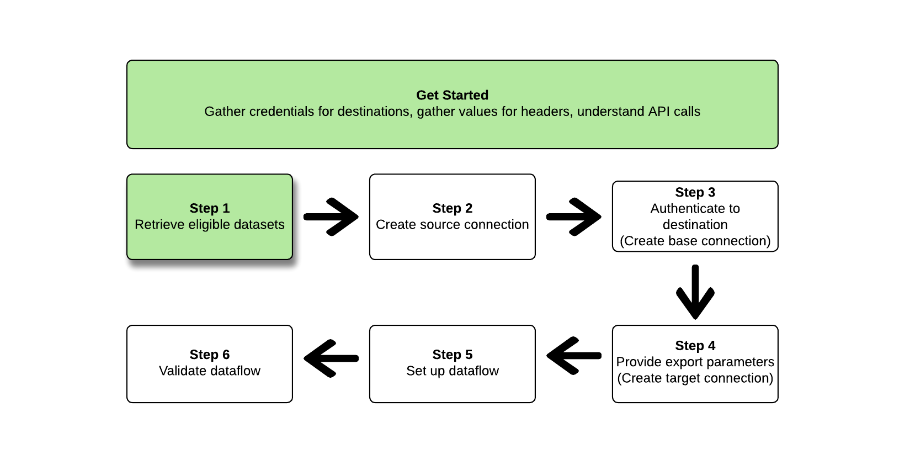

# Exporter des jeux de données à l’aide de l’[!DNL Flow Service API]

>[!AVAILABILITY]
>
>* Cette fonctionnalité est disponible pour les clients qui ont acheté le package Real-Time CDP Prime et Ultimate, Adobe Journey Optimizer ou Customer Journey Analytics. Pour plus d’informations, contactez votre représentant Adobe.

>[!IMPORTANT]
>
>**Action item** : la version [septembre 2024 d’Experience Platform](/help/release-notes/latest/latest.md#destinations) a introduit l’option permettant de définir une date `endTime` pour l’exportation des flux de données du jeu de données. Adobe a également introduit une date de fin par défaut du 1er septembre 2025 pour tous les flux de données d’exportation de jeux de données créés *avant la version de septembre 2024*.
>
>Pour l’un de ces flux de données, vous devez mettre à jour manuellement la date de fin du flux de données avant la date de fin, sinon vos exportations s’arrêteront à cette date. Utilisez l’interface utilisateur d’Experience Platform pour afficher les flux de données qui seront définis pour s’arrêter le 1er septembre 2025.
>
>De même, pour les flux de données que vous créez sans spécifier de date de `endTime`, ils prennent par défaut une heure de fin six mois à compter de leur création.

<!--

>You can retrieve a list of such dataflows by performing the following API call: `https://platform.adobe.io/data/foundation/flowservice/flows?property=scheduleParams.endTime==UNIXTIMESTAMPTHATWEWILLUSE`
>

-->

Cet article explique le processus requis pour utiliser l’[!DNL Flow Service API] afin d’exporter des [jeux de données](/help/catalog/datasets/overview.md) de Adobe Experience Platform vers l’emplacement d’espace de stockage de votre choix, comme des [!DNL Amazon S3], des emplacements SFTP ou des [!DNL Google Cloud Storage].

>[!TIP]
>
>Vous pouvez également utiliser l’interface utilisateur d’Experience Platform pour exporter des jeux de données. Pour plus d’informations, consultez le tutoriel [interface utilisateur d’exportation de jeux de données](/help/destinations/ui/export-datasets.md) .

## Jeux de données disponibles pour l’exportation {#datasets-to-export}

Les jeux de données que vous pouvez exporter dépendent de l’application Experience Platform (Real-Time CDP, Adobe Journey Optimizer), du niveau (Prime ou Ultimate) et des modules complémentaires que vous avez achetés (par exemple : Data Distiller).

Reportez-vous au [tableau de la page du tutoriel de l’interface utilisateur](/help/destinations/ui/export-datasets.md#datasets-to-export) pour comprendre les jeux de données que vous pouvez exporter.

## Destinations prises en charge {#supported-destinations}

Actuellement, vous pouvez exporter des jeux de données vers les destinations d’espace de stockage mises en surbrillance dans la capture d’écran et répertoriées ci-dessous.


* [[!DNL Azure Data Lake Storage Gen2]](../../destinations/catalog/cloud-storage/adls-gen2.md)
* [[!DNL Data Landing Zone]](../../destinations/catalog/cloud-storage/data-landing-zone.md)
* [[!DNL Google Cloud Storage]](../../destinations/catalog/cloud-storage/google-cloud-storage.md)
* [[!DNL Amazon S3]](../../destinations/catalog/cloud-storage/amazon-s3.md#changelog)
* [[!DNL Azure Blob]](../../destinations/catalog/cloud-storage/azure-blob.md#changelog)
* [[!DNL SFTP]](../../destinations/catalog/cloud-storage/sftp.md#changelog)

## Prérequis {#prerequisites}

Notez les conditions préalables suivantes pour exporter des jeux de données :

* Pour exporter des jeux de données vers des destinations d’espace de stockage, vous devez vous être [connecté à une destination](/help/destinations/ui/connect-destination.md). Si vous ne l’avez pas déjà fait, accédez au [catalogue de destinations](/help/destinations/catalog/overview.md), parcourez les destinations prises en charge et configurez la destination que vous souhaitez utiliser.
* Les jeux de données de profil doivent être activés pour être utilisés dans le profil client en temps réel. [En savoir plus](/help/ingestion/tutorials/ingest-batch-data.md#enable-for-profile) sur la manière d’activer cette option.

## Commencer {#get-started}


Ce guide nécessite une compréhension professionnelle des composants suivants d’Adobe Experience Platform :

* [[!DNL Experience Platform datasets]](/help/catalog/datasets/overview.md) : toutes les données correctement ingérées par Adobe Experience Platform sont conservées sous forme de jeux de données dans le [!DNL Data Lake]. Un jeu de données est une structure de stockage et de gestion pour la collecte de données, généralement sous la forme d’un tableau, qui contient un schéma (des colonnes) et des champs (des lignes). Les jeux de données contiennent également des métadonnées qui décrivent divers aspects des données stockées.
   * [[!DNL Sandboxes]](../../sandboxes/home.md) : [!DNL Experience Platform] fournit des sandbox virtuels qui divisent une instance [!DNL Experience Platform] unique en environnements virtuels distincts pour favoriser le développement et l’évolution d’applications d’expérience digitale.

Les sections suivantes apportent des informations supplémentaires dont vous aurez besoin afin d’exporter des jeux de données vers des destinations d’espace de stockage dans Experience Platform.

### Autorisations nécessaires {#permissions}

Pour exporter des jeux de données, vous avez besoin des autorisations de contrôle d’accès **[!UICONTROL Afficher les destinations]**, **[!UICONTROL Afficher les jeux de données]** et **[!UICONTROL Gérer et activer les destinations de jeu de données]** [&#128279;](/help/access-control/home.md#permissions). Lisez la [présentation du contrôle d’accès](/help/access-control/ui/overview.md) ou contactez votre administrateur de produit pour obtenir les autorisations requises.

Pour vous assurer que vous disposez des autorisations nécessaires pour exporter des jeux de données et que la destination prend en charge l’exportation de jeux de données, parcourez le catalogue des destinations. Si une destination comporte un contrôle **[!UICONTROL Activer]** ou **[!UICONTROL Exporter des jeux de données]**, vous disposez des autorisations appropriées.

### Lecture d’exemples d’appels API {#reading-sample-api-calls}

Ce tutoriel fournit des exemples d’appels API pour démontrer comment formater vos requêtes. Il s’agit notamment de chemins d’accès, d’en-têtes requis et de payloads de requêtes correctement formatés. L’exemple JSON renvoyé dans les réponses de l’API est également fourni. Pour plus d’informations sur les conventions utilisées dans la documentation pour les exemples d’appels d’API, voir la section concernant la [lecture d’exemples d’appels d’API](../../landing/troubleshooting.md#how-do-i-format-an-api-request) dans le guide de dépannage [!DNL Experience Platform].

### Collecter des valeurs pour les en-têtes obligatoires et facultatifs {#gather-values-headers}

Pour lancer des appels aux API [!DNL Experience Platform], vous devez d’abord suivre le tutoriel [Authentification Experience Platform](https://experienceleague.adobe.com/docs/experience-platform/landing/platform-apis/api-authentication.html?lang=fr). Le tutoriel d’authentification fournit les valeurs de chacun des en-têtes requis dans tous les appels d’API [!DNL Experience Platform], comme indiqué ci-dessous :

* Authorization: Bearer `{ACCESS_TOKEN}`
* x-api-key : `{API_KEY}`
* x-gw-ims-org-id : `{ORG_ID}`

Les ressources dans [!DNL Experience Platform] peuvent être isolées dans des sandbox spécifiques. Dans les requêtes aux API [!DNL Experience Platform], vous pouvez spécifier le nom et l’identifiant du sandbox dans lequel l’opération aura lieu. Il s’agit de paramètres facultatifs.

* x-sandbox-name : `{SANDBOX_NAME}`

>[!NOTE]
>
>Pour plus d’informations sur les sandbox dans [!DNL Experience Platform], consultez la [documentation de présentation des sandbox](../../sandboxes/home.md).

Toutes les requêtes qui contiennent un payload (POST, PUT, PATCH) nécessitent un en-tête de type de média supplémentaire :

* Content-Type: `application/json`

### Documentation de référence sur les API {#api-reference-documentation}

Ce tutoriel vous permet de trouver la documentation de référence relative à toutes les opérations API. Reportez-vous à la section [[!DNL Flow Service]  - Documentation de l’API Destinations sur le site web d’Adobe Developer](https://developer.adobe.com/experience-platform-apis/references/destinations/). Nous vous recommandons de consulter ce tutoriel et la documentation de référence sur les API en parallèle.

### Glossaire {#glossary}

Pour obtenir une description des termes que vous rencontrerez dans ce tutoriel sur l’API, consultez la [section glossaire](https://developer.adobe.com/experience-platform-apis/references/destinations/#tag/Glossary) de la documentation de référence de l’API.

### Rassemblez les spécifications de connexion et de flux pour la destination souhaitée. {#gather-connection-spec-flow-spec}

Avant de démarrer le workflow pour exporter un jeu de données, identifiez la spécification de connexion et les identifiants de spécification de flux de la destination vers laquelle vous envisagez d’exporter des jeux de données. Utilisez le tableau ci-dessous à titre de référence.


| Destination | Spécification de connexion | Spécification de flux |
---------|----------|---------|
| [!DNL Amazon S3] | `4fce964d-3f37-408f-9778-e597338a21ee` | `269ba276-16fc-47db-92b0-c1049a3c131f` |
| [!DNL Azure Blob Storage] | `6d6b59bf-fb58-4107-9064-4d246c0e5bb2` | `95bd8965-fc8a-4119-b9c3-944c2c2df6d2` |
| [!DNL Azure Data Lake Gen 2(ADLS Gen2)] | `be2c3209-53bc-47e7-ab25-145db8b873e1` | `17be2013-2549-41ce-96e7-a70363bec293` |
| [!DNL Data Landing Zone(DLZ)] | `10440537-2a7b-4583-ac39-ed38d4b848e8` | `cd2fc47e-e838-4f38-a581-8fff2f99b63a` |
| [!DNL Google Cloud Storage] | `c5d93acb-ea8b-4b14-8f53-02138444ae99` | `585c15c4-6cbf-4126-8f87-e26bff78b657` |
| SFTP | `36965a81-b1c6-401b-99f8-22508f1e6a26` | `354d6aad-4754-46e4-a576-1b384561c440` |

{style="table-layout:auto"}

Vous avez besoin de ces identifiants pour construire différentes entités [!DNL Flow Service]. Vous devez également vous reporter à des parties du [!DNL Connection Spec] lui-même pour configurer certaines entités afin de pouvoir récupérer les [!DNL Connection Spec] à partir de [!DNL Flow Service APIs]. Consultez les exemples ci-dessous de récupération des spécifications de connexion pour toutes les destinations du tableau :

>[!BEGINTABS]

>[!TAB Amazon S3]

**Requête**

+++Récupérer des [!DNL connection spec] pour [!DNL Amazon S3]

```shell
curl --location --request GET 'https://platform.adobe.io/data/foundation/flowservice/connectionSpecs/4fce964d-3f37-408f-9778-e597338a21ee' \
--header 'accept: application/json' \
--header 'x-api-key: {API_KEY}' \
--header 'x-gw-ims-org-id: {ORG_ID}' \
--header 'x-sandbox-name: {SANDBOX_NAME}' \
--header 'Authorization: Bearer {ACCESS_TOKEN}'
```

+++

**Réponse**

+++[!DNL Amazon S3] - Spécification de connexion

```json
{
    "items": [
        {
            "id": "4fce964d-3f37-408f-9778-e597338a21ee",
            "name": "Amazon S3",
            "providerId": "14e34fac-d307-11e9-bb65-2a2ae2dbcce4",
            "version": "1.0",
//...
```

+++

>[!TAB Stockage Azure Blob]

**Requête**

+++Récupérer des [!DNL connection spec] pour [!DNL Azure Blob Storage]

```shell
curl --location --request GET 'https://platform.adobe.io/data/foundation/flowservice/connectionSpecs/6d6b59bf-fb58-4107-9064-4d246c0e5bb2' \
--header 'accept: application/json' \
--header 'x-api-key: {API_KEY}' \
--header 'x-gw-ims-org-id: {ORG_ID}' \
--header 'x-sandbox-name: {SANDBOX_NAME}' \
--header 'Authorization: Bearer {ACCESS_TOKEN}'
```

+++

**Réponse**

+++[!DNL Azure Blob Storage] - [!DNL Connection spec]

```json
{
    "items": [
        {
            "id": "6d6b59bf-fb58-4107-9064-4d246c0e5bb2",
            "name": "Azure Blob Storage",
            "providerId": "14e34fac-d307-11e9-bb65-2a2ae2dbcce4",
            "version": "1.0",
//...
```

+++

>[!TAB Azure Data Lake Gen 2 (ADLS Gen2)]

**Requête**

+++Récupérer des [!DNL connection spec] pour [!DNL Azure Data Lake Gen 2(ADLS Gen2])

```shell
curl --location --request GET 'https://platform.adobe.io/data/foundation/flowservice/connectionSpecs/be2c3209-53bc-47e7-ab25-145db8b873e1' \
--header 'accept: application/json' \
--header 'x-api-key: {API_KEY}' \
--header 'x-gw-ims-org-id: {ORG_ID}' \
--header 'x-sandbox-name: {SANDBOX_NAME}' \
--header 'Authorization: Bearer {ACCESS_TOKEN}'
```

+++

**Réponse**

+++[!DNL Azure Data Lake Gen 2(ADLS Gen2)] - [!DNL Connection spec]

```json
{
    "items": [
        {
            "id": "be2c3209-53bc-47e7-ab25-145db8b873e1",
            "name": "Azure Data Lake Gen2",
            "providerId": "14e34fac-d307-11e9-bb65-2a2ae2dbcce4",
            "version": "1.0",
//...
```

+++

>[!TAB Zone d’atterrissage des données (DLZ)]

**Requête**

+++Récupérer des [!DNL connection spec] pour [!DNL Data Landing Zone(DLZ)]

```shell
curl --location --request GET 'https://platform.adobe.io/data/foundation/flowservice/connectionSpecs/10440537-2a7b-4583-ac39-ed38d4b848e8' \
--header 'accept: application/json' \
--header 'x-api-key: {API_KEY}' \
--header 'x-gw-ims-org-id: {ORG_ID}' \
--header 'x-sandbox-name: {SANDBOX_NAME}' \
--header 'Authorization: Bearer {ACCESS_TOKEN}'
```

+++

**Réponse**

+++[!DNL Data Landing Zone(DLZ)] - [!DNL Connection spec]

```json
{
    "items": [
        {
            "id": "10440537-2a7b-4583-ac39-ed38d4b848e8",
            "name": "Data Landing Zone",
            "providerId": "14e34fac-d307-11e9-bb65-2a2ae2dbcce4",
            "version": "1.0",
//...
```

+++

>[!TAB Google Cloud Storage]

**Requête**

+++Récupérer des [!DNL connection spec] pour [!DNL Google Cloud Storage]

```shell
curl --location --request GET 'https://platform.adobe.io/data/foundation/flowservice/connectionSpecs/c5d93acb-ea8b-4b14-8f53-02138444ae99' \
--header 'accept: application/json' \
--header 'x-api-key: {API_KEY}' \
--header 'x-gw-ims-org-id: {ORG_ID}' \
--header 'x-sandbox-name: {SANDBOX_NAME}' \
--header 'Authorization: Bearer {ACCESS_TOKEN}'
```

+++

**Réponse**

+++[!DNL Google Cloud Storage] - [!DNL Connection spec]

```json
{
    "items": [
        {
            "id": "c5d93acb-ea8b-4b14-8f53-02138444ae99",
            "name": "Google Cloud Storage",
            "providerId": "14e34fac-d307-11e9-bb65-2a2ae2dbcce4",
            "version": "1.0",
//...
```

+++

>[!TAB SFTP]

**Requête**

+++Récupération de [!DNL connection spec] pour SFTP

```shell
curl --location --request GET 'https://platform.adobe.io/data/foundation/flowservice/connectionSpecs/36965a81-b1c6-401b-99f8-22508f1e6a26' \
--header 'accept: application/json' \
--header 'x-api-key: {API_KEY}' \
--header 'x-gw-ims-org-id: {ORG_ID}' \
--header 'x-sandbox-name: {SANDBOX_NAME}' \
--header 'Authorization: Bearer {ACCESS_TOKEN}'
```

+++

**Réponse**

+++SFTP - [!DNL Connection spec]

```json
{
    "items": [
        {
            "id": "36965a81-b1c6-401b-99f8-22508f1e6a26",
            "name": "SFTP",
            "providerId": "14e34fac-d307-11e9-bb65-2a2ae2dbcce4",
            "version": "1.0",
//...
```

+++

>[!ENDTABS]

Suivez les étapes ci-dessous pour configurer un flux de données de jeu de données vers une destination d’espace de stockage. Pour certaines étapes, les requêtes et les réponses diffèrent entre les différentes destinations d’espace de stockage. Dans ce cas, utilisez les onglets de la page pour récupérer les requêtes et les réponses spécifiques à la destination à laquelle vous souhaitez vous connecter et exporter des jeux de données. Veillez à utiliser les [!DNL connection spec] et [!DNL flow spec] corrects pour la destination que vous configurez.

## Récupération d’une liste de jeux de données {#retrieve-list-of-available-datasets}



Pour récupérer une liste de jeux de données éligibles à l’activation, commencez par effectuer un appel API vers le point d’entrée ci-dessous.

>[!BEGINSHADEBOX]

**Requête**

+++Récupérer des jeux de données éligibles - Requête

```shell
curl --location --request GET 'https://platform.adobe.io/data/foundation/flowservice/connectionSpecs/23598e46-f560-407b-88d5-ea6207e49db0/configs?outputType=activationDatasets&outputField=datasets&start=0&limit=20&properties=name,state' \
--header 'accept: application/json' \
--header 'x-gw-ims-org-id: {ORG_ID}' \
--header 'x-api-key: {API_KEY}' \
--header 'x-sandbox-name: {SANDBOX_NAME}' \
--header 'Authorization: Bearer {ACCESS_TOKEN}'
```

Notez que pour récupérer les jeux de données éligibles, l’identifiant de [!DNL connection spec] utilisé dans l’URL de requête doit être l’identifiant de spécification de connexion à la source de lac de données, `23598e46-f560-407b-88d5-ea6207e49db0`, et les deux paramètres de requête `outputField=datasets` et `outputType=activationDatasets` doivent être spécifiés. Tous les autres paramètres de requête sont les paramètres standard pris en charge par l’[API Catalog Service](https://developer.adobe.com/experience-platform-apis/references/catalog/).

+++

**Réponse**

+++Récupération de jeux de données - Réponse

```json
{
    "items": [
        {
            "id": "5ef3e324052581191aa6a466",
            "name": "AAM Authenticated Profiles Meta Data",
            "description": "Activation profile export dataset",
            "fileDescription": {
                "persisted": true,
                "containerFormat": "parquet",
                "format": "parquet"
            },
            "aspect": "production",
            "state": "DRAFT"
        },
        {
            "id": "5ef3e3259ad2a1191ab7dd7d",
            "name": "AAM Devices Data",
            "description": "Activation profile export dataset",
            "fileDescription": {
                "persisted": true,
                "containerFormat": "parquet",
                "format": "parquet"
            },
            "aspect": "production",
            "state": "DRAFT"
        },
        {
            "id": "5ef3e325582424191b1beb42",
            "name": "AAM Devices Profile Meta Data",
            "description": "Activation profile export dataset",
            "fileDescription": {
                "persisted": true,
                "containerFormat": "parquet",
                "format": "parquet"
            },
            "aspect": "production",
            "state": "DRAFT"
        },
        {
            "id": "5ef3e328582424191b1beb44",
            "name": "AAM Realtime",
            "description": "Activation profile export dataset",
            "fileDescription": {
                "persisted": true,
                "containerFormat": "parquet",
                "format": "parquet"
            },
            "aspect": "production",
            "state": "DRAFT"
        },
        {
            "id": "5ef3e328fe742a191b2b3ea5",
            "name": "AAM Realtime Profile Updates",
            "description": "Activation profile export dataset",
            "fileDescription": {
                "persisted": true,
                "containerFormat": "parquet",
                "format": "parquet"
            },
            "aspect": "production",
            "state": "DRAFT"
        }
    ],
    "pageInfo": {
        "start": 0,
        "end": 4,
        "total": 149,
        "hasNext": true
    }
}
```

+++

>[!ENDSHADEBOX]

Une réponse réussie contient une liste de jeux de données éligibles à l’activation. Ces jeux de données peuvent être utilisés lors de la création de la connexion source à l’étape suivante.

Pour plus d’informations sur les différents paramètres de réponse pour chaque jeu de données renvoyé, consultez la [documentation destinée aux développeurs et développeuses de l’API Datasets](https://developer.adobe.com/experience-platform-apis/references/catalog/#tag/Datasets/operation/listDatasets).

## Créer une connexion source {#create-source-connection}


Après avoir récupéré la liste des jeux de données que vous souhaitez exporter, vous pouvez créer une connexion source à l’aide de ces identifiants de jeu de données.

>[!BEGINSHADEBOX]

**Requête**

+++Créer une connexion source - Requête

Notez les lignes en surbrillance avec des commentaires intégrés dans l’exemple de requête, qui fournissent des informations supplémentaires. Supprimez les commentaires intégrés dans la requête lors du copier-coller de la requête dans le terminal de votre choix.

```shell {line-numbers="true" start-line="1" highlight="12,16"}
curl --location --request POST 'https://platform.adobe.io/data/foundation/flowservice/sourceConnections' \
--header 'accept: application/json' \
--header 'x-api-key: {API_KEY}' \
--header 'x-gw-ims-org-id: {ORG_ID}' \
--header 'x-sandbox-name: {SANDBOX_NAME}' \
--header 'Content-Type: application/json' \
--header 'Authorization: Bearer {ACCESS_TOKEN}' \
--data-raw '{
  "name": "Connecting to Data Lake",
  "description": "Data Lake source connection to export datasets",
  "connectionSpec": {
    "id": "23598e46-f560-407b-88d5-ea6207e49db0", // this connection spec ID is always the same for Source Connections
    "version": "1.0"
  },
  "params": {
    "datasets": [ // datasets to activate
      {
        "dataSetId": "5ef3e3259ad2a1191ab7dd7d",
        "name": "AAM Devices Data"
      }
    ]
  }
}'
```

+++


**Réponse**

+++Créer une connexion source - Réponse

```json
{
    "id": "900df191-b983-45cd-90d5-4c7a0326d650",
    "etag": "\"0500ebe1-0000-0200-0000-63e28d060000\""
}
```

+++

>[!ENDSHADEBOX]

Une réponse réussie renvoie l’identifiant (`id`) de la connexion source nouvellement créée et un `etag`. Notez l’identifiant de connexion source, car vous en aurez besoin ultérieurement lors de la création du flux de données.

N&#39;oubliez pas non plus que :

* La connexion source créée à cette étape doit être liée à un flux de données pour que ses jeux de données soient activés vers une destination. Consultez la section [Créer un flux de données](#create-dataflow) pour plus d’informations sur la liaison d’une connexion source à un flux de données.
* Les identifiants du jeu de données d’une connexion source ne peuvent pas être modifiés après la création. Si vous devez ajouter ou supprimer des jeux de données d’une connexion source, vous devez créer une connexion source et lier l’identifiant de la nouvelle connexion source au flux de données.

## Créer une connexion de base (cible) {#create-base-connection}


Une connexion de base stocke en toute sécurité les informations d’identification vers la destination. Selon le type de destination, les informations d’identification nécessaires pour s’authentifier sur cette destination peuvent varier. Pour trouver ces paramètres d’authentification, récupérez d’abord le [!DNL connection spec] de la destination souhaitée, comme décrit dans la section [Collecter les spécifications de connexion et de flux](#gather-connection-spec-flow-spec), puis examinez le `authSpec` de la réponse. Référencez les onglets ci-dessous pour les propriétés `authSpec` de toutes les destinations prises en charge.

>[!BEGINTABS]

>[!TAB Amazon S3]

+++[!DNL Amazon S3] - [!DNL Connection spec] des [!DNL auth spec]

Notez la ligne en surbrillance avec des commentaires intégrés dans l’exemple de [!DNL connection spec] ci-dessous, qui fournissent des informations supplémentaires sur l’emplacement des paramètres d’authentification dans le [!DNL connection spec].

```json {line-numbers="true" start-line="1" highlight="8"}
{
    "items": [
        {
            "id": "4fce964d-3f37-408f-9778-e597338a21ee",
            "name": "Amazon S3",
            "providerId": "14e34fac-d307-11e9-bb65-2a2ae2dbcce4",
            "version": "1.0",
            "authSpec": [ // describes the authentication parameters
                {
                    "name": "Access Key",
                    "type": "KeyBased",
                    "spec": {
                        "$schema": "http://json-schema.org/draft-07/schema#",
                        "description": "Defines auth params required for connecting to amazon-s3",
                        "type": "object",
                        "properties": {
                            "s3AccessKey": {
                                "description": "Access key id",
                                "type": "string",
                                "pattern": "^[A-Z2-7]{20}$"
                            },
                            "s3SecretKey": {
                                "description": "Secret access key for the user account",
                                "type": "string",
                                "format": "password",
                                "pattern": "^[A-Za-z0-9\/\\+]{40}$"
                            }
                        },
                        "required": [
                            "s3SecretKey",
                            "s3AccessKey"
                        ]
                    }
                }
            ],
//...
```

+++

>[!TAB Stockage Azure Blob]

+++[!DNL Azure Blob Storage] - [!DNL Connection spec] des [!DNL auth spec]

Notez la ligne en surbrillance avec des commentaires intégrés dans l’exemple de [!DNL connection spec] ci-dessous, qui fournissent des informations supplémentaires sur l’emplacement des paramètres d’authentification dans le [!DNL connection spec].

```json {line-numbers="true" start-line="1" highlight="8"}
{
    "items": [
        {
            "id": "6d6b59bf-fb58-4107-9064-4d246c0e5bb2",
            "name": "Azure Blob Storage",
            "providerId": "14e34fac-d307-11e9-bb65-2a2ae2dbcce4",
            "version": "1.0",
            "authSpec": [ // describes the authentication parameters
                {
                    "name": "ConnectionString",
                    "type": "ConnectionString",
                    "spec": {
                        "$schema": "http://json-schema.org/draft-07/schema#",
                        "description": "Connection String for Azure Blob based destinations",
                        "type": "object",
                        "properties": {
                            "connectionString": {
                                "description": "connection string for login",
                                "type": "string",
                                "format": "password"
                            }
                        },
                        "required": [
                            "connectionString"
                        ]
                    }
                }
            ],
//...
```

+++


>[!TAB Azure Data Lake Gen 2 (ADLS Gen2)]

+++[!DNL Azure Data Lake Gen 2(ADLS Gen2)] - [!DNL Connection spec] des [!DNL auth spec]

Notez la ligne en surbrillance avec des commentaires intégrés dans l’exemple de [!DNL connection spec] ci-dessous, qui fournissent des informations supplémentaires sur l’emplacement des paramètres d’authentification dans le [!DNL connection spec].

```json {line-numbers="true" start-line="1" highlight="8"}
{
    "items": [
        {
            "id": "be2c3209-53bc-47e7-ab25-145db8b873e1",
            "name": "Azure Data Lake Gen2",
            "providerId": "14e34fac-d307-11e9-bb65-2a2ae2dbcce4",
            "version": "1.0",
            "authSpec": [ // describes the authentication parameters
                {
                    "name": "Azure Service Principal Auth",
                    "type": "AzureServicePrincipal",
                    "spec": {
                        "$schema": "http://json-schema.org/draft-07/schema#",
                        "description": "defines auth params required for connecting to adlsgen2 using service principal",
                        "type": "object",
                        "properties": {
                            "url": {
                                "description": "Endpoint for Azure Data Lake Storage Gen2.",
                                "type": "string"
                            },
                            "servicePrincipalId": {
                                "description": "Service Principal Id to connect to ADLSGen2.",
                                "type": "string"
                            },
                            "servicePrincipalKey": {
                                "description": "Service Principal Key to connect to ADLSGen2.",
                                "type": "string",
                                "format": "password"
                            },
                            "tenant": {
                                "description": "Tenant information(domain name or tenant ID).",
                                "type": "string"
                            }
                        },
                        "required": [
                            "servicePrincipalKey",
                            "url",
                            "tenant",
                            "servicePrincipalId"
                        ]
                    }
                }
            ],
//...
```

+++


>[!TAB Zone d’atterrissage des données (DLZ)]

+++[!DNL Data Landing Zone(DLZ)] - [!DNL Connection spec] des [!DNL auth spec]

>[!NOTE]
>
>La destination Data Landing Zone ne nécessite pas de [!DNL auth spec].

```json
{
    "items": [
        {
            "id": "10440537-2a7b-4583-ac39-ed38d4b848e8",
            "name": "Data Landing Zone",
            "providerId": "14e34fac-d307-11e9-bb65-2a2ae2dbcce4",
            "version": "1.0",
            "authSpec": [],
//...
```

+++

>[!TAB Google Cloud Storage]

+++[!DNL Google Cloud Storage] - [!DNL Connection spec] des [!DNL auth spec]

Notez la ligne en surbrillance avec des commentaires intégrés dans l’exemple de [!DNL connection spec] ci-dessous, qui fournissent des informations supplémentaires sur l’emplacement des paramètres d’authentification dans le [!DNL connection spec].

```json {line-numbers="true" start-line="1" highlight="8"}
{
    "items": [
        {
            "id": "c5d93acb-ea8b-4b14-8f53-02138444ae99",
            "name": "Google Cloud Storage",
            "providerId": "14e34fac-d307-11e9-bb65-2a2ae2dbcce4",
            "version": "1.0",
            "authSpec": [ // describes the authentication parameters
                {
                    "name": "Google Cloud Storage authentication credentials",
                    "type": "GoogleCloudStorageAuth",
                    "spec": {
                        "$schema": "http://json-schema.org/draft-07/schema#",
                        "description": "defines auth params required for connecting to google cloud storage connector.",
                        "type": "object",
                        "properties": {
                            "accessKeyId": {
                                "description": "Access Key Id for the user account",
                                "type": "string"
                            },
                            "secretAccessKey": {
                                "description": "Secret Access Key for the user account",
                                "type": "string",
                                "format": "password"
                            }
                        },
                        "required": [
                            "accessKeyId",
                            "secretAccessKey"
                        ]
                    }
                }
            ],
//...
```

+++

>[!TAB SFTP]

+++SFTP - [!DNL Connection spec] affichant les [!DNL auth spec]

>[!NOTE]
>
>La destination SFTP contient deux éléments distincts dans le [!DNL auth spec], car elle prend en charge le mot de passe et l’authentification par clé SSH.

Notez la ligne en surbrillance avec des commentaires intégrés dans l’exemple de [!DNL connection spec] ci-dessous, qui fournissent des informations supplémentaires sur l’emplacement des paramètres d’authentification dans le [!DNL connection spec].

```json {line-numbers="true" start-line="1" highlight="8"}
{
    "items": [
        {
            "id": "36965a81-b1c6-401b-99f8-22508f1e6a26",
            "name": "SFTP",
            "providerId": "14e34fac-d307-11e9-bb65-2a2ae2dbcce4",
            "version": "1.0",
            "authSpec": [ // describes the authentication parameters
                {
                    "name": "SFTP with Password",
                    "type": "SFTP",
                    "spec": {
                        "$schema": "http://json-schema.org/draft-07/schema#",
                        "description": "defines auth params required for connecting to sftp locations with a password",
                        "type": "object",
                        "properties": {
                            "domain": {
                                "description": "Domain of server",
                                "type": "string"
                            },
                            "username": {
                                "description": "Username",
                                "type": "string"
                            },
                            "password": {
                                "description": "Password",
                                "type": "string",
                                "format": "password"
                            }
                        },
                        "required": [
                            "password",
                            "domain",
                            "username"
                        ]
                    }
                },
                {
                    "name": "SFTP with SSH Key",
                    "type": "SFTP",
                    "spec": {
                        "$schema": "http://json-schema.org/draft-07/schema#",
                        "description": "defines auth params required for connecting to sftp locations using SSH Key",
                        "type": "object",
                        "properties": {
                            "domain": {
                                "description": "Domain of server",
                                "type": "string"
                            },
                            "username": {
                                "description": "Username",
                                "type": "string"
                            },
                            "sshKey": {
                                "description": "Base64 string of the private SSH key",
                                "type": "string",
                                "format": "password",
                                "contentEncoding": "base64",
                                "uiAttributes": {
                                    "tooltip": {
                                        "id": "platform_destinations_connect_sftp_ssh",
                                        "fallbackUrl": "http://www.adobe.com/go/destinations-sftp-connection-parameters-en "
                                    }
                                }
                            }
                        },
                        "required": [
                            "sshKey",
                            "domain",
                            "username"
                        ]
                    }
                }
            ],
//...
```

+++

>[!ENDTABS]

À l’aide des propriétés spécifiées dans la spécification d’authentification (c’est-à-dire `authSpec` à partir de la réponse), vous pouvez créer une connexion de base avec les informations d’identification requises, spécifiques à chaque type de destination, comme illustré dans les exemples ci-dessous :

>[!BEGINTABS]

>[!TAB Amazon S3]

**Requête**

+++[!DNL Amazon S3] - Demande de connexion de base

>[!TIP]
>
>Pour plus d’informations sur l’obtention des informations d’authentification requises, reportez-vous à la section [Authentifier à la destination](/help/destinations/catalog/cloud-storage/amazon-s3.md#authenticate) de la page de documentation sur la destination Amazon S3.

Notez les lignes en surbrillance avec des commentaires intégrés dans l’exemple de requête, qui fournissent des informations supplémentaires. Supprimez les commentaires intégrés dans la requête lors du copier-coller de la requête dans le terminal de votre choix.

```shell {line-numbers="true" start-line="1" highlight="18"}
curl --location --request POST 'https://platform.adobe.io/data/foundation/flowservice/connections' \
--header 'accept: application/json' \
--header 'Authorization: Bearer {ACCESS_TOKEN}' \
--header 'x-api-key: <API-KEY>' \
--header 'x-gw-ims-org-id: <IMS-ORG-ID>' \
--header 'x-sandbox-name: <SANDBOX-NAME>' \
--header 'Content-Type: application/json' \
--data-raw '{
  "name": "Amazon S3 Base Connection",
  "auth": {
    "specName": "Access Key",
    "params": {
      "s3SecretKey": "<Add secret key>",
      "s3AccessKey": "<Add access key>"
    }
  },
  "connectionSpec": {
    "id": "4fce964d-3f37-408f-9778-e597338a21ee", // Amazon S3 connection spec
    "version": "1.0"
  }
}'
```

+++

**Réponse**

+++[!DNL Amazon S3] réponse de connexion de base

```json
{
    "id": "12401496-2573-4ca7-8137-fef1aeb9dd4c",
    "etag": "\"0000d781-0000-0200-0000-63e29f420000\""
}
```

+++

>[!TAB Stockage Azure Blob]

**Requête**

+++[!DNL Azure Blob Storage] - Demande de connexion de base

>[!TIP]
>
>Pour plus d’informations sur l’obtention des informations d’authentification requises, reportez-vous à la section [Authentifier à la destination](/help/destinations/catalog/cloud-storage/azure-blob.md#authenticate) de la page de documentation sur la destination Azure Blob Storage.

Notez les lignes en surbrillance avec des commentaires intégrés dans l’exemple de requête, qui fournissent des informations supplémentaires. Supprimez les commentaires intégrés dans la requête lors du copier-coller de la requête dans le terminal de votre choix.

```shell {line-numbers="true" start-line="1" highlight="16"}
curl --location --request POST 'https://platform.adobe.io/data/foundation/flowservice/connections' \
--header 'accept: application/json' \
--header 'Authorization: Bearer {ACCESS_TOKEN}' \
--header 'x-api-key: <API-KEY>' \
--header 'x-gw-ims-org-id: <IMS-ORG-ID>' \
--header 'x-sandbox-name: <SANDBOX-NAME>' \
--header 'Content-Type: application/json' \
--data-raw '{
  "name": "Azure Blob Storage Base Connection",
  "auth": {
    "specName": "ConnectionString",
    "params": {
      "connectionString": "<Add Azure Blob connection string>"
    }
  },
  "connectionSpec": {
    "id": "6d6b59bf-fb58-4107-9064-4d246c0e5bb2", // Azure Blob Storage connection spec
    "version": "1.0"
  }
}'
```

+++

**Réponse**

+++[!DNL Azure Blob Storage] - Réponse de la connexion de base

```json
{
    "id": "12401496-2573-4ca7-8137-fef1aeb9dd4c",
    "etag": "\"0000d781-0000-0200-0000-63e29f420000\""
}
```

+++

>[!TAB Azure Data Lake Gen 2 (ADLS Gen2)]

**Requête**

+++[!DNL Azure Data Lake Gen 2(ADLS Gen2)] - Demande de connexion de base

>[!TIP]
>
>Pour plus d’informations sur l’obtention des informations d’authentification requises, reportez-vous à la section [Authentifier à la destination](/help/destinations/catalog/cloud-storage/adls-gen2.md#authenticate) de la page de documentation de destination Azure Data Lake Gen 2 (ADLS Gen2) .

Notez les lignes en surbrillance avec des commentaires intégrés dans l’exemple de requête, qui fournissent des informations supplémentaires. Supprimez les commentaires intégrés dans la requête lors du copier-coller de la requête dans le terminal de votre choix.

```shell {line-numbers="true" start-line="1" highlight="20"}
curl --location --request POST 'https://platform.adobe.io/data/foundation/flowservice/connections' \
--header 'accept: application/json' \
--header 'Authorization: Bearer {ACCESS_TOKEN}' \
--header 'x-api-key: <API-KEY>' \
--header 'x-gw-ims-org-id: <IMS-ORG-ID>' \
--header 'x-sandbox-name: <SANDBOX-NAME>' \
--header 'Content-Type: application/json' \
--data-raw '{
  "name": "Azure Data Lake Gen 2(ADLS Gen2) Base Connection",
  "auth": {
    "specName": "Azure Service Principal Auth",
    "params": {
      "servicePrincipalKey": "<Add servicePrincipalKey>",
      "url": "<Add url>",
      "tenant": "<Add tenant>",
      "servicePrincipalId": "<Add servicePrincipalId>"
    }
  },
  "connectionSpec": {
    "id": "be2c3209-53bc-47e7-ab25-145db8b873e1", // Azure Data Lake Gen 2(ADLS Gen2) connection spec
    "version": "1.0"
  }
}'
```

+++

**Réponse**

+++[!DNL Azure Data Lake Gen 2(ADLS Gen2)] - Réponse de la connexion de base

```json
{
    "id": "12401496-2573-4ca7-8137-fef1aeb9dd4c",
    "etag": "\"0000d781-0000-0200-0000-63e29f420000\""
}
```

+++

>[!TAB Zone d’atterrissage des données (DLZ)]

**Requête**

+++[!DNL Data Landing Zone(DLZ)] - Demande de connexion de base

>[!TIP]
>
>Aucune information d’authentification n’est requise pour la destination Data Landing Zone. Pour plus d’informations, reportez-vous à la section [authentification à la destination](/help/destinations/catalog/cloud-storage/data-landing-zone.md#authenticate) de la page de documentation sur la destination Data Landing Zone.

```shell
curl --location --request POST 'https://platform.adobe.io/data/foundation/flowservice/connections' \
--header 'accept: application/json' \
--header 'Authorization: Bearer {ACCESS_TOKEN}' \
--header 'x-api-key: <API-KEY>' \
--header 'x-gw-ims-org-id: <IMS-ORG-ID>' \
--header 'x-sandbox-name: <SANDBOX-NAME>' \
--header 'Content-Type: application/json' \
--data-raw '{
  "name": "Data Landing Zone Base Connection",
  "connectionSpec": {
    "id": "3567r537-2a7b-4583-ac39-ed38d4b848e8",
    "version": "1.0"
  }
}'
```

+++

**Réponse**

+++[!DNL Data Landing Zone] - Réponse de la connexion de base

```json
{
    "id": "12401496-2573-4ca7-8137-fef1aeb9dd4c",
    "etag": "\"0000d781-0000-0200-0000-63e29f420000\""
}
```

+++

>[!TAB Google Cloud Storage]

**Requête**

+++[!DNL Google Cloud Storage] - Demande de connexion de base

>[!TIP]
>
>Pour plus d’informations sur l’obtention des informations d’authentification requises, reportez-vous à la section [S’authentifier à la destination](/help/destinations/catalog/cloud-storage/google-cloud-storage.md#authenticate) de la page de documentation sur la destination Google Cloud Storage.

Notez les lignes en surbrillance avec des commentaires intégrés dans l’exemple de requête, qui fournissent des informations supplémentaires. Supprimez les commentaires intégrés dans la requête lors du copier-coller de la requête dans le terminal de votre choix.

```shell {line-numbers="true" start-line="1" highlight="18"}
curl --location --request POST 'https://platform.adobe.io/data/foundation/flowservice/connections' \
--header 'accept: application/json' \
--header 'Authorization: Bearer {ACCESS_TOKEN}' \
--header 'x-api-key: <API-KEY>' \
--header 'x-gw-ims-org-id: <IMS-ORG-ID>' \
--header 'x-sandbox-name: <SANDBOX-NAME>' \
--header 'Content-Type: application/json' \
--data-raw '{
  "name": "Google Cloud Storage Base Connection",
  "auth": {
    "specName": "Google Cloud Storage authentication credentials",
    "params": {
      "accessKeyId": "<Add accessKeyId>",
      "secretAccessKey": "<Add secret Access Key>"
    }
  },
  "connectionSpec": {
    "id": "c5d93acb-ea8b-4b14-8f53-02138444ae99", // Google Cloud Storage connection spec
    "version": "1.0"
  }
}'
```

+++

**Réponse**

+++[!DNL Google Cloud Storage] - Réponse de la connexion de base

```json
{
    "id": "12401496-2573-4ca7-8137-fef1aeb9dd4c",
    "etag": "\"0000d781-0000-0200-0000-63e29f420000\""
}
```

+++

>[!TAB SFTP]

**Requête**

+++SFTP avec mot de passe - Demande de connexion de base

>[!TIP]
>
>Pour plus d’informations sur l’obtention des informations d’authentification requises, reportez-vous à la section [Authentifier à la destination](/help/destinations/catalog/cloud-storage/sftp.md#authentication-information) de la page de documentation de la destination SFTP.

Notez les lignes en surbrillance avec des commentaires intégrés dans l’exemple de requête, qui fournissent des informations supplémentaires. Supprimez les commentaires intégrés dans la requête lors du copier-coller de la requête dans le terminal de votre choix.

```shell {line-numbers="true" start-line="1" highlight="19"}
curl --location --request POST 'https://platform.adobe.io/data/foundation/flowservice/connections' \
--header 'accept: application/json' \
--header 'Authorization: Bearer {ACCESS_TOKEN}' \
--header 'x-api-key: <API-KEY>' \
--header 'x-gw-ims-org-id: <IMS-ORG-ID>' \
--header 'x-sandbox-name: <SANDBOX-NAME>' \
--header 'Content-Type: application/json' \
--data-raw '{
  "name": "SFTP with password Base Connection",
  "auth": {
    "specName": "SFTP with Password",
    "params": {
      "domain": "<Add domain>",
      "username": "<Add username>",
      "password": "<Add password>"
    }
  },
  "connectionSpec": {
    "id": "36965a81-b1c6-401b-99f8-22508f1e6a26", // SFTP connection spec
    "version": "1.0"
  }
}'
```

+++

+++SFTP avec clé SSH - Demande de connexion de base

>[!TIP]
>
>Pour plus d’informations sur l’obtention des informations d’authentification requises, reportez-vous à la section [Authentifier à la destination](/help/destinations/catalog/cloud-storage/sftp.md#authentication-information) de la page de documentation de la destination SFTP.

Notez les lignes en surbrillance avec des commentaires intégrés dans l’exemple de requête, qui fournissent des informations supplémentaires. Supprimez les commentaires intégrés dans la requête lors du copier-coller de la requête dans le terminal de votre choix.

```shell {line-numbers="true" start-line="1" highlight="19"}
curl --location --request POST 'https://platform.adobe.io/data/foundation/flowservice/connections' \
--header 'accept: application/json' \
--header 'Authorization: Bearer {ACCESS_TOKEN}' \
--header 'x-api-key: <API-KEY>' \
--header 'x-gw-ims-org-id: <IMS-ORG-ID>' \
--header 'x-sandbox-name: <SANDBOX-NAME>' \
--header 'Content-Type: application/json' \
--data-raw '{
  "name": "SFTP with SSH key Base Connection",
  "auth": {
    "specName": "SFTP with SSH Key",
    "params": {
      "domain": "<Add domain>",
      "username": "<Add username>",
      "sshKey": "<Add SSH key>"
    }
  },
  "connectionSpec": {
    "id": "36965a81-b1c6-401b-99f8-22508f1e6a26", // SFTP connection spec
    "version": "1.0"
  }
}'
```

+++

**Réponse**

+++SFTP - Réponse de la connexion de base

```json
{
    "id": "12401496-2573-4ca7-8137-fef1aeb9dd4c",
    "etag": "\"0000d781-0000-0200-0000-63e29f420000\""
}
```

+++

>[!ENDTABS]

Notez l’ID de connexion à partir de la réponse. Cet identifiant sera requis à l’étape suivante lors de la création de la connexion cible.

## Créer une connexion cible {#create-target-connection}


Ensuite, vous devez créer une connexion cible qui stocke les paramètres d’exportation de vos jeux de données. Les paramètres d’exportation incluent l’emplacement, le format de fichier, la compression et d’autres détails. Reportez-vous aux propriétés `targetSpec` fournies dans la spécification de connexion de la destination pour comprendre les propriétés prises en charge pour chaque type de destination. Référencez les onglets ci-dessous pour les propriétés `targetSpec` de toutes les destinations prises en charge.

>[!IMPORTANT]
>
>Les exportations vers des fichiers JSON sont uniquement prises en charge en mode compressé. Les exportations vers des fichiers [!DNL Parquet] sont prises en charge dans les modes compressé et non compressé.
>
>Le format du fichier JSON exporté est NDJSON, qui est le format d’échange standard dans l’écosystème Big Data. Adobe recommande d’utiliser un client compatible NDJSON pour lire les fichiers exportés.

>[!BEGINTABS]

>[!TAB Amazon S3]

+++[!DNL Amazon S3] - [!DNL Connection spec] affichant les paramètres de connexion cible

Notez les lignes mises en surbrillance avec des commentaires intégrés dans l’exemple de [!DNL connection spec] ci-dessous, qui fournissent des informations supplémentaires sur l’emplacement des paramètres de [!DNL target spec] dans la spécification de connexion. Vous pouvez également voir dans l’exemple ci-dessous quels paramètres cibles ne s’appliquent *pas* aux destinations d’exportation de jeux de données.

```json {line-numbers="true" start-line="1" highlight="10,41,56"}
{
    "items": [
        {
            "id": "4fce964d-3f37-408f-9778-e597338a21ee",
            "name": "Amazon S3",
            "providerId": "14e34fac-d307-11e9-bb65-2a2ae2dbcce4",
            "version": "1.0",
            "authSpec": [...],
            "encryptionSpecs": [...],
            "targetSpec": { // describes the target connection parameters
                "name": "User based target",
                "type": "UserNamespace",
                "spec": {
                    "$schema": "http://json-schema.org/draft-07/schema#",
                    "type": "object",
                    "properties": {
                        "bucketName": {
                            "title": "Bucket name",
                            "description": "Bucket name",
                            "type": "string",
                            "pattern": "(?=^.{3,63}$)(?!^(\\d+\\.)+\\d+$)(^(([a-z0-9]|[a-z0-9][a-z0-9\\-]*[a-z0-9])\\.)*([a-z0-9]|[a-z0-9][a-z0-9\\-]*[a-z0-9])$)",
                            "uiAttributes": {
                                "tooltip": {
                                    "id": "platform_destinations_connect_s3_bucket",
                                    "fallbackUrl": "http://www.adobe.com/go/destinations-amazon-s3-connection-parameters-en"
                                }
                            }
                        },
                        "path": {
                            "title": "Folder path",
                            "description": "Output path for copying files",
                            "type": "string",
                            "pattern": "^[0-9a-zA-Z\/\\!\\-_\\.\\*\\''\\(\\)]*((\\%SEGMENT_(NAME|ID)\\%)?\/?)+$",
                            "uiAttributes": {
                                "tooltip": {
                                    "id": "platform_destinations_connect_s3_folderpath",
                                    "fallbackUrl": "http://www.adobe.com/go/destinations-amazon-s3-connection-parameters-en"
                                }
                            }
                        },
                        "fileType": {...}, // not applicable to dataset destinations
                        "datasetFileType": {
                            "conditional": {
                                "field": "flowSpec.attributes._workflow",
                                "operator": "CONTAINS",
                                "value": "DATASETS"
                            },
                            "title": "File Type",
                            "description": "Select file format",
                            "type": "string",
                            "enum": [
                                "JSON",
                                "PARQUET"
                            ]
                        },
                        "csvOptions": {...}, // not applicable to dataset destinations
                        "compression": {
                            "title": "Compression format",
                            "description": "Select the desired file compression format.",
                            "type": "string",
                            "enum": [
                                "NONE",
                                "GZIP"
                            ]
                        }
                    },
                    "required": [
                        "bucketName",
                        "path",
                        "datasetFileType",
                        "compression",
                        "fileType"
                    ]
                }
//...
```

+++

>[!TAB Stockage Azure Blob]

+++[!DNL Azure Blob Storage] - [!DNL Connection spec] affichant les paramètres de connexion cible

Notez les lignes mises en surbrillance avec des commentaires intégrés dans l’exemple de [!DNL connection spec] ci-dessous, qui fournissent des informations supplémentaires sur l’emplacement des paramètres de [!DNL target spec] dans la spécification de connexion. Vous pouvez également voir dans l’exemple ci-dessous quels paramètres cibles ne s’appliquent *pas* aux destinations d’exportation de jeux de données.

```json {line-numbers="true" start-line="1" highlight="10,29,44"}
{
    "items": [
        {
            "id": "6d6b59bf-fb58-4107-9064-4d246c0e5bb2",
            "name": "Azure Blob Storage",
            "providerId": "14e34fac-d307-11e9-bb65-2a2ae2dbcce4",
            "version": "1.0",
            "authSpec": [...],
            "encryptionSpecs": [...],
            "targetSpec": { // describes the target connection parameters
                "name": "User based target",
                "type": "UserNamespace",
                "spec": {
                    "$schema": "http://json-schema.org/draft-07/schema#",
                    "type": "object",
                    "properties": {
                        "path": {
                            "title": "Folder path",
                            "description": "Output path (relative) indicating where to upload the data",
                            "type": "string",
                            "pattern": "^[0-9a-zA-Z\/\\!\\-_\\.\\*\\'\\(\\)]+$"
                        },
                        "container": {
                            "title": "Container",
                            "description": "Container within the storage where to upload the data",
                            "type": "string",
                            "pattern": "^[a-z0-9](?!.*--)[a-z0-9-]{1,61}[a-z0-9]$"
                        },
                        "fileType": {...}, // not applicable to dataset destinations
                        "datasetFileType": {
                            "conditional": {
                                "field": "flowSpec.attributes._workflow",
                                "operator": "CONTAINS",
                                "value": "DATASETS"
                            },
                            "title": "File Type",
                            "description": "Select file format",
                            "type": "string",
                            "enum": [
                                "JSON",
                                "PARQUET"
                            ]
                        },
                        "csvOptions": {...}, // not applicable to dataset destinations
                        "compression": {
                            "title": "Compression format",
                            "description": "Select the desired file compression format.",
                            "type": "string",
                            "enum": [
                                "NONE",
                                "GZIP"
                            ]
                        }
                    },
                    "required": [
                        "container",
                        "path",
                        "datasetFileType",
                        "compression",
                        "fileType"
                    ]
                }
//...
```

+++


>[!TAB Azure Data Lake Gen 2 (ADLS Gen2)]

+++[!DNL Azure Data Lake Gen 2(ADLS Gen2)] - [!DNL Connection spec] affichant les paramètres de connexion cible

Notez les lignes mises en surbrillance avec des commentaires intégrés dans l’exemple de [!DNL connection spec] ci-dessous, qui fournissent des informations supplémentaires sur l’emplacement des paramètres de [!DNL target spec] dans la spécification de connexion. Vous pouvez également voir dans l’exemple ci-dessous quels paramètres cibles ne s’appliquent *pas* aux destinations d’exportation de jeux de données.

```json {line-numbers="true" start-line="1" highlight="10,22,37"}
{
    "items": [
        {
            "id": "be2c3209-53bc-47e7-ab25-145db8b873e1",
            "name": "Azure Data Lake Gen2",
            "providerId": "14e34fac-d307-11e9-bb65-2a2ae2dbcce4",
            "version": "1.0",
            "authSpec": [...],
            "encryptionSpecs": [...],
            "targetSpec": { // describes the target connection parameters
                "name": "User based target",
                "type": "UserNamespace",
                "spec": {
                    "$schema": "http://json-schema.org/draft-07/schema#",
                    "type": "object",
                    "properties": {
                        "path": {
                            "title": "Folder path",
                            "description": "Enter the path to your Azure Data Lake Storage folder",
                            "type": "string"
                        },
                        "fileType": {...}, // not applicable to dataset destinations
                        "datasetFileType": {
                            "conditional": {
                                "field": "flowSpec.attributes._workflow",
                                "operator": "CONTAINS",
                                "value": "DATASETS"
                            },
                            "title": "File Type",
                            "description": "Select file format",
                            "type": "string",
                            "enum": [
                                "JSON",
                                "PARQUET"
                            ]
                        },
                        "csvOptions":{...}, // not applicable to dataset destinations
                        "compression": {
                            "title": "Compression format",
                            "description": "Select the desired file compression format.",
                            "type": "string",
                            "enum": [
                                "NONE",
                                "GZIP"
                            ]
                        }
                    },
                    "required": [
                        "path",
                        "datasetFileType",
                        "compression",
                        "fileType"
                    ]
                }
//...
```

+++

>[!TAB Zone d’atterrissage des données (DLZ)]

+++[!DNL Data Landing Zone(DLZ)] - [!DNL Connection spec] affichant les paramètres de connexion cible

Notez les lignes mises en surbrillance avec des commentaires intégrés dans l’exemple de [!DNL connection spec] ci-dessous, qui fournissent des informations supplémentaires sur l’emplacement des paramètres de [!DNL target spec] dans la spécification de connexion. Vous pouvez également voir dans l’exemple ci-dessous quels paramètres cibles ne s’appliquent *pas* aux destinations d’exportation de jeux de données.

```json {line-numbers="true" start-line="1" highlight="9,21,36"}
"items": [
    {
        "id": "10440537-2a7b-4583-ac39-ed38d4b848e8",
        "name": "Data Landing Zone",
        "providerId": "14e34fac-d307-11e9-bb65-2a2ae2dbcce4",
        "version": "1.0",
        "authSpec": [],
        "encryptionSpecs": [],
        "targetSpec": { // describes the target connection parameters
            "name": "User based target",
            "type": "UserNamespace",
            "spec": {
                "$schema": "http://json-schema.org/draft-07/schema#",
                "type": "object",
                "properties": {
                    "path": {
                        "title": "Folder path",
                        "description": "Enter the path to your Azure Data Lake Storage folder",
                        "type": "string"
                    },
                    "fileType": {...}, // not applicable to dataset destinations
                    "datasetFileType": {
                        "conditional": {
                            "field": "flowSpec.attributes._workflow",
                            "operator": "CONTAINS",
                            "value": "DATASETS"
                        },
                        "title": "File Type",
                        "description": "Select file format",
                        "type": "string",
                        "enum": [
                            "JSON",
                            "PARQUET"
                        ]
                    },
                    "csvOptions": {...}, // not applicable to dataset destinations
                    "compression": {
                        "title": "Compression format",
                        "description": "Select the desired file compression format.",
                        "type": "string",
                        "enum": [
                            "NONE",
                            "GZIP"
                        ]
                    }
                },
                "required": [
                    "path",
                    "datasetFileType",
                    "compression",
                    "fileType"
                ]
            }
//...
```

+++

>[!TAB Google Cloud Storage]

+++[!DNL Google Cloud Storage] - [!DNL Connection spec] affichant les paramètres de connexion cible

Notez les lignes mises en surbrillance avec des commentaires intégrés dans l’exemple de [!DNL connection spec] ci-dessous, qui fournissent des informations supplémentaires sur l’emplacement des paramètres de [!DNL target spec] dans la spécification de connexion. Vous pouvez également voir dans l’exemple ci-dessous quels paramètres cibles ne s’appliquent *pas* aux destinations d’exportation de jeux de données.

```json {line-numbers="true" start-line="1" highlight="10,29,44"}
{
    "items": [
        {
            "id": "c5d93acb-ea8b-4b14-8f53-02138444ae99",
            "name": "Google Cloud Storage",
            "providerId": "14e34fac-d307-11e9-bb65-2a2ae2dbcce4",
            "version": "1.0",
            "authSpec": [...],
            "encryptionSpecs": [...],
            "targetSpec": { // describes the target connection parameters
                "name": "User based target",
                "type": "UserNamespace",
                "spec": {
                    "$schema": "http://json-schema.org/draft-07/schema#",
                    "type": "object",
                    "properties": {
                        "bucketName": {
                            "title": "Bucket name",
                            "description": "Bucket name",
                            "type": "string",
                            "pattern": "(?!^goog.*$)(?!^.*g(o|0)(o|0)gle.*$)(((?=^.{3,63}$)(^([a-z0-9]|[a-z0-9][a-z0-9\\-_]*)[a-z0-9]$))|((?=^.{3,222}$)(?!^(\\d+\\.)+\\d+$)(^(([a-z0-9]{1,63}|[a-z0-9][a-z0-9\\-_]{1,61}[a-z0-9])\\.)*([a-z0-9]{1,63}|[a-z0-9][a-z0-9\\-_]{1,61}[a-z0-9])$)))"
                        },
                        "path": {
                            "title": "Folder path",
                            "description": "Output path for copying files",
                            "type": "string",
                            "pattern": "^[0-9a-zA-Z\/\\!\\-_\\.\\*\\''\\(\\)]*((\\%SEGMENT_(NAME|ID)\\%)?\/?)+$"
                        },
                        "fileType": {...}, // not applicable to dataset destinations
                        "datasetFileType": {
                            "conditional": {
                                "field": "flowSpec.attributes._workflow",
                                "operator": "CONTAINS",
                                "value": "DATASETS"
                            },
                            "title": "File Type",
                            "description": "Select file format",
                            "type": "string",
                            "enum": [
                                "JSON",
                                "PARQUET"
                            ]
                        },
                        "csvOptions": {...}, // not applicable to dataset destinations
                        "compression": {
                            "title": "Compression format",
                            "description": "Select the desired file compression format.",
                            "type": "string",
                            "enum": [
                                "NONE",
                                "GZIP"
                            ]
                        }
                    },
                    "required": [
                        "bucketName",
                        "path",
                        "datasetFileType",
                        "compression",
                        "fileType"
                    ]
                }
//...
```

+++

>[!TAB SFTP]

+++SFTP - [!DNL Connection spec] affichant les paramètres de connexion cible

Notez les lignes mises en surbrillance avec des commentaires intégrés dans l’exemple de [!DNL connection spec] ci-dessous, qui fournissent des informations supplémentaires sur l’emplacement des paramètres de [!DNL target spec] dans la spécification de connexion. Vous pouvez également voir dans l’exemple ci-dessous quels paramètres cibles ne s’appliquent *pas* aux destinations d’exportation de jeux de données.

```json {line-numbers="true" start-line="1" highlight="10,22,37"}
{
    "items": [
        {
            "id": "36965a81-b1c6-401b-99f8-22508f1e6a26",
            "name": "SFTP",
            "providerId": "14e34fac-d307-11e9-bb65-2a2ae2dbcce4",
            "version": "1.0",
            "authSpec": [...],
            "encryptionSpecs": [...],
            "targetSpec": { // describes the target connection parameters
                "name": "User based target",
                "type": "UserNamespace",
                "spec": {
                    "$schema": "http://json-schema.org/draft-07/schema#",
                    "type": "object",
                    "properties": {
                        "remotePath": {
                            "title": "Folder path",
                            "description": "Enter your folder path",
                            "type": "string"
                        },
                        "fileType": {...}, // not applicable to dataset destinations
                        "datasetFileType": {
                            "conditional": {
                                "field": "flowSpec.attributes._workflow",
                                "operator": "CONTAINS",
                                "value": "DATASETS"
                            },
                            "title": "File Type",
                            "description": "Select file format",
                            "type": "string",
                            "enum": [
                                "JSON",
                                "PARQUET"
                            ]
                        },
                        "csvOptions": {...}, // not applicable to dataset destinations
                        "compression": {
                            "title": "Compression format",
                            "description": "Select the desired file compression format.",
                            "type": "string",
                            "enum": [
                                "GZIP",
                                "NONE"
                            ]
                        }
                    },
                    "required": [
                        "remotePath",
                        "datasetFileType",
                        "compression",
                        "fileType"
                    ]
                },
//...
```

+++

>[!ENDTABS]


En utilisant la spécification ci-dessus, vous pouvez créer une demande de connexion cible spécifique à la destination d’espace de stockage souhaitée, comme illustré dans les onglets ci-dessous.

>[!BEGINTABS]

>[!TAB Amazon S3]

**Requête**

+++[!DNL Amazon S3] - Demande de connexion cible

>[!TIP]
>
>Pour plus d’informations sur l’obtention des paramètres cibles requis, reportez-vous à la section [renseigner les détails de la destination](/help/destinations/catalog/cloud-storage/amazon-s3.md#destination-details) de la page de documentation sur la destination [!DNL Amazon S3].
>Pour d’autres valeurs de `datasetFileType` prises en charge, consultez la documentation de référence de l’API .

Notez les lignes en surbrillance avec des commentaires intégrés dans l’exemple de requête, qui fournissent des informations supplémentaires. Supprimez les commentaires intégrés dans la requête lors du copier-coller de la requête dans le terminal de votre choix.

```shell {line-numbers="true" start-line="1" highlight="19"}
curl --location --request POST 'https://platform.adobe.io/data/foundation/flowservice/targetConnections' \
--header 'accept: application/json' \
--header 'x-api-key: {API_KEY}' \
--header 'x-gw-ims-org-id: {ORG_ID}' \
--header 'x-sandbox-name: {SANDBOX_NAME}' \
--header 'Content-Type: application/json' \
--header 'Authorization: Bearer {ACCESS_TOKEN}' \
--data-raw '{
    "name": "Amazon S3 Target Connection",
    "baseConnectionId": "<FROM_STEP_CREATE_TARGET_BASE_CONNECTION>",
    "params": {
        "mode": "Server-to-server",
        "bucketName": "your-bucket-name",
        "path": "folder/subfolder",
        "compression": "NONE",
        "datasetFileType": "JSON"
    },
    "connectionSpec": {
        "id": "4fce964d-3f37-408f-9778-e597338a21ee", // Amazon S3 connection spec id
        "version": "1.0"
    }
}'
```

+++

**Réponse**

+++Connexion cible - Réponse

```json
{
    "id": "12401496-2573-4ca7-8137-fef1aeb9dd4c",
    "etag": "\"0000d781-0000-0200-0000-63e29f420000\""
}
```

+++

>[!TAB Stockage Azure Blob]

**Requête**

+++[!DNL Azure Blob Storage] - Demande de connexion cible

>[!TIP]
>
>Pour plus d’informations sur l’obtention des paramètres cibles requis, reportez-vous à la section [renseigner les détails de la destination](/help/destinations/catalog/cloud-storage/azure-blob.md#destination-details) de la page de documentation sur la destination [!DNL Azure Blob Storage].
>Pour d’autres valeurs de `datasetFileType` prises en charge, consultez la documentation de référence de l’API .


Notez les lignes en surbrillance avec des commentaires intégrés dans l’exemple de requête, qui fournissent des informations supplémentaires. Supprimez les commentaires intégrés dans la requête lors du copier-coller de la requête dans le terminal de votre choix.

```shell {line-numbers="true" start-line="1" highlight="19"}
curl --location --request POST 'https://platform.adobe.io/data/foundation/flowservice/targetConnections' \
--header 'accept: application/json' \
--header 'x-api-key: {API_KEY}' \
--header 'x-gw-ims-org-id: {ORG_ID}' \
--header 'x-sandbox-name: {SANDBOX_NAME}' \
--header 'Content-Type: application/json' \
--header 'Authorization: Bearer {ACCESS_TOKEN}' \
--data-raw '{
    "name": "Azure Blob Storage Target Connection",
    "baseConnectionId": "<FROM_STEP_CREATE_TARGET_BASE_CONNECTION>",
    "params": {
        "mode": "Server-to-server",
        "container": "your-container-name",
        "path": "folder/subfolder",
        "compression": "NONE",
        "datasetFileType": "JSON"
    },
    "connectionSpec": {
        "id": "6d6b59bf-fb58-4107-9064-4d246c0e5bb2", // Azure Blob Storage connection spec id
        "version": "1.0"
    }
}'
```

+++

**Réponse**

+++Connexion cible - Réponse

```json
{
    "id": "12401496-2573-4ca7-8137-fef1aeb9dd4c",
    "etag": "\"0000d781-0000-0200-0000-63e29f420000\""
}
```

+++

>[!TAB Azure Data Lake Gen 2 (ADLS Gen2)]

**Requête**

+++[!DNL Azure Blob Storage] - Demande de connexion cible

>[!TIP]
>
>Pour plus d’informations sur l’obtention des paramètres cibles requis, reportez-vous à la section [renseigner les détails de la destination](/help/destinations/catalog/cloud-storage/adls-gen2.md#destination-details) de la page de documentation sur la destination Azure [!DNL Data Lake Gen 2(ADLS Gen2)].
>Pour d’autres valeurs de `datasetFileType` prises en charge, consultez la documentation de référence de l’API .

Notez les lignes en surbrillance avec des commentaires intégrés dans l’exemple de requête, qui fournissent des informations supplémentaires. Supprimez les commentaires intégrés dans la requête lors du copier-coller de la requête dans le terminal de votre choix.

```shell {line-numbers="true" start-line="1" highlight="18"}
curl --location --request POST 'https://platform.adobe.io/data/foundation/flowservice/targetConnections' \
--header 'accept: application/json' \
--header 'x-api-key: {API_KEY}' \
--header 'x-gw-ims-org-id: {ORG_ID}' \
--header 'x-sandbox-name: {SANDBOX_NAME}' \
--header 'Content-Type: application/json' \
--header 'Authorization: Bearer {ACCESS_TOKEN}' \
--data-raw '{
    "name": "Azure Data Lake Gen 2(ADLS Gen2) Target Connection",
    "baseConnectionId": "<FROM_STEP_CREATE_TARGET_BASE_CONNECTION>",
    "params": {
        "mode": "Server-to-server",
        "path": "folder/subfolder",
        "compression": "NONE",
        "datasetFileType": "JSON"
    },
    "connectionSpec": {
        "id": "be2c3209-53bc-47e7-ab25-145db8b873e1", // Azure Data Lake Gen 2(ADLS Gen2) connection spec id
        "version": "1.0"
    }
}'
```

+++

**Réponse**

+++Connexion cible - Réponse

```json
{
    "id": "12401496-2573-4ca7-8137-fef1aeb9dd4c",
    "etag": "\"0000d781-0000-0200-0000-63e29f420000\""
}
```

+++

>[!TAB Zone d’atterrissage des données (DLZ)]

**Requête**

+++[!DNL Data Landing Zone] - Demande de connexion cible

>[!TIP]
>
>Pour plus d’informations sur l’obtention des paramètres cibles requis, reportez-vous à la section [renseigner les détails de la destination](/help/destinations/catalog/cloud-storage/data-landing-zone.md#destination-details) de la page de documentation sur la destination [!DNL Data Landing Zone].
>Pour d’autres valeurs de `datasetFileType` prises en charge, consultez la documentation de référence de l’API .

Notez les lignes en surbrillance avec des commentaires intégrés dans l’exemple de requête, qui fournissent des informations supplémentaires. Supprimez les commentaires intégrés dans la requête lors du copier-coller de la requête dans le terminal de votre choix.

```shell {line-numbers="true" start-line="1" highlight="18"}
curl --location --request POST 'https://platform.adobe.io/data/foundation/flowservice/targetConnections' \
--header 'accept: application/json' \
--header 'x-api-key: {API_KEY}' \
--header 'x-gw-ims-org-id: {ORG_ID}' \
--header 'x-sandbox-name: {SANDBOX_NAME}' \
--header 'Content-Type: application/json' \
--header 'Authorization: Bearer {ACCESS_TOKEN}' \
--data-raw '{
    "name": "Data Landing Zone Target Connection",
    "baseConnectionId": "<FROM_STEP_CREATE_TARGET_BASE_CONNECTION>",
    "params": {
        "mode": "Server-to-server",
        "path": "folder/subfolder",
        "compression": "NONE",
        "datasetFileType": "JSON"
    },
    "connectionSpec": {
        "id": "10440537-2a7b-4583-ac39-ed38d4b848e8", // Data Landing Zone connection spec id
        "version": "1.0"
    }
}'
```

+++

**Réponse**

+++Connexion cible - Réponse

```json
{
    "id": "12401496-2573-4ca7-8137-fef1aeb9dd4c",
    "etag": "\"0000d781-0000-0200-0000-63e29f420000\""
}
```

+++

>[!TAB Google Cloud Storage]

**Requête**

+++[!DNL Google Cloud Storage] - Demande de connexion cible

>[!TIP]
>
>Pour plus d’informations sur l’obtention des paramètres cibles requis, reportez-vous à la section [renseigner les détails de la destination](/help/destinations/catalog/cloud-storage/google-cloud-storage.md#destination-details) de la page de documentation sur la destination [!DNL Google Cloud Storage].
>Pour d’autres valeurs de `datasetFileType` prises en charge, consultez la documentation de référence de l’API .


Notez les lignes en surbrillance avec des commentaires intégrés dans l’exemple de requête, qui fournissent des informations supplémentaires. Supprimez les commentaires intégrés dans la requête lors du copier-coller de la requête dans le terminal de votre choix.

```shell {line-numbers="true" start-line="1" highlight="19"}
curl --location --request POST 'https://platform.adobe.io/data/foundation/flowservice/targetConnections' \
--header 'accept: application/json' \
--header 'x-api-key: {API_KEY}' \
--header 'x-gw-ims-org-id: {ORG_ID}' \
--header 'x-sandbox-name: {SANDBOX_NAME}' \
--header 'Content-Type: application/json' \
--header 'Authorization: Bearer {ACCESS_TOKEN}' \
--data-raw '{
    "name": "Google Cloud Storage Target Connection",
    "baseConnectionId": "<FROM_STEP_CREATE_TARGET_BASE_CONNECTION>",
    "params": {
        "mode": "Server-to-server",
        "bucketName": "your-bucket-name",
        "path": "folder/subfolder",
        "compression": "NONE",
        "datasetFileType": "JSON"
    },
    "connectionSpec": {
        "id": "c5d93acb-ea8b-4b14-8f53-02138444ae99", // Google Cloud Storage connection spec id
        "version": "1.0"
    }
}'
```

+++

**Réponse**

+++Connexion cible - Réponse

```json
{
    "id": "12401496-2573-4ca7-8137-fef1aeb9dd4c",
    "etag": "\"0000d781-0000-0200-0000-63e29f420000\""
}
```

+++

>[!TAB SFTP]

**Requête**

+++SFTP - Demande de connexion cible

>[!TIP]
>
>Pour plus d’informations sur l’obtention des paramètres cibles requis, reportez-vous à la section [renseigner les détails de la destination](/help/destinations/catalog/cloud-storage/google-cloud-storage.md#destination-details) de la page de documentation sur la destination SFTP.
>Pour d’autres valeurs de `datasetFileType` prises en charge, consultez la documentation de référence de l’API .

Notez les lignes en surbrillance avec des commentaires intégrés dans l’exemple de requête, qui fournissent des informations supplémentaires. Supprimez les commentaires intégrés dans la requête lors du copier-coller de la requête dans le terminal de votre choix.

```shell {line-numbers="true" start-line="1" highlight="18"}
curl --location --request POST 'https://platform.adobe.io/data/foundation/flowservice/targetConnections' \
--header 'accept: application/json' \
--header 'x-api-key: {API_KEY}' \
--header 'x-gw-ims-org-id: {ORG_ID}' \
--header 'x-sandbox-name: {SANDBOX_NAME}' \
--header 'Content-Type: application/json' \
--header 'Authorization: Bearer {ACCESS_TOKEN}' \
--data-raw '{
    "name": "SFTP Target Connection",
    "baseConnectionId": "<FROM_STEP_CREATE_TARGET_BASE_CONNECTION>",
    "params": {
        "mode": "Server-to-server",
        "remotePath": "folder/subfolder",
        "compression": "NONE",
        "datasetFileType": "JSON"
    },
    "connectionSpec": {
        "id": "36965a81-b1c6-401b-99f8-22508f1e6a26", // SFTP connection spec id
        "version": "1.0"
    }
}'
```

+++

**Réponse**

+++Connexion cible - Réponse

```json
{
    "id": "12401496-2573-4ca7-8137-fef1aeb9dd4c",
    "etag": "\"0000d781-0000-0200-0000-63e29f420000\""
}
```

+++

>[!ENDTABS]

Notez l’ID de connexion cible dans la réponse. Cet identifiant sera requis à l’étape suivante lors de la création du flux de données pour exporter des jeux de données.

## Créer un flux de données {#create-dataflow}


La dernière étape de la configuration de destination consiste à configurer un flux de données. Un flux de données relie des entités créées précédemment et fournit également des options pour configurer le planning d’exportation du jeu de données. Pour créer le flux de données, utilisez les payloads ci-dessous, en fonction de la destination d’espace de stockage souhaitée, et remplacez les ID d’entité des étapes précédentes.

>[!BEGINTABS]

>[!TAB Amazon S3]

**Requête**

+++Créer un flux de données de jeu de données vers [!DNL Amazon S3] destination - Requête

Notez les lignes en surbrillance avec des commentaires intégrés dans l’exemple de requête, qui fournissent des informations supplémentaires. Supprimez les commentaires intégrés dans la requête lors du copier-coller de la requête dans le terminal de votre choix.

```shell {line-numbers="true" start-line="1" highlight="12,22-25"}
curl --location --request POST 'https://platform.adobe.io/data/foundation/flowservice/flows' \
--header 'accept: application/json' \
--header 'x-api-key: {API_KEY}' \
--header 'x-gw-ims-org-id: {ORG_ID}' \
--header 'x-sandbox-name: {SANDBOX_NAME}' \
--header 'Content-Type: application/json' \
--header 'Authorization: Bearer {ACCESS_TOKEN}' \
--data-raw '{
    "name": "Activate datasets to an Amazon S3 cloud storage destination",
    "description": "This operation creates a dataflow to export datasets to an Amazon S3 cloud storage destination",
    "flowSpec": {
        "id": "269ba276-16fc-47db-92b0-c1049a3c131f", // Amazon S3 flow spec ID
        "version": "1.0"
    },
    "sourceConnectionIds": [
        "<FROM_STEP_CREATE_SOURCE_CONNECTION>"
    ],
    "targetConnectionIds": [
        "<FROM_STEP_CREATE_TARGET_CONNECTION>"
    ],
    "transformations": [],
    "scheduleParams": { // specify the scheduling info
        "exportMode": DAILY_FULL_EXPORT or FIRST_FULL_THEN_INCREMENTAL
        "interval": 3, // also supports 6, 9, 12 hour increments
        "timeUnit": "hour", // also supports "day" for daily increments. 
        "interval": 1, // when you select "timeUnit": "day"
        "startTime": 1675901210, // UNIX timestamp start time (in seconds)
        "endTime": 1975901210, // UNIX timestamp end time (in seconds)
        "foldernameTemplate": "%DESTINATION%_%DATASET_ID%_%DATETIME(YYYYMMdd_HHmmss)%"
    }
}'
```

Le tableau ci-dessous fournit des descriptions de tous les paramètres de la section `scheduleParams`, ce qui vous permet de personnaliser les heures d’exportation, la fréquence, l’emplacement, etc. pour vos exportations de jeux de données.

| Paramètre | Description |
|---------|----------|
| `exportMode` | Sélectionnez `"DAILY_FULL_EXPORT"` ou `"FIRST_FULL_THEN_INCREMENTAL"`. Pour plus d’informations sur les deux options, reportez-vous aux sections [Exporter des fichiers complets](/help/destinations/ui/activate-batch-profile-destinations.md#export-full-files) et [Exporter des fichiers incrémentiels](/help/destinations/ui/activate-batch-profile-destinations.md#export-incremental-files) dans le tutoriel consacré à l’activation des destinations par lot. Les trois options d’exportation disponibles sont les suivantes : <br> **Fichier complet - Une fois** : `"DAILY_FULL_EXPORT"` peut uniquement être utilisé en combinaison avec `timeUnit`:`day` et `interval`:`0` pour une exportation complète unique du jeu de données. Les exportations complètes quotidiennes de jeux de données ne sont pas prises en charge. Si vous avez besoin d’exportations quotidiennes, utilisez l’option d’exportation incrémentielle . <br> **Exportations incrémentielles quotidiennes** : sélectionnez `"FIRST_FULL_THEN_INCREMENTAL"`, `timeUnit`:`day` et `interval` :`1` pour les exportations incrémentielles quotidiennes. <br> **Exportations incrémentielles par heure** : sélectionnez `"FIRST_FULL_THEN_INCREMENTAL"`, `timeUnit`:`hour` et `interval` :`3`,`6`,`9` ou `12` pour les exportations incrémentielles par heure. |
| `timeUnit` | Sélectionnez `day` ou `hour` selon la fréquence à laquelle vous souhaitez exporter les fichiers de jeu de données. |
| `interval` | Sélectionnez `1` lorsque l’`timeUnit` est jour et `3`,`6`,`9`,`12` lorsque l’unité de temps est `hour`. |
| `startTime` | Date et heure, en secondes UNIX, auxquelles les exportations de jeux de données doivent commencer. |
| `endTime` | Date et heure, en secondes UNIX, auxquelles les exportations de jeux de données doivent se terminer. |
| `foldernameTemplate` | Spécifiez la structure de nom de dossier attendue à l’emplacement de stockage où les fichiers exportés seront déposés. <ul><li><code>DATASET_ID</code> = <span>Identifiant unique du jeu de données.</span></li><li><code>DESTINATION</code> = <span>Nom de la destination.</span></li><li><code>DATETIME</code> = <span>Date et heure au format aaaaMMjj_HHmmss.</span></li><li><code>EXPORT_TIME</code> = <span>Heure planifiée pour l’exportation de données au format `exportTime=YYYYMMDDHHMM`.</span></li><li><code>DESTINATION_INSTANCE_NAME</code> = <span>Nom de l’instance spécifique de la destination.</span></li><li><code>DESTINATION_INSTANCE_ID</code> = <span>Identifiant unique de l’instance de destination.</span></li><li><code>NOM_SANDBOX</code> = <span>Nom de l’environnement sandbox.</span></li><li><code>ORGANIZATION_NAME</code> = <span>Nom de l’organisation.</span></li></ul> |

{style="table-layout:auto"}
+++

**Réponse**

+++Créer un flux de données - Réponse

```json
{
    "id": "eb54b3b3-3949-4f12-89c8-64eafaba858f",
    "etag": "\"0000d781-0000-0200-0000-63e29f420000\""
}
```

+++

>[!TAB Stockage Azure Blob]

**Requête**

+++Créer un flux de données de jeu de données vers [!DNL Azure Blob Storage] destination - Requête

Notez les lignes en surbrillance avec des commentaires intégrés dans l’exemple de requête, qui fournissent des informations supplémentaires. Supprimez les commentaires intégrés dans la requête lors du copier-coller de la requête dans le terminal de votre choix.

```shell {line-numbers="true" start-line="1" highlight="12,22-25"}
curl --location --request POST 'https://platform.adobe.io/data/foundation/flowservice/flows' \
--header 'accept: application/json' \
--header 'x-api-key: {API_KEY}' \
--header 'x-gw-ims-org-id: {ORG_ID}' \
--header 'x-sandbox-name: {SANDBOX_NAME}' \
--header 'Content-Type: application/json' \
--header 'Authorization: Bearer {ACCESS_TOKEN}' \
--data-raw '{
    "name": "Activate datasets to an Azure Blob Storage cloud storage destination",
    "description": "This operation creates a dataflow to export datasets to an Azure Blob Storage cloud storage destination",
    "flowSpec": {
        "id": "95bd8965-fc8a-4119-b9c3-944c2c2df6d2", // Azure Blob Storage flow spec ID
        "version": "1.0"
    },
    "sourceConnectionIds": [
        "<FROM_STEP_CREATE_SOURCE_CONNECTION>"
    ],
    "targetConnectionIds": [
        "<FROM_STEP_CREATE_TARGET_CONNECTION>"
    ],
    "transformations": [],
    "scheduleParams": { // specify the scheduling info
        "exportMode": DAILY_FULL_EXPORT or FIRST_FULL_THEN_INCREMENTAL
        "interval": 3, // also supports 6, 9, 12 hour increments
        "timeUnit": "hour", // also supports "day" for daily increments. 
        "interval": 1, // when you select "timeUnit": "day"
        "startTime": 1675901210, // UNIX timestamp start time (in seconds)
        "endTime": 1975901210, // UNIX timestamp end time (in seconds)
        "foldernameTemplate": "%DESTINATION%_%DATASET_ID%_%DATETIME(YYYYMMdd_HHmmss)%"
    }
}'
```

Le tableau ci-dessous fournit des descriptions de tous les paramètres de la section `scheduleParams`, ce qui vous permet de personnaliser les heures d’exportation, la fréquence, l’emplacement, etc. pour vos exportations de jeux de données.

| Paramètre | Description |
|---------|----------|
| `exportMode` | Sélectionnez `"DAILY_FULL_EXPORT"` ou `"FIRST_FULL_THEN_INCREMENTAL"`. Pour plus d’informations sur les deux options, reportez-vous aux sections [Exporter des fichiers complets](/help/destinations/ui/activate-batch-profile-destinations.md#export-full-files) et [Exporter des fichiers incrémentiels](/help/destinations/ui/activate-batch-profile-destinations.md#export-incremental-files) dans le tutoriel consacré à l’activation des destinations par lot. Les trois options d’exportation disponibles sont les suivantes : <br> **Fichier complet - Une fois** : `"DAILY_FULL_EXPORT"` peut uniquement être utilisé en combinaison avec `timeUnit`:`day` et `interval`:`0` pour une exportation complète unique du jeu de données. Les exportations complètes quotidiennes de jeux de données ne sont pas prises en charge. Si vous avez besoin d’exportations quotidiennes, utilisez l’option d’exportation incrémentielle . <br> **Exportations incrémentielles quotidiennes** : sélectionnez `"FIRST_FULL_THEN_INCREMENTAL"`, `timeUnit`:`day` et `interval` :`1` pour les exportations incrémentielles quotidiennes. <br> **Exportations incrémentielles par heure** : sélectionnez `"FIRST_FULL_THEN_INCREMENTAL"`, `timeUnit`:`hour` et `interval` :`3`,`6`,`9` ou `12` pour les exportations incrémentielles par heure. |
| `timeUnit` | Sélectionnez `day` ou `hour` selon la fréquence à laquelle vous souhaitez exporter les fichiers de jeu de données. |
| `interval` | Sélectionnez `1` lorsque l’`timeUnit` est jour et `3`,`6`,`9`,`12` lorsque l’unité de temps est `hour`. |
| `startTime` | Date et heure, en secondes UNIX, auxquelles les exportations de jeux de données doivent commencer. |
| `endTime` | Date et heure, en secondes UNIX, auxquelles les exportations de jeux de données doivent se terminer. |
| `foldernameTemplate` | Spécifiez la structure de nom de dossier attendue à l’emplacement de stockage où les fichiers exportés seront déposés. <ul><li><code>DATASET_ID</code> = <span>Identifiant unique du jeu de données.</span></li><li><code>DESTINATION</code> = <span>Nom de la destination.</span></li><li><code>DATETIME</code> = <span>Date et heure au format aaaaMMjj_HHmmss.</span></li><li><code>EXPORT_TIME</code> = <span>Heure planifiée pour l’exportation de données au format `exportTime=YYYYMMDDHHMM`.</span></li><li><code>DESTINATION_INSTANCE_NAME</code> = <span>Nom de l’instance spécifique de la destination.</span></li><li><code>DESTINATION_INSTANCE_ID</code> = <span>Identifiant unique de l’instance de destination.</span></li><li><code>NOM_SANDBOX</code> = <span>Nom de l’environnement sandbox.</span></li><li><code>ORGANIZATION_NAME</code> = <span>Nom de l’organisation.</span></li></ul> |

{style="table-layout:auto"}

+++

**Réponse**

+++Créer un flux de données - Réponse

```json
{
    "id": "eb54b3b3-3949-4f12-89c8-64eafaba858f",
    "etag": "\"0000d781-0000-0200-0000-63e29f420000\""
}
```

+++

>[!TAB Azure Data Lake Gen 2 (ADLS Gen2)]

**Requête**

+++Créer un flux de données de jeu de données vers [!DNL Azure Data Lake Gen 2(ADLS Gen2)] destination - Requête

Notez les lignes en surbrillance avec des commentaires intégrés dans l’exemple de requête, qui fournissent des informations supplémentaires. Supprimez les commentaires intégrés dans la requête lors du copier-coller de la requête dans le terminal de votre choix.

```shell {line-numbers="true" start-line="1" highlight="12,22-25"}
curl --location --request POST 'https://platform.adobe.io/data/foundation/flowservice/flows' \
--header 'accept: application/json' \
--header 'x-api-key: {API_KEY}' \
--header 'x-gw-ims-org-id: {ORG_ID}' \
--header 'x-sandbox-name: {SANDBOX_NAME}' \
--header 'Content-Type: application/json' \
--header 'Authorization: Bearer {ACCESS_TOKEN}' \
--data-raw '{
    "name": "Activate datasets to an Azure Data Lake Gen 2(ADLS Gen2) cloud storage destination",
    "description": "This operation creates a dataflow to export datasets to an Azure Data Lake Gen 2(ADLS Gen2) cloud storage destination",
    "flowSpec": {
        "id": "17be2013-2549-41ce-96e7-a70363bec293", // Azure Data Lake Gen 2(ADLS Gen2) flow spec ID
        "version": "1.0"
    },
    "sourceConnectionIds": [
        "<FROM_STEP_CREATE_SOURCE_CONNECTION>"
    ],
    "targetConnectionIds": [
        "<FROM_STEP_CREATE_TARGET_CONNECTION>"
    ],
    "transformations": [],
    "scheduleParams": { // specify the scheduling info
        "exportMode": DAILY_FULL_EXPORT or FIRST_FULL_THEN_INCREMENTAL
        "interval": 3, // also supports 6, 9, 12 hour increments
        "timeUnit": "hour", // also supports "day" for daily increments. 
        "interval": 1, // when you select "timeUnit": "day"
        "startTime": 1675901210, // UNIX timestamp start time (in seconds)
        "endTime": 1975901210, // UNIX timestamp end time (in seconds)
        "foldernameTemplate": "%DESTINATION%_%DATASET_ID%_%DATETIME(YYYYMMdd_HHmmss)%"
    }
}'
```

Le tableau ci-dessous fournit des descriptions de tous les paramètres de la section `scheduleParams`, ce qui vous permet de personnaliser les heures d’exportation, la fréquence, l’emplacement, etc. pour vos exportations de jeux de données.

| Paramètre | Description |
|---------|----------|
| `exportMode` | Sélectionnez `"DAILY_FULL_EXPORT"` ou `"FIRST_FULL_THEN_INCREMENTAL"`. Pour plus d’informations sur les deux options, reportez-vous aux sections [Exporter des fichiers complets](/help/destinations/ui/activate-batch-profile-destinations.md#export-full-files) et [Exporter des fichiers incrémentiels](/help/destinations/ui/activate-batch-profile-destinations.md#export-incremental-files) dans le tutoriel consacré à l’activation des destinations par lot. Les trois options d’exportation disponibles sont les suivantes : <br> **Fichier complet - Une fois** : `"DAILY_FULL_EXPORT"` peut uniquement être utilisé en combinaison avec `timeUnit`:`day` et `interval`:`0` pour une exportation complète unique du jeu de données. Les exportations complètes quotidiennes de jeux de données ne sont pas prises en charge. Si vous avez besoin d’exportations quotidiennes, utilisez l’option d’exportation incrémentielle . <br> **Exportations incrémentielles quotidiennes** : sélectionnez `"FIRST_FULL_THEN_INCREMENTAL"`, `timeUnit`:`day` et `interval` :`1` pour les exportations incrémentielles quotidiennes. <br> **Exportations incrémentielles par heure** : sélectionnez `"FIRST_FULL_THEN_INCREMENTAL"`, `timeUnit`:`hour` et `interval` :`3`,`6`,`9` ou `12` pour les exportations incrémentielles par heure. |
| `timeUnit` | Sélectionnez `day` ou `hour` selon la fréquence à laquelle vous souhaitez exporter les fichiers de jeu de données. |
| `interval` | Sélectionnez `1` lorsque l’`timeUnit` est jour et `3`,`6`,`9`,`12` lorsque l’unité de temps est `hour`. |
| `startTime` | Date et heure, en secondes UNIX, auxquelles les exportations de jeux de données doivent commencer. |
| `endTime` | Date et heure, en secondes UNIX, auxquelles les exportations de jeux de données doivent se terminer. |
| `foldernameTemplate` | Spécifiez la structure de nom de dossier attendue à l’emplacement de stockage où les fichiers exportés seront déposés. <ul><li><code>DATASET_ID</code> = <span>Identifiant unique du jeu de données.</span></li><li><code>DESTINATION</code> = <span>Nom de la destination.</span></li><li><code>DATETIME</code> = <span>Date et heure au format aaaaMMjj_HHmmss.</span></li><li><code>EXPORT_TIME</code> = <span>Heure planifiée pour l’exportation de données au format `exportTime=YYYYMMDDHHMM`.</span></li><li><code>DESTINATION_INSTANCE_NAME</code> = <span>Nom de l’instance spécifique de la destination.</span></li><li><code>DESTINATION_INSTANCE_ID</code> = <span>Identifiant unique de l’instance de destination.</span></li><li><code>NOM_SANDBOX</code> = <span>Nom de l’environnement sandbox.</span></li><li><code>ORGANIZATION_NAME</code> = <span>Nom de l’organisation.</span></li></ul> |

{style="table-layout:auto"}

+++

**Réponse**

+++Créer un flux de données - Réponse

```json
{
    "id": "eb54b3b3-3949-4f12-89c8-64eafaba858f",
    "etag": "\"0000d781-0000-0200-0000-63e29f420000\""
}
```

+++

>[!TAB Zone d’atterrissage des données (DLZ)]

**Requête**

+++Créer un flux de données de jeu de données vers [!DNL Data Landing Zone] destination - Requête

Notez les lignes en surbrillance avec des commentaires intégrés dans l’exemple de requête, qui fournissent des informations supplémentaires. Supprimez les commentaires intégrés dans la requête lors du copier-coller de la requête dans le terminal de votre choix.

```shell {line-numbers="true" start-line="1" highlight="12,22-25"}
curl --location --request POST 'https://platform.adobe.io/data/foundation/flowservice/flows' \
--header 'accept: application/json' \
--header 'x-api-key: {API_KEY}' \
--header 'x-gw-ims-org-id: {ORG_ID}' \
--header 'x-sandbox-name: {SANDBOX_NAME}' \
--header 'Content-Type: application/json' \
--header 'Authorization: Bearer {ACCESS_TOKEN}' \
--data-raw '{
    "name": "Activate datasets to a Data Landing Zone cloud storage destination",
    "description": "This operation creates a dataflow to export datasets to a Data Landing Zone cloud storage destination",
    "flowSpec": {
        "id": "cd2fc47e-e838-4f38-a581-8fff2f99b63a", // Data Landing Zone flow spec ID
        "version": "1.0"
    },
    "sourceConnectionIds": [
        "<FROM_STEP_CREATE_SOURCE_CONNECTION>"
    ],
    "targetConnectionIds": [
        "<FROM_STEP_CREATE_TARGET_CONNECTION>"
    ],
    "transformations": [],
    "scheduleParams": { // specify the scheduling info
        "exportMode": DAILY_FULL_EXPORT or FIRST_FULL_THEN_INCREMENTAL
        "interval": 3, // also supports 6, 9, 12 hour increments
        "timeUnit": "hour", // also supports "day" for daily increments. 
        "interval": 1, // when you select "timeUnit": "day"
        "startTime": 1675901210, // UNIX timestamp start time (in seconds)
        "endTime": 1975901210, // UNIX timestamp end time (in seconds)
        "foldernameTemplate": "%DESTINATION%_%DATASET_ID%_%DATETIME(YYYYMMdd_HHmmss)%"
    }
}'
```

Le tableau ci-dessous fournit des descriptions de tous les paramètres de la section `scheduleParams`, ce qui vous permet de personnaliser les heures d’exportation, la fréquence, l’emplacement, etc. pour vos exportations de jeux de données.

| Paramètre | Description |
|---------|----------|
| `exportMode` | Sélectionnez `"DAILY_FULL_EXPORT"` ou `"FIRST_FULL_THEN_INCREMENTAL"`. Pour plus d’informations sur les deux options, reportez-vous aux sections [Exporter des fichiers complets](/help/destinations/ui/activate-batch-profile-destinations.md#export-full-files) et [Exporter des fichiers incrémentiels](/help/destinations/ui/activate-batch-profile-destinations.md#export-incremental-files) dans le tutoriel consacré à l’activation des destinations par lot. Les trois options d’exportation disponibles sont les suivantes : <br> **Fichier complet - Une fois** : `"DAILY_FULL_EXPORT"` peut uniquement être utilisé en combinaison avec `timeUnit`:`day` et `interval`:`0` pour une exportation complète unique du jeu de données. Les exportations complètes quotidiennes de jeux de données ne sont pas prises en charge. Si vous avez besoin d’exportations quotidiennes, utilisez l’option d’exportation incrémentielle . <br> **Exportations incrémentielles quotidiennes** : sélectionnez `"FIRST_FULL_THEN_INCREMENTAL"`, `timeUnit`:`day` et `interval` :`1` pour les exportations incrémentielles quotidiennes. <br> **Exportations incrémentielles par heure** : sélectionnez `"FIRST_FULL_THEN_INCREMENTAL"`, `timeUnit`:`hour` et `interval` :`3`,`6`,`9` ou `12` pour les exportations incrémentielles par heure. |
| `timeUnit` | Sélectionnez `day` ou `hour` selon la fréquence à laquelle vous souhaitez exporter les fichiers de jeu de données. |
| `interval` | Sélectionnez `1` lorsque l’`timeUnit` est jour et `3`,`6`,`9`,`12` lorsque l’unité de temps est `hour`. |
| `startTime` | Date et heure, en secondes UNIX, auxquelles les exportations de jeux de données doivent commencer. |
| `endTime` | Date et heure, en secondes UNIX, auxquelles les exportations de jeux de données doivent se terminer. |
| `foldernameTemplate` | Spécifiez la structure de nom de dossier attendue à l’emplacement de stockage où les fichiers exportés seront déposés. <ul><li><code>DATASET_ID</code> = <span>Identifiant unique du jeu de données.</span></li><li><code>DESTINATION</code> = <span>Nom de la destination.</span></li><li><code>DATETIME</code> = <span>Date et heure au format aaaaMMjj_HHmmss.</span></li><li><code>EXPORT_TIME</code> = <span>Heure planifiée pour l’exportation de données au format `exportTime=YYYYMMDDHHMM`.</span></li><li><code>DESTINATION_INSTANCE_NAME</code> = <span>Nom de l’instance spécifique de la destination.</span></li><li><code>DESTINATION_INSTANCE_ID</code> = <span>Identifiant unique de l’instance de destination.</span></li><li><code>NOM_SANDBOX</code> = <span>Nom de l’environnement sandbox.</span></li><li><code>ORGANIZATION_NAME</code> = <span>Nom de l’organisation.</span></li></ul> |

{style="table-layout:auto"}
+++

**Réponse**

+++Créer un flux de données - Réponse

```json
{
    "id": "eb54b3b3-3949-4f12-89c8-64eafaba858f",
    "etag": "\"0000d781-0000-0200-0000-63e29f420000\""
}
```

+++

>[!TAB Google Cloud Storage]

**Requête**

+++Créer un flux de données de jeu de données vers [!DNL Google Cloud Storage] destination - Requête

Notez les lignes en surbrillance avec des commentaires intégrés dans l’exemple de requête, qui fournissent des informations supplémentaires. Supprimez les commentaires intégrés dans la requête lors du copier-coller de la requête dans le terminal de votre choix.

```shell {line-numbers="true" start-line="1" highlight="12,22-25"}
curl --location --request POST 'https://platform.adobe.io/data/foundation/flowservice/flows' \
--header 'accept: application/json' \
--header 'x-api-key: {API_KEY}' \
--header 'x-gw-ims-org-id: {ORG_ID}' \
--header 'x-sandbox-name: {SANDBOX_NAME}' \
--header 'Content-Type: application/json' \
--header 'Authorization: Bearer {ACCESS_TOKEN}' \
--data-raw '{
    "name": "Activate datasets to a Google Cloud Storage cloud storage destination",
    "description": "This operation creates a dataflow to export datasets to a Google Cloud Storage destination",
    "flowSpec": {
        "id": "585c15c4-6cbf-4126-8f87-e26bff78b657", // Google Cloud Storage flow spec ID
        "version": "1.0"
    },
    "sourceConnectionIds": [
        "<FROM_STEP_CREATE_SOURCE_CONNECTION>"
    ],
    "targetConnectionIds": [
        "<FROM_STEP_CREATE_TARGET_CONNECTION>"
    ],
    "transformations": [],
    "scheduleParams": { // specify the scheduling info
        "exportMode": DAILY_FULL_EXPORT or FIRST_FULL_THEN_INCREMENTAL
        "interval": 3, // also supports 6, 9, 12 hour increments
        "timeUnit": "hour", // also supports "day" for daily increments. 
        "interval": 1, // when you select "timeUnit": "day"
        "startTime": 1675901210, // UNIX timestamp start time (in seconds)
        "endTime": 1975901210, // UNIX timestamp end time (in seconds)
        "foldernameTemplate": "%DESTINATION%_%DATASET_ID%_%DATETIME(YYYYMMdd_HHmmss)%"
    }
}'
```

Le tableau ci-dessous fournit des descriptions de tous les paramètres de la section `scheduleParams`, ce qui vous permet de personnaliser les heures d’exportation, la fréquence, l’emplacement, etc. pour vos exportations de jeux de données.

| Paramètre | Description |
|---------|----------|
| `exportMode` | Sélectionnez `"DAILY_FULL_EXPORT"` ou `"FIRST_FULL_THEN_INCREMENTAL"`. Pour plus d’informations sur les deux options, reportez-vous aux sections [Exporter des fichiers complets](/help/destinations/ui/activate-batch-profile-destinations.md#export-full-files) et [Exporter des fichiers incrémentiels](/help/destinations/ui/activate-batch-profile-destinations.md#export-incremental-files) dans le tutoriel consacré à l’activation des destinations par lot. Les trois options d’exportation disponibles sont les suivantes : <br> **Fichier complet - Une fois** : `"DAILY_FULL_EXPORT"` peut uniquement être utilisé en combinaison avec `timeUnit`:`day` et `interval`:`0` pour une exportation complète unique du jeu de données. Les exportations complètes quotidiennes de jeux de données ne sont pas prises en charge. Si vous avez besoin d’exportations quotidiennes, utilisez l’option d’exportation incrémentielle . <br> **Exportations incrémentielles quotidiennes** : sélectionnez `"FIRST_FULL_THEN_INCREMENTAL"`, `timeUnit`:`day` et `interval` :`1` pour les exportations incrémentielles quotidiennes. <br> **Exportations incrémentielles par heure** : sélectionnez `"FIRST_FULL_THEN_INCREMENTAL"`, `timeUnit`:`hour` et `interval` :`3`,`6`,`9` ou `12` pour les exportations incrémentielles par heure. |
| `timeUnit` | Sélectionnez `day` ou `hour` selon la fréquence à laquelle vous souhaitez exporter les fichiers de jeu de données. |
| `interval` | Sélectionnez `1` lorsque l’`timeUnit` est jour et `3`,`6`,`9`,`12` lorsque l’unité de temps est `hour`. |
| `startTime` | Date et heure, en secondes UNIX, auxquelles les exportations de jeux de données doivent commencer. |
| `endTime` | Date et heure, en secondes UNIX, auxquelles les exportations de jeux de données doivent se terminer. |
| `foldernameTemplate` | Spécifiez la structure de nom de dossier attendue à l’emplacement de stockage où les fichiers exportés seront déposés. <ul><li><code>DATASET_ID</code> = <span>Identifiant unique du jeu de données.</span></li><li><code>DESTINATION</code> = <span>Nom de la destination.</span></li><li><code>DATETIME</code> = <span>Date et heure au format aaaaMMjj_HHmmss.</span></li><li><code>EXPORT_TIME</code> = <span>Heure planifiée pour l’exportation de données au format `exportTime=YYYYMMDDHHMM`.</span></li><li><code>DESTINATION_INSTANCE_NAME</code> = <span>Nom de l’instance spécifique de la destination.</span></li><li><code>DESTINATION_INSTANCE_ID</code> = <span>Identifiant unique de l’instance de destination.</span></li><li><code>NOM_SANDBOX</code> = <span>Nom de l’environnement sandbox.</span></li><li><code>ORGANIZATION_NAME</code> = <span>Nom de l’organisation.</span></li></ul> |

{style="table-layout:auto"}

+++

**Réponse**

+++Créer un flux de données - Réponse

```json
{
    "id": "eb54b3b3-3949-4f12-89c8-64eafaba858f",
    "etag": "\"0000d781-0000-0200-0000-63e29f420000\""
}
```

+++

>[!TAB SFTP]

**Requête**

+++Créer un flux de données de jeu de données vers la destination SFTP - Requête

Notez les lignes en surbrillance avec des commentaires intégrés dans l’exemple de requête, qui fournissent des informations supplémentaires. Supprimez les commentaires intégrés dans la requête lors du copier-coller de la requête dans le terminal de votre choix.

```shell {line-numbers="true" start-line="1" highlight="12,22-25"}
curl --location --request POST 'https://platform.adobe.io/data/foundation/flowservice/flows' \
--header 'accept: application/json' \
--header 'x-api-key: {API_KEY}' \
--header 'x-gw-ims-org-id: {ORG_ID}' \
--header 'x-sandbox-name: {SANDBOX_NAME}' \
--header 'Content-Type: application/json' \
--header 'Authorization: Bearer {ACCESS_TOKEN}' \
--data-raw '{
    "name": "Activate datasets to an SFTP cloud storage destination",
    "description": "This operation creates a dataflow to export datasets to an SFTP cloud storage destination",
    "flowSpec": {
        "id": "354d6aad-4754-46e4-a576-1b384561c440", // SFTP flow spec ID
        "version": "1.0"
    },
    "sourceConnectionIds": [
        "<FROM_STEP_CREATE_SOURCE_CONNECTION>"
    ],
    "targetConnectionIds": [
        "<FROM_STEP_CREATE_TARGET_CONNECTION>"
    ],
    "transformations": [],
    "scheduleParams": { // specify the scheduling info
        "exportMode": DAILY_FULL_EXPORT or FIRST_FULL_THEN_INCREMENTAL
        "interval": 3, // also supports 6, 9, 12 hour increments
        "timeUnit": "hour", // also supports "day" for daily increments. 
        "interval": 1, // when you select "timeUnit": "day"
        "startTime": 1675901210, // UNIX timestamp start time (in seconds)
        "endTime": 1975901210, // UNIX timestamp end time (in seconds)
        "foldernameTemplate": "%DESTINATION%_%DATASET_ID%_%DATETIME(YYYYMMdd_HHmmss)%"
    }
}'
```

Le tableau ci-dessous fournit des descriptions de tous les paramètres de la section `scheduleParams`, ce qui vous permet de personnaliser les heures d’exportation, la fréquence, l’emplacement, etc. pour vos exportations de jeux de données.

| Paramètre | Description |
|---------|----------|
| `exportMode` | Sélectionnez `"DAILY_FULL_EXPORT"` ou `"FIRST_FULL_THEN_INCREMENTAL"`. Pour plus d’informations sur les deux options, reportez-vous aux sections [Exporter des fichiers complets](/help/destinations/ui/activate-batch-profile-destinations.md#export-full-files) et [Exporter des fichiers incrémentiels](/help/destinations/ui/activate-batch-profile-destinations.md#export-incremental-files) dans le tutoriel consacré à l’activation des destinations par lot. Les trois options d’exportation disponibles sont les suivantes : <br> **Fichier complet - Une fois** : `"DAILY_FULL_EXPORT"` peut uniquement être utilisé en combinaison avec `timeUnit`:`day` et `interval`:`0` pour une exportation complète unique du jeu de données. Les exportations complètes quotidiennes de jeux de données ne sont pas prises en charge. Si vous avez besoin d’exportations quotidiennes, utilisez l’option d’exportation incrémentielle . <br> **Exportations incrémentielles quotidiennes** : sélectionnez `"FIRST_FULL_THEN_INCREMENTAL"`, `timeUnit`:`day` et `interval` :`1` pour les exportations incrémentielles quotidiennes. <br> **Exportations incrémentielles par heure** : sélectionnez `"FIRST_FULL_THEN_INCREMENTAL"`, `timeUnit`:`hour` et `interval` :`3`,`6`,`9` ou `12` pour les exportations incrémentielles par heure. |
| `timeUnit` | Sélectionnez `day` ou `hour` selon la fréquence à laquelle vous souhaitez exporter les fichiers de jeu de données. |
| `interval` | Sélectionnez `1` lorsque l’`timeUnit` est jour et `3`,`6`,`9`,`12` lorsque l’unité de temps est `hour`. |
| `startTime` | Date et heure, en secondes UNIX, auxquelles les exportations de jeux de données doivent commencer. |
| `endTime` | Date et heure, en secondes UNIX, auxquelles les exportations de jeux de données doivent se terminer. |
| `foldernameTemplate` | Spécifiez la structure de nom de dossier attendue à l’emplacement de stockage où les fichiers exportés seront déposés. <ul><li><code>DATASET_ID</code> = <span>Identifiant unique du jeu de données.</span></li><li><code>DESTINATION</code> = <span>Nom de la destination.</span></li><li><code>DATETIME</code> = <span>Date et heure au format aaaaMMjj_HHmmss.</span></li><li><code>EXPORT_TIME</code> = <span>Heure planifiée pour l’exportation de données au format `exportTime=YYYYMMDDHHMM`.</span></li><li><code>DESTINATION_INSTANCE_NAME</code> = <span>Nom de l’instance spécifique de la destination.</span></li><li><code>DESTINATION_INSTANCE_ID</code> = <span>Identifiant unique de l’instance de destination.</span></li><li><code>NOM_SANDBOX</code> = <span>Nom de l’environnement sandbox.</span></li><li><code>ORGANIZATION_NAME</code> = <span>Nom de l’organisation.</span></li></ul> |

{style="table-layout:auto"}

+++

**Réponse**

+++Créer un flux de données - Réponse

```json
{
    "id": "eb54b3b3-3949-4f12-89c8-64eafaba858f",
    "etag": "\"0000d781-0000-0200-0000-63e29f420000\""
}
```

+++

>[!ENDTABS]

Notez l’identifiant du flux de données dans la réponse. Cet identifiant est requis à l’étape suivante lors de la récupération des exécutions de flux de données pour valider les exportations réussies du jeu de données.

## Obtenir les exécutions du flux de données {#get-dataflow-runs}


Pour vérifier les exécutions d’un flux de données, utilisez l’API d’exécutions de flux de données :

>[!BEGINSHADEBOX]

**Requête**

+++Obtenir les exécutions de flux de données - Requête

Dans la requête pour récupérer les exécutions de flux de données, ajoutez comme paramètre de requête l’identifiant de flux de données que vous avez obtenu à l’étape précédente, lors de la création du flux de données.

```shell
curl --location --request GET 'https://platform.adobe.io/data/foundation/flowservice/runs?property=flowId==eb54b3b3-3949-4f12-89c8-64eafaba858f' \
--header 'accept: application/json' \
--header 'x-api-key: {API_KEY}' \
--header 'x-gw-ims-org-id: {ORG_ID}' \
--header 'x-sandbox-name: {SANDBOX_NAME}' \
--header 'Authorization: Bearer {ACCESS_TOKEN}' \
```

+++

**Réponse**

+++Obtenir les exécutions de flux de données - Réponse

```json
{
    "items": [
        {
            "id": "4b7728dd-83c9-4c38-95a4-24ddab545404",
            "createdAt": 1675807718296,
            "updatedAt": 1675807731834,
            "createdBy": "aep_activation_batch@AdobeID",
            "updatedBy": "acp_foundation_connectors@AdobeID",
            "createdClient": "aep_activation_batch",
            "updatedClient": "acp_foundation_connectors",
            "sandboxId": "7dfdcd30-0a09-11ea-8ea6-7bf93ce86c28",
            "sandboxName": "sand-1",
            "imsOrgId": "5555467B5D8013E50A494220@AdobeOrg",
            "flowId": "aae5ec63-b0ac-4808-9a44-abf2ea67bd5a",
            "flowSpec": {
                "id": "615d3489-36d2-4671-9467-4ae1129facd3",
                "version": "1.0"
            },
            "providerRefId": "ba56f98e0c49b572adb249980c39b1c7",
            "etag": "\"08005e9e-0000-0200-0000-63e2cbf30000\"",
            "metrics": {
                "durationSummary": {
                    "startedAtUTC": 1675807719411,
                    "completedAtUTC": 1675807719416
                },
                "sizeSummary": {
                    "inputBytes": 0
                },
                "recordSummary": {
                    "inputRecordCount": 0,
                    "skippedRecordCount": 0,
                    "sourceSummaries": [
                        {
                            "id": "ea2b1205-4692-49de-b448-ebf75b1d188a",
                            "inputRecordCount": 0,
                            "skippedRecordCount": 0,
                            "entitySummaries": [
                                {
//...
```

+++

>[!ENDSHADEBOX]

Vous trouverez des informations sur les [différents paramètres renvoyés par l’API d’exécution de flux de données](https://developer.adobe.com/experience-platform-apis/references/destinations/#tag/Dataflow-runs/operation/getFlowRuns) dans la documentation de référence de l’API.

## Vérifier l’exportation réussie d’un jeu de données {#verify}

Lors de l’exportation de jeux de données, Experience Platform crée un fichier `.json` ou `.parquet` dans l’emplacement de stockage que vous avez fourni. Attendez-vous à ce qu’un nouveau fichier soit déposé dans votre emplacement de stockage en fonction du planning d’exportation que vous avez fourni lors de la [création d’un flux de données](#create-dataflow).

Experience Platform crée une structure de dossiers dans l’emplacement de stockage que vous avez spécifié, où il dépose les fichiers de jeu de données exportés. Un nouveau dossier est créé pour chaque heure d’exportation, selon le modèle ci-dessous :

`folder-name-you-provided/datasetID/exportTime=YYYYMMDDHHMM`

Le nom de fichier par défaut est généré de manière aléatoire pour garantir que les noms de fichier exportés soient uniques.

### Exemples de fichiers de jeu de données {#sample-files}

La présence de ces fichiers dans votre emplacement de stockage confirme que l’activation a été réalisée avec succès. Pour comprendre la structure des fichiers exportés, vous pouvez télécharger un exemple de [fichier parquet](../assets/common/part-00000-tid-253136349007858095-a93bcf2e-d8c5-4dd6-8619-5c662e261097-672704-1-c000.parquet) ou de [fichier JSON](../assets/common/part-00000-tid-4172098795867639101-0b8c5520-9999-4cff-bdf5-1f32c8c47cb9-451986-1-c000.json).

#### Fichiers de jeu de données compressés {#compressed-dataset-files}

À l’étape de [création d’une connexion cible](#create-target-connection), vous pouvez sélectionner les fichiers de jeu de données exportés à compresser.

Notez la différence de format de fichier entre les deux types de fichiers lorsqu’ils sont compressés :

* Lors de l’exportation de fichiers JSON compressés, le format du fichier exporté est `json.gz`
* Lors de l&#39;exportation de fichiers parquet compressés, le format de fichier exporté est `gz.parquet`
* Les fichiers JSON ne peuvent être exportés qu’en mode compressé.

## Gestion des erreurs d’API {#api-error-handling}

Les points d’entrée d’API de ce tutoriel suivent les principes généraux des messages d’erreur de l’API Experience Platform. Pour plus d’informations sur l’interprétation des réponses d’erreur[&#128279;](/help/landing/troubleshooting.md#api-status-codes) consultez les sections Codes d’état API et [Erreurs d’en-tête de requête](/help/landing/troubleshooting.md#request-header-errors) dans le guide de dépannage d’Experience Platform.

## Limites connues {#known-limitations}

Affichez les [limites connues](/help/destinations/ui/export-datasets.md#known-limitations) à propos des exportations de jeux de données.

## Questions fréquentes {#faq}

Consultez une [liste de questions fréquentes](/help/destinations/ui/export-datasets.md#faq) sur les exportations de jeux de données.

## Étapes suivantes {#next-steps}

En suivant ce tutoriel, vous avez réussi à connecter Experience Platform à l’une de vos destinations préférées d’espace de stockage par lots dans le cloud et à configurer un flux de données vers la destination correspondante pour exporter des jeux de données. Consultez les pages suivantes pour plus d’informations, telles que la modification des flux de données existants à l’aide de l’API Flow Service :

* [Présentation des destinations](../home.md)
* [Présentation du catalogue des destinations](../catalog/overview.md)
* [Mettre à jour des flux de données de destination à l’aide de l’API Flow Service](../api/update-destination-dataflows.md)