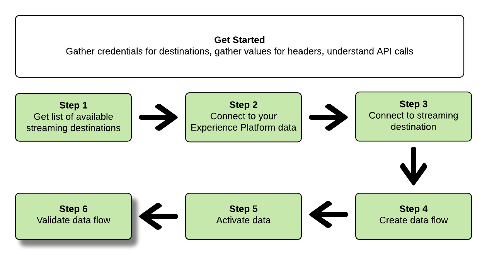

# Connexion à des destinations de diffusion en continu et activation de données à l’aide de l’API Flow Service

>[!NOTE]
>
>Le [!DNL Amazon Kinesis] et [!DNL Azure Event Hubs] destinations dans Platform sont actuellement en version bêta. La documentation et les fonctionnalités peuvent changer.

Ce tutoriel explique comment utiliser des appels d’API pour se connecter à vos données Adobe Experience Platform, créer une connexion à une destination de stockage cloud en flux continu ([Amazon Kinesis](../catalog/cloud-storage/amazon-kinesis.md) ou [Azure Event Hubs](../catalog/cloud-storage/azure-event-hubs.md)), créez un flux de données pour votre nouvelle destination créée et activez les données pour votre nouvelle destination créée.

Ce tutoriel utilise la [!DNL Amazon Kinesis] destination dans tous les exemples, mais les étapes sont identiques pour [!DNL Azure Event Hubs].


Si vous préférez utiliser l’interface utilisateur de la plate-forme pour vous connecter à une destination et activer des données, consultez la section [Connexion d’une destination](../ui/connect-destination.md) et [Activer les données d’audience vers les destinations d’exportation de segments en flux continu](../ui/activate-segment-streaming-destinations.md) tutoriels.

## Prise en main

Ce guide nécessite une compréhension professionnelle des composants suivants d’Adobe Experience Platform :

* [[!DNL Experience Data Model (XDM) System]](../../xdm/home.md): Cadre normalisé selon lequel l’Experience Platform organise les données d’expérience client.
* [[!DNL Catalog Service]](../../catalog/home.md): [!DNL Catalog] est le système d&#39;enregistrement pour l&#39;emplacement des données et la lignée au sein de l&#39;Experience Platform.
* [Environnements de test](../../sandboxes/home.md) : Experience Platform fournit des environnements de test virtuels qui divisent une instance de plateforme unique en environnements virtuels distincts pour favoriser le développement et l’évolution d’applications d’expérience numérique.

Les sections suivantes fournissent des informations supplémentaires que vous devez connaître pour activer les données vers des destinations de diffusion en continu dans la plate-forme.

### Collecte des informations d’identification requises

Pour suivre les étapes de ce tutoriel, vous devez disposer des informations d’identification suivantes, selon le type de destinations auxquelles vous vous connectez et activez des segments.

* Pour [!DNL Amazon Kinesis] connexions : `accessKeyId`, `secretKey`, `region` ou `connectionUrl`
* Pour [!DNL Azure Event Hubs] connexions : `sasKeyName`, `sasKey`, `namespace`

### Lecture d’exemples d’appels API {#reading-sample-api-calls}

Ce tutoriel fournit des exemples d’appels API pour démontrer comment formater vos requêtes. Il s’agit notamment de chemins d’accès, d’en-têtes requis et de payloads de requêtes correctement formatés. L’exemple JSON renvoyé dans les réponses de l’API est également fourni. Pour plus d’informations sur les conventions utilisées dans la documentation pour les exemples d’appels API, consultez la section sur la [lecture d’exemples d’appels API](../../landing/troubleshooting.md#how-do-i-format-an-api-request) dans le guide de dépannage d’Experience Platform.

### Collecte de valeurs pour les en-têtes requis et facultatifs {#gather-values}

Pour lancer des appels aux API Platform, vous devez d’abord suivre le [tutoriel sur l’authentification](https://experienceleague.adobe.com/docs/experience-platform/landing/platform-apis/api-authentication.html?lang=fr#platform-apis). Le tutoriel sur l’authentification indique les valeurs de chacun des en-têtes requis dans tous les appels API Experience Platform, comme illustré ci-dessous :

* Authorization: Bearer `{ACCESS_TOKEN}`
* x-api-key : `{API_KEY}`
* x-gw-ims-org-id: `{IMS_ORG}`

Les ressources d’Experience Platform peuvent être isolées dans des environnements de test virtuels spécifiques. Dans les requêtes aux API Platform, vous pouvez spécifier le nom et l’identifiant de l’environnement de test dans lequel l’opération aura lieu. Il s’agit de paramètres facultatifs.

* x-sandbox-name: `{SANDBOX_NAME}`

>[!NOTE]
>
>Pour plus d’informations sur les environnements de test dans Experience Platform, consultez la [documentation de présentation des environnements de test](../../sandboxes/home.md).

Toutes les requêtes qui contiennent un payload (POST, PUT, PATCH) nécessitent un en-tête de type de média supplémentaire :

* Content-Type: `application/json`

### Documentation Swagger {#swagger-docs}

Ce tutoriel vous permet de trouver dans Swagger la documentation de référence relative à tous les appels API. Voir la section [Documentation de l’API du service de flux sur l’Adobe I/O](https://www.adobe.io/experience-platform-apis/references/flow-service/). Nous vous recommandons de consulter ce tutoriel et la page de documentation de Swagger en parallèle.

## Obtenir la liste des destinations de diffusion en continu disponibles {#get-the-list-of-available-streaming-destinations}


Dans un premier temps, vous devez décider à quelle destination de diffusion activer les données. Pour commencer, effectuez un appel pour demander une liste des destinations disponibles auxquelles vous pouvez vous connecter et activer des segments. Effectuez la requête GET suivante auprès du point de terminaison `connectionSpecs` pour obtenir une liste des destinations disponibles :

**Format d’API**

```http
GET /connectionSpecs
```

**Requête**

```shell
curl --location --request GET 'https://platform.adobe.io/data/foundation/flowservice/connectionSpecs' \
--header 'accept: application/json' \
--header 'x-gw-ims-org-id: {IMS_ORG}' \
--header 'x-api-key: {API_KEY}' \
--header 'x-sandbox-name: {SANDBOX_NAME}' \
--header 'Authorization: Bearer {ACCESS_TOKEN}'
```


**Réponse**

Une réponse réussie contient une liste des destinations disponibles et leurs identifiants uniques (`id`). Conservez la valeur de la destination que vous prévoyez d’utiliser, car elle sera requise dans les étapes suivantes. Par exemple, si vous souhaitez connecter et diffuser des segments vers [!DNL Amazon Kinesis] ou [!DNL Azure Event Hubs], recherchez l’extrait de code suivant dans la réponse :

```json
{
    "id": "86043421-563b-46ec-8e6c-e23184711bf6",
  "name": "Amazon Kinesis",
  ...
  ...
}

{
    "id": "bf9f5905-92b7-48bf-bf20-455bc6b60a4e",
  "name": "Azure Event Hubs",
  ...
  ...
}
```

## Connexion à vos données Experience Platform {#connect-to-your-experience-platform-data}


Ensuite, vous devez vous connecter à vos données Experience Platform afin de pouvoir exporter des données de profil et les activer dans votre destination préférée. Il s’agit de deux sous-étapes présentées ci-dessous.

1. Tout d’abord, vous devez effectuer un appel pour autoriser l’accès à vos données dans Experience Platform, en établissant une connexion de base.
2. Ensuite, à l’aide de l’identifiant de connexion de base, vous passerez un autre appel au cours duquel vous créerez une connexion source, qui établira la connexion avec vos données Experience Platform.


### Autorisation d’accès à vos données dans Experience Platform

**Format d’API**

```http
POST /connections
```

**Requête**

```shell
curl --location --request POST 'https://platform.adobe.io/data/foundation/flowservice/connections' \
--header 'Authorization: Bearer {ACCESS_TOKEN}' \
--header 'x-api-key: {API_KEY}' \
--header 'x-gw-ims-org-id: {IMS_ORG}' \
--header 'x-sandbox-name: {SANDBOX_NAME}' \
--header 'Content-Type: application/json' \
--data-raw '{
            "name": "Base connection to Experience Platform",
            "description": "This call establishes the connection to Experience Platform data",
            "connectionSpec": {
                "id": "{CONNECTION_SPEC_ID}",
                "version": "1.0"
            }
}'
```


* `{CONNECTION_SPEC_ID}`: Utiliser l’ID de spécification de connexion pour le service de profil - `8a9c3494-9708-43d7-ae3f-cda01e5030e1`.

**Réponse**

Une réponse réussie contient l’identifiant unique de la connexion de base (`id`). Conservez cette valeur car elle est nécessaire à l’étape suivante pour créer la connexion source.

```json
{
    "id": "1ed86558-59b5-42f7-9865-5859b552f7f4"
}
```

### Connexion à vos données Experience Platform {#connect-to-platform-data}

**Format d’API**

```http
POST /sourceConnections
```

**Requête**

```shell
curl --location --request POST 'https://platform.adobe.io/data/foundation/flowservice/sourceConnections' \
--header 'Authorization: Bearer {ACCESS_TOKEN}' \
--header 'x-api-key: {API_KEY}' \
--header 'x-gw-ims-org-id: {IMS_ORG}' \
--header 'x-sandbox-name: {SANDBOX_NAME}' \
--header 'Content-Type: application/json' \
--data-raw '{
            "name": "Connecting to Profile Service",
            "description": "Optional",
            "connectionSpec": {
                "id": "{CONNECTION_SPEC_ID}",
                "version": "1.0"
            },
            "baseConnectionId": "{BASE_CONNECTION_ID}",
            "data": {
                "format": "json"
            },
            "params" : {}
}'
```

* `{BASE_CONNECTION_ID}` : utilisez l’identifiant que vous avez obtenu à l’étape précédente.
* `{CONNECTION_SPEC_ID}`: Utiliser l’ID de spécification de connexion pour le service de profil - `8a9c3494-9708-43d7-ae3f-cda01e5030e1`.

**Réponse**

Une réponse réussie renvoie l&#39;identifiant unique (`id`) pour la connexion source nouvellement créée au service de profil. Cela confirme que vous avez réussi à vous connecter à vos données Experience Platform. Conservez cette valeur car elle sera nécessaire lors d’une prochaine étape.

```json
{
    "id": "ed48ae9b-c774-4b6e-88ae-9bc7748b6e97"
}
```


## Connexion à la destination de diffusion {#connect-to-streaming-destination}


À cette étape, vous configurez une connexion à la destination de diffusion souhaitée. Il s’agit de deux sous-étapes présentées ci-dessous.

1. Tout d’abord, vous devez effectuer un appel pour autoriser l’accès à la destination de diffusion en continu, en configurant une connexion de base.
2. Ensuite, à l’aide de l’identifiant de connexion de base, vous passerez un autre appel au cours duquel vous créerez une connexion cible, qui spécifie l’emplacement de votre compte de stockage où les données exportées seront transmises, ainsi que le format des données qui seront exportées.

### Autoriser l’accès à la destination de diffusion

**Format d’API**

```http
POST /connections
```

**Requête**

>[!IMPORTANT]
>
>L’exemple ci-dessous inclut des commentaires de code précédés de `//`. Ces commentaires indiquent les endroits où différentes valeurs doivent être utilisées pour différentes destinations de diffusion en continu. Veuillez supprimer les commentaires avant d’utiliser l’extrait de code.

```shell
curl --location --request POST 'https://platform.adobe.io/data/foundation/flowservice/connections' \
--header 'Authorization: Bearer {ACCESS_TOKEN}' \
--header 'x-api-key: {API_KEY}' \
--header 'x-gw-ims-org-id: {IMS_ORG}' \
--header 'x-sandbox-name: {SANDBOX_NAME}' \
--header 'Content-Type: application/json' \
--data-raw '{
    "name": "Connection for Amazon Kinesis/ Azure Event Hubs",
    "description": "summer advertising campaign",
    "connectionSpec": {
        "id": "{_CONNECTION_SPEC_ID}",
        "version": "1.0"
    },
    "auth": {
        "specName": "{AUTHENTICATION_CREDENTIALS}",
        "params": { // use these values for Amazon Kinesis connections
            "accessKeyId": "{ACCESS_ID}",
            "secretKey": "{SECRET_KEY}",
            "region": "{REGION}"
        },
        "params": { // use these values for Azure Event Hubs connections
            "sasKeyName": "{SAS_KEY_NAME}",
            "sasKey": "{SAS_KEY}",
            "namespace": "{EVENT_HUB_NAMESPACE}"
        }        
    }
}'
```

* `{CONNECTION_SPEC_ID}` : utilisez l’identifiant de spécification de connexion que vous avez obtenu lors de l’étape [Obtention de la liste des destinations disponibles](#get-the-list-of-available-destinations).
* `{AUTHENTICATION_CREDENTIALS}`: indiquez le nom de votre destination de diffusion en continu : `Aws Kinesis authentication credentials` ou `Azure EventHub authentication credentials`.
* `{ACCESS_ID}`: *Pour [!DNL Amazon Kinesis] connexions.* Votre ID d’accès pour votre emplacement de stockage Amazon Kinesis.
* `{SECRET_KEY}`: *Pour [!DNL Amazon Kinesis] connexions.* Votre clé secrète pour votre emplacement de stockage Amazon Kinesis.
* `{REGION}`: *Pour [!DNL Amazon Kinesis] connexions.* La région de votre [!DNL Amazon Kinesis] où Platform diffusera vos données.
* `{SAS_KEY_NAME}`: *Pour [!DNL Azure Event Hubs] connexions.* Remplissez votre nom de clé SAS. En savoir plus sur l’authentification auprès de [!DNL Azure Event Hubs] avec les clés SAS dans le dossier [Documentation de Microsoft](https://docs.microsoft.com/en-us/azure/event-hubs/authenticate-shared-access-signature).
* `{SAS_KEY}`: *Pour [!DNL Azure Event Hubs] connexions.* Remplissez votre clé SAS. En savoir plus sur l’authentification auprès de [!DNL Azure Event Hubs] avec les clés SAS dans le dossier [Documentation de Microsoft](https://docs.microsoft.com/en-us/azure/event-hubs/authenticate-shared-access-signature).
* `{EVENT_HUB_NAMESPACE}`: *Pour [!DNL Azure Event Hubs] connexions.* Remplissez le champ [!DNL Azure Event Hubs] où Platform diffusera vos données. Pour plus d’informations, voir [Création d’un espace de noms de centres d’événements](https://docs.microsoft.com/en-us/azure/event-hubs/event-hubs-create#create-an-event-hubs-namespace) dans la [!DNL Microsoft] documentation.

**Réponse**

Une réponse réussie contient l’identifiant unique de la connexion de base (`id`). Conservez cette valeur car elle est nécessaire à l’étape suivante pour créer une connexion cible.

```json
{
    "id": "1ed86558-59b5-42f7-9865-5859b552f7f4"
}
```

### Indication de l’emplacement de stockage et du format des données

**Format d’API**

```http
POST /targetConnections
```

**Requête**

>[!IMPORTANT]
>
>L’exemple ci-dessous inclut des commentaires de code précédés de `//`. Ces commentaires indiquent les endroits où différentes valeurs doivent être utilisées pour différentes destinations de diffusion en continu. Veuillez supprimer les commentaires avant d’utiliser l’extrait de code.

```shell
curl --location --request POST 'https://platform.adobe.io/data/foundation/flowservice/targetConnections' \
--header 'Authorization: Bearer {ACCESS_TOKEN}' \
--header 'x-api-key: {API_KEY}' \
--header 'x-gw-ims-org-id: {IMS_ORG}' \
--header 'Content-Type: application/json' \
--data-raw '{
    "name": "Amazon Kinesis/ Azure Event Hubs target connection",
    "description": "Connection to Amazon Kinesis/ Azure Event Hubs",
    "baseConnectionId": "{BASE_CONNECTION_ID}",
    "connectionSpec": {
        "id": "{CONNECTION_SPEC_ID}",
        "version": "1.0"
    },
    "data": {
        "format": "json"
    },
    "params": { // use these values for Amazon Kinesis connections
        "stream": "{NAME_OF_DATA_STREAM}", 
        "region": "{REGION}"
    },
    "params": { // use these values for Azure Event Hubs connections
        "eventHubName": "{EVENT_HUB_NAME}"
    }
}'
```

* `{BASE_CONNECTION_ID}` : utilisez l’identifiant de connexion de base que vous avez obtenu à l’étape ci-dessus.
* `{CONNECTION_SPEC_ID}` : utilisez la spécification de connexion que vous avez obtenue lors de l’étape [Obtention de la liste des destinations disponibles](#get-the-list-of-available-destinations).
* `{NAME_OF_DATA_STREAM}`: *Pour [!DNL Amazon Kinesis] connexions.* Indiquez le nom de votre flux de données existant dans votre [!DNL Amazon Kinesis] compte. La plate-forme exportera les données vers ce flux.
* `{REGION}`: *Pour [!DNL Amazon Kinesis] connexions.* Région de votre compte Amazon Kinesis où Platform diffusera vos données.
* `{EVENT_HUB_NAME}`: *Pour [!DNL Azure Event Hubs] connexions.* Remplissez le champ [!DNL Azure Event Hub] Nom de la plate-forme qui diffusera vos données. Pour plus d’informations, voir [Création d’un hub d’événements](https://docs.microsoft.com/en-us/azure/event-hubs/event-hubs-create#create-an-event-hub) dans la [!DNL Microsoft] documentation.

**Réponse**

Une réponse réussie renvoie l&#39;identifiant unique (`id`) pour la nouvelle connexion cible à votre destination de diffusion. Conservez cette valeur car elle sera nécessaire lors de prochaines étapes.

```json
{
    "id": "12ab90c7-519c-4291-bd20-d64186b62da8"
}
```

## Création d’un flux de données


À l’aide des identifiants obtenus lors des étapes précédentes, vous pouvez maintenant créer un flux de données entre vos données Experience Platform et la destination vers laquelle vous activerez les données. Considérez cette étape comme la création du pipeline, par lequel les données seront ensuite acheminées, entre Experience Platform et la destination souhaitée.

Pour créer un flux de données, effectuez une requête POST, comme indiqué ci-après, tout en fournissant les valeurs mentionnées ci-dessous dans le payload.

Effectuez la requête POST suivante pour créer un flux de données.

**Format d’API**

```http
POST /flows
```

**Requête**

```shell
curl -X POST \
'https://platform.adobe.io/data/foundation/flowservice/flows' \
-H 'Authorization: Bearer {ACCESS_TOKEN}' \
-H 'x-api-key: {API_KEY}' \
-H 'x-gw-ims-org-id: {IMS_ORG}' \
-H 'x-sandbox-name: {SANDBOX_NAME}' \
-H 'Content-Type: application/json' \
-d  '{
  "name": "Azure Event Hubs",
  "description": "Azure Event Hubs",
  "flowSpec": {
    "id": "{FLOW_SPEC_ID}",
    "version": "1.0"
  },
  "sourceConnectionIds": [
    "{SOURCE_CONNECTION_ID}"
  ],
  "targetConnectionIds": [
    "{TARGET_CONNECTION_ID}"
  ],
  "transformations": [
    {
      "name": "GeneralTransform",
      "params": {
        "profileSelectors": {
          "selectors": [
            
          ]
        },
        "segmentSelectors": {
          "selectors": [
            
          ]
        }
      }
    }
  ]
}
```

* `{FLOW_SPEC_ID}`: L’ID de spécification de flux pour les destinations basées sur le profil est `71471eba-b620-49e4-90fd-23f1fa0174d8`. Utilisez cette valeur dans l’appel.
* `{SOURCE_CONNECTION_ID}` : utilisez l’identifiant de connexion source obtenu à l’étape [Connexion à Experience Platform](#connect-to-your-experience-platform-data).
* `{TARGET_CONNECTION_ID}`: Utilisez l’ID de connexion cible que vous avez obtenu à l’étape [Connexion à la destination de diffusion](#connect-to-streaming-destination).

**Réponse**

Une réponse réussie renvoie l’identifiant (`id`) du nouveau flux de données et un `etag`. Notez les deux valeurs car vous en aurez besoin à l’étape suivante pour activer les segments.

```json
{
    "id": "8256cfb4-17e6-432c-a469-6aedafb16cd5",
    "etag": "8256cfb4-17e6-432c-a469-6aedafb16cd5"
}
```


## Activation des données vers votre nouvelle destination {#activate-data}


Après avoir créé toutes les connexions et le flux de données, vous pouvez désormais activer vos données de profil sur la plate-forme de diffusion. Au cours de cette étape, vous sélectionnez les segments et les attributs de profil que vous envoyez à la destination et vous pouvez planifier et envoyer des données à la destination.

Pour activer les segments vers votre nouvelle destination, vous devez effectuer une opération JSON PATCH, comme dans l’exemple ci-dessous. Vous pouvez activer plusieurs segments et attributs de profil lors d’un seul appel. Pour en savoir plus sur le JSON PATCH, consultez la [spécification RFC](https://tools.ietf.org/html/rfc6902).

**Format d’API**

```http
PATCH /flows
```

**Requête**

```shell
curl --location --request PATCH 'https://platform.adobe.io/data/foundation/flowservice/flows/{DATAFLOW_ID}' \
--header 'Authorization: Bearer {ACCESS_TOKEN}' \
--header 'x-api-key: {API_KEY}' \
--header 'x-gw-ims-org-id: {IMS_ORG}' \
--header 'Content-Type: application/json' \
--header 'x-sandbox-name: {SANDBOX_NAME}' \
--header 'If-Match: "{ETAG}"' \
--data-raw '[
  {
    "op": "add",
    "path": "/transformations/0/params/segmentSelectors/selectors/-",
    "value": {
      "type": "PLATFORM_SEGMENT",
      "value": {
        "name": "Name of the segment that you are activating",
        "description": "Description of the segment that you are activating",
        "id": "{SEGMENT_ID}"
      }
    }
  },
  {
    "op": "add",
    "path": "/transformations/0/params/profileSelectors/selectors/-",
    "value": {
      "type": "JSON_PATH",
      "value": {
        "operator": "EXISTS",
        "path": "{PROFILE_ATTRIBUTE}"
      }
    }
  }
]
```

* `{DATAFLOW_ID}` : utilisez le flux de données obtenu à l’étape précédente.
* `{ETAG}` : utilisez l’etag obtenu à l’étape précédente.
* `{SEGMENT_ID}` : indiquez l’identifiant du segment que vous souhaitez exporter vers cette destination. Pour récupérer les ID de segment pour les segments que vous souhaitez activer, accédez à la section **https://www.adobe.io/apis/experienceplatform/home/api-reference.html#/**, sélectionnez **[!UICONTROL API du service de segmentation]** dans le menu de navigation de gauche, puis recherchez `GET /segment/definitions` opération dans **[!UICONTROL Définitions de segments]**.
* `{PROFILE_ATTRIBUTE}`: Par exemple, `personalEmail.address` ou `person.lastName`

**Réponse**

Recherchez une réponse 202 OK. Aucun corps de réponse n’est renvoyé. Pour vérifier que la requête était correcte, reportez-vous à l’étape suivante : validation du flux de données.

## Validation du flux de données



La dernière étape du tutoriel consiste à vérifier que les segments et les attributs de profil ont été correctement mappés au flux de données.

Pour ce faire, effectuez la requête GET suivante :

**Format d’API**

```http
GET /flows
```

**Requête**

```shell
curl --location --request PATCH 'https://platform.adobe.io/data/foundation/flowservice/flows/{DATAFLOW_ID}' \
--header 'Authorization: Bearer {ACCESS_TOKEN}' \
--header 'x-api-key: {API_KEY}' \
--header 'x-gw-ims-org-id: {IMS_ORG}' \
--header 'Content-Type: application/json' \
--header 'x-sandbox-name: prod' \
--header 'If-Match: "{ETAG}"' 
```

* `{DATAFLOW_ID}` : utilisez le flux de données de l’étape précédente.
* `{ETAG}` : utilisez l’etag de l’étape précédente.

**Réponse**

La réponse renvoyée doit inclure dans le paramètre `transformations` les segments et les attributs de profil que vous avez envoyés à l’étape précédente. Voici un exemple de paramètre `transformations` dans la réponse :

```json
"transformations": [
    {
        "name": "GeneralTransform",
        "params": {
            "profileSelectors": {
                        "selectors": [
                            {
                                "type": "JSON_PATH",
                                "value": {
                                    "path": "personalEmail.address",
                                    "operator": "EXISTS"
                                }
                            },
                            {
                                "type": "JSON_PATH",
                                "value": {
                                    "path": "person.lastname",
                                    "operator": "EXISTS"
                                }
                            }
                        ]
                    },
            "segmentSelectors": {
                "selectors": [
                    {
                        "type": "PLATFORM_SEGMENT",
                        "value": {
                            "name": "Men over 50",
                            "description": "",
                            "id": "72ddd79b-6b0a-4e97-a8d2-112ccd81bd02"
                        }
                    }
                ]
            }
        }
    }
],
```

**Données exportées**

>[!IMPORTANT]
>
> Outre les attributs de profil et les segments de l’étape [Activer les données vers votre nouvelle destination](#activate-data), les données exportées dans [!DNL AWS Kinesis] et [!DNL Azure Event Hubs] inclura également des informations sur la carte d’identité. Cela représente les identités des profils exportés (par exemple [ECID](https://experienceleague.adobe.com/docs/id-service/using/intro/id-request.html), ID mobile, ID Google, adresse e-mail, etc.). Voir un exemple ci-dessous.

```json
{
  "person": {
    "email": "yourstruly@adobe.com"
  },
  "segmentMembership": {
    "ups": {
      "72ddd79b-6b0a-4e97-a8d2-112ccd81bd02": {
        "lastQualificationTime": "2020-03-03T21:24:39Z",
        "status": "exited"
      },
      "7841ba61-23c1-4bb3-a495-00d695fe1e93": {
        "lastQualificationTime": "2020-03-04T23:37:33Z",
        "status": "existing"
      }
    }
  },
  "identityMap": {
    "ecid": [
      {
        "id": "14575006536349286404619648085736425115"
      },
      {
        "id": "66478888669296734530114754794777368480"
      }
    ],
    "email_lc_sha256": [
      {
        "id": "655332b5fa2aea4498bf7a290cff017cb4"
      },
      {
        "id": "66baf76ef9de8b42df8903f00e0e3dc0b7"
      }
    ]
  }
}
```

## Utilisation des collections Postman pour se connecter à des destinations de diffusion en continu  {#collections}

Pour vous connecter aux destinations de diffusion décrites dans ce tutoriel de manière plus rationnelle, vous pouvez utiliser [[!DNL Postman]](https://www.postman.com/).

[!DNL Postman] est un outil que vous pouvez utiliser pour effectuer des appels d’API et gérer des bibliothèques d’appels et d’environnements prédéfinis.

Pour ce tutoriel spécifique, procédez comme suit : [!DNL Postman] des collections ont été jointes :

* [!DNL AWS Kinesis] [!DNL Postman] collection
* [!DNL Azure Event Hubs] [!DNL Postman] collection

Cliquez sur [ici](../assets/api/streaming-destination/DestinationPostmanCollection.zip) pour télécharger les archives des collections.

Chaque collection comprend les demandes et les variables d’environnement nécessaires, pour [!DNL AWS Kinesis]et [!DNL Azure Event Hub], respectivement.

### Utilisation des collections Postman

Pour vous connecter avec succès aux destinations à l’aide de la [!DNL Postman] , procédez comme suit :

* Téléchargement et installation [!DNL Postman];
* [Télécharger](../assets/api/streaming-destination/DestinationPostmanCollection.zip) et décompressez les collections jointes ;
* Importer les collections de leurs dossiers correspondants dans Postman ;
* Remplir les variables d’environnement conformément aux instructions de cet article ;
* Exécutez la [!DNL API] demandes de Postman, selon les instructions de cet article.

## Étapes suivantes

En suivant ce tutoriel, vous avez correctement connecté la plate-forme à l’une de vos destinations de diffusion préférées et configuré un flux de données vers la destination correspondante. Les données sortantes peuvent désormais être utilisées dans la destination pour l’analyse des clients ou pour toute autre opération de données que vous souhaitez effectuer. Pour plus d’informations, consultez les pages suivantes :

* [Présentation des destinations](../home.md)
* [Présentation du catalogue des destinations](../catalog/overview.md)
