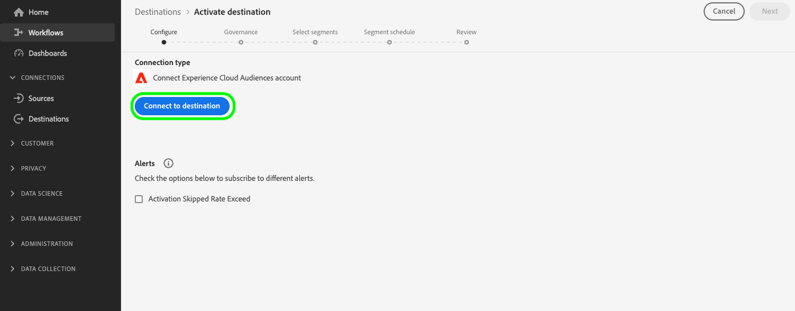

# [!UICONTROL  Connexion d’audiences Experience Cloud]

>[!AVAILABILITY]
>
> Cette destination est disponible pour les clients [Adobe Real-Time Customer Data Platform Prime and Ultimate](https://helpx.adobe.com/fr/legal/product-descriptions/real-time-customer-data-platform.html).

Utilisez cette destination pour activer les audiences de Real-Time CDP vers Audience Manager et Adobe Analytics.

Pour envoyer des audiences à Adobe Analytics, vous avez besoin d’une licence d’Audience Manager. Pour plus d’informations, consultez la [présentation de l’Audience Analytics](https://experienceleague.adobe.com/docs/analytics/integration/audience-analytics/mc-audiences-aam.html?lang=en).

Pour envoyer des audiences vers d’autres solutions Adobe, utilisez les connexions directes de Real-Time CDP vers [Adobe Target](../personalization/adobe-target-connection.md), [Adobe Advertising](../advertising/adobe-advertising-cloud-connection.md), [Adobe Campaign](../email-marketing/adobe-campaign.md) et [Marketo Engage](../adobe/marketo-engage.md).

>[!IMPORTANT]
>
>Cette destination remplace l’ [intégration héritée du partage d’audience](https://experienceleague.adobe.com/docs/audience-manager/user-guide/implementation-integration-guides/integration-experience-platform/aam-aep-audience-sharing.html#aep-segments-in-aam) de Real-Time Customer Data Platform vers différentes solutions Experience Cloud.
> 
>Si vous partagez déjà des audiences de Real-Time CDP vers l’Audience Manager et d’autres solutions Experience Cloud par le biais de l’ [intégration du partage d’audience héritée](https://experienceleague.adobe.com/docs/audience-manager/user-guide/implementation-integration-guides/integration-experience-platform/aam-aep-audience-sharing.html#aep-segments-in-aam), vous devez contacter l’assistance clientèle pour désactiver l’intégration héritée avant d’utiliser cette destination.

## Cas d’utilisation et avantages {#use-cases}

Pour vous aider à mieux comprendre comment et à quel moment utiliser la destination [!UICONTROL Audiences Experience Cloud], voici des exemples de cas d’utilisation que les clients Real-Time CDP peuvent résoudre à l’aide de cette destination.

### Activation des cas d’utilisation de Data Management Platform {#dmp-use-cases}

Dans Audience Manager, vous pouvez utiliser les audiences Real-Time CDP pour les cas d’utilisation de Data Management Platform, tels que :

* Ajout de [données tierces](https://experienceleague.adobe.com/docs/audience-manager/user-guide/overview/data-types-collected.html#third-party-data) à vos segments ;
* [Modélisation algorithmique](https://experienceleague.adobe.com/docs/audience-manager/user-guide/features/algorithmic-models/look-alike-modeling/understanding-models.html);
* Activation de vos audiences vers des destinations basées sur des cookies qui ne sont pas encore prises en charge dans le catalogue des destinations Real-Time CDP.

### Contrôle granulaire des audiences exportées {#segments-control}

Pour sélectionner les audiences à exporter vers l’Audience Manager et au-delà, utilisez la nouvelle intégration du partage d’audience en libre-service via la destination Audiences Experience Cloud.  Vous pouvez ainsi déterminer les audiences que vous souhaitez partager avec d’autres solutions Experience Cloud et celles que vous souhaitez conserver exclusivement dans Real-Time CDP.

L’intégration du partage d’audience héritée ne permettait pas un contrôle granulaire des audiences qui devaient être exportées vers l’Audience Manager et au-delà.

### Partage d’audiences Real-Time CDP avec Adobe Analytics {#share-audiences-with-analytics}

Les audiences que vous envoyez à la destination Audiences Experience Cloud n’apparaissent pas automatiquement dans Adobe Analytics.

Avant de pouvoir envoyer des audiences à Adobe Analytics, vous devez [mettre en oeuvre le service d’identité Experience Cloud pour Analytics et l’Audience Manager](https://experienceleague.adobe.com/docs/id-service/using/implementation/setup-aam-analytics.html?lang=en).

>[!IMPORTANT]
>
>Pour envoyer des audiences de Real-Time CDP vers Adobe Analytics par le biais de la destination d’audiences Experience Cloud, vous devez disposer d’une licence d’Audience Manager.

### Partage d’audiences Real-Time CDP avec d’autres solutions Experience Cloud {#share-segments-with-other-solutions}

Vous pouvez utiliser la carte de destination Audiences Real-Time CDP pour partager des audiences avec d’autres solutions Experience Cloud.

Toutefois, Adobe recommande vivement d’utiliser les cartes de destination dédiées suivantes si vous souhaitez partager des audiences avec ces solutions :

* [Adobe Campaign](../email-marketing/adobe-campaign.md)
* [Adobe Target](../personalization/adobe-target-connection.md)
* [Advertising Cloud](../advertising/adobe-advertising-cloud-connection.md)
* [Marketo](../adobe/marketo-engage.md)

## Conditions préalables {#prerequisites}

>[!IMPORTANT]
>
> * Vous avez besoin d’une licence d’Audience Manager pour activer les [ cas pratiques de la plateforme de gestion des données](#dmp-use-cases) mentionnés plus haut.
> * Vous *do* avez besoin d’une licence d’Audience Manager pour partager des audiences Real-Time CDP avec Adobe Analytics.
> * Vous *n’avez pas besoin* d’une licence d’Audience Manager pour partager des audiences Real-Time CDP avec Adobe Advertising Cloud, Adobe Target, Marketo et d’autres solutions Experience Cloud, mentionnées dans la [section ci-dessus](#share-segments-with-other-solutions).

### Pour les clients qui utilisent la solution de partage d’audience héritée

Si vous partagez déjà des audiences de Real-Time CDP vers l’Audience Manager et d’autres solutions Experience Cloud par le biais de l’ [intégration du partage d’audience héritée](https://experienceleague.adobe.com/docs/audience-manager/user-guide/implementation-integration-guides/integration-experience-platform/aam-aep-audience-sharing.html#aep-segments-in-aam), vous devez contacter l’assistance clientèle pour désactiver l’intégration héritée.

Le délai d’activation pour résoudre le ticket de désapprovisionnement est de six jours ouvrables ou moins. Une fois l’intégration héritée existante désactivée, vous pouvez passer à [créer une connexion](#connect) via la carte de destination en libre-service.

>[!IMPORTANT]
>
>L’exportation de l’audience de Real-Time CDP vers vos autres solutions est arrêtée entre la résolution du ticket et le moment où une nouvelle connexion est établie par le biais de la carte de destination. Vous pouvez minimiser ce temps d’arrêt en créant la connexion via la carte de destination une fois le ticket fermé.

## Limites et légendes connues {#known-limitations}

Notez les limites connues et les légendes importantes suivantes lors de l’utilisation de la carte Audiences Experience Cloud :

* Actuellement, une seule destination Audiences Experience Cloud est prise en charge. Toute tentative de configuration d’une seconde connexion de destination entraîne une erreur.
* Lors de la connexion à la destination, vous pouvez voir une option pour [activer les alertes de flux de données](../../ui/alerts.md). Bien que visible dans l’interface utilisateur, l’option **activer les alertes n’est actuellement pas prise en charge**.
* **Prise en charge du renvoi d’audience** : le premier export vers l’Audience Manager ou d’autres solutions Experience Cloud inclut une population historique des audiences. Les utilisateurs de l’[ intégration de partage d’audience héritée ](https://experienceleague.adobe.com/docs/audience-manager/user-guide/implementation-integration-guides/integration-experience-platform/aam-aep-audience-sharing.html#aep-segments-in-aam) qui configurent cette destination doivent s’attendre à une différence de renvoi d’environ six heures.
* Les audiences provenant de la [composition de l’audience](../../../segmentation/ui/audience-composition.md) ne sont pas directement prises en charge. Pour activer les audiences composites vers cette destination, vous devez créer une définition d’audience via le [créateur de segments](../../../segmentation/ui/segment-builder.md) basé sur votre audience composite, puis activer l’audience nouvellement créée.

### Latence lors de l’activation des audiences {#audience-activation-latency}

Il existe une latence de quatre heures entre le moment où les audiences sont activées pour la première fois dans Real-Time CDP et celui où elles sont prêtes à être utilisées dans Audience Manager et dans d’autres solutions Experience Cloud.

Les audiences peuvent prendre jusqu’à 24 heures pour être pleinement disponibles en Audience Manager pour tous les cas d’utilisation. Il peut s’écouler jusqu’à 48 heures avant que les audiences d’audiences Experience Cloud n’apparaissent dans les rapports d’Audience Manager.

Les métadonnées, telles que les noms d’audience, sont disponibles en Audience Manager quelques minutes après la configuration de l’exportation vers la destination Audiences Experience Cloud.

## Identités prises en charge {#supported-identities}

Les profils exportés vers la destination [!UICONTROL Audiences Experience Cloud] sont mappés aux identités décrites dans le tableau ci-dessous. En savoir plus sur les [identités](/help/identity-service/features/namespaces.md).

| Identité cible | Description | Considérations |
|---|---|---|
| ECID | Experience Cloud ID | Espace de noms qui représente l’ECID. Cet espace de noms peut également être référencé par les alias suivants : « ID Adobe Marketing Cloud », « ID Adobe Experience Cloud », « ID Adobe Experience Platform ». Consultez le document suivant sur [ECID](/help/identity-service/features/ecid.md) pour plus d’informations. |
| GAID | GOOGLE ADVERTISING ID | Les profils ingérés dans Real-Time CDP avec une identité principale de Google Advertising ID (GAID) peuvent être exportés vers cette destination. |
| IDFA | Identifiant Apple pour les annonceurs | Les profils ingérés dans Real-Time CDP avec une identité principale d’Apple ID for Advertisers (IDFA) peuvent être exportés vers cette destination. |
| email_lc_sha256 | Adresses e-mail hachées avec l’algorithme SHA256 | Les profils ingérés dans Real-Time CDP avec une identité principale d’adresse électronique hachée peuvent être exportés vers cette destination. |

{style="table-layout:auto"}

## Audiences prises en charge {#supported-audiences}

Cette section décrit le type d’audience que vous pouvez exporter vers cette destination.

| Origine de l’audience | Pris en charge | Description |
| ---------|----------|----------|
| [!DNL Segmentation Service] | ✓ | Audiences générées par l’Experience Platform [Segmentation Service](../../../segmentation/home.md). |
| Chargements personnalisés | ✓ | Audiences [importées](../../../segmentation/ui/audience-portal.md#import-audience) dans Experience Platform à partir de fichiers CSV. |

{style="table-layout:auto"}

## Type et fréquence d’exportation {#export-type-frequency}

Reportez-vous au tableau ci-dessous pour plus d’informations sur le type et la fréquence d’exportation des destinations.

| Élément | Type | Notes |
|---------|----------|---------|
| Type d’exportation | **[!UICONTROL Export d’audience]** | Vous exportez tous les membres d’une audience à partir des identités répertoriées dans la section ci-dessus. |
| Fréquence des exportations | **[!UICONTROL Diffusion en continu]** | Les destinations de diffusion en continu sont des connexions basées sur l’API « toujours actives ». Lorsqu’un profil est mis à jour dans Real-Time CDP en fonction de l’évaluation de l’audience, le connecteur envoie la mise à jour en aval vers la plateforme de destination. En savoir plus sur les [destinations de diffusion en continu](/help/destinations/destination-types.md#streaming-destinations). |

{style="table-layout:auto"}

## Se connecter à la destination {#connect}

>[!IMPORTANT]
> 
>Pour vous connecter à la destination, vous avez besoin des **** et des ****  autorisations de contrôle d’accès. Lisez la [présentation du contrôle d’accès](/help/access-control/ui/overview.md) ou contactez votre administrateur de produit pour obtenir les autorisations requises.

Pour vous connecter à cette destination, procédez comme décrit dans le [tutoriel sur la configuration des destinations](../../ui/connect-destination.md). Dans le workflow de configuration des destinations, renseignez les champs répertoriés dans les deux sections ci-dessous.

### S’authentifier auprès de la destination {#authenticate}

Pour vous authentifier à la destination, sélectionnez **[!UICONTROL Configurer]** dans le mode Carte de destination du catalogue et sélectionnez **[!UICONTROL Se connecter à la destination]**.

### Renseigner les détails de la destination {#destination-details}

Pour configurer les détails de la destination, renseignez les champs obligatoires et facultatifs ci-dessous. Un astérisque situé en regard d’un champ de l’interface utilisateur indique que le champ est obligatoire.

* **[!UICONTROL Nom]** : un nom par lequel vous reconnaîtrez cette destination à l’avenir.
* **[!UICONTROL Description]** : une description qui vous aidera à identifier cette destination à l’avenir.

## Activer des audiences vers cette destination {#activate}

>[!IMPORTANT]
> 
>Pour activer les données, vous avez besoin des ****, **[!UICONTROL Activer les destinations]**, **** et **** [  autorisations de contrôle d’accès](/help/access-control/home.md#permissions). Lisez la [présentation du contrôle d’accès](/help/access-control/ui/overview.md) ou contactez votre administrateur ou administratrice du produit pour obtenir les autorisations requises.

Lisez [Activer les profils et les audiences vers les destinations d’exportation d’audience en continu](/help/destinations/ui/activate-segment-streaming-destinations.md) pour obtenir des instructions sur l’activation des audiences vers cette destination. Aucun [mappage d’étape](/help/destinations/ui/activate-segment-streaming-destinations.md#mapping) n’est requis et aucune [planification d’étape](/help/destinations/ui/activate-segment-streaming-destinations.md#scheduling) n’est disponible pour cette destination.

## Valider l’exportation des données {#exported-data}

Pour valider une exportation de données réussie, vous pouvez vérifier que vos audiences ont réussi à atteindre la solution Experience Cloud souhaitée.

### Validation des données dans Audience Manager

Vos audiences Real-Time CDP apparaissent en Audience Manager sous la forme de [signaux](https://experienceleague.adobe.com/docs/audience-manager/user-guide/implementation-integration-guides/integration-experience-platform/aam-aep-audience-sharing.html#aep-segments-as-aam-signals), de [caractéristiques](https://experienceleague.adobe.com/docs/audience-manager/user-guide/implementation-integration-guides/integration-experience-platform/aam-aep-audience-sharing.html#aep-segments-as-aam-traits) et de [segments](https://experienceleague.adobe.com/docs/audience-manager/user-guide/implementation-integration-guides/integration-experience-platform/aam-aep-audience-sharing.html#aep-segments-as-aam-segments). Vous pouvez vérifier en Audience Manager si les données sont apparues comme décrit dans les liens de documentation ci-dessus.

Les noms de segment commencent à apparaître dans l’Audience Manager 15 minutes après l’envoi des audiences depuis Real-Time CDP.

La population de segments commence à affluer vers l’Audience Manager dans les 6 heures suivant l’envoi à partir de Real-Time CDP. Elle est mise à jour toutes les 24 heures dans l’Audience Manager.

La population entière sera visible en Audience Manager au bout de 72 heures, et les populations continueront à affluer vers l’Audience Manager à moins que l’audience ne soit supprimée de la destination dans Real-Time CDP.

## Utilisation et gouvernance des données {#data-usage-governance}

Lors de la gestion de vos données, toutes les destinations [!DNL Real-Time CDP] se conforment aux politiques d’utilisation des données. Pour obtenir des informations détaillées sur la manière dont [!DNL Adobe Experience Platform] applique la gouvernance des données, consultez la [Présentation de la gouvernance des données](/help/data-governance/home.md).

La gouvernance des données dans Real-Time CDP est appliquée par les [libellés d’utilisation des données](/help/data-governance/labels/reference.md) et les actions marketing.
Les libellés d’utilisation des données sont transférés vers les applications, mais pas vers les actions marketing. Cela signifie qu’une fois qu’ils arrivent en Audience Manager, les audiences de Real-Time CDP peuvent être exportées vers n’importe quelle destination disponible. En Audience Manager, vous pouvez utiliser les [contrôles d’exportation de données](https://experienceleague.adobe.com/docs/audience-manager/user-guide/features/data-export-controls.html) pour empêcher l’exportation d’audiences vers certaines destinations.

Les audiences marquées de l’action marketing [!DNL HIPAA] ne sont pas envoyées de Real-Time CDP à l’Audience Manager.

### Gestion des autorisations dans Audience Manager

Les audiences et les caractéristiques en Audience Manager sont soumises aux [contrôles d’accès en fonction du rôle](https://experienceleague.adobe.com/docs/audience-manager/user-guide/features/administration/administration-overview.html) (RBAC).

Les audiences exportées à partir de Real-Time CDP sont affectées à une source de données spécifique dans l’Audience Manager appelée **[!UICONTROL Segments Experience Platform]**.

Pour autoriser uniquement certains utilisateurs à accéder aux audiences, utilisez les [Contrôles d’accès en fonction du rôle](https://experienceleague.adobe.com/docs/audience-manager/user-guide/features/administration/administration-overview.html) pour configurer l’accès des utilisateurs aux audiences et aux caractéristiques créées à partir des audiences Real-Time CDP.
