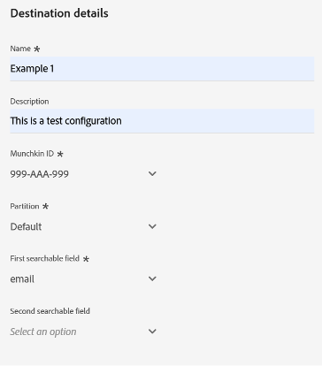

# Connexion de synchronisation des personnes Marketo Engage {#marketo-engage-person-sync}

>[!IMPORTANT]
>
>Ce connecteur de destination est en version Beta et disponible uniquement pour certaines personnes. Pour obtenir l’accès, contactez votre représentant ou représentante Adobe.

>[!IMPORTANT]
>
>La carte de destination **[!UICONTROL Synchronisation des personnes Marketo Engage]** sera abandonnée en **octobre 2025**.
>
>Pour garantir une transition en douceur vers la nouvelle destination **[[!UICONTROL Marketo Engage]](marketo-engage-connection.md)**, passez en revue les points clés et les actions requises suivants :
>
>* Tous les utilisateurs doivent **cesser d’utiliser la destination de synchronisation des personnes de Marketo Engage** et migrer vers la nouvelle destination **[[!UICONTROL Marketo Engage]](marketo-engage-connection.md)** d’ici octobre 2025.
>* **Les flux de données existants ne seront pas migrés automatiquement.** Vous devez [configurer une nouvelle connexion](marketo-engage-connection.md#connect-to-the-destination) vers la nouvelle destination **[!UICONTROL Marketo Engage]** et y activer vos audiences.

## Vue d’ensemble {#overview}

Utilisez le connecteur de synchronisation des personnes Marketo Engage pour diffuser des mises à jour des audiences de personnes vers les enregistrements correspondants dans votre instance Marketo Engage.

>[!IMPORTANT]
> 
>Le connecteur de synchronisation d’audience [Marketo V2](/help/destinations/catalog/adobe/marketo-engage.md) ne doit pas être utilisé en mode création conjointement avec le connecteur de synchronisation de mise à jour de profil

## Identités et attributs pris en charge {#support-identities-and-attributes}

### Identités prises en charge {#supported-identities}

| Identité cible | Description |
| --------------- | ---------------------------------------------------------------------------------------------------------------------------------------------------------------------------------------- |
| E-mail | Un espace de noms représentant une adresse e-mail. Ce type d’espace de noms est souvent associé à une seule personne et peut donc être utilisé pour identifier cette personne sur différents canaux. |

{style="table-layout:auto"}

### Attributs pris en charge {#supported-attributes}

Vous pouvez mapper des attributs d’Experience Platform à l’un des attributs auxquels votre organisation a accès dans Marketo. Dans Marketo, vous pouvez utiliser la requête [API Describe](https://developer.adobe.com/marketo-apis/api/mapi/#tag/Leads/operation/describeUsingGET_6) pour récupérer les champs d’attribut auxquels votre entreprise a accès.

## Audiences prises en charge {#supported-audiences}

Cette section décrit les types d’audiences que vous pouvez exporter vers cette destination.

| Origine de l’audience | Pris en charge | Description |
| -------------------- | :-------: | ------------------------------------------------------------------------------------------------------------------------------------------------------------- |
| Service de segmentation | ✓ | Audiences générées via Experience Platform [Segmentation Service](https://experienceleague.adobe.com/fr/docs/experience-platform/segmentation/home). |
| Chargements personnalisés | ✓ | Audiences importées dans Experience Platform à partir de fichiers CSV. |

## Type et fréquence d’exportation {#export-type-and-frequency}

Reportez-vous au tableau ci-dessous pour plus d’informations sur le type et la fréquence d’exportation des destinations.

| Élément | Type | Notes |
| ---------------- | --------- | ----------------------------------------------------------------------------------------------------------------------------------------------------------------------------------------------------------------------------------------------------------------------------------------------------------------------------------------------------------------------------------------- |
| Fréquence des exportations | Diffusion en continu | Les destinations de diffusion en continu sont des connexions basées sur l’API « toujours actives ». Dès qu’un profil est mis à jour dans Experience Platform en fonction de l’évaluation des audiences, le connecteur envoie la mise à jour en aval vers la plateforme de destination. En savoir plus sur les [destinations de diffusion en continu](/help/destinations/destination-types.md#streaming-destinations). |

{style="table-layout:auto"}

## Configurer la destination {#set-up-destination}

>[!IMPORTANT]
>
>* Pour vous connecter à la destination, vous avez besoin des autorisations de contrôle d’accès **[!UICONTROL Afficher les destinations]** et **[!UICONTROL Gérer les destinations]** [&#128279;](/help/access-control/home.md#permissions).

Si votre société a accès à plusieurs organisations, veillez à utiliser la même organisation dans Marketo Engage et Real-Time CDP, où vous configurez le connecteur de destination vers Marketo.  Si vous avez déjà configuré une destination, vous pouvez sélectionner un compte Marketo existant à utiliser avec votre nouvelle configuration.  Si ce n’est pas le cas, cliquez sur l’invite Connecteur vers la destination , qui vous permet de définir le nom, la description et l’identifiant Marketo Munchkin de la destination souhaitée.  L’identifiant Munchkin de votre instance Marketo se trouve dans le menu Admin->Munchkin .

>[!IMPORTANT]
>
>L’utilisateur configurant la destination doit disposer de l’autorisation [ Modifier la personne ](https://experienceleague.adobe.com/fr/docs/marketo/using/product-docs/administration/users-and-roles/descriptions-of-role-permissions#access-database) dans l’instance et la partition Marketo.

* **[!UICONTROL Nom]** : un nom par lequel vous reconnaîtrez cette destination à l’avenir.
* **[!UICONTROL Description]** : une description qui vous aidera à identifier cette destination à l’avenir.
* **[!UICONTROL Munchkin ID]** : Munchkin ID est l’identifiant unique d’une instance Marketo spécifique.
* **[!UICONTROL Partition]** : concept dans Marketo Engage utilisé pour séparer les enregistrements de prospect par préoccupation commerciale
* **[!UICONTROL Premier champ consultable]** : champ à dédupliquer. Le champ doit être présent dans chaque enregistrement de prospect de l’entrée. La valeur par défaut est e-mail.
* **[!UICONTROL Premier champ consultable]** : champ secondaire à dédupliquer. Le champ doit être présent dans chaque enregistrement de prospect de l’entrée. Facultatif

Une fois que vous avez sélectionné votre instance, vous devez également sélectionner la partition de lead à laquelle vous souhaitez que la configuration s’intègre. Dans Marketo Engage[ une ](https://experienceleague.adobe.com/fr/docs/marketo/using/product-docs/administration/workspaces-and-person-partitions/understanding-workspaces-and-person-partitions) partition de lead est un concept utilisé pour séparer les enregistrements de lead par entreprise (marque ou région de vente, par exemple). Si votre abonnement Marketo ne dispose pas de la fonctionnalité Espaces de travail et partitions, ou si aucune partition supplémentaire n’a été créée dans votre abonnement, seule la partition Par défaut est disponible. Une configuration unique ne peut mettre à jour que les enregistrements de prospect qui existent dans sa partition configurée.

>[!IMPORTANT]
> 
>Après la première activation d’une audience vers la destination Marketo, le remplissage des profils qui existaient déjà dans l’audience avant l’activation de la destination Marketo peut prendre jusqu’*à 24 heures*. À l’avenir, chaque fois que des profils seront ajoutés à l’audience, ils seront immédiatement ajoutés à Marketo.

### Champs de déduplication {#deduplication-fields}

Lors de l’envoi de mises à jour à Marketo engage, les enregistrements sont sélectionnés en fonction de la partition sélectionnée et d’un ou deux champs sélectionnés par l’utilisateur. Si votre destination est configurée avec la partition Amérique du Nord et que l’adresse e-mail et le nom de société sont configurés comme des champs de déduplication, les trois champs doivent correspondre pour appliquer les modifications à un enregistrement existant. Par exemple :

* La destination est configurée avec la partition Amérique du Nord
* La personne avec le <test@example.com> E-mail et le nom de société Example Inc. dans Experience Platform correspond à l’audience de destination
* À moins qu’un enregistrement avec ces valeurs n’existe déjà dans la partition Amérique du Nord de Marketo, un nouvel enregistrement de prospect sera créé

Si aucun enregistrement de prospect correspondant n’est trouvé, un nouvel enregistrement est créé.

## Activer les audiences {#activate-audiences}

>[!IMPORTANT]
> 
>* Pour activer les données, vous avez besoin des autorisations de contrôle d’accès **[!UICONTROL Afficher les destinations]**, **[!UICONTROL Activer les destinations]**, **[!UICONTROL Afficher les profils]** et **[!UICONTROL Afficher les segments]** [&#128279;](/help/access-control/home.md#permissions). Lisez la [présentation du contrôle d’accès](/help/access-control/ui/overview.md) ou contactez votre administrateur de produit pour obtenir les autorisations requises.

Consultez [Activer les profils et les segments vers les destinations d’exportation de segments de diffusion en continu](/help/destinations/ui/activate-segment-streaming-destinations.md) pour obtenir des instructions sur l’activation des segments d’audience vers cette destination.

À l’étape Activer les audiences, vous pourrez sélectionner l’audience d’une personne qui vous est visible.

## Mappage de champ {#field-mapping}

Pour que les modifications apportées à un attribut de personne particulier soient envoyées à Marketo Engage, le champ doit être mappé d’un champ Real-Time CDP au champ Marketo.

Les types de données Experience Platform et Marketo peuvent être mappés de la manière suivante :

| Type de données Experience Platform | Type de données Marketo |
| ----------------------------- | ------------------------------------ |
| Chaîne | Chaîne, Zone De Texte, Url, Téléphone, E-Mail |
| Énumération | Chaîne |
| Date | Date |
| Date-time | Datetime |
| Nombre entier | Nombre entier |
| Court | Entier |
| Long | Flottant |
| Double | Devise, Flottant, Pourcentage |
| Booléen | Booléen |
| Tableau | Non pris en charge |
| Objet | Non pris en charge |
| Carte | Non pris en charge |
| Octet | Non pris en charge |

{style="table-layout:auto"}

Dans certains cas, il est souhaitable de permettre aux intégrations de définir la valeur d’un champ s’il n’en existe aucun, tout en empêchant les intégrations d’effectuer des mises à jour sur des champs qui ont déjà une valeur.  Si vous devez empêcher le connecteur de destination de remplacer les valeurs existantes dans votre instance Marketo Engage, vous pouvez configurer les champs pour bloquer les mises à jour dans la section Admin->Gestion des champs de votre instance Marketo et activer ou désactiver le type de source Adobe Experience Platform.

## Utilisation et gouvernance des données {#data-usage-and-governance}

Toutes les destinations Adobe Experience Platform sont conformes aux politiques d’utilisation des données lors de la gestion de vos données. Pour obtenir des informations détaillées sur la manière dont Adobe Experience Platform applique la gouvernance des données, consultez la [présentation de la gouvernance des données](/help/data-governance/home.md).
