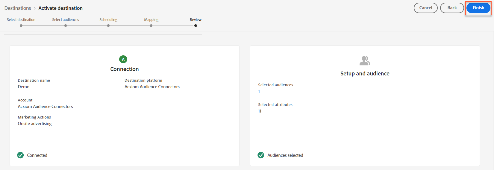

# Destination [!DNL Acxiom Audience Connection]

Utilisez la destination [!DNL Acxiom Audience Connection] pour améliorer les audiences avec la technologie [Real ID™](https://www.acxiom.com/real-id/real-id/) de [!DNL Acxiom]. Activez ensuite ces audiences sur plusieurs plateformes, telles que [!DNL Altice], [!DNL Ampersand], [!DNL Comcast], etc.

>[!NOTE]
>
>Ce connecteur de destination et cette page de documentation sont créés et gérés par l’équipe [!DNL Acxiom]. Pour toute demande ou information, contactez [!DNL Acxiom] directement à l’adresse [acxiom-adobe-help@acxiom.com](mailto:acxiom-adobe-help@acxiom.com).

Pour créer un connecteur de destination [!DNL Acxiom Audience Connection] à l’aide de l’interface utilisateur [!DNL Adobe Experience Platform], procédez comme suit. Utilisez ce connecteur pour créer et distribuer des audiences vers des destinations sélectionnées.

## Cas d’utilisation {#use-cases}

Les cas d’utilisation suivants montrent comment utiliser la destination [!DNL Acxiom Audience Connection].

### Envoi d’audiences de [!DNL Experience Platform] vers votre compte [!DNL Acxiom] {#send-audiences}

Utilisez ce connecteur de destination pour envoyer des audiences de [!DNL Experience Platform] vers votre compte [!DNL Acxiom] pour l’acquisition cross-canal.

Par exemple, le service des opérations marketing d’une marque mondiale de services financiers s’intéresse à l’acquisition de clients cross-canal par le biais de plusieurs plateformes publicitaires. Ils peuvent utiliser le connecteur de destination [!DNL Acxiom Audience Connection] pour envoyer des audiences de [!DNL Experience Platform] à [!DNL Acxiom], améliorer les audiences avec la technologie [!DNL Real ID] de [!DNL Acxiom] et activer les audiences vers plusieurs plateformes, telles que [!DNL Altice], [!DNL Ampersand], [!DNL Comcast], etc.

## Conditions préalables {#prerequisites}

Avant de configurer la destination [!DNL Acxiom Audience Connection], remplissez les conditions préalables suivantes.

* **Confirmer les conditions d’utilisation :** lisez et signez les conditions d’utilisation de [!DNL Acxiom]. Vous recevez le lien vers le contrat une fois la commande client exécutée terminée. Tant que vous n’avez pas signé le contrat, la carte de destination [!DNL Acxiom Audience Connection] n’apparaît pas dans le catalogue des destinations [!DNL Experience Platform]. Une fois que vous avez accepté et signé le contrat, [!DNL Adobe] terminez la configuration et la carte de destination [!DNL Acxiom Audience Connection] devient visible.
* **Connaître votre ID d’organisation [!DNL Adobe] :** votre ID d’organisation [!DNL Adobe] est nécessaire pour remplir vos conditions d’utilisation. Voir la rubrique *Organisations dans Experience Cloud* de [!DNL Adobe] pour plus d’informations sur la manière d’[afficher votre ID d’organisation](https://experienceleague.adobe.com/fr/docs/core-services/interface/administration/organizations#concept_EA8AEE5B02CF46ACBDAD6A8508646255).

## Audiences prises en charge {#supported-audiences}

Cette section décrit les types d’audiences que vous pouvez exporter vers cette destination.

| Origine de l’audience | Pris en charge | Description |
| --------- | ---------- | ---------- |
| [!DNL Segmentation Service] | Oui | Audiences générées via le [!DNL Experience Platform] [Segmentation Service](/help/segmentation/home.md). |
| Toutes les autres origines d’audience | Oui | Cette catégorie inclut toutes les origines d’audience en dehors des audiences générées par le [!DNL Segmentation Service]. Découvrez les [différentes origines d’audience](/help/segmentation/ui/audience-portal.md#customize). Voici quelques exemples : <ul><li>audiences de chargement personnalisées [importées](/help/segmentation/ui/audience-portal.md#import-audience) dans [!DNL Experience Platform] à partir de fichiers CSV,</li><li>les audiences semblables,</li><li>les audiences fédérées,</li><li>les audiences générées dans d’autres applications [!DNL Experience Platform] telles que [!DNL Adobe Journey Optimizer],</li><li>et plus encore.</li></ul> |

{style="table-layout:auto"}

### Audiences prises en charge par type de données {#supported-audiences-data-type}

Le tableau suivant décrit les types de données d’audience que vous pouvez exporter vers cette destination.

| Type de données d’audience | Pris en charge | Description | Cas d’utilisation |
| -------------------- | ----------- | ------------- | ----------- |
| [Audiences de personnes](/help/segmentation/types/people-audiences.md) | Oui | En fonction des profils client. Utilisez-les pour cibler des groupes spécifiques de personnes dans le cadre de campagnes marketing. | Acheteurs fréquents, personnes abandonnant leur panier |
| [Audiences de compte](/help/segmentation/types/account-audiences.md) | Non | Ciblez des individus au sein d’organisations spécifiques pour les stratégies marketing basées sur les comptes. | Marketing B2B |
| [Audiences de prospects ](/help/segmentation/types/prospect-audiences.md) | Non | Ciblez les individus qui ne sont pas encore clients, mais qui partagent des caractéristiques avec votre audience cible. | Prospection à l’aide de données tierces |
| [Exportations de jeux de données](/help/catalog/datasets/overview.md) | Non | Collections de données structurées stockées dans le lac de données [!DNL Adobe Experience Platform]. | Rapports, workflows de science des données |

{style="table-layout:auto"}

## Type et fréquence d’exportation {#export-type-frequency}

Le tableau suivant décrit le type et la fréquence d’exportation des destinations.

| Élément | Type | Notes |
| ---- | ---- | ----- |
| Type d’exportation | **[!UICONTROL Audience export]** | Exporte tous les membres d’une audience avec les identifiants (nom, numéro de téléphone ou autres) utilisés dans la destination [!DNL Acxiom Audience Connection]. |
| Fréquence des exportations | **[!UICONTROL Batch]** | Les destinations par lots exportent des fichiers vers des plateformes en aval par incréments de trois, six, huit, douze ou vingt-quatre heures. En savoir plus sur les [destinations basées sur des fichiers par lots](/help/destinations/destination-types.md#file-based). |

{style="table-layout:auto"}

## Destinations prises en charge {#supported-destinations}

Activez les audiences vers les plateformes suivantes via la destination [!DNL Acxiom Audience Connection].

* [!DNL Altice]
* [[!DNL Amazon]](#amazon)
* [!DNL Ampersand]
* [!DNL Comcast]
* [!DNL Cox]
* [[!DNL Facebook]](#facebook)
* [[!DNL LG Ads]](#lg-ads)
* [[!DNL Pinterest]](#pinterest)
* [!DNL Spectrum]
* [!DNL Viant]
* [[!DNL Vizio]](#vizio)

## Se connecter à la destination {#connect}

[!DNL Experience Platform] gère automatiquement l’authentification pour la destination [!DNL Acxiom Audience Connection].

>[!IMPORTANT]
>
>Pour vous connecter à la destination, vous avez besoin des **[!UICONTROL View Destinations]** et **[!UICONTROL Manage Destinations]** [autorisations de contrôle d’accès](/help/access-control/home.md#permissions). Lisez la [présentation du contrôle d’accès](/help/access-control/ui/overview.md) ou contactez votre administrateur de produit pour obtenir les autorisations requises.

## Paramètres spécifiques à la destination {#destination-settings}

Certaines destinations [!DNL Acxiom Audience Connection] nécessitent des informations supplémentaires. Les sections suivantes fournissent des instructions détaillées sur la configuration de ces options.

### [!DNL Amazon] {#amazon}

Pour configurer les détails de la destination, renseignez les champs suivants.

* **[!UICONTROL Publisher Account ID]** : saisissez l’ID du compte d’éditeur associé à cette destination.

  ![Copie d’écran du panneau des détails de la destination [!DNL Amazon] affichant le champ ID du compte d’éditeur.](../../assets/catalog/advertising/acxiom-audience-distribution/amazon_destination_details.png){zoomable="yes"}

### [!DNL Facebook] {#facebook}

Pour configurer les détails de la destination, renseignez les champs suivants.

* **[!UICONTROL Destination Account ID]** : saisissez l’identifiant du compte de destination pour cette destination.

  ![Copie d’écran du panneau des détails de la destination [!DNL Facebook] affichant le champ Identifiant du compte de destination.](../../assets/catalog/advertising/acxiom-audience-distribution/facebook_destination_details.png){zoomable="yes"}

### [!DNL LG Ads] {#lg-ads}

Pour configurer les détails de la destination, renseignez les champs suivants.

* **[!UICONTROL Segment Category]** : catégorie cible ou verticale de votre segment. Exemple : services financiers, automobile ou santé.

  ![Copie d’écran du panneau Détails de la destination [!DNL LG Ads] affichant le champ Catégorie de segments.](../../assets/catalog/advertising/acxiom-audience-distribution/lg_ads_destination_details.png){zoomable="yes"}

### [!DNL Pinterest] {#pinterest}

Pour configurer les détails de la destination, renseignez les champs suivants.

* **[!UICONTROL Destination Account ID]** : saisissez l’identifiant du compte de destination pour cette destination.

  ![Copie d’écran du panneau des détails de la destination [!DNL Pinterest] affichant le champ Identifiant du compte de destination.](../../assets/catalog/advertising/acxiom-audience-distribution/pinterest_destination_details.png){zoomable="yes"}

### [!DNL Vizio] {#vizio}

Pour configurer les détails de la destination, renseignez les champs suivants.

* **[!UICONTROL Advertiser Name]** : saisissez le nom de l’annonceur pour cette destination.

  ![Copie d’écran du panneau des détails de la destination [!DNL Vizio] affichant le champ Nom de l’annonceur.](../../assets/catalog/advertising/acxiom-audience-distribution/vizio_destination_details.png){zoomable="yes"}

## Activer des audiences vers cette destination {#activate}

Consultez la section [Activer des données d’audience vers des destinations d’exportation de profils par lots](/help/destinations/ui/activate-batch-profile-destinations.md) pour obtenir des instructions sur l’activation des audience vers cette destination.

>[!IMPORTANT]
>
>* Pour activer les données, vous avez besoin des autorisations de contrôle d’accès **[!UICONTROL View Destinations]**, **[!UICONTROL Activate Destinations]**, **[!UICONTROL View Profiles]** et **[!UICONTROL View Segments]** [Access control](/help/access-control/home.md#permissions). Lisez la [présentation du contrôle d’accès](/help/access-control/ui/overview.md) ou contactez votre administrateur ou administratrice du produit pour obtenir les autorisations requises.
>* Pour exporter des *identités*, vous devez disposer de l’autorisation de contrôle d’accès [**[!UICONTROL View Identity Graph]**](/help/access-control/home.md#permissions).   {width="100" zoomable="yes"}

>[!NOTE]
>
>La destination [!DNL Acxiom Audience Connection] ne prend en charge que les exportations de fichiers complets.

### Mapper les attributs et les identités {#map}

Pour recevoir correctement les données d’audience, mappez les champs sources de [!DNL Experience Platform] aux champs cibles [!DNL Acxiom Audience Connection] corrects.

Les champs cibles suivants sont préremplis automatiquement dans l[!DNL Acxiom]ordre requis. Vous devez mapper un champ source à chaque champ cible pour terminer le flux d’activation.

>[!IMPORTANT]
>
>Tous les champs cibles doivent être mappés dans l’interface utilisateur. Cependant, seuls **[!UICONTROL Last Name]**, **[!UICONTROL Address Line 1]**, **[!UICONTROL City]**, **[!UICONTROL State]** et **[!UICONTROL Zip Code]** nécessitent des données réelles dans votre schéma de profil. Mappez tous les champs source disponibles aux champs cibles restants pour répondre aux exigences de l’interface utilisateur.

| Nom du champ | Description | Requis par l’interface utilisateur | Données requises pour le traitement | Ordre des champs | Longueur maximale |
| -------------------- | ------------ | ------------------ | ---------------------------- | ----------- | ---------- |
| Prénom | Prénom de l&#39;individu | Oui | Non | 1 | 255 |
| Milieu | Deuxième prénom ou initiale de l’individu | Oui | Non | 2 | 50 |
| Nom | Nom de famille de la personne | Oui | **Oui** | 3 | 255 |
| Suffixe générationnel | Suffixe de l’individu | Oui | Non | 4 | 10 |
| Ligne d&#39;adresse 1 | Champ Adresse 1 de la résidence principale | Oui | **Oui** | 5 | 255 |
| Ligne d&#39;adresse 2 | Champ adresse 2 de la résidence principale | Oui | Non | 6 | 255 |
| Ville | Ville de résidence principale | Oui | **Oui** | 7 | 255 |
| État | Abréviation nationale de la résidence principale | Oui | **Oui** | 8 | 2 |
| Code postal | Code postal complet de la résidence principale | Oui | **Oui** | 9 | 10 |
| E-mail | Principal d’e-mail. Par défaut, ce champ est utilisé comme clé de déduplication pour rendre les enregistrements uniques. | Oui | Non | 10 | 255 |
| Téléphone | Numéro de téléphone de l’individu (indicatif régional + numéro). Par défaut, ce champ est utilisé comme clé de déduplication pour rendre les enregistrements uniques. | Oui | Non | 11 | 10 |

{style="table-layout:auto"}

Dans la colonne **[!UICONTROL Source Field]** , saisissez le nom de chaque attribut source à mapper au champ cible correspondant. Ou sélectionnez **[!UICONTROL Select source field]** pour parcourir les champs sources disponibles.

![Écran de mappage affichant les colonnes de champs source et cible avec les champs obligatoires de [!DNL Acxiom] préremplis pour la destination [!DNL Acxiom Audience Connection].](../../assets/catalog/advertising/acxiom-audience-distribution/mapping_screen.png){zoomable="yes"}

Après avoir mappé tous les champs, sélectionnez **[!UICONTROL Next]**.

Pour utiliser un schéma non standard, consultez le guide de l’interface utilisateur [Query Service](/help/query-service/ui/overview.md) pour mapper vos noms de champ au schéma standard [!DNL Adobe].

### Vérifier la destination {#review}

Une fois toutes les étapes effectuées, vérifiez le statut de la connexion de destination et les détails de l’audience avant de l’activer. Les audiences que vous avez sélectionnées apparaissent dans une liste. Chaque audience est un appel distinct à l’API [!DNL Acxiom Audience Connection].

Si les résultats vous conviennent, sélectionnez **[!UICONTROL Finish]** pour activer la destination.

{zoomable="yes"}

## Résolution des problèmes {#troubleshooting}

Si votre représentant de destination ne parvient pas à localiser votre audience, contactez votre représentant de [!DNL Adobe] pour obtenir de l’aide.

Fournissez les informations suivantes à votre représentant [!DNL Adobe] :

* Nom de l’audience
* Nom de la destination
* Date d’activation de l’audience
* Nom du fichier exporté

## Étapes suivantes {#next-steps}

Vous avez activé une audience sur la plateforme de destination sélectionnée. Ensuite, contactez le représentant de votre plateforme de destination pour commencer à configurer votre campagne.

## Utilisation et gouvernance des données {#data-usage-governance}

Lors de la gestion de vos données, toutes les destinations [!DNL Adobe Experience Platform] se conforment aux politiques d’utilisation des données. Pour obtenir des informations détaillées sur la manière dont [!DNL Adobe Experience Platform] applique la gouvernance des données, consultez la [Présentation de la gouvernance des données](/help/data-governance/home.md).
