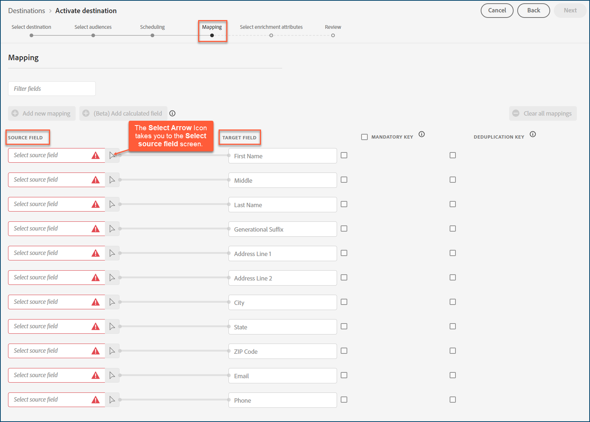

# [!DNL Acxiom Audience Distribution] destination

>[!NOTE]
>
>La destination [!DNL Acxiom Audience Distribution] est en version bêta. Ce connecteur de destination et cette page de documentation sont créés et gérés par l’équipe [!DNL Acxiom]. Pour toute demande de mise à jour ou de demande de mise à jour, contactez Acxiom directement [ici](mailto:acxiom-adobe-help@acxiom.com).

Utilisez la destination [!DNL Acxiom Audience Distribution] pour améliorer les audiences avec la technologie [!DNL Acxiom's] [Real ID™](https://www.acxiom.com/real-id/real-id/) et activer les audiences sur plusieurs plateformes, telles que [!DNL Altice], [!DNL Ampersand], [!DNL Comcast], etc.

Ce tutoriel fournit des instructions pour créer un connecteur de destination [!DNL Acxiom Audience Distribution] à l’aide de l’interface utilisateur [!DNL Adobe Experience Platform]. Ce connecteur est utilisé pour créer et distribuer des audiences vers des destinations sélectionnées.

## Cas d’utilisation {#use-cases}

Pour vous aider à mieux comprendre comment et à quel moment utiliser la destination [!DNL Acxiom Audience Distribution], voici un exemple de cas d’utilisation que les clients [!DNL Adobe Experience Platform] peuvent résoudre à l’aide de ce connecteur.

### Envoi d’audiences de l’Experience Platform vers votre compte Acxiom {#send-audiences}

Utilisez ce connecteur de destination si vous êtes un professionnel du marketing qui souhaite envoyer des audiences de [!DNL Experience Platform] vers votre compte [!DNL Acxiom] pour l’acquisition cross-canal.

Par exemple, le service des opérations marketing d’une marque de services financiers internationaux s’intéresse à l’acquisition cross-canal de clients par le biais de plusieurs plateformes publicitaires. Ils peuvent utiliser le connecteur de destination [!DNL Acxiom Audience Distribution] pour envoyer des audiences de [!DNL Experience Platform] vers [!DNL Acxiom], améliorer les audiences avec la technologie [!DNL Acxiom's Real ID] et activer les audiences sur plusieurs plateformes, telles que [!DNL Altice], [!DNL Ampersand], [!DNL Comcast], etc.

## Conditions préalables {#prerequisites}

* **Confirmer les conditions d’utilisation :** Avant de pouvoir configurer une nouvelle destination [!DNL Acxiom Audience Distribution], vous devez lire et signer le contrat [!DNL Acxiom's] sur les conditions d’utilisation. Vous recevrez le lien vers le contrat une fois votre commande client exécutée. Tant que vous ne signez pas l’accord, la carte de destination [!DNL Acxiom Audience Distribution] ne s’affiche pas dans le catalogue de destination Experience Platform. Une fois que vous avez accepté et signé le contrat, [!DNL Adobe] termine votre processus d’intégration et la carte de destination [!DNL Acxiom Audience Distribution] s’affiche.
* **Connaissez votre ID d’organisation d’Adobe :** Votre ID d’organisation [!DNL Adobe] est nécessaire pour remplir votre contrat d’utilisation des conditions d’utilisation. Voir la rubrique [!DNL Adobe's] *Organisations en Experience Cloud* pour plus d&#39;informations sur la [consultation de l&#39;ID d&#39;organisation](https://experienceleague.adobe.com/fr/docs/core-services/interface/administration/organizations#concept_EA8AEE5B02CF46ACBDAD6A8508646255).

## Destinations prises en charge {#supported-destinations}

La destination [!DNL Acxiom Audience Distribution] prend actuellement en charge l’activation de l’audience sur les plateformes suivantes. 

* [!DNL Altice]
* [!DNL Ampersand]
* [!DNL Comcast]
* [!DNL Cox]
* [[!DNL LG Ads]](#lg-ads)
* [!DNL Spectrum]
* [!DNL Viant]

## Se connecter à la destination {#connect}

L’authentification à la destination [!DNL Acxiom's Audience Distribution] est automatiquement gérée en arrière-plan pour votre commodité.

## Paramètres spécifiques à la destination {#destination-settings}

Certaines destinations [!DNL Acxiom Audience Distribution] requièrent des informations supplémentaires. Les sections ci-dessous fournissent des conseils détaillés sur la configuration de ces options.

### [!DNL LG Ads] {#lg-ads}

Pour configurer les détails de la destination, renseignez les champs ci-dessous.

* **Catégorie de segment** : catégorie ou secteur cible de votre segment. Exemple : services financiers, automobile, santé, etc.

## Activer des audiences vers cette destination {#activate}

>[!IMPORTANT]
> 
>* Pour activer les données, vous avez besoin des **&#x200B;**, **[!UICONTROL Activer les destinations]**, **&#x200B;**&#x200B;et **&#x200B;**&#x200B;[  autorisations de contrôle d’accès](/help/access-control/home.md#permissions). Lisez la [présentation du contrôle d’accès](/help/access-control/ui/overview.md) ou contactez votre administrateur ou administratrice du produit pour obtenir les autorisations requises.
>* Pour exporter des *identités*, vous avez besoin de l&#39;autorisation **[!UICONTROL Afficher le graphique d&#39;identités]** [&#128279;](/help/access-control/home.md#permissions).   {width="100" zoomable="yes"}

Consultez la section [Activer des données d’audience vers des destinations d’exportation de profils par lots](/help/destinations/ui/activate-batch-profile-destinations.md) pour obtenir des instructions sur l’activation des audience vers cette destination.

>[!NOTE]
>
>La destination [!DNL Acxiom Audience Distribution] ne prend en charge que les exportations complètes de fichiers.

### Mapper les attributs et les identités {#map}

Pour que la destination [!DNL Acxiom Audience Distribution] reçoive correctement les données d’audience, vous devez mapper les champs source de l’Experience Platform aux champs cibles [!DNL Acxiom Audience Distribution] corrects.

[!DNL Acxiom Audience Distribution] autorise uniquement le mappage aux champs cibles suivants. Les champs cibles décrits dans le tableau ci-dessous doivent être mappés dans l’ordre indiqué ci-dessous.

| Nom du champ | Description | Obligatoire | Ordre du champ | Longueur max. |
|---|---|---|---|---|          
| Prénom | Prénom de l’individu | Non | 1 | 255 |
| Moyen | Nom intermédiaire ou initial de l’individu | Non | 2 | 50 |
| Nom | Nom de la personne | Oui | 3 | 255 |
| Suffixe générique | Suffixe de l’individu | Non | 4 | 10 |
| Ligne d’adresse 1 | Adresse 1 : champ de résidence principale | Oui | 5 | 255 |
| Ligne d’adresse 2 | Champ d&#39;adresse 2 de la résidence principale | Non | 6 | 255 |
| Ville | Ville de résidence principale | Oui | 7 | 255 |
| État | Abréviation de l&#39;Etat de résidence principale | Oui | 8 | 2 |
| Code postal | Code postal complet de la résidence principale | Oui | 9 | 10 |
| E-mail | Principal d&#39;email Par défaut, ce champ est utilisé comme clé de déduplication pour rendre les enregistrements uniques. | Non | 10 | 255 |
| Téléphone | Numéro de téléphone d’un individu (indicatif régional + numéro)  Par défaut, ce champ est utilisé comme clé de déduplication pour rendre les enregistrements uniques. | Non | 11 | 10 |

Dans la colonne **[!UICONTROL Champ Source]** , saisissez le nom de chacun des attributs source que vous souhaitez mapper au champ cible correspondant, ou sélectionnez l’icône en forme de flèche pour ouvrir l’écran **[!UICONTROL Sélectionner le champ source]** . 

Après avoir mappé tous les champs, sélectionnez **[!UICONTROL Suivant]**.

Si vous n’utilisez pas le schéma standard [!DNL Adobe's], consultez la documentation [Guide de l’interface utilisateur de Query Service](../../../query-service/ui/overview.md) pour plus d’informations sur l’utilisation du service de requête pour remplir le schéma standard [!DNL Adobe] avec vos noms de champ.

### Réviser {#review}

Une fois toutes les étapes ci-dessus terminées, vous avez la possibilité de vérifier l’état de votre connexion de destination et les détails de l’audience avant de l’activer (de la distribuer). Les audiences que vous avez sélectionnées s’affichent en bas de la liste. Chaque audience sera un appel distinct à l’API [!DNL Acxiom Audience Distribution].

Si les résultats vous conviennent, sélectionnez **[!UICONTROL Terminer]** pour activer votre destination.

## Dépannage {#troubleshooting}

Si votre représentant de destination ne parvient pas à localiser votre audience, contactez votre représentant [!DNL Adobe] pour obtenir de l’aide.

Vous devrez fournir les informations suivantes à votre représentant [!DNL Adobe] :
* Nom de l’audience
* Nom de la destination
* Date d’activation de l’audience
* Nom de fichier exporté

## Étapes suivantes {#next-steps}

En suivant ce tutoriel, vous avez correctement activé une audience sur la plateforme de destination sélectionnée. Contactez ensuite votre représentant de plateforme de destination pour commencer à configurer votre campagne.

## Utilisation et gouvernance des données {#data-usage-governance}

Lors de la gestion de vos données, toutes les destinations [!DNL Adobe Experience Platform] se conforment aux politiques d’utilisation des données. Pour obtenir des informations détaillées sur la manière dont [!DNL Adobe Experience Platform] applique la gouvernance des données, consultez la [Présentation de la gouvernance des données](https://experienceleague.adobe.com/fr/docs/experience-platform/data-governance/home).

