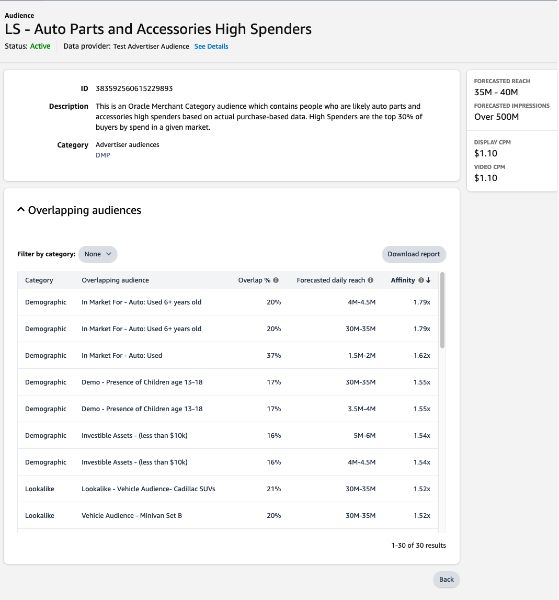

# Connexion Amazon Ads {#amazon-ads}

## Vue d’ensemble {#overview}

[!DNL Amazon Ads] offre toute une gamme d&#39;options pour vous aider à atteindre vos objectifs publicitaires aux vendeurs enregistrés, aux vendeurs, aux vendeurs de livres, aux auteurs de Kindle Direct Publishing (KDP), aux développeurs d&#39;applications et/ou aux agences.

L’intégration [!DNL Amazon Ads] à Adobe Experience Platform permet une intégration clé en main à [!DNL Amazon Ads] produits , y compris Amazon DSP (ADSP) et Amazon Marketing Cloud (AMC).

En utilisant la destination [!DNL Amazon Ads] dans Adobe Experience Platform, les utilisateurs et utilisatrices peuvent définir les audiences de l’annonceur pour le ciblage et l’activation sur Amazon DSP.  En outre, les utilisateurs peuvent charger leurs données dans [!DNL Amazon Marketing Cloud] pour connaître les performances par audience, les dimensions fournies par l’annonceur, l’appartenance à des segments Amazon ou d’autres signaux disponibles dans AMC. Après avoir chargé les audiences de l’annonceur vers l’AMC, les utilisateurs peuvent utiliser [!DNL Amazon Marketing Cloud] pour modifier, améliorer ou ajouter aux membres de l’audience à l’aide des signaux Amazon dans [!DNL Amazon Marketing Cloud].

AMC rassemble des signaux uniques provenant de toutes les propriétés détenues et exploitées par Amazon, couvrant plusieurs médias, y compris l’affichage, la vidéo, la télévision en flux continu, l’audio et les publicités sponsorisées. Les utilisateurs peuvent facilement envoyer des segments organisés de Adobe Experience Platform vers AMC pour améliorer l’apprentissage tels que les groupes sur le marché des audiences, les cohortes de style de vie et les modèles d’engagement de la marque. Les segments augmentés peuvent ensuite être utilisés pour optimiser les activations de médias dans Amazon DSP.

>[!IMPORTANT]
>
>Ce connecteur de destination et cette page de documentation sont créés et gérés par l’équipe *[!DNL Amazon Ads]*. Pour toute demande ou information, contactez directement l’équipe d’Amazon Ads à l’adresse *`amc-support@amazon.com`.*

## Cas d’utilisation {#use-cases}

Pour mieux comprendre quand et comment utiliser la destination *[!DNL Amazon Ads]*, consultez les exemples de cas d’utilisation ci-dessous que la clientèle de Adobe Experience Platform peut résoudre.

### Activation et ciblage {#activation-and-targeting}

Cette intégration à Amazon DSP permet aux annonceurs [!DNL Amazon Ads] de transmettre les audiences CDP des annonceurs de Adobe Experience Platform à Amazon DSP afin de créer des audiences d’annonceurs pour le ciblage publicitaire. Configurez Amazon DSP pour effectuer un ciblage positif ou négatif (suppression) des audiences.

### Analyses et mesures {#analytics-and-measurement}

Cette intégration à [!DNL Amazon Marketing Cloud] (AMC) permet aux annonceurs [!DNL Amazon Ads] de transmettre des segments CDP du formulaire Adobe Experience Platform à AMC. Les annonceurs peuvent ensuite joindre les entrées CDP avec des signaux [!DNL Amazon Ads] et effectuer des analyses personnalisées sur des sujets tels que l’impact des médias, les segments d’audience et les parcours des clients dans un format conforme à la confidentialité. Par exemple, un annonceur peut charger une liste de ses clients existants pour connaître les performances agrégées de la campagne publicitaire ou les statistiques agrégées des événements de conversion on-Amazon, tels que l’affichage d’une page des détails d’un produit, l’ajout d’un produit à un panier ou l’achat d’un produit.

### Optimisation d’Advertising

Cette intégration à [!DNL Amazon Marketing Cloud] (AMC) permet aux annonceurs de charger leurs propres listes de clients et, à l’aide de [!DNL Amazon Marketing Cloud] SQL, d’effectuer régulièrement des analyses de chevauchement, des suppressions, des ajouts ou des optimisations sur les audiences avant de créer une audience prête pour l’activation dans Amazon DSP pour le ciblage.

## Conditions préalables {#prerequisites}

Pour utiliser la connexion [!DNL Amazon Ads] avec Adobe Experience Platform, les utilisateurs doivent d’abord avoir accès à un compte publicitaire Amazon DSP ou à une instance [!DNL Amazon Marketing Cloud]. Pour configurer ces instances, rendez-vous sur la page suivante du site web [!DNL Amazon Ads] :

* [Commencer avec Amazon DSP](https://advertising.amazon.com/solutions/products/amazon-dsp)
* [Prise en main d’Amazon Marketing Cloud](https://advertising.amazon.com/solutions/products/amazon-marketing-cloud)

## Identités prises en charge {#supported-identities}

La connexion *[!DNL Amazon Ads]* prend en charge l’activation des identités décrites dans le tableau ci-dessous. En savoir plus sur les [identités](/help/identity-service//features/namespaces.md). Pour plus d’informations sur les identités prises en charge par [!DNL Amazon Ads], consultez le [Centre de support d’Amazon DSP](https://advertising.amazon.com/dsp/help/ss/en/audiences#GA6BC9BW52YFXBNE).

| Identité cible | Description | Considérations |
|---|---|---|
| phone_sha256 | Numéros de téléphone hachés avec l’algorithme SHA256 | Adobe Experience Platform prend en charge le texte brut et les numéros de téléphone hachés avec SHA256. Lorsque votre champ source contient des attributs non hachés, cochez l’option **[!UICONTROL Appliquer la transformation]** pour que [!DNL Experience Platform] hache automatiquement les données lors de l’activation. |
| email_lc_sha256 | Adresses e-mail hachées avec l’algorithme SHA256 | Adobe Experience Platform prend en charge le texte brut et les adresses e-mail hachées avec SHA256. Lorsque votre champ source contient des attributs non hachés, cochez l’option **[!UICONTROL Appliquer la transformation]** pour que [!DNL Experience Platform] hache automatiquement les données lors de l’activation. |
| `firstName` | Prénom de l’utilisateur | Prend en charge le texte brut ou le SHA256. Si du texte brut est utilisé, activez [!UICONTROL  Appliquer la transformation ] dans l’interface utilisateur d’Adobe. |
| `lastName` | Nom de famille de l&#39;utilisateur | Prend en charge le texte brut ou le SHA256. Si du texte brut est utilisé, activez [!UICONTROL  Appliquer la transformation ] dans l’interface utilisateur d’Adobe. |
| `street` | Adresse de l’utilisateur au niveau de la rue | Seule SHA256 entrée hachée est prise en charge. Normalisez avant de procéder au hachage. N’activez **** la transformation côté Adobe. |
| `city` | Ville de l’utilisateur | Prend en charge le texte brut ou le SHA256. Si du texte brut est utilisé, activez [!UICONTROL  Appliquer la transformation ] dans l’interface utilisateur d’Adobe. |
| `state` | Département ou province de l&#39;utilisateur | Prend en charge le texte brut ou le SHA256. Si du texte brut est utilisé, activez [!UICONTROL  Appliquer la transformation ] dans l’interface utilisateur d’Adobe. |
| `zip` | Code postal de l’utilisateur | Prend en charge le texte brut ou le SHA256. Si du texte brut est utilisé, activez [!UICONTROL  Appliquer la transformation ] dans l’interface utilisateur d’Adobe. |
| `country` | Pays de l’utilisateur | Prend en charge le texte brut ou le SHA256. Si du texte brut est utilisé, activez [!UICONTROL  Appliquer la transformation ] dans l’interface utilisateur d’Adobe. |

{style="table-layout:auto"}

## Type et fréquence d’exportation {#export-type-frequency}

Reportez-vous au tableau ci-dessous pour plus d’informations sur le type et la fréquence d’exportation des destinations.

| Élément | Type | Notes |
| ---------|----------|---------|
| Type d’exportation | **[!UICONTROL Exportation d’audience]** | Vous exportez tous les profils membres d’une audience ainsi que les identifiants (nom, numéro de téléphone ou autres) utilisés dans la destination *[!DNL Amazon Ads]*. |
| Fréquence des exportations | **[!UICONTROL Diffusion en continu]** | Les destinations de diffusion en continu sont des connexions basées sur l’API « toujours actives ». Dès qu’un profil est mis à jour dans Experience Platform en fonction de l’évaluation des audiences, le connecteur envoie la mise à jour en aval vers la plateforme de destination. En savoir plus sur les [destinations de diffusion en continu](/help/destinations/destination-types.md#streaming-destinations). |

{style="table-layout:auto"}

## Se connecter à la destination {#connect}

>[!IMPORTANT]
> 
>Pour vous connecter à la destination, vous avez besoin des autorisations de contrôle d’accès **[!UICONTROL Afficher les destinations]** et **[!UICONTROL Gérer les destinations]** . Lisez la [présentation du contrôle d’accès](/help/access-control/ui/overview.md) ou contactez votre administrateur de produit pour obtenir les autorisations requises.

Pour vous connecter à cette destination, procédez comme décrit dans le [tutoriel sur la configuration des destinations](../../ui/connect-destination.md). Dans le workflow de configuration des destinations, renseignez les champs répertoriés dans les deux sections ci-dessous.

### S’authentifier auprès de la destination {#authenticate}

Pour vous authentifier à la destination, renseignez les champs requis et sélectionnez **[!UICONTROL Se connecter à la destination]**.

Vous accédez à l’interface de connexion [!DNL Amazon Ads] où vous sélectionnez d’abord les comptes de l’annonceur auxquels vous souhaitez vous connecter. Lors de la connexion, on vous redirige vers Adobe Experience Platform avec une nouvelle connexion fournie avec l’ID du compte publicitaire que vous avez sélectionné. Sélectionnez le compte publicitaire approprié dans l’écran de configuration de destination pour continuer.

### Renseigner les détails de la destination {#destination-details}

Pour configurer les détails de la destination, renseignez les champs obligatoires et facultatifs ci-dessous. Un astérisque situé en regard d’un champ de l’interface utilisateur indique que le champ est obligatoire.

* **[!UICONTROL Nom]** : un nom par lequel vous reconnaîtrez cette destination à l’avenir.
* **[!UICONTROL Description]** : une description qui vous aidera à identifier cette destination à l’avenir.
* **[!UICONTROL Connexion Amazon Ads]** : sélectionnez l’identifiant du compte [!DNL Amazon Ads] cible utilisé pour la destination.

>[!NOTE]
>
>Après avoir enregistré la configuration de destination, vous ne pourrez pas modifier l’ID publicitaire [!DNL Amazon Ads], même si vous vous authentifiez à nouveau via votre compte Amazon. Pour utiliser un autre ID publicitaire [!DNL Amazon Ads], vous devez créer une nouvelle connexion de destination. Les annonceurs qui sont déjà configurés sur une intégration avec ADSP pour doivent créer un nouveau flux de destination s’ils souhaitent que leurs audiences soient diffusées vers l’AMC ou un autre compte ADSP.

* **[!UICONTROL Zone géographique des annonceurs]** : sélectionnez la zone géographique dans laquelle votre annonceur est hébergé. Pour plus d’informations sur les marchés pris en charge par chaque zone géographique, consultez la [documentation Amazon Ads](https://advertising.amazon.com/API/docs/en-us/info/api-overview#api-endpoints).

* **[!UICONTROL Signal de consentement Amazon Ads]** : vérifiez que toutes les données envoyées via cette connexion ont consenti à utiliser des données personnelles à des fins publicitaires. « ACCORDÉ » indique le consentement donné par Amazon pour utiliser les données personnelles du client à des fins publicitaires. Les valeurs autorisées sont « ACCORDÉ » et « REFUSÉ ». Tous les enregistrements envoyés par le biais de connexions avec « REFUSÉ » seront rejetés pour une utilisation ultérieure dans Amazon Ads.

### Activer les alertes {#enable-alerts}

Vous pouvez activer les alertes pour recevoir des notifications sur le statut de votre flux de données vers votre destination. Sélectionnez une alerte dans la liste et abonnez-vous à des notifications concernant le statut de votre flux de données. Pour plus d’informations sur les alertes, consultez le guide sur l’[abonnement aux alertes des destinations dans l’interface utilisateur](../../ui/alerts.md).

Lorsque vous avez terminé de renseigner les détails sur votre connexion de destination, sélectionnez **[!UICONTROL Suivant]**.

## Activer des audiences vers cette destination {#activate}

>[!IMPORTANT]
> 
>* Pour activer les données, vous avez besoin des autorisations de contrôle d’accès **[!UICONTROL Afficher les destinations]**, **[!UICONTROL Activer les destinations]**, **[!UICONTROL Afficher les profils]** et **[!UICONTROL Afficher les segments]** . Lisez la [présentation du contrôle d’accès](/help/access-control/ui/overview.md) ou contactez votre administrateur ou administratrice du produit pour obtenir les autorisations requises.
>* Pour exporter des *identités*, vous devez disposer de l’autorisation de contrôle d’accès **[!UICONTROL Afficher le graphique d’identités]** .   {width="100" zoomable="yes"}

Consultez la section [Activer les profils et les audiences vers les destinations d’exportation d’audiences en flux continu](/help/destinations/ui/activate-segment-streaming-destinations.md) pour obtenir des instructions sur l’activation des audiences vers cette destination.

### Mapper les attributs et les identités {#map}

La connexion [!DNL Amazon Ads] prend en charge les adresses e-mail et numéros de téléphone hachés à des fins de correspondance d’identité. La capture d’écran ci-dessous fournit un exemple de correspondance compatible avec la connexion [!DNL Amazon Ads] :

* Pour mapper des adresses e-mail hachées, sélectionnez l’espace de noms d’identité `Email_LC_SHA256` comme champ source.
* Pour mapper des numéros de téléphone hachés, sélectionnez l’espace de noms d’identité `Phone_SHA256` comme champ source.
* Pour mapper des adresses e-mail ou des numéros de téléphone non hachés, sélectionnez les espaces de noms d’identité correspondants comme champs source, puis cochez la case `Apply Transformation` pour qu’Experience Platform hache les identités lors de l’activation.
* *NOUVEAU à partir de la version de septembre 2024* : Amazon Ads exige que vous mappiez un champ contenant une valeur `countryCode` au format ISO à 2 caractères afin de faciliter le processus de résolution d’identité (par exemple : US, GB, MX, CA, etc.). Les connexions sans mappages `countryCode` auront un impact négatif sur les taux de correspondance d’identité.

>[!NOTE]
>
>Pour utiliser ces champs :
> 
>* Toutes les valeurs d’identité doivent être normalisées avant l’ingestion. Reportez-vous au [guide de normalisation](https://advertising.amazon.com/help/GCCXMZYCK4RXWS6C).
>* SHA256 hachage est requis, soit du côté client, soit en activant le paramètre de transformation d’Adobe.
>* L’interface utilisateur d’Adobe fournit une case à cocher pour appliquer une transformation par champ d’identité lors de la configuration du connecteur.

Vous ne sélectionnez qu’un seul champ cible donné dans une configuration de destination du connecteur [!DNL Amazon Ads].  Par exemple, si vous envoyez un e-mail professionnel, vous ne pouvez pas également mapper les e-mails personnels dans la même configuration de destination.

Il est vivement recommandé de mapper autant de champs que possible. Si un seul attribut source est disponible, vous pouvez mapper un seul champ. La destination [!DNL Amazon Ads] utilise tous les champs mappés à des fins de mappage, produisant des taux de correspondance plus élevés si d’autres champs sont fournis. Pour plus d’informations sur les identifiants acceptés, consultez la [page d’aide sur les audiences hachées Amazon Ads](https://advertising.amazon.com/dsp/help/ss/en/audiences#GA6BC9BW52YFXBNE).

## Données exportées / Valider l’exportation des données {#exported-data}

Une fois votre audience chargée, vous pouvez vérifier qu’elle a été créée et chargée correctement en procédant comme suit :

**Pour Amazon DSP**

Accédez à votre **[!UICONTROL ID publicitaire]** > **[!UICONTROL Audiences]** > **[!UICONTROL Audiences publicitaires]**. Si votre audience a été créée avec succès et qu’elle contient le nombre minimum de membres, le statut `Active` s’affiche. Vous trouverez plus d’informations sur la taille et la portée de votre audience dans le panneau Portée prévue sur le côté droit de l’interface utilisateur d’Amazon DSP.

**Par[!DNL Amazon Marketing Cloud]**

Dans le navigateur de schéma de gauche, recherchez votre audience sous **[!UICONTROL Annonceur téléchargé]** > **[!UICONTROL aep_audiences]**. Vous pouvez ensuite interroger votre audience dans l’éditeur SQL AMC avec la clause suivante :

`select count(user_id) from adobeexperienceplatf_audience_view_000xyz where external_audience_segment_name = '1234567'`

## Utilisation et gouvernance des données {#data-usage-governance}

Lors de la gestion de vos données, toutes les destinations [!DNL Adobe Experience Platform] se conforment aux politiques d’utilisation des données. Pour obtenir des informations détaillées sur la manière dont [!DNL Adobe Experience Platform] applique la gouvernance des données, consultez la [Présentation de la gouvernance des données](/help/data-governance/home.md).

## Ressources supplémentaires {#additional-resources}

Pour obtenir de la documentation d’aide supplémentaire, consultez les ressources d’aide [!DNL Amazon Ads] suivantes :

* [Centre d’aide Amazon DSP](https://www.amazon.com/ap/signin?openid.pape.max_auth_age=28800&openid.return_to=https%3A%2F%2Fadvertising.amazon.com%2Fdsp%2Fhelp%2Fss%2Fen%2Faudiences&openid.identity=http%3A%2F%2Fspecs.openid.net%2Fauth%2F2.0%2Fidentifier_select&openid.assoc_handle=amzn_bt_desktop_us&openid.mode=checkid_setup&openid.claimed_id=http%3A%2F%2Fspecs.openid.net%2Fauth%2F2.0%2Fidentifier_select&openid.ns=http%3A%2F%2Fspecs.openid.net%2Fauth%2F2.0)

## Journal des modifications {#changelog}

Cette section répertorie les nouvelles fonctionnalités et les mises à jour importantes de la documentation consacrée au connecteur de destination.

+++ Afficher le journal des modifications

| Mois de publication | Type de mise à jour | Description |
|---|---|---|
| Octobre 2025 | Ajout de la prise en charge des champs d’identité supplémentaires | Ajout d’identifiants personnels supplémentaires pris en charge, tels que `firstName`, `lastName`, `street`, `city`, `state`, `zip` et `country`. Le mappage de ces champs peut améliorer les taux de correspondance d’audience. |
| Février 2025 | Ajout de l’exigence d’ajouter **[!UICONTROL un signal de consentement Amazon Ads]** pour exporter les flux de données et promouvoir la destination de la version bêta vers la version générale. |
| Mai 2024 | Nouvelles fonctionnalités et mise à jour de la documentation | Ajout de l’option de mappage pour exporter `countryCode` paramètre dans Amazon Ads. Utilisez `countryCode` dans l’[étape de mappage](#map) pour améliorer vos taux de correspondance d’identité avec Amazon. |
| Mars 2024 | Nouvelles fonctionnalités et mise à jour de la documentation | Ajout de l’option permettant d’exporter les audiences à utiliser dans [!DNL Amazon Marketing Cloud] (AMC). |
| Mai 2023 | Nouvelles fonctionnalités et mise à jour de la documentation | <ul><li>Ajout de la prise en charge de la sélection de la zone géographique de l’annonceur dans le [workflow de connexion de destination](#destination-details).</li><li>Nouvelle documentation sur la fonctionnalité de sélection de la zone géographique de l’annonceur. Pour plus d’informations sur la sélection de la zone géographique de l’annonceur appropriée, consultez la [documentation d’Amazon](https://advertising.amazon.com/API/docs/en-us/info/api-overview#api-endpoints).</li></ul> |
| Mars 2023 | Version initiale | Publication de la destination initiale et de la documentation. |

{style="table-layout:auto"}

+++
