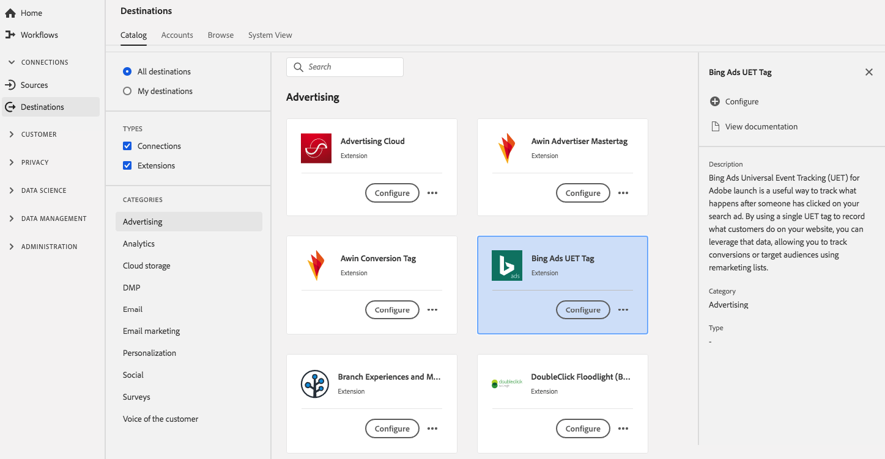

# [!DNL Bing Ads Universal Event Tracking] Extension (UET) {#bing-ads-extension}

## Présentation {#overview}

Le [!DNL Bing Ads Universal Event Tracking] L’extension de balise (UET) est un moyen utile d’effectuer le suivi de ce qui se passe après que quelqu’un a cliqué sur votre annonce de recherche. Utilisez une simple balise UET pour enregistrer ce que font les consommateurs sur votre site web et exploitez ces données pour suivre les conversions et cibler des audiences à l’aide de listes de remarketing.

[!DNL Bing Ads Universal Event Tracking] (UET) est une extension publicitaire dans Adobe Experience Platform. Pour plus d’informations sur les fonctionnalités de l’extension, consultez la page de l’extension dans [Adobe Exchange](https://exchange.adobe.com/experiencecloud.details.100154.html).

Cette destination est une extension de balise. Pour plus d’informations sur le fonctionnement des extensions de balises dans Platform, voir [Présentation des extensions de balise](../launch-extensions/overview.md).

## Conditions préalables  {#prerequisites}

Cette extension est disponible dans la [!DNL Destinations] catalogue pour tous les clients qui ont acheté Platform.

Pour utiliser cette extension, vous devez accéder aux balises dans Adobe Experience Platform. Les balises sont proposées aux clients Adobe Experience Cloud en tant que fonctionnalité à valeur ajoutée incluse. Contactez l’administrateur de votre entreprise pour accéder aux balises et demandez-lui de vous accorder la variable **[!UICONTROL manage_properties]** pour pouvoir installer des extensions.

## Installation de l’extension {#install-extension}

Pour installer le [!DNL Bing Ads Universal Event Tracking] Extension (UET) :

Dans le [Interface de Platform](https://platform.adobe.com/), accédez à **[!UICONTROL Destinations]** > **[!UICONTROL Catalogue]**.

Sélectionnez l’extension dans le catalogue ou utilisez la barre de recherche.

Cliquez sur la destination pour la mettre en surbrillance, puis sélectionnez **[!UICONTROL Configurer]** dans le rail de droite. Si la variable **[!UICONTROL Configurer]** Le contrôle est grisé, vous ne trouvez pas la variable **[!UICONTROL manage_properties]** autorisation. Voir les [Conditions préalables](#prerequisites).

Sélectionnez la propriété de balise dans laquelle vous souhaitez installer l’extension. Vous avez également la possibilité de créer une propriété. Une propriété est un ensemble de règles, d’éléments de données, d’extensions configurées, d’environnements et de bibliothèques. En savoir plus sur les propriétés dans [documentation sur les balises](../../../tags/ui/administration/companies-and-properties.md).

Le workflow vous permet d’accéder à l’interface utilisateur de collecte de données pour terminer l’installation.

Pour plus d’informations sur les options de configuration de l’extension et sur l’aide à l’installation, consultez la [page Bing Ads Universal Event Tracking (UET) sur Adobe Exchange](https://exchange.adobe.com/experiencecloud.details.100154.html).

Vous pouvez également installer l’extension directement dans le [Interface utilisateur de la collecte de données](https://experience.adobe.com/#/data-collection/). Consultez le guide sur la [ajout d’une nouvelle extension](../../../tags/ui/managing-resources/extensions/overview.md#add-a-new-extension) pour plus d’informations.

## Utilisation de l’extension {#how-to-use}

Une fois que vous avez installé l’extension, vous pouvez commencer à configurer des règles. Dans l’interface utilisateur de collecte de données, vous pouvez configurer des règles pour vos extensions installées afin d’envoyer des données d’événement vers la destination de l’extension uniquement dans certains cas. Pour plus d’informations sur la configuration de règles pour vos extensions, consultez la présentation de [rules](../../../tags/ui/managing-resources/rules.md) dans la documentation sur les balises.

## Configuration, mise à niveau et suppression de l’extension {#configure-upgrade-delete}

Vous pouvez configurer, mettre à niveau et supprimer des extensions dans l’interface utilisateur de la collecte de données.

>[!TIP]
>
>Si l’extension est déjà installée sur l’une de vos propriétés, l’interface utilisateur s’affiche toujours. **[!UICONTROL Installer]** pour l’extension . Démarrez le workflow d’installation comme décrit dans la section [Installer l’extension](#install-extension) pour configurer ou supprimer votre extension.

Pour mettre à niveau votre extension, consultez le guide sur la [processus de mise à niveau d&#39;extension](../../../tags/ui/managing-resources/extensions/extension-upgrade.md) dans la documentation sur les balises.
