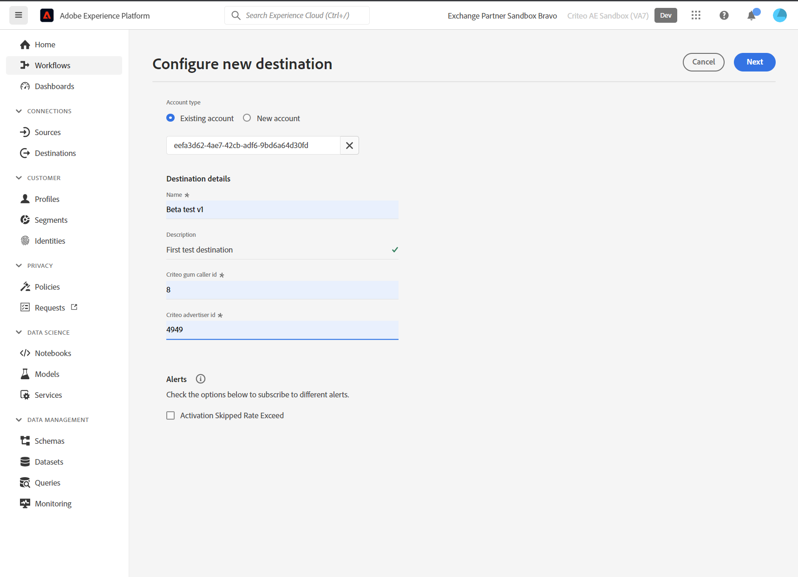

# Connexion Criteo

## Vue d’ensemble {#overview}

>[!IMPORTANT]
>
>Ce connecteur de destination et cette page de documentation sont créés et gérés par Criteo. Pour toute demande ou information, contactez Criteo directement [ici](mailto:criteoTechnicalPartnerships@criteo.com).

Criteo permet de proposer des publicités fiables et percutantes afin d’offrir des expériences plus riches à chaque personne sur Internet. Grâce au plus grand jeu de données du commerce au monde et à la meilleure IA de sa catégorie, Criteo veille à ce que chaque point de contact du parcours d’achat soit personnalisé afin de toucher les clientes et clients avec la bonne annonce, au bon moment.

## Conditions préalables {#prerequisites}

* Vous devez disposer d&#39;un compte utilisateur administrateur sur [Criteo Management Center](https://marketing.criteo.com).
* Vous aurez besoin de votre identifiant publicitaire Criteo (demandez à votre contact Criteo si vous ne possédez pas cet identifiant).
* Vous devrez fournir des [!DNL GUM caller ID], au cas où vous voudriez utiliser [!DNL GUM ID] comme identifiant.

## Limites {#limitations}

* Criteo accepte uniquement les e-mails [!DNL SHA-256] et en texte brut (à transformer en [!DNL SHA-256] avant envoi). Veuillez ne pas envoyer de PII (informations d&#39;identification personnelles, telles que les noms ou numéros de téléphone des individus).
* Criteo nécessite au moins un identifiant à fournir par le client. Il privilégie le [!DNL GUM ID] en tant qu’identifiant par rapport à l’e-mail haché, car il contribue à un meilleur taux de correspondance.


## Identités prises en charge {#supported-identities}

Criteo prend en charge l’activation des identités décrites dans le tableau ci-dessous. En savoir plus sur les [identités](https://experienceleague.adobe.com/docs/experience-platform/identity/namespaces.html#getting-started).

| Identité cible | Description | Considérations |
| --- | --- | --- |
| `email_sha256` | Adresses e-mail hachées avec l’algorithme SHA-256 | Les adresses e-mail hachées en texte brut et SHA-256 sont prises en charge par Adobe Experience Platform. Lorsque votre champ source contient des attributs non hachés, cochez l’option [!UICONTROL Apply transformation] pour qu’Experience Platform hache automatiquement les données lors de l’activation. |
| `gum_id` | Identifiant du cookie Criteo [!DNL GUM] | [!DNL GUM IDs] permettent aux clients de maintenir une correspondance entre leur système d&#39;identification d&#39;utilisateur et l&#39;identification d&#39;utilisateur de Criteo ([!DNL UID]). Si le type d’identifiant est `gum_id`, un paramètre supplémentaire, le [!DNL GUM Caller ID] , doit également être inclus. Contactez l’équipe de votre compte Criteo pour obtenir les [!DNL GUM Caller ID] appropriées ou pour obtenir plus d’informations sur cette synchronisation [!DNL GUM ID], si nécessaire. |

## Audiences prises en charge {#supported-audiences}

Cette section décrit les types d’audiences que vous pouvez exporter vers cette destination.

| Origine de l’audience | Pris en charge | Description |
|---------|----------|----------|
| [!DNL Segmentation Service] | Oui | Audiences générées via Experience Platform [Segmentation Service](../../../segmentation/home.md). |
| Toutes les autres origines d’audience | Non | Cette catégorie inclut toutes les origines d’audience en dehors des audiences générées par le [!DNL Segmentation Service]. Découvrez les [différentes origines d’audience](/help/segmentation/ui/audience-portal.md#customize). Voici quelques exemples : <ul><li> audiences de chargement personnalisées [importées](../../../segmentation/ui/audience-portal.md#import-audience) dans Experience Platform à partir de fichiers CSV,</li><li> les audiences semblables, </li><li> les audiences fédérées, </li><li> les audiences générées dans d’autres applications Experience Platform telles que Adobe Journey Optimizer, </li><li> et plus encore. </li></ul> |

{style="table-layout:auto"}


Audiences prises en charge par type de données d’audience :

| Type de données d’audience | Pris en charge | Description | Cas d’utilisation |
|--------------------|-----------|-------------|-----------|
| [Audiences de personnes](/help/segmentation/types/people-audiences.md) | Oui | En fonction des profils client, ce qui vous permet de cibler des groupes spécifiques de personnes pour les campagnes marketing. | Acheteurs fréquents, personnes abandonnant leur panier |
| [Audiences de compte](/help/segmentation/types/account-audiences.md) | Non | Ciblez des individus au sein d’organisations spécifiques pour les stratégies marketing basées sur les comptes. | Marketing B2B |
| [Audiences de prospects ](/help/segmentation/types/prospect-audiences.md) | Non | Ciblez les individus qui ne sont pas encore clients, mais qui partagent des caractéristiques avec votre audience cible. | Prospection à l’aide de données tierces |
| [Exportations de jeux de données](/help/catalog/datasets/overview.md) | Non | Collections de données structurées stockées dans le lac de données Adobe Experience Platform. | Rapports, workflows de science des données |

{style="table-layout:auto"}


## Type et fréquence d’exportation {#export-type-frequency}

Reportez-vous au tableau ci-dessous pour plus d’informations sur le type et la fréquence d’exportation des destinations.

| Élément | Type | Notes |
| --- | --- | --- |
| Type d’exportation | Exportation d’audience | Vous exportez tous les profils membres d’une audience ainsi que les identifiants (nom, numéro de téléphone ou autres) utilisés dans la destination [!DNL Criteo]. |
| Fréquence des exportations | Diffusion en continu | Les destinations de diffusion en continu sont des connexions basées sur l’API « toujours actives ». Dès qu’un profil est mis à jour dans Experience Platform en fonction de l’évaluation des audiences, le connecteur envoie la mise à jour en aval vers la plateforme de destination. En savoir plus sur les [destinations de diffusion en continu](../../destination-types.md#streaming-destinations). |

## Cas d’utilisation {#use-cases}

Pour mieux comprendre comment utiliser la destination [!DNL Criteo], voici quelques objectifs que les clients Adobe Experience Platform peuvent atteindre à l’aide de [!DNL Criteo] :

### Cas d’utilisation 1 : obtenir le trafic

Présentez votre entreprise avec des offres de produits pertinentes et des créations flexibles. Grâce aux recommandations intelligentes de produits, vos publicités présenteront automatiquement les produits les plus susceptibles de déclencher des visites et un engagement. Le ciblage flexible vous permet de créer des audiences à partir du jeu de données commerciales de Criteo ou de vos propres listes de prospects et segments Adobe CDP.

### Cas d’utilisation 2 : augmentation des conversions de sites web

Lorsque les visiteurs quittent votre site web, rappelez-leur ce qui leur manque avec des annonces de reciblage qui augmentent les conversions en présentant des offres spéciales et des offres hyper pertinentes, où qu’ils aillent ensuite. Connectez votre audience Adobe CDP pour réengager les clients existants ou cibler les consommateurs de la même manière que vos clients les plus fidèles.

## Se connecter à Criteo {#connect}

>[!IMPORTANT]
> 
>Pour vous connecter à la destination, vous avez besoin des **[!UICONTROL View Destinations]** et **[!UICONTROL Manage Destinations]** [autorisations de contrôle d’accès](/help/access-control/home.md#permissions). Lisez la [présentation du contrôle d’accès](/help/access-control/ui/overview.md) ou contactez votre administrateur ou administratrice du produit pour obtenir les autorisations requises.

Pour vous connecter à cette destination, procédez comme décrit dans le [tutoriel sur la configuration des destinations](../../ui/connect-destination.md).

### Authentification au critère

Les étapes de connexion sont les suivantes :

1. Connectez-vous à Adobe Experience Platform et connectez-vous à la destination Criteo.

   

1. Vous serez redirigé vers Criteo pour autoriser la connexion. Vous devrez peut-être d’abord vous connecter avec vos informations d’identification Criteo :

   

   

   


### Paramètres de connexion {#connection-parameters}

Après l’authentification auprès de la destination, renseignez les paramètres de connexion suivants.



| Champ | Description | Obligatoire |
| --- | --- | --- |
| Nom | Un nom pour vous aider à reconnaître cette destination à l’avenir. Le nom que vous choisissez ici sera le nom [!DNL Audience] dans Criteo Management Center et ne pourra pas être modifié ultérieurement. | Oui |
| Description | Une description pour vous aider à identifier cette destination à l’avenir. | Non |
| Identifiant annonceur | Criteo ID publicitaire de votre organisation. Veuillez contacter votre gestionnaire de compte Criteo pour obtenir ces informations. | Oui |
| Criteo [!DNL GUM caller ID] | [!DNL GUM Caller ID] de votre organisation. Contactez l’équipe de votre compte Criteo pour obtenir les [!DNL GUM Caller ID] appropriées ou pour obtenir plus d’informations sur cette synchronisation [!DNL GUM], si nécessaire. | Oui, chaque fois que [!DNL GUM ID] est fourni comme identifiant |

### Activer les alertes {#enable-alerts}

Vous pouvez activer les alertes pour recevoir des notifications sur le statut de votre flux de données vers votre destination. Sélectionnez une alerte dans la liste et abonnez-vous à des notifications concernant le statut de votre flux de données. Pour plus d’informations sur les alertes, consultez le guide sur l’[abonnement aux alertes des destinations dans l’interface utilisateur](../../ui/alerts.md).

Lorsque vous avez terminé de renseigner les détails sur votre connexion de destination, sélectionnez **[!UICONTROL Next]**.

## Activer des audiences vers cette destination {#activate-segments}

>[!IMPORTANT]
> 
>* Pour activer les données, vous avez besoin des autorisations de contrôle d’accès **[!UICONTROL View Destinations]**, **[!UICONTROL Activate Destinations]**, **[!UICONTROL View Profiles]** et **[!UICONTROL View Segments]** [Access control](/help/access-control/home.md#permissions). Lisez la [présentation du contrôle d’accès](/help/access-control/ui/overview.md) ou contactez votre administrateur ou administratrice du produit pour obtenir les autorisations requises.
>* Pour exporter des *identités*, vous devez disposer de l’autorisation de contrôle d’accès **[!UICONTROL View Identity Graph]**[](/help/access-control/home.md#permissions). <br> {width="100" zoomable="yes"}

Consultez la section [Activer les profils et les audiences vers les destinations d’exportation d’audiences en flux continu](../../ui/activate-segment-streaming-destinations.md) pour obtenir des instructions sur l’activation des audiences vers cette destination.

## Données exportées {#exported-data}

Les audiences exportées sont visibles dans le [Centre de gestion Criteo](https://marketing.criteo.com/audience-manager/dashboard).

Le corps de la requête d’ajout d’un profil utilisateur reçu par la connexion [!DNL Criteo] ressemble à ceci :

```json
{
  "data": {
    "type": "ContactlistWithUserAttributesAmendment",
    "attributes": {
      "operation": "add",
      "identifierType": "gum",
      "gumCallerId": "123",
      "identifiers": [
        {
          "identifier": "456",
          "attributes": [
            { "key": "ctoid_GumCaller", "value": "123" },
            { "key": "ctoid_Gum", "value": "456" },
            {
              "key": "ctoid_HashedEmail",
              "value": "98833030dc03751f2b2c1a0017078975fdae951aa6908668b3ec422040f2d4be"
            }
          ]
        }
      ]
    }
  }
}
```

Le corps de la requête de suppression du profil utilisateur reçu par la connexion [!DNL Criteo] ressemble à ceci :

```json
{
  "data": {
    "type": "ContactlistWithUserAttributesAmendment",
    "attributes": {
      "operation": "remove",
      "identifierType": "gum",
      "gumCallerId": "123",
      "identifiers": [
        {
          "identifier": "456",
          "attributes": [
            { "key": "ctoid_GumCaller", "value": "123" },
            { "key": "ctoid_Gum", "value": "456" },
            {
              "key": "ctoid_HashedEmail",
              "value": "98833030dc03751f2b2c1a0017078975fdae951aa6908668b3ec422040f2d4be"
            }
          ]
        }
      ]
    }
  }
}
```

## Utilisation et gouvernance des données {#data-usage}

Toutes les destinations Adobe Experience Platform sont conformes aux politiques d’utilisation des données lors de la gestion de vos données. Pour obtenir des informations détaillées sur la manière dont Adobe Experience Platform applique la gouvernance des données, lisez la [présentation de la gouvernance des données](https://experienceleague.adobe.com/docs/experience-platform/data-governance/home.html?lang=fr).

## Ressources supplémentaires

* [Centre d&#39;aide Criteo](https://help.criteo.com/kb/en)
* [Portail de développement Criteo](https://developers.criteo.com)
