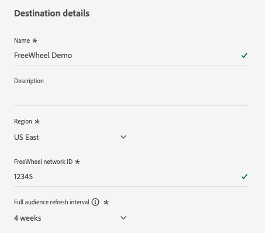

# Connexion [!DNL FreeWheel] {#freewheel}

>[!AVAILABILITY]
>
>La destination [!DNL FreeWheel] est actuellement dans Beta et n’est disponible que pour certains clients et clientes. Pour obtenir l’accès, contactez votre représentant ou représentante Adobe.

## Vue d’ensemble {#overview}

[!DNL FreeWheel] est une plateforme technologique de publicité mondiale qui alimente l&#39;achat et la vente de programmes sur la télévision connectée (CTV), la vidéo et l&#39;inventaire des écrans. [!DNL FreeWheel] fournit un marché piloté par les données qui connecte les annonceurs aux propriétaires de médias premium dans le monde entier.

Utilisez cette destination pour envoyer des audiences de Adobe Experience Platform vers [!DNL FreeWheel]. Les audiences sont diffusées sous forme de fichiers par lots quotidiens et sont disponibles pour le ciblage dans les offres et les campagnes [!DNL FreeWheel].

## Conditions préalables {#prerequisites}

Avant de pouvoir activer des audiences à [!DNL FreeWheel], passez en revue les exigences suivantes :

* **Identifiant réseau FreeWheel** : vous devez disposer d’un identifiant réseau [!DNL FreeWheel] valide. Cette information est fournie par [!DNL FreeWheel] lors de la configuration de votre compte.

## Identités prises en charge {#supported-identities}

[!DNL FreeWheel] prend en charge l’activation des identités décrites dans le tableau ci-dessous. Outre ces identités, vous pouvez utiliser n’importe quelle identité disponible dans votre compte [!DNL FreeWheel]. Consultez [Mappage des attributs et des identités](#map) pour obtenir des instructions sur le mappage d’une identité qui ne figure pas dans le tableau ci-dessous. En savoir plus sur les [identités](/help/identity-service/features/namespaces.md).

| Identité cible | Description | Considérations |
|---|---|---|
| `idfa` | Identifiant Apple pour les annonceurs | Sélectionnez cette identité cible lorsque votre identité source est un espace de noms IDFA. |
| `aaid` | ANDROID ADVERTISING ID | Sélectionnez cette identité cible lorsque votre identité source est un espace de noms GAID. |
| `ctv` | Identifiant de l’appareil TV connecté | Sélectionnez cette identité cible lors du ciblage des appareils CTV. |
| `ip` | Adresse IPv4 | Sélectionnez cette identité cible pour cibler les utilisateurs et utilisatrices en fonction de leur adresse IP. Mappez un attribut de profil contenant une adresse IPv4 valide ou utilisez un champ calculé pour dériver la valeur. |
| `ipv6` | Adresse IPv6 | Sélectionnez cette identité cible pour cibler les utilisateurs en fonction de leur adresse IPv6. Mappez un attribut de profil contenant une adresse IPv6 valide ou utilisez un champ calculé pour dériver la valeur. |

{style="table-layout:auto"}

## Audiences prises en charge {#supported-audiences}

Cette section décrit les types d’audiences que vous pouvez exporter vers cette destination.

| Origine de l’audience | Pris en charge | Description |
|---------|----------|----------|
| [!DNL Segmentation Service] | Oui | Audiences générées via Experience Platform [Segmentation Service](../../../segmentation/home.md). |
| Toutes les autres origines d’audience | Oui | Cette catégorie inclut toutes les origines d’audience en dehors des audiences générées par le [!DNL Segmentation Service]. Découvrez les [différentes origines d’audience](/help/segmentation/ui/audience-portal.md#customize). Voici quelques exemples : <ul><li>audiences de chargement personnalisées [importées](../../../segmentation/ui/audience-portal.md#import-audience) dans Experience Platform à partir de fichiers CSV,</li><li>les audiences semblables,</li><li>les audiences fédérées,</li><li>les audiences générées dans d’autres applications Experience Platform telles que Adobe Journey Optimizer,</li><li>et plus encore.</li></ul> |

{style="table-layout:auto"}

Audiences prises en charge par type de données d’audience :

| Type de données d’audience | Pris en charge | Description | Cas d’utilisation |
|--------------------|-----------|-------------|-----------|
| [Audiences de personnes](/help/segmentation/types/people-audiences.md) | Oui | En fonction des profils client, ce qui vous permet de cibler des groupes spécifiques de personnes pour les campagnes marketing. | Reciblage CTV, suppression de la portée |
| [Audiences de compte](/help/segmentation/types/account-audiences.md) | Non | Ciblez des individus au sein d’organisations spécifiques pour les stratégies marketing basées sur les comptes. | Marketing B2B |
| [Audiences de prospects &#x200B;](/help/segmentation/types/prospect-audiences.md) | Non | Ciblez les individus qui ne sont pas encore clients, mais qui partagent des caractéristiques avec votre audience cible. | Prospection à l’aide de données tierces |
| [Exportations de jeux de données](/help/catalog/datasets/overview.md) | Non | Collections de données structurées stockées dans le lac de données Adobe Experience Platform. | Rapports, workflows de science des données |

{style="table-layout:auto"}

## Type et fréquence d’exportation {#export-type-frequency}

Reportez-vous au tableau ci-dessous pour plus d’informations sur le type et la fréquence d’exportation des destinations.

| Élément | Type | Notes |
|---------|----------|---------|
| Type d’exportation | **[!UICONTROL Profile-based]** | Vous exportez tous les membres d’une audience, ainsi que les champs d’identité souhaités, tels que choisis à l’étape de mappage du [workflow d’activation de destination](/help/destinations/ui/activate-batch-profile-destinations.md#select-attributes). |
| Fréquence des exportations | **[!UICONTROL Batch]** | La première exportation est un instantané complet de tous les profils qualifiés pour les audiences activées. Les exportations suivantes sont des mises à jour incrémentielles quotidiennes qui incluent de nouvelles qualifications d’audience (ajouts) et des sorties d’audience (suppressions). Un intervalle d’actualisation complet de l’audience configurable (4, 8 ou 12 semaines) est également disponible, déclenchant des exportations complètes périodiques en plus des exportations incrémentielles quotidiennes. Les exportations complètes contiennent uniquement les profils actuellement qualifiés. Les sorties d’audience ne sont pas incluses et sont diffusées exclusivement par le biais de mises à jour incrémentielles quotidiennes. En savoir plus sur les [destinations basées sur des fichiers par lots](/help/destinations/destination-types.md#file-based). |

{style="table-layout:auto"}

## Se connecter à la destination {#connect}

>[!IMPORTANT]
>
>Pour vous connecter à la destination, vous avez besoin des **[!UICONTROL View Destinations]** et **[!UICONTROL Manage Destinations]** [autorisations de contrôle d’accès](/help/access-control/home.md#permissions). Lisez la [présentation du contrôle d’accès](/help/access-control/ui/overview.md) ou contactez votre administrateur de produit pour obtenir les autorisations requises.

Pour vous connecter à cette destination, procédez comme décrit dans le [tutoriel sur la configuration des destinations](../../ui/connect-destination.md). Dans le workflow de configuration des destinations, renseignez les champs répertoriés dans les deux sections ci-dessous.

### S’authentifier auprès de la destination {#authenticate}

L’authentification vers la destination [!DNL FreeWheel] est gérée automatiquement par Adobe. Aucune information d’identification ou clé API n’est requise de votre part lors de l’authentification. Adobe gère la connexion sécurisée à [!DNL FreeWheel] en votre nom.


Sélectionnez **[!UICONTROL Connect to destination]** pour passer à l’étape Détails de la destination .

### Renseigner les détails de la destination {#destination-details}

>[!CONTEXTUALHELP]
>id="platform_destinations_freewheel_backfill"
>title="Intervalle d’actualisation complet de l’audience"
>abstract="Sélectionnez l’intervalle auquel une exportation complète d’audience est envoyée à [!DNL FreeWheel] en plus des mises à jour incrémentielles quotidiennes. Une exportation complète d’audience empêche les membres de votre audience d’expirer en [!DNL FreeWheel], de sorte que vous ne subissiez pas de pertes de membres ciblés pendant l’exécution de vos campagnes. Les options disponibles sont 4 semaines, 8 semaines et 12 semaines."

Pour configurer les détails de la destination, renseignez les champs obligatoires et facultatifs ci-dessous. Un astérisque situé en regard d’un champ de l’interface utilisateur indique que le champ est obligatoire.



* **[!UICONTROL Name]** : nom par lequel vous reconnaîtrez cette destination à l’avenir.
* **[!UICONTROL Description]** : une description qui vous aidera à identifier cette destination à l’avenir.
* **[!UICONTROL Region]** : région [!DNL FreeWheel] où votre compte est hébergé. Sélectionnez l’une des options suivantes :
   * **[!UICONTROL US East]**
   * **[!UICONTROL Europe]**
   * **[!UICONTROL Asia Pacific]**
* **[!UICONTROL FreeWheel network ID]** : identifiant réseau [!DNL FreeWheel]. Cette valeur est fournie par [!DNL FreeWheel] et identifie de manière unique votre organisation dans la plateforme [!DNL FreeWheel].
* **[!UICONTROL Full audience refresh interval]** : fréquence à laquelle une exportation complète d’audience est envoyée à [!DNL FreeWheel] en plus des mises à jour incrémentielles quotidiennes. Une exportation complète d’audience empêche les membres de votre audience d’expirer en [!DNL FreeWheel], de sorte que vous ne subissiez pas de pertes de membres ciblés pendant l’exécution de vos campagnes. Sélectionnez un intervalle dans la liste déroulante.

### Activer les alertes {#enable-alerts}

Vous pouvez activer les alertes pour recevoir des notifications sur le statut de votre flux de données vers votre destination. Sélectionnez une alerte dans la liste et abonnez-vous à des notifications concernant le statut de votre flux de données. Pour plus d’informations sur les alertes, consultez le guide sur l’[abonnement aux alertes des destinations dans l’interface utilisateur](../../ui/alerts.md).

Lorsque vous avez terminé de renseigner les détails sur votre connexion de destination, sélectionnez **[!UICONTROL Next]**.

## Activer des audiences vers cette destination {#activate}

>[!IMPORTANT]
>
>* Pour activer les données, vous avez besoin des autorisations de contrôle d’accès **[!UICONTROL View Destinations]**, **[!UICONTROL Activate Destinations]**, **[!UICONTROL View Profiles]** et **[!UICONTROL View Segments]** [Access control](/help/access-control/home.md#permissions). Lisez la [présentation du contrôle d’accès](/help/access-control/ui/overview.md) ou contactez votre administrateur ou administratrice du produit pour obtenir les autorisations requises.
>* Pour exporter des *identités*, vous devez disposer de l’autorisation de contrôle d’accès **[!UICONTROL View Identity Graph]**&#x200B;[&#128279;](/help/access-control/home.md#permissions). <br> {width="100" zoomable="yes"}

Consultez la section [Activer des données d’audience vers des destinations d’exportation de profils par lots](/help/destinations/ui/activate-batch-profile-destinations.md) pour obtenir des instructions sur l’activation des audience vers cette destination.

### Planifier les exportations d’audience {#schedule}


À l’étape **[!UICONTROL Scheduling]**, configurez le planning d’exportation pour chaque audience. [!DNL FreeWheel] utilise un modèle d’exportation hybride : la première exportation pour chaque audience activée est un instantané complet, suivi de mises à jour incrémentielles quotidiennes.

Configurez les champs suivants :

* **[!UICONTROL File export options]** : **[!UICONTROL Export incremental files]** est présélectionnée et constitue la seule option prise en charge. La première exportation inclut automatiquement un instantané complet de tous les profils qualifiés. Les exportations suivantes ne fournissent que de nouvelles qualifications d’audience et des sorties depuis la dernière exportation.
* **[!UICONTROL Frequency]** : sélectionnez **[!UICONTROL Daily]**. [!DNL FreeWheel] exige une diffusion incrémentielle quotidienne des fichiers.
* **[!UICONTROL Scheduled start time]** : saisissez l’heure d’exécution de l’exportation quotidienne en UTC.
* **[!UICONTROL Date]** : définissez les dates de début et de fin de l’activation. La date de début détermine à quel moment la première exportation d&#39;instantané complet est envoyée.

>[!NOTE]
>
>Les exportations complètes (à la fois l’instantané initial et les actualisations complètes périodiques) contiennent uniquement des profils actuellement qualifiés. Les sorties d’audience ne sont pas incluses dans les exportations complètes et sont diffusées exclusivement par le biais de mises à jour incrémentielles quotidiennes.

### Mapper les attributs et les identités {#map}

À l’étape de mappage , sélectionnez les champs sources parmi vos profils Experience Platform et mappez-les aux types d’identité pris en charge par [!DNL FreeWheel]. Au moins un mappage est requis.

>[!IMPORTANT]
>
>Les types d’identité pris en charge par [!DNL FreeWheel] sont présentés comme des **attributs cibles** dans l’interface utilisateur de mappage, et non comme des espaces de noms d’identité.

Si votre compte [!DNL FreeWheel] prend en charge des types d’identité qui ne sont pas répertoriés dans le tableau [identités prises en charge](#supported-identities) , vous pouvez les mapper en saisissant manuellement le nom de l’identité dans le champ cible au lieu de le sélectionner dans la liste prédéfinie.


Voici des exemples de mappages. Vos mappages réels dépendent de votre schéma de profil et des types d’identité pris en charge par votre compte [!DNL FreeWheel].

| Champ source | Champ cible |
| --- | --- |
| `identityMap.IDFA` | `idfa` |
| `identityMap.GAID` | `aaid` |
| `homeAddress.ipAddress` | `ip` |

{style="table-layout:auto"}

>[!NOTE]
>
>Aucun mappage obligatoire n’est appliqué. Toutefois, les profils sans au moins un mappage d’identité valide ne seront pas inclus dans les fichiers exportés.

## Données exportées / Valider l’exportation des données {#exported-data}

[!DNL FreeWheel] reçoit deux types de fichiers par exportation. Les deux types de fichiers sont générés et diffusés automatiquement. Aucune action n’est requise de votre part.

**Fichiers d’identité (données)** contiennent les données d’appartenance à l’audience. Chaque ligne mappe un identifiant utilisateur à un ou plusieurs identifiants d’audience. Les fichiers sont envoyés à [!DNL FreeWheel] au format CSV sans en-têtes de colonne. Des fichiers distincts sont générés pour chaque type d’identité présent dans l’exportation (par exemple, un fichier pour `aaid` et un fichier distinct pour `idfa`).

Exemple de format de fichier de données :

```csv
aebc1234-56f7-89ab-cdef-0123456789ab,segment_1,segment_2
f7c9a8b0-4d33-11ec-81d3-0242ac130003,segment_1,segment_3
123e4567-e89b-12d3-a456-426614174000,segment_2
```

**Fichiers de taxonomie** décrivez les audiences incluses dans l’exportation. Ces fichiers sont diffusés avec les fichiers de données et incluent l’identifiant de l’audience, le nom et la durée de vie (TTL) en jours. La durée de vie maximale prise en charge par [!DNL FreeWheel] est de 90 jours. Les valeurs de l’exemple ci-dessous sont données à titre d’illustration.

Exemple de format de fichier de taxonomie :

```csv
Segment ID,Segment Name,TTL
segment_1,my_first_segment,30
segment_2,my_second_segment,30
segment_3,my_third_segment,30
```

## Utilisation et gouvernance des données {#data-usage-governance}

Lors de la gestion de vos données, toutes les destinations [!DNL Adobe Experience Platform] se conforment aux politiques d’utilisation des données. Pour obtenir des informations détaillées sur la manière dont [!DNL Adobe Experience Platform] applique la gouvernance des données, lisez la [présentation de la gouvernance des données](/help/data-governance/home.md).

## Ressources supplémentaires {#additional-resources}

Pour plus d&#39;informations sur [!DNL FreeWheel] et sa plateforme technologique publicitaire, consultez le site web [FreeWheel](https://www.freewheel.com){target="_blank"}.
