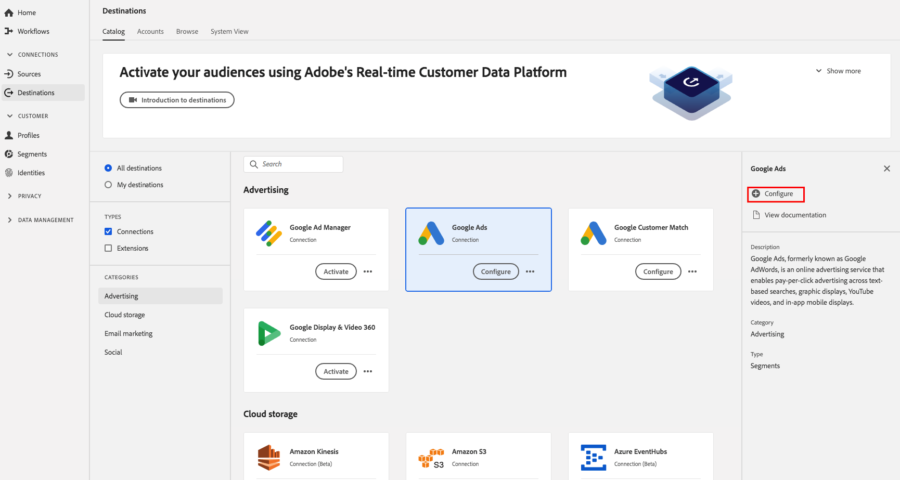

# [!DNL Google Ads] connection

## Présentation {#overview}

[!DNL Google Ads], appelé auparavant , est un service de publicité en ligne qui permet aux entreprises faire de la publicité avec paiement par clic sur des recherches textuelles, des affichages graphiques, des vidéos et des affichages mobiles in-app.[!DNL Google AdWords][!DNL YouTube]

## Spécificités de la destination {#specifics}

Notez les détails suivants qui sont spécifiques aux destinations [!DNL Google Ads] :

* Les audiences activées sont créées par programmation dans la plateforme [!DNL Google].
* [!DNL Platform] n’inclut pas actuellement de mesure pour valider l’activation réussie. Consultez le nombre d’audiences dans Google pour valider l’intégration et comprendre la taille de ciblage des audiences.

>[!IMPORTANT]
>
>Si vous souhaitez créer votre première destination avec [!DNL Google Ads] et que vous n’avez pas activé la [fonctionnalité de synchronisation des identifiants](https://experienceleague.adobe.com/docs/id-service/using/id-service-api/methods/idsync.html) dans le service d’ID Experience Cloud par le passé (avec Audience Manager ou d’autres applications), veuillez contacter Adobe Consulting ou l’assistance clientèle pour activer la synchronisation des identifiants. Si vous avez précédemment configuré les intégrations Google dans Audience Manager, les synchronisations d’ID que vous avez configurées sont transférées à Platform.

## Identités prises en charge {#supported-identities}

[!DNL Google Ad Manager] prend en charge l’activation des identités décrites dans le tableau ci-dessous.

| Identité cible | Description | Considérations |
|---|---|---|
| GAID | [!DNL Google Advertising ID] | Sélectionnez cette identité cible lorsque votre identité source est un espace de noms GAID. |
| IDFA | [!DNL Apple ID for Advertisers] | Sélectionnez cette identité cible lorsque votre identité source est un espace de noms IDFA. |
| UUID AAM | [Adobe Audience Manager [!DNL Unique User ID]](https://experienceleague.adobe.com/docs/audience-manager/user-guide/reference/ids-in-aam.html), également appelé  [!DNL Device ID]. Identifiant numérique à 38 chiffres associé par l’Audience Manager à chaque appareil avec lequel elle interagit. | Google utilise [AAM UUID](https://experienceleague.adobe.com/docs/audience-manager/user-guide/reference/ids-in-aam.html?lang=en) pour cibler les utilisateurs en Californie et l’ID de cookie Google pour tous les autres utilisateurs. |
| [!DNL Google] ID de cookie | [!DNL Google] ID de cookie | [!DNL Google] utilise cet identifiant pour cibler les utilisateurs situés en dehors de la Californie. |
| RIDA | Identifiant Roku pour la publicité. Cet identifiant identifie de manière unique les appareils Roku. |  |
| MAID | Identifiant Microsoft Advertising. Cet identifiant identifie de manière unique les périphériques exécutant Windows 10. |  |
| Identifiant Amazon Fire TV | Cet identifiant identifie de manière unique les téléviseurs Amazon Fire. |  |

## Type d’exportation {#export-type}

**Exportation de segments**  : vous exportez tous les membres d’un segment (audience) vers la destination Google.

## Conditions préalables

### Compte [!DNL Google Ads] existant

>[!IMPORTANT]
>
> [!DNL Google] a abandonné les nouvelles intégrations de  [!DNL Google Ads] cookies avec des fournisseurs tiers. Pour exécuter les étapes de liste autorisée de la section suivante, vous devez disposer d’une intégration existante avec [!DNL Google Ads]. Par conséquent, l’approche recommandée pour l’utilisation de [!DNL Google Ads] consiste à configurer une intégration [!DNL Google Customer Match]. Pour plus d’informations sur la création d’une intégration [!DNL Google Customer Match], consultez le tutoriel sur la création d’une connexion [[!DNL Google Customer Match]](./google-customer-match.md).

### Liste autorisée

>[!NOTE]
>
>La liste autorisée est obligatoire avant de configurer votre première destination [!DNL Google Ads] dans Platform. Assurez-vous que le processus de liste autorisée décrit ci-dessous a été terminé par [!DNL Google] avant de créer une destination.

Avant de créer la destination [!DNL Google Ads] dans Platform, vous devez contacter [!DNL Google] pour que l’Adobe soit placé sur la liste des fournisseurs de données autorisés et que votre compte soit ajouté à la liste autorisée. Contactez [!DNL Google] et fournissez les informations suivantes :

* **ID** du compte : Identifiant de compte de l’Adobe avec Google. ID de compte : 87933855.
* **ID de client** : Identifiant du compte client de l’Adobe avec Google. ID de client : 89690775.
* Votre type de compte : **AdWords**
* **Identifiant** Google AdWords : Il s’agit de votre identifiant avec  [!DNL Google]. Le format d’identifiant est généralement 123-456-7890.

## Configuration de la destination

Dans **[!UICONTROL Connexions]** > **[!UICONTROL Destinations]**, sélectionnez [!DNL Google Ads], puis **[!UICONTROL Configurer]**.

>[!NOTE]
>
>Si une connexion avec cette destination existe déjà, vous pouvez voir un bouton **[!UICONTROL Activer]** sur la carte de destination. Pour plus d’informations sur la différence entre **[!UICONTROL Activer]** et **[!UICONTROL Configurer]**, consultez la section [Catalogue](../../ui/destinations-workspace.md#catalog) de la documentation de l’espace de travail de destination.

À l’étape **Configuration** du processus de création de destination, renseignez les [!UICONTROL Informations de base] de la destination.

* **[!UICONTROL Nom]** : renseignez le nom de votre choix pour cette destination.
* **[!UICONTROL Description]** : facultatif. Vous pouvez, par exemple, mentionner la campagne pour laquelle vous utilisez cette destination.
* **[!UICONTROL Type de compte]** : AdWords est la seule option disponible.
* **[!UICONTROL Identifiant de compte]** : renseignez votre identifiant de compte avec [!DNL Google Ads]. Le format d’identifiant est généralement 123-456-7890.
* **[!UICONTROL Action]** marketing : Les actions marketing indiquent l’intention pour laquelle les données seront exportées vers la destination. Vous pouvez effectuer un choix parmi des actions marketing définies par l’Adobe ou créer votre propre action marketing. Pour plus d’informations sur les actions marketing, consultez la [Présentation des stratégies d’utilisation des données](../../../data-governance/policies/overview.md).

## Activation des segments vers [!DNL Google Ads]

Pour plus d’informations sur l’activation des segments vers [!DNL Google Ads], voir [Activation des données vers les destinations](../../ui/activate-destinations.md).

## Données exportées

Pour vérifier si les données ont bien été exportées vers la destination [!DNL Google Ads], vérifiez votre compte [!DNL Google Ads]. Si l’activation a réussi, les audiences sont renseignées dans votre compte.
