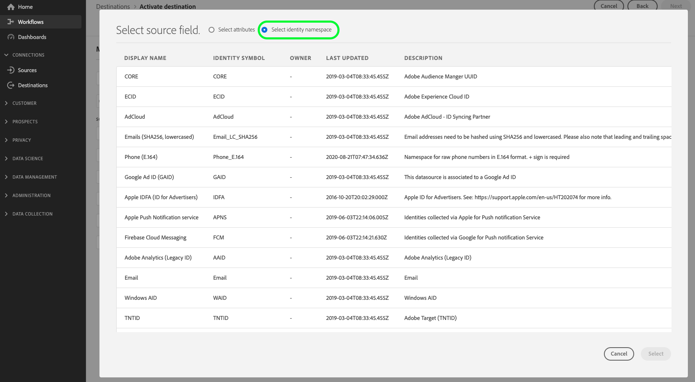

# Connexion [!DNL Google Customer Match + Display & Video 360]

Utilisez cette destination pour activer vos listes de [[!DNL Google Customer Match]](https://support.google.com/google-ads/answer/6379332?hl=en) propriétaires basées sur les informations d’identification personnelles directement dans [!DNL Google Display & Video 360] propriétés telles que [!DNL Search], [!DNL YouTube], [!DNL Gmail] et le [!DNL Google Display Network].

Certains tiers intégrés à Google, tels qu’Adobe Real-Time CDP, peuvent utiliser l’[!DNL Google Audience Partner API] pour créer des audiences [!DNL Customer Match] directement dans le compte [!DNL Display & Video 360] des clients.

Grâce à la nouvelle fonctionnalité permettant d’utiliser des audiences [!DNL Customer Matched] dans l’ensemble des [!DNL Display & Video 360], vous pouvez désormais cibler des audiences dans une liste étendue de sources d’inventaire.

>[!IMPORTANT]
>
>Ce connecteur de destination est en version bêta et disponible uniquement pour certaines personnes. Pour obtenir l’accès, contactez votre représentant ou représentante Adobe.

## Avis important sur les modifications apportées aux destinations Google en rapport avec les exigences de consentement mises à jour dans l’Union européenne

>[!IMPORTANT]
>
> Google publie des modifications de l’API [Google Ads](https://developers.google.com/google-ads/api/docs/start), de l’API [Customer Match](https://ads-developers.googleblog.com/2023/10/updates-to-customer-match-conversion.html) et de l’API [Display &amp; Video 360](https://developers.google.com/display-video/api/guides/getting-started/overview) afin de prendre en charge les exigences de conformité et de consentement définies dans le [Digital Markets Act](https://digital-markets-act.ec.europa.eu/index_en) (DMA) de l’Union européenne ([EU User Consent Policy](https://www.google.com/about/company/user-consent-policy/)). L’application de ces modifications aux exigences en matière de consentement est effective à compter du 6 mars 2024.
> 
>Pour se conformer à la politique de consentement des utilisateurs de l’UE et continuer à créer des listes d’audience pour les utilisateurs dans l’Espace économique européen (EEE), les annonceurs et les partenaires doivent s’assurer de transmettre le consentement de l’utilisateur final lors du téléchargement des données d’audience. En tant que partenaire Google, Adobe vous fournit les outils nécessaires pour vous conformer à ces exigences de consentement en vertu de la DMA dans l’Union européenne.
> 
>Les clients qui ont acheté Adobe Privacy &amp; Security Shield et configuré une [politique de consentement](../../../data-governance/enforcement/auto-enforcement.md#consent-policy-evaluation) pour filtrer les profils non consentis n’ont aucune action à effectuer.
> 
>Les clients qui n’ont pas acheté Adobe Privacy &amp; Security Shield doivent utiliser les fonctionnalités [définition de segment](../../../segmentation/home.md#segment-definitions) du [créateur de segments](../../../segmentation/ui/segment-builder.md) pour filtrer les profils non consentis afin de continuer à utiliser les destinations Real-Time CDP Google existantes sans interruption.

## Quand utiliser cette destination

Plusieurs intégrations à Google sont disponibles dans le catalogue des destinations et il peut être difficile de savoir quand utiliser chacune des destinations Google disponibles. Comprenez les différents cas d’utilisation en lisant les informations du tableau ci-dessous :

| [Correspondance client Google](/help/destinations/catalog/advertising/google-customer-match.md) | [Google Display &amp; Video 360](/help/destinations/catalog/advertising/google-dv360.md) | [!DNL Google Customer Match] + [!DNL Display & Video 360] (ce connecteur) |
|---------|----------|---------|
| Exportez vos audiences basées sur les informations d’identification personnelle et atteignez-les dans l’inventaire disponible dans [!DNL Google Customer Match]. | Atteignez les audiences basées sur les cookies à travers l’inventaire disponible via [!DNL Google Display & Video 360], sur les propriétés détenues et exploitées par Google telles que Youtube et [!DNL Search], et au-delà. | Créez des audiences basées sur les informations d’identification personnelle dans [!DNL Google Customer Match] et atteignez-les à partir de l’inventaire disponible dans [!DNL Google Display & Video 360], sur les propriétés détenues et exploitées par Google uniquement. |

## Cas d’utilisation {#use-cases}

Pour mieux comprendre quand et comment utiliser cette destination, consultez les exemples de cas d’utilisation ci-dessous que la clientèle de Adobe Experience Platform peut résoudre.

### Cas d’utilisation #1

Une marque de vêtements de sport souhaite atteindre les clients existants par le biais de [!DNL Google Search] et de [!DNL Google Shopping] afin de personnaliser les offres et les articles en fonction de leurs achats précédents et de leur historique de navigation. La marque de vêtements peut ingérer des adresses e-mail de son propre CRM vers Experience Platform et créer des audiences à partir de ses propres données hors ligne. Ensuite, ils peuvent envoyer ces audiences à la destination [!DNL Google Customer Match + Display & Video 360] pour qu’elles soient utilisées dans [!DNL Google Display & Video 360] propriétés telles que [!DNL Search], [!DNL YouTube], [!DNL Gmail] et [!DNL Google Display Network].

### Cas d’utilisation #2

Une entreprise de technologie de premier plan a lancé un nouveau téléphone. Pour promouvoir ce nouveau modèle de téléphone, ils cherchent à faire connaître les nouvelles fonctionnalités du téléphone aux clients qui possèdent des modèles précédents de leurs téléphones.

Pour promouvoir la version, ils chargent les adresses e-mail de leur base de données CRM dans Experience Platform, en utilisant les adresses e-mail comme identifiants. Les audiences sont créées en fonction des clients qui possèdent d’anciens modèles de téléphone. Les audiences sont ensuite envoyées à [!DNL Google Customer Match], afin que l’entreprise puisse cibler les clients actuels, les clients qui possèdent des modèles de téléphone plus anciens et des clients similaires sur [!DNL Google Display & Video 360] propriétés telles que [!DNL Search], [!DNL YouTube], [!DNL Gmail] et le [!DNL Google Display Network].

## Identités prises en charge {#supported-identities}

[!DNL Google Customer Match] prend en charge l’activation des identités décrites dans le tableau ci-dessous. En savoir plus sur les [identités](/help/identity-service/features/namespaces.md).

| Identité cible | Description | Considérations |
|---|---|---|
| GAID | GOOGLE ADVERTISING ID | Sélectionnez l’identité cible GAID lorsque votre identité source est un espace de noms GAID. |
| IDFA | Identifiant Apple pour les annonceurs | Sélectionnez l’identité cible IDFA lorsque votre identité source est un espace de noms IDFA. |
| phone_sha256_e.164 | Numéros de téléphone au format E164, hachés avec l’algorithme SHA256 | Adobe Experience Platform prend en charge le texte brut et les numéros de téléphone hachés avec SHA256. Suivez les instructions de la section [Exigences de correspondance des identifiants](#id-matching-requirements-id-matching-requirements) et utilisez les espaces de noms appropriés pour le texte brut et les numéros de téléphone hachés, respectivement. Lorsque votre champ source contient des attributs non hachés, cochez l’option **[!UICONTROL Appliquer la transformation]** pour que [!DNL Experience Platform] hache automatiquement les données lors de l’activation. |
| email_lc_sha256 | Adresses e-mail hachées avec l’algorithme SHA256 | Adobe Experience Platform prend en charge le texte brut et les adresses e-mail hachées avec SHA256. Suivez les instructions de la section [Exigences de correspondance des identifiants](#id-matching-requirements-id-matching-requirements) et utilisez les espaces de noms appropriés pour les adresses électroniques en texte brut et hachées, respectivement. Lorsque votre champ source contient des attributs non hachés, cochez l’option **[!UICONTROL Appliquer la transformation]** pour que [!DNL Experience Platform] hache automatiquement les données lors de l’activation. |

{style="table-layout:auto"}

## Audiences prises en charge {#supported-audiences}

Cette section décrit les types d’audiences que vous pouvez exporter vers cette destination.

| Origine de l’audience | Pris en charge | Description |
|---------|----------|----------|
| [!DNL Segmentation Service] | ✓ | Audiences générées via Experience Platform [Segmentation Service](../../../segmentation/home.md). |
| Chargements personnalisés | ✓ | Audiences [importées](../../../segmentation/ui/audience-portal.md#import-audience) dans Experience Platform à partir de fichiers CSV. |

{style="table-layout:auto"}

## Type et fréquence d’exportation {#export-type-frequency}

Reportez-vous au tableau ci-dessous pour plus d’informations sur le type et la fréquence d’exportation des destinations.

| Élément | Type | Notes |
---------|----------|---------|
| Type d’exportation | **[!UICONTROL Export d’audience]** | Vous exportez tous les membres d’une audience avec les identifiants (nom, numéro de téléphone et autres) utilisés dans la destination [!DNL Google Customer Match]. |
| Fréquence des exportations | **[!UICONTROL Diffusion en continu]** | Les destinations de diffusion en continu sont des connexions basées sur l’API « toujours actives ». Dès qu’un profil est mis à jour dans Experience Platform en fonction de l’évaluation des audiences, le connecteur envoie la mise à jour en aval vers la plateforme de destination. En savoir plus sur les [destinations de diffusion en continu](/help/destinations/destination-types.md#streaming-destinations). |

{style="table-layout:auto"}

## Conditions préalables relatives au compte [!DNL Google Customer Match] {#google-account-prerequisites}

Avant de configurer une destination [!DNL Google Customer Match] dans Experience Platform, assurez-vous de lire et de respecter la politique de Google relative à l’utilisation de [!DNL Customer Match], décrite dans la [documentation d’assistance Google](https://support.google.com/google-ads/answer/6299717).

Ensuite, assurez-vous que votre compte [!DNL Google] est configuré pour un niveau d’autorisation [!DNL Standard] ou supérieur. Pour plus d’informations[&#128279;](https://support.google.com/google-ads/answer/9978556?visit_id=637611563637058259-4176462731&amp;rd=1) consultez la documentation sur les Google Ads .

### Liste autorisée {#allowlist}

Avant de créer la destination [!DNL Google Customer Match] dans Experience Platform, assurez-vous que votre compte [!DNL Google Ads] est conforme à la [[!DNL Google Customer Match]  politique ](https://support.google.com/google-ads/answer/6299717/customer-match-policy).

Les clients disposant de comptes conformes sont automatiquement placés sur la liste autorisée par Google.

## Exigences de correspondance des identifiants {#id-matching-requirements}

[!DNL Google] nécessite qu’aucune information d’identification personnelle (PII) ne soit envoyée en clair. Par conséquent, les audiences activées pour [!DNL Google Customer Match] doivent être désactivées des identifiants *hachés* tels que les adresses e-mail ou les numéros de téléphone hachés.

Selon le type d’identifiants ingérés dans Adobe Experience Platform, vous devez respecter les exigences correspondantes.

### Exigences de hachage des numéros de téléphone {#phone-number-hashing-requirements}

Il existe deux méthodes pour activer les numéros de téléphone dans [!DNL Google Customer Match] :

* **Ingestion de numéros de téléphone bruts** : vous pouvez ingérer des numéros de téléphone bruts au format [!DNL E.164] dans [!DNL Experience Platform], et ils sont automatiquement hachés lors de l’activation. Si vous choisissez cette option, veillez à toujours ingérer vos numéros de téléphone bruts dans l’espace de noms `Phone_E.164`.
* **Ingestion de numéros de téléphone hachés** : vous pouvez préhacher vos numéros de téléphone avant l’ingestion dans [!DNL Experience Platform]. Si vous choisissez cette option, veillez à toujours ingérer vos numéros de téléphone hachés dans l’espace de noms `PHONE_SHA256_E.164`.

>[!NOTE]
>
>Les numéros de téléphone ingérés dans l’espace de noms `Phone` ne peuvent pas être activés vers la destination [!DNL Google Customer Match + DV360].

### Exigences en matière de hachage des e-mails {#hashing-requirements}

Vous pouvez hacher les adresses e-mail avant de les ingérer dans Adobe Experience Platform ou les utiliser en clair dans Experience Platform et demander à [!DNL Experience Platform] de les hacher lors de l’activation.

Pour plus d’informations sur les exigences de hachage de Google et d’autres restrictions sur l’activation, consultez les sections suivantes de la documentation de Google :

* [[!DNL Customer Match] avec adresse e-mail, adresse ou ID utilisateur](https://developers.google.com/google-ads/api/docs/remarketing/audience-types/customer-match#customer_match_with_email_address_address_or_user_id)
* [[!DNL Customer Match] considérations](https://developers.google.com/google-ads/api/docs/remarketing/audience-types/customer-match#customer_match_considerations)
* [[!DNL Customer Match] avec numéro de téléphone](https://developers.google.com/google-ads/api/docs/remarketing/audience-types/customer-match#customer_match_with_phone_number)
* [[!DNL Customer Match] avec ID d’appareil mobile](https://developers.google.com/google-ads/api/docs/remarketing/audience-types/customer-match#customer_match_with_mobile_device_ids)

Pour en savoir plus sur l’ingestion d’adresses e-mail dans Experience Platform, consultez la [présentation de l’ingestion par lots](../../../ingestion/batch-ingestion/overview.md) et la [présentation de l’ingestion par flux](../../../ingestion/streaming-ingestion/overview.md).

Si vous choisissez de hacher les adresses e-mail vous-même, veillez à respecter les exigences de Google, décrites dans les liens ci-dessus.

<!-- ### Using custom namespaces {#custom-namespaces}

Before you can use the `User_ID` namespace to send data to Google, make sure you synchronize your own identifiers using [!DNL gTag]. Refer to the [Google official documentation](https://support.google.com/google-ads/answer/9199250) for detailed information. -->

<!-- Data from unhashed namespaces is automatically hashed by [!DNL Experience Platform] upon activation.

Attribute source data is not automatically hashed. When your source field contains unhashed attributes, check the **[!UICONTROL Apply transformation]** option, to have [!DNL Experience Platform] automatically hash the data on activation.
 -->

<!-- ## Configure destination - video walkthrough {#video}

The video below demonstrates the steps to configure a [!DNL Google Customer Match] destination and activate audiences. The steps are also laid out sequentially in the next sections.

>[!VIDEO](https://video.tv.adobe.com/v/332599/?quality=12&learn=on&captions=eng) -->

## Se connecter à la destination {#connect}

>[!IMPORTANT]
> 
>Pour vous connecter à la destination, vous avez besoin des autorisations de contrôle d’accès **[!UICONTROL Afficher les destinations]** et **[!UICONTROL Gérer les destinations]** [&#128279;](/help/access-control/home.md#permissions). Lisez la [présentation du contrôle d’accès](/help/access-control/ui/overview.md) ou contactez votre administrateur ou administratrice du produit pour obtenir les autorisations requises.

Pour vous connecter à cette destination, procédez comme décrit dans le [tutoriel sur la configuration des destinations](../../ui/connect-destination.md).

### Paramètres de connexion {#parameters}

Pendant la [configuration](../../ui/connect-destination.md) de cette destination, vous devez fournir les informations suivantes :

* **[!UICONTROL Nom]** : attribuez un nom à cette connexion de destination
* **[!UICONTROL Description]** : fournissez une description de cette connexion de destination
* **[!UICONTROL ID de compte]** : votre [ID de client Google Ads](https://support.google.com/google-ads/answer/1704344?hl=en). Le format de l’ID est xxx-xxx-xxxx. Si vous utilisez le [!DNL Google Ads Manager Account (My Client Center)], n’utilisez pas l’ID de compte Manager. Utilisez plutôt l’ID de client [Google Ads](https://support.google.com/google-ads/answer/1704344?hl=en).
* **[!UICONTROL Type de compte]** : votre type de compte Google. Sélectionnez une option, en fonction de votre type de compte publicitaire avec Google :
   * **[!UICONTROL Afficher le partenaire vidéo]**
   * **[!UICONTROL Afficher l’annonceur vidéo]**

### Activer les alertes {#enable-alerts}

Vous pouvez activer les alertes pour recevoir des notifications sur le statut de votre flux de données vers votre destination. Sélectionnez une alerte dans la liste et abonnez-vous à des notifications concernant le statut de votre flux de données. Pour plus d’informations sur les alertes, consultez le guide sur l’[abonnement aux alertes des destinations dans l’interface utilisateur](../../ui/alerts.md).

Lorsque vous avez terminé de renseigner les détails sur votre connexion de destination, sélectionnez **[!UICONTROL Suivant]**.

## Activer des audiences vers cette destination {#activate}

>[!IMPORTANT]
> 
>* Pour activer les données, vous avez besoin des autorisations de contrôle d’accès **[!UICONTROL Afficher les destinations]**, **[!UICONTROL Activer les destinations]**, **[!UICONTROL Afficher les profils]** et **[!UICONTROL Afficher les segments]** [&#128279;](/help/access-control/home.md#permissions). Lisez la [présentation du contrôle d’accès](/help/access-control/ui/overview.md) ou contactez votre administrateur ou administratrice du produit pour obtenir les autorisations requises.
>* Pour exporter des *identités* vers les destinations, vous devez disposer de l’autorisation de contrôle d’accès **[!UICONTROL Afficher le graphique d’identités]** [&#128279;](/help/access-control/home.md#permissions).   {width="100" zoomable="yes"}

Voir [Activer les données d’audience vers des destinations d’export d’audiences en flux continu](../../ui/activate-segment-streaming-destinations.md) pour obtenir des instructions sur l’activation des audience vers cette destination.

<!-- In the **[!UICONTROL Segment schedule]** step, you must provide the [!UICONTROL App ID] when sending [!DNL IDFA] or [!DNL GAID] audiences to [!DNL Google Customer Match].

For details on how to find the [!DNL App ID], refer to the [Google official documentation](https://developers.google.com/adwords/api/docs/reference/v201809/AdwordsUserListService.CrmBasedUserList#appid) or ask your Google representative. -->

### Exemple de mappage : activation des données d’audience dans [!DNL Google Customer Match + Display & Video 360] {#example-gcm}

Il s’agit d’un exemple de mappage d’identité correct lors de l’activation des données d’audience dans [!DNL Google Customer Match + Display & Video 360].

Sélection des champs sources :

* Sélectionnez l’espace de noms `Email` comme identité source si les adresses e-mail que vous utilisez ne sont pas hachées.
* Sélectionnez l’espace de noms `Email_LC_SHA256` comme identité source si vous avez haché les adresses e-mail des clients lors de l’ingestion des données dans [!DNL Experience Platform], conformément [!DNL Google Customer Match] [exigences de hachage des e-mails](#hashing-requirements).
* Sélectionnez l’espace de noms `PHONE_E.164` comme identité source si vos données sont composées de numéros de téléphone non hachés. [!DNL Experience Platform] hachera les numéros de téléphone pour se conformer aux exigences [!DNL Google Customer Match].
* Sélectionnez l’espace de noms `Phone_SHA256_E.164` comme identité source si vous hachez des numéros de téléphone lors de l’ingestion de données dans [!DNL Experience Platform], conformément [!DNL Facebook] [exigences de hachage des numéros de téléphone](#phone-number-hashing-requirements).

Sélection des champs cibles :

* Sélectionnez l’espace de noms `Email_LC_SHA256` comme identité cible lorsque vos espaces de noms sources sont `Email` ou `Email_LC_SHA256`.
* Sélectionnez l’espace de noms `Phone_SHA256_E.164` comme identité cible lorsque vos espaces de noms sources sont `PHONE_E.164` ou `Phone_SHA256_E.164`.

Les données des espaces de noms non hachés sont automatiquement hachées par [!DNL Experience Platform] lors de l’activation.

Les données source des attributs ne sont pas automatiquement hachées. Lorsque votre champ source contient des attributs non hachés, cochez l’option **[!UICONTROL Appliquer la transformation]** pour que [!DNL Experience Platform] hache automatiquement les données lors de l’activation.

## Surveiller la destination {#monitor-destination}

Après vous être connecté à la destination et avoir établi un flux de données de destination, vous pouvez utiliser la [fonctionnalité de surveillance](/help/dataflows/ui/monitor-destinations.md) de Real-Time CDP pour obtenir des informations détaillées sur les enregistrements de profil activés vers la destination dans chaque exécution du flux de données.

Les informations de surveillance de la connexion [!DNL Google Customer Match + Display & Video 360] comprennent des informations au niveau de l’audience relatives aux identités activées, exclues et en échec dans chaque exécution de flux de données et de flux de données. [En savoir plus](/help/dataflows/ui/monitor-destinations.md#segment-level-view) à propos de la fonctionnalité.

## Vérifiez que l’activation de l’audience a réussi. {#verify-activation}

Une fois le flux d’activation terminé, basculez vers votre compte **[!UICONTROL Google Ads]**. Les audiences activées s’affichent dans votre compte Google sous forme de listes de clients. Selon la taille de votre audience, certaines audiences ne sont pas renseignées, sauf s’il y a plus de 1 000 utilisateurs actifs à servir. Pour plus d’informations, consultez la documentation sur les partenaires Audience de Google [&#128279;](https://developers.google.com/audience-partner/api/docs/customer-match/get-started#verify-list). Notez que vous devez demander à Google l’accès à la documentation dans le lien.

## Gouvernance des données

Certaines destinations dans Experience Platform ont certaines règles et obligations pour les données envoyées à, ou reçues de la plateforme de destination. La compréhension des limites et des obligations engendrées par vos données, ainsi que l’usage que vous faites de ces données dans Adobe Experience Platform et sur la plateforme de destination relèvent de votre responsabilité. Adobe Experience Platform fournit des outils de gouvernance des données pour vous aider à gérer certaines de ces obligations d’utilisation des données. [En savoir plus](../../../data-governance/labels/overview.md) sur les outils et les politiques de gouvernance des données.

## Dépannage {#troubleshooting}

### Message d’erreur 400 Requête incorrecte {#bad-request}

Lors de la configuration de cette destination, vous risquez de recevoir l’erreur suivante :

`{"message":"Google Customer Match Error: OperationAccessDenied.ACTION_NOT_PERMITTED","code":"400 BAD_REQUEST"}`

Cette erreur se produit lorsque les comptes client ne respectent pas les [ conditions préalables ](#google-account-prerequisites). Pour résoudre ce problème, contactez Google et assurez-vous que votre compte est sur liste autorisée et configuré pour un niveau d’autorisation [!DNL Standard] ou supérieur. Pour plus d’informations[&#128279;](https://support.google.com/google-ads/answer/9978556?visit_id=637611563637058259-4176462731&amp;rd=1) consultez la documentation sur les Google Ads .
