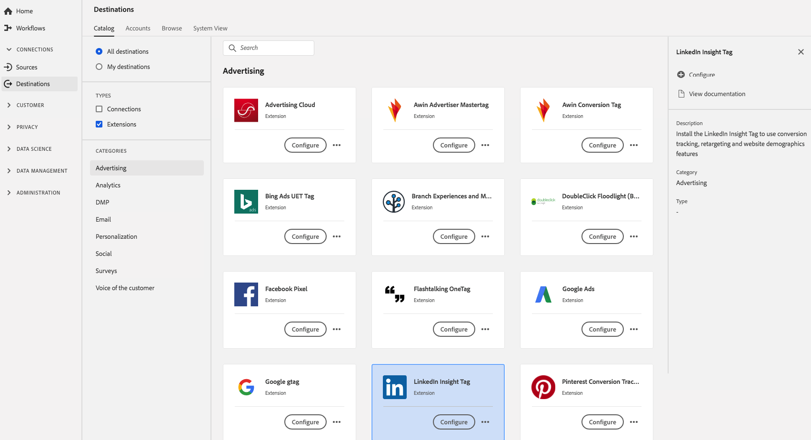

# [!DNL LinkedIn Insight Tag] Extension {#linkedin-insights-extension}

## Présentation {#overview}

Installez [!DNL LinkedIn Insight Tag] pour utiliser les fonctionnalités de suivi de conversion, de reciblage et de données démographiques du site web.

[!DNL LinkedIn Insight Tag] est une extension publicitaire dans Adobe Experience Platform. Pour plus d’informations sur la fonctionnalité de l’extension, voir [LinkedIn Insight Tag](https://business.linkedin.com/fr-fr/marketing-solutions/insight-tag).

Cette destination est une extension de balise. Pour plus d’informations sur le fonctionnement des extensions de balise dans Platform, consultez la [présentation des extensions de balise](../launch-extensions/overview.md).

## Conditions préalables  {#prerequisites}

Cette extension est disponible dans le catalogue [!DNL Destinations] pour tous les clients qui ont acheté Platform.

Pour utiliser cette extension, vous devez accéder aux balises dans Adobe Experience Platform. Les balises sont proposées aux clients Adobe Experience Cloud en tant que fonctionnalité à valeur ajoutée incluse. Contactez l’administrateur de votre organisation pour accéder aux balises et demandez-lui de vous accorder l’autorisation **[!UICONTROL manage_properties]** afin que vous puissiez installer les extensions. et leur demander de vous accorder l’autorisation **[!UICONTROL manage_properties]** afin que vous puissiez installer des extensions.

## Installation de l’extension {#install-extension}

Pour installer l’extension [!DNL LinkedIn Insight Tag] :

Dans l’ [interface de Platform](https://platform.adobe.com/), accédez à **[!UICONTROL Destinations]** > **[!UICONTROL Catalogue]**.

Sélectionnez l’extension dans le catalogue ou utilisez la barre de recherche.

Cliquez sur la destination pour la mettre en surbrillance, puis sélectionnez **[!UICONTROL Configurer]** dans le rail de droite. Si le contrôle **[!UICONTROL Configure]** est grisé, vous ne disposez pas de l’autorisation **[!UICONTROL manage_properties]**. Voir les [Conditions préalables](#prerequisites).

Sélectionnez la propriété dans laquelle vous souhaitez installer l’extension. Vous avez également la possibilité de créer une propriété. Une propriété est un ensemble de règles, d’éléments de données, d’extensions configurées, d’environnements et de bibliothèques. Découvrez les propriétés dans la [section de la page Propriétés](../../../tags/ui/administration/companies-and-properties.md#properties-page) de la documentation sur les balises.

Le workflow vous guide tout au long des étapes nécessaires pour terminer l’installation.

Pour plus d’informations sur les options de configuration de l’extension et la prise en charge de l’installation, voir [LinkedIn Insight Tag](https://business.linkedin.com/marketing-solutions/insight-tag).

Vous pouvez également installer l’extension directement dans l’ [interface utilisateur de collecte de données](https://experience.adobe.com/#/data-collection/). Pour plus d’informations, reportez-vous à la section sur l’[ajout d’une nouvelle extension](../../../tags/ui/managing-resources/extensions/overview.md#add-a-new-extension) dans la documentation sur les balises.

## Utilisation de l’extension {#how-to-use}

Une fois que vous avez installé l’extension, vous pouvez commencer à configurer des règles.

Vous pouvez configurer des règles pour vos extensions installées afin d’envoyer des données d’événement vers la destination de l’extension uniquement dans certains cas. Pour plus d’informations sur la configuration de règles pour vos extensions, consultez la [documentation sur les balises](../../../tags/ui/managing-resources/rules.md).

## Configuration, mise à niveau et suppression de l’extension {#configure-upgrade-delete}

Vous pouvez configurer, mettre à niveau et supprimer des extensions dans l’interface utilisateur de la collecte de données.

>[!TIP]
>
>Si l’extension est déjà installée sur l’une de vos propriétés, l’interface utilisateur de Platform affiche toujours **[!UICONTROL Install]** pour l’extension. Lancez le workflow d’installation comme décrit dans la section [Installer l’extension](#install-extension) pour configurer ou supprimer votre extension.

Pour mettre à niveau votre extension, consultez le guide sur le [processus de mise à niveau de l’extension](../../../tags/ui/managing-resources/extensions/extension-upgrade.md) dans la documentation sur les balises.
