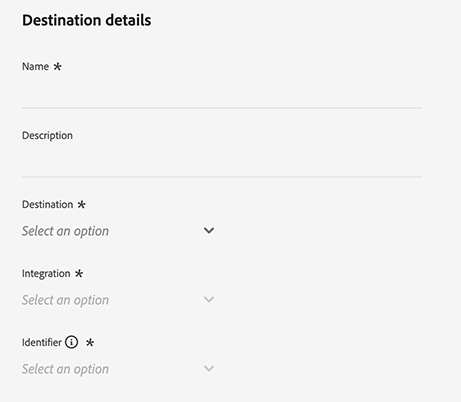
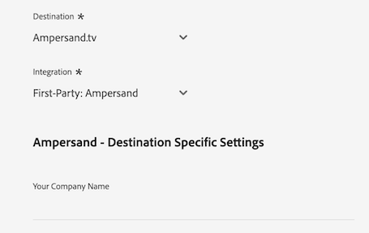
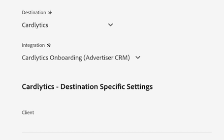
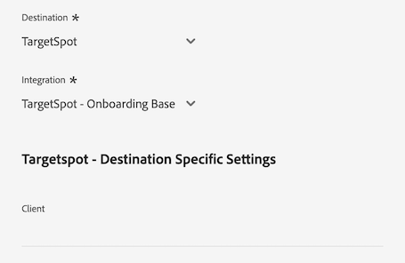

# Connexion [!DNL LiveRamp - Distribution]

La connexion [!DNL LiveRamp - Distribution] vous permet d’activer des audiences d’Experience Platform vers des éditeurs premium sur des supports mobiles, web, d’affichage et de télévision connectée.

>[!IMPORTANT]
>
>Ce connecteur de destination et cette page de documentation sont créés et gérés par LiveRamp. Pour toute demande ou information, contactez LiveRamp directement [ici](mailto:adobertcdp@liveramp.com).

## Destinations prises en charge {#supported-destinations}

[!DNL LiveRamp - Distribution] prend actuellement en charge l’activation des audiences sur les plateformes suivantes :

* [[!DNL 4C Insights]](#insights)
* [[!DNL Acast]](#acast)
* [[!DNL Nexxen]](#nexxen)
* [[!DNL Ampersand.tv]](#ampersand-tv)
* [[!DNL Captify]](#captify)
* [[!DNL Cardlytics]](#cardlytics)
* [[!DNL Disney (Hulu/ESPN/ABC)]](#disney)
* [[!DNL iHeartMedia]](#iheartmedia)
* [[!DNL Index Exchange]](#index-exchange)
* [[!DNL Magnite CTV Platform]](#magnite)
* [[!DNL Magnite DV+ (Rubicon Project)]](#magnite-dv)
* [[!DNL One Fox]](#fox)
* [[!DNL Pandora]](#pandora)
* [[!DNL Reddit]](#reddit)
* [[!DNL Roku]](#roku)
* [[!DNL Spotify]](#spotify)
* [[!DNL Taboola]](#taboola)
* [[!DNL TargetSpot]](#targetspot)
* [[!DNL Teads]](#teads)
* [[!DNL WB Discovery]](#wb-discovery)

## Cas d’utilisation {#use-cases}

Pour mieux comprendre quand et comment utiliser la destination [!DNL LiveRamp - Distribution], consultez l’exemple de cas d’utilisation ci-dessous que les clientes et clients d’Adobe Experience Platform peuvent résoudre à l’aide de cette destination.

L’équipe marketing d’un retailer de vêtements de sport a utilisé la connexion [LiveRamp - Intégration](liveramp-onboarding.md) pour envoyer des audiences d’Experience Platform à leur compte LiveRamp.

Grâce à la connexion [!DNL LiveRamp - Distribution], ils peuvent désormais déclencher l’activation des audiences intégrées vers les [&#x200B; destinations prises en charge &#x200B;](#supported-destinations). Ensuite, ils peuvent cibler les utilisateurs sur les plateformes mobiles, web, sociales et [!DNL CTV] ouvertes.

## Intégration d’audiences à LiveRamp {#onboarding}

Avant d’activer des audiences via la connexion [!DNL LiveRamp - Distribution], utilisez la connexion [LiveRamp - Intégration](liveramp-onboarding.md) pour exporter vos audiences Experience Platform vers LiveRamp.

Une fois que vous avez intégré vos audiences à LiveRamp, poursuivez le processus d’activation à partir de l’étape [se connecter à la destination](#connect) pour sélectionner et configurer vos plateformes de destination cibles pour l’activation des données.

## Se connecter à la destination {#connect}

>[!CONTEXTUALHELP]
>id="platform_destinations_liveramp_distribution_identifier_settings"
>title="Paramètres d’identifiant"
>abstract="Sélectionnez les identifiants pris en charge par votre destination. Consultez la documentation pour obtenir la liste complète des identifiants pris en charge pour chaque destination."

>[!IMPORTANT]
> 
>Pour vous connecter à la destination, vous avez besoin des autorisations de contrôle d’accès **[!UICONTROL Afficher les destinations]** et **[!UICONTROL Gérer les destinations]** [&#128279;](/help/access-control/home.md#permissions). Lisez la [présentation du contrôle d’accès](/help/access-control/ui/overview.md) ou contactez votre administrateur de produit pour obtenir les autorisations requises.

Pour vous connecter à cette destination, procédez comme décrit dans le [tutoriel sur la configuration des destinations](../../ui/connect-destination.md). Dans le workflow de configuration des destinations, renseignez les champs répertoriés dans les deux sections ci-dessous.

### Authentification à LiveRamp {#authenticate}

Pour vous authentifier à la destination, renseignez les champs requis et sélectionnez **[!UICONTROL Se connecter à la destination]**.

* **[!UICONTROL ID d’organisation LiveRamp]** : ID d’organisation de votre compte LiveRamp (répertorié comme _owner_org_ dans vos informations d’identification LiveRamp).
* **[!UICONTROL Mot de passe]** : mot de passe de votre compte LiveRamp (répertorié comme _secret_key_ dans vos informations d’identification LiveRamp).
* **[!UICONTROL URL du jeton]** : votre URL de jeton LiveRamp.
* **[!UICONTROL Nom d’utilisateur]** : nom d’utilisateur de votre compte LiveRamp (répertorié sous _account_id_ dans vos informations d’identification LiveRamp).

### Configurer les détails de la destination {#destination-details}

Une fois la connexion à votre compte LiveRamp établie, saisissez les informations requises pour vous connecter à la destination vers laquelle vous souhaitez activer les audiences.

* **[!UICONTROL Nom]** : renseignez le nom de votre choix pour votre connexion de destination.

>[!NOTE]
>
>Lorsque vous attribuez un nom à une destination, Adobe recommande de suivre le format suivant : `LiveRamp - Downstream Destination Name`. Ce modèle de dénomination vous permet d’identifier rapidement vos destinations dans l’onglet [&#x200B; Parcourir &#x200B;](../../ui/destinations-workspace.md#browse) de l’espace de travail des destinations.
>&#x200B;> 
>&#x200B;>Exemple : `LiveRamp - Roku`.

* **[!UICONTROL Description]** : saisissez une description pour votre destination. Utilisez une description qui vous aide à identifier facilement l’objectif de cette destination.
* **[!UICONTROL Destination]** : utilisez le menu déroulant pour sélectionner la destination vers laquelle vous souhaitez activer les audiences. La destination que vous sélectionnez ici affecte directement ce que vous voyez à l’écran [paramètres spécifiques à la destination](#destination-settings).
* **[!UICONTROL Intégration]** : sélectionnez le compte d’intégration que vous souhaitez utiliser pour la destination.
* **[!UICONTROL Identifiant]** : sélectionnez les identifiants pris en charge par la destination. Actuellement, tous les identifiants pris en charge pour toutes les destinations sont préremplis dans le menu déroulant.

## Paramètres spécifiques à la destination {#destination-settings}

Chacune des destinations [prises en charge](#supported-destinations) par [!DNL LiveRamp - Distribution] nécessite que vous renseignez des options de configuration spécifiques.

Consultez les sections ci-dessous pour obtenir des conseils détaillés sur la configuration de chaque destination.

### [!DNL 4C Insights] {#insights}

>[!CONTEXTUALHELP]
>id="platform_destinations_liveramp_distribution_4cinsights_profile_id"
>title="Identifiant de profil de marque 4C"
>abstract="Saisissez l’identifiant numérique associé à votre profil de marque 4C. Si vous ne disposez pas de cet identifiant, contactez votre représentant ou représentante des services à la clientèle 4C."

Pour configurer les détails de la destination, renseignez les champs ci-dessous.

* **[!UICONTROL Identifiant de profil de marque 4C]** : saisissez l’identifiant numérique associé à votre profil de marque 4C. Si vous ne disposez pas de cet identifiant, contactez votre représentant ou représentante des services à la clientèle 4C.

### [!DNL Acast] {#acast}

>[!CONTEXTUALHELP]
>id="platform_destinations_liveramp_distribution_acast_client"
>title="Nom du client ou de la cliente"
>abstract="Nom de votre compte publicitaire, tel que vous souhaitez le présenter au partenaire ou à la partenaire de destination. Utilisez le nom de votre société. N’utilisez ni espaces ni caractères spéciaux."

Pour configurer les détails de la destination, renseignez les champs ci-dessous.

* **[!UICONTROL Nom du client]** : nom de votre compte publicitaire, tel que vous souhaitez qu’il soit affiché au partenaire de destination. Utilisez le nom de votre société. N’utilisez ni espaces ni caractères spéciaux.

### [!DNL Ampersand.tv] {#ampersand-tv}

>[!CONTEXTUALHELP]
>id="platform_destinations_liveramp_distribution_ampersand_company_name"
>title="Nom de votre société"
>abstract="Nom de votre société, tel que vous souhaitez le présenter au partenaire de destination. N’utilisez ni espaces ni caractères spéciaux."

Pour configurer les détails de la destination, renseignez les champs ci-dessous.

* **[!UICONTROL Nom de votre société]** : nom de votre société tel que vous souhaitez qu’il soit affiché au partenaire de destination. N’utilisez ni espaces ni caractères spéciaux.

### [!DNL Captify] {#captify}

>[!CONTEXTUALHELP]
>id="platform_destinations_liveramp_distribution_captify_client"
>title="Nom du client ou de la cliente"
>abstract="Nom de votre compte publicitaire, tel que vous souhaitez le présenter au partenaire ou à la partenaire de destination. Utilisez le nom de votre société. N’utilisez ni espaces ni caractères spéciaux."

Pour configurer les détails de la destination, renseignez les champs ci-dessous.

* **[!UICONTROL Nom du client]** : nom de votre compte publicitaire, tel que vous souhaitez qu’il soit affiché au partenaire de destination. Utilisez le nom de votre société. N’utilisez ni espaces ni caractères spéciaux.

### [!DNL Cardlytics] {#cardlytics}

>[!CONTEXTUALHELP]
>id="platform_destinations_liveramp_distribution_cardlytics_client"
>title="Nom du client ou de la cliente"
>abstract="Nom de votre compte publicitaire, tel que vous souhaitez le présenter au partenaire ou à la partenaire de destination. Utilisez le nom de votre société. N’utilisez ni espaces ni caractères spéciaux."

Pour configurer les détails de la destination, renseignez les champs ci-dessous.

* **[!UICONTROL Nom du client]** : nom de votre compte publicitaire, tel que vous souhaitez qu’il soit affiché au partenaire de destination. Utilisez le nom de votre société. N’utilisez ni espaces ni caractères spéciaux.

### [!DNL Disney (Hulu/ESPN/ABC)] {#disney}

>[!CONTEXTUALHELP]
>id="platform_destinations_liveramp_distribution_agreement"
>title="Accord sur les conditions de destination des données des annonceurs"
>abstract="Cochez `I AGREE` pour confirmer la reconnaissance et l’acceptation des conditions d’utilisation des données de l’annonceur Disney."

<!-- >additional-url="<https://www.disneyadvertising.com/ADVERTISER-DATA-DESTINATION-TERMS/>" text="Read the agreement" -->

>[!CONTEXTUALHELP]
>id="platform_destinations_liveramp_distribution_disney_client"
>title="Nom du client ou de la cliente"
>abstract="Nom de votre compte publicitaire, tel que vous souhaitez le présenter au partenaire ou à la partenaire de destination. Utilisez le nom de votre société. N’utilisez ni espaces ni caractères spéciaux."

>[!CONTEXTUALHELP]
>id="platform_destinations_liveramp_distribution_disney_email"
>title="Votre adresse e-mail"
>abstract="Saisissez une adresse e-mail liée à une personne. Cette adresse e-mail sert de signature pour l’accord des conditions de données des annonceurs. Cette adresse e-mail est également utilisée pour vous contacter si nécessaire."

Pour configurer les détails de la destination, renseignez les champs ci-dessous.

* **[!UICONTROL Contrat de destination des données de l’annonceur]** : saisissez le `I AGREE` pour confirmer l’accusé de réception et l’accord avec les conditions des données de l’annonceur Disney.
* **[!UICONTROL Nom du client]** : saisissez le nom de votre société tel que vous souhaitez qu’il soit affiché au partenaire de destination.
* **[!UICONTROL Adresse e-mail]** : saisissez une adresse e-mail associée à une personne. Cette adresse e-mail sert de signature au contrat des conditions générales relatives aux données de l’annonceur.

### [!DNL iHeartMedia] {#iheartmedia}

>[!CONTEXTUALHELP]
>id="platform_destinations_liveramp_distribution_iheartmedia_client"
>title="Nom du client ou de la cliente"
>abstract="Nom de votre compte publicitaire, tel que vous souhaitez le présenter au partenaire ou à la partenaire de destination. Utilisez le nom de votre société. N’utilisez ni espaces ni caractères spéciaux."

Pour configurer les détails de la destination, renseignez les champs ci-dessous.

* **[!UICONTROL Nom du client]** : nom de votre compte publicitaire, tel que vous souhaitez qu’il soit affiché au partenaire de destination. Utilisez le nom de votre société. N’utilisez ni espaces ni caractères spéciaux.

### [!DNL Index Exchange] {#index-exchange}

>[!CONTEXTUALHELP]
>id="platform_destinations_liveramp_distribution_index_advertiseraccountname"
>title="Nom de compte"
>abstract="Nom de votre compte clientèle Index Exchange. N’utilisez ni espaces ni caractères spéciaux."

Pour configurer les détails de la destination, renseignez les champs ci-dessous.

* **[!UICONTROL Nom du compte]** : nom de votre compte client Exchange d’index. N’utilisez ni espaces ni caractères spéciaux.

### [!DNL Magnite CTV Platform] {#magnite}

>[!CONTEXTUALHELP]
>id="platform_destinations_liveramp_distribution_magnitectv_client"
>title="client"
>abstract="Nom de votre client ou cliente, tel que vous souhaitez le présenter au partenaire de destination. Utilisez le nom de votre société. N’utilisez ni espaces ni caractères spéciaux."

Pour configurer les détails de la destination, renseignez les champs ci-dessous.

* **[!UICONTROL Client]** : votre nom de client, tel que vous souhaitez qu’il soit affiché au partenaire de destination. Utilisez le nom de votre société. N’utilisez ni espaces ni caractères spéciaux.

### [!DNL Magnite DV+ (Rubicon Project)] {#magnite-dv}

>[!CONTEXTUALHELP]
>id="platform_destinations_liveramp_distribution_magnitedv+_partnerid"
>title="Identifiant du partenaire"
>abstract="Identifiant du partenaire de projet Rubicon associé à l’éditeur propriétaire du segment/des données. Contactez le représentant ou la représentante de votre compte de projet Rubicon si vous ne savez pas la valeur que vous devez utiliser."

>[!CONTEXTUALHELP]
>id="platform_destinations_liveramp_distribution_magnitedv+_seatid"
>title="Identifiant du siège"
>abstract="Identifiant du siège Magnite DV+ fourni par votre personne gestionnaire de compte Magnite"

Pour configurer les détails de la destination, renseignez les champs ci-dessous.

* **[!UICONTROL ID de partenaire]** : ID de partenaire du projet Rubicon associé à l’éditeur propriétaire du segment/des données. Contactez le représentant ou la représentante de votre compte de projet Rubicon si vous ne savez pas la valeur que vous devez utiliser.
* **[!UICONTROL Seat ID]** : Seat ID Magnite DV+ fourni par votre gestionnaire de compte Magnite

### [!DNL Nexxen (formerly known as [!DNL Amobee])] {#nexxen}

>[!CONTEXTUALHELP]
>id="platform_destinations_liveramp_distribution_nexxen_ratetype"
>title="Type de tarif"
>abstract="Le type de tarif représente la manière dont l’utilisation des données doit être facturée. Tous les tarifs de 0,00 $ doivent être fixes. Contactez votre représentant ou représentante Nexxen si vous ne savez pas quel type de tarif utiliser."

>[!CONTEXTUALHELP]
>id="platform_destinations_liveramp_distribution_nexxen_marketid"
>title="Identifiant du marché"
>abstract="Saisissez l’identifiant du marché numérique où le contrat de données Nexxen doit être créé. Si vous effectuez une syndication « AlwaysOn » sur tous les marchés de la plateforme Nexxen, saisissez -1."

>[!CONTEXTUALHELP]
>id="platform_destinations_liveramp_distribution_nexxen_advertiserid"
>title="Identifiant annonceur"
>abstract="Si vous envoyez des données à un seul annonceur sur la plateforme Nexxen, saisissez l’identifiant d’annonceur Amobee numérique. Si vous souhaitez que les données soient disponibles pour tous les annonceurs sur un marché ou si ces segments sont « AlwaysOn », saisissez -1."

>[!CONTEXTUALHELP]
>id="platform_destinations_liveramp_distribution_nexxen_contactemail"
>title="E-mail de contact"
>abstract="Saisissez l&#39;adresse e-mail que Nexxen doit utiliser pour envoyer les détails du contrat de données. Il s’agit probablement de votre propre adresse e-mail, mais il peut également s’agir d’un alias de messagerie. Pour plusieurs personnes destinataires, effectuez la séparation à l’aide de virgules (`email1@domain.com`, `email2@domain.com`, etc.)."

Pour configurer les détails de la destination, renseignez les champs ci-dessous.

* **[!UICONTROL Type de taux]** : le type de taux représente la manière dont l’utilisation des données doit être facturée. Tous les tarifs de 0,00 $ doivent être fixes. Contactez votre représentant ou représentante Nexxen si vous ne savez pas quel type de tarif utiliser.
* **[!UICONTROL Market ID]** : renseignez l&#39;ID de marché numérique où le contrat de données Nexxen doit être créé. Si vous effectuez une syndication « AlwaysOn » sur tous les marchés de la plateforme Nexxen, saisissez -1.
* **[!UICONTROL ID publicitaire]** : si vous envoyez des données à un seul annonceur sur la plateforme Nexxen, saisissez l’ID publicitaire Nexxen numérique. Si vous souhaitez que les données soient disponibles pour tous les annonceurs d’un marché ou si ces segments sont « AlwaysOn », saisissez -1.
* **[!UICONTROL E-mail du contact]** : saisissez l’adresse e-mail que Nexxen doit utiliser pour envoyer les détails du contrat de données. Il s’agit probablement de votre propre adresse e-mail, mais il peut également s’agir d’un alias de messagerie. Pour plusieurs destinataires, séparez-les par des virgules ( `email1@domain.com`, `email2@domain.com`).

### [!DNL One Fox] {#fox}

>[!CONTEXTUALHELP]
>id="platform_destinations_liveramp_distribution_fox_client"
>title="client"
>abstract="Nom de votre société/compte de distribution tel que vous souhaitez le voir apparaître pour le partenaire. Contactez le représentant ou la représentante de votre compte partenaire si vous ne savez pas quel nom utiliser. N’utilisez ni espaces ni caractères spéciaux."

Pour configurer les détails de la destination, renseignez les champs ci-dessous.

* **[!UICONTROL Client]** : nom de votre compte de société/distribution tel que vous souhaitez qu’il apparaisse pour le partenaire. Utilisez le nom de votre société par défaut. Contactez le représentant ou la représentante de votre compte partenaire si vous ne savez pas quel nom utiliser. N’utilisez ni espaces ni caractères spéciaux.

### [!DNL Pandora] {#pandora}

>[!CONTEXTUALHELP]
>id="platform_destinations_liveramp_distribution_pandora_account_name"
>title="Nom du compte"
>abstract="Nom de votre compte Pandora. Contactez le représentant ou la représentante de votre compte Pandora si vous ne savez pas quel est le nom de votre compte. N’utilisez ni espaces ni caractères spéciaux."

Pour configurer les détails de la destination, renseignez les champs ci-dessous.

* **[!UICONTROL Nom du compte]** : le nom de votre compte Pandora. Contactez le représentant ou la représentante de votre compte Pandora si vous ne savez pas quel est le nom de votre compte. N’utilisez ni espaces ni caractères spéciaux.

### [!DNL Reddit] {#reddit}

>[!CONTEXTUALHELP]
>id="platform_destinations_liveramp_distribution_reddit_advertiser_id"
>title="Identifiant d’annonceur Reddit"
>abstract="Votre identifiant d’annonceur Reddit. Doit commencer par « t2_ » ou « a2_ ». Contactez le représentant ou la représentante de votre compte Reddit si vous ne connaissez pas votre identifiant d’annonceur."

>[!CONTEXTUALHELP]
>id="platform_destinations_liveramp_distribution_reddit_advertiser_name"
>title="Nom d&#39;annonceur Reddit"
>abstract="Votre nom d’annonceur Reddit. N’utilisez ni espaces ni caractères spéciaux."

Pour configurer les détails de la destination, renseignez les champs ci-dessous.

* **[!UICONTROL ID de l’annonceur Reddit]** : votre ID d’annonceur Reddit. Doit commencer par « t2_ » ou « a2_ ». Contactez le représentant ou la représentante de votre compte Reddit si vous ne connaissez pas votre identifiant d’annonceur.
* **[!UICONTROL Nom de l’annonceur Reddit]** : votre nom d’annonceur Reddit. N’utilisez ni espaces ni caractères spéciaux.

### [!DNL Roku] {#roku}

>[!CONTEXTUALHELP]
>id="platform_destinations_liveramp_distribution_roku_email"
>title="Adresse e-mail du compte Roku"
>abstract="Saisissez l’adresse e-mail liée à votre compte Roku."

>[!CONTEXTUALHELP]
>id="platform_destinations_liveramp_distribution_roku_representative_email"
>title="Adresse e-mail du représentant ou de la représentante du compte Roku"
>abstract="Saisissez l’adresse e-mail du représentant ou de la représentante de votre compte Roku. Cette adresse est utilisée pour envoyer des mises à jour de taxonomie. Pour saisir plusieurs adresses, séparez-les par des virgules."

Pour configurer les détails de la destination, renseignez les champs ci-dessous.

* **[!UICONTROL Adresse e-mail du compte Roku]** : saisissez l’adresse e-mail associée à votre compte Roku.
* **[!UICONTROL Adresse e-mail du représentant de compte Roku]** : saisissez l’adresse e-mail du représentant de compte Roku. Pour saisir plusieurs adresses, séparez-les par des virgules.

### [!DNL Spotify] {#spotify}

>[!CONTEXTUALHELP]
>id="platform_destinations_liveramp_distribution_spotify_client"
>title="Nom du client ou de la cliente"
>abstract="Nom de votre compte publicitaire, tel que vous souhaitez le présenter au partenaire ou à la partenaire de destination. Utilisez le nom de votre société. N’utilisez ni espaces ni caractères spéciaux."

Pour configurer les détails de la destination, renseignez les champs ci-dessous.

* **[!UICONTROL Nom du client]** : nom de votre compte publicitaire, tel que vous souhaitez qu’il soit affiché au partenaire de destination. Utilisez le nom de votre société. N’utilisez ni espaces ni caractères spéciaux.

### [!DNL Taboola] {#taboola}

>[!CONTEXTUALHELP]
>id="platform_destinations_liveramp_distribution_taboola_rep_email"
>title="Adresse e-mail du ou de la gestionnaire de compte"
>abstract="Adresse e-mail du ou de la gestionnaire de votre compte Taboola."

>[!CONTEXTUALHELP]
>id="platform_destinations_liveramp_distribution_taboola_seg_type"
>title="Type de segment"
>abstract="Type de segment. Seuls les segments propriétaires sont actuellement pris en charge."

Pour configurer les détails de la destination, renseignez les champs ci-dessous.

* **[!UICONTROL Adresse e-mail du gestionnaire de compte]** : adresse e-mail de votre gestionnaire de compte Taboola.
* **[!UICONTROL Type de segment]** : le type de segment. Seuls les segments propriétaires sont actuellement pris en charge.

### [!DNL TargetSpot] {#targetspot}

>[!CONTEXTUALHELP]
>id="platform_destinations_liveramp_distribution_targetspot_client"
>title="Nom du client ou de la cliente"
>abstract="Nom de votre compte publicitaire, tel que vous souhaitez le présenter au partenaire ou à la partenaire de destination. Utilisez le nom de votre société. N’utilisez ni espaces ni caractères spéciaux."

Pour configurer les détails de la destination, renseignez les champs ci-dessous.

* **[!UICONTROL Nom du client]** : nom de votre compte publicitaire, tel que vous souhaitez qu’il soit affiché au partenaire de destination. Utilisez le nom de votre société. N’utilisez ni espaces ni caractères spéciaux.

### [!DNL Teads] {#teads}

>[!CONTEXTUALHELP]
>id="platform_destinations_liveramp_distribution_teads_teadsid"
>title="ID de Teads"
>abstract="Identifiant de Teads"

Pour configurer les détails de la destination, renseignez les champs ci-dessous.

* **[!UICONTROL Identifiant des en-têtes]** : votre identifiant des en-têtes

### [!DNL WB Discovery] {#wb-discovery}

>[!CONTEXTUALHELP]
>id="platform_destinations_liveramp_distribution_wb_client"
>title="Nom du client ou de la cliente"
>abstract="Nom de votre compte publicitaire, tel que vous souhaitez le présenter au partenaire ou à la partenaire de destination. Utilisez le nom de votre société. N’utilisez ni espaces ni caractères spéciaux."

Pour configurer les détails de la destination, renseignez les champs ci-dessous.

* **[!UICONTROL Nom du client]** : nom de votre compte publicitaire, tel que vous souhaitez qu’il soit affiché au partenaire de destination. Utilisez le nom de votre société. N’utilisez ni espaces ni caractères spéciaux.

### Activer les alertes {#enable-alerts}

Vous pouvez activer les alertes pour recevoir des notifications sur le statut de votre flux de données vers votre destination. Pour recevoir des notifications sur le statut de votre flux de données, sélectionnez une alerte dans la liste. Pour plus d’informations sur les alertes, consultez le guide sur l’[abonnement aux alertes des destinations dans l’interface utilisateur](../../ui/alerts.md).

Lorsque vous avez terminé de renseigner les détails sur votre connexion de destination, sélectionnez **[!UICONTROL Suivant]**.

## Activer des audiences vers cette destination {#activate}

>[!IMPORTANT]
> 
>Pour activer les données, vous avez besoin des autorisations de contrôle d’accès **[!UICONTROL Afficher les destinations]**, **[!UICONTROL Activer les destinations]**, **[!UICONTROL Afficher les profils]** et **[!UICONTROL Afficher les segments]** [&#128279;](/help/access-control/home.md#permissions). Lisez la [présentation du contrôle d’accès](/help/access-control/ui/overview.md) ou contactez votre administrateur ou administratrice du produit pour obtenir les autorisations requises.

La connexion [!DNL LiveRamp - Distribution] active les audiences qui ont déjà été intégrées à votre compte LiveRamp via la connexion [LiveRamp - Intégration](liveramp-onboarding.md).

Pour activer correctement vos audiences, vous devez sélectionner les **mêmes audiences** que vous avez [précédemment intégrées](liveramp-onboarding.md) dans LiveRamp.

>[!IMPORTANT]
>
>La sélection d’audiences qui n’ont pas encore été intégrées via la connexion [LiveRamp - Intégration](liveramp-onboarding.md) ne déclenche pas l’intégration des nouvelles audiences.

## Données exportées / Valider l’exportation des données {#exported-data}

Pour vérifier et surveiller l’activation de vos audiences, connectez-vous à votre compte LiveRamp et vérifiez les mesures d’activation.

Si vous avez des questions sur l’activation de l’audience, contactez votre représentant de compte LiveRamp.

## Utilisation et gouvernance des données {#data-usage-governance}

Lors de la gestion de vos données, toutes les destinations [!DNL Adobe Experience Platform] se conforment aux politiques d’utilisation des données. Pour obtenir des informations détaillées sur la manière dont [!DNL Adobe Experience Platform] applique la gouvernance des données, consultez la [Présentation de la gouvernance des données](/help/data-governance/home.md).

## Ressources supplémentaires {#additional-resources}

Pour plus d’informations sur la configuration de votre destination [!DNL LiveRamp - Onboarding], consultez la documentation d’intégration [LiveRamp](liveramp-onboarding.md).
