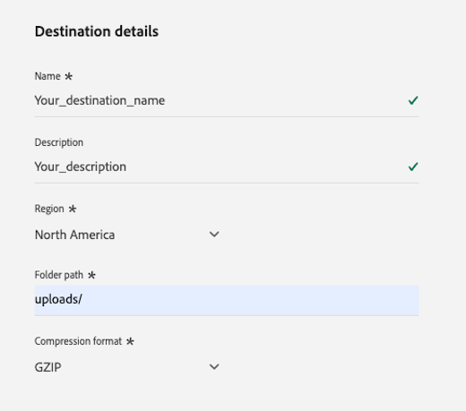

# Connexion [!DNL LiveRamp - Onboarding] {#liveramp-onboarding}

Utilisez la connexion [!DNL LiveRamp - Onboarding] pour intégrer des audiences à partir d’Adobe Real-time Customer Data Platform vers [!DNL LiveRamp Connect].

## Cas d’utilisation {#use-cases}

Pour mieux comprendre quand et comment utiliser la destination [!DNL LiveRamp - Onboarding], consultez l’exemple de cas d’utilisation ci-dessous que les clientes et clients d’Adobe Experience Platform peuvent résoudre à l’aide de cette destination.

En tant que personne spécialiste marketing, je souhaite envoyer des audiences d’Adobe Experience Platform vers des identités intégrées dans [!DNL LiveRamp Connect] afin que je puisse cibler les utilisateurs et utilisatrices sur les plateformes mobiles, web ouvertes, de réseaux sociaux et [!DNL CTV], à l’aide de l’identifiant [!DNL Ramp ID].

## Conditions préalables {#prerequisites}

La connexion [!DNL LiveRamp - Onboarding] exporte les fichiers à l’aide du stockage [SFTP de LiveRamp](https://docs.liveramp.com/connect/en/upload-a-file-via-liveramp-s-sftp.html).

Avant d’envoyer des données d’Experience Platform vers [!DNL LiveRamp - Onboarding], vous avez besoin de vos informations d’identification [!DNL LiveRamp]. Veuillez contacter votre représentant ou représentante [!DNL LiveRamp] pour obtenir vos informations d’identification, si vous ne les avez pas déjà.

## Identités prises en charge {#supported-identities}

[!DNL LiveRamp - Onboarding] prend en charge l’activation d’identités telles que les identifiants basés sur des informations d’identification personnelles, les identifiants connus et les identifiants personnalisés, décrits dans la [documentation de LiveRamp](https://docs.liveramp.com/connect/en/identity-and-identifier-terms-and-concepts.html#known-identifiers).

À l’[étape de mappage](#map) du workflow d’activation, vous devez définir les mappages cibles en tant qu’attributs personnalisés.

## Audiences prises en charge {#supported-audiences}

Cette section décrit les types d’audiences que vous pouvez exporter vers cette destination.

| Origine de l’audience | Pris en charge | Description |
|---------|----------|----------|
| [!DNL Segmentation Service] | ✓ | Audiences générées via Experience Platform [Segmentation Service](../../../segmentation/home.md). |
| Chargements personnalisés | ✓ | Audiences [importées](../../../segmentation/ui/audience-portal.md#import-audience) dans Experience Platform à partir de fichiers CSV. |

{style="table-layout:auto"}

## Type et fréquence d’exportation {#export-type-frequency}

Reportez-vous au tableau ci-dessous pour plus d’informations sur le type et la fréquence d’exportation des destinations.

| Élément | Type | Notes |
|---------|----------|---------|
| Type d’exportation | **[!UICONTROL Audience export]** | Vous exportez tous les profils membres d’une audience ainsi que les identifiants (nom, numéro de téléphone ou autres) utilisés dans la destination [!DNL LiveRamp - Onboarding]. |
| Fréquence des exportations | **[!UICONTROL Batch]** | Comme les profils sont mis à jour dans Experience Platform en fonction de l’évaluation de l’audience, les profils (identités) sont mis à jour et peuvent être diffusés en aval de la plateforme de destination à une cadence quotidienne, hebdomadaire ou mensuelle. En savoir plus sur les [destinations basées sur des fichiers par lots](/help/destinations/destination-types.md#file-based). |

{style="table-layout:auto"}

## Se connecter à la destination {#connect}

>[!IMPORTANT]
> 
>Pour vous connecter à la destination, vous avez besoin des **[!UICONTROL View Destinations]** et **[!UICONTROL Manage Destinations]** [autorisations de contrôle d’accès](/help/access-control/home.md#permissions). Lisez la [présentation du contrôle d’accès](/help/access-control/ui/overview.md) ou contactez votre administrateur de produit pour obtenir les autorisations requises.

Pour vous connecter à cette destination, procédez comme décrit dans le [tutoriel sur la configuration des destinations](../../ui/connect-destination.md). Dans le workflow de configuration des destinations, renseignez les champs répertoriés dans les deux sections ci-dessous.

### S’authentifier auprès de la destination {#authenticate}

Pour vous authentifier auprès de la destination, renseignez les champs requis et sélectionnez **[!UICONTROL Connect to destination]**.

**Authentification SFTP avec mot de passe** {#sftp-password}


* **[!UICONTROL Port]** : port utilisé pour l’emplacement de stockage de votre [!DNL LiveRamp - Onboarding].  Utilisez le port correspondant à votre situation géographique, comme décrit ci-dessous :
   * **[!UICONTROL NA]** : utiliser le port `22`
   * **[!UICONTROL AU]** : utiliser le port `2222`
* **[!UICONTROL Username]** : nom d’utilisateur de l’emplacement de stockage de votre [!DNL LiveRamp - Onboarding].
* **[!UICONTROL Password]** : mot de passe de votre emplacement de stockage [!DNL LiveRamp - Onboarding].
* **[!UICONTROL PGP/GPG encryption key]** : vous pouvez éventuellement joindre votre clé publique au format RSA pour ajouter un chiffrement à vos fichiers exportés. Vous pouvez voir un exemple de clé correctement formatée dans l’image ci-dessous.
  
* **[!UICONTROL Subkey ID]**:Ifvous fournissez une clé de chiffrement, vous devez également fournir un **[!UICONTROL Subkey ID]**de chiffrement. Consultez la [documentation sur le chiffrement](https://docs.liveramp.com/connect/en/encrypting-files-for-uploading.html#downloading-the-current-encryption-key) de [!DNL LiveRamp] pour savoir comment obtenir l’ID de sous-clé.

**SFTP avec authentification par clé SSH** {#sftp-ssh}


* **[!UICONTROL Port]** : port utilisé pour l’emplacement de stockage de votre [!DNL LiveRamp - Onboarding].  Utilisez le port correspondant à votre situation géographique, comme décrit ci-dessous :
   * **[!UICONTROL EU]** : utiliser le port `4222`
* **[!UICONTROL Username]** : nom d’utilisateur de l’emplacement de stockage de votre [!DNL LiveRamp - Onboarding].
* **[!UICONTROL SSH Key]** : clé [!DNL SSH] privée utilisée pour se connecter à l’emplacement de stockage de votre [!DNL LiveRamp - Onboarding]. La clé privée doit être formatée sous la forme d’une chaîne codée en [!DNL Base64] et ne doit pas être protégée par un mot de passe.

   * Pour connecter votre clé [!DNL SSH] au serveur [!DNL LiveRamp - Onboarding], vous devez soumettre un ticket via le portail d’assistance technique de [!DNL LiveRamp] et fournir votre clé publique. Pour plus d’informations, voir la [documentation LiveRamp](https://docs.liveramp.com/connect/en/upload-a-file-via-liveramp-s-sftp.html#upload-with-an-sftp-client).

* **[!UICONTROL PGP/GPG encryption key]** : vous pouvez éventuellement joindre votre clé publique au format RSA pour ajouter un chiffrement à vos fichiers exportés. Vous pouvez voir un exemple de clé correctement formatée dans l’image ci-dessous.
  
* **[!UICONTROL Subkey ID]**:Ifvous fournissez une clé de chiffrement, vous devez également fournir un **[!UICONTROL Subkey ID]**de chiffrement. Consultez la [documentation sur le chiffrement](https://docs.liveramp.com/connect/en/encrypting-files-for-uploading.html#downloading-the-current-encryption-key) de [!DNL LiveRamp] pour savoir comment obtenir l’ID de sous-clé.

### Renseigner les détails de la destination {#destination-details}

>[!CONTEXTUALHELP]
>id="platform_destinations_liveramp_subkey"
>title="ID de sous-clé de chiffrement"
>abstract="ID de sous-clé utilisé pour le chiffrement, basé sur la clé de chiffrement publique LiveRamp. Ce champ est obligatoire si vous avez fourni une clé de chiffrement à l’étape d’authentification."
>additional-url="https://docs.liveramp.com/connect/en/encrypting-files-for-uploading.html#downloading-the-current-encryption-key" text="Découvrez comment obtenir l’ID de sous-clé"

Pour configurer les détails de la destination, renseignez les champs obligatoires et facultatifs ci-dessous. Un astérisque situé en regard d’un champ de l’interface utilisateur indique que le champ est obligatoire.



* **[!UICONTROL Name]** : nom par lequel vous reconnaîtrez cette destination à l’avenir.
* **[!UICONTROL Description]** : une description qui vous aidera à identifier cette destination à l’avenir.
* **[!UICONTROL Region]** : zone géographique de votre instance de stockage SFTP LiveRamp.
* **[!UICONTROL Folder path]** : chemin d’accès au sous-dossier [!DNL LiveRamp] `uploads` qui hébergera les fichiers exportés. Le préfixe `uploads` est automatiquement ajouté au chemin du dossier. [!DNL LiveRamp] recommande de créer un sous-dossier dédié pour les diffusions d’Adobe Real-Time CDP afin de séparer les fichiers des autres flux existants et de garantir le bon fonctionnement de l’automatisation.
   * Par exemple, si vous souhaitez exporter vos fichiers vers `uploads/my_export_folder`, saisissez `my_export_folder` dans le champ **[!UICONTROL Folder path]** .
* **[!UICONTROL Compression format]** : sélectionnez le type de compression qu’Experience Platform doit utiliser pour les fichiers exportés. Les options disponibles sont **[!UICONTROL GZIP]** ou **[!UICONTROL None]**.

### Activer les alertes {#enable-alerts}

Vous pouvez activer les alertes pour recevoir des notifications sur le statut de votre flux de données vers votre destination. Sélectionnez une alerte dans la liste et abonnez-vous à des notifications concernant le statut de votre flux de données. Pour plus d’informations sur les alertes, consultez le guide sur l’[abonnement aux alertes des destinations dans l’interface utilisateur](../../ui/alerts.md).

Lorsque vous avez terminé de renseigner les détails sur votre connexion de destination, sélectionnez **[!UICONTROL Next]**.

## Activer des audiences vers cette destination {#activate}

>[!IMPORTANT]
> 
>Pour activer les données, vous avez besoin des autorisations de contrôle d’accès **[!UICONTROL View Destinations]**, **[!UICONTROL Activate Destinations]**, **[!UICONTROL View Profiles]** et **[!UICONTROL View Segments]** [Access control](/help/access-control/home.md#permissions). Lisez la [présentation du contrôle d’accès](/help/access-control/ui/overview.md) ou contactez votre administrateur ou administratrice du produit pour obtenir les autorisations requises.

Consultez la section [Activer des données d’audience vers des destinations d’exportation de profils par lots](/help/destinations/ui/activate-batch-profile-destinations.md) pour obtenir des instructions sur l’activation des audience vers cette destination.

### Planification {#scheduling}

À l’étape [!UICONTROL Scheduling], créez un planning d’exportation pour chaque audience, avec les paramètres présentés ci-dessous.

* **[!UICONTROL File export options]** : [!UICONTROL Export full files]. Les [exportations de fichiers incrémentiels](../../ui/activate-batch-profile-destinations.md#export-incremental-files) ne sont actuellement pas prises en charge pour la destination [!DNL LiveRamp].
* **[!UICONTROL Frequency]** : [!UICONTROL Daily], [!UICONTROL Weekly] ou [!UICONTROL Monthly]
* **[!UICONTROL Date]** : sélectionnez les heures de début et de fin de l’exportation comme vous le souhaitez.


Le nom de fichier exporté ne peut actuellement pas être configuré par l’utilisateur ou l’utilisatrice. Tous les fichiers exportés vers la destination [!DNL LiveRamp - Onboarding] sont automatiquement nommés en fonction du modèle suivant :

`%ORGANIZATION_NAME%_%DESTINATION%_%DESTINATION_INSTANCE_ID%_%DATETIME%`


Par exemple, le nom d’un fichier exporté pour une organisation nommée [!DNL Luma] pourrait ressembler à ceci :

```json
Luma_LiveRamp_52137231-4a99-442d-804c-39a09ddd005d_20230330_153857.csv
```

### Mapper les attributs et les identités {#map}

À l’étape **[!UICONTROL Mapping]**, vous pouvez sélectionner les attributs et les identités que vous souhaitez exporter pour vos profils.

>[!IMPORTANT]
>
>Cette destination prend en charge l’activation d’un espace de noms d’identité source par flux d’activation. Si vous devez exporter plusieurs espaces de noms d’identité, tels que `Email` et `Phone`, vous devez [créer un flux d’activation distinct](../../ui/activate-batch-profile-destinations.md) pour chaque identité.

À l’étape **[!UICONTROL Mapping]**, le mappage **[!UICONTROL Target field]** définit le nom de l’en-tête de colonne dans le fichier CSV exporté. Vous pouvez remplacer les en-têtes de colonne CSV du fichier exporté par n’importe quel nom convivial, en fournissant un nom personnalisé pour le **[!UICONTROL Target field]**.

>[!IMPORTANT]
>
>Si vous modifiez les champs cibles après la diffusion initiale du fichier à [!DNL LiveRamp], prévenez votre équipe de compte [!DNL LiveRamp] ou [soumettez un ticket à l’assistance LiveRamp](https://docs.liveramp.com/connect/en/considerations-when-uploading-the-first-file-to-an-audience.html#creating-a-support-case) pour vous assurer que les modifications sont reflétées dans le processus d’automatisation.

1. À l’étape **[!UICONTROL Mapping]**, sélectionnez **[!UICONTROL Add new mapping]**. Une nouvelle ligne de mappage s’affichera à l’écran.

   

2. Dans la fenêtre de **[!UICONTROL Select source field]**, choisissez la catégorie **[!UICONTROL Select attributes]** et sélectionnez l’attribut XDM à mapper, ou choisissez la catégorie **[!UICONTROL Select identity namespace]** et sélectionnez une identité à mapper à votre destination.

   

3. Dans la fenêtre **[!UICONTROL Select target field]** , saisissez le nom de l’attribut auquel vous souhaitez mapper le champ source sélectionné. Le nom d’attribut défini ici se reflète dans le fichier CSV exporté sous la forme d’un en-tête de colonne.

   

   Vous pouvez également saisir le nom de l’attribut en le saisissant directement dans le **[!UICONTROL Target field]**.

   

Une fois que vous avez ajouté tous les mappages souhaités, sélectionnez **[!UICONTROL Next]** et terminez le workflow d’activation.

## Données exportées / Valider l’exportation des données {#exported-data}

Vos données sont exportées vers l’emplacement de stockage [!DNL LiveRamp - Onboarding] que vous avez configuré, sous forme de fichiers CSV.

Les fichiers exportés ont une taille maximale de 10 millions de lignes. Experience Platform génère plusieurs fichiers par diffusion si les audiences sélectionnées dépassent 10 millions de lignes. Si vous prévoyez de dépasser la limite de fichier unique, contactez votre représentant [!DNL LiveRamp] et demandez-lui de configurer l’ingestion par lots pour vous.

Lors de l’exportation de fichiers vers la destination [!DNL LiveRamp - Onboarding], Experience Platform génère un fichier CSV pour chaque [ID de politique de fusion](../../../profile/merge-policies/overview.md).

Prenons par exemple les audiences suivantes :

* Audience A (politique de fusion 1)
* Audience B (politique de fusion 2)
* Audience C (politique de fusion 1)
* Audience D (politique de fusion 1)

Experience Platform exportera deux fichiers CSV vers [!DNL LiveRamp - Onboarding] :

* un fichier CSV contenant les audiences A, C et D ;
* un fichier CSV contenant l’audience B.

Les fichiers CSV exportés contiennent des profils avec les attributs sélectionnés et le statut d’audience correspondant, sur des colonnes distinctes, avec le nom de l’attribut, et les paires `audience_namespace:audience_ID` en tant qu’en-têtes de colonne, comme illustré dans l’exemple ci-dessous :

`ATTRIBUTE_NAME, AUDIENCE_NAMESPACE_1_AUDIENCE_ID_1, AUDIENCE_NAMESPACE_2_AUDIENCE_ID_2,..., AUDIENCE_NAMESPACE_X_AUDIENCE_ID_X`

Les profils inclus dans les fichiers exportés peuvent correspondre à l’un des statuts de qualification d’audience suivants :

* `Active` : le profil est actuellement qualifié pour l’audience.
* `Expired` : le profil n’est plus qualifié pour l’audience, mais il l’a déjà été.
* `""` (chaîne vide) : le profil n’a jamais été qualifié pour l’audience.

Par exemple, un fichier CSV exporté avec un attribut `email`, deux audiences provenant du [Segmentation Service](../../../segmentation/home.md) d’Experience Platform et une audience externe [importée](../../../segmentation/ui/audience-portal.md#import-audience) ressemble à ceci :

```csv
email,ups_aa2e3d98-974b-4f8b-9507-59f65b6442df,ups_45d4e762-6e57-4f2f-a3e0-2d1893bcdd7f,CustomerAudienceUpload_7729e537-4e42-418e-be3b-dce5e47aaa1e
abc117@testemailabc.com,active,,
abc111@testemailabc.com,,,active
abc102@testemailabc.com,,,active
abc116@testemailabc.com,active,,
abc107@testemailabc.com,active,expired,active
abc101@testemailabc.com,active,active,
```

Dans l’exemple ci-dessus, les sections `ups_aa2e3d98-974b-4f8b-9507-59f65b6442df` et `ups_45d4e762-6e57-4f2f-a3e0-2d1893bcdd7f` décrivent les audiences provenant de Segmentation Service, tandis que `CustomerAudienceUpload_7729e537-4e42-418e-be3b-dce5e47aaa1e` décrit une audience importée dans Experience Platform en tant que [chargement personnalisé](../../../segmentation/ui/audience-portal.md#import-audience).

Comme Experience Platform génère un fichier CSV pour chaque [ID de politique de fusion](../../../profile/merge-policies/overview.md), il génère également une exécution de flux de données distincte pour chaque ID de politique de fusion.

Cela signifie que les mesures **[!UICONTROL Identities activated]** et **[!UICONTROL Profiles received]** de la page [exécutions de flux de données](../../../dataflows/ui/monitor-destinations.md#dataflow-runs-for-batch-destinations) sont agrégées pour chaque groupe d’audiences qui utilisent la même politique de fusion, au lieu d’être affichées pour chaque audience.

Du fait de la génération d’exécutions de flux de données pour un groupe d’audiences qui utilisent la même politique de fusion, les noms d’audience ne s’affichent pas dans le [tableau de bord de surveillance](../../../dataflows/ui/monitor-destinations.md#dataflow-runs-for-batch-destinations).


## Télécharger des données exportées vers LiveRamp {#upload-to-liveramp}

Une fois vos données exportées vers le stockage [!DNL LiveRamp - Onboarding], vous devez télécharger les données vers la plateforme [!DNL LiveRamp].

Pour plus d’informations sur la manière de télécharger vos fichiers depuis le stockage [!DNL LiveRamp - Onboarding] vers une audience [!DNL LiveRamp], consultez la documentation suivante : [Remarques concernant le téléchargement du premier fichier vers une audience](https://docs.liveramp.com/connect/en/considerations-when-uploading-the-first-file-to-an-audience.html#considerations-when-uploading-the-first-file-to-an-audience).

## Utilisation et gouvernance des données {#data-usage-governance}

Lors de la gestion de vos données, toutes les destinations [!DNL Adobe Experience Platform] se conforment aux politiques d’utilisation des données. Pour obtenir des informations détaillées sur la manière dont [!DNL Adobe Experience Platform] applique la gouvernance des données, consultez la [Présentation de la gouvernance des données](/help/data-governance/home.md).

## Ressources supplémentaires {#additional-resources}

Pour plus d’informations sur la configuration de votre stockage [!DNL LiveRamp - Onboarding], consultez la [documentation officielle](https://docs.liveramp.com/connect/en/upload-a-file-via-liveramp-s-sftp.html).

## Journal des modifications {#changelog}

Cette section répertorie les nouvelles fonctionnalités et les mises à jour importantes de la documentation consacrée au connecteur de destination.

+++ Afficher le journal des modifications

| Mois de publication | Type de mise à jour | Description |
|---|---|---|
| Février 2025 | Nouvelles fonctionnalités et mise à jour de la documentation | <ul><li> Ajout de la prise en charge des cadences de diffusion hebdomadaires et mensuelles. |
| Mars 2024 | Nouvelles fonctionnalités et mise à jour de la documentation | <ul><li>Ajout de la prise en charge des diffusions vers l’Europe et l’Australie [!DNL LiveRamp] les instances [!DNL SFTP].</li><li>Mise à jour de la documentation afin de décrire les configurations spécifiques pour les régions nouvellement prises en charge.</li><li>Augmentation de la taille maximale du fichier à 10 millions de lignes (contre 5 millions auparavant).</li><li>Mise à jour de la documentation pour prendre en compte l’augmentation de la taille des fichiers.</li></ul> |
| Juillet 2023 | Version initiale | Publication de la destination initiale et de la documentation. |

{style="table-layout:auto"}

+++
