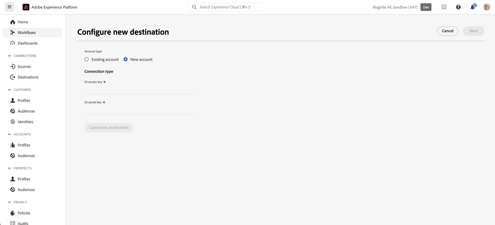

# Diffusion en continu Magnite : connexion par lots {#magnite-streaming-batch}

## Vue d’ensemble {#overview}

Ce document décrit la diffusion en continu Magnite : destination par lots et fournit des exemples de cas d’utilisation pour vous aider à mieux comprendre comment activer et exporter des audiences vers cette destination.

Les audiences Adobe Real-Time CDP peuvent être diffusées sur Magnite : la plateforme de diffusion en continu de deux manières : elles peuvent être diffusées une fois par jour ou elles peuvent être diffusées en temps réel :

1. Si vous ne souhaitez diffuser des audiences qu’une fois par jour et/ou si vous devez le faire, vous pouvez utiliser la destination Magnite : lot de diffusion en continu , qui diffuse des audiences vers Magnite : diffusion en continu via une diffusion quotidienne de fichier de diffusion par lots S3. Ces audiences par lots sont stockées indéfiniment dans notre plateforme, à la différence des audiences en temps réel, qui ne sont stockées que pendant quelques jours.

2. Cependant, si vous souhaitez et/ou devez diffuser des audiences en temps réel, vous devrez utiliser la destination Magnite : diffusion en continu en temps réel . Lors de l’utilisation de la destination en temps réel, Magnite : la diffusion en flux continu recevra les audiences en temps réel, mais nous ne pouvons stocker que les audiences en temps réel temporairement dans notre plateforme. Elles seront supprimées de notre système dans les quelques jours qui suivent. Pour cette raison, si vous souhaitez utiliser la destination Magnite : Diffusion en temps réel, vous devez ÉGALEMENT utiliser la destination Magnite : Lot en flux continu : chaque audience que vous activez vers la destination Temps réel, vous devez également l’activer vers la destination Lot.

Pour récapituler : si vous ne souhaitez diffuser des audiences Adobe Real-Time CDP qu’une fois par jour, vous utiliserez la destination Magnite : lot de diffusion en continu uniquement, et les audiences seront diffusées une fois par jour. Si vous souhaitez diffuser des audiences Adobe Real-Time CDP en temps réel, vous utiliserez À LA FOIS la destination Magnite : lot de diffusion en continu et la destination Magnite : destination en temps réel de diffusion. Pour plus d’informations, contactez Magnite : Streaming.

Pour plus d’informations sur Magnite : destination du lot de diffusion en continu, comment s’y connecter et comment activer les audiences Adobe Real-Time CDP vers celui-ci, continuez la lecture ci-dessous.
Pour plus d’informations sur la destination en temps réel, voir [ce document](magnite-streaming.md) au lieu de .

>[!IMPORTANT]
>
>Ce connecteur de destination est en version bêta et disponible uniquement pour certains clients. Pour demander l’accès, contactez votre représentant Adobe.
>
>La page de documentation et le connecteur de destination sont créés et conservés par la fonction [!DNL Magnite] l&#39;équipe. Pour toute demande d’information ou de mise à jour, contactez-les directement à l’adresse `adobe-tech@magnite.com`.

## Cas d’utilisation {#use-cases}

Pour vous aider à mieux comprendre comment et à quel moment utiliser la destination Diffusion en continu Magnite : par lot, voici des exemples de cas d’utilisation que les clients Adobe Experience Platform peuvent résoudre à l’aide de cette destination.

### Cas d’utilisation #1 {#use-case-1}

Vous avez activé une audience sur la destination de diffusion en continu Magnite : temps réel .

Toutes les audiences activées via la diffusion en flux continu Magnite : la destination en temps réel doit également utiliser la destination de diffusion en flux continu Magnite : la destination par lot, car les données de la diffusion par lot sont destinées à remplacer/conserver les données de la diffusion en temps réel dans la plateforme de diffusion en flux continu Magnite.

### Cas d’utilisation #2 {#use-case-2}

Vous souhaitez activer une audience uniquement par lots/par jour vers la plateforme de diffusion en continu Magnite.

Toute audience activée via la diffusion en continu Magnite : la destination du lot sera diffusée par lots/quotidiennement et pourra ensuite être ciblée dans la plateforme de diffusion en continu Magnite.

## Conditions préalables {#prerequisites}

Pour utiliser les destinations Magnite dans Adobe Experience Platform, vous devez d’abord disposer d’un compte de diffusion en continu Magnite. Si vous avez une [!DNL Magnite Streaming] compte, contactez votre [!DNL Magnite] gestionnaire de compte à fournir pour l’accès [!DNL Magnite's] destinations. Si vous n’avez pas de [!DNL Magnite Streaming] compte, contactez adobe-tech@magnite.com

## Identités prises en charge {#supported-identities}

Diffusion en continu Magnite : la destination de lot peut recevoir *any* sources d’identité à partir de la plateforme de données clients de l’Adobe. Actuellement, cette destination comporte trois champs d’identité cible auxquels vous pouvez mapper.

>[!NOTE]
>
>*Quelconque* les sources d’identité peuvent correspondre à n’importe quelle identité cible magnite_deviceId.

| Identité cible | Description | Considérations |
|:--------------------------- |:------------------------------------------------------------------------------------------------ |:------------------------------------------------------------------------------------- |
| magnite_deviceId_GAID | GOOGLE ADVERTISING ID | Sélectionnez cette identité cible lorsque votre identité source est un GAID |
| magnite_deviceId_IDFA | Identifiant Apple pour les annonceurs | Sélectionnez cette identité cible lorsque votre identité source est un IDFA. |
| magnite_deviceId_CUSTOM | Identifiant personnalisé/défini par l’utilisateur | Sélectionnez cette identité cible lorsque votre identité source n’est pas un IDFA ou GAID, ou s’il s’agit d’un identifiant personnalisé ou défini par l’utilisateur. |

{style="table-layout:auto"}

## Audiences prises en charge {#supported-audiences}

| Origine de l’audience | Pris en charge | Description |
|-----------------------------|----------|----------|
| [!DNL Segmentation Service] | ✓ | Audiences générées par l’Experience Platform [Segmentation Service](../../../segmentation/home.md). |
| Chargements personnalisés | ✓ | Audiences [importées](../../../segmentation/ui/audience-portal.md#import-audience) dans Experience Platform à partir de fichiers CSV. |

{style="table-layout:auto"}

## Type et fréquence d’exportation {#export-type-frequency}

| Élément | Type | Notes |
|-----------------------------|----------|----------|
| Type d’exportation | Exportation de l’audience | Vous exportez tous les membres d’une audience avec les identifiants (nom, numéro de téléphone ou autres) utilisés dans la diffusion en continu Magnite : destination du lot. |
| Fréquence des exportations | Lot | Les destinations par lots exportent des fichiers vers des plateformes en aval par incréments de trois, six, huit, douze ou vingt-quatre heures. En savoir plus sur le lot [destinations basées sur des fichiers](/help/destinations/destination-types.md). |

{style="table-layout:auto"}

## Se connecter à la destination {#connect}

Une fois que votre utilisation de destination a été approuvée et que la diffusion en continu Magnite a partagé vos informations d’identification, suivez les étapes ci-dessous pour vous authentifier, mapper et partager des données.

### S’authentifier auprès de la destination {#authenticate}

Recherchez la destination de diffusion en continu Magnite : lot dans le catalogue d’expériences d’Adobe. Cliquez sur le bouton des options supplémentaires (\..), puis configurez la connexion/l’instance de destination.

Si vous disposez déjà d’un compte, vous pouvez le localiser en définissant l’option Type de compte sur &quot;Compte existant&quot;. Sinon, vous allez créer un compte ci-dessous :

Pour créer un nouveau compte et l’authentifier pour la première fois sur la destination, renseignez les champs &quot;Clé d’accès S3&quot; et &quot;Clé secrète S3&quot; requis (fournis à votre gestionnaire de compte), puis sélectionnez **[!UICONTROL Se connecter à la destination]**

>[!NOTE]
>
>La politique de sécurité de Magnite Streaming nécessite une rotation régulière des clés S3. Vous prévoyez de mettre à jour votre compte à l’avenir avec de nouveaux accès S3 et clés secrètes S3. Il vous suffit de mettre à jour le compte lui-même. Les destinations qui utilisent ce compte utiliseront automatiquement les clés mises à jour. Si vous ne chargez pas les nouvelles clés, les données ne seront pas envoyées vers cette destination.

### Renseigner les détails de la destination {#destination-details}

Pour configurer les détails de la destination, renseignez les champs obligatoires et facultatifs ci-dessous. Un astérisque situé en regard d’un champ de l’interface utilisateur indique que le champ est obligatoire.

* **[!UICONTROL Nom]**: nom par lequel vous reconnaîtrez cette connexion/instance de destination à l’avenir.
* **[!UICONTROL Description]**: description qui vous aidera à identifier cette connexion/instance de destination à l’avenir.
* **[!UICONTROL Nom de votre partenaire source]**: nom que vous souhaitez utiliser comme source dans la plateforme de diffusion en continu Magnite.

>[!NOTE]
>
>Si vous prévoyez d’envoyer plusieurs types d’ID (GAID, IDFA, etc.) à l’aide de la destination de lot, une nouvelle connexion/instance de destination est requise pour chacune d’elles. Pour plus d’informations, contactez votre gestionnaire de compte Magnite.

Vous pouvez ensuite procéder en sélectionnant **[!UICONTROL Suivant]**

Dans l’écran suivant, intitulé &quot;Stratégie de gouvernance et actions d’application (facultatif)&quot;, vous pouvez éventuellement sélectionner toute stratégie de gouvernance des données appropriée. L’option &quot;Exportation de données&quot; est généralement sélectionnée pour la destination de lot de diffusion en continu Magnite.

Une fois sélectionné, ou si vous souhaitez ignorer cet écran facultatif, sélectionnez **[!UICONTROL Créer]**

### Activer les alertes {#enable-alerts}

Vous pouvez activer les alertes pour recevoir des notifications sur le statut de votre flux de données vers votre destination. Sélectionnez une alerte dans la liste et abonnez-vous à des notifications concernant le statut de votre flux de données. Pour plus d’informations sur les alertes, consultez le guide sur l’[abonnement aux alertes des destinations dans l’interface utilisateur](../../ui/alerts.md).

Lorsque vous avez terminé de renseigner les détails sur votre connexion de destination, sélectionnez **[!UICONTROL Suivant]**.

### Activer des segments vers cette destination {#activate}

>[!IMPORTANT]
> 
>* Pour activer les données, vous avez besoin de l’événement **[!UICONTROL Affichage des destinations]**, **[!UICONTROL Activation des destinations]**, **[!UICONTROL Afficher les profils]**, et **[!UICONTROL Affichage de segments]** [autorisations de contrôle d’accès](/help/access-control/home.md#permissions). Lisez la [présentation du contrôle d’accès](/help/access-control/ui/overview.md) ou contactez votre administrateur ou administratrice du produit pour obtenir les autorisations requises.
>* Pour exporter *identités*, vous avez besoin de la fonction **[!UICONTROL Affichage du graphique des identités]** [autorisation de contrôle d’accès](/help/access-control/home.md#permissions).   {width="100" zoomable="yes"}

Consultez [Activer des données d’audience vers des destinations d’exportation de profils par lots](/help/destinations/ui/activate-batch-profile-destinations.md) pour obtenir des instructions sur l’activation des segments d’audience vers cette destination.

### Mapper les attributs et les identités {#map}

Dans le **[!UICONTROL Champ Source]**, vous pouvez sélectionner n’importe quel attribut ou identité pour vos appareils. Dans cet exemple, nous avons sélectionné une carte d’identité personnalisée appelée &quot;DeviceId&quot;.

Dans le **[!UICONTROL Champ cible]**:
 Voir [Identités prises en charge](#supported-identities) pour plus d’informations.
Dans cet exemple, nous avons sélectionné la variable **[!UICONTROL Champ cible]**: magnite_deviceId_CUSTOM, car notre **[!UICONTROL Champ Source]** a été défini comme une carte d’identité personnalisée : DeviceID.

>[!NOTE]
>
>Si vous prévoyez d’envoyer/de mapper plusieurs types d’ID (GAID, IDFA, etc.) à l’aide de la destination de lot, une nouvelle connexion/instance de destination est requise pour chacune d’elles. Pour plus d’informations, contactez votre gestionnaire de compte Magnite.

Dans l&#39;écran &quot;Configurer un nom de fichier et un planning d&#39;export pour chaque audience&quot;, vous devez maintenant configurer une date de début (obligatoire), une date de fin (facultatif) et un identifiant de mapping (obligatoire) pour chaque audience.

>[!IMPORTANT]
>
> Un ID de mappage ou &quot;AUCUN&quot; est requis pour cette destination.
>
> Un identifiant de mappage doit être fourni lorsqu’une audience possède un identifiant de segment préexistant précédemment connu pour la diffusion en continu Magnite. Dans le cas contraire, &quot;NONE&quot; doit être utilisé comme ID de mappage.
>
> Lors de la configuration du nom de fichier pour chaque audience, vous devez inclure l&#39;identifiant du mapping via le champ &quot;Texte personnalisé&quot; à ajouter. L’ID de mappage est ajouté comme suit : `{previous_filename}\_\[MAPPING_ID\].` Si cette audience est une nouvelle audience de la diffusion en continu Magnite et que vous ne fournissez pas d’ID de mappage, &quot;AUCUN&quot; doit être entré dans le champ &quot;Texte personnalisé&quot;. Dans ce cas, le nouveau nom de fichier doit être : `{previous_filename}\_\[NONE\]`.

## Données exportées / Valider l’exportation des données {#exported-data}

Une fois vos audiences chargées, vous pouvez vérifier qu’elles ont été créées et chargées correctement.

* La destination de lot de diffusion en continu Magnite diffuse des fichiers S3 vers la diffusion en continu Magnite à une cadence quotidienne. Après la diffusion et l’ingestion, les audiences/segments doivent apparaître dans la diffusion en continu Magnite et peuvent être appliqués à une transaction. Vous pouvez le confirmer en recherchant l’identifiant du segment ou le nom du segment qui a été partagé lors des étapes d’activation dans Adobe Experience Platform.

>[!NOTE]
>
>Les audiences activées/diffusées vers la destination de lot de diffusion en continu Magnite seront *replace* les mêmes audiences qui ont été activées/diffusées via la destination en temps réel de la diffusion en continu Magnite. Si vous recherchez un segment à l’aide du nom du segment, il se peut que vous ne trouviez pas le segment en temps réel tant que le lot n’a pas été ingéré et traité par la plateforme de diffusion en continu Magnite.

## Utilisation et gouvernance des données {#data-usage-governance}

Lors de la gestion de vos données, toutes les destinations [!DNL Adobe Experience Platform] se conforment aux politiques d’utilisation des données. Pour obtenir des informations détaillées sur la manière dont [!DNL Adobe Experience Platform] applique la gouvernance des données, consultez la [Présentation de la gouvernance des données](/help/data-governance/home.md).

## Ressources supplémentaires {#additional-resources}

Pour accéder à une documentation d’aide supplémentaire, consultez la page [Centre d’aide Magnite](https://help.magnite.com/help).
