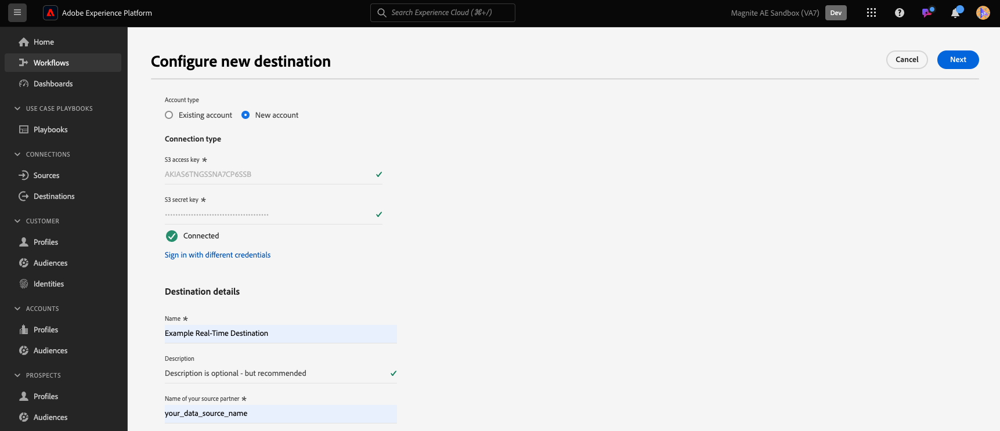
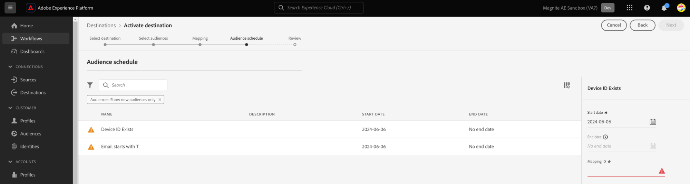

# (Beta) Diffusion en continu Magnite : connexion de destination en temps réel

## Vue d’ensemble {#overview}

La variable [!DNL Magnite Streaming: Real-Time] et la diffusion en continu Magnite : les destinations par lots dans Adobe Experience Platform vous aident à mapper et exporter des audiences pour le ciblage et l’activation sur la plateforme de diffusion en continu Magnite.

Activation des audiences vers le [!DNL Magnite Streaming] platform est un processus en deux étapes qui nécessite l’utilisation de la diffusion en continu Magnite : en temps réel et de la diffusion en continu Magnite : destinations par lot.

Pour activer vos audiences vers [!DNL Magnite Streaming], vous devez :

* Activez les audiences sur la page [!DNL Magnite Streaming: Real-Time] destination, comme indiqué dans cette page.
* Activez la même audience sur Magnite Streaming: Batch destination. La variable [!DNL Magnite Streaming: Batch] destination est un composant obligatoire. Échec de l’activation de l’audience sur le [!DNL Magnite Streaming] La destination du lot entraînera un échec de l’intégration et vos audiences ne seront pas activées.

Remarque : Lors de l’utilisation de la destination en temps réel, [!DNL Magnite: Streaming] recevra des audiences en temps réel, mais nous ne pouvons stocker que temporairement les audiences en temps réel sur notre plateforme, et elles seront supprimées de notre système dans les quelques jours. Pour cette raison, si vous souhaitez utiliser la destination Magnite : Diffusion en temps réel, vous allez *également* Vous devez utiliser la fonction Diffusion en continu Magnite : destination par lot : chaque audience que vous activez vers la destination en temps réel. Vous devez également l’activer vers la destination par lot.

>[!IMPORTANT]
>
>Ce connecteur de destination est en version bêta et disponible uniquement pour certains clients. Pour demander l’accès, contactez votre représentant Adobe.
>
>La page de documentation et le connecteur de destination sont créés et conservés par la fonction [!DNL Magnite] l&#39;équipe. Pour toute demande d’information ou de mise à jour, contactez-les directement à l’adresse `adobe-tech@magnite.com`.

## Cas d’utilisation {#use-cases}

Pour mieux comprendre quand et comment utiliser la destination [!DNL Magnite Streaming: Real-Time], consultez l’exemple de cas d’utilisation ci-dessous que les clientes et clients d’Adobe Experience Platform peuvent résoudre à l’aide de cette destination.

### Activation et ciblage {#activation-and-targeting}

Cette intégration à Magnite permet aux clients de transmettre leurs audiences CDP de Adobe Experience Platform vers Magnite pour le ciblage publicitaire. Les audiences peuvent être sélectionnées dans Magnite pour un ciblage positif et un ciblage négatif (suppression).

## Conditions préalables {#prerequisites}

Pour utiliser la variable [!DNL Magnite] destinations dans Adobe Experience Platform, vous devez d’abord avoir une [!DNL Magnite Streaming] compte . Si vous avez une [!DNL Magnite Streaming] compte, contactez votre [!DNL Magnite] gestionnaire de compte à fournir pour l’accès [!DNL Magnite's] destinations.
Si vous n’avez pas de [!DNL Magnite Streaming] compte, contactez adobe-tech@magnite.com

## Identités prises en charge {#supported-identities}

La variable [!DNL Magnite Streaming: Real-Time] destination prend en charge l’activation des identités décrites dans le tableau ci-dessous. En savoir plus sur les [identités](/help/identity-service/features/namespaces.md).

| Identité cible | Description | Considérations |
|-------------------|--------------------------------------------------------------------------------------------------|--------------------------------------------------------------------------------------|
| device_id | Identifiant unique d’un appareil ou d’une identité. Nous acceptons tous les identifiants d’appareil et propriétaires, quel que soit leur type. | Les types d’identités pris en charge comprennent, sans s’y limiter, les identifiants PPUID, GAID, IDFA et d’appareil TV. |

{style="table-layout:auto"}

## Audiences prises en charge {#supported-audiences}

Cette section décrit le type d’audiences que vous pouvez exporter vers cette destination.

| Origine de l’audience | Pris en charge | Description |
|-----------------------------|----------|----------|
| [!DNL Segmentation Service] | ✓ | Audiences générées par l’Experience Platform [Segmentation Service](../../../segmentation/home.md). |
| Chargements personnalisés | ✓ | Audiences [importées](../../../segmentation/ui/audience-portal.md#import-audience) dans Experience Platform à partir de fichiers CSV. |

{style="table-layout:auto"}

## Type et fréquence d’exportation {#export-type-frequency}

Reportez-vous au tableau ci-dessous pour plus d’informations sur le type et la fréquence d’exportation des destinations.

| Élément | Type | Notes |
|------------------|---------------------------------|------------------------------------------------------------------------------------------------------------------------------------------------------------------------------------------------------------------------------------------------------------------------------------------------------------------------------------|
| Type d’exportation | **[!UICONTROL Exportation des segments]** | Vous exportez tous les membres d’un segment (audience) ainsi que les identifiants (nom, numéro de téléphone ou autres) utilisés dans la destination [!DNL Magnite Streaming: Real-Time]. |
| Fréquence des exportations | **[!UICONTROL Diffusion en continu]** | Les destinations de diffusion en continu sont des connexions basées sur l’API « toujours actives ». Dès qu’un profil est mis à jour dans Experience Platform en fonction de l’évaluation des segments, le connecteur envoie la mise à jour en aval vers la plateforme de destination. En savoir plus sur les [destinations de diffusion en continu](/help/destinations/destination-types.md#streaming-destinations). |

{style="table-layout:auto"}

## Se connecter à la destination {#connect}

>[!IMPORTANT]
>
>Pour vous connecter à la destination, vous avez besoin de l’événement **[!UICONTROL Affichage des destinations]** et **[!UICONTROL Gestion des destinations]** [autorisation de contrôle d’accès](/help/access-control/home.md#permissions). Lisez la [présentation du contrôle d’accès](/help/access-control/ui/overview.md) ou contactez votre administrateur de produit pour obtenir les autorisations requises.

Pour vous connecter à cette destination, procédez comme décrit dans le [tutoriel sur la configuration des destinations](../../ui/connect-destination.md). Dans le workflow de configuration des destinations, renseignez les champs répertoriés dans les deux sections ci-dessous.

### S’authentifier auprès de la destination {#authenticate}

Pour vous authentifier à la destination, renseignez les champs requis et sélectionnez **[!UICONTROL Se connecter à la destination]**.

* **[!UICONTROL Nom d’utilisateur]**: nom d’utilisateur fourni par [!DNL Magnite].
* **[!UICONTROL Password]**: mot de passe fourni par [!DNL Magnite].

### Renseigner les détails de la destination {#destination-details}

Pour configurer les détails de la destination, renseignez les champs obligatoires et facultatifs ci-dessous. Un astérisque situé en regard d’un champ de l’interface utilisateur indique que le champ est obligatoire.

* **[!UICONTROL Nom]** : un nom par lequel vous reconnaîtrez cette destination à l’avenir.
* **[!UICONTROL Description]** : une description qui vous aidera à identifier cette destination à l’avenir.
* **[!UICONTROL Nom de votre partenaire source]**: nom de votre client/société. Prise en charge uniquement [!DNL Magnite Streaming] Les clients peuvent être sélectionnés.

Une fois que vous avez terminé, sélectionnez la variable **[!UICONTROL Créer]** bouton .

### Activer les alertes {#enable-alerts}

Vous pouvez activer les alertes pour recevoir des notifications sur le statut de votre flux de données vers votre destination. Sélectionnez une alerte dans la liste et abonnez-vous à des notifications concernant le statut de votre flux de données. Pour plus d’informations sur les alertes, consultez le guide sur l’[abonnement aux alertes des destinations dans l’interface utilisateur](../../ui/alerts.md).

Lorsque vous avez terminé de renseigner les détails sur votre connexion de destination, sélectionnez **[!UICONTROL Suivant]**.

## Activer des segments vers cette destination {#activate}

>[!IMPORTANT]
>
>* Pour activer les données, vous avez besoin de l’événement **[!UICONTROL Affichage des destinations]**, **[!UICONTROL Activation des destinations]**, **[!UICONTROL Afficher les profils]**, et **[!UICONTROL Affichage de segments]** [autorisations de contrôle d’accès](/help/access-control/home.md#permissions). Lisez la [présentation du contrôle d’accès](/help/access-control/ui/overview.md) ou contactez votre administrateur ou administratrice du produit pour obtenir les autorisations requises.
>* Pour exporter *identités*, vous avez besoin de la fonction **[!UICONTROL Affichage du graphique des identités]** [autorisation de contrôle d’accès](/help/access-control/home.md#permissions).   {width="100" zoomable="yes"}

Consultez [Activer les profils et les segments vers les destinations d’exportation de segments de diffusion en continu](/help/destinations/ui/activate-segment-streaming-destinations.md) pour obtenir des instructions sur l’activation des segments d’audience vers cette destination.

Une fois la connexion de destination créée, vous pouvez passer au flux d’activation de l’audience. La section suivante décrit comment activer des audiences à l’aide de la destination Temps réel.

### Mapper les attributs et les identités {#map}

L’étape suivante consiste à mapper les identifiants de source à l’identifiant de Magnite device_id.

* Vous pouvez ajouter autant de mappages que nécessaire en sélectionnant **[!UICONTROL Ajouter un nouveau mappage]**.

Cet exemple utilisant la destination en temps réel affiche une ligne qui contient un identifiant source deviceId générique mappé sur le champ cible Magnite device_id . Lorsque vous utilisez les mappages, sélectionnez [!UICONTROL Suivant].

Veillez à définir les identifiants de mappage sur toutes les audiences activées ou à définir AUCUN si aucun identifiant de mappage n’est présent.

Vous devez maintenant configurer une date de début (obligatoire), une date de fin (facultatif) et un identifiant de mappage pour chaque audience.

**Identifiant de mappage**

* Utilisez la variable **[!UICONTROL ID de mappage]** lorsqu’une audience possède un identifiant de segment préexistant précédemment connu de Magnite.

* Pour ajouter une **[!UICONTROL ID de mappage]** pour une audience, sélectionnez unitairement chaque ligne d’audience et saisissez les données dans la colonne de droite (voir l’image ci-dessus). Si vous ne souhaitez pas ajouter d’ID de mappage, saisissez NONE dans le champ ID de mappage .

Sélectionner **[!UICONTROL Suivant]** et finalisez le flux d’activation.

## Données exportées / Valider l’exportation des données {#exported-data}

Une fois les audiences chargées, vous pouvez vérifier que les audiences ont été créées et chargées correctement en procédant comme suit :

<!--

* In 95% of cases, audiences will be delivered to Magnite Streaming in under 10 minutes. The actual receipt and processing of the events within Magnite Streaming depends on the shared data volume.

-->

* Post-ingest , les audiences doivent apparaître dans [!DNL Magnite Streaming] en quelques minutes et peut être appliqué à une transaction. Vous pouvez le confirmer en recherchant l’identifiant du segment qui a été partagé lors des étapes d’activation dans Adobe Experience Platform.

## Activez les mêmes audiences à l’aide du [!DNL Magnite Streaming: Batch]destination

Audiences partagées avec [!DNL Magnite Streaming] L’utilisation de la destination en temps réel doit également être partagée à l’aide de la destination de diffusion en continu Magnite : lot . Lorsqu’ils sont correctement configurés, les noms de segment dans la variable [!DNL Magnite Streaming] L’interface utilisateur est mise à jour pour prendre en compte celles utilisées dans la mise à jour post-quotidienne de Adobe Experience Platform.

Enfin, si une destination de lot n’a pas été configurée pour votre intégration, configurez-la maintenant via le document Diffusion en continu Magnite : destination de lot .

## Utilisation et gouvernance des données {#data-usage-governance}

Lors de la gestion de vos données, toutes les destinations [!DNL Adobe Experience Platform] se conforment aux politiques d’utilisation des données. Pour obtenir des informations détaillées sur la manière dont [!DNL Adobe Experience Platform] applique la gouvernance des données, consultez la [Présentation de la gouvernance des données](/help/data-governance/home.md).

## Ressources supplémentaires {#additional-resources}

Pour accéder à une documentation d’aide supplémentaire, consultez la page [Centre d’aide Magnite](https://help.magnite.com/help).
