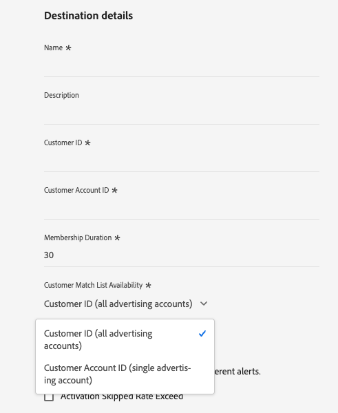

# Connexion [!DNL Microsoft Ads Customer Match] {#microsoft-ads-customer-match-destination}

>[!AVAILABILITY]
>
>Ce connecteur de destination est actuellement en disponibilité limitée. Pour en bénéficier, contactez votre représentant ou représentante Adobe.

## Vue d’ensemble {#overview}

Utilisez la destination [!DNL Microsoft Ads Customer Match] pour faire correspondre les clients par adresse e-mail et renouer le dialogue avec eux dans l’ensemble du [!DNL Microsoft Advertising Network], y compris les annonces de recherche et d’audience. Liez votre compte [!DNL Microsoft Advertising] à Real-Time CDP pour automatiser la création et la gestion des listes de correspondance client directement depuis Experience Platform.

## Cas d’utilisation {#use-cases}

Pour mieux comprendre quand et comment utiliser la destination [!DNL Microsoft Ads Customer Match], consultez les exemples de cas d’utilisation ci-dessous que la clientèle Adobe Experience Platform peut résoudre.

### Cas d’utilisation #1

Une marque d’e-commerce souhaite atteindre les clients existants par le biais de [!DNL Microsoft Search] et de [!DNL Microsoft Audience Network] afin de personnaliser les offres en fonction de leurs achats précédents et de leur historique de navigation. La marque peut ingérer des adresses e-mail dans Experience Platform à partir de son propre CRM, créer des audiences à partir de ses propres données hors ligne et envoyer ces audiences à [!DNL Microsoft Ads Customer Match] pour les utiliser dans les recherches et les annonces d’audience, optimisant ainsi ses dépenses publicitaires.

### Cas d’utilisation #2

Une entreprise de technologie a lancé un nouveau produit. Pour promouvoir ce nouveau produit, ils cherchent à sensibiliser les clients qui ont déjà acheté des produits connexes. Ils chargent les adresses e-mail de leur base de données CRM vers Experience Platform, en utilisant les adresses e-mail comme identifiants. Les audiences sont créées en fonction des clients qui possèdent des produits associés. Ces audiences sont envoyées à [!DNL Microsoft Ads Customer Match], afin que l’entreprise puisse cibler les clients actuels et les clients similaires dans l’ensemble du [!DNL Microsoft Advertising Network].

## Identités prises en charge {#supported-identities}

[!DNL Microsoft Ads Customer Match] prend en charge l’activation des identités décrites dans le tableau ci-dessous. En savoir plus sur les [identités](/help/identity-service/features/namespaces.md).

| Identité cible | Description | Considérations |
|---|---|---|
| `email` | Adresses e-mail en clair | Seules les adresses e-mail en texte brut sont prises en charge par la connexion [!DNL Microsoft Ads Customer Match]. Experience Platform hache automatiquement les adresses e-mail à l’exportation pour répondre aux exigences de Microsoft. |

{style="table-layout:auto"}

## Audiences prises en charge {#supported-audiences}

Cette section décrit les types d’audiences que vous pouvez exporter vers cette destination.

| Origine de l’audience | Pris en charge | Description |
|---------|----------|----------|
| [!DNL Segmentation Service] | Oui | Audiences générées via Experience Platform [Segmentation Service](../../../segmentation/home.md). |
| Toutes les autres origines d’audience | Oui | Cette catégorie inclut toutes les origines d’audience en dehors des audiences générées par le [!DNL Segmentation Service]. Découvrez les [différentes origines d’audience](/help/segmentation/ui/audience-portal.md#customize). Voici quelques exemples : <ul><li> audiences de chargement personnalisées [importées](../../../segmentation/ui/audience-portal.md#import-audience) dans Experience Platform à partir de fichiers CSV,</li><li> les audiences semblables, </li><li> les audiences fédérées, </li><li> les audiences générées dans d’autres applications Experience Platform telles que Adobe Journey Optimizer, </li><li> et plus encore. </li></ul> |

{style="table-layout:auto"}

Audiences prises en charge par type de données d’audience :

| Type de données d’audience | Pris en charge | Description | Cas d’utilisation |
|--------------------|-----------|-------------|-----------|
| [Audiences de personnes](/help/segmentation/types/people-audiences.md) | Oui | En fonction des profils client, ce qui vous permet de cibler des groupes spécifiques de personnes pour les campagnes marketing. | Acheteurs fréquents, personnes abandonnant leur panier |
| [Audiences de compte](/help/segmentation/types/account-audiences.md) | Non | Ciblez des individus au sein d’organisations spécifiques pour les stratégies marketing basées sur les comptes. | Marketing B2B |
| [Audiences de prospects ](/help/segmentation/types/prospect-audiences.md) | Non | Ciblez les individus qui ne sont pas encore clients, mais qui partagent des caractéristiques avec votre audience cible. | Prospection à l’aide de données tierces |
| [Exportations de jeux de données](/help/catalog/datasets/overview.md) | Non | Collections de données structurées stockées dans le lac de données Adobe Experience Platform. | Rapports, workflows de science des données |

{style="table-layout:auto"}

## Type et fréquence d’exportation {#export-type-frequency}

Reportez-vous au tableau ci-dessous pour plus d’informations sur le type et la fréquence d’exportation des destinations.

| Élément | Type | Notes |
|---------|----------|---------|
| Type d’exportation | **[!UICONTROL Audience export]** | Vous exportez tous les membres d’une audience avec les identifiants (adresses e-mail) utilisés dans la destination [!DNL Microsoft Ads Customer Match]. |
| Fréquence des exportations | **[!UICONTROL Streaming]** | Les destinations de diffusion en continu sont des connexions basées sur l’API « toujours actives ». Dès qu’un profil est mis à jour dans Experience Platform en fonction de l’évaluation des audiences, le connecteur envoie la mise à jour en aval vers la plateforme de destination. En savoir plus sur les [destinations de diffusion en continu](/help/destinations/destination-types.md#streaming-destinations). |

{style="table-layout:auto"}

## Conditions préalables {#prerequisites}

Pour envoyer des données d’audience à [!DNL Microsoft Ads], vous devez disposer d’un compte [!DNL Microsoft Advertising] actif. Pour plus d’informations sur la création d’un compte, consultez la [documentation Microsoft Advertising](https://help.ads.microsoft.com/#apex/ads/en/53090/0).

### Accepter les conditions générales de la correspondance client {#accept-customer-match-terms}

Avant d’activer des audiences via cette destination, vous devez d’abord créer manuellement une liste de correspondance de clients dans votre compte [!DNL Microsoft Advertising]. Cette première création manuelle est nécessaire pour accepter les conditions générales de correspondance client, ce qui permet de créer automatiquement des audiences envoyées depuis Experience Platform. L’échec de cette étape peut entraîner des erreurs lors de l’activation des audiences.

### Configuration du compte {#account-configuration}

Lors de la configuration de la destination, vous devez fournir les informations suivantes :

* [!UICONTROL Customer ID] : votre ID de client (CID) [!DNL Microsoft Ads], au format entier. Consultez la [documentation Microsoft Advertising](https://learn.microsoft.com/en-us/advertising/guides/get-started?view=bingads-13#get-ids) pour obtenir des instructions sur la recherche de votre ID client.
* [!UICONTROL Customer Account ID] : l’identifiant de votre compte client [!DNL Microsoft Ads]. Consultez la [documentation Microsoft Advertising](https://learn.microsoft.com/en-us/advertising/guides/get-started?view=bingads-13#get-ids) pour obtenir des instructions sur la recherche de votre ID de compte client.

## Se connecter à la destination {#connect}

>[!IMPORTANT]
> 
>Pour vous connecter à la destination, vous avez besoin des **[!UICONTROL View Destinations]** et **[!UICONTROL Manage Destinations]** [autorisations de contrôle d’accès](/help/access-control/home.md#permissions). Lisez la [présentation du contrôle d’accès](/help/access-control/ui/overview.md) ou contactez votre administrateur ou administratrice du produit pour obtenir les autorisations requises.

Pour vous connecter à cette destination, procédez comme décrit dans le [tutoriel sur la configuration des destinations](../../ui/connect-destination.md).

### Renseigner les détails de la destination {#parameters}

>[!CONTEXTUALHELP]
>id="platform_destinations_microsoft_ads_cm_customer_id"
>title="Identifiant client"
>abstract="Votre identifiant client Microsoft Advertising, également appelé identifiant de compte Manager. Il s’agit de l’identifiant de niveau supérieur dans Microsoft Advertising qui peut comporter plusieurs comptes d’annonceurs (ID de compte client)."
>additional-url="https://learn.microsoft.com/en-us/advertising/guides/get-started?view=bingads-13#get-ids" text="Trouver votre ID de client"

>[!CONTEXTUALHELP]
>id="platform_destinations_microsoft_ads_cm_customer_account_id"
>title="ID de compte client"
>abstract="Votre ID de compte client Microsoft Advertising, également appelé ID de compte publicitaire. Ceci identifie un compte publicitaire spécifique sous votre ID de client."
>additional-url="https://learn.microsoft.com/en-us/advertising/guides/get-started?view=bingads-13#get-ids" text="Trouver votre ID de compte client"

>[!CONTEXTUALHELP]
>id="platform_destinations_microsoft_ads_cm_membership_duration"
>title="Durée de l’abonnement"
>abstract="Nombre de jours pendant lesquels un utilisateur reste dans la liste de correspondance client. Les valeurs acceptées sont comprises entre 1 et 390 jours."

>[!CONTEXTUALHELP]
>id="platform_destinations_microsoft_ads_cm_list_availability"
>title="Disponibilité de la liste de correspondance client"
>abstract="Choisissez si la liste de correspondance des clients est disponible pour un compte d’annonceur unique ou pour tous les comptes sous le compte de responsable. Sélectionnez ID de client pour que la liste soit disponible pour tous les comptes d’annonceurs sous votre ID de client. Sélectionnez ID de compte client pour restreindre la liste à l’ID de compte client spécifique."
>additional-url="https://help.ads.microsoft.com/apex/index/3/en/56727" text="En savoir plus sur le partage de listes d’audiences dans Microsoft Advertising"

Pendant la [configuration](../../ui/connect-destination.md) de cette destination, vous devez fournir les informations suivantes :

* **[!UICONTROL Name]** : nom par lequel vous reconnaîtrez cette destination à l’avenir.
* **[!UICONTROL Description]** : une description qui vous aidera à identifier cette destination à l’avenir.
* **[!UICONTROL Customer ID]** : votre ID de client [!DNL Microsoft Ads] (CID). Consultez la [documentation Microsoft Advertising](https://learn.microsoft.com/en-us/advertising/guides/get-started?view=bingads-13#get-ids) pour obtenir des instructions sur la recherche de votre ID client.
* **[!UICONTROL Customer Account ID]** : ID de votre compte client [!DNL Microsoft Ads]. Consultez la [documentation Microsoft Advertising](https://learn.microsoft.com/en-us/advertising/guides/get-started?view=bingads-13#get-ids) pour obtenir des instructions sur la recherche de votre ID de compte client.
* **[!UICONTROL Membership Duration]** : nombre de jours pendant lesquels un utilisateur reste dans la liste de correspondance client. Les valeurs acceptées sont comprises entre 1 et 390 jours.
* **[!UICONTROL Customer Match List Availability]** : sélectionnez la disponibilité de la liste de correspondance des clients. En [!DNL Microsoft Advertising], un ID de client peut comporter plusieurs ID de compte client (comptes publicitaires). Sélectionnez **[!UICONTROL Customer ID (all advertising accounts)]** pour que la liste soit disponible pour tous les comptes d’annonceurs sous votre ID client ou **[!UICONTROL Customer Account ID (single advertising account)]** pour limiter la liste à l’ID de compte client spécifique que vous avez fourni ci-dessus. Consultez la [documentation Microsoft Advertising](https://help.ads.microsoft.com/apex/index/3/en/56727) pour plus d’informations.

### Activer les alertes {#enable-alerts}

Vous pouvez activer les alertes pour recevoir des notifications sur le statut de votre flux de données vers votre destination. Sélectionnez une alerte dans la liste et abonnez-vous à des notifications concernant le statut de votre flux de données. Pour plus d’informations sur les alertes, consultez le guide sur l’[abonnement aux alertes des destinations dans l’interface utilisateur](../../ui/alerts.md).

Lorsque vous avez terminé de renseigner les détails sur votre connexion de destination, sélectionnez **[!UICONTROL Next]**.

## Activer des audiences vers cette destination {#activate}

>[!IMPORTANT]
> 
>* Pour activer les données, vous avez besoin des autorisations de contrôle d’accès **[!UICONTROL View Destinations]**, **[!UICONTROL Activate Destinations]**, **[!UICONTROL View Profiles]** et **[!UICONTROL View Segments]** [Access control](/help/access-control/home.md#permissions). Lisez la [présentation du contrôle d’accès](/help/access-control/ui/overview.md) ou contactez votre administrateur ou administratrice du produit pour obtenir les autorisations requises.
>* Pour exporter des *identités* vers des destinations, vous avez besoin de l’autorisation de contrôle d’accès **[!UICONTROL View Identity Graph]**[ access control](/help/access-control/home.md#permissions).   {width="100" zoomable="yes"}

Voir [Activer les données d’audience vers des destinations d’export d’audiences en flux continu](../../ui/activate-segment-streaming-destinations.md) pour obtenir des instructions sur l’activation des audience vers cette destination.

### Mappage {#mapping}

À l’étape **[!UICONTROL Mapping]**, vous devez mapper l’identité e-mail de vos profils sources à l’identité cible dans [!DNL Microsoft Ads Customer Match].

* **Champ Source** : sélectionnez `IdentityMap: Email` comme champ source pour mapper les identités d’e-mail à partir de vos profils. Vous pouvez également sélectionner un attribut XDM tel que `personalEmail.address` comme champ source.
* **Champ cible** : sélectionnez `Identity: email` comme champ cible.

>[!IMPORTANT]
>
>Vous devez utiliser des champs sources non hachés (texte brut). N’utilisez pas d’identités source préhachées telles que `Emails (SHA256, lowercased)`. Experience Platform hache automatiquement les adresses e-mail à l’exportation pour répondre aux exigences de Microsoft.

Image de l’interface utilisateur 

## Données exportées {#exported-data}

Pour vérifier si les données ont bien été exportées vers la destination [!DNL Microsoft Ads Customer Match], vérifiez votre compte [!DNL Microsoft Advertising]. Si l’activation a réussi, les audiences sont renseignées dans votre compte en tant que listes de correspondance de clients.

## Ressources supplémentaires {#additional-resources}

Reportez-vous au Centre d’aide Microsoft Advertising  pour plus d’informations.
