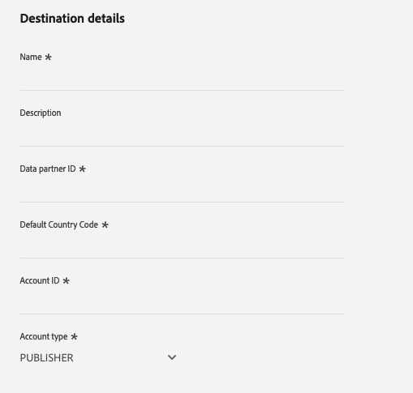

# Destination PubMatic Connect {#pubmatic-connect}

## Vue d’ensemble {#overview}

Utilisation [!DNL PubMatic Connect] pour optimiser la valeur client en fournissant la chaîne d’approvisionnement de marketing numérique programmatique de l’avenir. [!DNL PubMatic Connect] combine la technologie de plateforme et un service dédié pour améliorer la manière dont l’inventaire et les données sont empaquetés et transactionnels.

Utilisez cette destination pour envoyer des données d’audience à la plateforme [!DNL PubMatic Connect].

>[!IMPORTANT]
>
>La page de documentation et le connecteur de destination sont créés et conservés par la fonction [!DNL PubMatic] l&#39;équipe. Pour toute demande de renseignements ou de mise à jour, contactez-les directement à l’adresse `support@pubmatic.com`.

## Cas d’utilisation {#use-cases}

Pour mieux comprendre quand et comment utiliser la destination [!DNL PubMatic Connect], consultez l’exemple de cas d’utilisation ci-dessous que les clientes et clients d’Adobe Experience Platform peuvent résoudre à l’aide de cette destination.

### Ciblage des utilisateurs sur des plateformes mobiles, web et CTV {#targeting}

Les éditeurs ou les fournisseurs de données souhaitent envoyer des audiences de Adobe Experience Platform vers [!DNL PubMatic Connect] pour cibler les utilisateurs sur des plateformes mobiles, web et CTV, à l’aide d’un large éventail d’identifiants.

## Conditions préalables {#prerequisites}

Parlez à votre [!DNL PubMatic] Gestionnaire de compte pour vous assurer que votre compte est correctement configuré et prend en charge l’intégration des segments d’audience. Ils s’assureront également que vous disposez de tous les détails pertinents pour utiliser cette destination et pour vous fournir une assistance lors de la configuration.

## Identités prises en charge {#supported-identities}

[!DNL PubMatic Connect] prend en charge l’activation des identités décrites dans le tableau ci-dessous. En savoir plus sur les [identités](/help/identity-service/features/namespaces.md).

| Identité cible | Description | Considérations |
| --------------- | ------ | --- |
| GAID | GOOGLE ADVERTISING ID | Sélectionnez l’identité cible GAID lorsque votre identité source est un espace de noms GAID. |
| IDFA | Identifiant Apple pour les annonceurs | Sélectionnez l’identité cible IDFA lorsque votre identité source est un espace de noms IDFA. |
| extern_id | ID utilisateur personnalisés | Sélectionnez cette identité cible lorsque votre identité source est un espace de noms personnalisé. |

{style="table-layout:auto"}

## Audiences prises en charge {#supported-audiences}

Cette section décrit le type d’audiences que vous pouvez exporter vers cette destination.

| Origine de l’audience | Pris en charge | Description |
| --- | --------- | ------ |
| [!DNL Segmentation Service] | ✓ | Audiences générées par l’Experience Platform [Segmentation Service](../../../segmentation/home.md). |
| Chargements personnalisés | ✓ | Audiences [importées](../../../segmentation/ui/audience-portal.md#import-audience) dans Experience Platform à partir de fichiers CSV. |

{style="table-layout:auto"}

## Type et fréquence d’exportation {#export-type-frequency}

Reportez-vous au tableau ci-dessous pour plus d’informations sur le type et la fréquence d’exportation des destinations.

| Élément | Type | Notes |
| --- | --- | --- |
| Type d’exportation | **[!UICONTROL Exportation des segments]** | Vous exportez tous les membres d’un segment (audience) avec les identifiants (nom, numéro de téléphone ou autres) utilisés dans la destination PubMatic Connect. |
| Fréquence des exportations | **[!UICONTROL Diffusion en continu]** | Les destinations de diffusion en continu sont des connexions basées sur l’API « toujours actives ». Lorsqu’un profil est mis à jour dans Experience Platform en fonction de l’évaluation des segments, le connecteur envoie la mise à jour en aval vers la plateforme de destination. En savoir plus sur les [destinations de diffusion en continu](/help/destinations/destination-types.md#streaming-destinations). |

{style="table-layout:auto"}

## Se connecter à la destination {#connect}

>[!IMPORTANT]
>
> Pour vous connecter à la destination, vous devez disposer de l’[autorisation de contrôle d’accès](/help/access-control/home.md#permissions) **[!UICONTROL Gérer les destinations]**. Lisez la [présentation du contrôle d’accès](/help/access-control/ui/overview.md) ou contactez votre administrateur de produit pour obtenir les autorisations requises.

Pour vous connecter à cette destination, procédez comme décrit dans le [tutoriel sur la configuration des destinations](../../ui/connect-destination.md). Dans le workflow de configuration des destinations, renseignez les champs répertoriés dans les deux sections ci-dessous.

### S’authentifier auprès de la destination {#authenticate}

Pour vous authentifier à la destination, renseignez les champs requis et sélectionnez **[!UICONTROL Se connecter à la destination]**.

- **[!UICONTROL Jeton porteur]** : renseignez le jeton porteur pour vous authentifier sur la destination.

### Renseigner les détails de la destination {#destination-details}

Pour configurer les détails de la destination, renseignez les champs obligatoires et facultatifs ci-dessous. Un astérisque situé en regard d’un champ de l’interface utilisateur indique que le champ est obligatoire.

- **[!UICONTROL Nom]** : un nom par lequel vous reconnaîtrez cette destination à l’avenir.
- **[!UICONTROL Description]** : une description qui vous aidera à identifier cette destination à l’avenir.
- **[!UICONTROL Identifiant du partenaire de données]**: identifiant de partenaire de données configuré dans votre [!DNL PubMatic] pour cette intégration.
- **[!UICONTROL Code pays par défaut]**: code de pays par défaut qui doit être appliqué à toutes les identités si aucun n’est fourni dans le profil.
- **[!UICONTROL Identifiant de compte]**: votre [!DNL PubMatic Connect] ID de compte.
- **[!UICONTROL Type de compte]**: le type de compte de votre [!DNL PubMatic] compte Platform. Parlez à votre [!DNL PubMatic] gestionnaire de compte si vous avez des questions à choisir. Les options disponibles sont les suivantes :
   - [!UICONTROL ÉDITEUR]
   - [!UICONTROL DEMAND_PARTNER]
   - [!UICONTROL ACHETEUR]

### Activer les alertes {#enable-alerts}

Vous pouvez activer les alertes pour recevoir des notifications sur le statut de votre flux de données vers votre destination. Sélectionnez une alerte dans la liste et abonnez-vous à des notifications concernant le statut de votre flux de données. Pour plus d’informations sur les alertes, consultez le guide sur l’[abonnement aux alertes des destinations dans l’interface utilisateur](../../ui/alerts.md).

Lorsque vous avez terminé de renseigner les détails sur votre connexion de destination, sélectionnez **[!UICONTROL Suivant]**.

## Activer des segments vers cette destination {#activate}

>[!IMPORTANT]
>
> - Pour activer les données, vous avez besoin de l’événement **[!UICONTROL Affichage des destinations]**, **[!UICONTROL Activation des destinations]**, **[!UICONTROL Afficher les profils]**, et **[!UICONTROL Affichage de segments]** [autorisations de contrôle d’accès](/help/access-control/home.md#permissions). Lisez la [présentation du contrôle d’accès](/help/access-control/ui/overview.md) ou contactez votre administrateur ou administratrice du produit pour obtenir les autorisations requises.
>
> - Pour exporter _identités_, vous avez besoin de la fonction **[!UICONTROL Affichage du graphique des identités]** [autorisation de contrôle d’accès](/help/access-control/home.md#permissions).   {width="100" zoomable="yes"}

Consultez [Activer les profils et les segments vers les destinations d’exportation de segments de diffusion en continu](/help/destinations/ui/activate-segment-streaming-destinations.md) pour obtenir des instructions sur l’activation des segments d’audience vers cette destination.

### Mapper les attributs et les identités {#map}

Sélection des champs sources :

- Sélectionnez un identifiant (généralement des espaces de noms tels que IDFA ou un espace de noms d’identifiant personnalisé).

Sélection des champs cibles :

- Parlez à votre [!DNL PubMatic] Gestionnaire de compte pour obtenir les informations sur le type d’UID correct au cours de cette étape.
- Sélectionnez la variable [!DNL PubMatic UID] type number correspondant à l’identifiant que vous avez sélectionné à la première étape.

## Données exportées / Valider l’exportation des données {#exported-data}

La variable [!DNL PubMatic] L’interface utilisateur vous permet de vérifier si les données ont été correctement transmises et si les segments sont disponibles. Cela peut prendre jusqu’à 24 heures après que les données ont été poussées pour la variable [!DNL PubMatic] Interface utilisateur à mettre à jour.

## Utilisation et gouvernance des données {#data-usage-governance}

Lors de la gestion de vos données, toutes les destinations [!DNL Adobe Experience Platform] se conforment aux politiques d’utilisation des données. Pour obtenir des informations détaillées sur la manière dont [!DNL Adobe Experience Platform] applique la gouvernance des données, consultez la [Présentation de la gouvernance des données](/help/data-governance/home.md).
